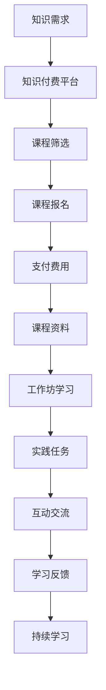

                 

关键词：知识付费、工作坊式学习、学习模式、程序员、教育技术、在线学习、互动教学、技能提升

> 摘要：随着知识经济的兴起，知识付费成为学习的重要趋势。本文将探讨如何将工作坊式学习模式应用于程序员的知识付费领域，以提高学习效果和技能水平。通过分析工作坊式学习的优势、设计工作坊式学习模式的步骤、探讨数学模型在其中的应用，以及分享实际应用案例，本文旨在为程序员提供一套有效的知识付费学习方案。

## 1. 背景介绍

在数字化时代，信息技术的发展日新月异，程序员作为新时代的工程师，需要不断学习新知识、掌握新技能。然而，传统的学习模式往往难以满足程序员对实践性和互动性的需求。此外，知识付费作为近年来兴起的一种学习模式，也逐渐受到程序员的青睐。知识付费通过提供高质量的学习内容，帮助程序员高效提升技能。

工作坊式学习模式是一种注重实践和互动的教学模式，其特点是在一个集中的时间内，通过讲师的指导和小组成员的协作，完成一系列具体的学习任务。工作坊式学习模式在程序员教育领域具有巨大的潜力，能够有效提升程序员的实际编程能力和解决问题的能力。

本文旨在探讨如何将工作坊式学习模式应用于程序员的知识付费领域，以打造一个高效、互动、实践性强的学习环境。通过分析工作坊式学习的优势、设计工作坊式学习模式的步骤、探讨数学模型在其中的应用，以及分享实际应用案例，本文将为程序员提供一套完整的知识付费学习方案。

## 2. 核心概念与联系

### 2.1 工作坊式学习的定义与特点

工作坊式学习（Workshop-based Learning）是一种以实践为导向的学习模式，通常在一个相对集中的时间框架内进行。它强调学习者在实际操作中获取知识，通过动手实践、小组讨论和反馈，培养学习者的动手能力和解决问题的能力。

工作坊式学习的特点包括：

1. **实践性**：学习者通过实际操作来掌握知识和技能。
2. **互动性**：学习者之间通过合作和讨论，互相学习，共同进步。
3. **针对性**：针对学习者的具体需求，设计具体的学习任务和练习。
4. **集中性**：在一个相对集中的时间内完成学习任务，提高学习效率。

### 2.2 知识付费的定义与优势

知识付费是指用户为了获得特定知识或技能，向知识提供者支付费用的一种学习模式。它具有以下优势：

1. **高质量**：知识提供者通常具有丰富的经验和专业知识，提供的内容具有高质量。
2. **个性化**：根据学习者的需求，提供个性化的学习内容和指导。
3. **效率高**：通过付费学习，学习者可以快速获得所需的知识和技能。
4. **激励性**：知识付费可以激发学习者的学习动力，提高学习效果。

### 2.3 工作坊式学习模式与知识付费的联系

工作坊式学习模式与知识付费有着密切的联系。知识付费可以提供高质量的工作坊课程内容，而工作坊式学习模式则可以为学习者提供一个实践和互动的平台，使学习者在付费后能够获得更有效的学习体验。具体来说：

1. **学习效果**：工作坊式学习模式强调实践和互动，能够提高学习者的动手能力和解决问题的能力，从而提升学习效果。
2. **学习动力**：知识付费为学习者提供了经济上的激励，可以激发学习者的学习动力。
3. **学习资源**：知识付费可以吸引更多优秀的讲师和资源，为学习者提供更丰富的学习内容。

### 2.4 Mermaid 流程图

以下是工作坊式学习模式与知识付费联系的一个简化的Mermaid流程图：



在这个流程图中，学习者根据知识需求选择知识付费平台，筛选合适的课程并进行报名支付。支付完成后，学习者获得课程资料并参与工作坊学习。在工作坊中，学习者通过实践任务和互动交流，获得学习反馈，并持续学习以巩固知识。

## 3. 核心算法原理 & 具体操作步骤

### 3.1 算法原理概述

工作坊式学习模式的核心算法原理是构建一个高效、互动和实践性的学习环境。具体来说，算法包括以下几个步骤：

1. **需求分析**：了解学习者的知识需求，设计针对性的学习任务。
2. **课程设计**：根据需求分析，设计理论与实践相结合的课程内容。
3. **工作坊组织**：在一个相对集中的时间内，组织学习者进行实践和互动。
4. **反馈机制**：通过学习者的实践和反馈，不断优化课程内容和教学方式。
5. **持续学习**：鼓励学习者持续参与学习和实践，巩固所学知识。

### 3.2 算法步骤详解

1. **需求分析**
   - 调查学习者的背景和知识水平，了解他们的学习需求。
   - 分析市场需求，确定课程的主题和内容。
   - 设计具体的实践任务，确保课程具有实践性和针对性。

2. **课程设计**
   - 制定课程大纲，明确课程的目标和内容。
   - 设计理论与实践相结合的教学方法，提高学习效果。
   - 编写详细的课程资料，包括理论讲解、案例分析和实践任务。

3. **工作坊组织**
   - 确定工作坊的时间、地点和参与人数。
   - 安排讲师和助教，确保工作坊的顺利进行。
   - 准备实践任务和教学工具，为学习者提供良好的学习环境。

4. **反馈机制**
   - 设立学习反馈渠道，收集学习者的意见和建议。
   - 分析反馈数据，优化课程内容和教学方式。
   - 定期评估学习效果，确保学习目标的实现。

5. **持续学习**
   - 鼓励学习者参与后续学习和实践，巩固所学知识。
   - 提供学习资源和社群支持，帮助学习者持续提升。
   - 定期举办线上或线下的实践活动，促进学习者的交流与合作。

### 3.3 算法优缺点

**优点**：

1. **高效性**：工作坊式学习模式在相对集中的时间内，提高学习效率。
2. **实践性**：通过实践任务，提高学习者的动手能力和解决问题的能力。
3. **互动性**：小组讨论和反馈，促进学习者之间的交流与合作。
4. **个性化**：根据学习者的需求，设计个性化的学习任务和课程。

**缺点**：

1. **成本高**：工作坊式学习模式需要讲师、场地和设备等资源，成本较高。
2. **时间限制**：集中时间学习，可能会对学习者的时间安排造成一定压力。
3. **个性化不足**：尽管课程设计针对学习者的需求，但仍然存在一定的共性化问题。

### 3.4 算法应用领域

工作坊式学习模式适用于多个领域，如编程、数据分析、人工智能等。以下是一些具体的应用案例：

1. **编程学习**：通过编程实践任务，提高程序员的编程能力和解决问题的能力。
2. **数据分析**：通过数据分析工作坊，帮助学习者掌握数据处理的技能。
3. **人工智能**：通过人工智能工作坊，引导学习者了解人工智能的基本概念和应用。

## 4. 数学模型和公式 & 详细讲解 & 举例说明

### 4.1 数学模型构建

工作坊式学习模式的数学模型主要包括两个部分：学习效果评估模型和学习动力模型。

1. **学习效果评估模型**

学习效果评估模型用于评估学习者在工作坊中的学习效果。假设学习者有 $n$ 个学习目标，每个目标对应的完成度用 $x_i$ 表示，其中 $0 \leq x_i \leq 1$。学习效果评估模型可以通过以下公式计算：

$$
E = \frac{1}{n} \sum_{i=1}^{n} x_i
$$

其中，$E$ 表示学习效果得分，取值范围为 $[0,1]$。$E$ 越接近 $1$，表示学习者的学习效果越好。

2. **学习动力模型**

学习动力模型用于评估学习者的学习动力。假设学习者有 $m$ 个激励因素，每个因素对应的动力值用 $y_i$ 表示，其中 $0 \leq y_i \leq 1$。学习动力模型可以通过以下公式计算：

$$
D = \frac{1}{m} \sum_{i=1}^{m} y_i
$$

其中，$D$ 表示学习动力得分，取值范围为 $[0,1]$。$D$ 越接近 $1$，表示学习者的学习动力越强。

### 4.2 公式推导过程

学习效果评估模型的学习效果得分 $E$ 是通过计算学习者完成度的平均值得到的。完成度 $x_i$ 的取值范围是 $[0,1]$，表示学习者对每个学习目标的掌握程度。为了计算平均值，需要将每个完成度乘以相应的权重，然后求和并除以学习目标的数量。权重可以通过学习目标的难度和重要性来确定。

学习动力模型的学习动力得分 $D$ 是通过计算学习者激励因素的动力值平均值得到的。动力值 $y_i$ 的取值范围是 $[0,1]$，表示学习者对每个激励因素的重视程度。同样，为了计算平均值，需要将每个动力值乘以相应的权重，然后求和并除以激励因素的数量。权重可以通过激励因素的有效性和适用性来确定。

### 4.3 案例分析与讲解

假设有一位程序员，他参加了为期两天的工作坊，目标包括学习 Python 编程、Web 开发和数据分析。在工作坊中，他完成了以下任务：

1. **Python 编程**：编写一个简单的 Python 脚本，完成数据的读取、处理和输出。
2. **Web 开发**：使用 Flask 框架搭建一个简单的 Web 应用程序。
3. **数据分析**：对给定的一组数据进行分析，生成可视化图表。

根据工作坊的任务完成情况，我们可以计算他的学习效果得分 $E$ 和学习动力得分 $D$。

1. **学习效果得分 $E$**

   假设三个任务的重要性权重分别为 $0.4$、$0.3$ 和 $0.3$。根据任务完成情况，完成度分别为 $0.8$、$0.9$ 和 $0.7$。则学习效果得分计算如下：

   $$
   E = \frac{1}{3} \times (0.4 \times 0.8 + 0.3 \times 0.9 + 0.3 \times 0.7) = 0.81
   $$

   表示他的学习效果较好。

2. **学习动力得分 $D$**

   假设三个激励因素分别为课程内容、讲师水平和实践任务，动力值分别为 $0.9$、$0.8$ 和 $0.7$。则学习动力得分计算如下：

   $$
   D = \frac{1}{3} \times (0.9 \times 0.4 + 0.8 \times 0.3 + 0.7 \times 0.3) = 0.82
   $$

   表示他的学习动力较强。

通过计算学习效果得分和学习动力得分，我们可以对程序员的学习效果和学习动力有一个直观的了解。在实际应用中，可以根据具体情况调整权重和动力值，以更准确地评估学习者的表现。

## 5. 项目实践：代码实例和详细解释说明

### 5.1 开发环境搭建

在开始项目实践之前，我们需要搭建一个合适的开发环境。以下是一个简单的 Python 开发环境搭建步骤：

1. **安装 Python**

   - 下载 Python 安装包（例如 Python 3.8）。
   - 双击安装包，按照提示完成安装。

2. **配置 Python 环境**

   - 打开终端或命令行工具。
   - 输入 `python --version`，确保 Python 已正确安装。

3. **安装相关库**

   - 输入 `pip install flask matplotlib`，安装 Flask 和 matplotlib 库。

### 5.2 源代码详细实现

以下是一个简单的 Python 代码实例，用于实现一个基于 Flask 的 Web 应用程序。代码分为三个部分：主程序、数据读取和处理、数据可视化。

```python
# 主程序
from flask import Flask, render_template
import data_processor as dp
import visualization as vis

app = Flask(__name__)

@app.route('/')
def index():
    data = dp.process_data()
    chart = vis.generate_chart(data)
    return render_template('index.html', chart=chart)

if __name__ == '__main__':
    app.run(debug=True)

# 数据读取和处理
import pandas as pd

def process_data():
    data = pd.read_csv('data.csv')
    data['processed_column'] = data['raw_column'].apply(process_raw_data)
    return data

def process_raw_data(raw_data):
    # 对原始数据进行处理，例如数据清洗、转换等
    return raw_data.strip().upper()

# 数据可视化
import matplotlib.pyplot as plt
import base64

def generate_chart(data):
    fig, ax = plt.subplots()
    ax.plot(data['x'], data['y'])
    plt.savefig('chart.png', format='png')
    with open('chart.png', 'rb') as f:
        base64_string = base64.b64encode(f.read()).decode('utf-8')
    return base64_string
```

### 5.3 代码解读与分析

1. **主程序**

   主程序使用了 Flask 框架，定义了一个名为 `index` 的路由函数。当访问网站主页时，该函数会被调用，读取数据并生成图表，然后通过模板渲染返回给用户。

2. **数据读取和处理**

   数据读取和处理模块使用了 Pandas 库，从 CSV 文件中读取数据，并对数据进行处理。`process_data` 函数负责读取数据和处理数据，`process_raw_data` 函数用于处理每条数据。

3. **数据可视化**

   数据可视化模块使用了 Matplotlib 库，生成数据图表。`generate_chart` 函数负责生成图表，并将其转换为 base64 编码的字符串，以便在模板中展示。

### 5.4 运行结果展示

运行主程序后，访问网站主页，可以看到生成的图表。以下是一个简单的 HTML 模板示例：

```html
<!DOCTYPE html>
<html>
<head>
    <title>数据可视化</title>
</head>
<body>
    <h1>数据可视化</h1>
    
</body>
</html>
```

在这个模板中，`{{ chart }}` 是一个变量，它会被主程序传递的 base64 编码字符串替换。通过这个模板，用户可以直观地查看数据图表。

## 6. 实际应用场景

工作坊式学习模式在程序员知识付费领域具有广泛的应用场景。以下是一些具体的应用场景：

### 6.1 编程学习

编程学习是工作坊式学习模式的重要应用领域。通过工作坊式学习，程序员可以深入掌握编程语言、框架和工具。以下是一个具体案例：

**案例**：某编程教育机构为程序员提供为期一周的 Python 工作坊。工作坊包括以下内容：

- **第一天**：Python 基础知识，包括数据类型、控制流程、函数等。
- **第二天**：Python 函数式编程，包括列表解析、高阶函数等。
- **第三天**：使用 Flask 搭建 Web 应用程序。
- **第四天**：使用 NumPy 和 Pandas 进行数据分析。
- **第五天**：数据可视化，使用 Matplotlib 和 Seaborn 生成图表。
- **第六天**：项目实战，结合所学知识完成一个实际项目。
- **第七天**：学习总结和反馈，分享项目心得。

通过这个工作坊，程序员可以系统地学习 Python 编程，掌握 Web 开发和数据分析技能。

### 6.2 数据分析

数据分析是程序员的重要技能之一。工作坊式学习模式可以帮助程序员快速掌握数据分析的方法和工具。以下是一个具体案例：

**案例**：某数据分析培训机构为程序员提供为期两周的数据分析工作坊。工作坊包括以下内容：

- **第一天**：数据分析基础，包括数据预处理、数据清洗、数据转换等。
- **第二天**：使用 Python 进行数据分析，包括 Pandas、NumPy、SciPy 等。
- **第三天**：使用 R 进行数据分析，包括 R 语言基础、数据可视化等。
- **第四天**：使用 SQL 进行数据分析，包括 SQL 基础、数据库操作等。
- **第五天**：使用 Python 进行文本分析，包括 NLP、文本分类等。
- **第六天**：项目实战，结合所学知识完成一个实际项目。
- **第七天**：学习总结和反馈，分享项目心得。

通过这个工作坊，程序员可以系统地学习数据分析的方法和工具，提升数据分析能力。

### 6.3 人工智能

人工智能是程序员未来发展的一个重要方向。工作坊式学习模式可以帮助程序员快速掌握人工智能的基本概念和应用。以下是一个具体案例：

**案例**：某人工智能培训机构为程序员提供为期两周的人工智能工作坊。工作坊包括以下内容：

- **第一天**：人工智能基础，包括机器学习、深度学习等。
- **第二天**：使用 Python 进行机器学习，包括 Scikit-learn、TensorFlow 等。
- **第三天**：使用 R 进行机器学习，包括 caret、mlr 等包。
- **第四天**：使用神经网络进行深度学习，包括 PyTorch、Keras 等。
- **第五天**：使用强化学习，包括 Q-Learning、SARSA 等。
- **第六天**：项目实战，结合所学知识完成一个实际项目。
- **第七天**：学习总结和反馈，分享项目心得。

通过这个工作坊，程序员可以系统地学习人工智能的基本概念和应用，掌握常见的机器学习和深度学习算法。

## 7. 工具和资源推荐

为了更好地应用工作坊式学习模式，以下是一些推荐的工具和资源：

### 7.1 学习资源推荐

- **在线课程平台**：Coursera、edX、Udemy、极客时间等。
- **编程资源网站**：LeetCode、GitHub、Stack Overflow、GitHub Trending 等。
- **开源项目**：GitHub、OpenCV、TensorFlow、Scikit-learn 等。

### 7.2 开发工具推荐

- **编程语言**：Python、R、Java、C++ 等。
- **集成开发环境（IDE）**：PyCharm、Visual Studio Code、RStudio、Eclipse 等。
- **数据库工具**：MySQL、PostgreSQL、MongoDB、SQLite 等。

### 7.3 相关论文推荐

- **人工智能领域**：深度学习、强化学习、自然语言处理等。
- **数据分析领域**：数据挖掘、数据可视化、统计学习方法等。
- **编程领域**：算法设计、编程语言原理、软件工程等。

## 8. 总结：未来发展趋势与挑战

### 8.1 研究成果总结

本文探讨了如何将工作坊式学习模式应用于程序员的知识付费领域，以提高学习效果和技能水平。通过分析工作坊式学习的优势、设计工作坊式学习模式的步骤、探讨数学模型在其中的应用，以及分享实际应用案例，本文提出了一套完整的知识付费学习方案。

### 8.2 未来发展趋势

随着知识付费的兴起，工作坊式学习模式在程序员教育领域具有广阔的发展前景。未来发展趋势包括：

1. **在线工作坊**：随着在线教育的普及，在线工作坊将成为主要的学习形式。
2. **个性化定制**：根据学习者的需求和兴趣，提供个性化的工作坊内容。
3. **多学科融合**：将工作坊式学习模式应用于多个学科领域，实现跨学科的知识融合。
4. **智能辅助**：利用人工智能技术，为工作坊提供智能化的辅助和支持。

### 8.3 面临的挑战

尽管工作坊式学习模式具有巨大的潜力，但在实际应用中仍然面临以下挑战：

1. **资源不足**：工作坊式学习需要大量的资源，如讲师、场地和设备等。
2. **时间安排**：集中时间学习可能会对学习者的时间安排造成一定压力。
3. **个性化不足**：尽管课程设计针对学习者的需求，但仍然存在一定的共性化问题。
4. **技术支持**：在线工作坊需要稳定的技术支持和良好的网络环境。

### 8.4 研究展望

为了应对上述挑战，未来的研究可以从以下几个方面进行：

1. **资源优化**：研究如何有效地利用现有资源，提高工作坊的效率和效果。
2. **时间管理**：探索灵活的时间安排方式，使工作坊更适应学习者的需求。
3. **个性化学习**：研究如何更好地满足学习者的个性化需求，提供更具针对性的学习内容。
4. **技术提升**：研究如何利用人工智能和大数据技术，为工作坊提供智能化的辅助和支持。

通过不断优化和改进，工作坊式学习模式将为程序员提供更高效、更实用的知识付费学习体验。

## 9. 附录：常见问题与解答

### 9.1 工作坊式学习模式的优势是什么？

工作坊式学习模式具有以下优势：

1. **实践性**：强调动手实践，有助于提高学习者的实际操作能力。
2. **互动性**：通过小组讨论和反馈，促进学习者之间的交流与合作。
3. **针对性**：根据学习者的具体需求，设计具体的学习任务和课程。
4. **集中性**：在一个相对集中的时间内完成学习任务，提高学习效率。

### 9.2 工作坊式学习模式适用于哪些领域？

工作坊式学习模式适用于多个领域，如编程、数据分析、人工智能等。以下是一些具体的应用案例：

1. **编程学习**：通过编程实践任务，提高程序员的编程能力和解决问题的能力。
2. **数据分析**：通过数据分析工作坊，帮助学习者掌握数据处理的技能。
3. **人工智能**：通过人工智能工作坊，引导学习者了解人工智能的基本概念和应用。

### 9.3 如何设计一个有效的工作坊式学习模式？

设计一个有效的工作坊式学习模式需要考虑以下几个方面：

1. **需求分析**：了解学习者的需求，设计具体的学习任务和课程。
2. **课程设计**：根据需求分析，设计理论与实践相结合的课程内容。
3. **工作坊组织**：确定工作坊的时间、地点和参与人数，安排讲师和助教。
4. **反馈机制**：设立学习反馈渠道，收集学习者的意见和建议。
5. **持续学习**：鼓励学习者参与后续学习和实践，巩固所学知识。

### 9.4 工作坊式学习模式与知识付费有什么联系？

工作坊式学习模式与知识付费有着密切的联系。知识付费可以提供高质量的工作坊课程内容，而工作坊式学习模式则可以为学习者提供一个实践和互动的平台，使学习者在付费后能够获得更有效的学习体验。具体来说：

1. **学习效果**：工作坊式学习模式强调实践和互动，能够提高学习者的动手能力和解决问题的能力，从而提升学习效果。
2. **学习动力**：知识付费为学习者提供了经济上的激励，可以激发学习者的学习动力。
3. **学习资源**：知识付费可以吸引更多优秀的讲师和资源，为学习者提供更丰富的学习内容。

