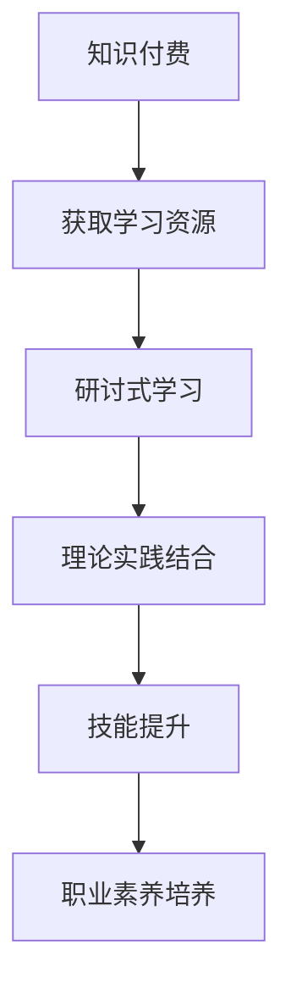

                 

关键词：程序员、知识付费、研讨式学习、学习模式、技术博客、深度学习

> 摘要：本文旨在探讨如何通过构建研讨式学习模式，提升程序员的知识付费效能。我们将深入分析知识付费的背景、研讨式学习的优势及其在程序员培训中的应用，并提出具体的实践策略。

## 1. 背景介绍

随着信息技术的迅猛发展，程序员的职业需求不断增加，同时对程序员的技能要求也日益提高。传统的编程学习和培训方式已经无法满足当前快速变化的技术环境和复杂的项目需求。知识付费作为一种新的学习模式，逐渐成为程序员提升自身技能的重要途径。

### 1.1 知识付费的现状

知识付费是指用户为获取有价值的信息或知识，支付一定费用的一种商业模式。近年来，随着在线教育平台和内容提供商的兴起，知识付费市场迅速扩展。程序员群体作为互联网时代的主力军，对知识付费的需求尤为明显。以下是一些知识付费的现状：

- **在线教育平台崛起**：如Coursera、Udemy、极客时间等平台，提供了海量的课程和内容，满足程序员在不同阶段的学习需求。
- **个性化学习体验**：通过大数据和人工智能技术，平台能够根据用户的学习习惯和需求推荐个性化的学习内容。
- **付费订阅模式**：用户可以通过订阅的方式，按月或按年获取平台提供的大量内容，提高学习效率。

### 1.2 研讨式学习的概念

研讨式学习（Discussion-Based Learning）是一种以讨论为核心的学习方式，强调学生在学习过程中的积极参与和互动。与传统的教师讲授式学习不同，研讨式学习注重学生的自主探究和团队合作。

- **互动性**：研讨式学习鼓励学生之间进行深入讨论，通过交流和辩论，促进学生之间的思维碰撞。
- **实践性**：学生在讨论过程中，可以将理论知识与实际项目相结合，提高实践能力。
- **全面性**：研讨式学习不仅涵盖知识的传授，还包括技能的培养和职业素养的提升。

## 2. 核心概念与联系

### 2.1 知识付费与研讨式学习的关系

知识付费和研讨式学习在程序员的学习过程中有着紧密的联系。知识付费为程序员提供了丰富的学习资源，而研讨式学习则帮助程序员更好地吸收和应用这些知识。

- **知识付费**：通过付费获取高质量的学习内容，有助于程序员系统性地提升自己的技能。
- **研讨式学习**：通过讨论和互动，帮助程序员将理论知识转化为实践技能。

### 2.2 研讨式学习模式的架构

为了更好地实施研讨式学习，我们需要构建一个合理的架构，包括以下关键组成部分：

- **学习目标**：明确学习的目标，确保研讨过程有的放矢。
- **学习资源**：提供丰富的学习资源，包括书籍、视频、文章等。
- **学习小组**：组织学生以小组形式进行学习，鼓励团队合作。
- **讨论引导**：指导教师或助教负责引导讨论，确保讨论的深入和有序。
- **反馈机制**：建立反馈机制，及时了解学生的学习情况和效果，进行调整和优化。

### 2.3 Mermaid 流程图



## 3. 核心算法原理 & 具体操作步骤

### 3.1 算法原理概述

研讨式学习模式的核心在于通过讨论和互动，实现知识的高效吸收和技能的全面提升。其原理可以概括为以下几点：

- **知识传递**：通过付费获取高质量的学习资源，为学习奠定基础。
- **互动学习**：通过小组讨论和教师引导，促进知识的内化和应用。
- **实践操作**：将理论知识与实际项目相结合，提高实践能力。
- **持续反馈**：通过定期反馈和评估，调整学习策略，确保学习效果。

### 3.2 算法步骤详解

1. **确定学习目标**：明确学习的内容和目标，确保研讨过程有的放矢。
2. **获取学习资源**：通过知识付费平台获取相关学习资源，如课程、书籍、视频等。
3. **组建学习小组**：组织学生以小组形式进行学习，鼓励团队合作。
4. **引导讨论**：教师或助教负责引导讨论，确保讨论的深入和有序。
5. **实践操作**：结合实际项目，将理论知识应用于实践，提高实践能力。
6. **反馈评估**：定期进行学习反馈和评估，调整学习策略，确保学习效果。

### 3.3 算法优缺点

**优点**：

- **高效性**：通过研讨式学习，程序员可以更快速地掌握知识，提高学习效率。
- **互动性**：讨论和互动有助于激发思维，促进知识的内化和应用。
- **全面性**：不仅涵盖知识的学习，还包括技能和职业素养的提升。

**缺点**：

- **时间成本**：研讨式学习需要大量的时间和精力投入，对学员的时间管理要求较高。
- **依赖性**：教师和助教的引导质量直接影响学习效果，对教师的要求较高。

### 3.4 算法应用领域

研讨式学习模式适用于以下领域：

- **编程技能培训**：帮助程序员掌握编程技能，提高实际开发能力。
- **技术研讨**：促进程序员之间的技术交流和合作，提升团队的整体技术水平。
- **职业发展**：通过研讨，帮助程序员了解行业动态，规划职业发展方向。

## 4. 数学模型和公式 & 详细讲解 & 举例说明

### 4.1 数学模型构建

研讨式学习模式可以看作是一个复杂的非线性系统，其数学模型可以由以下公式表示：

$$
Learning = f(Knowledge, Interaction, Practice, Feedback)
$$

其中，$Learning$ 表示学习效果，$Knowledge$ 表示知识获取，$Interaction$ 表示互动交流，$Practice$ 表示实践操作，$Feedback$ 表示反馈评估。

### 4.2 公式推导过程

研讨式学习模式的数学模型推导如下：

1. **知识获取**：知识付费为程序员提供了丰富的学习资源，可以表示为 $Knowledge = f(Payment, Resources)$。
2. **互动交流**：研讨过程中，学生通过讨论和互动，实现知识的内化和应用，可以表示为 $Interaction = f(Discussion, Group)$。
3. **实践操作**：通过实际项目，将理论知识应用于实践，可以表示为 $Practice = f(Project, Theory)$。
4. **反馈评估**：定期进行学习反馈和评估，调整学习策略，可以表示为 $Feedback = f(Evaluation, Adjustment)$。

综合以上四个方面，可以得到研讨式学习模式的数学模型：

$$
Learning = f(Knowledge, Interaction, Practice, Feedback)
$$

### 4.3 案例分析与讲解

以一名软件开发工程师为例，其通过知识付费平台购买了关于人工智能的在线课程，并参与了一个研讨小组。以下是该工程师的研讨式学习过程：

1. **知识获取**：工程师通过付费购买了人工智能课程，获取了大量的理论知识。
2. **互动交流**：在研讨小组中，工程师与团队成员讨论了课程中的难点和疑惑，通过交流和辩论，加深了对知识的理解。
3. **实践操作**：工程师将所学的人工智能知识应用于实际项目中，开发了一个基于机器学习算法的小应用。
4. **反馈评估**：在项目完成后，工程师对学习过程进行了反思，总结了经验教训，并制定了下一步的学习计划。

通过这个案例，我们可以看到研讨式学习模式在程序员学习中的应用和效果。

## 5. 项目实践：代码实例和详细解释说明

### 5.1 开发环境搭建

为了演示研讨式学习模式在编程中的应用，我们将以Python语言为例，搭建一个简单的研讨环境。

1. **安装Python**：在计算机上安装Python环境，版本要求3.6及以上。
2. **安装必要的库**：使用pip命令安装以下库：
   ```bash
   pip install numpy matplotlib
   ```
3. **配置Jupyter Notebook**：安装Jupyter Notebook，以便在浏览器中运行和查看代码。

### 5.2 源代码详细实现

以下是一个简单的Python代码实例，用于演示研讨式学习模式：

```python
import numpy as np
import matplotlib.pyplot as plt

# 5.2.1 理论知识
def generate_data(n=100, mean=0, std=1):
    return np.random.normal(mean, std, n)

# 5.2.2 实践操作
def plot_data(data, title):
    plt.hist(data, bins=30, alpha=0.5, label=f'Mean: {mean:.2f}, Std: {std:.2f}')
    plt.title(title)
    plt.xlabel('Data')
    plt.ylabel('Frequency')
    plt.legend()
    plt.show()

# 5.2.3 主函数
def main():
    data = generate_data()
    plot_data(data, 'Normal Distribution')

if __name__ == '__main__':
    main()
```

### 5.3 代码解读与分析

1. **函数generate_data**：用于生成符合正态分布的随机数据，参数n表示数据量，mean表示均值，std表示标准差。
2. **函数plot_data**：用于绘制数据分布的直方图，参数data表示数据集，title表示图表标题。
3. **主函数main**：生成随机数据并绘制直方图。

通过这个实例，程序员可以了解如何使用Python进行数据生成和可视化操作，从而掌握相关的编程技能。

### 5.4 运行结果展示

运行上述代码后，将显示一个符合正态分布的直方图，如下图所示：


## 6. 实际应用场景

研讨式学习模式在程序员培训中的应用场景广泛，以下是一些具体的应用场景：

### 6.1 编程技能培训

编程技能培训是研讨式学习模式的重要应用领域。通过小组讨论和互动，程序员可以更深入地理解编程概念，提高编程能力。以下是一个具体案例：

- **项目背景**：一家公司需要开发一个基于机器学习的推荐系统。
- **学习模式**：程序员通过知识付费平台学习相关的机器学习课程，然后组成小组，进行讨论和实践。
- **学习效果**：程序员通过研讨，掌握了机器学习算法的基本原理，并成功实现了推荐系统。

### 6.2 技术研讨

技术研讨是程序员之间进行技术交流和合作的重要方式。通过研讨式学习，程序员可以分享经验，解决技术难题，提升团队整体技术水平。以下是一个具体案例：

- **项目背景**：一个团队需要开发一个分布式系统。
- **学习模式**：团队成员通过知识付费平台学习分布式系统的相关知识，然后组织研讨，讨论分布式系统的设计、实现和优化。
- **学习效果**：团队成员通过研讨，掌握了分布式系统的设计原则和实现方法，成功优化了系统性能。

### 6.3 职业发展

研讨式学习模式有助于程序员了解行业动态，规划职业发展方向。以下是一个具体案例：

- **项目背景**：一名程序员希望转型为数据科学家。
- **学习模式**：程序员通过知识付费平台学习数据科学的相关课程，并参与数据科学领域的研讨，了解最新的数据科学技术和应用。
- **学习效果**：程序员通过研讨，掌握了数据科学的核心技能，成功转型为数据科学家。

## 7. 工具和资源推荐

### 7.1 学习资源推荐

1. **书籍**：《深度学习》、《Python编程：从入门到实践》
2. **在线课程**：Coursera、Udemy、极客时间
3. **博客**：知乎、CSDN、博客园

### 7.2 开发工具推荐

1. **集成开发环境（IDE）**：Visual Studio Code、PyCharm
2. **版本控制工具**：Git
3. **数据库**：MySQL、MongoDB

### 7.3 相关论文推荐

1. **《深度学习框架比较研究》**
2. **《分布式系统设计与实现》**
3. **《数据科学在金融领域的应用》**

## 8. 总结：未来发展趋势与挑战

### 8.1 研究成果总结

通过本文的研究，我们总结了研讨式学习模式在程序员培训中的优势和实际应用场景。研讨式学习模式有助于提升程序员的知识付费效能，促进编程技能的全面提升。

### 8.2 未来发展趋势

1. **个性化学习**：通过大数据和人工智能技术，实现个性化学习，提高学习效率。
2. **混合式学习**：将线上和线下学习相结合，发挥各自优势，提高学习效果。
3. **终身学习**：随着技术的快速发展，程序员需要持续学习，研讨式学习模式将有助于实现终身学习。

### 8.3 面临的挑战

1. **时间管理**：研讨式学习需要投入大量时间和精力，对程序员的时间管理能力提出较高要求。
2. **教师引导**：教师和助教的引导质量直接影响学习效果，需要提高教师的专业素养和引导能力。

### 8.4 研究展望

未来，我们将继续探讨研讨式学习模式在程序员培训中的应用，探索如何更好地结合线上和线下学习，提高学习效果。同时，我们还将研究如何通过人工智能技术，实现个性化学习，满足不同程序员的个性化需求。

## 9. 附录：常见问题与解答

### 9.1 如何选择合适的知识付费平台？

选择合适的知识付费平台时，可以从以下方面进行考虑：

1. **课程质量**：查看平台的课程评价和用户反馈，了解课程的质量。
2. **内容更新**：关注平台的内容更新速度，确保学习资源的新颖性。
3. **用户评价**：参考其他用户的学习体验和评价，选择口碑较好的平台。

### 9.2 如何在研讨式学习中提高学习效果？

提高研讨式学习效果，可以从以下方面入手：

1. **提前准备**：在讨论前，提前阅读相关资料，做好充分准备。
2. **积极参与**：在讨论过程中，积极发言，提出问题和观点。
3. **互动交流**：与团队成员保持密切互动，共同解决问题。
4. **实践应用**：将所学知识应用于实际项目，提高实践能力。

## 参考文献

1. 《深度学习》，Ian Goodfellow、Yoshua Bengio、Aaron Courville 著。
2. 《Python编程：从入门到实践》，埃里克·马瑟斯 著。
3. Coursera、Udemy、极客时间官网。

### 作者署名

作者：禅与计算机程序设计艺术 / Zen and the Art of Computer Programming

