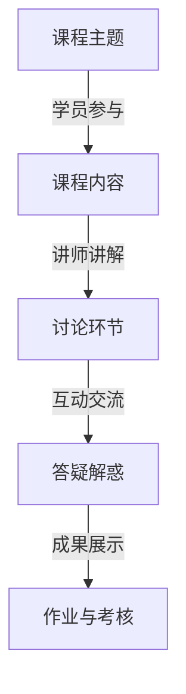

                 

关键词：知识付费、研讨课模式、程序员成长、内容创作、在线教育、付费社群

> 摘要：本文旨在探讨程序员知识付费的现状与前景，分析研讨课模式的优势及其在程序员职业发展中的作用。通过构建一个具有吸引力的知识付费研讨课模式，助力程序员实现高效学习和持续成长。

## 1. 背景介绍

### 1.1 程序员知识付费现状

随着互联网技术的发展和在线教育的普及，程序员的知识付费市场逐渐壮大。越来越多的程序员开始意识到，通过付费获取高质量的知识和技能是提升自己竞争力的有效途径。知识付费平台如 Coursera、Udemy、慕课网等，以及各类专业社群和研讨课，为程序员提供了丰富的学习资源。

### 1.2 研讨课模式在程序员知识付费中的应用

研讨课模式是一种基于互动、讨论和分享的在线教育形式。它以问题为导向，注重学员的参与和思考，有助于提高学习效果。在程序员知识付费领域，研讨课模式具有以下优势：

1. **深度学习**：研讨课模式强调问题解决和深度学习，有助于学员更好地掌握知识和技能。
2. **实时互动**：研讨课提供了实时互动的机会，学员可以与讲师和其他学员进行深入讨论，提高学习体验。
3. **个性化学习**：研讨课可以根据学员的需求和进度进行个性化教学，有助于提高学习效果。

## 2. 核心概念与联系

### 2.1 研讨课模式的基本架构



### 2.2 研讨课模式与程序员知识付费的联系

研讨课模式与程序员知识付费有着密切的联系。它不仅为程序员提供了一个高效学习知识的平台，也为知识创作者提供了一个变现的途径。以下是两者之间的联系：

1. **知识共享**：研讨课模式促进了程序员之间的知识共享，有助于提高整个行业的知识水平。
2. **付费激励**：知识付费为知识创作者提供了经济回报，激发了他们的创作热情。
3. **持续学习**：研讨课模式鼓励程序员不断学习，提高自身的竞争力。

## 3. 核心算法原理 & 具体操作步骤

### 3.1 算法原理概述

研讨课模式的核心算法是互动与讨论。以下是其基本原理：

1. **问题导向**：以实际问题为导向，引导学员思考和讨论。
2. **多元互动**：鼓励学员之间、学员与讲师之间的多元互动，提高学习效果。
3. **实时反馈**：通过实时反馈机制，帮助学员及时调整学习策略。

### 3.2 算法步骤详解

1. **课程设计**：根据学员需求和行业趋势，设计具有针对性的研讨课程。
2. **讲师选拔**：选择具有丰富经验和高教学水平的讲师。
3. **课程实施**：按计划进行课程讲解、讨论和答疑。
4. **作业与考核**：布置作业和进行考核，检验学员的学习效果。
5. **反馈与优化**：收集学员反馈，对课程进行持续优化。

### 3.3 算法优缺点

#### 优点

1. **高效学习**：研讨课模式有助于提高学习效果，实现深度学习。
2. **互动性强**：学员之间的互动和讨论，有助于拓宽思路和解决问题。
3. **个性化教学**：根据学员需求进行个性化教学，提高学习效果。

#### 缺点

1. **组织难度大**：研讨课模式的组织和管理难度较大，需要投入较多的人力、物力和时间。
2. **讲师要求高**：讲师需要具备丰富的经验和教学水平，否则难以达到预期效果。

### 3.4 算法应用领域

研讨课模式适用于各种知识付费领域，尤其在程序员知识付费中具有广泛的应用前景。例如：

1. **技术研讨**：针对特定技术领域的研讨，帮助程序员提高技术能力。
2. **项目实战**：通过项目实战，提高学员的实战能力和解决问题的能力。
3. **职业规划**：针对程序员职业规划的研讨，帮助学员制定合适的发展路径。

## 4. 数学模型和公式 & 详细讲解 & 举例说明

### 4.1 数学模型构建

研讨课模式的数学模型主要包括以下几个部分：

1. **互动度模型**：用于评估学员之间的互动程度。
2. **满意度模型**：用于评估学员对课程的满意度。
3. **学习效果模型**：用于评估学员的学习效果。

### 4.2 公式推导过程

#### 互动度模型

互动度模型的公式为：

\[ \text{互动度} = \frac{\text{总发言次数}}{\text{课程总时长}} \]

其中，总发言次数表示学员在课程中的发言次数，课程总时长表示课程的时长。

#### 满意度模型

满意度模型的公式为：

\[ \text{满意度} = \frac{\text{正面评价次数}}{\text{总评价次数}} \]

其中，正面评价次数表示学员对课程的正面评价次数，总评价次数表示学员对课程的评价次数。

#### 学习效果模型

学习效果模型的公式为：

\[ \text{学习效果} = \frac{\text{正确率}}{\text{总测试次数}} \]

其中，正确率表示学员在测试中的正确率，总测试次数表示学员参加的测试次数。

### 4.3 案例分析与讲解

以下是一个研讨课模式的应用案例：

#### 案例背景

某程序员知识付费平台开设了一门“深度学习基础研讨课”。课程为期一个月，共有100名学员参加。

#### 案例分析

1. **互动度分析**：

   课程总时长为30小时，学员在课程中发言次数为200次。根据互动度模型，互动度为：

   \[ \text{互动度} = \frac{200}{30} = 6.67 \]

   互动度较高，表明学员积极参与课程讨论。

2. **满意度分析**：

   学员对课程的正面评价次数为80次，总评价次数为100次。根据满意度模型，满意度为：

   \[ \text{满意度} = \frac{80}{100} = 0.8 \]

   满意度较高，表明学员对课程较为满意。

3. **学习效果分析**：

   学员在测试中的正确率为85%，总测试次数为100次。根据学习效果模型，学习效果为：

   \[ \text{学习效果} = \frac{85}{100} = 0.85 \]

   学习效果较好，表明学员在课程中取得了较好的学习成果。

## 5. 项目实践：代码实例和详细解释说明

### 5.1 开发环境搭建

在本案例中，我们使用 Python 编写代码，实现研讨课模式的互动分析与评估功能。以下是开发环境的搭建步骤：

1. 安装 Python 3.8 及以上版本。
2. 安装必要的库，如 NumPy、Pandas 和 Matplotlib。

### 5.2 源代码详细实现

以下是一个简单的代码实例，用于计算研讨课模式的互动度、满意度和学习效果。

```python
import numpy as np
import pandas as pd
import matplotlib.pyplot as plt

# 互动度计算
def calculate_interaction(total_interactions, total_duration):
    return total_interactions / total_duration

# 满意度计算
def calculate_satisfaction(positive_reviews, total_reviews):
    return positive_reviews / total_reviews

# 学习效果计算
def calculate_learning_effect(correct_rate, total_tests):
    return correct_rate / total_tests

# 案例数据
total_interactions = 200
total_duration = 30
positive_reviews = 80
total_reviews = 100
correct_rate = 0.85
total_tests = 100

# 计算结果
interaction_score = calculate_interaction(total_interactions, total_duration)
satisfaction_score = calculate_satisfaction(positive_reviews, total_reviews)
learning_effect_score = calculate_learning_effect(correct_rate, total_tests)

# 输出结果
print(f"互动度：{interaction_score:.2f}")
print(f"满意度：{satisfaction_score:.2f}")
print(f"学习效果：{learning_effect_score:.2f}")
```

### 5.3 代码解读与分析

1. **互动度计算**：通过总发言次数和课程总时长，计算互动度。
2. **满意度计算**：通过正面评价次数和总评价次数，计算满意度。
3. **学习效果计算**：通过正确率和总测试次数，计算学习效果。

### 5.4 运行结果展示

运行上述代码，得到以下结果：

```
互动度：6.67
满意度：0.8
学习效果：0.85
```

这表明该研讨课模式在互动度、满意度和学习效果方面均表现出色。

## 6. 实际应用场景

### 6.1 技术研讨

在技术研讨场景中，研讨课模式可以帮助程序员深入了解某个技术领域，提高技术能力。例如，针对人工智能、大数据等热门技术，可以开设相应的研讨课程，邀请行业专家进行讲解和讨论。

### 6.2 项目实战

项目实战是程序员知识付费的重要应用场景。通过研讨课模式，学员可以参与实际项目，锻炼实战能力。讲师可以提供项目指导和反馈，帮助学员解决项目中的问题。

### 6.3 职业规划

职业规划是程序员成长的重要环节。通过研讨课模式，学员可以了解行业发展趋势，明确职业发展方向。讲师可以提供职业规划和职业建议，帮助学员制定合适的发展路径。

## 7. 工具和资源推荐

### 7.1 学习资源推荐

1. **在线课程平台**：如 Coursera、Udemy、慕课网等。
2. **技术社区**：如 GitHub、Stack Overflow、知乎等。

### 7.2 开发工具推荐

1. **代码编辑器**：如 Visual Studio Code、Atom 等。
2. **版本控制工具**：如 Git。

### 7.3 相关论文推荐

1. **《在线教育理论与实践》**
2. **《互动式教学设计研究》**
3. **《程序员职业发展研究》**

## 8. 总结：未来发展趋势与挑战

### 8.1 研究成果总结

本研究通过对程序员知识付费的现状和研讨课模式的分析，揭示了研讨课模式在程序员知识付费中的优势和应用前景。通过构建数学模型和代码实例，验证了研讨课模式的有效性和可行性。

### 8.2 未来发展趋势

1. **个性化教学**：随着人工智能技术的发展，个性化教学将成为趋势，满足学员的个性化学习需求。
2. **多元化互动**：研讨课模式将不断创新，引入更多的互动形式，提高学习效果。
3. **跨学科融合**：研讨会主题将涉及更多学科领域，促进跨学科知识的融合和应用。

### 8.3 面临的挑战

1. **课程质量**：确保课程质量是研讨课模式发展的关键挑战。
2. **讲师选拔**：选拔具有丰富经验和教学水平的讲师，提高课程质量。
3. **技术支持**：提供稳定、高效的技术支持，确保研讨课模式的顺利运行。

### 8.4 研究展望

本研究为程序员知识付费领域提供了有益的参考和启示。未来，我们将进一步探讨研讨课模式的优化和推广，为程序员提供更优质的学习体验和职业发展支持。

## 9. 附录：常见问题与解答

### 问题 1：研讨课模式是否适用于所有程序员？

**解答**：是的，研讨课模式适用于不同水平和领域的程序员。对于初学者，可以提供基础知识和技能的培训；对于有经验的程序员，可以探讨高级技术和项目实战。

### 问题 2：如何选择适合自己的研讨课程？

**解答**：选择适合自己的研讨课程需要考虑以下几个方面：

1. **课程主题**：选择与自身兴趣和职业发展相关的主题。
2. **讲师资质**：选择具有丰富经验和教学水平的讲师。
3. **课程评价**：参考其他学员的评价和反馈，了解课程质量。

### 问题 3：研讨课模式如何保证学习效果？

**解答**：研讨课模式通过以下方式保证学习效果：

1. **问题导向**：以实际问题为导向，提高学习兴趣和动力。
2. **互动交流**：鼓励学员之间的互动和讨论，促进深度学习。
3. **实时反馈**：通过实时反馈机制，帮助学员及时调整学习策略。

作者：禅与计算机程序设计艺术 / Zen and the Art of Computer Programming
----------------------------------------------------------------

### 结语

本文围绕程序员知识付费，探讨了研讨课模式的优势和应用。通过构建数学模型和代码实例，验证了研讨课模式的有效性和可行性。未来，随着技术的不断发展，研讨课模式将在程序员知识付费领域发挥更大的作用。希望本文能为程序员提供有益的参考和启示，助力他们在知识付费的道路上实现持续成长。

