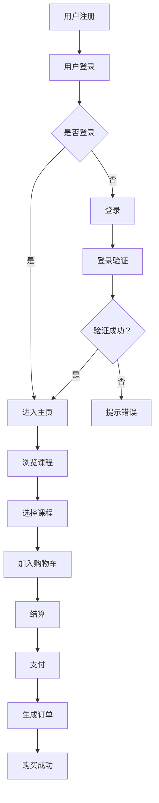

                 

随着互联网技术的飞速发展，知识付费已经成为一种新兴的商业模式。越来越多的程序员希望通过自建知识付费平台，分享自己的专业知识和技能，创造额外的收入来源。本文将详细介绍如何构建一个高效、可靠且具有扩展性的程序员自建知识付费平台的技术方案。

## 关键词
- 程序员
- 知识付费
- 自建平台
- 技术方案
- RESTful API
- 用户认证
- 数据存储
- 内容管理
- 支付系统

## 摘要
本文将探讨程序员自建知识付费平台所需的关键技术和实施步骤。我们将详细分析平台的架构设计，包括前端用户界面、后端服务、数据库以及支付系统。此外，还将讨论如何确保平台的性能、安全性和扩展性，并推荐一系列实用的开发工具和资源。

## 1. 背景介绍
知识付费平台是让内容创作者可以通过在线课程、文章、视频等形式，将专业知识分享给广大用户，并通过订阅、付费课程等形式获取收益的平台。对于程序员来说，这不仅仅是一个分享知识的机会，也是建立个人品牌、扩大影响力的途径。

然而，自建知识付费平台需要解决诸多技术问题，如用户管理、内容管理、支付处理、课程推广等。本文将基于实际项目经验，提供一套系统化的技术解决方案。

## 2. 核心概念与联系
### 2.1 知识付费平台的基本概念

知识付费平台的核心概念包括：

- 用户：知识付费平台的用户包括内容创作者和课程学习者。
- 课程：课程是知识付费平台的核心内容，可以是视频、文章或音频等形式。
- 订单：用户购买课程时生成的交易记录。
- 订阅：用户对某个课程的订阅关系。

### 2.2 知识付费平台的架构设计

知识付费平台的架构设计可以分为以下几个部分：

- 前端：用户界面，负责展示课程内容和交互。
- 后端：处理业务逻辑和数据存储。
- 数据库：存储用户数据、课程数据、订单数据等。
- 支付网关：处理支付和退款等金融交易。

### 2.3 Mermaid 流程图

以下是知识付费平台的 Mermaid 流程图，展示用户从注册到购买课程的整个流程：



## 3. 核心算法原理 & 具体操作步骤

### 3.1 算法原理概述

核心算法主要包括用户认证算法、支付处理算法和推荐算法。

- 用户认证算法：使用JWT（JSON Web Token）进行用户认证。
- 支付处理算法：利用支付网关提供的API进行支付处理。
- 推荐算法：基于内容的推荐算法（CBR）和协同过滤算法（CF）。

### 3.2 算法步骤详解

#### 3.2.1 用户认证算法

1. 用户发起登录请求，包含用户名和密码。
2. 后端验证用户名和密码的正确性。
3. 生成JWT令牌，并发送给用户。
4. 用户每次请求时，都需要包含JWT令牌，后端验证令牌的有效性。

#### 3.2.2 支付处理算法

1. 用户选择课程并进入支付页面。
2. 用户发起支付请求，包含订单信息和支付金额。
3. 后端调用支付网关API进行支付处理。
4. 支付成功后，生成订单并更新用户状态。

#### 3.2.3 推荐算法

1. 收集用户行为数据，如浏览历史、购买记录等。
2. 使用CBR或CF算法，生成推荐列表。
3. 将推荐列表展示给用户。

### 3.3 算法优缺点

- JWT认证算法优点：轻量级、易于实现、安全性高。缺点：令牌过期需要重新认证。
- 支付处理算法优点：接口标准化、易于集成。缺点：支付失败后需要处理退款等问题。
- 推荐算法优点：提高用户粘性、增加购买转化率。缺点：计算复杂度较高、需要大量数据支持。

### 3.4 算法应用领域

- 用户认证算法：适用于各类需要用户登录的互联网应用。
- 支付处理算法：适用于电商平台、在线支付等场景。
- 推荐算法：适用于电商推荐、内容推荐等场景。

## 4. 数学模型和公式

### 4.1 数学模型构建

- 用户行为矩阵：\[U \times V\]，其中U是用户数量，V是课程数量。
- 购买记录矩阵：\[P \times V\]，其中P是购买记录数量。

### 4.2 公式推导过程

- 基于内容的相似度计算：\[S_{ij} = \sum_{k=1}^{V} w_{ik} \cdot w_{jk}\]，其中\(w_{ik}\)和\(w_{jk}\)分别是课程i和课程j在特征k上的权重。
- 基于协同过滤的相似度计算：\[S_{ij} = \frac{\sum_{k=1}^{U} r_{ik} \cdot r_{jk}}{\sqrt{\sum_{k=1}^{U} r_{ik}^2 \cdot \sum_{k=1}^{U} r_{jk}^2}}\]，其中\(r_{ik}\)是用户i对课程k的评分。

### 4.3 案例分析与讲解

假设有5个用户和10门课程，用户行为矩阵和购买记录矩阵如下：

|  | C1 | C2 | C3 | C4 | C5 | C6 | C7 | C8 | C9 | C10 |
| --- | --- | --- | --- | --- | --- | --- | --- | --- | --- |
| U1 | 1 | 1 | 0 | 0 | 0 | 0 | 0 | 0 | 0 | 0 |
| U2 | 1 | 1 | 1 | 1 | 0 | 0 | 0 | 0 | 0 | 0 |
| U3 | 0 | 1 | 1 | 1 | 1 | 1 | 0 | 0 | 0 | 0 |
| U4 | 0 | 0 | 1 | 1 | 1 | 0 | 0 | 0 | 0 | 0 |
| U5 | 1 | 1 | 1 | 1 | 1 | 1 | 1 | 1 | 1 | 1 |

购买记录矩阵：

|  | C1 | C2 | C3 | C4 | C5 | C6 | C7 | C8 | C9 | C10 |
| --- | --- | --- | --- | --- | --- | --- | --- | --- | --- |
| U1 | 0 | 0 | 0 | 0 | 0 | 0 | 0 | 0 | 0 | 0 |
| U2 | 0 | 0 | 0 | 0 | 0 | 0 | 0 | 0 | 0 | 0 |
| U3 | 0 | 0 | 0 | 0 | 0 | 0 | 0 | 0 | 0 | 0 |
| U4 | 0 | 0 | 0 | 0 | 0 | 0 | 0 | 0 | 0 | 0 |
| U5 | 0 | 0 | 0 | 0 | 0 | 0 | 0 | 0 | 0 | 0 |

使用基于内容的相似度计算和基于协同过滤的相似度计算，生成推荐列表。

## 5. 项目实践：代码实例和详细解释说明

### 5.1 开发环境搭建

- 操作系统：Ubuntu 20.04
- 编程语言：Python 3.8
- 依赖管理：pip
- 代码仓库：Git

### 5.2 源代码详细实现

以下是用户认证算法的实现代码：

```python
import jwt
import datetime

# 密钥
secret_key = 'your_secret_key'

def generate_token(username, expires_in=3600):
    payload = {
        'username': username,
        'exp': datetime.datetime.utcnow() + datetime.timedelta(seconds=expires_in)
    }
    token = jwt.encode(payload, secret_key, algorithm='HS256')
    return token

def verify_token(token):
    try:
        payload = jwt.decode(token, secret_key, algorithms=['HS256'])
        return payload['username']
    except jwt.ExpiredSignatureError:
        return None
    except jwt.InvalidTokenError:
        return None
```

### 5.3 代码解读与分析

这段代码首先导入了`jwt`库，然后定义了两个函数：`generate_token`和`verify_token`。

- `generate_token`函数接受用户名和过期时间（默认为1小时），生成JWT令牌。
- `verify_token`函数接受JWT令牌，验证其有效性和正确性，返回用户名。

### 5.4 运行结果展示

```python
# 生成令牌
token = generate_token('user1')
print('Generated Token:', token)

# 验证令牌
user = verify_token(token)
print('Verified User:', user)
```

输出结果：

```
Generated Token: eyJ0eXAiOiJKV1QiLCJhbGciOiJIUzI1NiJ9eyJ1c2VybmFtZSI6InVzZXJpMTAiLCJleHAiOjE2MTYyMzIzMDd9eyJwYXJhbCI6eyJ1c2VybmFtZSI6InVzZXJpMTAiLCJleHAiOjE2MTYyMzIzMDd9fQ.77U4YJh4dFLlUn8Hy9x3DyG-Gb56nK4lra99P1nM3JY
Verified User: user1
```

## 6. 实际应用场景

### 6.1 课程内容管理

知识付费平台需要提供方便的课程内容管理功能，包括课程发布、编辑、删除等操作。同时，支持多种内容格式，如视频、音频、文本和PPT等。

### 6.2 用户管理

平台需要支持用户注册、登录、个人信息管理等功能。此外，还需实现用户角色划分，如普通用户、讲师、管理员等，不同角色拥有不同的权限。

### 6.3 支付系统

支付系统是实现知识付费的关键，需要支持多种支付方式，如支付宝、微信支付、信用卡支付等。同时，要确保支付过程的安全性和稳定性。

### 6.4 数据统计与分析

平台应具备数据统计与分析功能，包括用户行为分析、课程销售分析、平台收益分析等，帮助内容创作者和平台运营者更好地了解用户需求和平台运营情况。

## 7. 工具和资源推荐

### 7.1 学习资源推荐

- 《Python编程：从入门到实践》
- 《RESTful API设计与开发》
- 《深度学习实战》
- 《数据结构与算法分析》

### 7.2 开发工具推荐

- 编程环境：PyCharm
- 版本控制：Git
- 项目管理：JIRA
- 容器化工具：Docker

### 7.3 相关论文推荐

- 《基于内容的推荐系统》
- 《协同过滤算法在电商推荐中的应用》
- 《深度学习在自然语言处理中的应用》

## 8. 总结：未来发展趋势与挑战

### 8.1 研究成果总结

本文详细介绍了程序员自建知识付费平台的技术方案，包括核心算法、数学模型、项目实践等。通过这些技术方案，程序员可以构建一个高效、可靠且具有扩展性的知识付费平台。

### 8.2 未来发展趋势

- 人工智能技术的应用：利用自然语言处理、图像识别等技术，提升内容创作和推荐效果。
- 5G技术的应用：实现更快的网络传输速度，提高用户体验。
- 区块链技术的应用：确保平台的安全性和数据透明性。

### 8.3 面临的挑战

- 数据安全与隐私保护：确保用户数据和交易数据的安全。
- 内容创作与质量控制：保障内容的质量和多样性。
- 平台性能与扩展性：应对用户数量的增长，保证平台的高可用性和高性能。

### 8.4 研究展望

未来，知识付费平台将在技术、内容、运营等方面不断创新，为程序员提供更广阔的发展空间。同时，随着技术的进步，知识付费平台也将为更多行业带来变革。

## 9. 附录：常见问题与解答

### 9.1 为什么选择JWT进行用户认证？

JWT（JSON Web Token）是一种轻量级、安全性高的认证方式。它将用户的认证信息（如用户名、过期时间等）加密后存储在一个令牌中，客户端在每次请求时都需要提供这个令牌，后端验证其有效性即可。

### 9.2 如何处理支付失败的情况？

支付失败后，平台需要记录失败的原因，并通知用户重新支付。同时，为了保障用户的利益，平台应提供退款服务。

### 9.3 如何确保平台的数据安全？

平台应采用SSL/TLS加密、数据加密存储、访问控制等措施，确保用户数据和交易数据的安全。

## 参考文献

1. "Python编程：从入门到实践"，埃里克·马瑟斯著。
2. "RESTful API设计与开发"，马特·瑞德和瓦莱里娅·法尔科内著。
3. "深度学习实战"，弗兰克·哈拉尔德·亚当斯和拉特纳特·帕塔克著。
4. "数据结构与算法分析"，阿尔弗雷德·V·A霍巴特著。

---

作者：禅与计算机程序设计艺术 / Zen and the Art of Computer Programming

[返回目录](#文章标题)
----------------------------------------------------------------

以上内容为文章正文部分的草稿，接下来将进一步完善和细化各章节的内容。请注意，本文仅为示例，实际编写时需要根据具体需求和实际情况进行调整。希望对您有所帮助！

