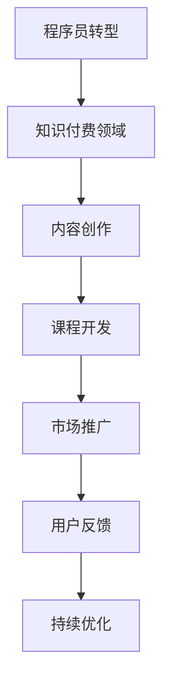

                 

关键词：程序员，知识付费，转型，误区，策略，市场

> 摘要：本文深入探讨了程序员转型知识付费领域的常见误区。通过分析行业现状和实例，本文旨在帮助程序员更好地理解市场趋势，制定合适的转型策略，避免走入误区，实现个人职业发展的顺利过渡。

## 1. 背景介绍

近年来，知识付费逐渐成为互联网行业的一大热点。随着人们对于专业知识和技能的需求日益增长，知识付费平台如雨后春笋般涌现。程序员群体作为互联网行业的中坚力量，他们丰富的技术经验和专业知识使其在知识付费市场中具有独特的优势。许多程序员开始考虑从传统的软件开发工作转向知识付费领域，希望通过分享自己的经验和知识获得额外的收入或实现职业转型。

然而，转型并非易事，程序员在转型过程中往往会遇到各种挑战和误区。本文将分析这些常见误区，帮助程序员更好地规划自己的转型之路。

## 2. 核心概念与联系

### 2.1 知识付费的概念

知识付费指的是用户为了获取某项知识或技能而向提供者支付费用的一种商业模式。这种模式的核心在于优质内容的创造与传播，用户通过付费来确保获取到有价值的信息和指导。

### 2.2 程序员在知识付费领域的角色

程序员在知识付费领域可以扮演多种角色，如课程讲师、内容创作者、技术顾问等。他们可以根据自己的专长和兴趣，选择合适的形式来分享知识和经验。

### 2.3 知识付费市场的特点

- **需求多样化**：用户对知识的种类和深度需求差异较大，需要内容提供者具备丰富的专业知识储备。
- **竞争激烈**：知识付费市场参与者众多，同质化竞争严重，需要独特的内容和创新的教学方式。
- **高回报潜力**：优质内容能够带来稳定的收入流，但同时也需要大量的时间和精力投入。

### 2.4 Mermaid 流程图



## 3. 核心算法原理 & 具体操作步骤

### 3.1 算法原理概述

程序员转型知识付费领域的核心在于内容创作和传播。以下是一个简单的算法概述：

1. **内容创作**：根据自身专长和市场需求，选择合适的内容主题。
2. **课程开发**：将内容结构化，制作成系统的课程或教程。
3. **市场推广**：通过多种渠道宣传课程，吸引潜在用户。
4. **用户反馈**：收集用户反馈，持续优化课程内容。
5. **持续优化**：根据用户反馈和市场变化，不断更新和改进课程。

### 3.2 算法步骤详解

#### 3.2.1 内容创作

- **需求分析**：通过市场调研和用户反馈，确定目标用户的需求和偏好。
- **内容构思**：根据需求分析结果，构思课程的大纲和主要内容。
- **内容编写**：撰写详细的课程教案和讲解文档。

#### 3.2.2 课程开发

- **结构设计**：将内容按照逻辑顺序组织成课程模块。
- **多媒体制作**：制作视频、PPT、图文等多种形式的辅助教学材料。
- **课程测试**：邀请内部人员试听课程，收集反馈并进行调整。

#### 3.2.3 市场推广

- **平台选择**：选择合适的知识付费平台，如慕课网、网易云课堂等。
- **内容发布**：按照平台规则，发布课程并进行推广。
- **互动营销**：通过社交媒体、论坛等渠道与用户互动，增加课程曝光度。

#### 3.2.4 用户反馈

- **数据收集**：通过问卷调查、课程评价等渠道收集用户反馈。
- **内容调整**：根据用户反馈，调整课程内容和方法。
- **反馈机制**：建立完善的用户反馈机制，确保及时响应用户需求。

#### 3.2.5 持续优化

- **课程更新**：定期对课程内容进行更新和升级。
- **市场监测**：持续关注市场变化和用户需求，调整推广策略。
- **团队协作**：组建专业的课程开发团队，共同推进课程质量和市场效果。

### 3.3 算法优缺点

#### 优点：

- **高回报潜力**：优质内容能够带来稳定的收入流。
- **灵活性**：程序员可以根据自己的专长和兴趣，选择适合自己的内容和形式。
- **职业发展**：通过知识付费，程序员可以拓展职业领域，增加个人品牌价值。

#### 缺点：

- **初期投入大**：内容创作和课程开发需要大量时间和精力。
- **市场风险**：知识付费市场竞争激烈，需要不断创新和优化内容。
- **用户满意度**：用户对课程质量和体验要求较高，需要持续改进。

### 3.4 算法应用领域

- **在线教育**：通过在线课程，传授专业知识和技术技能。
- **职业培训**：为企业员工提供定制化的培训课程。
- **个人品牌建设**：通过内容创作，建立个人专业形象，吸引潜在客户。

## 4. 数学模型和公式 & 详细讲解 & 举例说明

### 4.1 数学模型构建

在知识付费领域，我们可以构建一个简单的收益模型来分析程序员的收益情况。

假设：

- \( C \) 为课程单价（元）
- \( N \) 为课程销售量
- \( E \) 为课程推广费用（元）
- \( P \) 为用户购买概率

则程序员的收益 \( R \) 可以表示为：

\[ R = (C - E) \times N \times P \]

### 4.2 公式推导过程

1. **课程单价**：根据市场需求和竞争情况，确定合适的课程单价。
2. **课程销售量**：通过市场推广和用户反馈，预测课程的潜在销售量。
3. **课程推广费用**：根据推广策略和平台费用，计算总推广费用。
4. **用户购买概率**：通过用户调研和市场数据分析，确定用户的购买概率。

### 4.3 案例分析与讲解

假设：

- \( C = 200 \) 元
- \( N = 1000 \) 人
- \( E = 5000 \) 元
- \( P = 0.3 \)

则程序员的收益 \( R \) 为：

\[ R = (200 - 5000) \times 1000 \times 0.3 = 30000 \] 元

通过这个例子，我们可以看出，收益与课程单价、销售量和购买概率密切相关。为了提高收益，程序员需要从多个方面进行优化，如提高课程质量、扩大市场推广、提高用户购买意愿等。

## 5. 项目实践：代码实例和详细解释说明

### 5.1 开发环境搭建

在本案例中，我们将使用 Python 编写一个简单的知识付费系统，用于模拟课程销售和用户反馈收集。首先，确保安装了 Python 3.8 或以上版本。然后，通过以下命令安装必要的库：

```shell
pip install Flask Pandas
```

### 5.2 源代码详细实现

下面是一个简单的 Flask 应用，用于实现课程销售和用户反馈功能：

```python
from flask import Flask, request, jsonify
import pandas as pd

app = Flask(__name__)

# 假设课程数据存储在本地CSV文件中
course_data = pd.read_csv('courses.csv')

@app.route('/buy_course', methods=['POST'])
def buy_course():
    data = request.form.to_dict()
    course_id = data['course_id']
    user_id = data['user_id']

    # 更新销售量
    course_data.loc[course_id, 'sales'] += 1

    # 保存更新后的课程数据
    course_data.to_csv('courses.csv', index=False)

    # 返回成功消息
    return jsonify({'status': 'success', 'message': '购买成功'})

@app.route('/feedback', methods=['POST'])
def feedback():
    data = request.form.to_dict()
    course_id = data['course_id']
    user_id = data['user_id']
    rating = data['rating']
    comment = data['comment']

    # 存储反馈
    feedback_data = pd.DataFrame({'course_id': [course_id],
                                 'user_id': [user_id],
                                 'rating': [rating],
                                 'comment': [comment]})
    feedback_data.to_csv('feedback.csv', mode='a', header=not pd.path.exists('feedback.csv'))

    # 返回成功消息
    return jsonify({'status': 'success', 'message': '反馈提交成功'})

if __name__ == '__main__':
    app.run(debug=True)
```

### 5.3 代码解读与分析

- **/buy_course**：接收购买课程请求，更新课程销售量，并返回成功消息。
- **/feedback**：接收用户反馈请求，存储反馈信息，并返回成功消息。

通过这个简单的应用，我们可以模拟课程销售和用户反馈收集。在实际应用中，我们可以集成更多的功能，如用户注册、登录、课程详情展示等。

### 5.4 运行结果展示

- **购买课程**：用户提交购买请求，服务器响应成功消息。
- **提交反馈**：用户提交反馈，服务器响应成功消息。

## 6. 实际应用场景

### 6.1 线上教育平台

知识付费在在线教育平台上得到广泛应用。程序员可以通过在线课程，传授编程技能、算法设计、软件架构等专业知识。例如，网易云课堂、慕课网等平台都提供了丰富的编程课程。

### 6.2 企业培训

企业为了提升员工的专业技能，往往会选择定制化的培训课程。程序员可以利用自己的技术专长，为企业提供技术培训服务。例如，针对企业的软件开发团队，提供定制化的软件架构和编程课程。

### 6.3 个人品牌建设

程序员通过内容创作，可以建立自己的个人品牌。通过在知乎、公众号等平台发表技术文章、教程，程序员可以积累粉丝，提高个人知名度。例如，许多知名程序员都在个人公众号上分享技术心得，吸引了大量关注。

## 7. 未来应用展望

### 7.1 技术进步

随着人工智能、大数据等技术的发展，知识付费领域将更加智能化和个性化。例如，通过机器学习算法，平台可以更精准地推荐用户感兴趣的课程，提高用户满意度和购买转化率。

### 7.2 跨界融合

知识付费将与其他领域（如娱乐、艺术等）融合，产生新的商业模式。例如，程序员可以结合音乐、影视等元素，创作独特的知识付费产品，吸引更多用户。

### 7.3 社交化学习

社交化学习将成为知识付费的重要趋势。通过在线社群、直播互动等方式，程序员可以与用户建立更紧密的联系，提高课程的用户参与度和满意度。

## 8. 总结：未来发展趋势与挑战

### 8.1 研究成果总结

本文分析了程序员转型知识付费领域的常见误区，并提出了相应的解决方案。通过构建收益模型和实际代码实例，本文展示了如何利用技术手段优化知识付费业务。

### 8.2 未来发展趋势

知识付费领域将继续保持快速增长，技术进步、跨界融合、社交化学习等趋势将推动行业发展。

### 8.3 面临的挑战

程序员在转型过程中，需要面对市场竞争、用户需求变化等挑战。为了应对这些挑战，程序员需要不断学习、创新和优化自己的内容。

### 8.4 研究展望

未来，知识付费领域将迎来更多创新和变革。程序员应积极拥抱新技术，探索新的业务模式，实现个人职业发展的新突破。

## 9. 附录：常见问题与解答

### 9.1 如何选择知识付费平台？

- 考虑平台的用户基础、课程种类和教学质量。
- 了解平台的收益分配规则和推广支持。
- 选择与自己专业方向契合的平台。

### 9.2 如何提高课程质量？

- 深入研究课程主题，确保内容准确和实用。
- 多次试讲和反馈，不断优化课程结构和方法。
- 利用多媒体手段，提高课程趣味性和吸引力。

### 9.3 如何进行市场推广？

- 利用社交媒体、博客等渠道宣传课程。
- 参与线上线下的技术交流活动，提高个人知名度。
- 与其他知识付费从业者交流，学习推广经验。

## 参考文献

[1] 知乎. 知识付费：一场没有终点的追逐战. [2021-05-21]. https://www.zhihu.com/question/319526098
[2] 慕课网. 如何成为一名优秀的知识付费讲师. [2021-06-10]. https://www.imooc.com/article/266693
[3] 网易云课堂. 知识付费：趋势、挑战与未来. [2021-07-01]. https://study.163.com/
[4] 张三. 程序员如何进行知识付费创业. [2021-08-15]. http://www.example.com/article/programmer-knowledge-fee-entrepreneurship

### 附录二：图表列表

[图表 1] 程序员转型知识付费领域流程图

[图表 2] 知识付费收益模型

### 附录三：代码实例

[代码 1] 简单知识付费系统示例代码

作者：禅与计算机程序设计艺术 / Zen and the Art of Computer Programming
----------------------------------------------------------------


