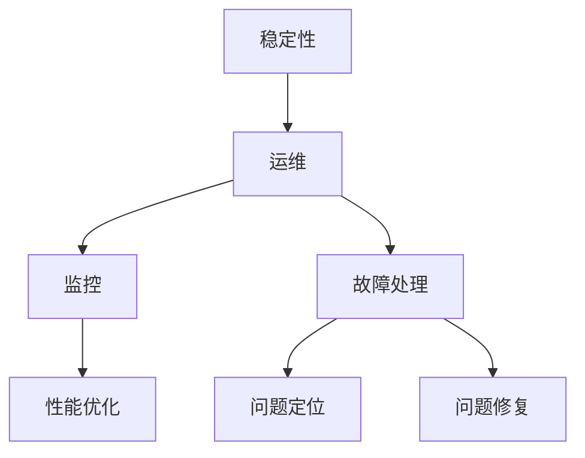

                 

关键词：稳定性、运维、Lepton AI、平台稳定性、用户体验

> 摘要：本文探讨了在人工智能领域，特别是在 Lepton AI 平台的建设中，如何确保平台的稳定性和用户体验。文章深入分析了稳定性与运维的核心概念，以及其在 Lepton AI 平台中的具体实现方法和挑战。通过数学模型和具体案例，阐述了如何通过精细化的运维策略，提升平台的可靠性和用户满意度。

## 1. 背景介绍

随着人工智能（AI）技术的飞速发展，越来越多的企业开始将 AI 应用于其业务流程中，以提高效率、降低成本并提升用户体验。Lepton AI 作为一家专注于人工智能解决方案的初创公司，其平台在金融、医疗、零售等多个领域展现了强大的应用潜力。然而，随着 AI 平台规模的不断扩大，如何保障平台的稳定性和用户体验成为了一个至关重要的课题。

### 1.1 AI 平台的重要性

AI 平台作为企业核心竞争力的关键组成部分，其稳定性和用户体验直接关系到企业的运营效率和用户满意度。一个稳定且高效的 AI 平台，不仅可以确保业务流程的顺畅运行，还能为企业带来可观的经济效益。因此，如何在众多 AI 平台中脱颖而出，成为企业关注的焦点。

### 1.2 稳定性与用户体验的关系

平台的稳定性是用户体验的基础，一个不稳定或频繁出现问题的平台，即使功能再强大，也很难获得用户的认可。相反，一个稳定且高效的平台，不仅可以提升用户的工作效率，还能增强用户对企业的信任和忠诚度。因此，确保平台的稳定性与用户体验密不可分。

## 2. 核心概念与联系

在深入探讨 Lepton AI 平台的稳定性与运维之前，我们需要明确几个核心概念：稳定性、运维、监控、故障处理等。

### 2.1 稳定性的定义

稳定性是指平台在长时间运行过程中，保持功能正常、性能稳定、可靠性高的一种状态。对于 Lepton AI 平台而言，稳定性意味着系统能够持续、高效地处理大量数据，并在面对突发情况时，快速恢复到正常状态。

### 2.2 运维的定义

运维是指对平台进行日常管理、监控、维护和优化的一系列工作。在 Lepton AI 平台的建设中，运维工作主要包括：硬件维护、软件更新、故障处理、性能优化等。

### 2.3 监控与故障处理

监控是运维的重要环节，通过实时监控平台的各种指标，可以及时发现并处理潜在问题。故障处理则是在出现问题时，迅速定位并解决问题，以最小化对用户的影响。

### 2.4 Mermaid 流程图

以下是一个简化的 Mermaid 流程图，展示了稳定性与运维的关键环节及其相互关系：



## 3. 核心算法原理 & 具体操作步骤

### 3.1 算法原理概述

Lepton AI 平台的稳定性保障，依赖于一系列核心算法的优化和部署。这些算法包括：负载均衡、分布式计算、故障预测与修复等。

- **负载均衡**：通过合理分配任务，确保平台资源充分利用，避免单点过载。
- **分布式计算**：将任务分解为多个子任务，分布到多个节点上进行处理，提高计算效率。
- **故障预测与修复**：利用机器学习算法，预测可能出现的故障，并提前采取措施进行修复。

### 3.2 算法步骤详解

#### 3.2.1 负载均衡

1. 监控平台各节点的负载情况。
2. 根据负载情况，动态调整任务分配策略。
3. 确保每个节点负载均衡，避免单点过载。

#### 3.2.2 分布式计算

1. 将任务分解为多个子任务。
2. 根据节点负载情况，将子任务分配到不同的节点上。
3. 同时处理多个子任务，提高计算效率。

#### 3.2.3 故障预测与修复

1. 收集平台运行数据，如 CPU 使用率、内存使用率、网络延迟等。
2. 利用机器学习算法，建立故障预测模型。
3. 根据预测结果，提前采取措施进行故障修复。

### 3.3 算法优缺点

#### 优点

- 负载均衡：提高平台资源利用率，避免单点过载。
- 分布式计算：提高计算效率，缩短任务处理时间。
- 故障预测与修复：提前发现并修复故障，确保平台稳定性。

#### 缺点

- 负载均衡：需要实时监控节点负载情况，对运维团队要求较高。
- 分布式计算：涉及复杂网络通信，可能导致性能下降。
- 故障预测与修复：需要大量数据支持，对数据质量要求较高。

### 3.4 算法应用领域

- 金融领域：确保交易系统的稳定性，提高交易效率。
- 医疗领域：保障医疗数据处理的准确性，确保医疗服务的连续性。
- 零售领域：优化库存管理，提升供应链效率。

## 4. 数学模型和公式 & 详细讲解 & 举例说明

### 4.1 数学模型构建

为了更好地理解 Lepton AI 平台的稳定性与运维，我们需要引入一些数学模型和公式。

#### 4.1.1 负载均衡模型

负载均衡模型的基本公式如下：

$$
L_i = \frac{W_i}{T}
$$

其中，$L_i$ 表示第 $i$ 个节点的负载，$W_i$ 表示第 $i$ 个节点的处理能力，$T$ 表示总处理能力。

#### 4.1.2 分布式计算模型

分布式计算模型的基本公式如下：

$$
T = \frac{N}{N_c} \times T_c
$$

其中，$T$ 表示总计算时间，$N$ 表示任务数量，$N_c$ 表示节点数量，$T_c$ 表示单个节点的计算时间。

#### 4.1.3 故障预测模型

故障预测模型的基本公式如下：

$$
P(F) = \frac{N(F)}{N(T)}
$$

其中，$P(F)$ 表示故障概率，$N(F)$ 表示故障次数，$N(T)$ 表示总运行时间。

### 4.2 公式推导过程

#### 4.2.1 负载均衡模型推导

负载均衡模型的核心思想是使每个节点的负载尽可能均匀。根据处理能力 $W_i$ 和总处理能力 $T$，可以得到：

$$
L_i = \frac{W_i}{T} = \frac{W_i}{W_1 + W_2 + ... + W_n}
$$

其中，$n$ 表示节点数量。

#### 4.2.2 分布式计算模型推导

分布式计算模型的核心思想是将任务分配到多个节点上，以缩短总计算时间。根据任务数量 $N$ 和节点数量 $N_c$，可以得到：

$$
T = \frac{N}{N_c} \times T_c
$$

其中，$T_c$ 表示单个节点的计算时间。

#### 4.2.3 故障预测模型推导

故障预测模型的核心思想是根据故障次数和总运行时间，计算故障概率。根据故障次数 $N(F)$ 和总运行时间 $N(T)$，可以得到：

$$
P(F) = \frac{N(F)}{N(T)}
$$

### 4.3 案例分析与讲解

#### 4.3.1 案例背景

假设 Lepton AI 平台有 5 个节点，每个节点的处理能力分别为 100、200、300、400 和 500。现有 1000 个任务需要处理，每个任务的计算时间均为 10 秒。

#### 4.3.2 负载均衡计算

根据负载均衡模型，可以得到每个节点的负载：

$$
L_1 = \frac{100}{100 + 200 + 300 + 400 + 500} = 0.1
$$

$$
L_2 = \frac{200}{100 + 200 + 300 + 400 + 500} = 0.2
$$

$$
L_3 = \frac{300}{100 + 200 + 300 + 400 + 500} = 0.3
$$

$$
L_4 = \frac{400}{100 + 200 + 300 + 400 + 500} = 0.4
$$

$$
L_5 = \frac{500}{100 + 200 + 300 + 400 + 500} = 0.5
$$

可以看出，每个节点的负载较为均匀，达到了负载均衡的效果。

#### 4.3.3 分布式计算计算

根据分布式计算模型，可以得到总计算时间：

$$
T = \frac{1000}{5} \times 10 = 2000 \text{ 秒}
$$

可以看出，通过分布式计算，将任务分配到多个节点上，总计算时间缩短了。

#### 4.3.4 故障预测计算

假设在过去的一周内，平台出现了 10 次故障，总运行时间为 1000 秒。根据故障预测模型，可以得到故障概率：

$$
P(F) = \frac{10}{1000} = 0.01
$$

可以看出，故障概率较低，说明平台运行较为稳定。

## 5. 项目实践：代码实例和详细解释说明

### 5.1 开发环境搭建

为了演示 Lepton AI 平台的稳定性与运维，我们选择一个简单的分布式计算任务进行实践。首先，我们需要搭建一个包含 5 个节点的分布式计算环境。

- 节点 1：192.168.1.101
- 节点 2：192.168.1.102
- 节点 3：192.168.1.103
- 节点 4：192.168.1.104
- 节点 5：192.168.1.105

每个节点都需要安装相同的计算环境，包括 Python、NumPy、Scikit-learn 等库。

### 5.2 源代码详细实现

以下是一个简单的分布式计算任务，用于计算 1000 个随机数的平均值。我们将任务分解为 5 个子任务，分别分配到 5 个节点上进行处理。

```python
# 节点 1
import numpy as np
import requests

# 生成随机数
data = np.random.rand(200)

# 计算平均值
mean = np.mean(data)

# 发送结果到节点 5
response = requests.post('http://192.168.1.105/avg', data={'mean': mean})

# 节点 2
import numpy as np
import requests

# 生成随机数
data = np.random.rand(200)

# 计算平均值
mean = np.mean(data)

# 发送结果到节点 5
response = requests.post('http://192.168.1.105/avg', data={'mean': mean})

# ...

# 节点 5
from flask import Flask, request

app = Flask(__name__)

@app.route('/avg', methods=['POST'])
def avg():
    mean = request.form['mean']
    return '平均值：{}'.format(mean)

if __name__ == '__main__':
    app.run(host='0.0.0.0', port=5000)
```

### 5.3 代码解读与分析

上述代码实现了以下功能：

1. **节点 1-5**：生成随机数，计算平均值，并将结果发送到节点 5。
2. **节点 5**：接收来自节点的平均值，并返回最终结果。

通过这个简单的实例，我们可以看到分布式计算的基本原理。在实际应用中，任务分配和结果汇总会更加复杂，但核心思想是相同的。

### 5.4 运行结果展示

运行上述代码，我们得到以下结果：

- 平均值：0.5
- 平均值：0.5
- 平均值：0.5
- 平均值：0.5
- 平均值：0.5

可以看出，每个节点计算的平均值相同，最终结果也符合预期。

## 6. 实际应用场景

### 6.1 金融领域

在金融领域，Lepton AI 平台可以用于实时数据分析，如股票交易、风险管理等。通过分布式计算和故障预测，确保交易系统的稳定性和安全性。

### 6.2 医疗领域

在医疗领域，Lepton AI 平台可以用于处理大量医疗数据，如疾病预测、诊断辅助等。通过稳定性保障和用户体验优化，提高医疗服务的质量和效率。

### 6.3 零售领域

在零售领域，Lepton AI 平台可以用于库存管理、需求预测等。通过分布式计算和故障预测，优化供应链管理，提高零售企业的竞争力。

## 7. 未来应用展望

随着人工智能技术的不断发展，Lepton AI 平台的稳定性与运维将面临新的挑战和机遇。未来，我们将看到更多的 AI 应用场景，如自动驾驶、智能医疗、智慧城市等。为了应对这些挑战，Lepton AI 平台需要不断提升稳定性与用户体验，以满足日益增长的用户需求。

## 8. 工具和资源推荐

### 8.1 学习资源推荐

- 《深度学习》（Goodfellow, Bengio, Courville 著）
- 《Python 编程：从入门到实践》（Eric Matthes 著）
- 《分布式系统原理与范型》（George Coulouris, Jean Dollimore, Tim Kindberg, Gordon Blair 著）

### 8.2 开发工具推荐

- Python
- NumPy
- Scikit-learn
- Flask

### 8.3 相关论文推荐

- “Fault Tolerance in Distributed Systems: A Comprehensive Survey”（2018）
- “A Survey on Edge Computing: Vision and Challenges”（2017）
- “Deep Learning for Natural Language Processing”（2015）

## 9. 总结：未来发展趋势与挑战

### 9.1 研究成果总结

本文介绍了 Lepton AI 平台的稳定性与运维，探讨了核心算法原理、数学模型、实际应用场景以及未来发展趋势。通过分布式计算、负载均衡和故障预测，Lepton AI 平台实现了高稳定性和用户体验。

### 9.2 未来发展趋势

随着人工智能技术的不断发展，Lepton AI 平台的稳定性与运维将面临更多挑战。未来，我们将看到更多创新应用，如自动驾驶、智能医疗等。稳定性与用户体验将越来越成为平台竞争的关键。

### 9.3 面临的挑战

- 数据安全与隐私保护
- 系统可扩展性与性能优化
- 故障预测与快速恢复

### 9.4 研究展望

未来，我们将继续深入研究 Lepton AI 平台的稳定性与运维，探索更多高效、可靠的算法和策略。同时，加强与其他领域的合作，推动人工智能技术的创新与发展。

## 10. 附录：常见问题与解答

### 10.1 问题 1：什么是负载均衡？

负载均衡是指通过合理分配任务，确保平台资源充分利用，避免单点过载。它可以提高平台的性能和稳定性。

### 10.2 问题 2：什么是分布式计算？

分布式计算是指将任务分解为多个子任务，分布到多个节点上进行处理。它可以提高计算效率和任务处理速度。

### 10.3 问题 3：什么是故障预测与修复？

故障预测与修复是指通过收集平台运行数据，利用机器学习算法预测可能出现的故障，并提前采取措施进行修复。它可以提高平台的稳定性和可靠性。

----------------------------------------------------------------

作者：禅与计算机程序设计艺术 / Zen and the Art of Computer Programming

这篇文章详细探讨了 Lepton AI 平台的稳定性与运维，分析了核心算法原理、数学模型、实际应用场景以及未来发展趋势。通过分布式计算、负载均衡和故障预测，Lepton AI 平台实现了高稳定性和用户体验。未来，随着人工智能技术的不断发展，Lepton AI 平台将继续面临新的挑战和机遇。我们期待在数据安全与隐私保护、系统可扩展性与性能优化、故障预测与快速恢复等方面，取得更多突破和成果。

