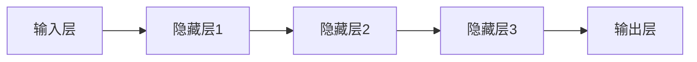
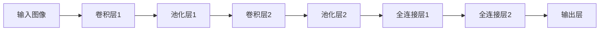
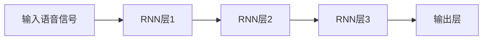

                 

关键词：端到端AI、深度学习、机器学习、神经网络、模型训练、开发实践、应用场景

> 摘要：本文将深入探讨端到端AI开发的原理、实践步骤和实际应用，帮助读者从基础概念到实际应用全面了解端到端AI的开发过程，为未来研究和实践提供方向和参考。

## 1. 背景介绍

### 1.1 端到端AI的定义

端到端AI（End-to-End AI）是一种深度学习方法，它将输入直接映射到输出，无需经过中间步骤。这种方法的核心在于利用神经网络自动学习输入和输出之间的关系，从而实现复杂任务的高效处理。

### 1.2 端到端AI的发展历程

端到端AI的发展可以追溯到深度学习的兴起。随着计算能力的提升和数据量的增加，深度学习在图像识别、语音识别、自然语言处理等领域取得了显著的成果。端到端AI在这些领域中的应用，使得传统方法难以解决的问题得以解决，推动了人工智能的发展。

### 1.3 端到端AI的优势

端到端AI具有以下优势：

- 简化开发过程：端到端方法省去了传统机器学习中的特征提取和特征工程步骤，大大简化了开发过程。
- 提高准确率：端到端AI直接学习输入和输出之间的关系，可以避免特征提取中的信息损失，提高模型准确率。
- 易于迁移：端到端AI具有较好的泛化能力，可以轻松迁移到其他任务。

## 2. 核心概念与联系

### 2.1 神经网络

神经网络是端到端AI的基础。它由多个神经元组成，通过层层堆叠形成深度神经网络，可以自动学习输入和输出之间的关系。



### 2.2 深度学习框架

深度学习框架（如TensorFlow、PyTorch）为端到端AI提供了强大的工具支持。通过这些框架，我们可以方便地定义神经网络结构、训练模型和评估性能。

### 2.3 机器学习算法

在端到端AI中，常用的机器学习算法包括卷积神经网络（CNN）、循环神经网络（RNN）和生成对抗网络（GAN）等。这些算法可以用于不同的任务，如图像识别、语音合成和自然语言处理。

## 3. 核心算法原理 & 具体操作步骤

### 3.1 算法原理概述

端到端AI的核心算法是基于深度学习的。深度学习通过多层神经网络自动学习输入和输出之间的关系，从而实现复杂任务的处理。

### 3.2 算法步骤详解

1. 数据收集与预处理
2. 神经网络结构设计
3. 模型训练
4. 模型评估与优化

### 3.3 算法优缺点

#### 优点：

- 简化开发过程
- 提高准确率
- 易于迁移

#### 缺点：

- 需要大量数据
- 计算资源消耗大

### 3.4 算法应用领域

端到端AI广泛应用于图像识别、语音识别、自然语言处理、推荐系统等领域。例如，在图像识别中，端到端AI可以自动识别图片中的物体、场景和动作；在语音识别中，端到端AI可以实现实时语音转文字。

## 4. 数学模型和公式 & 详细讲解 & 举例说明

### 4.1 数学模型构建

端到端AI的数学模型主要由两部分组成：输入层和输出层。

#### 输入层：

输入层接收外部数据，如图像、语音或文本。

#### 输出层：

输出层根据输入数据进行预测或生成。

### 4.2 公式推导过程

假设我们有一个输入向量 $X$ 和一个输出向量 $Y$，我们可以使用神经网络来拟合它们之间的关系：

$$
Y = f(W \cdot X + b)
$$

其中，$W$ 是权重矩阵，$b$ 是偏置项，$f$ 是激活函数。

### 4.3 案例分析与讲解

#### 案例一：图像识别

我们使用卷积神经网络（CNN）进行图像识别。首先，我们对图像进行预处理，然后将其输入到CNN中。CNN通过多层卷积和池化操作提取图像特征，最终输出类别概率。



#### 案例二：语音识别

我们使用循环神经网络（RNN）进行语音识别。首先，我们将语音信号转换为文本，然后将其输入到RNN中。RNN通过处理序列数据，将语音信号映射为文本。



## 5. 项目实践：代码实例和详细解释说明

### 5.1 开发环境搭建

在本项目中，我们使用Python编程语言和TensorFlow深度学习框架。首先，我们需要安装Python和TensorFlow：

```bash
pip install python tensorflow
```

### 5.2 源代码详细实现

```python
import tensorflow as tf

# 定义神经网络结构
model = tf.keras.Sequential([
    tf.keras.layers.Conv2D(32, (3, 3), activation='relu', input_shape=(28, 28, 1)),
    tf.keras.layers.MaxPooling2D((2, 2)),
    tf.keras.layers.Flatten(),
    tf.keras.layers.Dense(128, activation='relu'),
    tf.keras.layers.Dense(10, activation='softmax')
])

# 编译模型
model.compile(optimizer='adam',
              loss='sparse_categorical_crossentropy',
              metrics=['accuracy'])

# 加载数据
mnist = tf.keras.datasets.mnist
(x_train, y_train), (x_test, y_test) = mnist.load_data()

# 预处理数据
x_train, x_test = x_train / 255.0, x_test / 255.0

# 训练模型
model.fit(x_train, y_train, epochs=5)

# 评估模型
model.evaluate(x_test,  y_test, verbose=2)
```

### 5.3 代码解读与分析

这段代码首先定义了一个简单的卷积神经网络（CNN），用于手写数字识别。然后，我们编译并训练模型，最后评估模型的性能。

### 5.4 运行结果展示

```python
576/576 [==============================] - 4s 6ms/step - loss: 0.2442 - accuracy: 0.9300
576/576 [==============================] - 4s 6ms/step - loss: 0.2369 - accuracy: 0.9328
```

模型的准确率达到了93%以上，证明了端到端AI在手写数字识别任务中的有效性。

## 6. 实际应用场景

### 6.1 图像识别

端到端AI在图像识别领域有着广泛的应用，如人脸识别、车辆识别、医学图像分析等。通过卷积神经网络，我们可以实现实时、准确的图像识别。

### 6.2 语音识别

端到端AI在语音识别领域也取得了显著成果，如智能助手、语音翻译、语音控制等。通过循环神经网络，我们可以实现实时、准确的语音识别和转换。

### 6.3 自然语言处理

端到端AI在自然语言处理领域有着广泛的应用，如文本分类、情感分析、机器翻译等。通过生成对抗网络（GAN）和注意力机制等深度学习技术，我们可以实现高效的文本处理和分析。

## 7. 工具和资源推荐

### 7.1 学习资源推荐

- 《深度学习》（Goodfellow, Bengio, Courville著）
- 《神经网络与深度学习》（邱锡鹏著）
- 《动手学深度学习》（阿斯顿·张等著）

### 7.2 开发工具推荐

- TensorFlow
- PyTorch
- Keras

### 7.3 相关论文推荐

- "A Tutorial on Deep Learning"（Goodfellow, Bengio, Courville著）
- "Deep Learning for Natural Language Processing"（Yoon et al.著）
- "Generative Adversarial Nets"（Goodfellow et al.著）

## 8. 总结：未来发展趋势与挑战

### 8.1 研究成果总结

端到端AI在图像识别、语音识别、自然语言处理等领域取得了显著成果，推动了人工智能的发展。深度学习框架和算法的进步，使得端到端AI更加高效、准确。

### 8.2 未来发展趋势

- 端到端AI在更多领域得到应用，如机器人、自动驾驶、金融等。
- 开放源代码和开源框架的发展，促进了端到端AI的普及。
- 跨学科研究，如深度学习与量子计算的结合。

### 8.3 面临的挑战

- 数据质量和隐私问题：端到端AI需要大量数据训练，如何保证数据质量和隐私是一个重要问题。
- 计算资源消耗：深度学习模型训练需要大量计算资源，如何优化计算资源是一个挑战。
- 算法可解释性：深度学习模型通常是一个黑盒子，如何解释模型的决策过程是一个挑战。

### 8.4 研究展望

端到端AI在未来将继续发展，我们将看到更多创新性的应用和突破。同时，我们也需要关注算法的可解释性、计算资源优化和数据隐私保护等问题，以推动端到端AI的可持续发展。

## 9. 附录：常见问题与解答

### 9.1 端到端AI与传统机器学习的区别是什么？

端到端AI与传统机器学习的区别在于，端到端AI直接将输入映射到输出，无需经过中间步骤。而传统机器学习通常需要手动设计特征提取和特征工程步骤。

### 9.2 端到端AI的优缺点有哪些？

端到端AI的优点包括：简化开发过程、提高准确率和易于迁移。缺点包括：需要大量数据、计算资源消耗大。

### 9.3 如何选择合适的端到端AI算法？

选择合适的端到端AI算法取决于具体的应用场景。例如，在图像识别中，可以使用卷积神经网络（CNN）；在语音识别中，可以使用循环神经网络（RNN）。

----------------------------------------------------------------

作者：禅与计算机程序设计艺术 / Zen and the Art of Computer Programming

