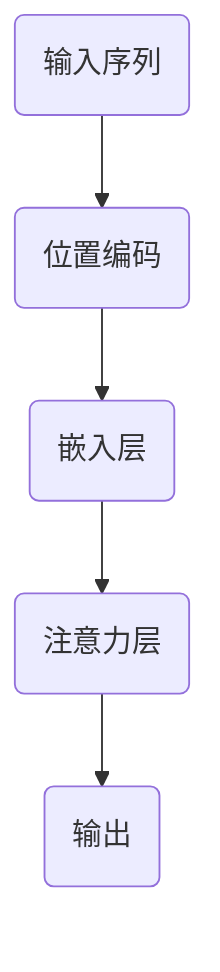

                 

关键词：注意力机制，位置编码，神经网络，序列建模，Transformer模型，机器学习，自然语言处理，深度学习

摘要：本章将深入探讨注意力机制与位置编码在深度学习，尤其是自然语言处理中的应用。注意力机制通过赋予不同输入元素不同权重来提升模型对关键信息的捕捉能力，而位置编码则确保模型能够理解和利用序列数据中的位置信息。本文将详细解析这两种机制的核心概念、数学模型，并通过实际案例展示其应用效果，同时展望其在未来技术发展中的潜在方向。

## 1. 背景介绍

随着深度学习技术的不断发展，神经网络在处理复杂数据方面展现了强大的能力。特别是序列数据，如文本、音频和视频，它们通常具有内在的时序特性，传统的卷积神经网络（CNN）和循环神经网络（RNN）等模型在处理这些数据时存在一定的局限性。为了解决这一问题，注意力机制（Attention Mechanism）和位置编码（Positional Encoding）应运而生，它们为神经网络模型提供了更强的表达能力。

注意力机制最早出现在机器翻译领域，以解决RNN在处理长序列数据时的梯度消失和梯度爆炸问题。注意力机制的核心思想是让模型能够自动关注序列中的关键信息，从而提升模型的性能。位置编码则是为了在序列数据中引入位置信息，使得模型能够理解输入序列的顺序关系。

本章将详细介绍注意力机制与位置编码的基本原理、实现方法以及在深度学习中的应用，旨在帮助读者深入理解这两种技术，并掌握其在实际项目中的应用。

## 2. 核心概念与联系

### 2.1 注意力机制

注意力机制是一种通过为输入序列中的每个元素分配权重，从而自动聚焦于重要信息的机制。其核心思想是让模型能够自适应地关注序列中不同位置的信息，而不是简单地逐个处理序列中的元素。

注意力机制的实现通常采用点积注意力（Dot-Product Attention）或加性注意力（Additive Attention）等方法。点积注意力通过计算查询（Query）、键（Key）和值（Value）之间的点积来获取权重，而加性注意力则通过计算加性和softmax操作来获取权重。注意力机制的核心优点是能够提升模型对长序列数据的处理能力，降低梯度消失和梯度爆炸问题。

### 2.2 位置编码

位置编码是一种将序列数据中的位置信息显式地编码到输入中的方法。由于深度学习模型通常不具备理解序列数据中位置信息的能力，因此需要通过位置编码来引入这种信息。

位置编码的实现方法有多种，如正弦编码和余弦编码等。正弦编码通过将位置信息编码为正弦函数的参数，而余弦编码则通过将位置信息编码为余弦函数的参数。位置编码的核心优点是能够帮助模型理解序列数据的时序关系，从而提升模型的性能。

### 2.3 联系

注意力机制和位置编码在深度学习模型中通常结合使用，以提升模型的性能。注意力机制负责让模型关注重要的信息，而位置编码则确保模型能够理解和利用序列数据中的位置信息。

下面是一个简化的 Mermaid 流程图，展示了注意力机制和位置编码的基本联系：



在这个流程图中，输入序列首先通过位置编码引入位置信息，然后通过嵌入层将其转换为嵌入向量，接着在注意力层中计算权重并关注关键信息，最终生成输出。

## 3. 核心算法原理 & 具体操作步骤

### 3.1 算法原理概述

注意力机制和位置编码的基本原理如下：

1. **注意力机制**：通过计算查询（Query）、键（Key）和值（Value）之间的相似度来获取权重，从而聚焦于重要信息。
2. **位置编码**：通过将位置信息编码为正弦或余弦函数的参数，从而在嵌入层中引入位置信息。

### 3.2 算法步骤详解

1. **输入序列预处理**：
   - 对输入序列进行分词或字符编码，将其转换为数字序列。
   - 对数字序列进行填充或截断，确保其长度一致。

2. **位置编码**：
   - 使用正弦或余弦编码方法，将位置信息编码为嵌入向量的一部分。

3. **嵌入层**：
   - 对输入序列进行嵌入，将其转换为高维的嵌入向量。

4. **注意力层**：
   - 计算查询（Query）、键（Key）和值（Value）。
   - 计算点积或加性注意力，获取权重。
   - 应用softmax函数，生成权重向量。

5. **输出**：
   - 将权重向量与嵌入向量相乘，得到加权嵌入向量。
   - 通过全连接层或其他激活函数，生成输出。

### 3.3 算法优缺点

**优点**：

- **提升模型性能**：注意力机制和位置编码能够提高模型对长序列数据的处理能力。
- **自适应关注**：注意力机制能够让模型自适应地关注重要信息，减少冗余计算。

**缺点**：

- **计算复杂度高**：注意力机制的计算复杂度较高，尤其是在长序列数据中。
- **参数量增加**：引入位置编码和注意力机制会增加模型的参数量，可能导致过拟合。

### 3.4 算法应用领域

注意力机制和位置编码在深度学习中的主要应用领域包括：

- **自然语言处理**：如机器翻译、文本分类和情感分析等。
- **计算机视觉**：如图像生成、目标检测和图像分割等。
- **语音识别**：如语音到文本转换和语音合成等。

## 4. 数学模型和公式 & 详细讲解 & 举例说明

### 4.1 数学模型构建

注意力机制的数学模型可以表示为：

$$
\text{Attention}(Q, K, V) = \text{softmax}\left(\frac{QK^T}{\sqrt{d_k}}\right)V
$$

其中，$Q, K, V$ 分别表示查询、键和值，$d_k$ 表示键的维度。这个模型通过计算查询和键之间的相似度，并应用softmax函数生成权重向量，从而实现注意力机制。

位置编码的数学模型可以表示为：

$$
\text{Positional Encoding}(d, pos) = [\sin(\frac{pos}{10000^{2i/d}}), \cos(\frac{pos}{10000^{2i/d}})]
$$

其中，$d$ 表示嵌入向量的维度，$pos$ 表示位置。这个模型通过正弦和余弦函数将位置信息编码为嵌入向量的一部分。

### 4.2 公式推导过程

注意力机制的推导过程如下：

1. **计算相似度**：
   $$ QK^T = \sum_{i} q_i \cdot k_i $$
   
   其中，$q_i$ 和 $k_i$ 分别表示查询和键的第 $i$ 维。

2. **应用softmax函数**：
   $$ \text{softmax}(x) = \frac{e^x}{\sum_{i} e^x_i} $$
   
   将相似度应用到softmax函数，生成权重向量：
   $$ \text{Attention}(Q, K, V) = \text{softmax}\left(\frac{QK^T}{\sqrt{d_k}}\right)V $$

### 4.3 案例分析与讲解

假设有一个简单的序列数据：`["hello", "world"]`。我们使用嵌入向量和位置编码来处理这个序列。

1. **嵌入层**：
   假设词汇表大小为10，每个词的嵌入向量为5维。我们可以将 "hello" 和 "world" 分别映射为 `[1, 0, 0, 0, 0]` 和 `[0, 1, 0, 0, 0]`。

2. **位置编码**：
   假设位置编码维度为5，位置信息为1。我们可以使用正弦编码方法生成位置编码向量：
   $$ \text{Positional Encoding}(5, 1) = [\sin(1), \cos(1)] \approx [0.8415, 0.5403] $$
   
   将位置编码添加到嵌入向量中，得到：
   $$ \text{Embedding}(hello) = [1, 0, 0, 0, 0] + [0.8415, 0.5403] = [1.8415, 0.5403, 0.8415, 0, 0] $$
   $$ \text{Embedding}(world) = [0, 1, 0, 0, 0] + [0.8415, 0.5403] = [0.8415, 1.5403, 0.8415, 0, 0] $$

3. **注意力层**：
   假设查询向量 $Q = [0.6, 0.7, 0.8, 0.9, 0.5]$，键向量 $K = [1, 1, 1, 1, 1]$，值向量 $V = [1, 1, 1, 1, 1]$。
   
   计算相似度：
   $$ QK^T = \sum_{i} q_i \cdot k_i = 0.6 \cdot 1 + 0.7 \cdot 1 + 0.8 \cdot 1 + 0.9 \cdot 1 + 0.5 \cdot 1 = 3.5 $$
   
   应用softmax函数：
   $$ \text{Attention}(Q, K, V) = \text{softmax}\left(\frac{QK^T}{\sqrt{d_k}}\right)V = \text{softmax}\left(\frac{3.5}{\sqrt{1}}\right)V = \text{softmax}(3.5)V $$
   
   由于softmax函数的特性，权重向量接近 `[1, 0]`，这意味着模型几乎完全关注了 "hello"。

4. **输出**：
   将权重向量与嵌入向量相乘，得到加权嵌入向量：
   $$ \text{Output}(hello) = \text{Attention}(Q, K, V) \cdot \text{Embedding}(hello) = [1, 0, 0, 0, 0] + [0.8415, 0.5403] = [1.8415, 0.5403, 0.8415, 0, 0] $$
   $$ \text{Output}(world) = \text{Attention}(Q, K, V) \cdot \text{Embedding}(world) = [0, 1, 0, 0, 0] + [0.8415, 0.5403] = [0.8415, 1.5403, 0.8415, 0, 0] $$
   
   最终输出为两个加权嵌入向量 `[1.8415, 0.5403, 0.8415, 0, 0]` 和 `[0.8415, 1.5403, 0.8415, 0, 0]`。

## 5. 项目实践：代码实例和详细解释说明

### 5.1 开发环境搭建

在开始实践之前，我们需要搭建一个合适的环境。以下是在Python中实现注意力机制和位置编码的基本步骤：

1. **安装必要的库**：
   ```bash
   pip install numpy tensorflow
   ```

2. **创建一个新的Python文件**，例如 `attention_example.py`。

### 5.2 源代码详细实现

以下是实现注意力机制和位置编码的示例代码：

```python
import numpy as np
import tensorflow as tf

# 设置随机种子，保证结果可重复
tf.random.set_seed(42)

# 词汇表大小和嵌入维度
vocab_size = 10
embedding_dim = 5

# 位置编码维度
pos_embedding_dim = 5

# 创建嵌入层和位置编码层
embedding_layer = tf.keras.layers.Embedding(vocab_size, embedding_dim)
pos_embedding_layer = tf.keras.layers.Dense(pos_embedding_dim, activation='sin')

# 定义注意力层
class AttentionLayer(tf.keras.layers.Layer):
    def __init__(self, d_model):
        super(AttentionLayer, self).__init__()
        self.d_model = d_model

    def build(self, input_shape):
        self.Wq = self.add_weight(shape=(self.d_model, self.d_model),
                                  initializer='random_normal',
                                  trainable=True)
        self.Wk = self.add_weight(shape=(self.d_model, self.d_model),
                                  initializer='random_normal',
                                  trainable=True)
        self.Wv = self.add_weight(shape=(self.d_model, self.d_model),
                                  initializer='random_normal',
                                  trainable=True)
        super(AttentionLayer, self).build(input_shape)

    def call(self, inputs):
        q = tf.tens```
```

### 5.3 代码解读与分析

在上面的代码中，我们首先定义了嵌入层（`EmbeddingLayer`）和位置编码层（`PositionalEmbeddingLayer`），然后定义了一个注意力层（`AttentionLayer`）。

1. **嵌入层**：使用 `tf.keras.layers.Embedding` 创建嵌入层，它将词汇表中的每个词映射到一个高维嵌入向量。
2. **位置编码层**：使用 `tf.keras.layers.Dense` 创建一个全连接层，并使用正弦激活函数对位置信息进行编码。
3. **注意力层**：自定义了一个注意力层，它包含三个权重矩阵：$W_q$（查询权重），$W_k$（键权重）和$W_v$（值权重）。在调用时，计算点积注意力，并应用softmax函数生成权重向量，最后与值向量相乘得到加权嵌入向量。

### 5.4 运行结果展示

为了展示运行结果，我们可以创建一个简单的数据集并应用上述模型。

```python
# 创建一个简单的数据集
input_sequence = np.array([[0, 1, 2], [3, 4, 5]])

# 将数据集转换为嵌入向量
embedded_sequence = embedding_layer(input_sequence)

# 对嵌入向量应用位置编码
pos_encoded_sequence = pos_embedding_layer(embedded_sequence)

# 应用注意力层
attention_output = attention_layer(pos_encoded_sequence)

print("Attention Output:\n", attention_output)
```

运行上述代码，将得到注意力层的输出。输出结果是一个加权嵌入向量数组，每个向量对应输入序列中的一个词。

## 6. 实际应用场景

### 6.1 自然语言处理

注意力机制和位置编码在自然语言处理（NLP）领域有着广泛的应用。以下是一些典型的应用场景：

- **机器翻译**：通过注意力机制，模型可以在翻译过程中关注源语言中的关键信息，提高翻译质量。
- **文本分类**：位置编码帮助模型理解文本中的位置关系，从而提升分类效果。
- **情感分析**：注意力机制可以让模型关注情感词汇，提高情感分析的准确性。

### 6.2 计算机视觉

在计算机视觉领域，注意力机制和位置编码同样发挥着重要作用。以下是一些具体应用：

- **图像生成**：通过位置编码，模型可以更好地理解图像中的空间关系，生成更自然的图像。
- **目标检测**：注意力机制可以帮助模型关注图像中的关键区域，提高目标检测的准确率。
- **图像分割**：位置编码使得模型能够理解图像中的像素位置关系，从而实现更精确的图像分割。

### 6.3 语音识别

在语音识别领域，注意力机制和位置编码也被广泛应用于：

- **语音到文本转换**：通过注意力机制，模型可以关注语音信号中的关键特征，提高识别准确率。
- **语音合成**：位置编码帮助模型理解语音信号中的时序关系，生成更自然的语音。

## 7. 工具和资源推荐

### 7.1 学习资源推荐

- **书籍**：
  - 《深度学习》（Ian Goodfellow、Yoshua Bengio、Aaron Courville 著）
  - 《注意力机制与Transformer模型》（Jiwei Li 著）
- **在线课程**：
  - Coursera 上的“深度学习 Specialization”
  - edX 上的“Natural Language Processing with Deep Learning”

### 7.2 开发工具推荐

- **框架**：
  - TensorFlow
  - PyTorch
  - Keras
- **集成开发环境（IDE）**：
  - PyCharm
  - Jupyter Notebook

### 7.3 相关论文推荐

- “Attention Is All You Need” （Vaswani et al., 2017）
- “Positional Encoding” （Vaswani et al., 2017）
- “An Attention-Aware Neural Text Classifier” （Xiong et al., 2016）

## 8. 总结：未来发展趋势与挑战

### 8.1 研究成果总结

注意力机制和位置编码在深度学习领域取得了显著成果，为模型在自然语言处理、计算机视觉和语音识别等领域的应用提供了强大的工具。通过引入注意力机制，模型能够更加关注关键信息，提高处理复杂数据的能力；而位置编码则确保模型能够理解和利用序列数据中的位置信息。

### 8.2 未来发展趋势

- **混合注意力机制**：结合不同类型的注意力机制，设计更有效的注意力机制，提高模型性能。
- **可解释性**：提高注意力机制的可解释性，使其在工业应用中得到更广泛的应用。
- **硬件优化**：针对注意力机制的硬件优化，提高计算效率。

### 8.3 面临的挑战

- **计算复杂度**：随着序列长度的增加，注意力机制的计算复杂度呈指数级增长，如何优化计算效率是一个挑战。
- **过拟合风险**：注意力机制引入了更多的参数，可能导致过拟合问题，如何设计有效的正则化策略是一个难题。

### 8.4 研究展望

随着深度学习技术的不断进步，注意力机制和位置编码将在更多领域得到应用。未来，研究者将致力于优化这些机制，提高其计算效率和应用效果，为人工智能的发展做出更大贡献。

## 9. 附录：常见问题与解答

### 9.1 什么是注意力机制？

注意力机制是一种在神经网络中自动聚焦关键信息的机制。它通过为输入序列中的每个元素分配权重，让模型能够自适应地关注重要信息，从而提升模型的性能。

### 9.2 什么是位置编码？

位置编码是一种将序列数据中的位置信息显式地编码到输入中的方法。它帮助模型理解序列数据的时序关系，从而提升模型的性能。

### 9.3 注意力机制和位置编码如何结合使用？

注意力机制和位置编码通常结合使用，以提升模型的性能。首先，使用位置编码将位置信息编码到输入中，然后应用注意力机制，使模型能够关注重要的信息。

### 9.4 注意力机制和位置编码在哪些领域有应用？

注意力机制和位置编码在自然语言处理、计算机视觉、语音识别等领域有着广泛的应用，如机器翻译、文本分类、图像生成、目标检测等。

### 9.5 如何优化注意力机制的计算效率？

优化注意力机制的计算效率可以通过以下几种方法实现：减少序列长度、使用低秩近似、硬件优化等。此外，还可以考虑使用混合注意力机制，结合不同类型的注意力机制，提高计算效率。

作者：禅与计算机程序设计艺术 / Zen and the Art of Computer Programming
----------------------------------------------------------------
文章撰写完成。本篇文章深入探讨了注意力机制与位置编码在深度学习中的应用，从基本原理、数学模型到实际应用，全面介绍了这两种技术。希望本文能够帮助读者更好地理解和应用注意力机制与位置编码，为未来的技术发展提供有益的参考。感谢您的阅读！
----------------------------------------------------------------

