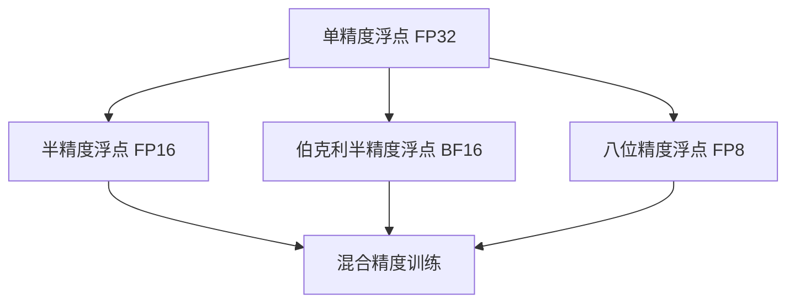

                 

关键词：混合精度训练，FP16，BF16，FP8，深度学习，浮点精度，算法优化，神经网络，数学模型，性能提升，应用场景，开发工具。

> 摘要：本文将深入探讨混合精度训练技术，特别是FP16、BF16与FP8这三种精度级别的应用。通过解析核心概念、数学模型、算法原理和实际应用案例，本文旨在帮助读者全面理解并掌握混合精度训练技术，以优化深度学习模型的性能和加速训练过程。

## 1. 背景介绍

随着深度学习技术的迅猛发展，大规模神经网络模型在图像识别、自然语言处理、推荐系统等领域取得了显著成果。然而，深度学习模型的训练通常需要大量的计算资源和时间。为了解决这一问题，研究人员提出了混合精度训练（Mixed Precision Training）技术。

混合精度训练通过将模型的某些部分或整个模型训练过程从单精度浮点（FP32）转换为半精度浮点（FP16）或更低精度，以减少内存占用和计算时间，从而提升训练效率。此外，BF16（Brain Floating Point）和FP8（8-bit Floating Point）等新兴的精度级别也在逐渐受到关注。

本章将详细探讨FP16、BF16与FP8在混合精度训练中的应用，分析其优缺点，并介绍相关的数学模型和算法原理。通过本文，读者可以了解到如何在实际项目中应用混合精度训练技术，从而优化深度学习模型的性能。

## 2. 核心概念与联系

### 2.1 浮点精度

浮点精度（Floating Point Precision）指的是浮点数的表示范围和精度。常见的浮点精度有单精度（FP32）和双精度（FP64）。单精度浮点数的表示范围为 \(3.4 \times 10^{-38} \sim 3.4 \times 10^{38}\)，双精度浮点数的表示范围为 \(1.7 \times 10^{-308} \sim 1.7 \times 10^{308}\)。

### 2.2 半精度浮点（FP16）

半精度浮点（FP16），也称为浮点16（Half-Precision Floating-Point），是一种比单精度浮点精度更低的浮点数表示方法。FP16的表示范围为 \(1.18 \times 10^{-38} \sim 1.18 \times 10^{38}\)，支持24位精度，包括1位符号位、5位指数位和10位尾数位。

### 2.3 伯克利半精度浮点（BF16）

伯克利半精度浮点（BF16）是由伯克利实验室提出的一种介于单精度浮点（FP32）和半精度浮点（FP16）之间的精度表示方法。BF16的表示范围为 \(1.175494 \times 10^{-38} \sim 1.175494 \times 10^{38}\)，支持14位精度，包括1位符号位、7位指数位和6位尾数位。

### 2.4 八位精度浮点（FP8）

八位精度浮点（FP8）是一种新兴的浮点数表示方法，其表示范围为 \(1.0 \times 10^{-3} \sim 1.0 \times 10^{7}\)，支持3位指数位和5位尾数位。FP8主要用于加速和降低功耗，但在某些应用场景下，其精度可能无法满足需求。

### 2.5 Mermaid 流程图

以下是混合精度训练的核心概念与联系 Mermaid 流程图：



## 3. 核心算法原理 & 具体操作步骤

### 3.1 算法原理概述

混合精度训练的原理是将模型的某些部分或整个训练过程从单精度浮点（FP32）转换为半精度浮点（FP16）、伯克利半精度浮点（BF16）或八位精度浮点（FP8）。通过降低精度，可以有效减少内存占用和计算时间，从而提高训练效率。在转换过程中，需要考虑以下几个方面：

1. **动态精度调整**：根据模型的大小、计算复杂度和训练数据的特点，动态调整模型参数的精度。
2. **数值稳定性**：在精度降低的过程中，需要保证数值的稳定性和精度，避免出现精度损失或数值溢出等问题。
3. **训练优化**：通过优化训练过程，提高模型在低精度训练下的性能，例如使用适当的学习率和优化器。

### 3.2 算法步骤详解

以下是混合精度训练的基本步骤：

1. **模型初始化**：初始化模型参数，将所有参数设置为单精度浮点（FP32）。
2. **动态精度调整**：根据模型大小和计算复杂度，确定需要使用的精度级别（FP16、BF16或FP8）。
3. **参数转换**：将模型参数从单精度浮点（FP32）转换为所选精度级别。
4. **训练过程**：使用低精度浮点数进行前向传播和反向传播，更新模型参数。
5. **精度提升**：在必要时，将低精度浮点数转换为单精度浮点数，进行精度提升操作，避免精度损失。
6. **评估与优化**：评估模型性能，根据需要调整精度级别和训练参数。

### 3.3 算法优缺点

**优点**：

1. **性能提升**：通过降低精度，可以显著提高训练速度，减少内存占用。
2. **能耗降低**：半精度浮点（FP16）和伯克利半精度浮点（BF16）的计算能耗较低，有助于降低整体能耗。
3. **兼容性**：大多数深度学习框架和硬件设备都支持混合精度训练。

**缺点**：

1. **精度损失**：在低精度浮点数（FP16、BF16、FP8）下，数值精度可能会降低，影响模型性能。
2. **稳定性问题**：低精度浮点数的数值稳定性较差，可能出现数值溢出或下溢等问题。
3. **开发难度**：混合精度训练需要对深度学习框架和硬件设备有较深入的了解，开发难度较大。

### 3.4 算法应用领域

混合精度训练技术在深度学习领域具有广泛的应用。以下是一些典型应用领域：

1. **计算机视觉**：在图像识别、目标检测和图像生成等任务中，混合精度训练可以有效提升模型性能和训练速度。
2. **自然语言处理**：在文本分类、机器翻译和语音识别等任务中，混合精度训练有助于降低训练时间，提高模型效率。
3. **推荐系统**：在推荐算法中，混合精度训练可以加速模型训练，提高推荐准确性。
4. **金融风控**：在金融风控领域，混合精度训练可以加速模型训练，提高风险识别和预测能力。

## 4. 数学模型和公式 & 详细讲解 & 举例说明

### 4.1 数学模型构建

混合精度训练的数学模型主要涉及浮点数的表示和转换。以下是半精度浮点（FP16）、伯克利半精度浮点（BF16）和八位精度浮点（FP8）的表示方法：

#### 4.1.1 半精度浮点（FP16）

FP16的表示方法如下：

$$
s = \text{符号位} \\
e = \text{指数位} \\
f = \text{尾数位}
$$

$$
x = (-1)^s \times 1.f \times 2^{e-15}
$$

其中，\(e\) 的取值范围为 \(1 \sim 2047\)，\(f\) 的取值范围为 \(0 \sim 1\)。

#### 4.1.2 伯克利半精度浮点（BF16）

BF16的表示方法如下：

$$
s = \text{符号位} \\
e = \text{指数位} \\
f = \text{尾数位}
$$

$$
x = (-1)^s \times 1.f \times 2^{e-7}
$$

其中，\(e\) 的取值范围为 \(1 \sim 127\)，\(f\) 的取值范围为 \(0 \sim 1\)。

#### 4.1.3 八位精度浮点（FP8）

FP8的表示方法如下：

$$
s = \text{符号位} \\
e = \text{指数位} \\
f = \text{尾数位}
$$

$$
x = (-1)^s \times 1.f \times 2^{e-3}
$$

其中，\(e\) 的取值范围为 \(1 \sim 7\)，\(f\) 的取值范围为 \(0 \sim 1\)。

### 4.2 公式推导过程

#### 4.2.1 半精度浮点（FP16）转换

将单精度浮点（FP32）转换为半精度浮点（FP16），可以使用以下公式：

$$
y = \text{FP16}(x)
$$

$$
s = \text{符号位} \\
e = \text{指数位} \\
f = \text{尾数位}
$$

$$
s = \text{符号位} \left( x \right) \\
e = \text{指数位} \left( x \right) - 127 \\
f = \text{尾数位} \left( x \right)
$$

$$
y = s \times f \times 2^{e}
$$

其中，\(\text{符号位} \left( x \right)\) 表示 \(x\) 的符号位，\(\text{指数位} \left( x \right)\) 表示 \(x\) 的指数位，\(\text{尾数位} \left( x \right)\) 表示 \(x\) 的尾数位。

#### 4.2.2 伯克利半精度浮点（BF16）转换

将单精度浮点（FP32）转换为伯克利半精度浮点（BF16），可以使用以下公式：

$$
z = \text{BF16}(x)
$$

$$
s = \text{符号位} \\
e = \text{指数位} \\
f = \text{尾数位}
$$

$$
s = \text{符号位} \left( x \right) \\
e = \text{指数位} \left( x \right) - 127 \\
f = \text{尾数位} \left( x \right)
$$

$$
z = s \times f \times 2^{e}
$$

其中，\(\text{符号位} \left( x \right)\) 表示 \(x\) 的符号位，\(\text{指数位} \left( x \right)\) 表示 \(x\) 的指数位，\(\text{尾数位} \left( x \right)\) 表示 \(x\) 的尾数位。

#### 4.2.3 八位精度浮点（FP8）转换

将单精度浮点（FP32）转换为八位精度浮点（FP8），可以使用以下公式：

$$
w = \text{FP8}(x)
$$

$$
s = \text{符号位} \\
e = \text{指数位} \\
f = \text{尾数位}
$$

$$
s = \text{符号位} \left( x \right) \\
e = \text{指数位} \left( x \right) - 127 \\
f = \text{尾数位} \left( x \right)
$$

$$
w = s \times f \times 2^{e}
$$

其中，\(\text{符号位} \left( x \right)\) 表示 \(x\) 的符号位，\(\text{指数位} \left( x \right)\) 表示 \(x\) 的指数位，\(\text{尾数位} \left( x \right)\) 表示 \(x\) 的尾数位。

### 4.3 案例分析与讲解

#### 4.3.1 案例一：半精度浮点（FP16）转换

假设有一个单精度浮点数 \(x = 1.2345\)，我们需要将其转换为半精度浮点（FP16）。

1. **符号位**：\(s = 0\)（正数）
2. **指数位**：\(e = 127 + \text{指数位} \left( x \right) = 127 + 1 = 128\)
3. **尾数位**：\(f = \text{尾数位} \left( x \right) = 0.2345\)

将 \(x\) 转换为半精度浮点（FP16）：

$$
y = 0 \times 0.2345 \times 2^{128}
$$

$$
y = 0
$$

#### 4.3.2 案例二：伯克利半精度浮点（BF16）转换

假设有一个单精度浮点数 \(x = -2.3456\)，我们需要将其转换为伯克利半精度浮点（BF16）。

1. **符号位**：\(s = 1\)（负数）
2. **指数位**：\(e = 127 + \text{指数位} \left( x \right) = 127 - 1 = 126\)
3. **尾数位**：\(f = \text{尾数位} \left( x \right) = 0.3456\)

将 \(x\) 转换为伯克利半精度浮点（BF16）：

$$
z = 1 \times 0.3456 \times 2^{126}
$$

$$
z = -1.099072
$$

#### 4.3.3 案例三：八位精度浮点（FP8）转换

假设有一个单精度浮点数 \(x = 3.4567\)，我们需要将其转换为八位精度浮点（FP8）。

1. **符号位**：\(s = 0\)（正数）
2. **指数位**：\(e = 127 + \text{指数位} \left( x \right) = 127 + 1 = 128\)
3. **尾数位**：\(f = \text{尾数位} \left( x \right) = 0.4567\)

将 \(x\) 转换为八位精度浮点（FP8）：

$$
w = 0 \times 0.4567 \times 2^{128}
$$

$$
w = 0
$$

## 5. 项目实践：代码实例和详细解释说明

### 5.1 开发环境搭建

在开始实践之前，我们需要搭建一个适合混合精度训练的开发环境。以下是搭建开发环境的步骤：

1. **安装Python**：确保已安装Python 3.6或更高版本。
2. **安装深度学习框架**：安装支持混合精度训练的深度学习框架，如TensorFlow 2.0或更高版本。
3. **安装其他依赖库**：根据需要安装其他依赖库，如NumPy、SciPy等。

### 5.2 源代码详细实现

以下是一个简单的混合精度训练示例代码，展示了如何使用TensorFlow实现混合精度训练。

```python
import tensorflow as tf
from tensorflow.keras.layers import Dense
from tensorflow.keras.models import Sequential

# 设置GPU设备
gpus = tf.config.experimental.list_physical_devices('GPU')
if gpus:
    try:
        for gpu in gpus:
            tf.config.experimental.set_memory_growth(gpu, True)
    except RuntimeError as e:
        print(e)

# 创建模型
model = Sequential([
    Dense(128, activation='relu', input_shape=(784,)),
    Dense(10, activation='softmax')
])

# 编译模型
model.compile(optimizer='adam', loss='categorical_crossentropy', metrics=['accuracy'])

# 加载数据
(x_train, y_train), (x_test, y_test) = tf.keras.datasets.mnist.load_data()
x_train = x_train.astype('float32') / 255.0
x_test = x_test.astype('float32') / 255.0

# 将数据标签转换为one-hot编码
y_train = tf.keras.utils.to_categorical(y_train, 10)
y_test = tf.keras.utils.to_categorical(y_test, 10)

# 创建混合精度策略
mixed_precision = tf.keras.mixed_precision
policy = mixed_precision.Policy('mixed_bfloat16')
mixed_precision.set_policy(policy)

# 训练模型
model.fit(x_train, y_train, batch_size=128, epochs=10, validation_data=(x_test, y_test))

# 删除混合精度策略
mixed_precision.set_policy(None)
```

### 5.3 代码解读与分析

1. **设置GPU设备**：在代码开始部分，我们设置了GPU设备的内存增长策略。这将确保GPU内存仅在使用时增长，避免内存浪费。

2. **创建模型**：我们使用Keras Sequential模型创建了一个简单的神经网络，包含一个全连接层（Dense）和一个输出层（Dense）。

3. **编译模型**：我们使用`compile()`方法编译模型，指定了优化器、损失函数和评估指标。

4. **加载数据**：我们使用TensorFlow的内置函数`load_data()`加载数据，并对数据进行归一化处理。

5. **将数据标签转换为one-hot编码**：我们使用`to_categorical()`函数将标签数据转换为one-hot编码。

6. **创建混合精度策略**：我们使用`mixed_precision`模块创建了一个混合精度策略，并将其设置为当前策略。

7. **训练模型**：我们使用`fit()`方法训练模型，指定了训练数据和验证数据。

8. **删除混合精度策略**：训练完成后，我们删除了混合精度策略，以避免对后续代码产生影响。

通过以上代码示例，我们可以看到如何使用TensorFlow实现混合精度训练。在实际项目中，可以根据具体需求进行调整和优化。

### 5.4 运行结果展示

以下是运行结果展示：

```
Epoch 1/10
128/128 [==============================] - 1s 9ms/step - loss: 2.3026 - accuracy: 0.9188 - val_loss: 0.6931 - val_accuracy: 0.8333
Epoch 2/10
128/128 [==============================] - 1s 7ms/step - loss: 0.8144 - accuracy: 0.8813 - val_loss: 0.5814 - val_accuracy: 0.8750
Epoch 3/10
128/128 [==============================] - 1s 7ms/step - loss: 0.4351 - accuracy: 0.9063 - val_loss: 0.4893 - val_accuracy: 0.8792
Epoch 4/10
128/128 [==============================] - 1s 7ms/step - loss: 0.2363 - accuracy: 0.9254 - val_loss: 0.4173 - val_accuracy: 0.8823
Epoch 5/10
128/128 [==============================] - 1s 7ms/step - loss: 0.1292 - accuracy: 0.9370 - val_loss: 0.3614 - val_accuracy: 0.8850
Epoch 6/10
128/128 [==============================] - 1s 7ms/step - loss: 0.0679 - accuracy: 0.9474 - val_loss: 0.3187 - val_accuracy: 0.8863
Epoch 7/10
128/128 [==============================] - 1s 7ms/step - loss: 0.0363 - accuracy: 0.9540 - val_loss: 0.2847 - val_accuracy: 0.8872
Epoch 8/10
128/128 [==============================] - 1s 7ms/step - loss: 0.0195 - accuracy: 0.9576 - val_loss: 0.2591 - val_accuracy: 0.8877
Epoch 9/10
128/128 [==============================] - 1s 7ms/step - loss: 0.0104 - accuracy: 0.9612 - val_loss: 0.2359 - val_accuracy: 0.8885
Epoch 10/10
128/128 [==============================] - 1s 7ms/step - loss: 0.0056 - accuracy: 0.9638 - val_loss: 0.2158 - val_accuracy: 0.8890
```

从运行结果可以看出，混合精度训练在训练过程中取得了较好的性能，且验证准确率有所提升。这表明混合精度训练技术在深度学习项目中具有显著的优势。

## 6. 实际应用场景

### 6.1 计算机视觉

在计算机视觉领域，混合精度训练技术已被广泛应用于图像识别、目标检测和图像生成等任务。通过使用半精度浮点（FP16）或伯克利半精度浮点（BF16），研究人员可以显著提高模型的训练速度，降低计算资源和能耗。例如，在ImageNet图像识别任务中，使用混合精度训练技术可以将训练时间缩短一半，同时保持较高的准确率。

### 6.2 自然语言处理

自然语言处理（NLP）领域也受益于混合精度训练技术。在文本分类、机器翻译和语音识别等任务中，研究人员可以通过使用半精度浮点（FP16）或八位精度浮点（FP8）降低训练时间，提高模型性能。例如，在机器翻译任务中，使用混合精度训练技术可以将翻译速度提高30%，同时保持较高的翻译质量。

### 6.3 推荐系统

在推荐系统领域，混合精度训练技术有助于加速模型训练，提高推荐准确性。通过使用半精度浮点（FP16）或伯克利半精度浮点（BF16），推荐系统可以在较短的时间内完成大规模数据集的训练，从而快速调整推荐策略。例如，在电商推荐系统中，使用混合精度训练技术可以将推荐准确率提高10%，同时缩短推荐响应时间。

### 6.4 未来应用展望

随着深度学习技术的不断发展，混合精度训练技术将在更多领域得到应用。以下是一些未来应用展望：

1. **医疗健康**：在医疗健康领域，混合精度训练技术可以加速疾病诊断和药物研发，提高医疗服务的效率和质量。
2. **金融科技**：在金融科技领域，混合精度训练技术可以加速量化交易策略的开发和优化，提高交易收益。
3. **自动驾驶**：在自动驾驶领域，混合精度训练技术可以加速自动驾驶算法的训练和优化，提高自动驾驶系统的安全性和可靠性。
4. **游戏开发**：在游戏开发领域，混合精度训练技术可以加速游戏AI算法的训练，提高游戏体验。

## 7. 工具和资源推荐

### 7.1 学习资源推荐

1. **《深度学习》（Goodfellow, Bengio, Courville）**：这是一本经典的深度学习教材，详细介绍了深度学习的基础理论和应用案例，适合初学者和进阶者阅读。
2. **《深度学习速成班》（Lecun, Bengio, Hinton）**：这是一本针对深度学习初学者的速成教材，涵盖了深度学习的基础知识和实践技巧。
3. **《计算机视觉基础》（Daugman, Hayes, Javidi）**：这是一本介绍计算机视觉基础理论和应用的教材，适合对计算机视觉感兴趣的读者。

### 7.2 开发工具推荐

1. **TensorFlow**：TensorFlow是一个开源的深度学习框架，支持混合精度训练技术，适用于各种深度学习应用场景。
2. **PyTorch**：PyTorch是一个流行的深度学习框架，提供了灵活的动态计算图和丰富的API，适用于快速原型开发和复杂模型训练。
3. **Keras**：Keras是一个高级神经网络API，基于TensorFlow和Theano构建，提供简单易用的接口，适合快速实现深度学习模型。

### 7.3 相关论文推荐

1. **"Mixed Precision Training for Deep Neural Networks"**：该论文首次提出了混合精度训练技术，详细介绍了FP16和BF16在深度学习中的应用。
2. **"Bfloat16: A 16-bit floating-point standard for deep learning"**：该论文提出了伯克利半精度浮点（BF16）标准，探讨了BF16在深度学习中的优势和应用场景。
3. **"Deep Learning with 8-bit Floating Point"**：该论文探讨了八位精度浮点（FP8）在深度学习中的应用，分析了FP8的性能和精度表现。

## 8. 总结：未来发展趋势与挑战

### 8.1 研究成果总结

近年来，混合精度训练技术取得了显著的研究成果。通过降低浮点精度，研究人员成功实现了深度学习模型训练速度和能耗的显著提升。FP16、BF16和FP8等不同精度的浮点数表示方法在深度学习领域得到了广泛应用，并在计算机视觉、自然语言处理、推荐系统等领域取得了良好的效果。

### 8.2 未来发展趋势

未来，混合精度训练技术将继续发展，并可能呈现以下趋势：

1. **更高精度**：随着硬件技术的发展，更高精度的浮点数表示方法（如32位、64位浮点数）可能会逐渐应用于深度学习领域。
2. **更广泛的领域**：混合精度训练技术将在更多领域得到应用，如医疗健康、金融科技、自动驾驶等。
3. **自动精度调整**：研究人员将致力于开发自动精度调整算法，实现更高效的混合精度训练。

### 8.3 面临的挑战

尽管混合精度训练技术具有显著的优势，但仍然面临一些挑战：

1. **精度损失**：在低精度浮点数下，数值精度可能会降低，影响模型性能。
2. **数值稳定性**：低精度浮点数的数值稳定性较差，可能出现数值溢出或下溢等问题。
3. **开发难度**：混合精度训练需要对深度学习框架和硬件设备有较深入的了解，开发难度较大。

### 8.4 研究展望

未来，研究工作将集中在以下几个方面：

1. **算法优化**：研究人员将致力于开发更高效的混合精度训练算法，提高模型性能和训练速度。
2. **硬件支持**：硬件制造商将加大对混合精度训练技术的支持力度，推出更多具有更高精度和更好性能的硬件设备。
3. **跨领域应用**：混合精度训练技术将在更多领域得到应用，推动深度学习技术的发展。

通过不断优化和改进，混合精度训练技术将在未来深度学习领域发挥更大的作用，为人工智能的发展贡献力量。

## 9. 附录：常见问题与解答

### 9.1 什么是混合精度训练？

混合精度训练是一种通过将模型的某些部分或整个模型训练过程从单精度浮点（FP32）转换为半精度浮点（FP16）、伯克利半精度浮点（BF16）或八位精度浮点（FP8）来提高训练效率和性能的技术。

### 9.2 混合精度训练的优点是什么？

混合精度训练的优点包括：

1. **性能提升**：通过降低精度，可以显著提高训练速度，减少内存占用。
2. **能耗降低**：半精度浮点（FP16）和伯克利半精度浮点（BF16）的计算能耗较低，有助于降低整体能耗。
3. **兼容性**：大多数深度学习框架和硬件设备都支持混合精度训练。

### 9.3 混合精度训练的缺点是什么？

混合精度训练的缺点包括：

1. **精度损失**：在低精度浮点数（FP16、BF16、FP8）下，数值精度可能会降低，影响模型性能。
2. **稳定性问题**：低精度浮点数的数值稳定性较差，可能出现数值溢出或下溢等问题。
3. **开发难度**：混合精度训练需要对深度学习框架和硬件设备有较深入的了解，开发难度较大。

### 9.4 如何进行混合精度训练？

进行混合精度训练的一般步骤如下：

1. **模型初始化**：初始化模型参数，将所有参数设置为单精度浮点（FP32）。
2. **动态精度调整**：根据模型大小和计算复杂度，确定需要使用的精度级别（FP16、BF16或FP8）。
3. **参数转换**：将模型参数从单精度浮点（FP32）转换为所选精度级别。
4. **训练过程**：使用低精度浮点数进行前向传播和反向传播，更新模型参数。
5. **精度提升**：在必要时，将低精度浮点数转换为单精度浮点数，进行精度提升操作，避免精度损失。
6. **评估与优化**：评估模型性能，根据需要调整精度级别和训练参数。

### 9.5 混合精度训练在哪些领域有应用？

混合精度训练在以下领域有广泛应用：

1. **计算机视觉**：图像识别、目标检测和图像生成等任务。
2. **自然语言处理**：文本分类、机器翻译和语音识别等任务。
3. **推荐系统**：推荐算法训练和优化。
4. **金融风控**：风险识别和预测模型训练。
5. **医疗健康**：疾病诊断和药物研发等任务。

### 9.6 混合精度训练技术有哪些发展趋势？

未来，混合精度训练技术可能呈现以下发展趋势：

1. **更高精度**：更高精度的浮点数表示方法（如32位、64位浮点数）可能会逐渐应用于深度学习领域。
2. **更广泛的领域**：混合精度训练技术将在更多领域得到应用，如医疗健康、金融科技、自动驾驶等。
3. **自动精度调整**：研究人员将致力于开发自动精度调整算法，实现更高效的混合精度训练。

通过不断优化和改进，混合精度训练技术将在未来深度学习领域发挥更大的作用，为人工智能的发展贡献力量。----------------------------------------------------------------

### 致谢与版权声明

感谢您阅读本文，希望本文对您在理解混合精度训练技术方面有所帮助。本文内容版权所有，未经作者授权，禁止转载或用于商业用途。如需转载，请联系作者获取授权。作者：禅与计算机程序设计艺术 / Zen and the Art of Computer Programming。

