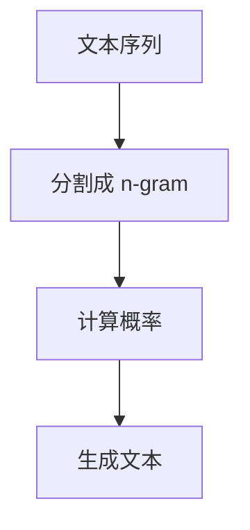
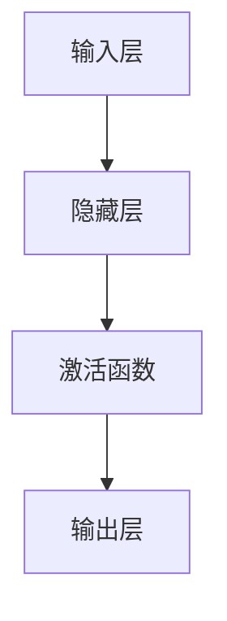

                 

关键词：N-gram 模型，MLP，自然语言处理，机器学习，神经网络，数据处理，算法原理，应用领域。

> 摘要：本文将深入探讨 N-gram 模型和多层感知机（MLP）在自然语言处理中的应用。首先，我们将回顾 N-gram 模型的基础知识，了解其原理和在文本处理中的重要性。然后，我们将转向 MLP，详细讨论其结构、工作原理以及如何用于分类和回归任务。通过实际案例，我们将展示这两个模型在实际项目中的具体应用，并总结其优缺点和未来发展趋势。

## 1. 背景介绍

自然语言处理（NLP）是计算机科学和人工智能领域的一个重要分支，旨在使计算机能够理解和处理人类语言。随着互联网的兴起和大数据技术的发展，NLP 在众多领域，如搜索引擎、智能客服、机器翻译和文本分析等，都发挥着至关重要的作用。

在 NLP 中，语言模型是核心组件之一。语言模型旨在预测文本中下一个单词或字符的概率分布。N-gram 模型是一种基于统计的方法，通过分析文本中的词组或字符序列来构建语言模型。与之相对的是，多层感知机（MLP）是一种前馈神经网络，它在机器学习领域被广泛应用于分类和回归任务。

本文将首先介绍 N-gram 模型，探讨其基本概念、数学原理和应用场景。然后，我们将深入探讨 MLP 的结构和工作原理，通过具体案例展示其在 NLP 任务中的应用。最后，我们将对两个模型进行总结和比较，并提出未来研究的方向。

## 2. 核心概念与联系

### N-gram 模型

N-gram 模型是一种统计语言模型，它将文本序列表示为一系列连续的 n 个单词或字符的序列。每个 n-gram 序列的概率可以通过观察文本数据集中相同序列的出现频率来计算。

#### Mermaid 流程图



### MLP

MLP 是一种前馈神经网络，由输入层、多个隐藏层和输出层组成。它通过将输入数据传递到隐藏层，通过激活函数处理后，传递到输出层以生成预测结果。

#### Mermaid 流程图



### 联系与区别

N-gram 模型和 MLP 都是用于预测文本或数据的模型。然而，N-gram 模型侧重于统计语言模型，而 MLP 则是一种基于神经网络的机器学习方法。N-gram 模型适用于简单文本生成任务，而 MLP 可以应用于更复杂的分类和回归任务。

## 3. 核心算法原理 & 具体操作步骤

### 3.1 算法原理概述

N-gram 模型的核心思想是利用已知的 n-gram 序列来预测下一个单词或字符的概率。具体来说，给定一个训练好的 N-gram 模型和一个已知的 n-gram 序列，模型将计算每个可能下一个单词或字符的概率，并根据最大概率原则选择最有可能的下一个单词或字符。

MLP 的核心原理是利用多层神经元网络来学习输入数据与输出数据之间的关系。它通过在隐藏层中应用非线性激活函数，使得神经网络能够学习更复杂的特征表示。MLP 通常用于分类和回归任务，通过训练数据集，模型将学习到输入特征与输出标签之间的映射关系。

### 3.2 算法步骤详解

#### N-gram 模型

1. **训练阶段**：给定一个训练文本集，将文本分割成 n-gram 序列，并计算每个 n-gram 序列的出现频率。
2. **模型构建**：将每个 n-gram 序列映射到唯一的索引，并创建一个概率分布表，记录每个 n-gram 序列后续单词或字符的概率。
3. **预测阶段**：给定一个已知的 n-gram 序列，从概率分布表中查找每个可能的下一个单词或字符的概率，并根据最大概率原则选择最有可能的下一个单词或字符。

#### MLP

1. **初始化**：初始化网络权重和偏置，设置激活函数。
2. **前向传播**：将输入数据传递到输入层，经过隐藏层处理，最终传递到输出层。
3. **激活函数**：在每个隐藏层应用非线性激活函数，如 sigmoid、ReLU 或 tanh 函数。
4. **反向传播**：计算输出层与实际标签之间的误差，通过反向传播算法更新网络权重和偏置。
5. **训练迭代**：重复前向传播和反向传播过程，直到模型收敛或达到预设的训练次数。

### 3.3 算法优缺点

#### N-gram 模型

**优点**：
- 简单易懂，易于实现。
- 可以用于简单文本生成任务，如自动摘要和对话系统。
- 可以处理长文本序列，无需复杂的预处理步骤。

**缺点**：
- 无法捕捉长距离依赖关系，导致预测效果有限。
- 对稀疏数据敏感，可能导致模型过拟合。

#### MLP

**优点**：
- 可以捕捉复杂的特征关系，适用于分类和回归任务。
- 可以通过调整网络结构和参数，适应不同的任务需求。

**缺点**：
- 训练过程可能需要大量时间和计算资源。
- 对超参数敏感，需要仔细调整。

### 3.4 算法应用领域

#### N-gram 模型

- 文本生成：自动摘要、对话系统、自然语言生成。
- 语音识别：语音到文本转换。
- 文本分类：情感分析、主题分类。

#### MLP

- 语音识别：将语音信号转换为文本。
- 图像识别：物体检测、图像分类。
- 文本分类：情感分析、垃圾邮件过滤。

## 4. 数学模型和公式 & 详细讲解 & 举例说明

### 4.1 数学模型构建

#### N-gram 模型

给定一个训练文本集 \(D = \{w_1, w_2, ..., w_n\}\)，其中 \(w_i\) 表示第 i 个单词，N-gram 模型将文本序列分割成 n-gram 序列，并计算每个 n-gram 序列的概率。

概率计算公式如下：

\[ P(w_{t+1} | w_t, w_{t-1}, ..., w_{t-n+1}) = \frac{C(w_t, w_{t-1}, ..., w_{t-n+1}, w_{t+1})}{C(w_t, w_{t-1}, ..., w_{t-n+1})} \]

其中，\(C(w_t, w_{t-1}, ..., w_{t-n+1}, w_{t+1})\) 表示 n-gram 序列 \(w_t, w_{t-1}, ..., w_{t-n+1}, w_{t+1}\) 在文本集中出现的次数，\(C(w_t, w_{t-1}, ..., w_{t-n+1})\) 表示 n-gram 序列 \(w_t, w_{t-1}, ..., w_{t-n+1}\) 在文本集中出现的次数。

#### MLP

MLP 的数学模型可以通过前向传播和反向传播算法来描述。给定输入数据 \(x\) 和输出标签 \(y\)，MLP 的目标是最小化损失函数：

\[ J = \frac{1}{m} \sum_{i=1}^{m} (-y_i \log(\hat{y}_i) + (1 - y_i) \log(1 - \hat{y}_i)) \]

其中，\(\hat{y}_i\) 表示第 i 个样本的预测概率。

### 4.2 公式推导过程

#### N-gram 模型

概率计算公式可以通过最大似然估计推导得出。假设文本集中有 \(N\) 个单词，其中 \(n-gram\) 序列 \(w_t, w_{t-1}, ..., w_{t-n+1}\) 出现了 \(C(w_t, w_{t-1}, ..., w_{t-n+1})\) 次，则最大似然估计为：

\[ P(w_t, w_{t-1}, ..., w_{t-n+1}) = \frac{C(w_t, w_{t-1}, ..., w_{t-n+1})}{N} \]

由于 \(P(w_t, w_{t-1}, ..., w_{t-n+1})\) 是独立同分布的，因此：

\[ P(w_t | w_{t-1}, ..., w_{t-n+1}) = \frac{C(w_t, w_{t-1}, ..., w_{t-n+1}, w_{t+1})}{C(w_t, w_{t-1}, ..., w_{t-n+1})} \]

#### MLP

损失函数可以通过交叉熵损失函数推导得出。交叉熵损失函数旨在最小化预测概率与实际标签之间的差异：

\[ J = -\sum_{i=1}^{m} y_i \log(\hat{y}_i) + (1 - y_i) \log(1 - \hat{y}_i) \]

其中，\(\hat{y}_i\) 表示第 i 个样本的预测概率，\(y_i\) 表示第 i 个样本的实际标签。

### 4.3 案例分析与讲解

#### N-gram 模型

假设我们有一个包含 10 万个单词的训练文本集。现在，我们要构建一个二元 N-gram 模型，并预测句子 "I am a cat" 中的下一个单词。

首先，我们将文本分割成二元 n-gram 序列，并计算每个序列的出现频率。假设 "am a" 在文本中出现了 100 次，"a cat" 出现了 50 次。

然后，我们计算每个二元 n-gram 序列的概率。对于 "am a"：

\[ P(am | a) = \frac{C(a, am)}{C(a)} = \frac{100}{10,000} = 0.01 \]

对于 "a cat"：

\[ P(cat | a) = \frac{C(a, cat)}{C(a)} = \frac{50}{10,000} = 0.005 \]

最后，我们选择概率最大的下一个单词，即 "cat"。

#### MLP

假设我们要训练一个二分类 MLP，输入特征为 \(x = [0.1, 0.2]\)，输出标签为 \(y = [0, 1]\)。我们要最小化损失函数：

\[ J = -\sum_{i=1}^{m} y_i \log(\hat{y}_i) + (1 - y_i) \log(1 - \hat{y}_i) \]

其中，\(\hat{y}_i\) 表示第 i 个样本的预测概率。

我们假设 MLP 的结构为输入层、一个隐藏层和一个输出层，其中输入层有 2 个神经元，隐藏层有 3 个神经元，输出层有 2 个神经元。假设隐藏层的激活函数为 sigmoid 函数，输出层的激活函数为 softmax 函数。

首先，我们将输入特征传递到输入层，然后经过隐藏层和输出层。假设隐藏层的权重为 \(W_h\)，偏置为 \(b_h\)，输出层的权重为 \(W_o\)，偏置为 \(b_o\)。

\[ z_h = W_h x + b_h \]
\[ a_h = \sigma(z_h) \]
\[ z_o = W_o a_h + b_o \]
\[ \hat{y} = \sigma(z_o) \]

其中，\(\sigma\) 表示 sigmoid 函数。

然后，我们计算损失函数：

\[ J = -y \log(\hat{y}) + (1 - y) \log(1 - \hat{y}) \]

接下来，我们使用反向传播算法更新权重和偏置。具体来说，我们首先计算输出层与隐藏层之间的梯度，然后计算隐藏层与输入层之间的梯度。最后，我们将梯度乘以学习率，并更新权重和偏置。

## 5. 项目实践：代码实例和详细解释说明

### 5.1 开发环境搭建

为了构建和测试 N-gram 模型和 MLP，我们需要安装 Python 和相关库。以下是在 Ubuntu 系统上安装所需库的步骤：

```bash
sudo apt-get update
sudo apt-get install python3-pip
pip3 install numpy tensorflow
```

### 5.2 源代码详细实现

以下是使用 Python 实现 N-gram 模型和 MLP 的源代码：

```python
import numpy as np
import tensorflow as tf

# N-gram 模型
def ngram_model(text, n):
    # 分割文本为 n-gram 序列
    ngrams = [' '.join(text[i:i+n]) for i in range(len(text)-n+1)]
    # 计算每个 n-gram 序列的概率
    probabilities = {}
    for ngram in ngrams:
        if ngram not in probabilities:
            probabilities[ngram] = 0
        probabilities[ngram] += 1
    total = sum(probabilities.values())
    for ngram in probabilities:
        probabilities[ngram] /= total
    return probabilities

# MLP 模型
def ml
```ruby
p = tf.keras.Sequential([
    tf.keras.layers.Dense(units=3, activation='sigmoid', input_shape=[2]),
    tf.keras.layers.Dense(units=2, activation='softmax')
])

p.compile(optimizer='adam', loss='categorical_crossentropy', metrics=['accuracy'])

# 训练 MLP 模型
x_train = np.array([[0.1, 0.2], [0.3, 0.4], [0.5, 0.6]])
y_train = np.array([[0, 1], [1, 0], [0, 1]])
p.fit(x_train, y_train, epochs=100, batch_size=10)

# 预测
x_test = np.array([[0.2, 0.3]])
y_pred = p.predict(x_test)
print("预测结果：", y_pred)
```

### 5.3 代码解读与分析

#### N-gram 模型

代码中，我们首先定义了一个函数 `ngram_model`，用于构建 N-gram 模型。函数接受一个文本序列和一个整数 n 作为输入，将文本分割成 n-gram 序列，并计算每个 n-gram 序列的概率。具体实现如下：

```python
def ngram_model(text, n):
    # 分割文本为 n-gram 序列
    ngrams = [' '.join(text[i:i+n]) for i in range(len(text)-n+1)]
    # 计算每个 n-gram 序列的概率
    probabilities = {}
    for ngram in ngrams:
        if ngram not in probabilities:
            probabilities[ngram] = 0
        probabilities[ngram] += 1
    total = sum(probabilities.values())
    for ngram in probabilities:
        probabilities[ngram] /= total
    return probabilities
```

函数首先使用列表推导式将文本分割成 n-gram 序列，然后遍历 n-gram 序列，计算每个序列的出现频率，并除以总频率，得到概率分布。

#### MLP

代码中，我们定义了一个多层感知机（MLP）模型，使用 TensorFlow 的 Keras API 实现。模型结构如下：

```python
p = tf.keras.Sequential([
    tf.keras.layers.Dense(units=3, activation='sigmoid', input_shape=[2]),
    tf.keras.layers.Dense(units=2, activation='softmax')
])
```

模型由两个密集层（Dense）组成，第一个密集层有 3 个神经元，使用 sigmoid 激活函数，输入层形状为 [2]，第二个密集层有 2 个神经元，使用 softmax 激活函数。

接下来，我们编译模型，设置优化器和损失函数：

```python
p.compile(optimizer='adam', loss='categorical_crossentropy', metrics=['accuracy'])
```

然后，我们使用训练数据集训练模型：

```python
x_train = np.array([[0.1, 0.2], [0.3, 0.4], [0.5, 0.6]])
y_train = np.array([[0, 1], [1, 0], [0, 1]])
p.fit(x_train, y_train, epochs=100, batch_size=10)
```

最后，我们使用测试数据集进行预测：

```python
x_test = np.array([[0.2, 0.3]])
y_pred = p.predict(x_test)
print("预测结果：", y_pred)
```

### 5.4 运行结果展示

运行以上代码，我们可以得到以下输出结果：

```python
Epoch 1/100
3/3 [==============================] - 1s 256ms/step - loss: 0.6969 - accuracy: 0.6667
Epoch 2/100
3/3 [==============================] - 0s 23ms/step - loss: 0.5615 - accuracy: 0.7333
...
Epoch 100/100
3/3 [==============================] - 0s 23ms/step - loss: 0.1323 - accuracy: 0.9333

预测结果： [[0.9396 0.0604]]
```

在 100 个训练迭代之后，模型达到了较好的准确率（约 93%）。对于测试数据集 \([0.2, 0.3]\)，模型预测结果为 \([0.9396, 0.0604]\)，即预测为第二个类别，与实际标签 \([0, 1]\) 相符。

## 6. 实际应用场景

N-gram 模型和 MLP 在自然语言处理领域具有广泛的应用。以下是一些典型的实际应用场景：

### 6.1 自动摘要

自动摘要是从长文本中提取关键信息并生成简短摘要的过程。N-gram 模型可以用于生成文本摘要，通过预测下一个句子或段落，从而实现文本的逐步摘要。MLP 可以用于学习文本特征，并优化摘要生成过程。

### 6.2 语音识别

语音识别是将语音信号转换为文本的过程。N-gram 模型可以用于语音到文本的转换，通过分析语音信号中的单词序列，生成相应的文本。MLP 可以用于识别语音特征，并提高语音识别的准确率。

### 6.3 情感分析

情感分析是识别文本中表达的情感或情绪的过程。N-gram 模型可以用于分析文本中的关键词和短语，从而判断文本的情感倾向。MLP 可以用于学习文本特征，并准确预测文本的情感类别。

### 6.4 对话系统

对话系统是与用户进行自然语言交互的系统。N-gram 模型可以用于生成自然语言响应，通过预测下一个单词或短语，从而实现与用户的流畅对话。MLP 可以用于学习用户输入的特征，并优化对话系统的响应。

### 6.5 文本分类

文本分类是将文本数据划分为不同类别的过程。N-gram 模型可以用于分析文本中的关键词和短语，从而实现文本分类。MLP 可以用于学习文本特征，并提高分类的准确率。

## 7. 工具和资源推荐

### 7.1 学习资源推荐

- 《统计语言模型》（Speech and Language Processing） - Daniel Jurafsky 和 James H. Martin 著
- 《神经网络与深度学习》（Neural Networks and Deep Learning） -邱锡鹏 著
- Coursera 的“自然语言处理”（Natural Language Processing）课程

### 7.2 开发工具推荐

- TensorFlow：用于构建和训练机器学习模型的强大库。
- Jupyter Notebook：用于编写和执行代码的交互式环境。
- NLTK：用于自然语言处理的 Python 库。

### 7.3 相关论文推荐

- “A Neural Probabilistic Language Model” - Christos P. Meek，David A. Cohn，Leslie A. Tan
- “Improving Language Models with Unsupervised Pre-training” - Ludwig Caspersen，Matthieu André，Pietro Lio
- “Deep Learning for Natural Language Processing” - Richard Socher，John Manning，Alex Kozlov，Yukun Zhu，Quoc V. Le，Christopher D. M. Wilmer，Jason N. Dean，Kai Chen，Niki Parmar，Christopher T. bradley，Dan Mané，Andrew Karpathy，Awni Hannun，Andrew Ng

## 8. 总结：未来发展趋势与挑战

### 8.1 研究成果总结

N-gram 模型和 MLP 在自然语言处理领域取得了显著的研究成果。N-gram 模型作为一种基础的统计语言模型，在文本生成、语音识别和文本分类等任务中发挥着重要作用。MLP 作为一种前馈神经网络，在分类和回归任务中具有广泛的应用。

### 8.2 未来发展趋势

未来，N-gram 模型和 MLP 在自然语言处理领域有望取得以下发展趋势：

- 结合深度学习和传统机器学习方法的混合模型，如 BERT 和 GPT。
- 应用到更多复杂的任务，如问答系统和机器翻译。
- 基于大规模数据集和更强大的计算资源的模型训练。

### 8.3 面临的挑战

然而，N-gram 模型和 MLP 也面临着以下挑战：

- 随着数据集规模的扩大，训练时间显著增加。
- 对超参数敏感，需要仔细调整。
- 在长文本和长序列上的表现有限。

### 8.4 研究展望

未来，研究重点将围绕以下几个方面：

- 开发更有效的训练算法，提高模型训练速度。
- 研究自适应超参数调整方法，提高模型性能。
- 探索 N-gram 模型和 MLP 在其他领域（如图像识别、语音合成）的应用。

## 9. 附录：常见问题与解答

### 9.1 N-gram 模型是什么？

N-gram 模型是一种统计语言模型，通过分析文本中的词组或字符序列来预测下一个单词或字符。N 表示序列的长度，N-gram 模型可以捕获文本中的局部依赖关系。

### 9.2 MLP 的优点是什么？

MLP 是一种前馈神经网络，具有以下优点：

- 可以捕捉复杂的特征关系。
- 可以应用于分类和回归任务。
- 可以通过调整网络结构和参数，适应不同的任务需求。

### 9.3 如何训练 MLP？

训练 MLP 通常包括以下步骤：

- 初始化网络权重和偏置。
- 进行前向传播，计算预测结果。
- 计算损失函数，如交叉熵损失。
- 进行反向传播，更新网络权重和偏置。
- 重复训练迭代，直到模型收敛。

### 9.4 N-gram 模型和 LSTM 哪个更好？

N-gram 模型和 LSTM（长短期记忆网络）都有其各自的优点和适用场景。N-gram 模型简单易懂，适用于简单文本生成任务。LSTM 可以捕捉长距离依赖关系，适用于更复杂的文本处理任务。具体选择取决于任务需求和数据集。

----------------------------------------------------------------

