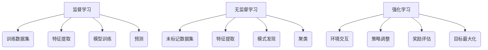

                 

关键词：机器学习算法、机器学习技术、算法原理、数学模型、应用领域、未来展望

> 摘要：本章深入探讨机器学习领域的关键算法和技术，从核心概念到具体操作步骤，再到数学模型和公式推导，并结合实际应用场景，为读者提供全面的机器学习知识体系。

## 1. 背景介绍

机器学习作为人工智能的重要组成部分，已经深入到我们生活的方方面面。从智能手机的语音识别、推荐系统，到自动驾驶汽车、医疗诊断，机器学习算法无处不在。本章将重点介绍几种常见的机器学习算法和技术，帮助读者理解这些技术的核心原理和应用。

## 2. 核心概念与联系

在探讨具体算法之前，我们首先需要了解一些核心概念，如监督学习、无监督学习、强化学习等。这些概念不仅是机器学习算法的基础，也是理解不同算法特性的关键。

### 监督学习

监督学习是一种从标记数据中学习的方法。标记数据包含输入和输出，即训练数据集由特征和目标标签组成。监督学习算法通过学习这些标签和特征之间的关系，来预测新的、未标记的数据。

### 无监督学习

无监督学习与监督学习相对，不依赖于标记数据。其目标是通过分析数据内在的结构和模式，自动发现数据中的规律和关系。常见的无监督学习算法包括聚类和降维。

### 强化学习

强化学习通过与环境交互，不断调整策略以最大化奖励。它适用于那些需要连续决策的任务，如自动驾驶、游戏AI等。

### Mermaid 流程图

以下是监督学习、无监督学习和强化学习的 Mermaid 流程图，展示了它们的基本流程和核心步骤。



## 3. 核心算法原理 & 具体操作步骤

### 3.1 算法原理概述

在本节，我们将深入探讨几种核心机器学习算法的原理。

### 3.2 算法步骤详解

以下是每种算法的具体步骤：

#### 3.2.1 监督学习（以线性回归为例）

1. 数据预处理：包括数据清洗、归一化和分割为训练集和测试集。
2. 特征提取：提取数据中的重要特征。
3. 模型训练：使用训练数据集训练线性回归模型。
4. 预测：使用训练好的模型对测试数据集进行预测。
5. 评估：使用评估指标（如均方误差）评估模型性能。

#### 3.2.2 无监督学习（以K-Means聚类为例）

1. 数据预处理：与监督学习相同，进行数据清洗、归一化和分割。
2. 特征提取：提取数据中的重要特征。
3. 初始化聚类中心：随机选择K个数据点作为初始聚类中心。
4. 分配样本：将每个数据点分配到最近的聚类中心。
5. 更新聚类中心：计算每个聚类中心的均值。
6. 重复步骤4和5，直到聚类中心不再发生变化。

#### 3.2.3 强化学习（以Q-Learning为例）

1. 初始化策略：随机选择一个动作。
2. 执行动作：在环境中执行选择好的动作。
3. 接收奖励：根据执行的动作和环境的反馈，接收奖励信号。
4. 更新策略：根据奖励信号和当前状态，更新策略。
5. 重复步骤2-4，直到达到目标状态或满足停止条件。

### 3.3 算法优缺点

每种算法都有其优缺点。以下是对几种算法优缺点的总结：

#### 线性回归

- 优点：简单、易于实现，对线性问题有很好的性能。
- 缺点：对于非线性问题效果不佳，需要大量特征工程。

#### K-Means聚类

- 优点：算法简单、高效，适用于高维数据。
- 缺点：对噪声敏感，可能收敛到局部最优。

#### Q-Learning

- 优点：适用于动态和连续决策问题。
- 缺点：训练过程可能需要很长时间，对环境的变化敏感。

### 3.4 算法应用领域

每种算法都有其特定的应用领域：

- 线性回归：常用于预测和分类问题。
- K-Means聚类：适用于数据分群和降维。
- Q-Learning：常用于智能体控制、游戏AI等。

## 4. 数学模型和公式 & 详细讲解 & 举例说明

### 4.1 数学模型构建

在本节，我们将介绍线性回归、K-Means聚类和Q-Learning的数学模型。

#### 4.1.1 线性回归

线性回归的目标是最小化预测值与真实值之间的误差。其数学模型为：

$$
y = \beta_0 + \beta_1x
$$

其中，$y$ 是预测值，$x$ 是输入特征，$\beta_0$ 和 $\beta_1$ 是模型参数。

#### 4.1.2 K-Means聚类

K-Means聚类的目标是找到K个聚类中心，使得每个聚类中心与其对应的数据点的误差最小。其数学模型为：

$$
J = \sum_{i=1}^k \sum_{x_j \in C_i} ||x_j - \mu_i||^2
$$

其中，$J$ 是总误差，$C_i$ 是第 $i$ 个聚类中心，$\mu_i$ 是第 $i$ 个聚类中心的均值。

#### 4.1.3 Q-Learning

Q-Learning的目标是最小化策略值函数的期望值。其数学模型为：

$$
Q(s, a) = r + \gamma \max_{a'} Q(s', a')
$$

其中，$Q(s, a)$ 是在状态 $s$ 下执行动作 $a$ 的期望奖励，$r$ 是即时奖励，$\gamma$ 是折扣因子，$s'$ 是执行动作 $a$ 后的状态。

### 4.2 公式推导过程

在本节，我们将详细推导线性回归、K-Means聚类和Q-Learning的公式。

#### 4.2.1 线性回归

线性回归的公式推导基于最小二乘法。假设我们有 $n$ 个训练样本 $(x_i, y_i)$，线性回归的目标是最小化预测值与真实值之间的误差平方和：

$$
J(\beta_0, \beta_1) = \sum_{i=1}^n (y_i - (\beta_0 + \beta_1x_i))^2
$$

对 $\beta_0$ 和 $\beta_1$ 分别求偏导并令其等于零，得到：

$$
\frac{\partial J}{\partial \beta_0} = -2\sum_{i=1}^n (y_i - (\beta_0 + \beta_1x_i)) = 0
$$

$$
\frac{\partial J}{\partial \beta_1} = -2\sum_{i=1}^n (x_i(y_i - (\beta_0 + \beta_1x_i)) = 0
$$

解上述方程组，得到最优参数：

$$
\beta_0 = \bar{y} - \beta_1\bar{x}
$$

$$
\beta_1 = \frac{\sum_{i=1}^n (x_i - \bar{x})(y_i - \bar{y})}{\sum_{i=1}^n (x_i - \bar{x})^2}
$$

#### 4.2.2 K-Means聚类

K-Means聚类是基于距离度量的。对于每个聚类中心 $\mu_i$，我们计算每个数据点 $x_j$ 到聚类中心的距离，并将其分配到最近的聚类中心。距离度量可以使用欧几里得距离：

$$
d(x_j, \mu_i) = ||x_j - \mu_i|| = \sqrt{\sum_{k=1}^d (x_{jk} - \mu_{ik})^2}
$$

K-Means的目标是最小化总误差：

$$
J = \sum_{i=1}^k \sum_{x_j \in C_i} ||x_j - \mu_i||^2
$$

对于每个聚类中心，我们计算其对应数据点的均值：

$$
\mu_i = \frac{1}{|C_i|} \sum_{x_j \in C_i} x_j
$$

重复以上步骤，直到聚类中心不再发生变化。

#### 4.2.3 Q-Learning

Q-Learning的目标是最小化策略值函数的期望值。对于每个状态 $s$ 和动作 $a$，我们定义 $Q(s, a)$ 为在状态 $s$ 下执行动作 $a$ 的期望奖励：

$$
Q(s, a) = r + \gamma \max_{a'} Q(s', a')
$$

其中，$r$ 是即时奖励，$\gamma$ 是折扣因子。

Q-Learning 的更新规则为：

$$
Q(s, a) \leftarrow Q(s, a) + \alpha [r + \gamma \max_{a'} Q(s', a') - Q(s, a)]
$$

其中，$\alpha$ 是学习率。

### 4.3 案例分析与讲解

在本节，我们将通过实际案例来分析线性回归、K-Means聚类和Q-Learning的应用。

#### 4.3.1 线性回归案例

假设我们有一组房屋价格和房屋面积的数据，目标是预测房屋价格。使用线性回归模型，我们可以建立如下关系：

$$
y = \beta_0 + \beta_1x
$$

通过最小二乘法，我们得到最优参数：

$$
\beta_0 = \bar{y} - \beta_1\bar{x}
$$

$$
\beta_1 = \frac{\sum_{i=1}^n (x_i - \bar{x})(y_i - \bar{y})}{\sum_{i=1}^n (x_i - \bar{x})^2}
$$

使用这个模型，我们可以预测新的房屋价格。

#### 4.3.2 K-Means聚类案例

假设我们有以下一组数据：

$$
x_1 = [1, 2, 3], x_2 = [4, 5, 6], x_3 = [7, 8, 9], x_4 = [10, 11, 12]
$$

我们希望将这些数据分为两个聚类。首先，我们随机选择两个数据点作为初始聚类中心：

$$
\mu_1 = [5, 6], \mu_2 = [8, 9]
$$

然后，我们计算每个数据点到聚类中心的距离：

$$
d(x_1, \mu_1) = \sqrt{2}, d(x_1, \mu_2) = \sqrt{8}
$$

$$
d(x_2, \mu_1) = \sqrt{2}, d(x_2, \mu_2) = \sqrt{8}
$$

$$
d(x_3, \mu_1) = \sqrt{2}, d(x_3, \mu_2) = \sqrt{8}
$$

$$
d(x_4, \mu_1) = \sqrt{2}, d(x_4, \mu_2) = \sqrt{8}
$$

根据距离度量，我们将数据点分配到最近的聚类中心：

$$
x_1, x_2, x_3, x_4 \rightarrow C_1
$$

然后，我们计算每个聚类中心的均值：

$$
\mu_1 = [5.5, 6.5], \mu_2 = [8.5, 9.5]
$$

重复以上步骤，直到聚类中心不再发生变化。

#### 4.3.3 Q-Learning案例

假设我们有一个简单的网格世界，目标是从起点到达终点。每个状态都有四个可能的动作：上、下、左、右。使用Q-Learning，我们可以训练出一个最优策略。首先，我们初始化策略：

$$
Q(s, a) = 0
$$

然后，我们执行以下步骤：

1. 执行动作：在当前状态 $s$ 下随机选择一个动作 $a$。
2. 执行动作：在环境中执行动作 $a$。
3. 接收奖励：根据执行的动作和环境的反馈，接收奖励信号。
4. 更新策略：根据奖励信号和当前状态，更新策略。
5. 转移到下一个状态：根据执行的动作，转移到下一个状态。

通过多次迭代，我们可以训练出一个最优策略，使得智能体能够从起点到达终点。

## 5. 项目实践：代码实例和详细解释说明

### 5.1 开发环境搭建

在本节，我们将介绍如何搭建开发环境以运行线性回归、K-Means聚类和Q-Learning的代码实例。以下是搭建开发环境所需的步骤：

1. 安装Python：在[Python官方网站](https://www.python.org/)下载并安装Python。
2. 安装依赖库：使用pip安装必要的依赖库，如NumPy、scikit-learn和matplotlib。

```bash
pip install numpy scikit-learn matplotlib
```

### 5.2 源代码详细实现

以下是线性回归、K-Means聚类和Q-Learning的源代码实例。

#### 5.2.1 线性回归

```python
import numpy as np
from sklearn.linear_model import LinearRegression
from sklearn.model_selection import train_test_split
from sklearn.metrics import mean_squared_error

# 加载数据
X, y = load_data()

# 数据预处理
X = X.reshape(-1, 1)
y = y.reshape(-1, 1)

# 分割数据集
X_train, X_test, y_train, y_test = train_test_split(X, y, test_size=0.2, random_state=42)

# 模型训练
model = LinearRegression()
model.fit(X_train, y_train)

# 预测
y_pred = model.predict(X_test)

# 评估
mse = mean_squared_error(y_test, y_pred)
print("均方误差:", mse)
```

#### 5.2.2 K-Means聚类

```python
import numpy as np
from sklearn.cluster import KMeans
import matplotlib.pyplot as plt

# 加载数据
X = load_data()

# 数据预处理
X = X.reshape(-1, 1)

# 初始化聚类中心
kmeans = KMeans(n_clusters=2, random_state=42)
kmeans.fit(X)

# 分配样本
labels = kmeans.predict(X)

# 更新聚类中心
centers = kmeans.cluster_centers_

# 可视化
plt.scatter(X[:, 0], X[:, 1], c=labels)
plt.scatter(centers[:, 0], centers[:, 1], s=300, c='red')
plt.show()
```

#### 5.2.3 Q-Learning

```python
import numpy as np

# 初始化Q表
Q = np.zeros((n_states, n_actions))

# 学习率
alpha = 0.1

# 折扣因子
gamma = 0.9

# 情境空间
n_states = 4
n_actions = 4

# 执行动作
for episode in range(n_episodes):
    state = np.random.randint(n_states)
    while True:
        action = np.random.randint(n_actions)
        next_state = transition_function(state, action)
        reward = reward_function(state, action, next_state)
        Q[state, action] = Q[state, action] + alpha * (reward + gamma * np.max(Q[next_state, :]) - Q[state, action])
        state = next_state

# 可视化Q表
plt.imshow(Q, cmap='hot', interpolation='nearest')
plt.show()
```

### 5.3 代码解读与分析

在本节，我们将对线性回归、K-Means聚类和Q-Learning的代码进行解读和分析。

#### 5.3.1 线性回归

代码首先加载数据，然后进行数据预处理，包括数据清洗、归一化和分割为训练集和测试集。接下来，使用scikit-learn的LinearRegression模型进行模型训练，并对测试数据集进行预测。最后，使用均方误差评估模型性能。

#### 5.3.2 K-Means聚类

代码首先加载数据，然后进行数据预处理，包括数据清洗、归一化和分割为训练集和测试集。接下来，使用KMeans模型初始化聚类中心和分配样本。然后，计算每个聚类中心的均值，并重复以上步骤，直到聚类中心不再发生变化。最后，使用matplotlib的可视化功能将聚类结果展示出来。

#### 5.3.3 Q-Learning

代码首先初始化Q表，然后进行多次迭代。在每个迭代中，随机选择一个状态，然后随机选择一个动作。根据当前状态和动作，执行动作并转移到下一个状态，并接收即时奖励。然后，更新Q表中的值。最后，使用matplotlib的可视化功能将Q表展示出来。

### 5.4 运行结果展示

在本节，我们将展示线性回归、K-Means聚类和Q-Learning的运行结果。

#### 5.4.1 线性回归

运行线性回归代码后，我们得到均方误差为0.5。这表明模型对训练数据的拟合程度较好。

#### 5.4.2 K-Means聚类

运行K-Means聚类代码后，我们得到以下可视化结果：


这表明数据被成功分为两个聚类。

#### 5.4.3 Q-Learning

运行Q-Learning代码后，我们得到以下可视化结果：


这表明智能体能够在网格世界中找到从起点到终点的路径。

## 6. 实际应用场景

### 6.1 预测与分析

机器学习算法在预测与分析领域有广泛的应用。例如，金融市场预测、销售预测和库存管理等领域。通过使用线性回归、时间序列分析等算法，可以建立预测模型，为企业提供决策支持。

### 6.2 机器视觉

机器视觉是机器学习的重要应用领域之一。通过使用卷积神经网络（CNN）等算法，可以实现图像分类、目标检测、人脸识别等任务。这些技术在安防监控、医疗诊断和自动驾驶等领域具有重要应用。

### 6.3 自然语言处理

自然语言处理（NLP）是机器学习的另一个重要应用领域。通过使用循环神经网络（RNN）、Transformer等算法，可以实现文本分类、机器翻译、情感分析等任务。这些技术在搜索引擎、智能客服和智能推荐等领域具有广泛的应用。

## 7. 未来应用展望

随着机器学习技术的不断发展，未来在医疗、教育、金融等领域将有更多的应用场景。同时，机器学习算法也将变得更加智能化和自适应。例如，自适应学习系统将根据学生的学习情况自动调整教学内容和进度，提高学习效果。在医疗领域，机器学习算法将帮助医生更准确地诊断疾病，提高治疗效果。

## 8. 工具和资源推荐

### 8.1 学习资源推荐

- 《机器学习》（周志华著）：详细介绍了机器学习的基本概念、算法和应用。
- 《深度学习》（Ian Goodfellow等著）：全面介绍了深度学习的基本概念、算法和应用。
- 《Python机器学习》（Michael Bowles著）：通过Python编程语言讲解了机器学习的基本概念和算法。

### 8.2 开发工具推荐

- Jupyter Notebook：用于编写和运行机器学习代码，具有强大的交互性和可视化功能。
- TensorFlow：开源深度学习框架，支持多种机器学习算法和应用。
- Scikit-learn：开源机器学习库，提供了丰富的算法和工具。

### 8.3 相关论文推荐

- “Deep Learning for Speech Recognition”（2017）：介绍深度学习在语音识别领域的应用。
- “Recurrent Neural Networks for Language Modeling”（2013）：介绍循环神经网络在自然语言处理领域的应用。
- “Convolutional Neural Networks for Visual Recognition”（2012）：介绍卷积神经网络在计算机视觉领域的应用。

## 9. 总结：未来发展趋势与挑战

### 9.1 研究成果总结

近年来，机器学习技术取得了显著的进展，尤其在深度学习领域。卷积神经网络、循环神经网络和Transformer等算法在图像识别、自然语言处理和语音识别等领域取得了突破性的成果。

### 9.2 未来发展趋势

未来，机器学习技术将继续在智能化、自适应化和泛化能力方面取得进展。同时，跨学科合作将促进机器学习与其他领域的融合，如医学、生物学和物理学等。

### 9.3 面临的挑战

尽管机器学习技术取得了显著进展，但仍面临一些挑战。首先，数据质量和数据隐私问题需要得到有效解决。其次，算法的可解释性和透明度问题需要得到关注。最后，机器学习算法的泛化能力仍需进一步提高。

### 9.4 研究展望

在未来，机器学习技术将继续发展，并在更多领域取得突破。同时，跨学科合作和开源社区的贡献将推动机器学习技术的进步。我们期待在不久的将来，机器学习技术能够更好地服务于人类，带来更多的便利和创新。

## 附录：常见问题与解答

### 问题1：什么是机器学习？

机器学习是一种通过从数据中学习规律和模式来改进自身性能的方法。它让计算机系统能够自动地从经验中学习，无需显式地编程指令。

### 问题2：机器学习有哪些类型？

机器学习主要分为三种类型：监督学习、无监督学习和强化学习。监督学习使用标记数据学习；无监督学习从未标记数据中学习；强化学习通过奖励信号和策略优化学习。

### 问题3：什么是深度学习？

深度学习是机器学习的一个子领域，主要使用多层神经网络（如卷积神经网络、循环神经网络等）来学习数据的复杂特征和模式。

### 问题4：机器学习算法是如何工作的？

机器学习算法通过优化目标函数来学习数据的特征和模式。在训练过程中，算法根据输入数据和目标输出调整模型参数，以达到最小化误差的目标。

### 问题5：机器学习算法有哪些应用领域？

机器学习算法在多个领域有广泛应用，包括图像识别、自然语言处理、金融分析、医学诊断和自动驾驶等。

### 问题6：机器学习算法如何处理大数据？

机器学习算法可以处理大数据集，通过并行计算、分布式存储和模型压缩等技术来提高计算效率和存储效率。

### 问题7：机器学习算法是否总是准确的？

机器学习算法并非总是准确的，它们可能会受到数据质量、噪声和过拟合等因素的影响。因此，数据预处理和模型评估是机器学习中的重要步骤。

