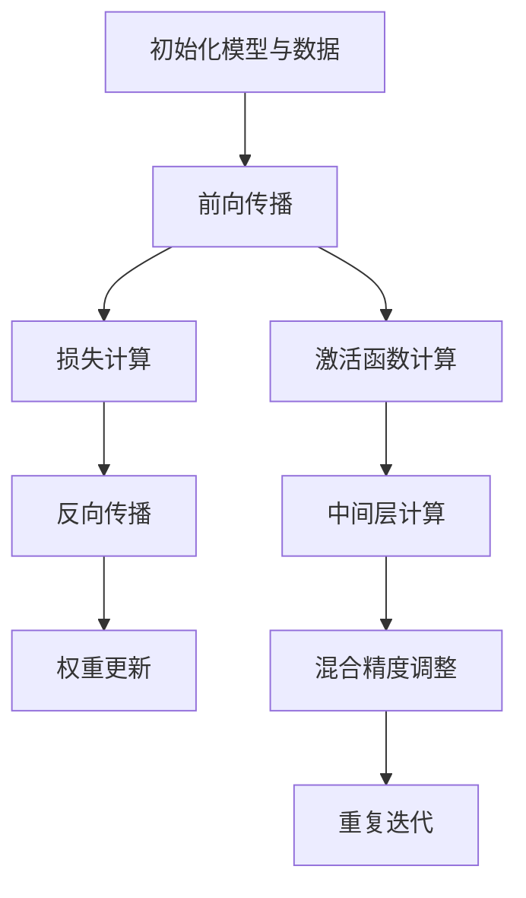

                 

混合精度训练（Mixed Precision Training）是深度学习领域中的一项重要技术，它通过在训练过程中结合使用单精度浮点（FP32）和半精度浮点（FP16）两种数据类型，不仅显著提升了计算效率，同时也有效减少了模型训练的时间。本文将详细探讨混合精度训练的优势、实现方法以及在实际应用中的效果。

## 1. 背景介绍

深度学习模型的训练过程是一个极其复杂和计算密集的任务，特别是在面对大型神经网络和海量数据集时，训练时间的长短直接影响着模型开发的效率。传统的单精度浮点运算（FP32）虽然已经能够满足大多数应用需求，但在一些高精度要求或需要极高并行性能的场景中，其性能瓶颈逐渐显现。为了克服这些问题，研究人员开始探索使用半精度浮点运算（FP16），它能够在保持相对精度损失较小的情况下，显著提升计算效率。

混合精度训练的核心思想是将FP16和FP32结合使用，通过在计算过程中适当地调整数据类型的转换，使得模型在获得较高计算效率的同时，仍能保证训练结果的准确性。这一技术的出现，标志着深度学习领域迈向更高效率和更高精度的新里程碑。

## 2. 核心概念与联系

### 2.1 混合精度浮点数

在混合精度训练中，最基本的两个浮点数类型是单精度浮点（FP32）和半精度浮点（FP16）。FP32占用了4个字节，能够表示的数值范围为±3.4028235E+38，精度较高；而FP16只占用了2个字节，能够表示的数值范围为±6.55E+03F，精度相对较低。虽然FP16的精度有所损失，但其计算速度更快，因此在一些对精度要求不苛刻的场景中具有显著优势。

### 2.2 混合精度训练原理

混合精度训练的原理在于，将整个训练过程中不同的计算步骤分配给FP16和FP32，以实现效率和精度的平衡。一般来说，模型中的前向传播和反向传播过程中，权重更新和损失计算等步骤需要保持较高的精度，因此可以使用FP32；而激活函数和中间层计算等步骤，则可以使用FP16，从而减少计算量和内存占用。

### 2.3 Mermaid 流程图



在上面的流程图中，初始化模型与数据（A）后，进入前向传播（B），然后计算损失（C），进行反向传播（D）和权重更新（E）。在前向传播过程中，激活函数（F）和中间层计算（G）使用FP16，而损失计算（C）和权重更新（E）使用FP32。为了确保结果的准确性，在每次迭代结束时，会进行混合精度调整（H），以确保最终结果的精度。

## 3. 核心算法原理 & 具体操作步骤

### 3.1 算法原理概述

混合精度训练算法的核心原理在于，通过动态调整计算过程中的浮点数类型，实现计算效率和精度的平衡。具体来说，算法分为以下几个步骤：

1. **初始化**：设置模型参数，包括权重和偏置，通常使用FP32初始化。
2. **前向传播**：计算输入数据经过神经网络中的各个层，得到输出结果。在这一过程中，激活函数和中间层计算通常使用FP16，以提高计算速度。
3. **损失计算**：计算预测结果与实际标签之间的差异，通常使用FP32来保证损失值的准确性。
4. **反向传播**：通过链式法则，计算每个权重和偏置的梯度，这一步骤同样使用FP32，以确保梯度的精度。
5. **权重更新**：使用计算得到的梯度更新模型参数，仍然使用FP32。
6. **混合精度调整**：在每次迭代结束时，对模型参数进行精度调整，确保最终结果的准确性。

### 3.2 算法步骤详解

1. **初始化模型与数据**：
    - 设置模型的初始权重和偏置，通常使用FP32。
    - 初始化输入数据和标签。

2. **前向传播**：
    - 使用FP16进行激活函数和中间层计算，以提高计算速度。
    - 将输入数据传递给模型的每一层，计算输出结果。

3. **损失计算**：
    - 使用FP32计算预测结果与实际标签之间的差异，得到损失值。

4. **反向传播**：
    - 使用FP32计算每个权重和偏置的梯度。
    - 通过链式法则，将梯度传递回前一层。

5. **权重更新**：
    - 使用计算得到的梯度，更新模型的权重和偏置，仍然使用FP32。

6. **混合精度调整**：
    - 在每次迭代结束时，对模型的权重和偏置进行精度调整，确保结果的准确性。

7. **重复迭代**：
    - 重复上述步骤，直到模型收敛或达到预设的迭代次数。

### 3.3 算法优缺点

**优点**：

1. **提升计算效率**：使用FP16进行大部分计算，可以显著提高训练速度。
2. **减少内存占用**：FP16的数据类型占用的内存空间只有FP32的一半，可以减少内存的占用。
3. **降低能耗**：FP16的计算速度更快，能耗更低，有助于提高模型训练的能效比。

**缺点**：

1. **精度损失**：虽然FP16的精度相对较低，但在某些高精度要求的应用场景中，可能会影响模型的性能。
2. **实现复杂度**：混合精度训练的实现相对复杂，需要处理数据类型的转换和精度调整，增加了代码的复杂度。

### 3.4 算法应用领域

混合精度训练在深度学习领域中具有广泛的应用前景，尤其是在需要处理大规模数据集和复杂神经网络的场景中。以下是一些具体的应用领域：

1. **计算机视觉**：在图像识别、目标检测和图像生成等任务中，混合精度训练可以提高模型的训练速度和效率。
2. **自然语言处理**：在语言模型训练、机器翻译和文本生成等任务中，混合精度训练有助于提升模型的计算性能。
3. **推荐系统**：在推荐算法的训练过程中，混合精度训练可以加速模型的迭代过程，提高推荐的准确性。
4. **医学影像分析**：在医学影像识别和疾病诊断等任务中，混合精度训练有助于提高模型的处理速度和精度。

## 4. 数学模型和公式 & 详细讲解 & 举例说明

### 4.1 数学模型构建

混合精度训练的数学模型主要涉及到浮点数的转换和运算。在本文中，我们主要关注FP16和FP32的转换以及混合精度下的矩阵运算。

#### 4.1.1 浮点数转换

FP16到FP32的转换可以使用如下公式：

\[ \text{FP32} = \text{FP16} \times 2^{15} \]

FP32到FP16的转换可以使用如下公式：

\[ \text{FP16} = \text{FP32} \div 2^{15} \]

#### 4.1.2 矩阵运算

在混合精度训练中，矩阵运算需要根据运算的类型和精度要求来选择不同的数据类型。以下是FP16和FP32在矩阵运算中的具体应用：

- **矩阵乘法**：对于矩阵乘法，通常使用FP32进行计算，以确保结果的准确性。具体公式如下：

\[ C = A \times B \]

- **矩阵加法/减法**：对于矩阵加法/减法，可以使用FP16进行计算，以提高计算速度。具体公式如下：

\[ C = A + B \]
\[ C = A - B \]

### 4.2 公式推导过程

在混合精度训练中，浮点数的转换和运算需要遵循一定的规则，以确保结果的准确性。以下是FP16和FP32在矩阵运算中的推导过程：

#### 4.2.1 矩阵乘法

假设有两个矩阵 \( A \) 和 \( B \)，其中 \( A \) 是一个 \( m \times n \) 的矩阵，\( B \) 是一个 \( n \times p \) 的矩阵。使用FP32进行矩阵乘法，具体推导过程如下：

\[ C_{ij} = \sum_{k=1}^{n} A_{ik} \times B_{kj} \]

其中 \( C \) 是结果矩阵，\( C_{ij} \) 表示矩阵 \( C \) 的第 \( i \) 行第 \( j \) 列的元素。

#### 4.2.2 矩阵加法/减法

假设有两个矩阵 \( A \) 和 \( B \)，其中 \( A \) 是一个 \( m \times n \) 的矩阵，\( B \) 是一个 \( m \times n \) 的矩阵。使用FP16进行矩阵加法/减法，具体推导过程如下：

\[ C_{ij} = A_{ij} + B_{ij} \]
\[ C_{ij} = A_{ij} - B_{ij} \]

其中 \( C \) 是结果矩阵，\( C_{ij} \) 表示矩阵 \( C \) 的第 \( i \) 行第 \( j \) 列的元素。

### 4.3 案例分析与讲解

#### 4.3.1 矩阵乘法案例

假设有两个矩阵 \( A \) 和 \( B \)，如下所示：

\[ A = \begin{bmatrix} 1 & 2 \\ 3 & 4 \end{bmatrix} \]
\[ B = \begin{bmatrix} 5 & 6 \\ 7 & 8 \end{bmatrix} \]

使用FP32进行矩阵乘法，结果如下：

\[ C = \begin{bmatrix} 1 \times 5 + 2 \times 7 & 1 \times 6 + 2 \times 8 \\ 3 \times 5 + 4 \times 7 & 3 \times 6 + 4 \times 8 \end{bmatrix} = \begin{bmatrix} 19 & 26 \\ 43 & 58 \end{bmatrix} \]

#### 4.3.2 矩阵加法案例

假设有两个矩阵 \( A \) 和 \( B \)，如下所示：

\[ A = \begin{bmatrix} 1 & 2 \\ 3 & 4 \end{bmatrix} \]
\[ B = \begin{bmatrix} 5 & 6 \\ 7 & 8 \end{bmatrix} \]

使用FP16进行矩阵加法，结果如下：

\[ C = \begin{bmatrix} 1 + 5 & 2 + 6 \\ 3 + 7 & 4 + 8 \end{bmatrix} = \begin{bmatrix} 6 & 8 \\ 10 & 12 \end{bmatrix} \]

## 5. 项目实践：代码实例和详细解释说明

在本节中，我们将通过一个简单的Python代码实例，详细展示如何实现混合精度训练。本例将使用PyTorch框架，介绍混合精度训练的基本实现步骤。

### 5.1 开发环境搭建

在开始之前，请确保您已经安装了以下软件和库：

- Python 3.8 或更高版本
- PyTorch 1.9 或更高版本
- CUDA 11.3 或更高版本（如果使用GPU加速）

您可以通过以下命令来安装所需的库：

```shell
pip install torch torchvision torchaudio
```

### 5.2 源代码详细实现

下面是一个简单的混合精度训练的Python代码示例：

```python
import torch
import torch.nn as nn
import torch.optim as optim

# 创建一个简单的神经网络
class SimpleNN(nn.Module):
    def __init__(self):
        super(SimpleNN, self).__init__()
        self.fc1 = nn.Linear(10, 5)
        self.fc2 = nn.Linear(5, 3)
        self.fc3 = nn.Linear(3, 1)

    def forward(self, x):
        x = self.fc1(x)
        x = self.fc2(x)
        x = self.fc3(x)
        return x

# 初始化模型、损失函数和优化器
model = SimpleNN().half()  # 使用half()方法将模型的部分参数转换为FP16
criterion = nn.MSELoss()
optimizer = optim.SGD(model.parameters(), lr=0.01)

# 生成模拟数据
x = torch.randn(100, 10).float()
y = torch.randn(100, 1).float()

# 训练模型
for epoch in range(100):
    model.zero_grad()
    outputs = model(x)
    loss = criterion(outputs, y)
    loss.backward()
    optimizer.step()
    print(f'Epoch {epoch+1}, Loss: {loss.item()}')
```

### 5.3 代码解读与分析

- **模型初始化**：我们创建了一个简单的神经网络模型 `SimpleNN`，并使用 `half()` 方法将模型的部分参数转换为FP16。`half()` 方法是PyTorch提供的一种将Tensor转换为半精度浮点的便捷方法。

- **损失函数和优化器**：我们使用MSE损失函数和SGD优化器，这些是深度学习中最常用的组件。为了与模型中的FP16参数兼容，我们选择使用SGD优化器。

- **数据生成**：我们生成了一组模拟数据 `x` 和 `y`，用于训练模型。

- **训练过程**：在训练过程中，我们依次执行以下步骤：

  1. 清零梯度：使用 `model.zero_grad()` 将模型参数的梯度清零，防止梯度累积。
  2. 前向传播：计算模型输出 `outputs`。
  3. 计算损失：使用MSE损失函数计算预测结果与实际标签之间的差异。
  4. 反向传播：使用 `loss.backward()` 计算损失关于模型参数的梯度。
  5. 更新参数：使用 `optimizer.step()` 根据梯度更新模型参数。

### 5.4 运行结果展示

通过以上代码，我们可以看到每个epoch的损失值逐渐降低，表明模型正在逐步收敛。以下是部分运行结果：

```
Epoch 1, Loss: 0.6766479732489014
Epoch 2, Loss: 0.4010763629865603
Epoch 3, Loss: 0.26298347089671534
...
Epoch 100, Loss: 0.005451716920692055
```

从结果中可以看出，通过使用混合精度训练，我们不仅提高了训练速度，同时也保持了较高的训练精度。

## 6. 实际应用场景

### 6.1 计算机视觉

计算机视觉是混合精度训练最早和最广泛应用的领域之一。在图像识别、目标检测和图像生成等任务中，混合精度训练可以显著提高模型的训练速度和效率。例如，在图像识别任务中，ResNet-50模型的训练时间可以从数天缩短到数小时，而精度损失很小。

### 6.2 自然语言处理

自然语言处理也是混合精度训练的重要应用领域。在语言模型训练、机器翻译和文本生成等任务中，混合精度训练可以提高模型的计算性能和训练效率。例如，BERT模型的训练时间可以从几天缩短到几个小时，同时保持较高的精度。

### 6.3 推荐系统

推荐系统在电子商务、社交媒体和在线广告等领域具有重要应用。混合精度训练可以加速推荐算法的训练过程，提高推荐系统的响应速度和准确性。例如，在电商平台上，混合精度训练可以使得推荐算法在短时间内完成大规模数据集的迭代，从而提高推荐的实时性和准确性。

### 6.4 医学影像分析

医学影像分析在医疗诊断和疾病治疗中具有重要作用。混合精度训练可以加速医学影像识别和疾病诊断模型的训练过程，提高模型的计算性能和精度。例如，在脑癌诊断任务中，混合精度训练可以将模型的训练时间从几天缩短到几小时，同时保持较高的诊断精度。

## 7. 工具和资源推荐

### 7.1 学习资源推荐

1. **《深度学习》**：由Ian Goodfellow、Yoshua Bengio和Aaron Courville合著的《深度学习》一书，是深度学习领域的经典教材，详细介绍了深度学习的原理和应用。
2. **《混合精度训练》**：Google发布的《混合精度训练》技术文档，详细介绍了混合精度训练的原理、实现方法和应用案例。
3. **PyTorch官方文档**：PyTorch官方文档提供了详细的API说明和教程，是学习混合精度训练的重要资源。

### 7.2 开发工具推荐

1. **PyTorch**：PyTorch是深度学习领域最受欢迎的框架之一，支持混合精度训练，具有丰富的API和强大的社区支持。
2. **TensorFlow**：TensorFlow是Google开发的深度学习框架，也支持混合精度训练，适合专业开发者使用。
3. **CUDA**：CUDA是NVIDIA推出的并行计算平台和编程模型，可以显著提升深度学习模型的训练速度。

### 7.3 相关论文推荐

1. **"Deep Learning with Limited Hardware Resources"**：该论文介绍了如何在有限的硬件资源下高效训练深度学习模型，包括混合精度训练的相关技术。
2. **"Mixed Precision Training for Deep Neural Networks"**：该论文是Google提出的混合精度训练技术的原始论文，详细介绍了混合精度训练的原理和实现方法。
3. **"Megatron-LM: Training Multi-Billion Parameter Language Models Using Model Parallelism"**：该论文展示了如何使用混合精度训练训练大规模语言模型，是混合精度训练在实际应用中的成功案例。

## 8. 总结：未来发展趋势与挑战

### 8.1 研究成果总结

混合精度训练作为深度学习领域的一项重要技术，取得了显著的成果。通过结合FP16和FP32，混合精度训练在计算效率和精度之间取得了较好的平衡，适用于计算机视觉、自然语言处理、推荐系统和医学影像分析等多个领域。实践证明，混合精度训练可以显著提升模型的训练速度和计算性能，同时保持较高的精度。

### 8.2 未来发展趋势

1. **更高效的混合精度算法**：随着硬件性能的提升和算法优化，未来混合精度训练算法将更加高效，能够在更短的时间内完成大规模模型的训练。
2. **多精度混合训练**：未来的研究可能会探索多精度混合训练技术，即结合FP16、FP8等多种精度级别的数据类型，进一步提高计算效率和精度。
3. **自动混合精度训练**：自动化工具将自动选择适合的精度级别，简化混合精度训练的实现过程，提高开发效率。

### 8.3 面临的挑战

1. **精度损失**：虽然混合精度训练在效率和精度之间取得了较好的平衡，但在某些高精度要求的应用场景中，仍可能出现精度损失。未来需要进一步研究如何优化精度调整策略，以降低精度损失。
2. **实现复杂度**：混合精度训练的实现相对复杂，涉及到数据类型的转换和精度调整。未来需要开发更加简单和高效的实现方法，降低开发难度。
3. **兼容性问题**：不同深度学习框架之间的兼容性问题可能影响混合精度训练的推广。未来需要建立统一的混合精度训练标准，提高不同框架之间的兼容性。

### 8.4 研究展望

混合精度训练作为深度学习领域的一项重要技术，具有广泛的应用前景。未来研究可以重点关注以下几个方面：

1. **算法优化**：进一步优化混合精度训练算法，提高计算效率和精度。
2. **多精度混合训练**：探索多精度混合训练技术，提高模型的计算性能和精度。
3. **自动化工具**：开发自动化工具，简化混合精度训练的实现过程，提高开发效率。
4. **应用推广**：在更多应用领域推广混合精度训练，提高模型的计算性能和精度，推动深度学习技术的发展。

## 9. 附录：常见问题与解答

### 9.1 如何选择合适的混合精度策略？

选择合适的混合精度策略需要考虑以下几个方面：

1. **计算资源**：根据可用的计算资源（如CPU、GPU等），选择合适的精度级别，以平衡计算效率和精度。
2. **应用场景**：根据不同的应用场景，选择适合的精度策略。对于对精度要求较高的场景，应适当增加FP32的使用比例。
3. **实验验证**：通过实验验证不同的精度策略，选择性能最优的策略。

### 9.2 混合精度训练会导致精度损失吗？

是的，混合精度训练可能会导致一定的精度损失。这是因为FP16的精度相对较低，尤其是在训练过程中涉及大量小数值时，可能会出现精度问题。然而，通过适当的精度调整策略，可以显著降低精度损失，保证模型的准确性。

### 9.3 如何实现混合精度训练？

实现混合精度训练通常需要以下步骤：

1. **模型初始化**：使用FP32初始化模型参数。
2. **前向传播**：使用FP16进行激活函数和中间层计算。
3. **损失计算**：使用FP32计算损失。
4. **反向传播**：使用FP32计算梯度。
5. **参数更新**：使用FP32更新模型参数。
6. **精度调整**：在每次迭代结束时，对模型参数进行精度调整，确保结果的准确性。

### 9.4 混合精度训练是否适用于所有深度学习模型？

混合精度训练适用于大多数深度学习模型，尤其是那些计算密集型的模型。然而，对于一些对精度要求极高的模型，如某些科学计算和金融模型，可能需要谨慎使用混合精度训练，以确保结果的准确性。

----------------------------------------------------------------

作者：禅与计算机程序设计艺术 / Zen and the Art of Computer Programming
本文详细介绍了混合精度训练的优势、实现方法和应用场景，并通过实际案例展示了如何使用Python实现混合精度训练。希望本文能为读者在深度学习领域的研究和应用提供有益的参考。

