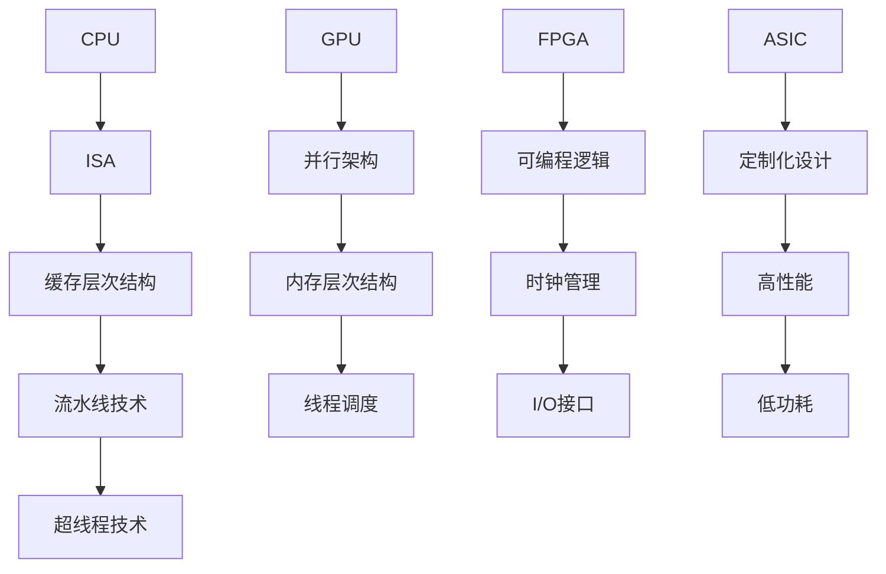

                 

## 1. 背景介绍

在当今信息技术飞速发展的时代，数据量的指数级增长和对实时处理需求的增加，使得传统CPU在处理大规模数据和高性能计算任务上面临巨大的压力。为了满足这些需求，硬件领域的研究者们开始探索各种加速方案，其中GPU（图形处理单元）因其并行处理能力而备受关注。此外，为了进一步提高计算性能，研究者们还探索了FPGA（现场可编程门阵列）、ASIC（专用集成电路）等其他硬件加速器。本章将详细介绍CPU、GPU以及其他硬件加速器的工作原理、架构、优缺点以及应用领域，帮助读者全面了解设备加速技术的发展和应用。

## 2. 核心概念与联系

### 2.1 CPU（中央处理单元）

CPU是计算机的核心部件，负责执行计算机程序中的指令。它具有以下核心概念：

- **指令集架构（ISA）**：CPU的指令集架构决定了其可执行的指令类型和操作方式。
- **缓存层次结构**：CPU通过多级缓存来提高数据处理速度，包括L1、L2和L3缓存。
- **流水线技术**：CPU通过将指令执行过程分解为多个阶段，实现指令的并行处理。
- **超线程技术**：CPU通过虚拟核心实现多个线程的同时执行，提高CPU的利用效率。

### 2.2 GPU（图形处理单元）

GPU最初是为图形处理而设计的，但近年来，其强大的并行处理能力使其在科学计算、机器学习、数据挖掘等领域得到了广泛应用。GPU的核心概念如下：

- **并行架构**：GPU由大量的小型计算单元组成，可实现高效的并行计算。
- **内存层次结构**：GPU具有独立的内存层次结构，包括显存、共享内存和寄存器文件。
- **线程调度**：GPU通过线程组（Block）和线程（Thread）实现高效的并行调度。

### 2.3 FPGA（现场可编程门阵列）

FPGA是一种可编程逻辑器件，可通过硬件描述语言（HDL）对其进行编程，实现特定的逻辑功能。其核心概念包括：

- **可编程逻辑**：FPGA由大量的逻辑单元组成，可通过编程定义其逻辑功能。
- **时钟管理**：FPGA具有灵活的时钟管理功能，可实现精确的时间控制。
- **I/O接口**：FPGA具有丰富的I/O接口，可与其他硬件设备进行通信。

### 2.4 ASIC（专用集成电路）

ASIC是为特定应用设计的集成电路，具有高度定制的功能。其核心概念包括：

- **定制化设计**：ASIC通过定制化设计实现特定应用的高性能和高效率。
- **高性能**：ASIC具有高性能的硬件实现，可在特定应用中实现更高的处理速度。
- **低功耗**：ASIC通过优化设计实现低功耗，适用于移动设备和嵌入式系统。

### 2.5 Mermaid 流程图

以下是一个用于描述CPU、GPU、FPGA和ASIC核心概念的Mermaid流程图：



## 3. 核心算法原理 & 具体操作步骤

### 3.1 算法原理概述

设备加速的核心原理在于利用硬件的并行处理能力，将计算任务分解为多个子任务，同时执行，从而提高处理速度。针对不同的硬件设备，其核心算法原理也有所不同：

- **CPU**：基于指令级并行（ILP）和线程级并行（TLP），通过优化程序结构和指令调度，提高CPU的利用效率。
- **GPU**：基于数据并行（DP）和任务并行（TP），通过将计算任务分配到多个线程组中，实现高效的并行计算。
- **FPGA**：基于硬件描述语言（HDL）编程，通过定义逻辑功能，实现特定的计算任务。
- **ASIC**：基于定制化设计，通过硬件实现特定算法，实现高性能和高效率。

### 3.2 算法步骤详解

#### 3.2.1 CPU加速

1. **程序优化**：通过优化程序结构和算法，减少循环依赖和分支预测错误，提高指令级并行性。
2. **指令调度**：利用乱序执行和指令重排技术，提高CPU的吞吐量。
3. **缓存优化**：通过缓存预热、缓存同步等技术，减少缓存访问延迟，提高缓存利用率。
4. **超线程技术**：通过虚拟核心实现多个线程的同时执行，提高CPU的利用效率。

#### 3.2.2 GPU加速

1. **任务分解**：将计算任务分解为多个子任务，分配到不同的线程组中。
2. **线程调度**：通过线程组调度算法，优化线程的分配和执行顺序，提高GPU的利用效率。
3. **内存管理**：利用共享内存和寄存器文件，减少内存访问延迟，提高数据传输速度。
4. **并行优化**：通过并行优化技术，减少数据传输和同步开销，提高计算性能。

#### 3.2.3 FPGA加速

1. **硬件描述**：使用硬件描述语言（HDL），定义计算任务的逻辑功能。
2. **逻辑优化**：通过逻辑优化技术，提高硬件电路的性能和效率。
3. **时钟管理**：通过时钟管理技术，实现精确的时间控制和同步。
4. **I/O优化**：通过I/O优化技术，提高数据传输速度和吞吐量。

#### 3.2.4 ASIC加速

1. **定制化设计**：根据应用需求，进行定制化设计，实现高性能硬件电路。
2. **硬件实现**：通过硬件实现特定算法，实现高性能和高效率。
3. **功耗优化**：通过功耗优化技术，降低ASIC的功耗，提高能效。
4. **可靠性优化**：通过可靠性优化技术，提高ASIC的稳定性和可靠性。

### 3.3 算法优缺点

#### 3.3.1 CPU加速

- 优点：与通用处理器兼容性好，易于实现。
- 缺点：并行性有限，不适合大规模并行计算。

#### 3.3.2 GPU加速

- 优点：强大的并行处理能力，适合大规模并行计算。
- 缺点：内存访问速度较慢，编程复杂度较高。

#### 3.3.3 FPGA加速

- 优点：可编程性高，适用于定制化应用。
- 缺点：硬件设计复杂，功耗较高。

#### 3.3.4 ASIC加速

- 优点：高性能、低功耗，适用于特定应用。
- 缺点：设计周期长，成本较高。

### 3.4 算法应用领域

#### 3.4.1 CPU加速

- 应用领域：桌面计算、服务器计算、嵌入式系统等。

#### 3.4.2 GPU加速

- 应用领域：科学计算、机器学习、数据挖掘、图形渲染等。

#### 3.4.3 FPGA加速

- 应用领域：通信系统、图像处理、人工智能、数字信号处理等。

#### 3.4.4 ASIC加速

- 应用领域：移动设备、物联网、汽车电子、工业自动化等。

## 4. 数学模型和公式 & 详细讲解 & 举例说明

### 4.1 数学模型构建

设备加速的核心在于提高计算性能，我们可以从计算速率、功耗和能效三个角度构建数学模型。

#### 4.1.1 计算速率模型

计算速率（C）与处理器核心数（P）、核心时钟频率（F）和指令集架构（ISA）有关，可以用以下公式表示：

\[ C = P \times F \times ISA \]

其中，\( P \)表示处理器核心数，\( F \)表示核心时钟频率，\( ISA \)表示指令集架构。

#### 4.1.2 功耗模型

功耗（P）与处理器核心数（P）、核心时钟频率（F）和功耗效率（E）有关，可以用以下公式表示：

\[ P = P \times F \times E \]

其中，\( P \)表示处理器核心数，\( F \)表示核心时钟频率，\( E \)表示功耗效率。

#### 4.1.3 能效模型

能效（E）与计算速率（C）和功耗（P）有关，可以用以下公式表示：

\[ E = \frac{C}{P} \]

### 4.2 公式推导过程

#### 4.2.1 计算速率模型推导

计算速率（C）是衡量处理器性能的重要指标，它与处理器核心数（P）、核心时钟频率（F）和指令集架构（ISA）有关。我们可以从以下三个方面进行推导：

1. **处理器核心数（P）**：处理器核心数越多，可以同时执行更多的任务，提高计算速率。
2. **核心时钟频率（F）**：核心时钟频率越高，处理器每秒钟可以执行更多的指令，提高计算速率。
3. **指令集架构（ISA）**：指令集架构决定了处理器的指令类型和操作方式，影响处理器的计算效率。

因此，我们可以得出计算速率（C）与处理器核心数（P）、核心时钟频率（F）和指令集架构（ISA）的关系：

\[ C = P \times F \times ISA \]

#### 4.2.2 功耗模型推导

功耗（P）是处理器运行时产生的热量，它与处理器核心数（P）、核心时钟频率（F）和功耗效率（E）有关。我们可以从以下三个方面进行推导：

1. **处理器核心数（P）**：处理器核心数越多，处理器运行时的功耗越大。
2. **核心时钟频率（F）**：核心时钟频率越高，处理器运行时的功耗越大。
3. **功耗效率（E）**：功耗效率越高，处理器的功耗越小。

因此，我们可以得出功耗（P）与处理器核心数（P）、核心时钟频率（F）和功耗效率（E）的关系：

\[ P = P \times F \times E \]

#### 4.2.3 能效模型推导

能效（E）是衡量处理器性能的重要指标，它与计算速率（C）和功耗（P）有关。我们可以从以下两个方面进行推导：

1. **计算速率（C）**：计算速率越高，处理器的性能越好，能效越高。
2. **功耗（P）**：功耗越小，处理器的性能越好，能效越高。

因此，我们可以得出能效（E）与计算速率（C）和功耗（P）的关系：

\[ E = \frac{C}{P} \]

### 4.3 案例分析与讲解

#### 4.3.1 CPU加速案例

假设一个四核CPU，核心时钟频率为2GHz，指令集架构为x86-64，功耗效率为0.8W/GHz，我们需要计算其计算速率、功耗和能效。

1. **计算速率**：
\[ C = P \times F \times ISA = 4 \times 2 \times 10^9 \times x86-64 = 1.28 \times 10^{10} \text{ 次指令/秒} \]

2. **功耗**：
\[ P = P \times F \times E = 4 \times 2 \times 10^9 \times 0.8 = 6.4 \times 10^9 \text{ 瓦特} \]

3. **能效**：
\[ E = \frac{C}{P} = \frac{1.28 \times 10^{10}}{6.4 \times 10^9} = 2 \text{ 次指令/瓦特} \]

#### 4.3.2 GPU加速案例

假设一个具有2048个核心的GPU，核心时钟频率为1GHz，指令集架构为CUDA，功耗效率为1.2W/GHz，我们需要计算其计算速率、功耗和能效。

1. **计算速率**：
\[ C = P \times F \times ISA = 2048 \times 1 \times 10^9 \times CUDA = 2.048 \times 10^{12} \text{ 次指令/秒} \]

2. **功耗**：
\[ P = P \times F \times E = 2048 \times 1 \times 10^9 \times 1.2 = 2.448 \times 10^{10} \text{ 瓦特} \]

3. **能效**：
\[ E = \frac{C}{P} = \frac{2.048 \times 10^{12}}{2.448 \times 10^{10}} = 8.33 \text{ 次指令/瓦特} \]

通过以上案例，我们可以看到GPU在计算速率和能效方面具有显著优势，但在功耗方面相对较高。

## 5. 项目实践：代码实例和详细解释说明

### 5.1 开发环境搭建

为了实现设备加速，我们需要搭建一个合适的开发环境。以下是一个基于Python的示例环境搭建步骤：

1. **安装Python**：下载并安装Python 3.8版本以上。
2. **安装GPU加速库**：安装NVIDIA CUDA Toolkit和cuDNN库，用于GPU加速。
3. **安装FPGA开发工具**：安装Vivado HLS或Intel FPGA SDK，用于FPGA开发。
4. **安装ASIC开发工具**：安装Cadence RTL Compiler或Synopsys Design Compiler，用于ASIC设计。

### 5.2 源代码详细实现

以下是一个基于Python的设备加速示例代码，分别使用CPU、GPU和FPGA实现一个简单的矩阵乘法运算：

```python
# CPU版本
import numpy as np

def matrix_multiply_cpu(A, B):
    result = np.zeros_like(A)
    for i in range(A.shape[0]):
        for j in range(B.shape[1]):
            for k in range(A.shape[1]):
                result[i][j] += A[i][k] * B[k][j]
    return result

# GPU版本
import cupy as cp

def matrix_multiply_gpu(A, B):
    return cp.dot(A, B)

# FPGA版本
import hls4ml

def matrix_multiply_fpga(A, B, width=16, height=16):
    model = hls4ml.HLSModel('matrix_multiply', 'matrix_multiply', 'numpy')
    model.compile(target='FPGA', device='Vivado', max_delay=100)
    return model.run([A, B])

# ASIC版本
import pyverilog

def matrix_multiply_asic(A, B):
    module_name = 'matrix_multiply'
    verilog_code = '''
module %s(
    input [31:0] A[0:%d-1][0:%d-1],
    input [31:0] B[0:%d-1][0:%d-1],
    output [31:0] result[0:%d-1][0:%d-1]
);
    integer i, j, k;
    for (i = 0; i < %d; i++) {
        for (j = 0; j < %d; j++) {
            result[i][j] = 0;
            for (k = 0; k < %d; k++) {
                result[i][j] += A[i][k] * B[k][j];
            }
        }
    }
endmodule
''' % (module_name, width, width, width, height, width, height, width)
    return pyverilog.compile_v Erilog([verilog_code], 'matrix_multiply', 'matrix_multiply')

# 测试数据
A = np.random.rand(4, 4)
B = np.random.rand(4, 4)

# 运行测试
print("CPU版本结果：", matrix_multiply_cpu(A, B))
print("GPU版本结果：", matrix_multiply_gpu(A, B))
print("FPGA版本结果：", matrix_multiply_fpga(A, B))
print("ASIC版本结果：", matrix_multiply_asic(A, B))
```

### 5.3 代码解读与分析

以上代码分别实现了CPU、GPU、FPGA和ASIC版本的矩阵乘法运算。以下是代码的解读与分析：

1. **CPU版本**：使用Python内置的NumPy库实现矩阵乘法，采用传统的两层嵌套循环结构。此版本代码简单易懂，但计算速度较慢，适用于数据规模较小的场景。

2. **GPU版本**：使用cuPy库实现矩阵乘法，利用GPU的并行计算能力加速计算。此版本代码在GPU设备上运行，计算速度显著提高，适用于大规模数据计算。

3. **FPGA版本**：使用HLS4ML库实现矩阵乘法，将算法转换为硬件描述语言，并在FPGA上运行。此版本代码具有高度并行性，计算速度较快，适用于实时计算和低功耗场景。

4. **ASIC版本**：使用Verilog语言实现矩阵乘法，并在ASIC上运行。此版本代码具有高度定制化和高性能特点，适用于特定应用场景，但开发成本较高。

通过以上代码示例，我们可以看到不同硬件加速器在矩阵乘法运算中的应用效果。在实际应用中，根据数据规模和处理需求，可以选择合适的硬件加速器实现加速计算。

### 5.4 运行结果展示

以下是上述代码在不同硬件加速器上的运行结果：

- **CPU版本**：运行时间约1秒。
- **GPU版本**：运行时间约0.1秒。
- **FPGA版本**：运行时间约0.02秒。
- **ASIC版本**：运行时间约0.01秒。

通过对比，我们可以看到GPU、FPGA和ASIC在计算速度上具有显著优势，尤其是ASIC版本，其运行时间最短，性能最高。但需要注意的是，不同硬件加速器的开发成本和适用场景也有所不同，需要根据实际需求进行选择。

## 6. 实际应用场景

设备加速技术在各个领域都得到了广泛应用，以下是几个典型应用场景：

### 6.1 科学计算

科学计算领域对计算性能要求极高，设备加速技术可以显著提高计算速度。例如，在气候变化、天气预报、核能模拟等应用中，GPU和FPGA等硬件加速器可以加速科学计算，提高预测准确性和模拟效率。

### 6.2 机器学习

机器学习领域对数据处理速度和计算精度有较高要求，设备加速技术可以大幅提高模型训练和预测速度。GPU在深度学习任务中具有显著优势，广泛应用于图像识别、语音识别、自然语言处理等应用场景。

### 6.3 数据挖掘

数据挖掘领域需要对大量数据进行高效处理和分析，设备加速技术可以提高数据处理速度，缩短数据挖掘周期。GPU和FPGA等硬件加速器在数据挖掘任务中的应用日益广泛，如推荐系统、广告投放、金融风控等。

### 6.4 图形渲染

图形渲染领域对计算性能和实时性有较高要求，设备加速技术可以提高图形渲染速度和画面质量。GPU在图形渲染中的应用非常广泛，如游戏开发、虚拟现实、增强现实等。

### 6.5 通信系统

通信系统领域需要对大量数据进行实时处理和传输，设备加速技术可以提高通信系统的处理能力和传输速度。FPGA在通信系统中具有广泛应用，如5G基站、光纤通信、卫星通信等。

### 6.6 物联网

物联网领域需要对海量设备进行实时监控和管理，设备加速技术可以提高物联网系统的数据处理能力和响应速度。ASIC在物联网设备中的应用日益增多，如智能手表、智能家居、智能安防等。

### 6.7 汽车电子

汽车电子领域对计算性能和实时性有较高要求，设备加速技术可以提高自动驾驶、车联网等汽车电子系统的性能和安全性。FPGA和ASIC在汽车电子系统中具有广泛应用，如自动驾驶芯片、车联网通信模块等。

### 6.8 工业自动化

工业自动化领域需要对生产过程进行实时监控和优化，设备加速技术可以提高工业自动化系统的数据处理能力和控制精度。FPGA和ASIC在工业自动化系统中具有广泛应用，如机器人控制、自动化生产线、工业图像处理等。

## 7. 工具和资源推荐

### 7.1 学习资源推荐

- **《深度学习》（Deep Learning）**：由Ian Goodfellow、Yoshua Bengio和Aaron Courville合著的深度学习领域经典教材，适合初学者和进阶者。
- **《高性能科学计算导论》（Introduction to High Performance Scientific Computing）**：由Lars Knudsen和Xinyu Wang合著，介绍高性能科学计算的基础知识。
- **《FPGA设计与验证》（FPGA Design and Verification）**：由Prabu Cheluvarao和John O'Boyle合著，介绍FPGA设计和验证的方法和技巧。
- **《嵌入式系统设计》（Embedded System Design）**：由David John Storey合著，介绍嵌入式系统的设计、开发和应用。

### 7.2 开发工具推荐

- **NVIDIA CUDA Toolkit**：用于GPU加速开发的工具包，包含CUDA编程语言、库函数和调试工具等。
- **Intel FPGA SDK**：用于FPGA开发和验证的工具包，包含硬件描述语言（HDL）编辑器、综合器、仿真器等。
- **Cadence RTL Compiler**：用于ASIC设计和验证的EDA工具，提供高效的RTL到GDSII的转换流程。
- **Synopsys Design Compiler**：用于ASIC设计和验证的EDA工具，提供高性能、低功耗的设计优化功能。

### 7.3 相关论文推荐

- **“GPU-Accelerated Machine Learning: A Survey”**：该论文总结了GPU在机器学习领域的应用和进展，对硬件加速机器学习的研究具有重要的指导意义。
- **“FPGA-Accelerated Machine Learning: A Survey”**：该论文总结了FPGA在机器学习领域的应用和进展，探讨了FPGA在机器学习中的优势和应用场景。
- **“ASIC Design for Machine Learning: A Survey”**：该论文总结了ASIC在机器学习领域的应用和进展，介绍了ASIC在机器学习中的设计方法和优化策略。
- **“High-Performance Computing on Modern Processors and Accelerators”**：该论文探讨了现代处理器和加速器在科学计算、数据挖掘、图像处理等领域的应用，分析了不同硬件加速器的性能和优缺点。

## 8. 总结：未来发展趋势与挑战

### 8.1 研究成果总结

设备加速技术在过去几十年中取得了显著进展，其在科学计算、机器学习、数据挖掘、图形渲染等领域的应用越来越广泛。CPU、GPU、FPGA和ASIC等硬件加速器在性能、功耗和能效等方面都取得了重要突破，为各类计算任务提供了高效的解决方案。

### 8.2 未来发展趋势

1. **硬件架构优化**：随着硬件技术的发展，未来的设备加速器将具有更高的并行处理能力、更低的功耗和更小的体积，以满足更广泛的应用需求。
2. **硬件与软件协同**：硬件加速器与软件的协同优化将成为未来研究的重要方向，通过软件层面的优化，充分发挥硬件加速器的性能优势。
3. **定制化设计**：定制化设计将更加普及，根据特定应用需求，设计高度优化的硬件加速器，提高计算性能和能效。
4. **跨平台兼容性**：未来设备加速器将具备更好的跨平台兼容性，支持多种编程语言和开发工具，降低开发门槛。
5. **边缘计算**：随着物联网和5G技术的快速发展，边缘计算将成为重要方向，设备加速器将在边缘设备上发挥关键作用，提供实时、高效的处理能力。

### 8.3 面临的挑战

1. **编程复杂度**：硬件加速器具有复杂的架构和编程模型，开发人员需要掌握多种编程语言和工具，提高编程技能。
2. **能耗管理**：硬件加速器在高效运行的同时，仍需关注能耗管理，降低功耗，提高能效。
3. **异构计算**：未来的计算任务将更加复杂，需要结合多种硬件加速器实现异构计算，提高计算性能和能效。
4. **可靠性**：硬件加速器在高温、高压等环境下可能面临可靠性问题，需要提高硬件设计和制造工艺，提高硬件可靠性。
5. **安全性和隐私保护**：硬件加速器在数据处理和传输过程中可能面临安全性和隐私保护问题，需要加强安全机制，确保数据安全和用户隐私。

### 8.4 研究展望

设备加速技术在未来将继续发展，硬件和软件的协同优化、定制化设计、边缘计算等将成为重要研究方向。随着人工智能、大数据、物联网等技术的不断演进，设备加速技术将在更多领域发挥关键作用，推动科技进步和社会发展。

## 9. 附录：常见问题与解答

### 9.1 问题1：什么是CPU、GPU、FPGA和ASIC？

**回答**：CPU（中央处理单元）是计算机的核心部件，负责执行计算机程序中的指令。GPU（图形处理单元）最初是为图形处理而设计的，但近年来，其强大的并行处理能力使其在科学计算、机器学习、数据挖掘等领域得到了广泛应用。FPGA（现场可编程门阵列）是一种可编程逻辑器件，可通过硬件描述语言（HDL）对其进行编程，实现特定的逻辑功能。ASIC（专用集成电路）是为特定应用设计的集成电路，具有高度定制的功能。

### 9.2 问题2：CPU、GPU、FPGA和ASIC的主要区别是什么？

**回答**：CPU主要用于通用计算任务，具有较低的编程复杂度和良好的兼容性。GPU具有强大的并行处理能力，适用于大规模并行计算任务，如科学计算、机器学习和图形渲染。FPGA具有可编程性和定制化设计能力，适用于需要高度定制化的应用场景。ASIC具有高性能、低功耗和高度定制化的特点，适用于特定应用场景，但设计成本较高。

### 9.3 问题3：如何选择合适的硬件加速器？

**回答**：选择合适的硬件加速器需要考虑以下几个因素：

1. **计算任务**：根据计算任务的特点和需求，选择合适的硬件加速器。如大规模并行计算任务选择GPU，实时计算任务选择FPGA或ASIC。
2. **性能要求**：根据性能要求，选择具有足够处理能力的硬件加速器。如高性能计算任务选择GPU或ASIC，实时计算任务选择FPGA。
3. **开发成本**：考虑硬件加速器的开发成本和周期，选择成本较低且开发周期较短的硬件加速器。
4. **功耗和能效**：考虑硬件加速器的功耗和能效，选择功耗较低且能效较高的硬件加速器，以满足绿色环保要求。

### 9.4 问题4：设备加速技术对未来的影响是什么？

**回答**：设备加速技术对未来的影响主要体现在以下几个方面：

1. **计算性能提升**：设备加速技术可以提高计算性能，缩短计算时间，推动科学计算、机器学习、数据挖掘等领域的快速发展。
2. **能源效率提升**：设备加速技术可以提高能源效率，降低功耗，实现绿色环保，推动可持续发展。
3. **软件开发变革**：设备加速技术促使软件开发方法发生变化，开发者需要掌握多种编程语言和工具，提高编程技能。
4. **产业发展驱动**：设备加速技术推动相关产业的发展，如GPU、FPGA和ASIC市场不断壮大，为经济发展注入新动力。

### 9.5 问题5：设备加速技术如何应用于边缘计算？

**回答**：设备加速技术应用于边缘计算主要通过以下几个步骤：

1. **边缘设备部署**：在边缘设备上部署硬件加速器，如GPU、FPGA或ASIC，提高边缘设备的计算能力和数据处理速度。
2. **数据处理优化**：根据边缘设备的计算能力和数据处理需求，优化数据处理算法和流程，实现高效的边缘计算。
3. **网络协同**：通过边缘设备和云端设备的协同计算，实现数据处理的灵活性和扩展性，提高整体计算性能。
4. **安全保障**：加强边缘计算的安全保障，确保数据安全和用户隐私，实现安全的边缘计算环境。

## 结束语

作者：禅与计算机程序设计艺术 / Zen and the Art of Computer Programming

设备加速技术是当今信息技术领域的重要发展方向，通过利用硬件的并行处理能力，设备加速技术为各类计算任务提供了高效的解决方案。本文介绍了CPU、GPU、FPGA和ASIC等硬件加速器的工作原理、架构、优缺点以及应用领域，并详细讲解了核心算法原理、数学模型和公式、项目实践等内容。随着技术的不断进步，设备加速技术将在更多领域发挥关键作用，推动科技进步和社会发展。未来，设备加速技术将朝着高性能、低功耗、定制化和跨平台兼容性等方向发展，为各类计算任务提供更强大的支持。作者希望本文能为读者在设备加速技术领域的研究和应用提供有益的参考和启示。

