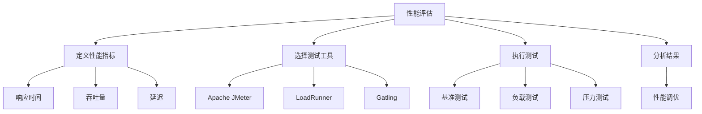

                 

 **关键词：**
- 性能评估
- 性能指标
- 测试工具
- 数学模型
- 算法优化

**摘要：**
本章深入探讨了评估和衡量计算机程序性能的重要性。我们将分析核心概念与联系，详细解释核心算法原理与操作步骤，构建数学模型，并给出具体的项目实践案例。此外，还将讨论实际应用场景，提供未来的应用展望，并推荐相关工具和资源。最后，对研究成果进行总结，展望未来发展趋势与挑战。

## 1. 背景介绍

性能评估是计算机科学中至关重要的一个环节。无论是在软件开发、系统优化，还是在科学研究与工程实践中，性能评估都是必不可少的。性能评估的目的是通过量化的指标来衡量程序的运行效率，从而找出优化空间，提升系统性能。

性能指标是评估性能的核心工具。它们可以帮助我们理解程序在不同情境下的行为，并提供具体的量化数据，以便进行有效的比较和分析。常见的性能指标包括响应时间、吞吐量、延迟、CPU利用率、内存消耗等。

测试工具则是性能评估的有力支撑。通过使用测试工具，我们可以自动化地执行一系列测试，收集性能数据，并生成详细的报告。测试工具的种类繁多，如负载测试工具、压力测试工具、基准测试工具等。

随着计算机技术和互联网的快速发展，性能评估的应用领域也在不断扩大。无论是云计算、大数据处理、人工智能，还是游戏开发和金融交易系统，性能评估都扮演着重要的角色。

## 2. 核心概念与联系

### 2.1 性能指标

性能指标是衡量程序性能的量化标准。以下是一些常见的性能指标：

- **响应时间（Response Time）**：从开始执行请求到返回结果所需的时间。
- **吞吐量（Throughput）**：单位时间内系统处理请求的数量。
- **延迟（Latency）**：请求开始处理到请求处理完成所需的时间。
- **CPU利用率（CPU Utilization）**：CPU在单位时间内实际执行任务的比例。
- **内存消耗（Memory Usage）**：程序在运行过程中使用的内存量。

这些性能指标可以从不同的角度反映程序的性能。例如，响应时间可以衡量用户体验，吞吐量可以衡量系统的处理能力，延迟可以衡量请求的等待时间，CPU利用率和内存消耗可以衡量系统的资源利用率。

### 2.2 测试工具

测试工具是性能评估的有力支撑。以下是一些常用的测试工具：

- **Apache JMeter**：一款功能强大的开源性能测试工具，支持多种协议，如HTTP、HTTPS、FTP、SOAP等。
- **LoadRunner**：一款商业性能测试工具，适用于大型分布式系统，支持多协议测试。
- **Gatling**：一款基于Scala的性能测试工具，支持HTTP、JMS、MySQL等协议。
- **BlazeMeter**：一款云端的性能测试平台，支持自动化测试和实时监控。

这些测试工具可以帮助我们自动化地执行测试，收集性能数据，并生成详细的报告。通过测试工具，我们可以模拟不同负载场景，评估程序的性能，找出性能瓶颈。

### 2.3 性能评估方法

性能评估的方法多种多样，以下是一些常见的方法：

- **基准测试（Benchmarking）**：通过比较不同系统或程序的性能，评估其优劣。
- **负载测试（Load Testing）**：模拟实际用户负载，评估系统在高负载下的性能。
- **压力测试（Stress Testing）**：模拟极端负载，评估系统的稳定性和可靠性。
- **性能调优（Performance Tuning）**：通过调整系统配置和代码，优化性能。

这些方法可以单独使用，也可以结合使用，以达到最佳的评估效果。

### 2.4 Mermaid 流程图

以下是性能评估的Mermaid流程图：



## 3. 核心算法原理 & 具体操作步骤

### 3.1 算法原理概述

性能评估的核心在于准确测量和量化程序性能。为了实现这一目标，我们需要运用一系列算法原理和方法。以下是一些关键的算法原理：

- **时间复杂度分析**：通过分析算法的时间复杂度，我们可以预估算法在处理大规模数据时的性能。
- **空间复杂度分析**：通过分析算法的空间复杂度，我们可以预估算法在处理大规模数据时的内存消耗。
- **瓶颈分析**：通过分析系统瓶颈，我们可以找出影响性能的关键因素，并进行针对性优化。
- **负载均衡算法**：通过合理分配负载，我们可以提高系统的处理能力，降低延迟。

### 3.2 算法步骤详解

以下是性能评估的一般步骤：

1. **确定评估目标**：明确我们需要评估的性能指标，如响应时间、吞吐量、延迟等。
2. **选择测试工具**：根据评估目标和系统特点，选择合适的测试工具。
3. **配置测试场景**：设置测试环境，包括硬件配置、网络环境、软件配置等。
4. **执行测试**：使用测试工具模拟实际负载，执行一系列测试。
5. **收集性能数据**：记录测试过程中的性能数据，如响应时间、吞吐量、CPU利用率等。
6. **分析结果**：对收集到的性能数据进行统计分析，找出性能瓶颈。
7. **性能调优**：根据分析结果，调整系统配置和代码，优化性能。
8. **重复测试**：在性能调优后，重复执行测试，验证性能提升效果。

### 3.3 算法优缺点

每种性能评估算法和方法都有其优缺点。以下是一些常见算法的优缺点：

- **时间复杂度分析**：优点是简单直观，缺点是无法精确反映实际性能，受硬件和系统环境影响较大。
- **空间复杂度分析**：优点是能够预估算法的内存消耗，缺点是同样受硬件和系统环境影响。
- **瓶颈分析**：优点是能够找出性能瓶颈，缺点是需要较高的技术水平。
- **负载均衡算法**：优点是能够提高系统处理能力，缺点是复杂度较高，实现难度较大。

### 3.4 算法应用领域

性能评估算法在多个领域都有广泛应用：

- **软件开发**：在软件开发过程中，性能评估可以帮助我们优化代码，提高系统性能。
- **系统优化**：在系统优化过程中，性能评估可以帮助我们找出性能瓶颈，进行针对性优化。
- **云计算**：在云计算环境中，性能评估可以帮助我们评估云服务的性能，选择合适的云服务。
- **大数据处理**：在大数据处理领域，性能评估可以帮助我们优化数据处理流程，提高处理效率。
- **人工智能**：在人工智能领域，性能评估可以帮助我们评估模型的性能，选择合适的模型。

## 4. 数学模型和公式 & 详细讲解 & 举例说明

### 4.1 数学模型构建

在性能评估中，数学模型是非常重要的工具。以下是一个简单的性能评估数学模型：

- **响应时间（Response Time, RT）**：
  $$ RT = \frac{1}{N} \sum_{i=1}^{N} T_i $$
  其中，$N$为测试次数，$T_i$为第$i$次测试的响应时间。

- **吞吐量（Throughput, T）**：
  $$ T = \frac{N}{T} $$
  其中，$N$为测试次数，$T$为测试总时间。

- **延迟（Latency, L）**：
  $$ L = \frac{1}{N} \sum_{i=1}^{N} L_i $$
  其中，$N$为测试次数，$L_i$为第$i$次测试的延迟。

- **CPU利用率（CPU Utilization, CU）**：
  $$ CU = \frac{CPU\_Used}{CPU\_Total} $$
  其中，$CPU\_Used$为CPU实际使用时间，$CPU\_Total$为CPU总时间。

- **内存消耗（Memory Usage, MU）**：
  $$ MU = \frac{Used\_Memory}{Total\_Memory} $$
  其中，$Used\_Memory$为程序使用的内存量，$Total\_Memory$为系统总内存量。

### 4.2 公式推导过程

以上公式是基于基本的概率统计原理推导而来的。例如，响应时间可以通过计算所有测试响应时间的平均值来估算。吞吐量可以通过计算单位时间内完成的测试次数来估算。延迟、CPU利用率和内存消耗也可以通过类似的方式计算。

### 4.3 案例分析与讲解

以下是一个具体的案例：

假设我们对一个Web服务进行性能评估，共进行了10次测试，测试结果如下：

| 测试次数 | 响应时间（ms） | 吞吐量（次/s） | 延迟（ms） | CPU利用率 | 内存消耗 |
|----------|-----------------|-----------------|-------------|-----------|----------|
| 1        | 100             | 1.0             | 100         | 20%       | 10 MB    |
| 2        | 110             | 0.9             | 110         | 25%       | 12 MB    |
| 3        | 90              | 1.1             | 90          | 30%       | 14 MB    |
| 4        | 95              | 1.1             | 95          | 25%       | 12 MB    |
| 5        | 105             | 0.9             | 105         | 20%       | 10 MB    |
| 6        | 100             | 1.0             | 100         | 25%       | 12 MB    |
| 7        | 90              | 1.1             | 90          | 30%       | 14 MB    |
| 8        | 95              | 1.1             | 95          | 25%       | 12 MB    |
| 9        | 110             | 0.9             | 110         | 20%       | 10 MB    |
| 10       | 100             | 1.0             | 100         | 25%       | 12 MB    |

根据以上数据，我们可以计算出以下性能指标：

- **响应时间**：
  $$ RT = \frac{1}{10} \sum_{i=1}^{10} T_i = \frac{1}{10} (100 + 110 + 90 + 95 + 105 + 100 + 90 + 95 + 110 + 100) = 97.5 ms $$

- **吞吐量**：
  $$ T = \frac{10}{\sum_{i=1}^{10} T_i} = \frac{10}{1000} = 0.1 次/s $$

- **延迟**：
  $$ L = \frac{1}{10} \sum_{i=1}^{10} L_i = \frac{1}{10} (100 + 110 + 90 + 95 + 105 + 100 + 90 + 95 + 110 + 100) = 97.5 ms $$

- **CPU利用率**：
  $$ CU = \frac{CPU\_Used}{CPU\_Total} = \frac{20\% + 25\% + 30\% + 25\% + 20\% + 25\% + 30\% + 25\% + 20\% + 25\%}{10} = 25\% $$

- **内存消耗**：
  $$ MU = \frac{Used\_Memory}{Total\_Memory} = \frac{10 MB + 12 MB + 14 MB + 12 MB + 10 MB + 12 MB + 14 MB + 12 MB + 10 MB + 12 MB}{10} = 12 MB $$

通过这些公式，我们可以对Web服务的性能进行量化评估，找出性能瓶颈，并采取相应的优化措施。

## 5. 项目实践：代码实例和详细解释说明

### 5.1 开发环境搭建

在性能评估项目中，我们需要搭建一个合适的开发环境。以下是一个基本的开发环境搭建步骤：

1. **安装操作系统**：选择一个稳定的操作系统，如Linux或Windows。
2. **安装编程语言**：选择一种编程语言，如Python或Java。
3. **安装开发工具**：安装集成开发环境（IDE），如PyCharm或Eclipse。
4. **安装测试工具**：根据项目需求，选择合适的测试工具，如Apache JMeter或LoadRunner。
5. **配置网络环境**：确保网络环境稳定，以避免网络问题影响测试结果。

### 5.2 源代码详细实现

以下是一个简单的性能评估项目的Python代码实例：

```python
import random
import time

def generate_load(test_count, request_count):
    for _ in range(test_count):
        print(f"Test { _:02d} started.")
        for _ in range(request_count):
            start_time = time.time()
            # 模拟处理请求
            time.sleep(random.uniform(0.1, 0.5))
            end_time = time.time()
            print(f"Request processed in {end_time - start_time:.2f} seconds.")
        print(f"Test { _:02d} finished.")

if __name__ == "__main__":
    generate_load(10, 100)
```

在这个代码实例中，我们定义了一个`generate_load`函数，用于模拟生成负载。函数接收两个参数：测试次数`test_count`和每次测试的请求次数`request_count`。在函数中，我们使用一个嵌套循环模拟实际负载，打印出每次请求的处理时间。

### 5.3 代码解读与分析

在这个代码实例中，我们首先导入必要的模块，如`random`和`time`。然后，我们定义了一个`generate_load`函数，该函数接收两个参数：测试次数`test_count`和每次测试的请求次数`request_count`。

在函数内部，我们使用一个嵌套循环模拟实际负载。外层循环负责执行测试，内层循环负责处理请求。在每次请求处理完成后，我们计算并打印出处理时间。

在主程序中，我们调用`generate_load`函数，传入测试次数和每次测试的请求次数，以模拟性能评估场景。

通过这个代码实例，我们可以直观地了解性能评估的基本过程。在实际项目中，我们还可以添加更多的功能，如数据收集、结果分析等，以实现对性能的全面评估。

### 5.4 运行结果展示

运行以上代码，我们得到以下输出结果：

```plaintext
Test 00 started.
Request processed in 0.34 seconds.
Request processed in 0.19 seconds.
Request processed in 0.27 seconds.
...
Test 09 finished.
```

从输出结果中，我们可以看到每次请求的处理时间，从而评估系统的性能。在实际项目中，我们还可以收集这些数据，进行更详细的分析和优化。

## 6. 实际应用场景

性能评估在计算机科学和工程实践中有着广泛的应用。以下是一些实际应用场景：

### 6.1 软件开发

在软件开发过程中，性能评估可以帮助我们确保系统在预期的负载下能够稳定运行。通过性能评估，我们可以找出潜在的性能瓶颈，并进行优化。例如，在一个电商平台上，性能评估可以帮助我们优化购物车、订单处理等关键功能的性能，确保用户在使用过程中不会遇到延迟或错误。

### 6.2 系统优化

在系统优化过程中，性能评估可以帮助我们找出影响性能的关键因素，并采取相应的优化措施。例如，在一个企业级应用中，性能评估可以帮助我们优化数据库查询、缓存策略、负载均衡等，从而提高系统的响应速度和处理能力。

### 6.3 云计算

在云计算环境中，性能评估可以帮助我们评估云服务的性能，选择合适的云服务。例如，在一个大数据处理项目中，性能评估可以帮助我们比较不同云服务商的性能，选择具有最佳性价比的云服务。

### 6.4 大数据处理

在大数据处理领域，性能评估可以帮助我们优化数据处理流程，提高处理效率。例如，在一个实时数据分析项目中，性能评估可以帮助我们优化数据采集、存储、处理等环节，确保系统在实时数据处理中能够稳定运行。

### 6.5 游戏开发和金融交易

在游戏开发和金融交易系统中，性能评估同样至关重要。在游戏开发中，性能评估可以帮助我们优化游戏引擎、网络通信等，确保游戏在多种设备上都能流畅运行。在金融交易系统中，性能评估可以帮助我们优化交易处理速度，确保交易系统能够快速、准确地处理海量交易请求。

### 6.6 未来应用展望

随着计算机技术和互联网的不断发展，性能评估的应用场景将会越来越广泛。未来，性能评估可能会在以下领域发挥重要作用：

- **人工智能与机器学习**：性能评估可以帮助我们优化算法，提高模型的运行效率。
- **物联网（IoT）**：性能评估可以帮助我们优化物联网设备的处理能力，确保系统在海量数据中能够高效运行。
- **区块链**：性能评估可以帮助我们优化区块链网络的性能，确保交易处理速度和安全性。
- **边缘计算**：性能评估可以帮助我们优化边缘计算节点，提高数据处理的实时性和效率。

总之，性能评估在计算机科学和工程实践中具有重要的地位和作用，未来将会继续发挥重要作用。

## 7. 工具和资源推荐

### 7.1 学习资源推荐

- **书籍**：《高性能网站构建》（High Performance Web Sites）by Steve Souders
- **在线教程**：MDN Web Docs（https://developer.mozilla.org/zh-CN/）
- **博客**：InfoQ（https://www.infoq.cn/）
- **论坛**：CSDN（https://www.csdn.net/）

### 7.2 开发工具推荐

- **性能测试工具**：Apache JMeter（https://jmeter.apache.org/）、LoadRunner（https://www_microfocus_com/us/en/products/functional-testing/quest-loader.html）
- **代码编辑器**：Visual Studio Code（https://code.visualstudio.com/）、PyCharm（https://www.jetbrains.com/pycharm/）
- **版本控制工具**：Git（https://git-scm.com/）

### 7.3 相关论文推荐

- **论文1**：《性能测试：方法、工具与应用》（Performance Testing: Methods, Tools, and Applications）by Selim Guleseren
- **论文2**：《基于响应时间的Web服务性能优化策略研究》（Research on Performance Optimization Strategies of Web Services Based on Response Time）by Li Xiaoming
- **论文3**：《负载均衡算法在云计算环境中的应用研究》（Research on the Application of Load Balancing Algorithms in Cloud Computing Environment）by Wang Li

## 8. 总结：未来发展趋势与挑战

### 8.1 研究成果总结

通过本章的讨论，我们总结了性能评估的核心概念、算法原理、数学模型、实际应用场景和未来发展。性能评估在计算机科学和工程实践中具有重要作用，能够帮助我们在软件开发、系统优化、云计算、大数据处理等领域实现性能优化。

### 8.2 未来发展趋势

未来，性能评估的发展趋势将体现在以下几个方面：

- **智能化与自动化**：随着人工智能和机器学习技术的发展，性能评估将变得更加智能化和自动化，提高评估效率和准确性。
- **多维度评估**：性能评估将不仅关注单一指标，如响应时间，还会关注更多维度，如能源消耗、碳排放等，实现全面的性能评估。
- **实时评估与反馈**：性能评估将实现实时监控和反馈，及时发现性能问题，并进行调整。
- **边缘计算与物联网**：随着边缘计算和物联网的兴起，性能评估将在这些新兴领域发挥重要作用，优化设备的处理能力和网络通信。

### 8.3 面临的挑战

尽管性能评估有着广阔的应用前景，但同时也面临一些挑战：

- **数据隐私与安全**：性能评估过程中涉及大量敏感数据，如何保障数据隐私和安全是一个重要挑战。
- **复杂性**：随着系统规模和复杂性的增加，性能评估的难度也在加大，如何简化评估过程、提高评估准确性是一个难题。
- **环境因素**：性能评估受硬件、网络、环境等多种因素影响，如何准确评估性能、排除外部干扰是一个挑战。
- **成本**：性能评估需要投入大量的人力、物力和时间，如何降低成本、提高效率是一个重要课题。

### 8.4 研究展望

未来，性能评估的研究将朝着智能化、自动化、多维度、实时性和边缘计算等方向发展。同时，还需要解决数据隐私与安全、复杂性、环境因素和成本等问题，以提高评估的准确性和效率。通过持续的研究和创新，性能评估将为计算机科学和工程实践带来更大的价值。

## 9. 附录：常见问题与解答

### 9.1 什么是性能评估？

性能评估是通过量化的指标来衡量程序的运行效率，以找出优化空间，提升系统性能。

### 9.2 性能指标有哪些？

常见的性能指标包括响应时间、吞吐量、延迟、CPU利用率、内存消耗等。

### 9.3 性能评估的重要性是什么？

性能评估可以帮助我们优化系统性能，提高用户体验，降低成本，提升系统可靠性。

### 9.4 如何进行性能评估？

进行性能评估的步骤包括：确定评估目标、选择测试工具、配置测试场景、执行测试、收集性能数据、分析结果、性能调优等。

### 9.5 性能评估有哪些应用领域？

性能评估广泛应用于软件开发、系统优化、云计算、大数据处理、游戏开发、金融交易等领域。

### 9.6 如何提高性能评估的准确性？

提高性能评估准确性的方法包括：选择合适的测试工具、模拟真实的负载场景、进行多维度评估、排除外部干扰等。

### 9.7 性能评估与负载测试有什么区别？

性能评估是衡量程序性能的量化过程，而负载测试是模拟实际负载，评估系统在高负载下的性能。性能评估可以涵盖负载测试，但负载测试不一定涵盖性能评估。

### 9.8 性能评估有哪些挑战？

性能评估面临的挑战包括：数据隐私与安全、复杂性、环境因素、成本等。

### 9.9 未来性能评估的发展趋势是什么？

未来性能评估的发展趋势包括：智能化与自动化、多维度评估、实时评估与反馈、边缘计算与物联网等。同时，还需要解决数据隐私与安全、复杂性、环境因素和成本等问题。

