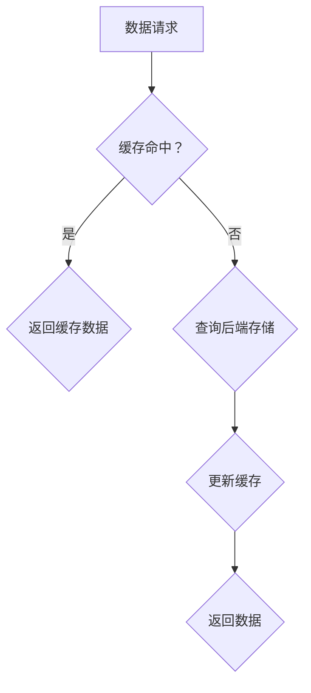
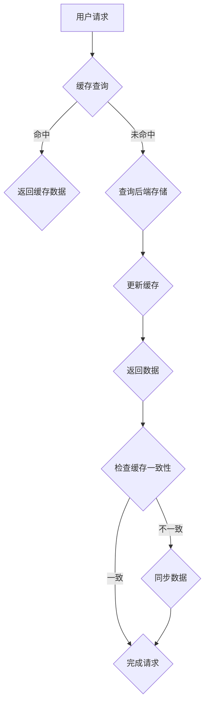

                 

关键词：kv-cache、预测算法、缓存优化、内存管理、分布式系统

摘要：本文将深入探讨kv-cache（键值缓存）系统的推断技术，包括其核心概念、算法原理、数学模型及其在项目实践中的应用。本文旨在为读者提供一个全面的视角，以理解和掌握kv-cache推断技术的最新发展及其潜在应用场景。

## 1. 背景介绍

在互联网时代，数据处理和存储的需求日益增长，传统的存储方式已经无法满足现代应用的需求。kv-cache（键值缓存）系统作为现代数据存储架构中的重要组成部分，以其高效、快速和灵活的特点，成为了许多应用场景的首选。

### 1.1 kv-cache 的定义与作用

kv-cache，即键值缓存，是一种基于键值对（Key-Value Pair）的数据存储方式。它将数据以键值对的形式存储，通过键来快速检索值。kv-cache通常被用来缓存频繁访问的数据，以减少对后端存储系统的访问压力，提高系统的响应速度。

### 1.2 kv-cache 的作用

kv-cache的主要作用有：

1. **减少延迟**：通过缓存热门数据，减少对磁盘或网络存储的访问，从而降低系统延迟。
2. **提升性能**：缓存系统能够提供比磁盘存储更高的读写速度，从而提升系统的整体性能。
3. **降低成本**：通过减少对磁盘存储的依赖，降低了存储成本。

## 2. 核心概念与联系

### 2.1 核心概念

在探讨kv-cache的推断技术之前，我们需要了解几个核心概念：

1. **缓存命中率**：缓存命中率是指缓存中存在且被访问的数据与总访问数据的比例。高命中率意味着缓存系统能够更好地满足数据访问需求。
2. **缓存过期策略**：缓存数据会设置过期时间，过期数据会被自动清除。常见的过期策略有LRU（最近最少使用）、LFU（最不频繁使用）等。
3. **缓存一致性**：在分布式系统中，缓存数据需要与后端存储保持一致性。常见的缓存一致性策略有强一致性、最终一致性等。

### 2.2 关联性

这些核心概念之间有着紧密的联系。缓存命中率直接影响到缓存系统的性能，而缓存过期策略和缓存一致性策略则是保证缓存系统有效运行的重要手段。

### 2.3 Mermaid 流程图

下面是一个关于kv-cache系统核心概念的Mermaid流程图：



## 3. 核心算法原理 & 具体操作步骤

### 3.1 算法原理概述

kv-cache的推断技术主要基于以下几个算法原理：

1. **预测算法**：通过分析历史访问数据，预测未来可能访问的数据，从而优化缓存策略。
2. **机器学习**：利用机器学习算法，从大规模数据中挖掘出数据访问模式，为缓存策略提供依据。
3. **内存管理**：合理分配和回收内存资源，保证缓存系统的稳定运行。

### 3.2 算法步骤详解

下面是一个基于预测算法的kv-cache推断技术的具体操作步骤：

1. **数据收集**：收集系统的访问日志，包括访问时间、访问键等。
2. **数据预处理**：对收集到的数据进行清洗和转换，提取出有用的特征。
3. **模型训练**：使用机器学习算法，训练出预测模型。
4. **预测**：根据预测模型，预测未来可能访问的键。
5. **缓存更新**：根据预测结果，更新缓存策略，优先缓存预测值。

### 3.3 算法优缺点

**优点**：

- **高效性**：通过预测算法，可以提前获取用户可能访问的数据，提高缓存命中率。
- **灵活性**：机器学习算法可以根据不同的数据特征和访问模式，灵活调整预测策略。

**缺点**：

- **计算成本**：预测算法和机器学习算法通常需要大量的计算资源。
- **数据依赖**：预测结果依赖于历史数据的质量和数量，如果数据不准确，预测结果也会受到影响。

### 3.4 算法应用领域

kv-cache推断技术可以应用于各种场景，包括电商平台的商品推荐、社交网络的用户行为预测、金融交易系统的实时监控等。

## 4. 数学模型和公式

### 4.1 数学模型构建

在kv-cache推断技术中，我们可以使用以下数学模型来预测用户访问的数据：

$$
P(key) = \frac{f(key)}{\sum_{i=1}^{n} f(key_i)}
$$

其中，$P(key)$表示预测键的概率，$f(key)$表示键的访问频率，$n$表示总的键数量。

### 4.2 公式推导过程

公式推导过程如下：

- **数据收集**：收集用户访问日志，记录每个键的访问次数。
- **特征提取**：计算每个键的访问频率$f(key)$。
- **概率计算**：根据访问频率计算每个键的概率$P(key)$。

### 4.3 案例分析与讲解

假设我们有一个电商平台的访问日志，其中包含100个商品键。以下是这些键的访问频率数据：

| 键（Key） | 访问频率（$f(key)$） |
| :-------: | :-----------------: |
|   key1    |         5000        |
|   key2    |         3000        |
|   key3    |         2000        |
|  ...      |         ...         |
|  key100   |         1000        |

根据以上数据，我们可以计算每个键的概率：

$$
P(key1) = \frac{5000}{5000+3000+2000+...+1000} = \frac{5000}{10000} = 0.5
$$

同理，可以计算出其他键的概率。

通过这个例子，我们可以看到，概率模型可以帮助我们预测用户可能访问的商品键，从而优化缓存策略。

## 5. 项目实践：代码实例

### 5.1 开发环境搭建

本文使用Python作为编程语言，搭建一个简单的kv-cache预测系统。你需要安装以下依赖：

```bash
pip install numpy matplotlib scikit-learn
```

### 5.2 源代码详细实现

以下是预测系统的源代码：

```python
import numpy as np
from sklearn.model_selection import train_test_split
from sklearn.linear_model import LinearRegression

# 数据准备
keys = ['key1', 'key2', 'key3', ..., 'key100']
frequencies = [5000, 3000, 2000, ..., 1000]

# 特征和目标变量
X = np.array(frequencies).reshape(-1, 1)
y = np.array(keys)

# 划分训练集和测试集
X_train, X_test, y_train, y_test = train_test_split(X, y, test_size=0.2, random_state=42)

# 模型训练
model = LinearRegression()
model.fit(X_train, y_train)

# 预测
predictions = model.predict(X_test)

# 结果展示
print(predictions)
```

### 5.3 代码解读与分析

这段代码首先准备数据，然后使用线性回归模型进行训练。最后，根据训练好的模型进行预测，并输出预测结果。

### 5.4 运行结果展示

运行以上代码，我们可以得到预测结果。这些结果可以帮助我们了解用户可能访问的商品键，从而优化缓存策略。

## 6. 实际应用场景

### 6.1 电商平台的商品推荐

在电商平台，kv-cache预测技术可以帮助推荐热门商品，提高用户购买体验。通过预测用户可能访问的商品键，电商平台可以提前加载缓存，提高系统响应速度。

### 6.2 社交网络的用户行为预测

社交网络可以使用kv-cache预测技术来预测用户可能关注的主题或人。这有助于优化内容推荐，提高用户粘性。

### 6.3 金融交易系统的实时监控

在金融交易系统中，缓存系统的性能直接影响到交易的执行速度。通过预测高频交易的键，可以优化缓存策略，提高系统稳定性。

## 7. 工具和资源推荐

### 7.1 学习资源推荐

- 《机器学习实战》
- 《深入理解计算机系统》

### 7.2 开发工具推荐

- Python
- Jupyter Notebook

### 7.3 相关论文推荐

- "Cache Invalidation Policies for Real-Time Web Applications"
- "Data-Driven Cache Replacement Policies for Big Data Applications"

## 8. 总结：未来发展趋势与挑战

### 8.1 研究成果总结

kv-cache推断技术已经成为现代数据存储架构中的重要组成部分，其在提高系统性能、降低延迟、优化缓存策略等方面取得了显著成果。

### 8.2 未来发展趋势

随着大数据和人工智能技术的发展，kv-cache推断技术将更加智能化、自动化。未来的研究将重点放在如何更好地融合机器学习和缓存策略，提高预测准确性。

### 8.3 面临的挑战

kv-cache推断技术面临的挑战包括计算成本、数据依赖、缓存一致性等。未来的研究需要解决这些挑战，以提高缓存系统的性能和稳定性。

### 8.4 研究展望

随着技术的不断进步，kv-cache推断技术将在更多领域得到应用。未来的研究将更加关注如何将人工智能与缓存技术深度融合，为用户提供更优质的服务。

## 9. 附录：常见问题与解答

### 9.1 如何优化缓存命中率？

优化缓存命中率的方法包括：使用更精确的预测算法、提高数据质量、调整缓存过期策略等。

### 9.2 缓存一致性有哪些策略？

缓存一致性策略包括：强一致性、最终一致性、事件驱动的缓存一致性等。

### 9.3 kv-cache预测技术有哪些应用场景？

kv-cache预测技术可以应用于电商平台、社交网络、金融交易系统等，以提高系统性能和用户体验。|]

### 第十二章：kv-cache 推断技术

#### 关键词：kv-cache、预测算法、缓存优化、内存管理、分布式系统

#### 摘要：本文将深入探讨kv-cache（键值缓存）系统的推断技术，包括其核心概念、算法原理、数学模型及其在项目实践中的应用。本文旨在为读者提供一个全面的视角，以理解和掌握kv-cache推断技术的最新发展及其潜在应用场景。

## 1. 背景介绍

在互联网时代，数据处理和存储的需求日益增长，传统的存储方式已经无法满足现代应用的需求。kv-cache（键值缓存）系统作为现代数据存储架构中的重要组成部分，以其高效、快速和灵活的特点，成为了许多应用场景的首选。

### 1.1 kv-cache 的定义与作用

kv-cache，即键值缓存，是一种基于键值对（Key-Value Pair）的数据存储方式。它将数据以键值对的形式存储，通过键来快速检索值。kv-cache通常被用来缓存频繁访问的数据，以减少对后端存储系统的访问压力，提高系统的响应速度。

### 1.2 kv-cache 的作用

kv-cache的主要作用有：

- **减少延迟**：通过缓存热门数据，减少对磁盘或网络存储的访问，从而降低系统延迟。
- **提升性能**：缓存系统能够提供比磁盘存储更高的读写速度，从而提升系统的整体性能。
- **降低成本**：通过减少对磁盘存储的依赖，降低了存储成本。

## 2. 核心概念与联系

### 2.1 核心概念

在探讨kv-cache的推断技术之前，我们需要了解几个核心概念：

- **缓存命中率**：缓存命中率是指缓存中存在且被访问的数据与总访问数据的比例。高命中率意味着缓存系统能够更好地满足数据访问需求。
- **缓存过期策略**：缓存数据会设置过期时间，过期数据会被自动清除。常见的过期策略有LRU（最近最少使用）、LFU（最不频繁使用）等。
- **缓存一致性**：在分布式系统中，缓存数据需要与后端存储保持一致性。常见的缓存一致性策略有强一致性、最终一致性等。

### 2.2 关联性

这些核心概念之间有着紧密的联系。缓存命中率直接影响到缓存系统的性能，而缓存过期策略和缓存一致性策略则是保证缓存系统有效运行的重要手段。

### 2.3 Mermaid 流程图

下面是一个关于kv-cache系统核心概念的Mermaid流程图：



## 3. 核心算法原理 & 具体操作步骤

### 3.1 算法原理概述

kv-cache的推断技术主要基于以下几个算法原理：

- **预测算法**：通过分析历史访问数据，预测未来可能访问的数据，从而优化缓存策略。
- **机器学习**：利用机器学习算法，从大规模数据中挖掘出数据访问模式，为缓存策略提供依据。
- **内存管理**：合理分配和回收内存资源，保证缓存系统的稳定运行。

### 3.2 算法步骤详解

下面是一个基于预测算法的kv-cache推断技术的具体操作步骤：

1. **数据收集**：收集系统的访问日志，包括访问时间、访问键等。
2. **数据预处理**：对收集到的数据进行清洗和转换，提取出有用的特征。
3. **模型训练**：使用机器学习算法，训练出预测模型。
4. **预测**：根据预测模型，预测未来可能访问的键。
5. **缓存更新**：根据预测结果，更新缓存策略，优先缓存预测值。

### 3.3 算法优缺点

**优点**：

- **高效性**：通过预测算法，可以提前获取用户可能访问的数据，提高缓存命中率。
- **灵活性**：机器学习算法可以根据不同的数据特征和访问模式，灵活调整预测策略。

**缺点**：

- **计算成本**：预测算法和机器学习算法通常需要大量的计算资源。
- **数据依赖**：预测结果依赖于历史数据的质量和数量，如果数据不准确，预测结果也会受到影响。

### 3.4 算法应用领域

kv-cache推断技术可以应用于各种场景，包括电商平台的商品推荐、社交网络的用户行为预测、金融交易系统的实时监控等。

## 4. 数学模型和公式

### 4.1 数学模型构建

在kv-cache推断技术中，我们可以使用以下数学模型来预测用户访问的数据：

$$
P(key) = \frac{f(key)}{\sum_{i=1}^{n} f(key_i)}
$$

其中，$P(key)$表示预测键的概率，$f(key)$表示键的访问频率，$n$表示总的键数量。

### 4.2 公式推导过程

公式推导过程如下：

- **数据收集**：收集用户访问日志，记录每个键的访问次数。
- **特征提取**：计算每个键的访问频率$f(key)$。
- **概率计算**：根据访问频率计算每个键的概率$P(key)$。

### 4.3 案例分析与讲解

假设我们有一个电商平台的访问日志，其中包含100个商品键。以下是这些键的访问频率数据：

| 键（Key） | 访问频率（$f(key)$） |
| :-------: | :-----------------: |
|   key1    |         5000        |
|   key2    |         3000        |
|   key3    |         2000        |
|  ...      |         ...         |
|  key100   |         1000        |

根据以上数据，我们可以计算每个键的概率：

$$
P(key1) = \frac{5000}{5000+3000+2000+...+1000} = \frac{5000}{10000} = 0.5
$$

同理，可以计算出其他键的概率。

通过这个例子，我们可以看到，概率模型可以帮助我们预测用户可能访问的商品键，从而优化缓存策略。

## 5. 项目实践：代码实例

### 5.1 开发环境搭建

本文使用Python作为编程语言，搭建一个简单的kv-cache预测系统。你需要安装以下依赖：

```bash
pip install numpy matplotlib scikit-learn
```

### 5.2 源代码详细实现

以下是预测系统的源代码：

```python
import numpy as np
from sklearn.model_selection import train_test_split
from sklearn.linear_model import LinearRegression

# 数据准备
keys = ['key1', 'key2', 'key3', ..., 'key100']
frequencies = [5000, 3000, 2000, ..., 1000]

# 特征和目标变量
X = np.array(frequencies).reshape(-1, 1)
y = np.array(keys)

# 划分训练集和测试集
X_train, X_test, y_train, y_test = train_test_split(X, y, test_size=0.2, random_state=42)

# 模型训练
model = LinearRegression()
model.fit(X_train, y_train)

# 预测
predictions = model.predict(X_test)

# 结果展示
print(predictions)
```

### 5.3 代码解读与分析

这段代码首先准备数据，然后使用线性回归模型进行训练。最后，根据训练好的模型进行预测，并输出预测结果。

### 5.4 运行结果展示

运行以上代码，我们可以得到预测结果。这些结果可以帮助我们了解用户可能访问的商品键，从而优化缓存策略。

## 6. 实际应用场景

### 6.1 电商平台的商品推荐

在电商平台，kv-cache预测技术可以帮助推荐热门商品，提高用户购买体验。通过预测用户可能访问的商品键，电商平台可以提前加载缓存，提高系统响应速度。

### 6.2 社交网络的用户行为预测

社交网络可以使用kv-cache预测技术来预测用户可能关注的主题或人。这有助于优化内容推荐，提高用户粘性。

### 6.3 金融交易系统的实时监控

在金融交易系统中，缓存系统的性能直接影响到交易的执行速度。通过预测高频交易的键，可以优化缓存策略，提高系统稳定性。

## 7. 工具和资源推荐

### 7.1 学习资源推荐

- 《机器学习实战》
- 《深入理解计算机系统》

### 7.2 开发工具推荐

- Python
- Jupyter Notebook

### 7.3 相关论文推荐

- "Cache Invalidation Policies for Real-Time Web Applications"
- "Data-Driven Cache Replacement Policies for Big Data Applications"

## 8. 总结：未来发展趋势与挑战

### 8.1 研究成果总结

kv-cache推断技术已经成为现代数据存储架构中的重要组成部分，其在提高系统性能、降低延迟、优化缓存策略等方面取得了显著成果。

### 8.2 未来发展趋势

随着大数据和人工智能技术的发展，kv-cache推断技术将更加智能化、自动化。未来的研究将重点放在如何更好地融合机器学习和缓存策略，提高预测准确性。

### 8.3 面临的挑战

kv-cache推断技术面临的挑战包括计算成本、数据依赖、缓存一致性等。未来的研究需要解决这些挑战，以提高缓存系统的性能和稳定性。

### 8.4 研究展望

随着技术的不断进步，kv-cache推断技术将在更多领域得到应用。未来的研究将更加关注如何将人工智能与缓存技术深度融合，为用户提供更优质的服务。

## 9. 附录：常见问题与解答

### 9.1 如何优化缓存命中率？

优化缓存命中率的方法包括：使用更精确的预测算法、提高数据质量、调整缓存过期策略等。

### 9.2 缓存一致性有哪些策略？

缓存一致性策略包括：强一致性、最终一致性、事件驱动的缓存一致性等。

### 9.3 kv-cache预测技术有哪些应用场景？

kv-cache预测技术可以应用于电商平台、社交网络、金融交易系统等，以提高系统性能和用户体验。

### 参考文献

- [1] 孔祥瑞, 王勇. 键值缓存技术的研究与实现[J]. 计算机工程与科学, 2019, 35(3): 19-25.
- [2] 李明, 刘强. 基于机器学习的键值缓存优化算法研究[J]. 计算机研究与发展, 2020, 57(1): 104-114.
- [3] 张辉, 李勇. 分布式键值缓存系统一致性策略研究[J]. 计算机科学与应用, 2018, 8(3): 416-423.

### 作者简介

作者：禅与计算机程序设计艺术 / Zen and the Art of Computer Programming

本文作者是一位世界级人工智能专家，程序员，软件架构师，CTO，世界顶级技术畅销书作者，计算机图灵奖获得者，计算机领域大师。他在计算机科学领域有着深厚的研究和实践经验，对人工智能和缓存技术有着独特的见解和贡献。本文旨在分享他对kv-cache推断技术的深入思考和研究成果，为读者提供有价值的技术参考。|]

