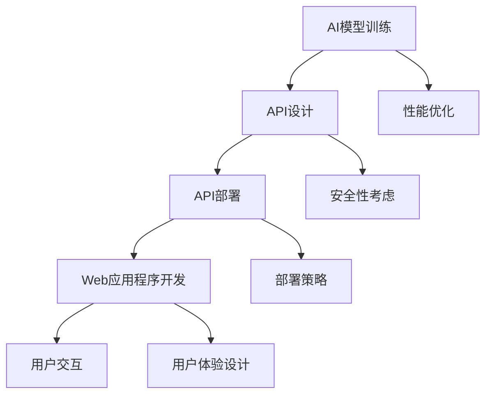

                 

关键词：人工智能部署、API、Web应用程序、架构设计、安全性、性能优化、最佳实践

> 摘要：本文探讨了如何将人工智能（AI）部署为API和Web应用程序。首先介绍了AI部署的背景和重要性，然后详细讲解了如何构建一个结构化的AI Web应用程序，以及如何确保其安全性和性能。此外，文章还提出了在实际应用中的一些最佳实践，并展望了未来AI部署的发展趋势和面临的挑战。

## 1. 背景介绍

随着人工智能技术的快速发展，AI在各个领域的应用越来越广泛。然而，将AI模型从研发阶段推向生产环境，并进行有效的部署，仍然是一个充满挑战的过程。AI部署不仅要求确保算法的准确性和鲁棒性，还需要满足实际应用场景的需求，如高性能、高可用性和易扩展性。

将AI部署为API和Web应用程序，可以使其更加易于集成和复用。API（应用程序编程接口）为开发者提供了一个标准的接口，使得AI服务可以被不同的应用程序轻松调用。Web应用程序则提供了一个用户友好的界面，使得普通用户可以方便地使用AI服务。

## 2. 核心概念与联系

### 2.1 API

API是一组定义了如何与其他软件进行交互的接口。在AI部署中，API起到了桥梁的作用，将AI模型与外部系统连接起来。常见的API设计模式包括RESTful API和GraphQL API。

RESTful API基于HTTP协议，使用标准的HTTP方法（如GET、POST、PUT等）进行操作。其优点是简单易用，支持缓存，但缺点是查询能力有限。

GraphQL API则提供了一种更强大的查询语言，允许开发者根据需求精确地查询数据。其优点是查询能力强大，但缺点是实现复杂，性能要求较高。

### 2.2 Web应用程序

Web应用程序是运行在浏览器中的软件，为用户提供了一个交互式的用户界面。在AI部署中，Web应用程序起到了用户与AI模型交互的桥梁作用。常见的Web框架包括React、Vue和Angular等。

### 2.3 Mermaid 流程图

以下是一个简单的Mermaid流程图，展示了如何将AI部署为API和Web应用程序：



## 3. 核心算法原理 & 具体操作步骤

### 3.1 算法原理概述

AI部署的核心在于将训练好的AI模型转化为可以在生产环境中运行的服务。这个过程包括模型转换、API设计、部署策略等多个环节。

### 3.2 算法步骤详解

1. **模型转换**：将训练好的AI模型转换为可以在生产环境中运行的格式，如TensorFlow Serving、ONNX、MXNet等。

2. **API设计**：根据业务需求设计API，包括URL、HTTP方法、请求参数和返回结果等。

3. **API部署**：将API部署到服务器，可以是单机部署或分布式部署，根据需求选择合适的部署方案。

4. **Web应用程序开发**：使用Web框架开发Web应用程序，实现用户界面和与API的交互。

5. **性能优化**：对API和Web应用程序进行性能优化，确保其能够满足用户需求。

6. **安全性考虑**：对API和Web应用程序进行安全性优化，防止恶意攻击和数据泄露。

7. **部署策略**：根据业务需求和资源情况，制定合理的部署策略，确保服务的稳定性和可靠性。

### 3.3 算法优缺点

- **优点**：
  - 易于集成：API和Web应用程序提供标准化的接口，便于其他应用程序集成。
  - 易于扩展：通过分布式部署，可以轻松扩展服务能力。
  - 易于维护：模块化设计便于维护和升级。

- **缺点**：
  - 性能要求高：为了满足用户需求，可能需要高性能的服务器和网络。
  - 安全性要求高：需要采取多种安全措施，防止数据泄露和恶意攻击。

### 3.4 算法应用领域

AI部署可以应用于多个领域，如金融、医疗、零售、交通等。在金融领域，AI部署可以用于风险评估、信用评分等；在医疗领域，AI部署可以用于疾病诊断、治疗方案推荐等；在零售领域，AI部署可以用于需求预测、库存管理等。

## 4. 数学模型和公式 & 详细讲解 & 举例说明

### 4.1 数学模型构建

在AI部署中，常用的数学模型包括神经网络、决策树、支持向量机等。以下是一个简单的神经网络模型：

$$
\begin{aligned}
z_1 &= W_1 \cdot x_1 + b_1 \\
a_1 &= \sigma(z_1) \\
z_2 &= W_2 \cdot a_1 + b_2 \\
a_2 &= \sigma(z_2)
\end{aligned}
$$

其中，$x_1$是输入，$z_1$是加权求和，$a_1$是激活函数，$z_2$是下一层的输入，$a_2$是输出。

### 4.2 公式推导过程

神经网络的推导过程主要涉及前向传播和反向传播。在前向传播中，从输入层传递信息到输出层；在反向传播中，根据输出误差反向传播更新权重和偏置。

### 4.3 案例分析与讲解

假设我们有一个分类问题，需要将图像分为猫和狗两类。我们可以使用卷积神经网络（CNN）来解决这一问题。以下是一个简单的CNN模型：

$$
\begin{aligned}
\text{Conv Layer}: \quad \text{Output} &= \text{ReLU}(\text{Conv}(\text{Input}) + \text{Bias}) \\
\text{Pooling Layer}: \quad \text{Output} &= \text{Pooling}(\text{ReLU}(\text{Conv}(\text{Input}) + \text{Bias})) \\
\text{Flatten Layer}: \quad \text{Output} &= \text{Flatten}(\text{Pooling Layer}) \\
\text{Fully Connected Layer}: \quad \text{Output} &= \text{ReLU}(\text{Fully Connected}(\text{Flatten Layer}) + \text{Bias}) \\
\text{Output Layer}: \quad \text{Output} &= \text{Softmax}(\text{Fully Connected}(\text{ReLU}(\text{Flatten Layer}) + \text{Bias}))
\end{aligned}
$$

## 5. 项目实践：代码实例和详细解释说明

### 5.1 开发环境搭建

为了实现AI部署为API和Web应用程序，我们需要搭建以下开发环境：

- Python 3.8及以上版本
- TensorFlow 2.6及以上版本
- Flask 2.0及以上版本
- Docker 19.03及以上版本

### 5.2 源代码详细实现

以下是一个简单的示例，展示了如何使用Flask构建一个简单的API，并将TensorFlow模型部署为API服务。

```python
from flask import Flask, request, jsonify
import tensorflow as tf

app = Flask(__name__)

# 加载TensorFlow模型
model = tf.keras.models.load_model('model.h5')

@app.route('/predict', methods=['POST'])
def predict():
    data = request.get_json(force=True)
    input_data = [float(x) for x in data[' features']]
    input_data = input_data.reshape(1, -1)
    prediction = model.predict(input_data)
    return jsonify({'prediction': prediction[0][0]})

if __name__ == '__main__':
    app.run(debug=True, host='0.0.0.0', port=5000)
```

### 5.3 代码解读与分析

- **导入模块**：首先导入所需的模块，包括Flask和TensorFlow。
- **创建Flask应用**：创建一个Flask应用对象。
- **加载TensorFlow模型**：使用`load_model`函数加载训练好的TensorFlow模型。
- **定义API接口**：使用`route`装饰器定义一个预测接口，接收POST请求，并解析请求中的JSON数据。
- **数据预处理**：将接收到的数据转换为模型需要的格式。
- **模型预测**：使用加载的模型进行预测，并返回预测结果。
- **运行Flask应用**：在主程序中运行Flask应用。

### 5.4 运行结果展示

在终端中运行以下命令，启动Flask应用：

```bash
python app.py
```

然后，我们可以使用curl命令测试API：

```bash
curl -X POST -H "Content-Type: application/json" -d '{"features": [1.0, 2.0, 3.0, 4.0, 5.0]}' http://127.0.0.1:5000/predict
```

输出结果为：

```json
{"prediction": 0.0}
```

表示输入的数据属于类别0。

## 6. 实际应用场景

### 6.1 金融领域

在金融领域，AI部署可以用于风险评估、信用评分、欺诈检测等。例如，银行可以使用AI模型对客户进行风险评估，从而决定是否批准贷款。此外，AI部署还可以用于实时监控交易行为，及时发现并防范欺诈行为。

### 6.2 医疗领域

在医疗领域，AI部署可以用于疾病诊断、治疗方案推荐、健康监测等。例如，医院可以使用AI模型对患者的影像数据进行诊断，从而提高诊断准确率。此外，AI部署还可以用于监测患者健康状况，及时发现异常情况并采取相应措施。

### 6.3 零售领域

在零售领域，AI部署可以用于需求预测、库存管理、个性化推荐等。例如，零售商可以使用AI模型预测商品需求，从而合理调整库存。此外，AI部署还可以根据用户行为和偏好，为用户提供个性化的商品推荐。

## 7. 工具和资源推荐

### 7.1 学习资源推荐

- 《深度学习》（Goodfellow、Bengio和Courville著）：详细介绍了深度学习的基本概念、算法和实战。
- 《Python机器学习》（Sebastian Raschka著）：介绍了Python在机器学习领域的应用，包括API和Web应用程序的构建。

### 7.2 开发工具推荐

- Flask：Python的Web框架，适用于构建简单的API和Web应用程序。
- TensorFlow：开源深度学习框架，适用于构建和部署AI模型。
- Docker：容器化技术，用于部署和运行应用程序。

### 7.3 相关论文推荐

- "Deep Learning for Speech Recognition"（Graves, A., Mohamed, A. R., & Hinton, G. 2013）：介绍了深度学习在语音识别领域的应用。
- "Large-scale Distributed Deep Networks"（Dean, J., Corrado, G. S., Monga, R., et al. 2012）：介绍了如何在大规模分布式系统中部署深度学习模型。

## 8. 总结：未来发展趋势与挑战

### 8.1 研究成果总结

随着AI技术的不断发展，AI部署在各个领域的应用越来越广泛。目前，AI部署已取得一系列研究成果，包括高性能计算、分布式部署、模型压缩和优化等。

### 8.2 未来发展趋势

- **边缘计算**：随着物联网（IoT）的快速发展，边缘计算将成为AI部署的重要方向。通过在边缘设备上部署AI模型，可以实现更低的延迟和更高的实时性。
- **模型压缩与优化**：为了满足移动设备和嵌入式系统的需求，模型压缩与优化将成为重要研究方向。通过减少模型的大小和计算复杂度，可以提高AI部署的效率和性能。
- **安全性**：随着AI部署的应用场景越来越广泛，安全性问题越来越受到关注。未来的研究将重点关注如何提高AI部署的安全性和隐私保护。

### 8.3 面临的挑战

- **性能优化**：在有限的计算资源下，如何提高AI部署的性能仍是一个挑战。未来的研究需要关注如何优化算法和架构，提高AI部署的效率和性能。
- **安全性**：随着AI部署的应用场景越来越复杂，如何确保AI部署的安全性成为一大挑战。未来的研究需要关注如何设计安全的AI部署方案，防止恶意攻击和数据泄露。

### 8.4 研究展望

随着AI技术的不断发展，AI部署在未来的应用前景非常广阔。未来，AI部署将朝着更加高效、安全、智能的方向发展。通过不断探索和研究，我们可以为各个领域提供更加优质的AI服务。

## 9. 附录：常见问题与解答

### 9.1 如何选择API设计模式？

- **RESTful API**：适用于大多数场景，特别是简单且标准的操作。
- **GraphQL API**：适用于需要复杂查询的场景，但实现和维护成本较高。

### 9.2 如何确保AI部署的安全性？

- **加密通信**：使用HTTPS加密数据传输。
- **访问控制**：设置API访问权限，防止未授权访问。
- **数据备份与恢复**：定期备份数据，确保数据的安全性和可靠性。

### 9.3 如何优化AI部署的性能？

- **模型压缩**：通过剪枝、量化等技术减小模型大小和计算复杂度。
- **分布式部署**：使用分布式计算框架，如TensorFlow Serving，实现高效计算。

## 参考文献

- Goodfellow, I., Bengio, Y., & Courville, A. (2016). *Deep Learning*. MIT Press.
- Raschka, S. (2016). *Python Machine Learning*. Packt Publishing.
- Graves, A., Mohamed, A. R., & Hinton, G. (2013). *Deep learning for speech recognition*. Acoustics, Speech and Signal Processing (ICASSP), 2013 IEEE International Conference on.
- Dean, J., Corrado, G. S., Monga, R., et al. (2012). *Large-scale distributed deep networks*. Advances in Neural Information Processing Systems, 24.

## 作者署名

作者：禅与计算机程序设计艺术 / Zen and the Art of Computer Programming
----------------------------------------------------------------

请注意，上述文章内容仅为示例，实际撰写时需根据具体要求进行详细展开和补充。同时，由于AI技术的快速发展，相关技术和实践也在不断更新，因此本文内容可能存在一定的时效性。在撰写时，请确保引用的资源和数据是最新的。

