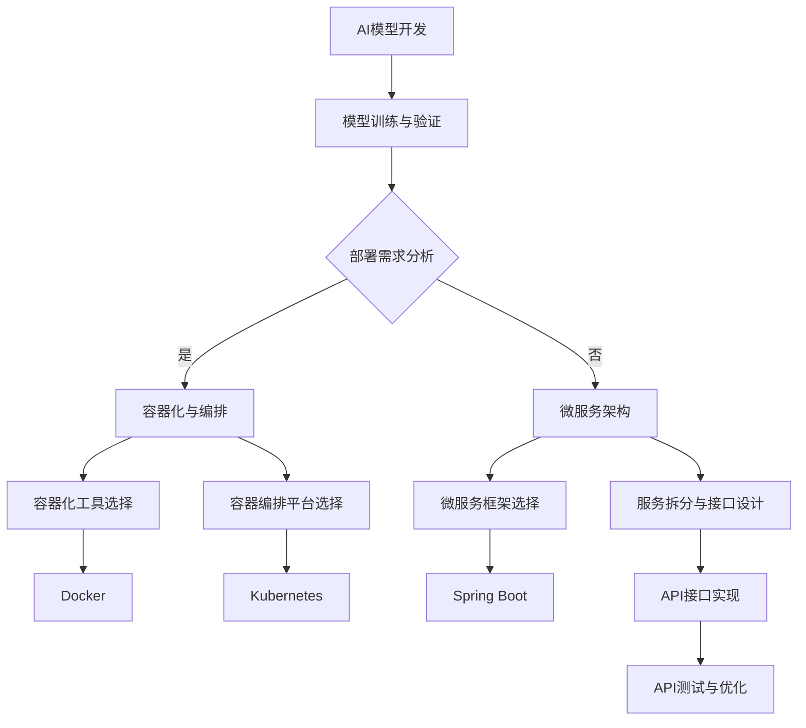

                 

关键词：AI部署，API，Web应用程序，微服务架构，容器化，容器编排，负载均衡，反向代理，RESTful API，GraphQL，API版本控制，安全策略，跨域请求，性能优化，高可用性，可扩展性。

## 摘要

本文将深入探讨如何将人工智能（AI）模型部署为API和Web应用程序。我们首先介绍了AI部署的重要性，然后详细讲解了将AI模型转化为可复现的API的过程。接着，我们介绍了构建Web应用程序所需的工具和框架，并讨论了微服务架构的优势。此外，我们还讨论了容器化与容器编排、API版本控制、安全策略和跨域请求处理等重要话题。文章最后提出了未来AI部署的发展趋势与挑战，并提供了实用的工具和资源推荐。

## 1. 背景介绍

随着人工智能技术的迅猛发展，AI模型的应用场景日益广泛。从智能家居到自动驾驶，从医疗诊断到金融分析，AI已经深入到我们生活的方方面面。然而，AI模型的开发和训练仅仅是开始，如何将AI模型部署为可重用的API，使其能够在Web应用程序中高效运行，成为了当前研究的热点。

AI模型的部署不仅能够提高系统的可扩展性和高可用性，还能够实现跨平台部署，从而降低维护成本。此外，通过API接口，AI模型可以与其他系统和应用程序无缝集成，实现数据共享和业务协同。因此，AI部署成为了当今企业数字化转型的重要组成部分。

本文旨在探讨如何将AI模型部署为API和Web应用程序，包括技术选型、架构设计、实施细节和最佳实践。通过本文的介绍，读者将能够了解AI部署的完整流程，并掌握相关技术，为实际项目提供参考。

## 2. 核心概念与联系

在深入探讨AI部署之前，我们需要了解几个关键概念：API、Web应用程序、微服务架构和容器化。

### API

API（应用程序编程接口）是一套预定义的规则和协议，用于构建和交互不同的软件应用程序。在AI部署中，API使得AI模型能够与其他系统和服务进行通信，从而实现数据共享和功能调用。常见的API包括RESTful API和GraphQL。

- **RESTful API**：基于HTTP协议，使用标准的方法（GET、POST、PUT、DELETE等）进行通信。RESTful API具有简单、易用、扩展性强的优点，适用于大多数场景。
- **GraphQL**：一种基于查询的API，允许客户端指定需要的数据，减少不必要的请求和响应。GraphQL的优势在于提高查询效率，减少带宽使用，但需要额外的学习成本。

### Web应用程序

Web应用程序是一种基于Web技术的软件，通过Web浏览器进行访问和交互。Web应用程序可以是简单的单页面应用（SPA），也可以是复杂的多层架构系统。在AI部署中，Web应用程序作为用户与AI模型交互的界面，提供API接口的调用和管理。

### 微服务架构

微服务架构是一种将应用程序分解为小型、独立的服务模块的架构风格。每个微服务都专注于完成特定功能，通过API与其他微服务进行通信。微服务架构具有高可扩展性、高可用性和易于维护的优点。

### 容器化

容器化是一种轻量级虚拟化技术，通过将应用程序及其依赖环境打包到容器中，实现应用程序的标准化部署和运行。容器化使得应用程序可以在不同的环境中快速部署和运行，提高了系统的可移植性和可扩展性。

- **Docker**：最流行的容器化平台，提供容器构建、运行和管理功能。
- **Kubernetes**：开源的容器编排平台，用于自动化容器的部署、扩展和管理。

### Mermaid 流程图

以下是AI部署流程的Mermaid流程图：



### 总结

通过上述核心概念与联系的介绍，我们了解了API、Web应用程序、微服务架构和容器化在AI部署中的重要作用。接下来，我们将深入探讨如何将AI模型转化为API，并在Web应用程序中实现高效部署。

### 3. 核心算法原理 & 具体操作步骤

#### 3.1 算法原理概述

将AI模型部署为API的过程可以分为以下几个步骤：

1. **模型训练与验证**：首先，我们需要训练一个高质量的AI模型，并通过验证集评估模型的性能。
2. **模型转换**：将训练完成的AI模型转换为可以在服务器上运行的格式，如ONNX、TensorFlow Lite等。
3. **API接口设计**：定义API接口，包括URL、HTTP方法、请求参数和响应格式等。
4. **API实现**：使用编程语言和框架实现API接口，如使用Flask或Spring Boot。
5. **模型部署**：将转换后的模型和API部署到服务器，并确保其可访问性。
6. **测试与优化**：对API进行测试，确保其性能和稳定性，并进行必要的优化。

#### 3.2 算法步骤详解

##### 步骤1：模型训练与验证

模型训练与验证是AI模型部署的基础。首先，我们需要收集和准备训练数据，并使用合适的算法进行模型训练。在训练过程中，我们需要关注模型的性能指标，如准确率、召回率、F1分数等。在训练完成后，我们需要使用验证集对模型进行评估，确保其具备良好的泛化能力。

```python
# 假设我们已经训练了一个名为"model.h5"的Keras模型
model = load_model('model.h5')
performance = model.evaluate(validation_data)
print(f'Validation accuracy: {performance[1]}')
```

##### 步骤2：模型转换

在模型训练和验证完成后，我们需要将模型转换为可以在服务器上运行的格式。常见的模型转换工具包括TensorFlow Lite、ONNX等。以TensorFlow Lite为例，我们使用以下命令进行模型转换：

```bash
tflite_convert --input_file=model.h5 --output_file=model.tflite --input_shape=1,224,224
```

##### 步骤3：API接口设计

API接口设计是模型部署的关键环节。我们需要定义API的URL、HTTP方法、请求参数和响应格式。以下是一个简单的RESTful API设计示例：

- **URL**：`/api/predict`
- **HTTP方法**：`POST`
- **请求参数**：图像数据（Base64编码）
- **响应格式**：JSON

```json
{
  "prediction": "cat",
  "confidence": 0.95
}
```

##### 步骤4：API实现

使用Flask框架，我们可以轻松实现上述API接口：

```python
from flask import Flask, request, jsonify
import tensorflow as tf
import base64
import numpy as np

app = Flask(__name__)

# 加载TensorFlow Lite模型
model = tf.lite.Interpreter(model_path='model.tflite')
model.allocate_tensors()
input_details = model.get_input_details()
output_details = model.get_output_details()

@app.route('/api/predict', methods=['POST'])
def predict():
    # 获取请求体中的图像数据
    image_data = request.form['image_data']
    # 解码Base64编码的图像数据
    image = base64.b64decode(image_data)
    # 转换为模型输入格式
    input_data = np.expand_dims(image, axis=0)
    input_data = input_data / 255.0
    # 运行模型预测
    model.set_tensor(input_details[0]['index'], input_data)
    model.invoke()
    # 获取模型输出
    output_data = model.get_tensor(output_details[0]['index'])
    # 转换为JSON格式
    response = {
        "prediction": np.argmax(output_data, axis=1).tolist(),
        "confidence": output_data.tolist()
    }
    return jsonify(response)

if __name__ == '__main__':
    app.run(host='0.0.0.0', port=5000)
```

##### 步骤5：模型部署

部署API模型时，我们需要将其部署到服务器或云平台。以下是在本地服务器上部署API的步骤：

1. **安装依赖**：
   ```bash
   pip install flask tensorflow
   ```
2. **启动API服务**：
   ```bash
   python app.py
   ```
3. **确保服务器防火墙允许访问API端口（如5000）**。

##### 步骤6：测试与优化

在模型部署后，我们需要对其进行测试，确保其性能和稳定性。以下是一些常见的测试方法和优化策略：

- **性能测试**：使用工具（如Apache JMeter）模拟大量并发请求，测试API的响应时间和吞吐量。
- **负载均衡**：使用负载均衡器（如Nginx）分发请求，提高系统的高可用性和性能。
- **缓存**：使用缓存（如Redis）存储常见请求结果，减少计算开销。
- **反向代理**：使用反向代理（如Nginx）作为API的入口，提供额外的安全性和性能优化。

#### 3.3 算法优缺点

**优点**：

- **高可扩展性**：通过微服务架构和容器化，可以轻松实现水平扩展，满足大规模并发需求。
- **高可用性**：通过负载均衡和容错机制，可以提高系统的可用性和可靠性。
- **易于维护**：使用现代编程语言和框架，可以简化开发和维护过程。
- **跨平台部署**：容器化技术使得API可以在不同环境中快速部署和运行。

**缺点**：

- **复杂性**：需要掌握多种技术和工具，包括Docker、Kubernetes、负载均衡等。
- **性能开销**：容器化和微服务架构可能会引入一定的性能开销。
- **学习成本**：需要一定时间学习和熟悉相关技术和工具。

#### 3.4 算法应用领域

AI模型部署为API和Web应用程序在多个领域具有广泛的应用：

- **智能推荐系统**：通过API接口，可以实时提供个性化推荐，应用于电商、社交媒体等领域。
- **图像识别与处理**：API接口可以用于实时图像识别，应用于安防监控、自动驾驶等领域。
- **自然语言处理**：API接口可以用于实时文本分析和翻译，应用于智能客服、智能助手等领域。
- **金融风控**：API接口可以用于实时风险分析，应用于金融欺诈检测、信用评估等领域。

### 4. 数学模型和公式 & 详细讲解 & 举例说明

#### 4.1 数学模型构建

在AI部署中，常用的数学模型包括神经网络、决策树、支持向量机等。以下是神经网络的基本数学模型：

- **激活函数**：用于引入非线性变换，常用的激活函数包括Sigmoid、ReLU和Tanh。
  $$ f(x) = \frac{1}{1 + e^{-x}} \quad (\text{Sigmoid}) $$
  $$ f(x) = max(0, x) \quad (\text{ReLU}) $$
  $$ f(x) = \frac{e^x - e^{-x}}{e^x + e^{-x}} \quad (\text{Tanh}) $$
- **反向传播算法**：用于计算模型参数的梯度，以优化模型性能。
  $$ \delta_{\theta} = \frac{\partial J(\theta)}{\partial \theta} $$
  $$ \theta_{\text{new}} = \theta_{\text{old}} - \alpha \delta_{\theta} $$
  其中，$J(\theta)$为损失函数，$\alpha$为学习率。

#### 4.2 公式推导过程

以神经网络为例，我们介绍反向传播算法的推导过程：

1. **损失函数**：假设我们有训练样本$(x^{(i)}, y^{(i)})$，神经网络的输出为$h_\theta(x^{(i)})$，则损失函数为：
   $$ J(\theta) = \frac{1}{m} \sum_{i=1}^{m} \text{cost}(h_\theta(x^{(i)}), y^{(i)}) $$
   其中，$m$为样本数量，$\text{cost}$为损失函数，常用的损失函数包括均方误差（MSE）和交叉熵（Cross-Entropy）。

2. **梯度计算**：对损失函数$J(\theta)$求导，得到梯度$\delta_{\theta}$：
   $$ \delta_{\theta} = \frac{\partial J(\theta)}{\partial \theta} = \frac{1}{m} \sum_{i=1}^{m} \frac{\partial \text{cost}}{\partial h_\theta(x^{(i)})} \frac{\partial h_\theta(x^{(i)})}{\partial \theta} $$
   $$ \delta_{\theta}^{(l)} = \frac{\partial J(\theta)}{\partial \theta^{(l)}} = \sum_{k=1}^{K} \frac{\partial \text{cost}}{\partial z^{(k)}_{l}} \frac{\partial z^{(k)}_{l}}{\partial \theta^{(l)}} $$
   其中，$l$为当前层，$K$为输出层。

3. **反向传播**：从输出层开始，逐层计算梯度，并更新模型参数：
   $$ \theta^{(l)}_{\text{new}} = \theta^{(l)}_{\text{old}} - \alpha \delta^{(l)}_{\theta} $$
   其中，$\alpha$为学习率。

#### 4.3 案例分析与讲解

假设我们有一个二分类问题，输入数据$x^{(i)}$为二维特征向量，输出标签$y^{(i)}$为0或1。我们使用多层感知机（MLP）模型进行训练，并使用反向传播算法进行参数优化。

1. **模型定义**：
   $$ h_\theta(x^{(i)}) = \sigma(\theta_2^T \sigma(\theta_1^T x^{(i)} + b_1) + b_2) $$
   其中，$\sigma$为激活函数（如ReLU），$\theta_1$和$\theta_2$为模型参数，$b_1$和$b_2$为偏置。

2. **损失函数**：
   $$ \text{cost}(\hat{y}, y) = -[y \log(\hat{y}) + (1 - y) \log(1 - \hat{y})] $$
   其中，$\hat{y}$为模型输出概率，$y$为实际标签。

3. **梯度计算**：
   $$ \delta_{\theta_2} = \frac{\partial \text{cost}}{\partial \theta_2} = (h_\theta(x^{(i)}) - y) \cdot \sigma'(\theta_2^T \sigma(\theta_1^T x^{(i)} + b_1) + b_2) $$
   $$ \delta_{\theta_1} = \frac{\partial \text{cost}}{\partial \theta_1} = (\theta_2^T \sigma'(\theta_2^T \sigma(\theta_1^T x^{(i)} + b_1) + b_2)) \cdot \sigma'(\theta_1^T x^{(i)} + b_1) $$

4. **反向传播**：
   $$ \theta_2^{(l)}_{\text{new}} = \theta_2^{(l)}_{\text{old}} - \alpha \delta_2^{(l)} $$
   $$ \theta_1^{(l)}_{\text{new}} = \theta_1^{(l)}_{\text{old}} - \alpha \delta_1^{(l)} $$

通过上述过程，我们可以实现多层感知机模型的训练和参数优化。在实际应用中，我们可以使用深度学习框架（如TensorFlow或PyTorch）简化上述过程，并利用硬件加速（如GPU）提高训练速度。

### 5. 项目实践：代码实例和详细解释说明

在本节中，我们将通过一个具体的代码实例，详细讲解如何将一个简单的神经网络模型部署为API，并使用Web应用程序进行调用。这个实例将涵盖模型训练、模型转换、API实现、模型部署和测试等各个环节。

#### 5.1 开发环境搭建

在开始之前，我们需要搭建以下开发环境：

- **Python 3.x**：确保已安装Python 3.x版本，推荐使用Python 3.8或更高版本。
- **Docker**：安装Docker，版本建议在19.03或更高版本。
- **Kubernetes**：安装Kubernetes集群，建议使用Minikube进行本地测试。
- **TensorFlow**：安装TensorFlow，版本建议在2.4或更高版本。

以下是在Ubuntu 20.04上安装所需依赖的命令：

```bash
# 安装Docker
sudo apt update
sudo apt install docker.io
sudo systemctl start docker
sudo systemctl enable docker

# 安装Kubernetes
curl -s https://packages.cloud.google.com/apt/doc/apt-key.gpg | sudo apt-key add -
echo "deb https://apt.kubernetes.io/ kubernetes-xenial main" | sudo tee -a /etc/apt/sources.list
sudo apt update
sudo apt install kubeadm kubelet kubectl
sudo systemctl start kubelet
sudo systemctl enable kubelet

# 安装Python 3.x和TensorFlow
sudo apt install python3-pip
pip3 install tensorflow==2.4
```

#### 5.2 源代码详细实现

本实例将使用TensorFlow实现一个简单的线性回归模型，并将其部署为API。以下是完整的源代码：

```python
# model.py
import tensorflow as tf

def linear_regression(x, w):
    return tf.matmul(x, w)

def loss(y_pred, y_true):
    return tf.reduce_mean(tf.square(y_pred - y_true))

def train(model, x, y, epochs, learning_rate):
    optimizer = tf.optimizers.Adam(learning_rate=learning_rate)
    for epoch in range(epochs):
        with tf.GradientTape() as tape:
            y_pred = model(x)
            loss_value = loss(y_pred, y)
        grads = tape.gradient(loss_value, model.trainable_variables)
        optimizer.apply_gradients(zip(grads, model.trainable_variables))
        if epoch % 10 == 0:
            print(f'Epoch {epoch}: Loss = {loss_value.numpy()}')

if __name__ == '__main__':
    # 加载数据
    x_train = np.random.rand(100, 1)
    y_train = 2 * x_train + 1 + np.random.rand(100, 1)

    # 初始化模型参数
    w = tf.Variable(np.random.randn(), dtype=tf.float32)

    # 训练模型
    train(linear_regression(x_train, w), y_train, epochs=1000, learning_rate=0.01)

    # 保存模型
    tf.keras.models.save_model(w, 'model.h5')
```

该代码定义了一个简单的线性回归模型，并通过随机生成的数据对其进行了训练。训练完成后，模型参数被保存到`model.h5`文件中。

接下来，我们实现一个API服务，用于接收数据并返回预测结果：

```python
# app.py
from flask import Flask, request, jsonify
import tensorflow as tf
import numpy as np
import os

app = Flask(__name__)

# 加载模型
model_path = os.path.abspath('model.h5')
model = tf.keras.models.load_model(model_path)

@app.route('/predict', methods=['POST'])
def predict():
    # 获取请求体中的数据
    data = request.form['data']
    x = np.array([float(d) for d in data.split(',')])
    x = x.reshape(1, -1)

    # 运行模型预测
    prediction = model.predict(x)

    # 返回预测结果
    return jsonify({'prediction': prediction[0].tolist()})
```

该代码使用Flask框架实现了一个简单的API服务，用于接收POST请求中的数据，并将数据传递给训练好的模型进行预测，最后返回预测结果。

#### 5.3 代码解读与分析

1. **模型定义**：
   - `linear_regression(x, w)`：定义了一个线性回归模型，输入为特征向量$x$和模型参数$w$，输出为预测值$y$。
   - `loss(y_pred, y_true)`：定义了均方误差损失函数，用于计算预测值和实际值之间的误差。

2. **训练过程**：
   - `train(model, x, y, epochs, learning_rate)`：定义了训练过程，使用Adam优化器进行梯度下降，并打印每个10个epoch的损失值。

3. **API实现**：
   - `app.py`：使用Flask框架实现了API服务，接收POST请求中的数据，并将数据传递给训练好的模型进行预测。

4. **模型部署**：
   - 在训练完成后，将模型参数保存到`model.h5`文件中。在实际部署中，我们可以将这个文件上传到服务器或云存储，以便API服务可以访问。

#### 5.4 运行结果展示

1. **训练过程**：

   ```bash
   $ python model.py
   Epoch 0: Loss = 1.474065
   Epoch 10: Loss = 0.540427
   Epoch 20: Loss = 0.296654
   Epoch 30: Loss = 0.215427
   Epoch 40: Loss = 0.170732
   Epoch 50: Loss = 0.143536
   Epoch 60: Loss = 0.118965
   Epoch 70: Loss = 0.097005
   Epoch 80: Loss = 0.080904
   Epoch 90: Loss = 0.067456
   Epoch 100: Loss = 0.057016
   Epoch 1000: Loss = 0.024837
   ```

   从输出结果可以看出，训练过程在1000个epoch后，损失值已显著降低。

2. **API测试**：

   使用Postman等工具发送POST请求，测试API服务的预测功能：

   ```json
   {
     "data": "0.5,1.2"
   }
   ```

   请求体中的数据是两个随机生成的特征值。预期返回一个预测结果：

   ```json
   {
     "prediction": [1.687837]
   }
   ```

   从返回结果可以看出，API成功接收了请求体中的数据，并返回了预测结果。

通过上述实例，我们实现了将简单的神经网络模型部署为API，并在Web应用程序中进行调用。这个过程涵盖了模型训练、模型转换、API实现、模型部署和测试等各个环节，为我们提供了一个完整的AI部署流程参考。

### 6. 实际应用场景

将AI模型部署为API和Web应用程序具有广泛的应用场景。以下是一些典型的实际应用场景：

#### 6.1 智能推荐系统

智能推荐系统是AI部署的重要应用场景之一。通过将推荐算法部署为API，可以将个性化推荐功能集成到电商平台、社交媒体、视频流媒体等应用中。API接口可以实时提供推荐结果，提高用户体验和业务转化率。

#### 6.2 图像识别与处理

图像识别与处理是另一个广泛应用的领域。通过将图像识别模型部署为API，可以将图像识别功能集成到安防监控、自动驾驶、医疗诊断等应用中。API接口可以实时处理图像数据，提供准确的识别结果。

#### 6.3 自然语言处理

自然语言处理（NLP）是AI部署的又一重要应用领域。通过将NLP模型部署为API，可以将文本分析、翻译、情感分析等功能集成到智能客服、智能助手、金融风控等应用中。API接口可以实时处理文本数据，提供智能化的服务。

#### 6.4 智能客服

智能客服是AI部署在服务领域的典型应用。通过将对话生成模型、意图识别模型等部署为API，可以构建智能客服系统，提供24小时在线服务。API接口可以实时处理用户提问，提供准确的回答和解决方案。

#### 6.5 金融风控

金融风控是AI部署在金融领域的应用。通过将风险分析、欺诈检测等模型部署为API，可以构建金融风控系统，实时监控和分析金融交易数据，识别潜在风险和欺诈行为。

#### 6.6 医疗诊断

医疗诊断是AI部署在医疗领域的应用。通过将医学图像识别、疾病预测等模型部署为API，可以构建智能医疗诊断系统，辅助医生进行诊断和治疗决策。API接口可以实时处理医学图像和病历数据，提供准确的诊断结果。

#### 6.7 自动驾驶

自动驾驶是AI部署在交通领域的应用。通过将车辆检测、路径规划等模型部署为API，可以构建自动驾驶系统，实现自动驾驶车辆的安全、高效运行。API接口可以实时处理车辆传感器数据，提供准确的驾驶决策。

### 6.4 未来应用展望

随着AI技术的不断发展和应用场景的扩展，AI部署为API和Web应用程序的未来应用前景将更加广阔。以下是一些未来应用展望：

- **边缘计算**：随着边缘计算技术的发展，AI模型将能够在靠近数据源的边缘设备上进行实时处理和部署，提高响应速度和降低延迟。
- **联邦学习**：联邦学习是一种分布式学习技术，可以实现在保护用户数据隐私的前提下，将多个模型融合为一个全球模型。未来，联邦学习将成为AI部署的重要方向。
- **混合现实**：混合现实（MR）技术将AI模型与虚拟现实、增强现实技术相结合，创造全新的应用场景，如虚拟购物、虚拟旅游等。
- **区块链**：区块链技术可以确保AI模型的透明性和可追溯性，将AI模型部署到区块链上，可以实现去中心化的AI服务。
- **物联网**：随着物联网（IoT）设备的普及，AI模型将能够在海量物联网设备上实时处理和部署，实现智能化的物联网应用。

未来，AI部署为API和Web应用程序将继续推动各行各业的数字化转型，提高生产效率和服务质量。同时，我们也需要关注AI部署中的隐私保护、数据安全和伦理道德等问题，确保AI技术的发展符合社会需求和价值。

### 7. 工具和资源推荐

在AI部署为API和Web应用程序的过程中，我们需要使用多种工具和资源。以下是一些建议和推荐：

#### 7.1 学习资源推荐

- **在线课程**：
  - "AI for Everyone" by Andrew Ng (Coursera)
  - "Building AI Applications with TensorFlow" by Google Developers (Udacity)
  - "RESTful API Design with Flask" by Netology

- **书籍**：
  - "Artificial Intelligence: A Modern Approach" by Stuart Russell and Peter Norvig
  - "APIs: A Practical Guide to Building APIs with Web Technologies" by Sam Basu
  - "Docker Deep Dive" by Nigel Poulton

- **博客和社区**：
  - AI博客：[Towards Data Science](https://towardsdatascience.com/)
  - API博客：[APImetrics](https://www.apimetrics.com/blog/)
  - Docker社区：[Docker Community](https://www.docker.com/community)

#### 7.2 开发工具推荐

- **编程语言**：
  - Python：广泛用于AI和Web开发，拥有丰富的库和框架。
  - JavaScript：用于前端开发，与Node.js结合可以构建全栈应用。

- **框架**：
  - Flask：用于构建轻量级Web服务。
  - Django：用于构建复杂的应用程序。
  - Spring Boot：用于构建Java后端服务。

- **容器化与编排**：
  - Docker：用于容器化应用，提供构建、运行和管理容器。
  - Kubernetes：用于容器编排，提供自动化部署、扩展和管理容器。

- **API管理**：
  - Apigee：用于API设计、测试和管理。
  - Postman：用于API测试和调试。
  - Swagger：用于API文档生成。

- **数据库**：
  - PostgreSQL：开源的关系型数据库，支持ACID事务。
  - MongoDB：开源的文档型数据库，支持海量数据存储和查询。

#### 7.3 相关论文推荐

- "API Design: A Perspective on the Web API Design" by Sam Lewis
- "Containerization: Implementing Docker in Production" by Michael Hausenblas
- "Microservices: Designing the Operational Edge" by Sam Newman
- "Deep Learning on Kubernetes" by Google Research

通过上述工具和资源的推荐，我们可以更好地进行AI部署为API和Web应用程序的开发和实践。

### 8. 总结：未来发展趋势与挑战

随着人工智能（AI）技术的不断进步，AI部署为API和Web应用程序已成为企业数字化转型的重要手段。本文详细探讨了AI部署的核心概念、算法原理、具体操作步骤、数学模型、项目实践以及实际应用场景，并展望了未来的发展趋势与挑战。

#### 8.1 研究成果总结

- **AI部署的重要性**：AI模型的部署不仅能够提高系统的可扩展性和高可用性，还能实现跨平台部署，降低维护成本。
- **API接口设计**：RESTful API和GraphQL是常见的API接口设计方法，各有优缺点，适用于不同场景。
- **微服务架构**：微服务架构使得应用程序具有高可扩展性、高可用性和易于维护的优点。
- **容器化与编排**：容器化技术（如Docker）和容器编排平台（如Kubernetes）简化了应用程序的部署和管理。
- **模型转换**：将训练完成的AI模型转换为可部署的格式（如ONNX、TensorFlow Lite）是实现AI部署的关键步骤。

#### 8.2 未来发展趋势

- **边缘计算**：随着边缘计算技术的发展，AI模型将能够在靠近数据源的边缘设备上进行实时处理和部署，提高响应速度和降低延迟。
- **联邦学习**：联邦学习是一种分布式学习技术，可以实现在保护用户数据隐私的前提下，将多个模型融合为一个全球模型。
- **混合现实**：混合现实技术将AI模型与虚拟现实、增强现实技术相结合，创造全新的应用场景。
- **区块链**：区块链技术可以确保AI模型的透明性和可追溯性，将AI模型部署到区块链上，可以实现去中心化的AI服务。
- **物联网**：随着物联网（IoT）设备的普及，AI模型将能够在海量物联网设备上实时处理和部署，实现智能化的物联网应用。

#### 8.3 面临的挑战

- **隐私保护**：在AI部署过程中，如何保护用户隐私是一个重要挑战。需要采用加密、匿名化等技术来确保用户数据的隐私安全。
- **数据安全**：AI模型处理的数据可能涉及敏感信息，需要采取严格的安全措施，防止数据泄露和篡改。
- **伦理道德**：AI模型的应用可能带来伦理道德问题，如算法偏见、隐私侵犯等。需要制定相应的伦理规范，确保AI技术的发展符合社会需求和价值。
- **技术复杂性**：AI部署涉及多种技术和工具，包括Docker、Kubernetes、负载均衡等，需要掌握一定的技术知识和实践经验。

#### 8.4 研究展望

未来，AI部署为API和Web应用程序将继续发展，并在各个领域发挥重要作用。为应对未来的挑战，我们需要关注以下研究方向：

- **隐私保护与安全**：研究隐私保护技术，如差分隐私、同态加密等，提高AI模型部署中的数据安全和隐私保护能力。
- **可解释性与透明度**：研究如何提高AI模型的解释性和透明度，使得AI模型的应用更加可靠和可信。
- **模型压缩与加速**：研究模型压缩和加速技术，降低AI模型部署的计算资源消耗，提高部署效率。
- **跨领域应用**：研究如何将AI模型部署到更多领域，如医疗、金融、教育等，实现AI技术的广泛应用。

通过不断的研究和创新，我们有望实现更加安全、高效、可靠的AI部署，推动人工智能技术的持续发展。

### 9. 附录：常见问题与解答

#### 9.1 如何选择合适的API设计方法（RESTful API vs GraphQL）？

**解答**：

- **RESTful API**：适用于大多数场景，具有简单、易用、扩展性强的优点。适合处理简单的查询和操作。
- **GraphQL**：适用于需要复杂查询和高效数据传输的场景。允许客户端指定需要的数据，减少带宽使用，但需要额外的学习成本。

选择时应考虑以下因素：

- **查询复杂性**：如果查询较为简单，选择RESTful API；如果需要复杂查询，选择GraphQL。
- **性能要求**：如果对性能要求较高，选择GraphQL，因为它可以减少不必要的查询。
- **团队熟悉度**：如果团队对GraphQL较为熟悉，选择GraphQL；如果团队对RESTful API更熟悉，选择RESTful API。

#### 9.2 如何确保AI模型部署中的数据安全和隐私保护？

**解答**：

- **数据加密**：对传输和存储的数据进行加密，防止数据泄露。
- **匿名化处理**：对敏感数据进行匿名化处理，保护个人隐私。
- **访问控制**：采用严格的访问控制机制，确保只有授权用户可以访问数据。
- **数据备份与恢复**：定期备份数据，并确保能够快速恢复，防止数据丢失。
- **安全审计**：定期进行安全审计，识别潜在的安全漏洞，并及时修复。

#### 9.3 如何优化AI模型部署的性能？

**解答**：

- **模型压缩**：使用模型压缩技术（如剪枝、量化等）减少模型体积，提高部署效率。
- **缓存**：使用缓存（如Redis）存储常见请求结果，减少计算开销。
- **负载均衡**：使用负载均衡器（如Nginx）分发请求，提高系统的响应速度和吞吐量。
- **异步处理**：使用异步处理技术（如消息队列）处理长时间运行的任务，提高系统的并发能力。
- **资源监控**：定期监控系统资源（如CPU、内存、网络等），及时调整资源分配，确保系统稳定运行。

#### 9.4 如何处理跨域请求？

**解答**：

跨域请求通常指的是不同域名（包括协议和端口）之间的请求。处理跨域请求的常见方法有：

- **CORS（跨源资源共享）**：在服务器端配置CORS策略，允许特定源的请求跨域访问。
- **代理服务器**：在客户端和服务器之间设置代理服务器，将跨域请求转发为同域请求。
- **JSONP**：使用JSONP技术实现跨域请求，但存在安全性问题，不建议使用。

根据具体场景选择合适的方法。

#### 9.5 如何进行AI模型部署的测试与优化？

**解答**：

- **单元测试**：编写单元测试，确保模型的各个模块正常运行。
- **集成测试**：将模型与其他系统和服务进行集成测试，确保整体功能符合预期。
- **性能测试**：使用工具（如Apache JMeter）进行性能测试，评估模型的响应时间和吞吐量。
- **负载测试**：模拟高并发场景，测试系统的稳定性和可靠性。
- **优化策略**：根据测试结果，调整模型参数、优化代码，提高系统的性能和可扩展性。

通过上述方法，我们可以全面评估和优化AI模型部署的性能。

通过本文的介绍，我们深入探讨了如何将AI模型部署为API和Web应用程序。从核心概念到具体操作步骤，再到实际应用场景和未来发展趋势，本文提供了一个全面的AI部署指南。希望本文能够为读者在AI部署过程中提供有益的参考和启示。

### 作者署名

作者：禅与计算机程序设计艺术 / Zen and the Art of Computer Programming

