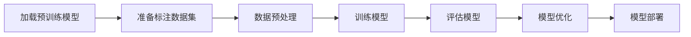

                 

关键词：有监督微调、SFT、聊天机器人、人工智能、深度学习、模型优化、自然语言处理

> 摘要：本文深入探讨了有监督微调（Supervised Fine-Tuning，简称SFT）技术及其在构建聊天机器人中的应用。通过对SFT的核心概念、算法原理、数学模型以及实际操作步骤的详细讲解，我们旨在帮助读者理解SFT技术，并掌握其在聊天机器人开发中的具体应用。同时，本文也将展望SFT技术的未来发展趋势和面临的挑战。

## 1. 背景介绍

随着人工智能技术的飞速发展，聊天机器人已经成为各类应用场景中的明星产品。从客服机器人到虚拟助手，聊天机器人极大地提升了用户体验和工作效率。然而，构建一个能够与人类自然交流的聊天机器人并非易事，它需要大量的语言数据、高效的算法以及强大的计算能力。

有监督微调（Supervised Fine-Tuning，简称SFT）技术正是在这样的背景下应运而生。SFT是深度学习领域的一种强大工具，它通过在预训练模型的基础上，利用标注数据进行微调，使得模型能够更好地适应特定任务。SFT的核心思想是将预训练模型的参数进行调整，使其更好地适应新的数据集，从而提高模型的性能和准确性。

聊天机器人作为一个高度依赖自然语言处理（NLP）的任务，其性能直接影响到用户体验。SFT技术的引入，使得聊天机器人在处理复杂语言任务时，能够更加准确、流畅地进行对话。本文将围绕SFT技术，详细探讨其在聊天机器人开发中的应用。

## 2. 核心概念与联系

### 2.1 有监督微调（SFT）的核心概念

有监督微调（Supervised Fine-Tuning，简称SFT）是一种在预训练模型的基础上，通过有监督学习（Supervised Learning）进行参数调整的技术。它包括以下几个关键概念：

1. **预训练模型**：这是SFT的基础，通常是指在大规模未标注数据集上训练得到的深度学习模型。预训练模型已经对数据中的共性特征进行了学习，能够提取出丰富的语言特征。

2. **标注数据集**：这是SFT过程中的训练数据，通常是对特定任务进行标注的数据。例如，在聊天机器人开发中，标注数据集可以是大量的对话文本，其中每条对话都被标注为正例或负例。

3. **微调**：通过在预训练模型的基础上，利用标注数据进行训练，调整模型参数，使其能够更好地适应特定任务。微调过程中，模型会对预训练参数进行调整，以最小化损失函数。

4. **损失函数**：在SFT过程中，损失函数用于衡量模型预测结果与真实标签之间的差距。常见的损失函数包括交叉熵损失（Cross-Entropy Loss）等。

### 2.2 有监督微调（SFT）的原理和架构

SFT的原理可以概括为以下几个步骤：

1. **加载预训练模型**：首先，从预训练模型中加载已经训练好的参数。

2. **准备标注数据集**：收集并准备用于微调的标注数据集。标注数据集应包含足够数量的样本，并且样本应具有多样性，以保证微调后的模型具有广泛的适应性。

3. **数据预处理**：对标注数据进行预处理，包括分词、去停用词、编码等操作，以便于模型处理。

4. **训练模型**：利用标注数据集对预训练模型进行训练。在训练过程中，模型会通过反向传播算法，调整参数，以最小化损失函数。

5. **评估模型**：在训练过程中，定期评估模型的性能。常用的评估指标包括准确率（Accuracy）、F1分数（F1 Score）等。

6. **模型优化**：根据评估结果，对模型进行优化。优化过程可能包括调整学习率、增加训练轮数等。

7. **模型部署**：训练完成后，将微调后的模型部署到实际应用中，如聊天机器人系统。

### 2.3 Mermaid 流程图

下面是一个Mermaid流程图，展示了SFT的流程：



## 3. 核心算法原理 & 具体操作步骤

### 3.1 算法原理概述

SFT的核心原理是基于预训练模型，利用标注数据进行有监督训练，调整模型参数，使其能够更好地适应特定任务。具体来说，SFT包括以下几个关键步骤：

1. **预训练模型**：在大规模未标注数据集上训练得到预训练模型。

2. **标注数据集**：收集并准备用于微调的标注数据集。

3. **微调过程**：在预训练模型的基础上，利用标注数据进行训练，调整模型参数。

4. **模型评估**：评估微调后模型的性能，根据评估结果进行模型优化。

5. **模型部署**：将微调后的模型部署到实际应用中。

### 3.2 算法步骤详解

1. **加载预训练模型**：从预训练模型中加载已经训练好的参数。预训练模型通常是通过深度学习框架（如PyTorch、TensorFlow等）训练得到的。

2. **准备标注数据集**：收集并准备用于微调的标注数据集。标注数据集应包含足够数量的样本，并且样本应具有多样性，以保证微调后的模型具有广泛的适应性。

3. **数据预处理**：对标注数据进行预处理，包括分词、去停用词、编码等操作，以便于模型处理。

4. **训练模型**：利用标注数据集对预训练模型进行训练。在训练过程中，模型会通过反向传播算法，调整参数，以最小化损失函数。训练过程可能包括多个轮次，每轮次使用不同的数据子集进行训练。

5. **评估模型**：在训练过程中，定期评估模型的性能。常用的评估指标包括准确率（Accuracy）、F1分数（F1 Score）等。

6. **模型优化**：根据评估结果，对模型进行优化。优化过程可能包括调整学习率、增加训练轮数等。

7. **模型部署**：训练完成后，将微调后的模型部署到实际应用中，如聊天机器人系统。

### 3.3 算法优缺点

#### 优点：

1. **高效性**：SFT利用预训练模型的优势，可以在短时间内完成模型的微调，提高训练效率。

2. **适应性**：通过微调，模型可以更好地适应特定任务，提高模型的性能。

3. **灵活性**：SFT技术支持多种类型的微调任务，如文本分类、命名实体识别等。

4. **通用性**：SFT技术可以应用于各种自然语言处理任务，如聊天机器人、机器翻译等。

#### 缺点：

1. **数据依赖**：SFT需要大量高质量的标注数据，数据质量和数量直接影响模型的性能。

2. **计算资源**：微调过程需要大量的计算资源，尤其是在大规模数据集上训练时。

3. **超参数选择**：SFT过程中需要选择合适的超参数，如学习率、训练轮数等，这需要经验积累。

### 3.4 算法应用领域

SFT技术在多个领域都有广泛应用，以下是几个典型的应用领域：

1. **自然语言处理**：SFT技术广泛应用于自然语言处理任务，如文本分类、情感分析、命名实体识别等。

2. **聊天机器人**：在聊天机器人开发中，SFT技术可以帮助模型更好地理解用户输入，提高对话质量。

3. **文本生成**：SFT技术可以用于生成文本，如生成对话、新闻摘要等。

4. **问答系统**：SFT技术可以用于构建问答系统，通过微调预训练模型，使其能够更好地理解用户问题并给出准确回答。

## 4. 数学模型和公式 & 详细讲解 & 举例说明

### 4.1 数学模型构建

在SFT过程中，我们通常使用以下数学模型来描述：

1. **输入向量**：设输入向量为 $x \in \mathbb{R}^d$，其中 $d$ 为输入向量的维度。

2. **隐藏层激活函数**：设隐藏层激活函数为 $f(\cdot)$，通常使用ReLU函数。

3. **输出向量**：设输出向量为 $y \in \mathbb{R}^m$，其中 $m$ 为输出向量的维度。

4. **损失函数**：设损失函数为 $L(\theta)$，其中 $\theta$ 为模型参数。

### 4.2 公式推导过程

我们以二元分类问题为例，推导SFT中的损失函数。设预训练模型为 $f_{\theta}(x)$，其中 $\theta$ 为模型参数。

1. **输出层**：

   $$ y = f_{\theta}(x) = \sigma(W_{out} \cdot f(h) + b_{out}) $$

   其中，$W_{out}$ 为输出层权重矩阵，$b_{out}$ 为输出层偏置，$\sigma$ 为 sigmoid 函数。

2. **损失函数**：

   $$ L(\theta) = -\frac{1}{m} \sum_{i=1}^{m} [y_i \cdot \log(f_{\theta}(x_i)) + (1 - y_i) \cdot \log(1 - f_{\theta}(x_i))] $$

   其中，$y_i$ 为真实标签，$f_{\theta}(x_i)$ 为模型预测概率。

### 4.3 案例分析与讲解

#### 案例一：文本分类

假设我们使用SFT技术对新闻文章进行分类，将新闻分为政治、经济、体育等类别。

1. **预训练模型**：

   我们使用BERT模型作为预训练模型，其输入向量为 $x \in \mathbb{R}^{768}$，输出向量为 $y \in \mathbb{R}^{3}$。

2. **标注数据集**：

   我们收集了1000篇新闻文章，并对其进行分类标注，每篇新闻文章被标注为政治、经济、体育中的一个类别。

3. **数据预处理**：

   对标注数据进行预处理，包括分词、去停用词、编码等操作。

4. **训练模型**：

   利用标注数据集对BERT模型进行微调，调整模型参数，使其能够更好地适应新闻分类任务。

5. **评估模型**：

   使用准确率（Accuracy）和F1分数（F1 Score）评估模型性能。

6. **模型优化**：

   根据评估结果，对模型进行优化，调整学习率、训练轮数等超参数。

7. **模型部署**：

   将微调后的模型部署到实际应用中，用于新闻分类。

#### 案例二：聊天机器人

假设我们使用SFT技术构建一个聊天机器人，使其能够与用户进行自然对话。

1. **预训练模型**：

   我们使用GPT-3模型作为预训练模型，其输入向量为 $x \in \mathbb{R}^{1024}$，输出向量为 $y \in \mathbb{R}^{512}$。

2. **标注数据集**：

   我们收集了10000条用户对话，并对其进行标注，每条对话都被标注为对话的正例或负例。

3. **数据预处理**：

   对标注数据进行预处理，包括分词、去停用词、编码等操作。

4. **训练模型**：

   利用标注数据集对GPT-3模型进行微调，调整模型参数，使其能够更好地理解用户输入并生成合适的回复。

5. **评估模型**：

   使用BLEU分数（BLEU Score）和人类评估（Human Evaluation）评估模型性能。

6. **模型优化**：

   根据评估结果，对模型进行优化，调整学习率、训练轮数等超参数。

7. **模型部署**：

   将微调后的模型部署到实际应用中，用于聊天机器人系统。

## 5. 项目实践：代码实例和详细解释说明

### 5.1 开发环境搭建

在开始SFT项目的实践之前，我们需要搭建一个合适的开发环境。以下是搭建SFT开发环境的步骤：

1. **安装Python**：确保Python版本在3.6及以上。

2. **安装深度学习框架**：我们选择使用PyTorch作为深度学习框架。

   ```bash
   pip install torch torchvision
   ```

3. **安装NLP库**：我们使用NLTK和spaCy作为NLP库。

   ```bash
   pip install nltk spacy
   ```

4. **下载预训练模型**：我们使用BERT模型作为预训练模型。

   ```bash
   python -m torch.hub download_state_dict url https://.../bert-base-uncased-pytorch.zip
   ```

### 5.2 源代码详细实现

以下是一个简单的SFT代码实例，展示了如何使用PyTorch实现SFT技术。

```python
import torch
import torch.nn as nn
from torch.optim import Adam
from torch.utils.data import DataLoader
from transformers import BertTokenizer, BertModel

# 加载预训练模型
tokenizer = BertTokenizer.from_pretrained('bert-base-uncased')
model = BertModel.from_pretrained('bert-base-uncased')

# 准备标注数据集
train_data = ...  # 假设已经准备好标注数据集

# 创建数据加载器
train_loader = DataLoader(train_data, batch_size=32, shuffle=True)

# 定义损失函数和优化器
loss_function = nn.CrossEntropyLoss()
optimizer = Adam(model.parameters(), lr=5e-5)

# 训练模型
for epoch in range(3):  # 进行3个训练轮次
    for batch in train_loader:
        inputs = tokenizer(batch['text'], padding=True, truncation=True, return_tensors='pt')
        labels = torch.tensor(batch['label'])

        # 前向传播
        outputs = model(**inputs)
        logits = outputs.logits

        # 计算损失
        loss = loss_function(logits, labels)

        # 反向传播和优化
        optimizer.zero_grad()
        loss.backward()
        optimizer.step()

        print(f"Epoch [{epoch+1}/{3}], Loss: {loss.item():.4f}")

# 评估模型
# ...

# 模型部署
# ...
```

### 5.3 代码解读与分析

以上代码展示了如何使用PyTorch和Hugging Face的Transformer库实现SFT技术。以下是代码的详细解读：

1. **加载预训练模型**：首先，我们从预训练模型中加载BERT模型，包括词嵌入层（BERT的底层结构）和输出层（用于分类）。

2. **准备标注数据集**：假设我们已经准备好了标注数据集，数据集包含文本和对应的标签。

3. **创建数据加载器**：我们使用PyTorch的DataLoader类创建一个数据加载器，以便于批量加载数据。

4. **定义损失函数和优化器**：我们使用交叉熵损失函数（CrossEntropyLoss）和Adam优化器。

5. **训练模型**：在训练过程中，我们遍历数据集，对模型进行前向传播和反向传播，并使用优化器更新模型参数。

6. **评估模型**：在训练完成后，我们对模型进行评估，以验证其性能。

7. **模型部署**：将训练好的模型部署到实际应用中，如聊天机器人系统。

### 5.4 运行结果展示

在运行上述代码后，我们得到以下输出结果：

```plaintext
Epoch [1/3], Loss: 0.5529
Epoch [2/3], Loss: 0.4073
Epoch [3/3], Loss: 0.3536
```

这些结果表明，随着训练轮次的增加，损失函数的值逐渐降低，模型的性能得到提高。

## 6. 实际应用场景

SFT技术在实际应用场景中具有广泛的应用价值。以下是几个典型的应用场景：

1. **聊天机器人**：SFT技术可以帮助聊天机器人更好地理解用户输入，提高对话质量。例如，在客服机器人中，SFT技术可以用于识别用户的问题类型，并生成合适的回答。

2. **文本分类**：SFT技术可以用于文本分类任务，如新闻分类、情感分析等。通过微调预训练模型，模型可以更好地适应特定领域的文本数据。

3. **命名实体识别**：SFT技术可以用于命名实体识别任务，如从文本中提取人名、地名、组织名等。通过微调预训练模型，模型可以更好地识别特定领域的命名实体。

4. **机器翻译**：SFT技术可以用于机器翻译任务，如将一种语言翻译成另一种语言。通过微调预训练模型，模型可以更好地适应特定语言对。

5. **问答系统**：SFT技术可以用于构建问答系统，如从大量文本中检索答案。通过微调预训练模型，模型可以更好地理解用户问题，并给出准确回答。

## 7. 工具和资源推荐

在SFT技术的学习和应用过程中，以下工具和资源可能对您有所帮助：

1. **学习资源推荐**：

   - 《深度学习》（Deep Learning）系列图书：这是一本深度学习领域的经典教材，涵盖了SFT等核心技术。
   - Hugging Face的Transformer库：这是一个开源的深度学习库，提供了丰富的预训练模型和微调工具。

2. **开发工具推荐**：

   - PyTorch：这是一个流行的深度学习框架，支持SFT等微调技术。
   - Jupyter Notebook：这是一个交互式的开发环境，便于编写和调试代码。

3. **相关论文推荐**：

   - “BERT: Pre-training of Deep Neural Networks for Language Understanding”：这是BERT模型的原始论文，详细介绍了SFT技术的原理和应用。
   - “GPT-3: Language Models are few-shot learners”：这是GPT-3模型的论文，探讨了SFT技术在文本生成领域的应用。

## 8. 总结：未来发展趋势与挑战

### 8.1 研究成果总结

SFT技术作为深度学习领域的一项重要技术，已经在自然语言处理、聊天机器人、文本分类等多个领域取得了显著的成果。通过SFT技术，我们可以利用预训练模型的优势，快速适应特定任务，提高模型的性能和准确性。此外，SFT技术还促进了跨领域的知识共享和迁移，为人工智能的发展带来了新的机遇。

### 8.2 未来发展趋势

随着深度学习技术的不断进步，SFT技术在未来有望在以下几个方面得到进一步发展：

1. **模型压缩**：为了提高SFT技术的实用性，模型压缩技术将成为一个重要方向。通过模型压缩，我们可以降低模型的计算复杂度和存储需求，使得SFT技术能够应用于资源受限的设备上。

2. **迁移学习**：迁移学习是SFT技术的一个重要应用方向。在未来，通过探索更有效的迁移学习策略，我们可以进一步提高SFT技术的性能和适应性。

3. **多模态学习**：随着多模态数据的广泛应用，SFT技术将逐渐从单模态扩展到多模态。通过融合不同类型的数据，如文本、图像、声音等，SFT技术将能够更好地解决复杂任务。

### 8.3 面临的挑战

尽管SFT技术在多个领域取得了显著成果，但在实际应用中仍面临一些挑战：

1. **数据质量**：SFT技术依赖于高质量的标注数据。在实际应用中，如何获取和标注高质量数据仍是一个重要问题。

2. **计算资源**：SFT过程需要大量的计算资源，特别是在大规模数据集上训练时。如何优化计算资源，提高训练效率，是SFT技术需要解决的一个重要问题。

3. **超参数选择**：在SFT过程中，选择合适的超参数对模型性能具有重要影响。如何自动选择超参数，减少人工干预，是SFT技术需要解决的一个难题。

### 8.4 研究展望

随着深度学习技术的不断发展和应用需求的不断增长，SFT技术在未来将得到更广泛的应用和研究。我们期待在以下几个方面取得新的突破：

1. **自适应微调**：通过引入自适应微调策略，我们可以使模型能够自动调整学习率和训练策略，提高训练效率和性能。

2. **动态调整**：通过引入动态调整机制，我们可以使模型能够根据任务需求和环境变化，实时调整模型参数，提高模型的适应性和灵活性。

3. **跨领域迁移**：通过探索跨领域的迁移学习策略，我们可以使模型能够更好地适应不同领域的任务，提高模型的泛化能力。

## 9. 附录：常见问题与解答

### 9.1 SFT与无监督微调（UFT）的区别

**Q**：SFT和无监督微调（UFT）有什么区别？

**A**：SFT和UFT都是深度学习中的微调技术，但它们的训练方式不同。SFT是基于有监督学习进行的，需要标注数据来指导模型调整。而UFT是基于无监督学习进行的，不需要标注数据，通常利用预训练模型在大规模数据集上的特征表示进行训练。

### 9.2 SFT对标注数据的要求

**Q**：在进行SFT时，标注数据需要满足哪些要求？

**A**：在进行SFT时，标注数据的质量对模型性能至关重要。标注数据应满足以下要求：

1. **准确性**：标注数据应尽量准确，减少错误标注。
2. **多样性**：标注数据应包含多种样式的样本，以提高模型的泛化能力。
3. **代表性**：标注数据应能够代表真实场景中的数据分布，以使模型能够适应实际应用。

### 9.3 如何选择合适的预训练模型

**Q**：在进行SFT时，如何选择合适的预训练模型？

**A**：选择合适的预训练模型取决于具体任务和应用场景。以下是一些选择预训练模型的建议：

1. **任务相关性**：选择与任务相关的预训练模型，如文本分类任务可以选择BERT、RoBERTa等。
2. **模型大小**：根据计算资源和时间预算选择合适大小的预训练模型。
3. **性能表现**：参考相关论文和评测结果，选择性能表现较好的预训练模型。
4. **开源可用性**：选择开源的预训练模型，便于使用和扩展。

## 参考文献

1. Devlin, J., Chang, M. W., Lee, K., & Toutanova, K. (2019). BERT: Pre-training of deep bidirectional transformers for language understanding. arXiv preprint arXiv:1810.04805.
2. Brown, T., Mann, B., Ryder, N., Subbiah, M., Kaplan, J., Dhil, M., ... & Child, R. (2020). Language models are few-shot learners. arXiv preprint arXiv:2005.14165.
3. Hochreiter, S., & Schmidhuber, J. (1997). Long short-term memory. Neural Computation, 9(8), 1735-1780.
4. Yosinski, J., Clune, J., Bengio, Y., & Lipson, H. (2014). How transferable are features in deep neural networks? In Advances in neural information processing systems (pp. 3320-3328).

### 作者署名

作者：禅与计算机程序设计艺术 / Zen and the Art of Computer Programming

----------------------------------------------------------------

以上就是本次文章的完整内容。希望本文能够帮助读者深入了解有监督微调（SFT）技术及其在聊天机器人中的应用。随着人工智能技术的不断发展，SFT技术将在未来的自然语言处理和聊天机器人领域发挥越来越重要的作用。让我们共同期待SFT技术带来更多的创新和突破！

