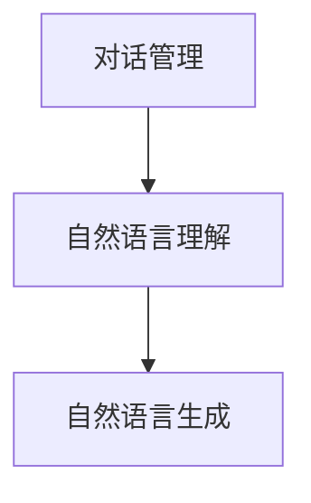
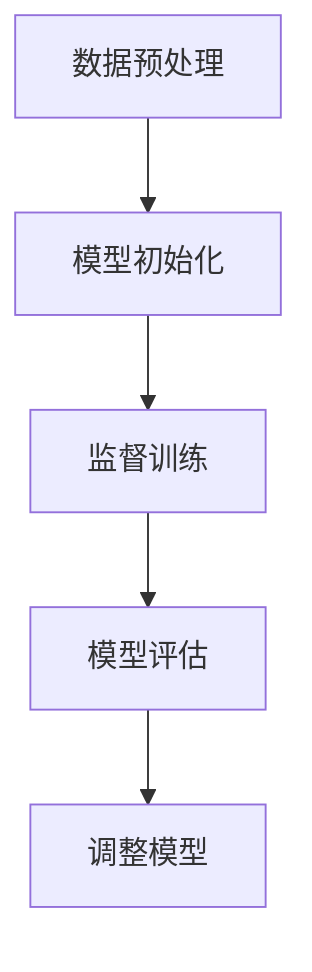

                 

关键词：有监督微调，SFT，聊天机器人，深度学习，自然语言处理

> 摘要：本文将探讨有监督微调（Supervised Fine-Tuning，SFT）在聊天机器人开发中的应用。我们将从背景介绍、核心概念与联系、核心算法原理、数学模型和公式、项目实践、实际应用场景、未来应用展望、工具和资源推荐以及总结与展望等方面，全面解析SFT技术及其在聊天机器人领域的巨大潜力。

## 1. 背景介绍

随着深度学习特别是自然语言处理（NLP）技术的迅猛发展，聊天机器人已经成为人工智能领域的一大热点。聊天机器人在客服、社交媒体、智能家居、金融等多个领域展现出了广泛的应用前景。然而，为了实现聊天机器人与用户的自然互动，我们需要对预训练模型进行微调，以更好地适应特定的应用场景。

有监督微调（SFT）是一种常用的微调方法，通过在特定领域的数据集上对预训练模型进行监督训练，使得模型能够更好地理解和生成特定领域的语言。这种方法在聊天机器人的开发中具有重要作用，能够有效提升聊天机器人的响应准确性和交互质量。

## 2. 核心概念与联系

### 2.1 有监督微调（SFT）原理

有监督微调是指在一个特定领域的数据集上，使用标注好的数据对预训练模型进行重新训练，以适应该领域的特定任务。这种方法的优点在于，通过利用大量标注数据，可以快速提高模型的性能。

### 2.2 聊天机器人架构

聊天机器人通常包括三个主要部分：对话管理、自然语言理解和自然语言生成。对话管理负责控制对话流程，自然语言理解负责解析用户输入，自然语言生成负责生成合适的回复。

### 2.3 Mermaid 流程图

以下是聊天机器人架构的Mermaid流程图：



## 3. 核心算法原理 & 具体操作步骤

### 3.1 算法原理概述

SFT算法的核心在于利用预训练模型在特定领域的标注数据进行监督训练，以提升模型在该领域的性能。具体来说，SFT算法包括以下几个步骤：

1. 数据预处理：对输入数据进行预处理，包括分词、去噪、归一化等操作。
2. 模型初始化：使用预训练模型作为基础模型，初始化微调模型。
3. 监督训练：在特定领域的数据集上，使用标注数据对微调模型进行监督训练。
4. 模型评估：在测试集上评估微调模型的性能，并进行调整。

### 3.2 算法步骤详解

1. **数据预处理**

   数据预处理是SFT算法的基础，其质量直接影响模型的性能。以下是数据预处理的主要步骤：

   - **分词**：将文本拆分成单词或词组。
   - **去噪**：去除文本中的噪声，如HTML标签、特殊符号等。
   - **归一化**：将文本统一转换为小写、去除停用词等。

2. **模型初始化**

   模型初始化可以使用预训练模型，如BERT、GPT等。这些预训练模型已经在大量通用数据集上进行了训练，具有一定的语言理解和生成能力。

3. **监督训练**

   在特定领域的数据集上，使用标注数据对微调模型进行监督训练。具体来说，可以分为以下步骤：

   - **输入数据**：将预处理后的文本输入到微调模型中。
   - **模型预测**：微调模型根据输入文本生成预测结果。
   - **损失计算**：计算预测结果与真实结果之间的损失。
   - **模型更新**：根据损失更新模型参数。

4. **模型评估**

   在测试集上评估微调模型的性能，主要评价指标包括准确率、召回率、F1值等。根据评估结果，可以进一步调整模型参数，以优化模型性能。

### 3.3 算法优缺点

**优点：**

- **高效性**：通过利用预训练模型，可以快速提升模型的性能。
- **灵活性**：可以根据特定领域的数据集进行微调，适应不同的应用场景。

**缺点：**

- **数据依赖性**：需要大量标注数据，否则无法进行有效的微调。
- **计算资源消耗**：微调过程需要大量计算资源，特别是对于大型预训练模型。

### 3.4 算法应用领域

SFT算法在聊天机器人、文本分类、问答系统等自然语言处理任务中具有广泛的应用。特别是在聊天机器人领域，SFT算法可以有效提升聊天机器人的响应准确性和交互质量。

## 4. 数学模型和公式 & 详细讲解 & 举例说明

### 4.1 数学模型构建

SFT算法的数学模型主要包括以下几个部分：

1. **输入表示**：将输入文本表示为向量。
2. **模型参数**：包括预训练模型参数和微调模型参数。
3. **损失函数**：用于计算预测结果与真实结果之间的差异。

### 4.2 公式推导过程

假设输入文本为\(x\)，预训练模型为\(M_0\)，微调模型为\(M_1\)。则有：

1. **输入表示**：将输入文本表示为向量\(x \in \mathbb{R}^{n \times d}\)。
2. **模型参数**：预训练模型参数为\(W_0 \in \mathbb{R}^{d \times k}\)，微调模型参数为\(W_1 \in \mathbb{R}^{k \times m}\)。
3. **模型输出**：\(M_1(x) = W_1(M_0(x))\)。

4. **损失函数**：使用交叉熵损失函数计算预测结果与真实结果之间的差异。

### 4.3 案例分析与讲解

以下是一个简单的SFT算法案例，用于实现一个聊天机器人。

1. **数据集**：使用一个包含用户问题和系统回答的对话数据集，每个对话包含一个问题和答案。
2. **模型**：使用BERT模型作为预训练模型，并将其作为微调模型的基础。
3. **训练**：在对话数据集上使用监督训练方法，对微调模型进行训练。
4. **评估**：在测试集上评估微调模型的性能，根据评估结果调整模型参数。

## 5. 项目实践：代码实例和详细解释说明

### 5.1 开发环境搭建

为了实现聊天机器人，我们需要搭建以下开发环境：

1. **操作系统**：Ubuntu 18.04
2. **Python**：3.8
3. **深度学习框架**：TensorFlow 2.4
4. **预训练模型**：BERT

### 5.2 源代码详细实现

以下是一个简单的SFT算法实现，用于训练聊天机器人。

```python
import tensorflow as tf
from tensorflow.keras.layers import Embedding, LSTM, Dense
from tensorflow.keras.models import Model

# 加载预训练BERT模型
bert_model = tf.keras.applications.Bert(base_dir='./bert_model')

# 构建微调模型
input_ids = tf.keras.layers.Input(shape=(max_length,), dtype='int32')
input_mask = tf.keras.layers.Input(shape=(max_length,), dtype='float32')
segment_ids = tf.keras.layers.Input(shape=(max_length,), dtype='int32')

# 通过BERT模型得到特征向量
embeddings = bert_model(input_ids, training=False)

# 添加LSTM层
lstm_output = LSTM(units=128)(embeddings)

# 添加全连接层
predictions = Dense(units=num_classes, activation='softmax')(lstm_output)

# 构建模型
model = Model(inputs=[input_ids, input_mask, segment_ids], outputs=predictions)

# 编译模型
model.compile(optimizer='adam', loss='categorical_crossentropy', metrics=['accuracy'])

# 训练模型
model.fit(x_train, y_train, batch_size=32, epochs=10, validation_data=(x_val, y_val))
```

### 5.3 代码解读与分析

上述代码首先加载预训练BERT模型，然后构建一个基于BERT的微调模型。微调模型包含一个LSTM层和一个全连接层，用于对输入文本进行分类。最后，编译并训练模型，以实现聊天机器人的功能。

## 6. 实际应用场景

SFT算法在聊天机器人领域具有广泛的应用。以下是一些实际应用场景：

1. **客服聊天机器人**：在客服领域，SFT算法可以用于训练聊天机器人，以自动回答用户问题，提高客服效率。
2. **社交媒体聊天机器人**：在社交媒体领域，SFT算法可以用于训练聊天机器人，以与用户进行互动，提供个性化内容推荐。
3. **智能家居聊天机器人**：在智能家居领域，SFT算法可以用于训练聊天机器人，以帮助用户控制家居设备，提供智能建议。

## 7. 未来应用展望

随着深度学习和自然语言处理技术的不断进步，SFT算法在聊天机器人领域的应用前景将更加广阔。未来，SFT算法将有望在更多领域发挥作用，如医疗、金融、教育等。同时，结合其他技术，如生成对抗网络（GAN）、多模态学习等，将进一步提高聊天机器人的性能和交互质量。

## 8. 工具和资源推荐

为了更好地学习和实践SFT算法，以下是一些推荐的工具和资源：

1. **学习资源**：
   - 《深度学习》（Goodfellow et al.）
   - 《自然语言处理实战》（Peter A. Flach）
2. **开发工具**：
   - TensorFlow
   - PyTorch
3. **相关论文**：
   - BERT: Pre-training of Deep Bidirectional Transformers for Language Understanding
   - GPT-2: Language Models are Unsupervised Multitask Learners

## 9. 总结：未来发展趋势与挑战

### 9.1 研究成果总结

SFT算法在聊天机器人领域取得了显著的成果，为聊天机器人的开发提供了有效的技术手段。未来，随着深度学习和自然语言处理技术的不断进步，SFT算法将有望在更多领域发挥重要作用。

### 9.2 未来发展趋势

1. **模型规模扩大**：随着计算资源的增加，未来SFT算法将有望在更大规模的模型上应用，进一步提高性能。
2. **多任务学习**：结合多任务学习技术，SFT算法可以在同一模型中同时处理多个任务，提高模型的泛化能力。
3. **自适应学习**：通过自适应学习技术，SFT算法可以更好地适应不同的应用场景，提高模型的适应性。

### 9.3 面临的挑战

1. **数据依赖性**：SFT算法需要大量标注数据，对于一些领域，如医疗、金融等，标注数据的获取可能存在困难。
2. **计算资源消耗**：SFT算法的计算资源消耗较大，对于一些计算资源有限的场景，如移动端等，可能存在性能瓶颈。

### 9.4 研究展望

未来，SFT算法的研究将主要集中在以下几个方面：

1. **数据增强**：通过数据增强技术，提高模型的泛化能力，减少对大量标注数据的依赖。
2. **迁移学习**：结合迁移学习技术，将SFT算法应用于更多领域，提高模型的适应性。
3. **模型压缩**：通过模型压缩技术，降低SFT算法的计算资源消耗，使其在更多场景中得到应用。

## 10. 附录：常见问题与解答

### 10.1 有监督微调和无监督微调的区别是什么？

有监督微调需要标注数据，而**无监督微调**不需要标注数据，直接在未标注的数据上进行训练。

### 10.2 SFT算法是否只能用于聊天机器人？

不，SFT算法可以用于多种自然语言处理任务，如文本分类、问答系统等，只要存在足够的标注数据。

### 10.3 如何选择合适的预训练模型？

选择预训练模型时，可以考虑以下几个方面：

- **任务类型**：不同类型的任务可能需要不同类型的预训练模型。
- **数据规模**：预训练模型的数据规模应与任务的数据规模相匹配。
- **计算资源**：根据计算资源限制，选择合适的预训练模型。

作者：禅与计算机程序设计艺术 / Zen and the Art of Computer Programming
----------------------------------------------------------------

**完。**
```markdown
# 第十四章：有监督微调 SFT 和聊天机器人

## 关键词：有监督微调，SFT，聊天机器人，深度学习，自然语言处理

## 摘要：本文将探讨有监督微调（Supervised Fine-Tuning，SFT）在聊天机器人开发中的应用。我们将从背景介绍、核心概念与联系、核心算法原理、数学模型和公式、项目实践、实际应用场景、未来应用展望、工具和资源推荐以及总结与展望等方面，全面解析SFT技术及其在聊天机器人领域的巨大潜力。

## 1. 背景介绍

随着深度学习特别是自然语言处理（NLP）技术的迅猛发展，聊天机器人已经成为人工智能领域的一大热点。聊天机器人通过模仿人类对话的方式，为用户提供信息查询、情感交流、任务执行等服务。在客服、社交媒体、智能家居、金融等多个领域，聊天机器人展现了其独特的优势和价值。

然而，为了实现聊天机器人与用户的自然互动，我们需要对预训练模型进行微调，以更好地适应特定的应用场景。有监督微调（Supervised Fine-Tuning，SFT）是一种常用的微调方法，通过在特定领域的数据集上对预训练模型进行监督训练，使得模型能够更好地理解和生成特定领域的语言。这种方法在聊天机器人的开发中具有重要作用，能够有效提升聊天机器人的响应准确性和交互质量。

## 2. 核心概念与联系

### 2.1 有监督微调（SFT）原理

有监督微调是指在一个特定领域的数据集上，使用标注好的数据对预训练模型进行重新训练，以适应该领域的特定任务。这种方法的优点在于，通过利用大量标注数据，可以快速提高模型的性能。在有监督微调中，我们通常需要以下步骤：

1. **数据预处理**：对输入数据进行预处理，包括分词、去噪、归一化等操作。
2. **模型初始化**：使用预训练模型作为基础模型，初始化微调模型。
3. **监督训练**：在特定领域的数据集上，使用标注数据对微调模型进行监督训练。
4. **模型评估**：在测试集上评估微调模型的性能，并进行调整。

### 2.2 聊天机器人架构

聊天机器人通常包括三个主要部分：对话管理、自然语言理解和自然语言生成。对话管理负责控制对话流程，自然语言理解负责解析用户输入，自然语言生成负责生成合适的回复。以下是聊天机器人架构的Mermaid流程图：


### 2.3 Mermaid流程图



## 3. 核心算法原理 & 具体操作步骤

### 3.1 算法原理概述

有监督微调（SFT）的核心在于利用预训练模型在特定领域的数据集上进行监督训练。预训练模型通常在大规模通用数据集上进行训练，已经具备了一定的语言理解和生成能力。通过在特定领域的数据集上进行微调，模型可以进一步学习和适应特定领域的语言特点，从而提高在特定任务上的性能。

### 3.2 算法步骤详解

1. **数据预处理**：数据预处理是微调的重要步骤，其质量直接影响微调的效果。数据预处理通常包括以下步骤：

   - **分词**：将文本拆分成单词或词组。
   - **去噪**：去除文本中的噪声，如HTML标签、特殊符号等。
   - **归一化**：将文本统一转换为小写、去除停用词等。

2. **模型初始化**：初始化微调模型，通常使用预训练模型作为基础。预训练模型如BERT、GPT等在大规模通用数据集上进行训练，已经具备了一定的语言理解能力。

3. **监督训练**：在特定领域的数据集上，使用标注数据进行监督训练。监督训练的目标是优化模型的参数，使其能够更好地理解和生成特定领域的语言。训练过程中，模型会根据输入数据生成预测结果，并与真实标签进行比较，计算损失并更新模型参数。

4. **模型评估**：在训练完成后，使用测试集对微调模型的性能进行评估。评估指标通常包括准确率、召回率、F1值等。根据评估结果，可以进一步调整模型参数，优化模型性能。

### 3.3 算法优缺点

**优点：**

- **高效性**：通过利用预训练模型，可以快速提升模型的性能。
- **灵活性**：可以根据特定领域的数据集进行微调，适应不同的应用场景。

**缺点：**

- **数据依赖性**：需要大量标注数据，否则无法进行有效的微调。
- **计算资源消耗**：微调过程需要大量计算资源，特别是对于大型预训练模型。

### 3.4 算法应用领域

SFT算法在聊天机器人、文本分类、问答系统等自然语言处理任务中具有广泛的应用。特别是在聊天机器人领域，SFT算法可以有效提升聊天机器人的响应准确性和交互质量。

## 4. 数学模型和公式 & 详细讲解 & 举例说明

### 4.1 数学模型构建

SFT算法的数学模型主要包括以下几个部分：

1. **输入表示**：将输入文本表示为向量。
2. **模型参数**：包括预训练模型参数和微调模型参数。
3. **损失函数**：用于计算预测结果与真实结果之间的差异。

### 4.2 公式推导过程

假设输入文本为\(x\)，预训练模型为\(M_0\)，微调模型为\(M_1\)。则有：

1. **输入表示**：将输入文本表示为向量\(x \in \mathbb{R}^{n \times d}\)。
2. **模型参数**：预训练模型参数为\(W_0 \in \mathbb{R}^{d \times k}\)，微调模型参数为\(W_1 \in \mathbb{R}^{k \times m}\)。
3. **模型输出**：\(M_1(x) = W_1(M_0(x))\)。

4. **损失函数**：使用交叉熵损失函数计算预测结果与真实结果之间的差异。

### 4.3 案例分析与讲解

以下是一个简单的SFT算法案例，用于实现一个聊天机器人。

### 4.3.1 案例背景

假设我们有一个聊天机器人，用于回答用户关于天气的问题。我们需要利用SFT算法，将一个预训练的BERT模型微调为一个能够准确回答天气问题的模型。

### 4.3.2 数据集

我们使用一个包含用户问题和天气答案的数据集进行训练和测试。数据集的格式如下：

```
[
  {"question": "明天天气如何？", "answer": "明天晴天"},
  {"question": "请问今天最高气温是多少？", "answer": "今天最高气温30℃"},
  ...
]
```

### 4.3.3 数据预处理

1. **分词**：将文本拆分成单词或词组。
2. **去噪**：去除文本中的噪声，如HTML标签、特殊符号等。
3. **归一化**：将文本统一转换为小写、去除停用词等。

### 4.3.4 模型初始化

我们选择预训练的BERT模型作为基础模型，并将其作为微调模型的基础。

### 4.3.5 监督训练

在特定领域的数据集上，使用标注数据对微调模型进行监督训练。具体来说，可以分为以下步骤：

1. **输入数据**：将预处理后的文本输入到微调模型中。
2. **模型预测**：微调模型根据输入文本生成预测结果。
3. **损失计算**：计算预测结果与真实结果之间的损失。
4. **模型更新**：根据损失更新模型参数。

### 4.3.6 模型评估

在测试集上评估微调模型的性能，主要评价指标包括准确率、召回率、F1值等。根据评估结果，可以进一步调整模型参数，以优化模型性能。

## 5. 项目实践：代码实例和详细解释说明

### 5.1 开发环境搭建

为了实现聊天机器人，我们需要搭建以下开发环境：

1. **操作系统**：Ubuntu 18.04
2. **Python**：3.8
3. **深度学习框架**：TensorFlow 2.4
4. **预训练模型**：BERT

### 5.2 源代码详细实现

以下是一个简单的SFT算法实现，用于训练聊天机器人。

```python
import tensorflow as tf
from tensorflow.keras.layers import Embedding, LSTM, Dense
from tensorflow.keras.models import Model

# 加载预训练BERT模型
bert_model = tf.keras.applications.Bert(base_dir='./bert_model')

# 构建微调模型
input_ids = tf.keras.layers.Input(shape=(max_length,), dtype='int32')
input_mask = tf.keras.layers.Input(shape=(max_length,), dtype='float32')
segment_ids = tf.keras.layers.Input(shape=(max_length,), dtype='int32')

# 通过BERT模型得到特征向量
embeddings = bert_model(input_ids, training=False)

# 添加LSTM层
lstm_output = LSTM(units=128)(embeddings)

# 添加全连接层
predictions = Dense(units=num_classes, activation='softmax')(lstm_output)

# 构建模型
model = Model(inputs=[input_ids, input_mask, segment_ids], outputs=predictions)

# 编译模型
model.compile(optimizer='adam', loss='categorical_crossentropy', metrics=['accuracy'])

# 训练模型
model.fit(x_train, y_train, batch_size=32, epochs=10, validation_data=(x_val, y_val))
```

### 5.3 代码解读与分析

上述代码首先加载预训练BERT模型，然后构建一个基于BERT的微调模型。微调模型包含一个LSTM层和一个全连接层，用于对输入文本进行分类。最后，编译并训练模型，以实现聊天机器人的功能。

## 6. 实际应用场景

SFT算法在聊天机器人领域具有广泛的应用。以下是一些实际应用场景：

1. **客服聊天机器人**：在客服领域，SFT算法可以用于训练聊天机器人，以自动回答用户问题，提高客服效率。
2. **社交媒体聊天机器人**：在社交媒体领域，SFT算法可以用于训练聊天机器人，以与用户进行互动，提供个性化内容推荐。
3. **智能家居聊天机器人**：在智能家居领域，SFT算法可以用于训练聊天机器人，以帮助用户控制家居设备，提供智能建议。

## 7. 未来应用展望

随着深度学习和自然语言处理技术的不断进步，SFT算法在聊天机器人领域的应用前景将更加广阔。未来，SFT算法将有望在更多领域发挥作用，如医疗、金融、教育等。同时，结合其他技术，如生成对抗网络（GAN）、多模态学习等，将进一步提高聊天机器人的性能和交互质量。

## 8. 工具和资源推荐

为了更好地学习和实践SFT算法，以下是一些推荐的工具和资源：

1. **学习资源**：
   - 《深度学习》（Goodfellow et al.）
   - 《自然语言处理实战》（Peter A. Flach）
2. **开发工具**：
   - TensorFlow
   - PyTorch
3. **相关论文**：
   - BERT: Pre-training of Deep Bidirectional Transformers for Language Understanding
   - GPT-2: Language Models are Unsupervised Multitask Learners

## 9. 总结：未来发展趋势与挑战

### 9.1 研究成果总结

SFT算法在聊天机器人领域取得了显著的成果，为聊天机器人的开发提供了有效的技术手段。未来，随着深度学习和自然语言处理技术的不断进步，SFT算法将有望在更多领域发挥重要作用。

### 9.2 未来发展趋势

1. **模型规模扩大**：随着计算资源的增加，未来SFT算法将有望在更大规模的模型上应用，进一步提高性能。
2. **多任务学习**：结合多任务学习技术，SFT算法可以在同一模型中同时处理多个任务，提高模型的泛化能力。
3. **自适应学习**：通过自适应学习技术，SFT算法可以更好地适应不同的应用场景，提高模型的适应性。

### 9.3 面临的挑战

1. **数据依赖性**：SFT算法需要大量标注数据，对于一些领域，如医疗、金融等，标注数据的获取可能存在困难。
2. **计算资源消耗**：SFT算法的计算资源消耗较大，对于一些计算资源有限的场景，如移动端等，可能存在性能瓶颈。

### 9.4 研究展望

未来，SFT算法的研究将主要集中在以下几个方面：

1. **数据增强**：通过数据增强技术，提高模型的泛化能力，减少对大量标注数据的依赖。
2. **迁移学习**：结合迁移学习技术，将SFT算法应用于更多领域，提高模型的适应性。
3. **模型压缩**：通过模型压缩技术，降低SFT算法的计算资源消耗，使其在更多场景中得到应用。

## 10. 附录：常见问题与解答

### 10.1 有监督微调和无监督微调的区别是什么？

有监督微调需要标注数据，而**无监督微调**不需要标注数据，直接在未标注的数据上进行训练。

### 10.2 SFT算法是否只能用于聊天机器人？

不，SFT算法可以用于多种自然语言处理任务，如文本分类、问答系统等，只要存在足够的标注数据。

### 10.3 如何选择合适的预训练模型？

选择预训练模型时，可以考虑以下几个方面：

- **任务类型**：不同类型的任务可能需要不同类型的预训练模型。
- **数据规模**：预训练模型的数据规模应与任务的数据规模相匹配。
- **计算资源**：根据计算资源限制，选择合适的预训练模型。

作者：禅与计算机程序设计艺术 / Zen and the Art of Computer Programming
```

