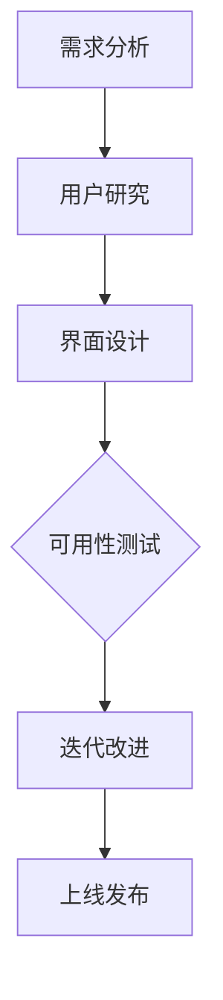

                 

人机交互界面设计是计算机科学和软件工程中至关重要的一环。一个优秀的界面设计不仅能够提升用户体验，还能极大地提高软件的可访问性和可用性。在这篇文章中，我们将深入探讨人机交互界面设计的核心概念、原则、技术，以及其实际应用和未来发展。本文分为以下几个部分：

## 1. 背景介绍

人机交互界面设计（Human-Computer Interaction, HCI）是研究人类如何与计算机系统进行交互的一门学科。随着计算机技术的不断进步，用户对软件的交互体验有了更高的要求。一个直观、易用、高效的界面设计成为软件成功的关键因素。本文旨在介绍人机交互界面设计的基本原则和方法，帮助读者理解其重要性，并掌握相关设计技巧。

## 2. 核心概念与联系

### 2.1 核心概念

- **用户界面（User Interface, UI）**：用户与系统进行交互的界面，包括视觉元素、控制元素和交互元素。
- **用户体验（User Experience, UX）**：用户在使用软件过程中的整体感受，包括情感、认知和行为。
- **可用性（Usability）**：软件满足用户需求和期望的能力，包括易用性、效率和用户满意度。
- **可访问性（Accessibility）**：软件能够被不同类型的用户（包括残疾人）使用的能力。

### 2.2 联系

这些核心概念相互关联，共同影响人机交互界面设计的成功。UI 设计关注视觉和交互元素的设计，UX 设计则从用户的角度出发，考虑整个交互过程，而可用性和可访问性则确保软件能够满足广泛用户群体的需求。

### 2.3 Mermaid 流程图

下面是使用 Mermaid 语言表示的人机交互界面设计流程图：



## 3. 核心算法原理 & 具体操作步骤

### 3.1 算法原理概述

人机交互界面设计依赖于以下几项核心原理：

- **一致性（Consistency）**：界面元素应遵循一致的交互规则和视觉风格。
- **反馈（Feedback）**：系统应提供即时和清晰的反馈，使用户了解其操作结果。
- **发现性（Discoverability）**：用户应能够发现并理解界面上的功能。
- **最小干扰（Least Surprising）**：界面设计应避免造成用户意外，符合用户预期。

### 3.2 算法步骤详解

#### 3.2.1 需求分析

- **用户调研**：通过访谈、问卷调查、用户观察等方法了解用户需求。
- **功能分析**：确定软件的核心功能，为后续设计提供基础。

#### 3.2.2 界面设计

- **信息架构**：设计界面的结构，确保信息的逻辑和组织性。
- **原型设计**：制作低保真或高保真原型，验证设计思路。
- **视觉设计**：设计界面的颜色、字体、图标等视觉元素。

#### 3.2.3 可用性测试

- **用户测试**：邀请用户参与测试，观察其与界面的交互过程。
- **数据收集**：记录用户的操作行为和反馈，分析可用性问题。

#### 3.2.4 迭代改进

- **反馈分析**：根据测试结果调整界面设计。
- **反复迭代**：多次迭代，不断优化界面设计。

### 3.3 算法优缺点

#### 优点

- **提升用户体验**：通过优化界面设计，提高用户的满意度和使用效率。
- **增加软件可用性**：确保软件能够被更广泛的用户群体使用。

#### 缺点

- **设计成本高**：需要投入大量时间和资源进行用户研究和测试。
- **易受用户偏见影响**：界面设计可能受到个人偏见和主观判断的影响。

### 3.4 算法应用领域

人机交互界面设计广泛应用于各种软件和平台，包括：

- **操作系统**：如 Windows、macOS、Linux。
- **Web 应用**：如电子商务网站、社交媒体平台。
- **移动应用**：如手机游戏、健康监测应用。
- **智能家居设备**：如智能音箱、智能门锁。

## 4. 数学模型和公式 & 详细讲解 & 举例说明

### 4.1 数学模型构建

人机交互界面设计中的数学模型主要用于描述用户行为和界面性能之间的关系。以下是几个常用的数学模型：

#### 4.1.1 认知负荷模型（Cognitive Load Theory）

认知负荷模型由 John Sweller 提出，用于描述用户在学习和使用软件时的认知负荷。模型分为三种：

- **外在认知负荷**：由外部环境引起，如界面复杂度。
- **内在认知负荷**：由任务本身引起，如问题解决。
- **管理认知负荷**：由认知策略和记忆负荷引起。

#### 4.1.2 期望违反模型（Expectation Violation Theory）

期望违反模型由 Donald Norman 提出，用于解释用户对界面设计的感受。模型分为：

- **正面期望违反**：当界面设计满足用户预期时，产生愉悦感。
- **负面期望违反**：当界面设计违反用户预期时，产生不快感。

### 4.2 公式推导过程

#### 4.2.1 认知负荷模型推导

认知负荷 \( L \) 由外在认知负荷 \( L_o \) 和内在认知负荷 \( L_i \) 组成：

\[ L = L_o + L_i \]

其中，外在认知负荷 \( L_o \) 可以表示为：

\[ L_o = f(C, D) \]

其中，\( C \) 是界面复杂度，\( D \) 是任务难度。内在认知负荷 \( L_i \) 可以表示为：

\[ L_i = f(T, M) \]

其中，\( T \) 是任务类型，\( M \) 是记忆负荷。

#### 4.2.2 期望违反模型推导

期望违反 \( V \) 可以表示为：

\[ V = \frac{E - R}{E} \]

其中，\( E \) 是用户期望，\( R \) 是实际结果。

### 4.3 案例分析与讲解

#### 4.3.1 认知负荷模型案例分析

假设我们设计一个电子表格软件，用户需要执行一系列复杂计算。为了降低外在认知负荷，我们可以：

- **简化界面**：减少不必要的功能按钮和选项。
- **提供帮助文档**：为用户提供详细的操作指南。

#### 4.3.2 期望违反模型案例分析

假设用户期望在一个社交媒体平台上找到好友，但实际结果却显示找不到。为了降低期望违反，我们可以：

- **提供搜索提示**：当用户输入关键字时，提供相关的搜索结果。
- **增加反馈**：在搜索失败时，提供清晰的错误信息和解决方案。

## 5. 项目实践：代码实例和详细解释说明

### 5.1 开发环境搭建

在本项目中，我们使用以下开发环境和工具：

- **编程语言**：Python
- **框架**：Flask
- **前端框架**：Bootstrap

### 5.2 源代码详细实现

以下是项目的核心代码实现：

```python
from flask import Flask, render_template, request
app = Flask(__name__)

@app.route('/', methods=['GET', 'POST'])
def index():
    if request.method == 'POST':
        user_input = request.form['user_input']
        # 处理用户输入，进行搜索等操作
        return render_template('result.html', result=user_input)
    return render_template('index.html')

if __name__ == '__main__':
    app.run(debug=True)
```

### 5.3 代码解读与分析

- **路由设置**：使用 Flask 的 `@app.route` 装饰器设置路由。
- **表单提交**：使用 `request.form` 获取用户输入。
- **模板渲染**：使用 `render_template` 函数渲染页面。

### 5.4 运行结果展示

- **首页**：显示一个搜索框，用户可以输入关键字。
- **搜索结果页**：显示用户输入的关键字和搜索结果。

## 6. 实际应用场景

### 6.1 Web 应用

Web 应用是人机交互界面设计的主要领域之一，如电子商务网站、社交媒体平台、在线教育平台等。这些应用需要提供直观、易用的界面，以满足用户快速浏览、搜索、购买等需求。

### 6.2 移动应用

移动应用是人机交互界面设计的另一大领域，如手机游戏、健康监测应用、智能家居控制应用等。移动设备的屏幕尺寸和输入方式与桌面端不同，因此需要特别关注界面的设计，以提升用户体验。

### 6.3 智能家居设备

智能家居设备，如智能音箱、智能门锁等，也采用了人机交互界面设计。这些设备通常通过触摸屏、语音交互等方式与用户进行交互，需要提供直观、易用的界面设计。

## 7. 工具和资源推荐

### 7.1 学习资源推荐

- **书籍**：《交互设计精髓》、《用户体验要素》
- **在线课程**：Coursera 上的《用户体验设计》、《人机交互》

### 7.2 开发工具推荐

- **设计工具**：Sketch、Adobe XD、Figma
- **前端框架**：React、Vue、Angular

### 7.3 相关论文推荐

- **HCI 标准文献**：《人类-计算机交互标准指南》
- **用户体验研究论文**：《用户行为分析》、《情感化设计》

## 8. 总结：未来发展趋势与挑战

### 8.1 研究成果总结

近年来，人机交互界面设计领域取得了显著进展，包括：

- **自适应界面设计**：根据用户行为和偏好动态调整界面。
- **多模态交互**：结合语音、手势、触摸等多种交互方式。

### 8.2 未来发展趋势

未来，人机交互界面设计将继续朝着以下方向发展：

- **智能化**：借助人工智能技术，实现更智能的界面设计。
- **个性化**：根据用户行为和偏好提供个性化的交互体验。

### 8.3 面临的挑战

人机交互界面设计仍面临以下挑战：

- **用户多样性**：如何满足不同用户群体的需求。
- **技术更新**：如何应对技术快速更新的挑战。

### 8.4 研究展望

未来，人机交互界面设计研究将重点关注：

- **跨领域应用**：如何将人机交互界面设计应用于更多领域。
- **人机协同**：如何实现人与机器的协同工作。

## 9. 附录：常见问题与解答

### 9.1 人机交互界面设计的核心原则是什么？

- **一致性**：界面元素应遵循一致的交互规则和视觉风格。
- **反馈**：系统应提供即时和清晰的反馈。
- **发现性**：用户应能够发现并理解界面上的功能。
- **最小干扰**：界面设计应避免造成用户意外。

### 9.2 如何评估人机交互界面设计的可用性？

- **用户测试**：邀请用户参与测试，观察其与界面的交互过程。
- **数据分析**：记录用户的操作行为和反馈，分析可用性问题。
- **问卷调查**：收集用户对界面设计的满意度评价。

---

人机交互界面设计是计算机科学和软件工程中不可或缺的一环。一个优秀的界面设计能够提升用户体验，增加软件的可用性和可访问性。本文详细介绍了人机交互界面设计的基本原则、算法原理、数学模型、项目实践以及实际应用场景。希望本文能为读者提供有价值的参考和启示。

作者：禅与计算机程序设计艺术 / Zen and the Art of Computer Programming
```markdown
[Markdown格式代码示例]

# 第十章：人机交互界面设计

> 关键词：人机交互，界面设计，用户体验，可用性，交互流程

> 摘要：本文深入探讨了人机交互界面设计的核心概念、原则、技术，以及其实际应用和未来发展。通过详细的案例分析、数学模型和项目实践，阐述了界面设计的原理和实施步骤，为读者提供了全面的技术指南。

## 1. 背景介绍

人机交互界面设计（Human-Computer Interaction, HCI）是计算机科学和软件工程中至关重要的一环。随着计算机技术的不断进步，用户对软件的交互体验有了更高的要求。一个直观、易用、高效的界面设计成为软件成功的关键因素。本文旨在介绍人机交互界面设计的基本原则和方法，帮助读者理解其重要性，并掌握相关设计技巧。

### 1.1 人机交互的发展历程

- **早期界面**：从命令行界面到图形用户界面（GUI）
- **移动设备**：触摸屏、手势操作
- **多模态交互**：语音、手势、触摸等多种交互方式的融合

### 1.2 人机交互界面设计的重要性

- **提升用户体验**：良好的界面设计能够提高用户的满意度和使用效率。
- **增加软件可用性**：确保软件能够被更广泛的用户群体使用。
- **降低开发成本**：优化设计流程，减少后期修改和用户反馈的代价。

## 2. 核心概念与联系

### 2.1 核心概念

- **用户界面（User Interface, UI）**：用户与系统进行交互的界面，包括视觉元素、控制元素和交互元素。
- **用户体验（User Experience, UX）**：用户在使用软件过程中的整体感受，包括情感、认知和行为。
- **可用性（Usability）**：软件满足用户需求和期望的能力，包括易用性、效率和用户满意度。
- **可访问性（Accessibility）**：软件能够被不同类型的用户（包括残疾人）使用的能力。

### 2.2 联系

这些核心概念相互关联，共同影响人机交互界面设计的成功。UI 设计关注视觉和交互元素的设计，UX 设计则从用户的角度出发，考虑整个交互过程，而可用性和可访问性则确保软件能够满足广泛用户群体的需求。

### 2.3 Mermaid 流程图

下面是使用 Mermaid 语言表示的人机交互界面设计流程图：


## 3. 核心算法原理 & 具体操作步骤

### 3.1 算法原理概述

人机交互界面设计依赖于以下几项核心原理：

- **一致性（Consistency）**：界面元素应遵循一致的交互规则和视觉风格。
- **反馈（Feedback）**：系统应提供即时和清晰的反馈，使用户了解其操作结果。
- **发现性（Discoverability）**：用户应能够发现并理解界面上的功能。
- **最小干扰（Least Surprising）**：界面设计应避免造成用户意外，符合用户预期。

### 3.2 算法步骤详解

#### 3.2.1 需求分析

- **用户调研**：通过访谈、问卷调查、用户观察等方法了解用户需求。
- **功能分析**：确定软件的核心功能，为后续设计提供基础。

#### 3.2.2 界面设计

- **信息架构**：设计界面的结构，确保信息的逻辑和组织性。
- **原型设计**：制作低保真或高保真原型，验证设计思路。
- **视觉设计**：设计界面的颜色、字体、图标等视觉元素。

#### 3.2.3 可用性测试

- **用户测试**：邀请用户参与测试，观察其与界面的交互过程。
- **数据收集**：记录用户的操作行为和反馈，分析可用性问题。

#### 3.2.4 迭代改进

- **反馈分析**：根据测试结果调整界面设计。
- **反复迭代**：多次迭代，不断优化界面设计。

### 3.3 算法优缺点

#### 优点

- **提升用户体验**：通过优化界面设计，提高用户的满意度和使用效率。
- **增加软件可用性**：确保软件能够被更广泛的用户群体使用。

#### 缺点

- **设计成本高**：需要投入大量时间和资源进行用户研究和测试。
- **易受用户偏见影响**：界面设计可能受到个人偏见和主观判断的影响。

### 3.4 算法应用领域

人机交互界面设计广泛应用于各种软件和平台，包括：

- **操作系统**：如 Windows、macOS、Linux。
- **Web 应用**：如电子商务网站、社交媒体平台。
- **移动应用**：如手机游戏、健康监测应用。
- **智能家居设备**：如智能音箱、智能门锁。

## 4. 数学模型和公式 & 详细讲解 & 举例说明

### 4.1 数学模型构建

人机交互界面设计中的数学模型主要用于描述用户行为和界面性能之间的关系。以下是几个常用的数学模型：

#### 4.1.1 认知负荷模型（Cognitive Load Theory）

认知负荷模型由 John Sweller 提出，用于描述用户在学习和使用软件时的认知负荷。模型分为三种：

- **外在认知负荷**：由外部环境引起，如界面复杂度。
- **内在认知负荷**：由任务本身引起，如问题解决。
- **管理认知负荷**：由认知策略和记忆负荷引起。

#### 4.1.2 期望违反模型（Expectation Violation Theory）

期望违反模型由 Donald Norman 提出，用于解释用户对界面设计的感受。模型分为：

- **正面期望违反**：当界面设计满足用户预期时，产生愉悦感。
- **负面期望违反**：当界面设计违反用户预期时，产生不快感。

### 4.2 公式推导过程

#### 4.2.1 认知负荷模型推导

认知负荷 \( L \) 由外在认知负荷 \( L_o \) 和内在认知负荷 \( L_i \) 组成：

\[ L = L_o + L_i \]

其中，外在认知负荷 \( L_o \) 可以表示为：

\[ L_o = f(C, D) \]

其中，\( C \) 是界面复杂度，\( D \) 是任务难度。内在认知负荷 \( L_i \) 可以表示为：

\[ L_i = f(T, M) \]

其中，\( T \) 是任务类型，\( M \) 是记忆负荷。

#### 4.2.2 期望违反模型推导

期望违反 \( V \) 可以表示为：

\[ V = \frac{E - R}{E} \]

其中，\( E \) 是用户期望，\( R \) 是实际结果。

### 4.3 案例分析与讲解

#### 4.3.1 认知负荷模型案例分析

假设我们设计一个电子表格软件，用户需要执行一系列复杂计算。为了降低外在认知负荷，我们可以：

- **简化界面**：减少不必要的功能按钮和选项。
- **提供帮助文档**：为用户提供详细的操作指南。

#### 4.3.2 期望违反模型案例分析

假设用户期望在一个社交媒体平台上找到好友，但实际结果却显示找不到。为了降低期望违反，我们可以：

- **提供搜索提示**：当用户输入关键字时，提供相关的搜索结果。
- **增加反馈**：在搜索失败时，提供清晰的错误信息和解决方案。

## 5. 项目实践：代码实例和详细解释说明

### 5.1 开发环境搭建

在本项目中，我们使用以下开发环境和工具：

- **编程语言**：Python
- **框架**：Flask
- **前端框架**：Bootstrap

### 5.2 源代码详细实现

以下是项目的核心代码实现：

```python
from flask import Flask, render_template, request
app = Flask(__name__)

@app.route('/', methods=['GET', 'POST'])
def index():
    if request.method == 'POST':
        user_input = request.form['user_input']
        # 处理用户输入，进行搜索等操作
        return render_template('result.html', result=user_input)
    return render_template('index.html')

if __name__ == '__main__':
    app.run(debug=True)
```

### 5.3 代码解读与分析

- **路由设置**：使用 Flask 的 `@app.route` 装饰器设置路由。
- **表单提交**：使用 `request.form` 获取用户输入。
- **模板渲染**：使用 `render_template` 函数渲染页面。

### 5.4 运行结果展示

- **首页**：显示一个搜索框，用户可以输入关键字。
- **搜索结果页**：显示用户输入的关键字和搜索结果。

## 6. 实际应用场景

### 6.1 Web 应用

Web 应用是人机交互界面设计的主要领域之一，如电子商务网站、社交媒体平台、在线教育平台等。这些应用需要提供直观、易用的界面，以满足用户快速浏览、搜索、购买等需求。

### 6.2 移动应用

移动应用是人机交互界面设计的另一大领域，如手机游戏、健康监测应用、智能家居控制应用等。移动设备的屏幕尺寸和输入方式与桌面端不同，因此需要特别关注界面的设计，以提升用户体验。

### 6.3 智能家居设备

智能家居设备，如智能音箱、智能门锁等，也采用了人机交互界面设计。这些设备通常通过触摸屏、语音交互等方式与用户进行交互，需要提供直观、易用的界面设计。

## 7. 工具和资源推荐

### 7.1 学习资源推荐

- **书籍**：《交互设计精髓》、《用户体验要素》
- **在线课程**：Coursera 上的《用户体验设计》、《人机交互》

### 7.2 开发工具推荐

- **设计工具**：Sketch、Adobe XD、Figma
- **前端框架**：React、Vue、Angular

### 7.3 相关论文推荐

- **HCI 标准文献**：《人类-计算机交互标准指南》
- **用户体验研究论文**：《用户行为分析》、《情感化设计》

## 8. 总结：未来发展趋势与挑战

### 8.1 研究成果总结

近年来，人机交互界面设计领域取得了显著进展，包括：

- **自适应界面设计**：根据用户行为和偏好动态调整界面。
- **多模态交互**：结合语音、手势、触摸等多种交互方式。

### 8.2 未来发展趋势

未来，人机交互界面设计将继续朝着以下方向发展：

- **智能化**：借助人工智能技术，实现更智能的界面设计。
- **个性化**：根据用户行为和偏好提供个性化的交互体验。

### 8.3 面临的挑战

人机交互界面设计仍面临以下挑战：

- **用户多样性**：如何满足不同用户群体的需求。
- **技术更新**：如何应对技术快速更新的挑战。

### 8.4 研究展望

未来，人机交互界面设计研究将重点关注：

- **跨领域应用**：如何将人机交互界面设计应用于更多领域。
- **人机协同**：如何实现人与机器的协同工作。

## 9. 附录：常见问题与解答

### 9.1 人机交互界面设计的核心原则是什么？

- **一致性**：界面元素应遵循一致的交互规则和视觉风格。
- **反馈**：系统应提供即时和清晰的反馈。
- **发现性**：用户应能够发现并理解界面上的功能。
- **最小干扰**：界面设计应避免造成用户意外，符合用户预期。

### 9.2 如何评估人机交互界面设计的可用性？

- **用户测试**：邀请用户参与测试，观察其与界面的交互过程。
- **数据分析**：记录用户的操作行为和反馈，分析可用性问题。
- **问卷调查**：收集用户对界面设计的满意度评价。

---

人机交互界面设计是计算机科学和软件工程中不可或缺的一环。一个优秀的界面设计能够提升用户体验，增加软件的可用性和可访问性。本文详细介绍了人机交互界面设计的基本原则、算法原理、数学模型、项目实践以及实际应用场景。希望本文能为读者提供有价值的参考和启示。

作者：禅与计算机程序设计艺术 / Zen and the Art of Computer Programming
```markdown
```

