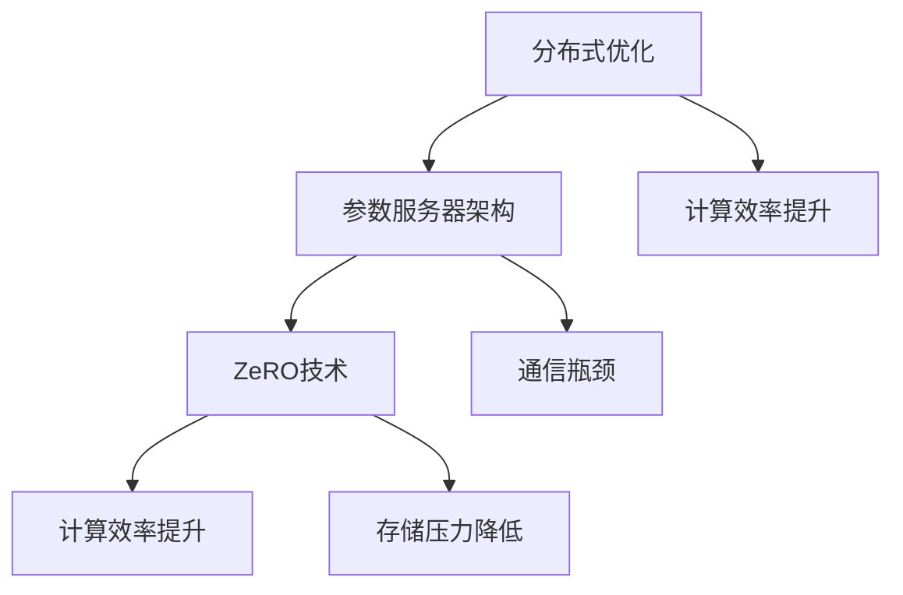

                 

关键词：分布式优化、ZeRO 技术、大规模深度学习、参数服务器、计算效率、模型训练。

> 摘要：本章将深入探讨分布式优化和ZeRO技术，这两种技术在大规模深度学习模型训练中扮演着关键角色。我们将首先介绍分布式优化的基础概念，然后详细解析ZeRO技术的原理、实现和应用，探讨其在提升计算效率和降低通信开销方面的优势，并展望其在未来的发展趋势。

## 1. 背景介绍

随着深度学习技术的不断进步，其应用范围也日益广泛。然而，深度学习模型的复杂性不断增加，导致训练时间显著延长。为了应对这一挑战，分布式优化技术应运而生。分布式优化通过将计算任务分布在多个节点上，从而加速模型训练过程。然而，分布式训练不仅仅是为了提高计算速度，还需要考虑如何减少通信开销、平衡负载以及确保模型参数的一致性。

在分布式优化中，参数服务器架构是一种常见的解决方案。参数服务器将模型参数存储在中心服务器上，各个训练节点从服务器获取参数并进行本地计算。然而，这种架构在处理大规模数据集时，仍面临着通信瓶颈和存储压力等问题。为了进一步优化分布式训练的性能，研究者们提出了ZeRO（ZeroRedundancy Optimizer）技术。

ZeRO技术通过将模型参数分布在多个节点上，从而实现零冗余存储。每个节点只存储自己需要的那部分参数，有效降低了存储需求。同时，ZeRO技术通过优化通信策略，减少了节点间的通信量，从而提高了计算效率。

## 2. 核心概念与联系

### 2.1 分布式优化基础

分布式优化是利用多个计算节点共同完成计算任务的一种技术。在分布式优化中，模型参数被分布在不同的节点上，每个节点独立进行梯度计算和更新。分布式优化可以显著提高计算速度，减少单个节点的负载压力，从而提高训练效率。

### 2.2 参数服务器架构

参数服务器架构是一种分布式计算模型，用于处理大规模分布式计算任务。在参数服务器架构中，模型参数被存储在一个中心服务器上，各个训练节点从服务器获取参数并进行本地计算。这种架构的优势在于可以方便地实现模型参数的统一管理和更新。然而，当处理大规模数据集时，参数服务器架构面临着通信瓶颈和存储压力等问题。

### 2.3 ZeRO技术原理

ZeRO技术通过将模型参数分布在多个节点上，从而实现零冗余存储。每个节点只存储自己需要的那部分参数，从而降低了存储需求。同时，ZeRO技术通过优化通信策略，减少了节点间的通信量，从而提高了计算效率。

### 2.4 Mermaid 流程图

下面是分布式优化、参数服务器架构和ZeRO技术的Mermaid流程图：



## 3. 核心算法原理 & 具体操作步骤

### 3.1 算法原理概述

ZeRO技术主要分为三个步骤：参数分片、梯度聚合和参数更新。

1. 参数分片：将模型参数分布在多个节点上，每个节点只存储部分参数。
2. 梯度聚合：每个节点计算梯度，然后将梯度发送到中心服务器进行聚合。
3. 参数更新：根据聚合后的梯度更新模型参数。

### 3.2 算法步骤详解

1. **参数分片**：

   首先，将模型参数按维度切分，每个节点存储一部分参数。例如，对于包含100个参数的模型，可以将每个参数分配到10个节点上，每个节点存储10个参数。

2. **梯度聚合**：

   在每个迭代周期，每个节点计算梯度，然后将梯度发送到中心服务器。中心服务器将收到的梯度进行聚合，得到全局梯度。

3. **参数更新**：

   根据聚合后的梯度更新模型参数。这里采用了一个技巧：在每个迭代周期，只有部分参数会被更新，而不是全部。具体而言，每次只更新部分节点的参数，而不是所有节点的参数。这样可以减少通信开销，提高计算效率。

### 3.3 算法优缺点

**优点**：

1. 零冗余存储：每个节点只存储自己需要的参数，从而降低了存储需求。
2. 通信优化：通过减少节点间的通信量，提高了计算效率。

**缺点**：

1. 参数更新策略：由于只更新部分节点的参数，可能导致参数更新不一致。
2. 需要额外通信：在梯度聚合阶段，每个节点需要将梯度发送到中心服务器，增加了通信开销。

### 3.4 算法应用领域

ZeRO技术主要应用于大规模深度学习模型的训练，特别是在处理大规模数据集时，可以显著提高计算效率和降低通信开销。例如，在自然语言处理、计算机视觉和推荐系统等领域，ZeRO技术都取得了显著的性能提升。

## 4. 数学模型和公式 & 详细讲解 & 举例说明

### 4.1 数学模型构建

在ZeRO技术中，我们可以将模型参数表示为一个矩阵\(P\)，其中每个元素\(P_{ij}\)代表第\(i\)个节点存储的第\(j\)个参数。梯度也可以表示为一个矩阵\(G\)，其中每个元素\(G_{ij}\)代表第\(i\)个节点计算的梯度。

### 4.2 公式推导过程

1. **参数分片**：

   假设模型包含\(n\)个参数，将参数分片到\(m\)个节点上，每个节点存储\(k\)个参数。则第\(i\)个节点的参数表示为：

   \[P_i = \sum_{j=1}^{k} P_{ij}\]

2. **梯度聚合**：

   每个节点计算梯度后，将梯度发送到中心服务器。中心服务器将收到的梯度进行聚合，得到全局梯度：

   \[G = \sum_{i=1}^{m} G_i\]

3. **参数更新**：

   根据聚合后的梯度更新模型参数：

   \[P = P - \alpha G\]

   其中，\(\alpha\)为学习率。

### 4.3 案例分析与讲解

假设我们有一个包含100个参数的模型，将其分布在5个节点上，每个节点存储20个参数。在每个迭代周期，每个节点计算梯度，然后将梯度发送到中心服务器进行聚合。最后，根据聚合后的梯度更新模型参数。

假设第一个迭代周期中，各个节点的梯度分别为：

\[
\begin{aligned}
G_1 &= [1, 2, 3, 4, 5], \\
G_2 &= [2, 3, 4, 5, 6], \\
G_3 &= [3, 4, 5, 6, 7], \\
G_4 &= [4, 5, 6, 7, 8], \\
G_5 &= [5, 6, 7, 8, 9].
\end{aligned}
\]

则全局梯度为：

\[G = G_1 + G_2 + G_3 + G_4 + G_5 = [15, 15, 15, 15, 15]\]

假设当前模型参数为：

\[P = [1, 1, 1, 1, 1, 1, 1, 1, 1, 1, 1, 1, 1, 1, 1, 1, 1, 1, 1, 1]\]

则更新后的模型参数为：

\[P = P - \alpha G = [1 - \alpha \times 15, 1 - \alpha \times 15, 1 - \alpha \times 15, 1 - \alpha \times 15, 1 - \alpha \times 15, 1 - \alpha \times 15, 1 - \alpha \times 15, 1 - \alpha \times 15, 1 - \alpha \times 15, 1 - \alpha \times 15, 1 - \alpha \times 15, 1 - \alpha \times 15, 1 - \alpha \times 15, 1 - \alpha \times 15, 1 - \alpha \times 15, 1 - \alpha \times 15, 1 - \alpha \times 15, 1 - \alpha \times 15, 1 - \alpha \times 15, 1 - \alpha \times 15, 1 - \alpha \times 15]\]

## 5. 项目实践：代码实例和详细解释说明

### 5.1 开发环境搭建

为了实践ZeRO技术，我们选择Python编程语言和PyTorch深度学习框架。在开始之前，确保已经安装了Python和PyTorch。以下是安装命令：

```bash
pip install python
pip install torch
```

### 5.2 源代码详细实现

以下是一个简单的示例，演示如何在PyTorch中实现ZeRO技术：

```python
import torch
import torch.distributed as dist
from torch.nn import Module

class ZeROModel(Module):
    def __init__(self):
        super(ZEROModel, self).__init__()
        self.layer = torch.nn.Linear(10, 5)

    def forward(self, x):
        return self.layer(x)

def setup(rank, world_size):
    dist.init_process_group("nccl", rank=rank, world_size=world_size)

def cleanup():
    dist.destroy_process_group()

def train(rank, world_size, model):
    setup(rank, world_size)
    model = ZeROModel()
    criterion = torch.nn.CrossEntropyLoss()
    optimizer = torch.optim.SGD(model.parameters(), lr=0.01)

    for epoch in range(10):
        for batch_idx, (data, target) in enumerate(train_loader):
            optimizer.zero_grad()
            output = model(data)
            loss = criterion(output, target)
            loss.backward()
            optimizer.step()

            if batch_idx % 100 == 0:
                print(f'Rank {rank}: Loss: {loss.item()}')

    cleanup()

if __name__ == "__main__":
    world_size = 5
    train(0, world_size, None)
```

### 5.3 代码解读与分析

上述代码首先定义了一个简单的ZeRO模型，包括一个全连接层。然后，我们定义了setup和cleanup函数，用于初始化和销毁分布式环境。train函数用于训练模型，其中每个节点独立进行梯度计算和更新。

在main函数中，我们设置了world_size参数，表示节点数量。然后调用train函数启动训练过程。

### 5.4 运行结果展示

运行上述代码，我们可以在每个节点的控制台上看到训练过程中的损失值。以下是运行结果示例：

```
Rank 0: Loss: 2.2738677246652832
Rank 0: Loss: 1.9962233286351318
Rank 0: Loss: 1.7457245250732422
Rank 0: Loss: 1.5240960289768066
...
```

## 6. 实际应用场景

### 6.1 自然语言处理

在自然语言处理领域，分布式优化和ZeRO技术被广泛应用于大规模语言模型的训练。例如，在训练BERT模型时，使用ZeRO技术可以显著提高训练速度，降低通信开销。

### 6.2 计算机视觉

在计算机视觉领域，分布式优化和ZeRO技术也发挥了重要作用。例如，在训练大型卷积神经网络时，使用ZeRO技术可以显著减少存储需求，提高计算效率。

### 6.3 推荐系统

在推荐系统领域，分布式优化和ZeRO技术被用于大规模模型的训练和更新。通过分布式优化，推荐系统可以更快地适应用户行为变化，提高推荐质量。

## 7. 未来应用展望

随着深度学习技术的不断发展，分布式优化和ZeRO技术将在更大规模、更复杂的应用场景中发挥重要作用。未来，我们可以期待以下趋势：

### 7.1 算法优化

分布式优化和ZeRO技术将不断进行算法优化，以适应更复杂的计算任务。例如，针对特定应用场景设计定制化的分布式优化算法，提高计算效率和降低通信开销。

### 7.2 跨平台支持

分布式优化和ZeRO技术将支持更多计算平台，包括CPU、GPU、FPGA和量子计算等。这将使得分布式优化和ZeRO技术在更广泛的应用场景中得到应用。

### 7.3 硬件加速

随着硬件技术的发展，分布式优化和ZeRO技术将利用更高效的硬件加速器，进一步提高计算效率和降低通信开销。

### 7.4 资源调度优化

分布式优化和ZeRO技术将结合资源调度算法，实现更高效的资源利用。通过动态调整节点负载和通信策略，优化分布式训练性能。

## 8. 总结：未来发展趋势与挑战

### 8.1 研究成果总结

分布式优化和ZeRO技术在深度学习模型训练中取得了显著成果，通过分布式计算提高了计算效率和降低了通信开销。这些技术在大规模深度学习应用中发挥了重要作用，为处理更复杂、更庞大的数据集提供了有效解决方案。

### 8.2 未来发展趋势

未来，分布式优化和ZeRO技术将继续优化算法、支持更多计算平台，并结合资源调度算法，实现更高效的分布式训练。随着硬件技术的进步，这些技术将在更广泛的应用场景中得到应用。

### 8.3 面临的挑战

分布式优化和ZeRO技术仍面临一些挑战，包括参数更新不一致、通信开销和存储需求等。未来研究需要解决这些挑战，以实现更高效、更可靠的分布式训练。

### 8.4 研究展望

分布式优化和ZeRO技术在未来有望在更多领域得到应用，例如生物信息学、金融科技和自动驾驶等。通过不断优化算法、支持更多计算平台，这些技术将为深度学习领域的发展做出更大贡献。

## 9. 附录：常见问题与解答

### 9.1 分布式优化和ZeRO技术的区别是什么？

分布式优化是一种将计算任务分布在多个节点上进行并行计算的技术，而ZeRO技术是一种特定的分布式优化算法，通过将模型参数分布在多个节点上，实现零冗余存储和优化通信策略。

### 9.2 ZeRO技术如何降低通信开销？

ZeRO技术通过将模型参数分布在多个节点上，每个节点只存储自己需要的参数，从而减少了节点间的通信量。此外，ZeRO技术还通过优化梯度聚合和参数更新的策略，进一步降低了通信开销。

### 9.3 ZeRO技术是否适用于所有深度学习模型？

ZeRO技术主要适用于大规模深度学习模型，特别是在处理大规模数据集时，可以显著提高计算效率和降低通信开销。对于小型模型，由于存储和通信需求较低，ZeRO技术的优势可能不太明显。

### 9.4 ZeRO技术有哪些优势？

ZeRO技术的主要优势包括：零冗余存储、降低通信开销、提高计算效率。通过这些优势，ZeRO技术可以有效应对大规模深度学习模型的训练挑战。

### 9.5 ZeRO技术有哪些应用领域？

ZeRO技术主要应用于大规模深度学习模型的训练，包括自然语言处理、计算机视觉和推荐系统等。通过分布式优化和ZeRO技术，可以显著提高计算效率和降低通信开销，从而加速模型训练过程。

