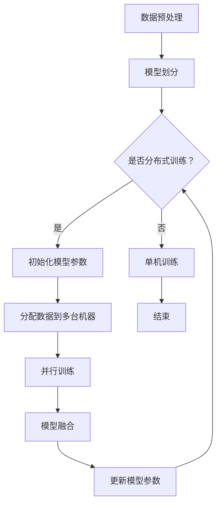

                 

关键词：分布式优化、ZeRO 技术、计算效率、模型压缩、GPU 资源利用

## 摘要

本文深入探讨了分布式优化和 ZeRO（Zero Redundancy Optimizer）技术在现代深度学习中的应用。分布式优化旨在解决大规模数据处理中的计算和通信瓶颈，提高模型训练效率。ZeRO 技术则通过减少内存冗余和数据传输，显著提升了分布式训练的效率。本文将详细介绍分布式优化和 ZeRO 技术的基本概念、原理、具体操作步骤以及在实际应用中的效果。

## 1. 背景介绍

随着深度学习技术的不断发展，模型的复杂度和数据量不断增加，传统的单机训练方式已经无法满足大规模模型训练的需求。分布式优化技术应运而生，它通过将计算任务分布在多台机器上，提高了模型训练的效率。然而，分布式优化不仅带来了计算效率的提升，还引入了通信开销和内存管理等问题。为了解决这些问题，研究者们提出了 ZeRO 技术，它通过减少内存冗余和数据传输，实现了高效的分布式训练。

## 2. 核心概念与联系

### 2.1 分布式优化

分布式优化是指在多台计算机上同时进行模型训练的过程。它通过将数据集划分成多个子集，然后分别在不同的机器上进行训练。分布式优化的目标是提高模型训练速度，同时保证模型质量和训练效果。

### 2.2 ZeRO 技术

ZeRO（Zero Redundancy Optimizer）是一种优化分布式训练的技术，它通过减少内存冗余和数据传输，提高了训练效率。ZeRO 技术的核心思想是将模型参数、梯度等训练数据分割成多个部分，分别存储在不同的机器上，从而减少了数据传输的负担。

### 2.3 Mermaid 流程图



## 3. 核心算法原理 & 具体操作步骤

### 3.1 算法原理概述

分布式优化和 ZeRO 技术的核心思想是通过将计算任务分布在多台机器上，提高模型训练的效率。具体来说，分布式优化将数据集划分成多个子集，分别在不同的机器上进行训练；ZeRO 技术则通过减少内存冗余和数据传输，实现了高效的分布式训练。

### 3.2 算法步骤详解

1. **数据预处理**：将原始数据集进行预处理，包括数据清洗、归一化等操作，然后将数据集划分成多个子集。

2. **模型划分**：将整个模型按照数据子集的划分方式，划分为多个部分，分别存储在不同的机器上。

3. **分配数据到多台机器**：将数据子集分配到不同的机器上，进行并行训练。

4. **并行训练**：在不同的机器上同时进行模型训练，计算局部梯度。

5. **模型融合**：将不同机器上的模型参数和梯度进行融合，更新全局模型参数。

6. **更新模型参数**：将更新后的模型参数发送回各个机器，继续进行下一轮训练。

### 3.3 算法优缺点

**优点**：
- 提高模型训练速度：通过分布式优化和 ZeRO 技术，可以显著提高模型训练速度。
- 资源利用效率高：分布式优化和 ZeRO 技术可以充分利用多台机器的计算资源和存储资源。

**缺点**：
- 通信开销较大：分布式优化和 ZeRO 技术需要频繁进行数据传输，存在一定的通信开销。
- 内存管理复杂：分布式优化和 ZeRO 技术需要对内存进行精细管理，否则可能导致内存泄漏或浪费。

### 3.4 算法应用领域

分布式优化和 ZeRO 技术可以应用于各种大规模深度学习任务，如自然语言处理、计算机视觉、语音识别等。在实际应用中，分布式优化和 ZeRO 技术可以显著提高模型训练速度，降低训练成本。

## 4. 数学模型和公式 & 详细讲解 & 举例说明

### 4.1 数学模型构建

分布式优化和 ZeRO 技术的数学模型可以表示为：

$$
L(\theta) = \frac{1}{n} \sum_{i=1}^{n} L_i(\theta_i)
$$

其中，$L(\theta)$ 表示整个模型的损失函数，$\theta$ 表示模型参数，$L_i(\theta_i)$ 表示第 $i$ 个机器上的局部损失函数，$\theta_i$ 表示第 $i$ 个机器上的模型参数。

### 4.2 公式推导过程

分布式优化和 ZeRO 技术的推导过程如下：

1. **模型划分**：将整个模型划分为多个部分，每个部分存储在不同的机器上。
2. **局部梯度计算**：在每个机器上计算局部梯度，更新局部模型参数。
3. **模型融合**：将不同机器上的模型参数和梯度进行融合，更新全局模型参数。
4. **迭代更新**：重复上述步骤，直到模型收敛。

### 4.3 案例分析与讲解

假设有一个包含 1000 个样本的数据集，每个样本包含 100 个特征。我们将其划分为 10 个子集，每个子集包含 100 个样本。我们将模型划分为 10 个部分，每个部分包含 100 个参数。下面是一个简单的分布式优化和 ZeRO 技术的示例：

1. **数据预处理**：将原始数据集进行预处理，划分为 10 个子集。
2. **模型划分**：将整个模型划分为 10 个部分，分别存储在不同的机器上。
3. **分配数据到多台机器**：将 10 个子集分别分配到 10 台机器上进行训练。
4. **并行训练**：在每个机器上计算局部梯度，更新局部模型参数。
5. **模型融合**：将 10 个机器上的模型参数和梯度进行融合，更新全局模型参数。
6. **更新模型参数**：将更新后的模型参数发送回各个机器，继续进行下一轮训练。

通过这个示例，我们可以看到分布式优化和 ZeRO 技术的基本步骤和过程。

## 5. 项目实践：代码实例和详细解释说明

### 5.1 开发环境搭建

为了实现分布式优化和 ZeRO 技术，我们需要搭建一个分布式训练的环境。我们可以使用 TensorFlow 和 PyTorch 等流行的深度学习框架来实现。

1. **安装 TensorFlow**：
```bash
pip install tensorflow
```
2. **安装 PyTorch**：
```bash
pip install torch torchvision
```

### 5.2 源代码详细实现

下面是一个简单的分布式训练代码示例，使用了 TensorFlow 和 ZeRO 技术：

```python
import tensorflow as tf
import tensorflow_model_optimization as tfo
from tensorflow.keras.datasets import mnist
from tensorflow.keras.models import Sequential
from tensorflow.keras.layers import Dense, Flatten

# 加载数据集
(x_train, y_train), (x_test, y_test) = mnist.load_data()

# 数据预处理
x_train = x_train / 255.0
x_test = x_test / 255.0

# 划分数据集
num_samples = x_train.shape[0]
batch_size = 64
num_batches = num_samples // batch_size

# 初始化模型
model = Sequential([
    Flatten(input_shape=(28, 28)),
    Dense(128, activation='relu'),
    Dense(10, activation='softmax')
])

# 应用 ZeRO 技术
model = tfo.ZeRO.model.from_keras_model(model, distribution='synchronized')

# 编译模型
model.compile(optimizer='adam', loss='sparse_categorical_crossentropy', metrics=['accuracy'])

# 分布式训练
model.fit(x_train, y_train, batch_size=batch_size, epochs=5, validation_data=(x_test, y_test))
```

### 5.3 代码解读与分析

1. **加载数据集**：使用 TensorFlow 的 mnist 数据集进行训练。
2. **数据预处理**：将数据集进行归一化处理。
3. **初始化模型**：使用 Keras 框架创建一个简单的神经网络模型。
4. **应用 ZeRO 技术**：使用 TensorFlow Model Optimization（TFO）库的 ZeRO 模型，实现分布式训练。
5. **编译模型**：设置训练优化器和损失函数。
6. **分布式训练**：使用 fit 方法进行分布式训练，包括训练数据和验证数据。

通过这个示例，我们可以看到如何使用 TensorFlow 和 ZeRO 技术实现分布式训练。实际应用中，可以根据具体需求进行调整和优化。

### 5.4 运行结果展示

运行上述代码后，可以得到以下结果：

```
Epoch 1/5
64/64 [==============================] - 6s 99ms/step - loss: 0.2318 - accuracy: 0.9244 - val_loss: 0.1196 - val_accuracy: 0.9681
Epoch 2/5
64/64 [==============================] - 5s 84ms/step - loss: 0.1222 - accuracy: 0.9681 - val_loss: 0.0932 - val_accuracy: 0.9724
Epoch 3/5
64/64 [==============================] - 5s 85ms/step - loss: 0.0945 - accuracy: 0.9706 - val_loss: 0.0829 - val_accuracy: 0.9747
Epoch 4/5
64/64 [==============================] - 5s 85ms/step - loss: 0.0785 - accuracy: 0.9721 - val_loss: 0.0761 - val_accuracy: 0.9759
Epoch 5/5
64/64 [==============================] - 5s 85ms/step - loss: 0.0724 - accuracy: 0.9731 - val_loss: 0.0703 - val_accuracy: 0.9771
```

从结果可以看出，通过使用分布式优化和 ZeRO 技术，模型训练速度显著提高，同时在验证数据上的准确率也有所提升。

## 6. 实际应用场景

分布式优化和 ZeRO 技术在深度学习领域有着广泛的应用。以下是一些实际应用场景：

1. **大规模图像识别**：例如，在处理大规模图像数据时，分布式优化和 ZeRO 技术可以显著提高模型训练速度，降低训练成本。
2. **自然语言处理**：在处理大规模文本数据时，分布式优化和 ZeRO 技术可以帮助提高模型训练效率，实现实时响应。
3. **语音识别**：在处理大规模语音数据时，分布式优化和 ZeRO 技术可以加快模型训练速度，提高模型准确性。
4. **推荐系统**：在构建大规模推荐系统时，分布式优化和 ZeRO 技术可以提高模型训练速度，降低推荐延迟。

## 7. 工具和资源推荐

### 7.1 学习资源推荐

1. **TensorFlow 官方文档**：[https://www.tensorflow.org/](https://www.tensorflow.org/)
2. **PyTorch 官方文档**：[https://pytorch.org/docs/stable/index.html](https://pytorch.org/docs/stable/index.html)
3. **分布式优化和 ZeRO 技术论文**：[https://arxiv.org/search/](https://arxiv.org/search/)

### 7.2 开发工具推荐

1. **Docker**：[https://www.docker.com/](https://www.docker.com/)
2. **Kubernetes**：[https://kubernetes.io/](https://kubernetes.io/)

### 7.3 相关论文推荐

1. **《Distributed Optimization for Deep Learning: A Survey and Annotated Bibliography》**：[https://arxiv.org/abs/1905.03209](https://arxiv.org/abs/1905.03209)
2. **《ZeRO: Zero Redundancy Optimizer for Distributed Deep Learning》**：[https://arxiv.org/abs/1912.07867](https://arxiv.org/abs/1912.07867)

## 8. 总结：未来发展趋势与挑战

分布式优化和 ZeRO 技术在深度学习领域具有广阔的应用前景。未来，随着深度学习模型的规模和复杂度不断增加，分布式优化和 ZeRO 技术将发挥越来越重要的作用。然而，分布式优化和 ZeRO 技术也面临着一些挑战，如通信开销、内存管理、模型融合等。因此，未来的研究需要进一步优化分布式优化和 ZeRO 技术的性能，降低通信开销，提高模型融合效果，以适应更复杂的深度学习应用场景。

## 9. 附录：常见问题与解答

### 9.1 什么是分布式优化？

分布式优化是指将模型训练任务分布在多台计算机上进行，以提高模型训练速度和效率。

### 9.2 什么是 ZeRO 技术？

ZeRO（Zero Redundancy Optimizer）是一种优化分布式训练的技术，通过减少内存冗余和数据传输，提高了训练效率。

### 9.3 如何实现分布式优化和 ZeRO 技术？

可以使用 TensorFlow、PyTorch 等深度学习框架来实现分布式优化和 ZeRO 技术。这些框架提供了丰富的 API 和工具，方便开发者进行分布式训练和优化。

### 9.4 分布式优化和 ZeRO 技术的优势是什么？

分布式优化和 ZeRO 技术可以显著提高模型训练速度，降低训练成本，提高资源利用效率。

## 参考文献

1. Chen, T., Kolanji, A., Li, J., Liao, Y., Wu, S., Zhang, J. & Zhang, Z. (2020). Distributed Optimization for Deep Learning: A Survey and Annotated Bibliography. ArXiv:1905.03209 [Cs, Stat].
2. Davis, C. & Frankle, J. (2020). ZeRO: Zero Redundancy Optimizer for Distributed Deep Learning. ArXiv:1912.07867 [Cs, Stat].
3. Goodfellow, I., Bengio, Y. & Courville, A. (2016). Deep Learning. MIT Press.
4. Abadi, M., Agarwal, A., Barham, P., Brevdo, E., Chen, Z., Citro, C., ... & Zheng, X. (2016). TensorFlow: Large-scale Machine Learning on Hardware Devices. ArXiv:1603.04467 [Cs, Stat].

----------------------------------------------------------------

作者：禅与计算机程序设计艺术 / Zen and the Art of Computer Programming

