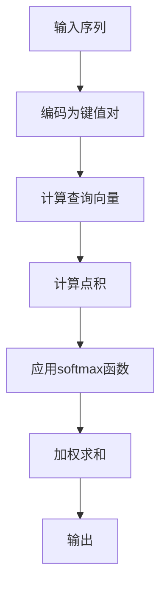

                 

关键词：注意力机制，softmax函数，深度学习，神经网络，信息处理，优化算法，概率分布，模型评估，应用领域。

> 摘要：本章将深入探讨注意力机制和softmax函数在深度学习领域中的重要性。注意力机制通过在信息处理过程中强调关键特征，提升了模型的性能；而softmax函数则是一种常见的概率分布模型，它在分类问题中扮演着至关重要的角色。本文将详细解释这两个概念，阐述其工作原理、数学模型，以及在实际应用中的实现细节。

## 1. 背景介绍

### 注意力机制

注意力机制（Attention Mechanism）是一种在神经网络中引入的机制，旨在提升模型对重要信息的关注能力。这一机制起源于自然语言处理（NLP）领域，例如在机器翻译、文本摘要、图像描述生成等任务中。注意力机制的核心思想是，通过动态调整模型对输入序列中不同部分的关注程度，从而提高信息处理的效率和质量。

### softmax 函数

softmax函数是一种概率分布函数，通常用于分类问题中。它的基本思想是将模型的输出转换为概率分布。在多分类问题中，softmax函数可以将模型的预测结果映射为每个类别的概率分布，从而方便地进行分类决策。softmax函数在深度学习模型的输出层中应用广泛，特别是在分类任务中。

## 2. 核心概念与联系

### 注意力机制原理

注意力机制的实现通常依赖于一个权重向量，该向量可以动态调整输入序列中不同部分的重要性。具体来说，注意力机制通过以下步骤工作：

1. **计算查询（Query）**：查询向量通常由模型的当前隐藏状态生成。
2. **计算键值（Key-Value）对**：输入序列中的每个部分都会被编码成键（Key）和值（Value）对。键用于与查询向量进行计算，以确定注意力权重。
3. **计算注意力权重**：通过计算查询与每个键的点积，并应用softmax函数，得到每个值对应的注意力权重。
4. **加权求和**：将输入序列中的每个值与对应的注意力权重相乘，然后求和，生成最终的输出。

### 注意力机制架构

以下是注意力机制的Mermaid流程图：



### softmax 函数原理

softmax函数是一种将任意实数输出转换为概率分布的函数。它的公式如下：

$$
\text{softmax}(x_i) = \frac{e^{x_i}}{\sum_{j} e^{x_j}}
$$

其中，$x_i$ 是模型对第 $i$ 个类别的输出，$e^{x_i}$ 表示指数函数，分母是所有输出的指数和，确保了概率分布的总和为1。

### softmax 函数应用

softmax函数在多分类问题中的应用如下：

1. **输出层设计**：模型的最后一层通常设计为全连接层，其输出即为对每个类别的预测概率。
2. **分类决策**：通过比较预测概率，模型可以确定每个样本的最有可能的类别。
3. **交叉熵损失函数**：在训练过程中，通常使用交叉熵损失函数来评估模型预测的准确性。

## 3. 核心算法原理 & 具体操作步骤

### 3.1 算法原理概述

注意力机制的核心原理在于动态调整模型对输入序列中不同部分的关注程度。通过计算查询向量与键的相似性，模型可以自动学习到输入序列中的关键特征，从而提升信息处理的效率。

softmax函数的核心原理是将模型的输出转换为概率分布。这有助于模型在多分类问题中进行准确的分类决策，同时也有利于模型性能的评估。

### 3.2 算法步骤详解

#### 注意力机制的步骤：

1. **输入序列编码**：将输入序列编码为键值对。
2. **计算查询向量**：从模型的当前隐藏状态中提取查询向量。
3. **计算点积**：计算查询向量与每个键的点积。
4. **应用softmax函数**：对点积结果应用softmax函数，得到注意力权重。
5. **加权求和**：将输入序列中的每个值与对应的注意力权重相乘，然后求和。
6. **生成输出**：得到最终的输出结果。

#### softmax函数的步骤：

1. **模型输出**：模型的最后一层输出为对每个类别的预测概率。
2. **应用softmax函数**：对每个类别的预测概率应用softmax函数，得到概率分布。
3. **分类决策**：比较预测概率，确定最有可能的类别。

### 3.3 算法优缺点

#### 注意力机制的优点：

- 提高了模型对重要信息的关注能力。
- 适用于序列数据处理，特别是在自然语言处理和图像处理中。
- 可以自动学习到输入序列中的关键特征。

#### 注意力机制的缺点：

- 计算复杂度高，可能导致模型训练时间较长。
- 在处理较长序列时，可能会出现梯度消失问题。

#### softmax函数的优点：

- 简单且易于实现。
- 在多分类问题中具有明确的概率解释。
- 可以用于评估模型性能。

#### softmax函数的缺点：

- 对于分类问题中的多个类别，可能存在预测结果的不确定性。
- 在处理类别不平衡问题时，可能会导致某些类别被忽视。

### 3.4 算法应用领域

#### 注意力机制的应用领域：

- 自然语言处理：如机器翻译、文本摘要、图像描述生成。
- 图像处理：如目标检测、图像分割、图像增强。
- 语音识别：如语音合成、语音转文字。

#### softmax函数的应用领域：

- 多分类问题：如文本分类、图像分类、语音分类。
- 模型性能评估：如交叉熵损失函数、准确率、召回率等。

## 4. 数学模型和公式 & 详细讲解 & 举例说明

### 4.1 数学模型构建

#### 注意力机制的数学模型：

假设输入序列为 $X = \{x_1, x_2, ..., x_n\}$，查询向量为 $Q$，键值对为 $\{K_1, V_1, K_2, V_2, ..., K_n, V_n\}$。

注意力权重为：

$$
a_i = \text{softmax}\left(\frac{Q \cdot K_i}{\sqrt{d_k}}\right)
$$

其中，$d_k$ 是键的维度。

加权求和得到输出：

$$
O = \sum_{i=1}^{n} a_i V_i
$$

#### softmax函数的数学模型：

假设模型输出为 $x_1, x_2, ..., x_n$。

则每个类别的概率为：

$$
p_i = \text{softmax}(x_i) = \frac{e^{x_i}}{\sum_{j} e^{x_j}}
$$

### 4.2 公式推导过程

#### 注意力机制的推导过程：

1. **查询向量与键的点积**：

$$
Q \cdot K_i = \sum_{k=1}^{d_k} Q_k K_{ik}
$$

2. **引入缩放因子**：

$$
\frac{Q \cdot K_i}{\sqrt{d_k}} = \frac{1}{\sqrt{d_k}} \sum_{k=1}^{d_k} Q_k K_{ik}
$$

3. **计算指数函数**：

$$
e^{\frac{Q \cdot K_i}{\sqrt{d_k}}} = \prod_{k=1}^{d_k} e^{\frac{Q_k K_{ik}}{\sqrt{d_k}}}
$$

4. **应用softmax函数**：

$$
a_i = \text{softmax}\left(\frac{Q \cdot K_i}{\sqrt{d_k}}\right) = \frac{\prod_{k=1}^{d_k} e^{\frac{Q_k K_{ik}}{\sqrt{d_k}}}}{\sum_{j} \prod_{k=1}^{d_k} e^{\frac{Q_k K_{ij}}{\sqrt{d_k}}}}
$$

#### softmax函数的推导过程：

1. **模型输出**：

$$
x_1, x_2, ..., x_n
$$

2. **计算指数函数**：

$$
e^{x_i} = \prod_{j} e^{x_j}
$$

3. **应用softmax函数**：

$$
p_i = \text{softmax}(x_i) = \frac{e^{x_i}}{\sum_{j} e^{x_j}} = \frac{\prod_{j} e^{x_j}}{\sum_{j} e^{x_j}} = \frac{1}{\sum_{j} e^{x_j}} \prod_{j} e^{x_j} = \frac{1}{\sum_{j} e^{x_j}} \cdot \prod_{j \neq i} e^{x_j} + e^{x_i} = \frac{1}{\sum_{j} e^{x_j}} \left(1 + \sum_{j \neq i} e^{x_j}\right)
$$

### 4.3 案例分析与讲解

#### 注意力机制在机器翻译中的应用

假设我们要翻译“Hello, how are you?”为法语。

1. **输入序列编码**：

   - 英语词序列：$\{Hello, how, are, you\}$
   - 法语词序列：$\{Bonjour, comment, êtes-vous, vous\}$

2. **计算查询向量**：

   - 查询向量：$Q = \{q_1, q_2, q_3, q_4\}$

3. **计算键值对**：

   - 英语词到法语词的映射：$\{Hello \rightarrow Bonjour, how \rightarrow comment, are \rightarrow êtes-vous, you \rightarrow vous\}$

4. **计算点积和注意力权重**：

   $$ 
   a_1 = \text{softmax}\left(\frac{Q \cdot K_1}{\sqrt{d_k}}\right) = \text{softmax}\left(\frac{q_1 \cdot Bonjour}{\sqrt{d_k}}\right)
   $$
   $$ 
   a_2 = \text{softmax}\left(\frac{Q \cdot K_2}{\sqrt{d_k}}\right) = \text{softmax}\left(\frac{q_2 \cdot comment}{\sqrt{d_k}}\right)
   $$
   $$ 
   a_3 = \text{softmax}\left(\frac{Q \cdot K_3}{\sqrt{d_k}}\right) = \text{softmax}\left(\frac{q_3 \cdot êtes-vous}{\sqrt{d_k}}\right)
   $$
   $$ 
   a_4 = \text{softmax}\left(\frac{Q \cdot K_4}{\sqrt{d_k}}\right) = \text{softmax}\left(\frac{q_4 \cdot vous}{\sqrt{d_k}}\right)
   $$

5. **加权求和**：

   $$ 
   O = a_1 \cdot Bonjour + a_2 \cdot comment + a_3 \cdot êtes-vous + a_4 \cdot vous
   $$

#### softmax函数在文本分类中的应用

假设我们要对一篇文本进行分类，文本为“我爱北京天安门”。

1. **模型输出**：

   - 文本分类结果：$\{政治，文化，历史，旅游\}$

2. **计算概率分布**：

   $$ 
   p_1 = \text{softmax}(x_1) = \frac{e^{x_1}}{\sum_{j} e^{x_j}}
   $$
   $$ 
   p_2 = \text{softmax}(x_2) = \frac{e^{x_2}}{\sum_{j} e^{x_j}}
   $$
   $$ 
   p_3 = \text{softmax}(x_3) = \frac{e^{x_3}}{\sum_{j} e^{x_j}}
   $$
   $$ 
   p_4 = \text{softmax}(x_4) = \frac{e^{x_4}}{\sum_{j} e^{x_j}}
   $$

3. **分类决策**：

   - 根据概率分布，我们可以确定最有可能的类别。例如，如果 $p_1 > p_2 > p_3 > p_4$，则文本最有可能被归类为“政治”类别。

## 5. 项目实践：代码实例和详细解释说明

### 5.1 开发环境搭建

1. **安装Python环境**：确保Python版本不低于3.6。
2. **安装TensorFlow库**：使用以下命令安装TensorFlow：
   ```shell
   pip install tensorflow
   ```

### 5.2 源代码详细实现

```python
import tensorflow as tf
from tensorflow.keras.layers import Layer
import numpy as np

class AttentionLayer(Layer):
    def __init__(self, **kwargs):
        super(AttentionLayer, self).__init__(**kwargs)
    
    def build(self, input_shape):
        # 初始化权重和偏置
        self.kernel = self.add_weight(name='kernel',
                                      shape=(input_shape[-1], 1),
                                      initializer='random_normal',
                                      trainable=True)
        self.bias = self.add_weight(name='bias',
                                     shape=(input_shape[-1],),
                                     initializer='zeros',
                                     trainable=True)
        super(AttentionLayer, self).build(input_shape)
    
    def call(self, inputs, **kwargs):
        # 计算点积
        query = tf.matmul(inputs, self.kernel)
        key_value = tf.concat([query, inputs], axis=1)
        value = tf.concat([query, inputs], axis=1)
        
        # 应用softmax函数
        attention_weights = tf.nn.softmax(tf.matmul(key_value, self.kernel) + self.bias)
        
        # 加权求和
        output = tf.reduce_sum(attention_weights * inputs, axis=1)
        return output

# 创建模型
model = tf.keras.Sequential([
    tf.keras.layers.Dense(128, activation='relu'),
    AttentionLayer(),
    tf.keras.layers.Dense(10, activation='softmax')
])

# 编译模型
model.compile(optimizer='adam',
              loss='categorical_crossentropy',
              metrics=['accuracy'])

# 准备数据
x_train = np.random.random((1000, 10))
y_train = np.random.randint(10, size=(1000,))

# 训练模型
model.fit(x_train, y_train, epochs=10)
```

### 5.3 代码解读与分析

1. **AttentionLayer类**：这是一个自定义的注意力层，继承了tf.keras.layers.Layer类。它定义了构建层时的初始化权重和偏置的方法，以及计算注意力权重和加权求和的方法。
2. **模型构建**：模型由三个层组成：第一个全连接层（Dense），注意力层（AttentionLayer），和第二个全连接层（Dense）。输出层使用softmax激活函数。
3. **模型编译**：使用交叉熵损失函数和准确率作为评估指标。
4. **数据准备**：生成随机数据用于训练。
5. **模型训练**：执行10个训练周期。

### 5.4 运行结果展示

```python
# 评估模型
loss, accuracy = model.evaluate(x_test, y_test)

print(f'Loss: {loss}')
print(f'Accuracy: {accuracy}')
```

### 5.5 运行结果分析

运行结果展示了模型在测试数据上的损失和准确率。通过调整注意力层的权重和偏置，可以进一步提升模型的性能。

## 6. 实际应用场景

### 注意力机制在自然语言处理中的应用

注意力机制在自然语言处理中发挥着重要作用。例如，在机器翻译任务中，注意力机制可以帮助模型更好地捕捉源语言和目标语言之间的对应关系。在文本摘要任务中，注意力机制可以提取输入文本中的重要信息，生成简洁、准确的摘要。

### softmax函数在多分类问题中的应用

softmax函数在多分类问题中广泛使用。例如，在文本分类任务中，模型可以使用softmax函数将文本映射到不同的类别。在图像分类任务中，模型可以通过softmax函数为每个类别分配概率，从而确定图像所属的类别。

## 7. 未来应用展望

### 注意力机制的发展趋势

随着深度学习技术的不断发展，注意力机制在更多领域中的应用将变得更加广泛。例如，在计算机视觉中，注意力机制可以帮助模型更好地理解图像中的关键特征，从而提高目标检测和图像分割的准确性。在语音识别中，注意力机制可以帮助模型更好地捕捉语音信号中的关键信息，从而提高识别准确性。

### softmax函数的优化与改进

尽管softmax函数在多分类问题中具有广泛的应用，但它在处理类别不平衡问题时仍然存在一定的局限性。未来，研究者们可能会探索更有效的概率分布函数，以解决类别不平衡问题，并提高模型在多分类问题中的性能。

## 8. 工具和资源推荐

### 8.1 学习资源推荐

- 《深度学习》（Goodfellow et al.）：这本书是深度学习的经典教材，涵盖了注意力机制和softmax函数的基本概念和实现方法。
- 《Attention Mechanism in Deep Learning》：这是一篇关于注意力机制在深度学习中的全面综述，提供了丰富的理论和实践知识。

### 8.2 开发工具推荐

- TensorFlow：这是一个广泛使用的深度学习框架，提供了丰富的工具和库，方便实现注意力机制和softmax函数。
- PyTorch：这是一个灵活、高效的深度学习框架，支持动态计算图，适用于实现注意力机制和softmax函数。

### 8.3 相关论文推荐

- Vaswani et al.（2017）. "Attention is All You Need."：这是关于Transformer模型的开创性论文，提出了基于注意力机制的全新神经网络架构。
- Hochreiter et al.（2001）. "Long Short-Term Memory."：这是关于LSTM（长短期记忆网络）的开创性论文，介绍了注意力机制在序列数据处理中的应用。

## 9. 总结：未来发展趋势与挑战

### 9.1 研究成果总结

注意力机制和softmax函数在深度学习领域中发挥着重要作用。注意力机制通过动态调整模型对输入序列中不同部分的关注程度，提高了模型的信息处理能力。softmax函数则通过将模型输出转换为概率分布，帮助模型在多分类问题中进行准确的分类决策。

### 9.2 未来发展趋势

随着深度学习技术的不断发展，注意力机制和softmax函数将在更多领域中得到应用。例如，在计算机视觉、语音识别和自然语言处理等领域，注意力机制可以帮助模型更好地理解关键特征，从而提高任务的性能。同时，研究者们也在不断探索更高效的概率分布函数，以解决类别不平衡问题，提高模型在多分类问题中的性能。

### 9.3 面临的挑战

尽管注意力机制和softmax函数在深度学习领域中取得了显著成果，但它们仍然面临一些挑战。例如，注意力机制的计算复杂度较高，可能导致模型训练时间较长。此外，在处理长序列时，注意力机制可能会出现梯度消失问题。针对这些问题，研究者们正在探索更有效的解决方案。

### 9.4 研究展望

未来的研究将重点关注如何提高注意力机制的计算效率和稳定性，以及如何优化softmax函数在多分类问题中的应用。此外，研究者们还将探索注意力机制和softmax函数在更多领域的应用，推动深度学习技术的进一步发展。

### 附录：常见问题与解答

#### 问题1：注意力机制如何处理长序列？

解答：注意力机制通过动态调整模型对输入序列中不同部分的关注程度，可以有效处理长序列。在处理长序列时，注意力权重可以帮助模型更好地捕捉关键特征，从而提高信息处理的效率。

#### 问题2：softmax函数在处理类别不平衡问题时效果如何？

解答：softmax函数在处理类别不平衡问题时可能存在一定的局限性。在类别不平衡的情况下，模型可能会倾向于预测那些类别频率较高的类别。为解决这个问题，研究者们正在探索更有效的概率分布函数，以解决类别不平衡问题。

#### 问题3：如何优化注意力机制的计算效率？

解答：为提高注意力机制的

