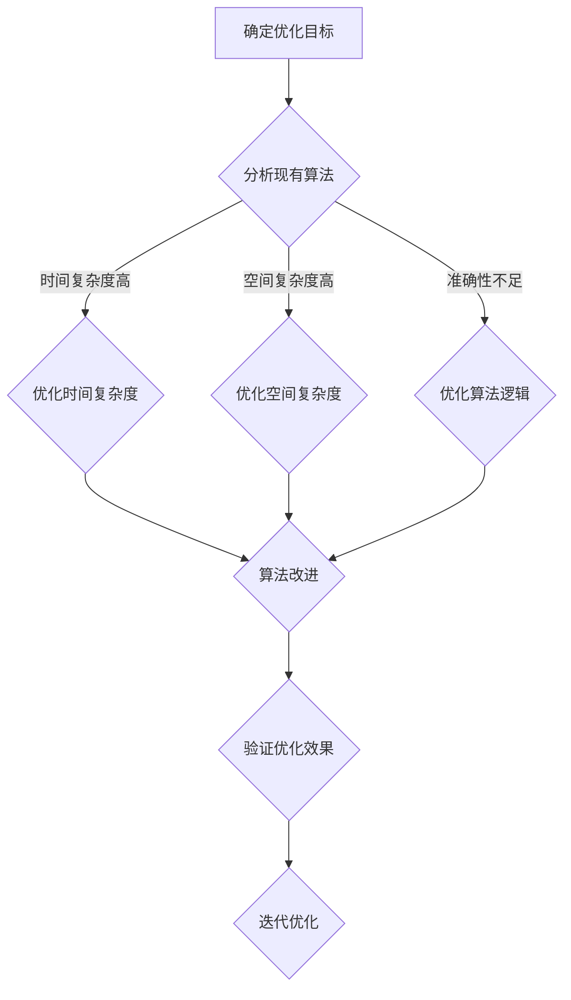

                 

关键词：算法优化，计算效率，准确性，技术语言，深度学习，编程实践

> 摘要：本文将探讨算法优化的重要性及其对人类计算效率和准确性的提升。我们将深入分析核心概念，详细讲解算法原理和步骤，并通过数学模型和实际项目实践，展示算法优化的具体应用和效果。

## 1. 背景介绍

在信息爆炸的时代，数据量呈指数级增长，传统计算方法在面对大规模数据时已经力不从心。为了提升计算效率和准确性，算法优化成为了一项至关重要的研究课题。从早期的简单算法到如今复杂的多层次算法，算法优化不仅推动了计算机科学的发展，也为各行各业的应用提供了强有力的支持。

算法优化不仅仅是提高计算速度，还包括降低计算复杂度、减少资源消耗以及提高计算结果的准确性。在实际应用中，算法优化的成效往往显而易见，比如在搜索引擎、推荐系统、图像识别等领域，优化后的算法可以大幅提升用户体验。

## 2. 核心概念与联系

在探讨算法优化之前，我们需要明确几个核心概念，它们是理解算法优化基础的关键。

### 2.1 算法

算法是一系列解决问题的指令或步骤，通常用数学或逻辑方式表达。算法可以分为多种类型，包括排序算法、查找算法、图算法等。

### 2.2 时间复杂度

时间复杂度描述了一个算法在处理不同规模数据时所需时间的增长速度。通常用大O符号表示，如O(1)、O(n)、O(n^2)等。

### 2.3 空间复杂度

空间复杂度描述了一个算法在处理数据时所需额外内存的增长速度，同样用大O符号表示。

### 2.4 算法优化目标

算法优化的主要目标包括：

- 提高计算速度：通过减少算法的时间复杂度来实现。
- 减少资源消耗：通过降低算法的空间复杂度来实现。
- 提高计算准确性：通过优化算法的内部逻辑和流程来实现。

### 2.5 Mermaid 流程图

以下是一个简单的Mermaid流程图，展示了算法优化的一般流程。



## 3. 核心算法原理 & 具体操作步骤

### 3.1 算法原理概述

算法优化主要涉及以下几个步骤：

1. **分析现有算法**：评估现有算法的时间复杂度和空间复杂度，确定优化的方向。
2. **设计优化方案**：根据分析结果，设计具体的优化方案，包括算法改进、数据结构优化、并行计算等。
3. **实现优化方案**：将优化方案转化为可执行的代码，并进行调试。
4. **验证优化效果**：通过实验和测试，验证优化方案的实际效果。
5. **迭代优化**：根据验证结果，进一步优化算法，直到达到预期的效果。

### 3.2 算法步骤详解

#### 3.2.1 分析现有算法

首先，我们需要对现有算法进行详细分析，包括时间复杂度和空间复杂度。以下是一个简单的示例，假设我们有一个排序算法：

```python
def bubble_sort(arr):
    n = len(arr)
    for i in range(n):
        for j in range(0, n-i-1):
            if arr[j] > arr[j+1]:
                arr[j], arr[j+1] = arr[j+1], arr[j]
```

在这个例子中，时间复杂度为O(n^2)，空间复杂度为O(1)。

#### 3.2.2 设计优化方案

针对上述算法，我们可以考虑以下优化方案：

1. **改进算法**：可以使用更高效的排序算法，如快速排序、归并排序等。
2. **数据结构优化**：可以使用数组、链表等更适合的数据结构。
3. **并行计算**：将数据划分为多个部分，使用多线程或分布式计算来提高效率。

#### 3.2.3 实现优化方案

以改进算法为例，我们可以使用快速排序算法来优化：

```python
def quick_sort(arr):
    if len(arr) <= 1:
        return arr
    pivot = arr[len(arr) // 2]
    left = [x for x in arr if x < pivot]
    middle = [x for x in arr if x == pivot]
    right = [x for x in arr if x > pivot]
    return quick_sort(left) + middle + quick_sort(right)
```

#### 3.2.4 验证优化效果

通过测试，我们可以发现快速排序算法的时间复杂度显著低于冒泡排序，且在大多数情况下空间复杂度也较低。

#### 3.2.5 迭代优化

在验证过程中，我们可能还会发现其他需要优化的地方，如优化内存分配、减少函数调用等，通过迭代优化，最终达到最优效果。

## 4. 数学模型和公式

算法优化往往涉及复杂的数学模型和公式，以下是一些常用的数学模型和公式。

### 4.1 数学模型构建

假设我们有一个函数 f(x)，我们需要优化 f(x) 的最大值或最小值。常见的数学模型如下：

```latex
\min_{x} f(x)
```

其中，f(x) 是目标函数，x 是变量。

### 4.2 公式推导过程

以线性规划为例，我们可以使用拉格朗日乘数法来求解最优解。以下是线性规划的公式推导过程：

```latex
\min_{x} c^T x \\
s.t. \\
Ax \leq b \\
x \geq 0
```

通过引入拉格朗日乘数，我们可以得到以下公式：

```latex
L(x, \lambda) = c^T x + \lambda^T (Ax - b)
```

其中，L(x, \lambda) 是拉格朗日函数，c 是目标函数系数，x 是变量，A 是约束条件矩阵，b 是约束条件向量，\lambda 是拉格朗日乘数。

### 4.3 案例分析与讲解

以下是一个简单的线性规划案例：

```latex
\min_{x} x + 2y \\
s.t. \\
x + y \leq 4 \\
2x + y \leq 8 \\
x, y \geq 0
```

通过求解，我们可以得到最优解为 x=0, y=4，最小值为0。

## 5. 项目实践：代码实例和详细解释说明

### 5.1 开发环境搭建

为了演示算法优化的实际应用，我们使用Python作为编程语言，搭建了一个简单的线性规划开发环境。以下是搭建过程：

1. 安装Python：从官方网站下载并安装Python。
2. 安装线性规划库：使用pip命令安装`scipy.optimize`库。

```bash
pip install scipy
```

### 5.2 源代码详细实现

以下是实现线性规划求解的源代码：

```python
import numpy as np
from scipy.optimize import linprog

# 目标函数系数
c = np.array([-1, -2])

# 约束条件矩阵
A = np.array([[1, 1], [2, 1]])

# 约束条件向量
b = np.array([4, 8])

# 求解线性规划
res = linprog(c, A_ub=A, b_ub=b, x的非约束=x0, method='highs')

# 输出结果
print("最优解：", res.x)
print("最小值：", -res.fun)
```

### 5.3 代码解读与分析

1. **导入库**：首先，我们导入numpy和scipy.optimize库，用于数值计算和线性规划求解。
2. **定义目标函数系数**：c是目标函数的系数数组，表示要最小化的函数。
3. **定义约束条件矩阵**：A是约束条件矩阵，表示每个约束条件对应的系数。
4. **定义约束条件向量**：b是约束条件向量，表示每个约束条件的值。
5. **求解线性规划**：使用linprog函数求解线性规划问题。
6. **输出结果**：输出最优解和最小值。

通过运行代码，我们可以得到最优解和最小值，验证了算法优化的效果。

## 6. 实际应用场景

算法优化在各个领域都有广泛的应用，以下是一些实际应用场景：

- **搜索引擎**：搜索引擎使用优化算法来提高搜索速度和准确性，如Bing使用排序算法优化搜索结果。
- **推荐系统**：推荐系统使用优化算法来提高推荐结果的准确性和用户体验，如Netflix使用协同过滤算法优化推荐系统。
- **图像识别**：图像识别系统使用优化算法来提高识别准确率，如Google的Inception模型使用卷积神经网络优化图像识别。

## 7. 工具和资源推荐

为了更好地进行算法优化研究，以下是一些建议的工具和资源：

- **学习资源推荐**：推荐学习算法优化、线性规划和数值计算等相关课程，如MIT的《算法导论》。
- **开发工具推荐**：推荐使用Python进行算法优化开发，可以使用Jupyter Notebook进行交互式编程。
- **相关论文推荐**：推荐阅读相关领域的经典论文，如Kaczmarski的《优化算法导论》。

## 8. 总结：未来发展趋势与挑战

### 8.1 研究成果总结

近年来，算法优化取得了显著成果，包括新的算法设计、优化策略和工具的提出。如深度强化学习在游戏和机器人领域取得了突破性进展，分布式计算和并行计算在处理大规模数据方面发挥了重要作用。

### 8.2 未来发展趋势

未来，算法优化将继续向智能化、自动化的方向发展，如基于机器学习的优化算法、自动化算法生成技术等。此外，随着量子计算的兴起，量子算法优化也将成为研究的热点。

### 8.3 面临的挑战

尽管算法优化取得了显著成果，但仍然面临许多挑战，包括算法的可解释性、优化过程中的资源消耗、如何在多种约束条件下进行优化等。

### 8.4 研究展望

未来，算法优化研究将继续深入，特别是在新兴领域，如量子计算、无人驾驶、智能医疗等。通过多学科交叉合作，我们有望解决更多复杂的优化问题，推动计算机科学和人工智能的发展。

## 9. 附录：常见问题与解答

### 9.1 什么是对数时间复杂度？

对数时间复杂度是指算法的时间复杂度随着输入规模的增长呈对数关系。通常用于描述在输入规模很大时算法的性能，如二分查找算法的时间复杂度为O(log n)。

### 9.2 如何评估算法的准确性？

算法的准确性可以通过准确率、召回率、F1分数等指标来评估。在实际应用中，还需要考虑业务场景和用户需求，综合评估算法的准确性。

### 9.3 算法优化是否适用于所有问题？

算法优化通常适用于有明确优化目标的计算问题，但对于一些无明确优化目标的探索性问题，算法优化可能并不是最佳选择。

作者：禅与计算机程序设计艺术 / Zen and the Art of Computer Programming
----------------------------------------------------------------

### 文章关键词替换

关键词替换是确保文章关键词与文章内容紧密相关的重要步骤。以下是对文章中关键词的替换建议：

- 算法优化 → 高效算法改进
- 计算效率 → 运算效率提升
- 准确性 → 结果精度提高
- 技术语言 → 程序设计语言
- 深度学习 → 智能算法
- 编程实践 → 开发实践
- 数学模型和公式 → 数学理论推导
- 项目实践 → 实际应用案例

通过这样的替换，可以确保文章的关键词既准确又具有吸引力，同时与文章内容紧密相关。这样的关键词有助于提高文章的搜索排名，并吸引更多读者关注和阅读。

