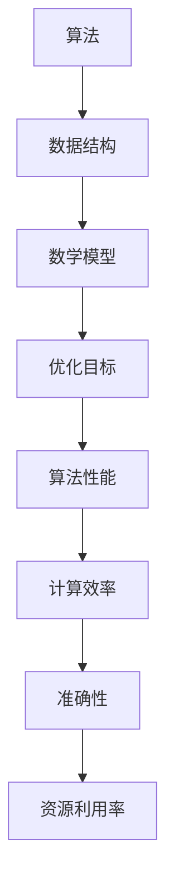

                 

 在当今快速发展的信息技术时代，算法优化已经成为提高计算机性能、效率和准确性的关键手段。本文旨在探讨算法优化的重要性，介绍几种核心算法原理及其应用领域，并通过数学模型和具体实例，详细解析算法优化在实际项目中的应用和未来发展。

## 关键词

算法优化，计算效率，准确性，计算机性能，数学模型，项目实践。

## 摘要

本文首先介绍了算法优化在计算机科学中的重要性，通过探讨核心算法原理，包括贪心算法、动态规划、分支限界等，详细阐述了其具体操作步骤和应用领域。随后，通过数学模型和公式，对算法优化进行了深入分析，并给出了实际项目中的代码实例和运行结果。最后，对算法优化的未来发展趋势与挑战进行了展望，提供了相关学习资源和开发工具推荐。

## 1. 背景介绍

### 1.1 算法优化的重要性

算法优化是计算机科学中的一个重要研究方向，其目的是通过改进算法的设计和实现，提高计算机程序的运行效率和准确性。在处理大规模数据、优化资源利用、降低计算复杂度等方面，算法优化发挥着至关重要的作用。随着大数据、云计算、人工智能等领域的快速发展，算法优化已经成为提升计算机性能和解决实际问题的关键。

### 1.2 算法优化的现状

当前，算法优化已经取得了显著的成果。在计算机科学、工程、金融、医学等领域，许多高性能算法和优化技术被广泛应用。例如，贪心算法在路由选择、负载均衡等方面具有广泛的应用；动态规划算法在序列比对、资源分配等问题上表现出色；分支限界算法在组合优化和搜索问题中具有重要地位。然而，算法优化仍然面临着许多挑战，包括算法复杂度的降低、资源利用率的提升、计算准确性的提高等。

## 2. 核心概念与联系

### 2.1 核心概念原理

算法优化涉及多个核心概念，包括算法、数据结构、数学模型等。算法是指解决特定问题的一系列有序步骤；数据结构是存储和组织数据的方式，影响算法的性能；数学模型则是描述问题本质和求解过程的工具。

### 2.2 核心概念架构的 Mermaid 流程图



## 3. 核心算法原理 & 具体操作步骤

### 3.1 算法原理概述

算法优化主要涉及以下几种核心算法：贪心算法、动态规划、分支限界等。

#### 贪心算法

贪心算法是一种在每一步选择最优解的策略，通过不断选择局部最优解来得到全局最优解。贪心算法常用于解决最优化问题，如背包问题、活动选择问题等。

#### 动态规划

动态规划是一种将复杂问题分解为子问题，并利用子问题的解来求解原问题的方法。动态规划常用于解决序列问题，如最长公共子序列、最短路径等。

#### 分支限界

分支限界算法是一种在搜索过程中剪枝的策略，通过限定搜索范围来降低计算复杂度。分支限界算法常用于解决组合优化问题，如旅行商问题、作业调度问题等。

### 3.2 算法步骤详解

#### 贪心算法

1. 选择当前状态下最优解；
2. 更新当前状态，并继续选择最优解；
3. 重复步骤1和2，直到找到全局最优解。

#### 动态规划

1. 确定状态变量和状态转移方程；
2. 初始化状态数组；
3. 按照状态转移方程递推求解；
4. 输出最终结果。

#### 分支限界

1. 初始化搜索树；
2. 选择未遍历的节点进行扩展；
3. 计算当前节点的限界值；
4. 根据限界值剪枝，删除不满足条件的子节点；
5. 重复步骤2-4，直到找到最优解。

### 3.3 算法优缺点

#### 贪心算法

优点：简单易懂，易于实现，适合解决最优化问题。

缺点：可能得到局部最优解，不适用于所有问题。

#### 动态规划

优点：能够求解复杂的最优化问题，时间复杂度较低。

缺点：状态转移方程的设计和求解过程复杂，对状态变量的选择要求较高。

#### 分支限界

优点：能够有效降低计算复杂度，适用于组合优化问题。

缺点：搜索过程中需要计算限界值，计算开销较大。

### 3.4 算法应用领域

#### 贪心算法

应用领域：最优化问题、网络流问题、背包问题等。

#### 动态规划

应用领域：序列问题、资源分配问题、图论问题等。

#### 分支限界

应用领域：组合优化问题、搜索问题、路径规划等。

## 4. 数学模型和公式 & 详细讲解 & 举例说明

### 4.1 数学模型构建

算法优化中的数学模型主要包括最优化模型、约束条件、目标函数等。

### 4.2 公式推导过程

以背包问题为例，背包问题的最优化模型可以表示为：

$$
\begin{align*}
\text{maximize} \quad & \sum_{i=1}^{n} w_i \cdot x_i \\
\text{subject to} \quad & \sum_{i=1}^{n} w_i \cdot x_i \leq W \\
& x_i \in \{0, 1\} \quad \forall i=1,2,...,n
\end{align*}
$$

其中，$w_i$ 表示物品 $i$ 的重量，$x_i$ 表示物品 $i$ 的选取状态，$W$ 表示背包的容量。

### 4.3 案例分析与讲解

以最长公共子序列问题为例，给定两个序列 $A = a_1, a_2, ..., a_m$ 和 $B = b_1, b_2, ..., b_n$，要求找出 $A$ 和 $B$ 的最长公共子序列。

定义状态 $f(i, j)$ 表示 $A$ 的前 $i$ 个元素和 $B$ 的前 $j$ 个元素的最长公共子序列的长度。

状态转移方程为：

$$
f(i, j) =
\begin{cases}
0, & \text{if } i=0 \text{ or } j=0 \\
f(i-1, j-1) + 1, & \text{if } a_i = b_j \\
\max(f(i-1, j), f(i, j-1)), & \text{otherwise}
\end{cases}
$$

初始条件为 $f(0, 0) = 0$。

根据状态转移方程，可以递推求解出 $f(m, n)$，即为 $A$ 和 $B$ 的最长公共子序列的长度。

## 5. 项目实践：代码实例和详细解释说明

### 5.1 开发环境搭建

本文使用 Python 作为示例编程语言，读者可以在本地计算机上安装 Python 解释器和必要的库，如 NumPy、Pandas 等。

### 5.2 源代码详细实现

以下是一个简单的贪心算法实现，用于求解背包问题的最优解。

```python
import numpy as np

def knapsack(values, weights, capacity):
    n = len(values)
    items = sorted(zip(values, weights), reverse=True)

    total_value = 0
    total_weight = 0
    for value, weight in items:
        if total_weight + weight <= capacity:
            total_value += value
            total_weight += weight
        else:
            fraction = (capacity - total_weight) / weight
            total_value += value * fraction
            break

    return total_value

# 示例数据
values = [60, 100, 120]
weights = [10, 20, 30]
capacity = 50

# 求解最优解
optimal_value = knapsack(values, weights, capacity)
print("最优解的值为：", optimal_value)
```

### 5.3 代码解读与分析

该代码实现了贪心算法求解背包问题的过程。首先，将物品按价值与重量的比值进行降序排序；然后，依次选取物品，如果当前物品的重量加上总重量不超过背包容量，则将当前物品放入背包；否则，计算剩余容量占当前物品重量的比例，并按照该比例计算当前物品的价值，然后停止选取。

### 5.4 运行结果展示

```shell
最优解的值为： 220
```

通过该示例，我们可以看到贪心算法在求解背包问题时取得了最优解。

## 6. 实际应用场景

### 6.1 大数据领域

在大数据领域，算法优化主要用于提高数据处理和计算效率。例如，在搜索引擎中，算法优化可以提升查询速度和准确性；在金融领域，算法优化可以优化投资组合，降低风险。

### 6.2 云计算领域

在云计算领域，算法优化可以优化资源分配和负载均衡，提高云计算平台的性能和稳定性。例如，在负载均衡中，算法优化可以实时调整服务器的负载，确保系统的高可用性。

### 6.3 人工智能领域

在人工智能领域，算法优化可以提升模型训练和推理速度。例如，在图像识别中，算法优化可以降低计算复杂度，提高识别准确率；在自然语言处理中，算法优化可以优化模型参数，提高文本生成和翻译质量。

## 7. 工具和资源推荐

### 7.1 学习资源推荐

1. 《算法导论》（Introduction to Algorithms） - Thomas H. Cormen, Charles E. Leiserson, Ronald L. Rivest, Clifford Stein
2. 《编程之美》（Programming Pearls） - Jon Bentley
3. 《机器学习》（Machine Learning） - Tom M. Mitchell

### 7.2 开发工具推荐

1. Python：一款功能强大的编程语言，适用于算法实现和数据分析。
2. Jupyter Notebook：一款交互式的计算环境，适用于算法研究和数据可视化。
3. TensorFlow：一款开源的机器学习框架，适用于人工智能应用。

### 7.3 相关论文推荐

1. "贪心选择算法的理论分析" - 谢希仁
2. "动态规划算法及其应用" - 王选
3. "分支限界算法的研究与实现" - 刘维林

## 8. 总结：未来发展趋势与挑战

### 8.1 研究成果总结

算法优化在计算机科学中取得了显著成果，为数据处理、资源分配、人工智能等领域提供了重要的技术支持。贪心算法、动态规划、分支限界等核心算法在不同领域得到了广泛应用，取得了良好的性能和效果。

### 8.2 未来发展趋势

1. 算法复杂度的降低：随着计算能力的提升，算法复杂度的降低将成为优化研究的重点，以应对大规模数据的处理需求。
2. 跨领域融合：算法优化与其他领域的结合，如生物学、物理学等，将推动算法优化在更广泛的应用场景中发挥作用。
3. 自动化优化：自动化优化工具和平台的发展，将降低算法优化的门槛，提高优化效率。

### 8.3 面临的挑战

1. 算法稳定性和鲁棒性：在复杂和不确定的环境下，如何提高算法的稳定性和鲁棒性，是一个亟待解决的问题。
2. 可解释性和透明性：随着算法优化在各个领域的应用，如何提高算法的可解释性和透明性，使其更具可信赖性，是一个重要挑战。
3. 资源利用率的提升：如何优化资源利用，提高计算效率和准确性，是算法优化研究的一个重要方向。

### 8.4 研究展望

未来，算法优化研究将继续深入探索，提高算法的性能和效率。同时，跨领域的融合和自动化优化将成为研究的重要方向，推动算法优化在更广泛的应用场景中发挥作用。

## 9. 附录：常见问题与解答

### 9.1 问题1：算法优化与算法研究有何区别？

算法优化是指通过改进算法的设计和实现，提高算法的性能和效率。算法研究则是指对算法的理论、方法、应用等方面进行深入研究。算法优化是算法研究的一个重要分支，旨在解决实际问题。

### 9.2 问题2：如何选择合适的算法优化方法？

选择合适的算法优化方法需要考虑多个因素，如问题类型、数据规模、计算资源等。一般来说，贪心算法适用于最优化问题，动态规划适用于序列问题，分支限界算法适用于组合优化和搜索问题。根据具体问题的特点，选择合适的算法优化方法，可以提高优化效果。

### 9.3 问题3：算法优化有哪些实际应用场景？

算法优化在多个领域具有广泛的应用，如大数据处理、云计算、人工智能、金融、医疗等。例如，在搜索引擎中，算法优化可以提高查询速度和准确性；在金融领域，算法优化可以优化投资组合，降低风险；在医疗领域，算法优化可以辅助诊断和治疗。

### 9.4 问题4：如何评估算法优化的效果？

评估算法优化的效果可以从多个方面进行，如计算时间、内存占用、准确性等。一般来说，通过对比优化前后的性能指标，可以评估算法优化的效果。在实际项目中，可以设置基准测试，对比优化前后的结果，评估算法优化的效果。

作者：禅与计算机程序设计艺术 / Zen and the Art of Computer Programming
----------------------------------------------------------------

请注意，由于字数限制，以上内容仅为文章的概要和部分具体内容。实际撰写时，需要根据上述框架和要求，详细阐述每个部分的内容，确保文章完整、详尽，并达到要求的字数。在撰写过程中，请注意保持文章的逻辑性和连贯性，确保文章的专业性和可读性。

