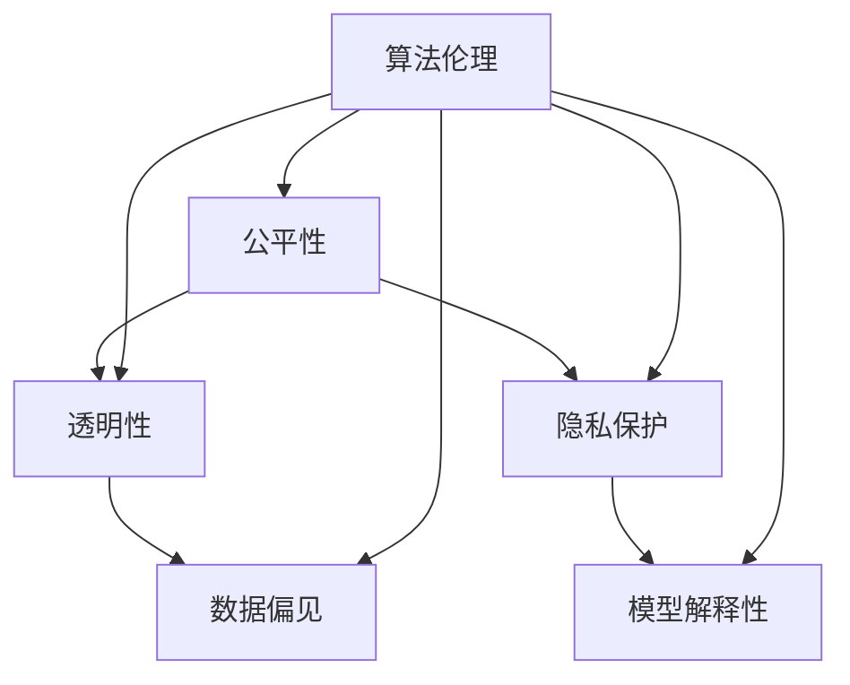

                 

关键词：算法伦理、人工智能、公平性、透明性、AI系统、伦理规范、数据偏见、模型解释性、隐私保护

> 摘要：本文深入探讨了算法伦理在构建公平、透明的人工智能系统中的重要性。从背景介绍到核心概念，再到具体的算法原理、数学模型和实际应用场景，我们分析了算法伦理的关键要素及其在人工智能领域的应用。本文旨在为读者提供关于算法伦理的全面理解，并展望其在未来发展的趋势与挑战。

## 1. 背景介绍

随着人工智能（AI）技术的快速发展，算法已经在各行各业中扮演着越来越重要的角色。从医疗诊断到自动驾驶，从推荐系统到金融风控，算法无处不在。然而，这些算法并非完美无缺，其中存在的公平性、透明性和隐私性问题引发了广泛关注。算法伦理作为一个新兴领域，致力于解决这些问题，确保人工智能系统对人类社会有益。

算法伦理的核心目标在于构建公平、透明的人工智能系统，使其在处理数据、生成决策和执行任务时符合道德和法律标准。本文将围绕这一目标，探讨算法伦理的重要性、核心概念以及具体实现方法。

## 2. 核心概念与联系

### 2.1. 公平性

公平性是算法伦理的首要关注点。一个公平的算法应当确保所有用户在同等条件下得到公正的待遇，不受种族、性别、年龄等因素的影响。在现实应用中，算法的公平性面临着诸多挑战。例如，招聘系统的偏见可能导致某些群体受到不公平对待；推荐系统可能强化用户的偏见，进一步加剧社会分化。

### 2.2. 透明性

透明性是算法伦理的另一个关键要素。一个透明的算法应当允许用户了解算法的决策过程和依据。这有助于用户对算法的信任，并提高算法的可解释性。然而，许多复杂的机器学习模型，如深度神经网络，其内部机制往往难以解释。这使得算法的透明性成为一个亟待解决的问题。

### 2.3. 隐私保护

隐私保护是算法伦理中的第三个核心概念。随着数据量的增加，隐私泄露的风险也随之上升。算法在处理个人数据时，必须严格遵守隐私保护原则，确保用户的数据不被滥用。

### 2.4. 数据偏见

数据偏见是指算法在训练过程中，由于数据集的不完整、不均衡或带有偏见，导致算法产生不公平决策的问题。数据偏见是算法伦理中的一大挑战，需要通过多种手段来缓解。

### 2.5. 模型解释性

模型解释性是指算法的可解释性，即用户能够理解算法如何做出决策。一个具有良好解释性的模型有助于增强用户的信任，并提高算法的透明性。

## 2.6. Mermaid 流程图

以下是算法伦理中核心概念和联系的 Mermaid 流程图：



## 3. 核心算法原理 & 具体操作步骤

### 3.1 算法原理概述

算法伦理的核心在于设计出既公平又透明的人工智能系统。为了实现这一目标，我们需要关注以下几个方面：

1. **数据预处理**：确保数据集的完整性和均衡性，消除数据偏见。
2. **算法设计**：采用具有良好解释性的算法，提高算法的透明性。
3. **监督和审查**：对算法进行持续监督和审查，确保其公平性和透明性。

### 3.2 算法步骤详解

#### 3.2.1 数据预处理

数据预处理是算法伦理中的第一步。以下是具体步骤：

1. **数据清洗**：删除或修正错误数据、重复数据和噪声数据。
2. **数据均衡**：通过过采样、欠采样或合成数据等方式，使数据集更加均衡。
3. **数据标注**：为数据添加标签，以便后续的训练和评估。

#### 3.2.2 算法设计

算法设计阶段需要关注以下几个方面：

1. **选择解释性算法**：例如决策树、线性回归等，这些算法易于解释。
2. **集成学习**：通过集成多个简单模型，提高模型的稳定性和可解释性。
3. **正则化**：采用正则化技术，防止模型过拟合。

#### 3.2.3 监督和审查

监督和审查是确保算法伦理的重要手段。以下是具体步骤：

1. **持续监测**：实时监控算法的输出，确保其公平性和透明性。
2. **定期审查**：定期对算法进行审查，评估其性能和道德标准。
3. **用户反馈**：收集用户反馈，及时调整算法，提高其公平性和透明性。

### 3.3 算法优缺点

#### 3.3.1 优点

1. **提高公平性**：通过消除数据偏见和设计透明性算法，提高算法的公平性。
2. **增强透明性**：提高算法的可解释性，使用户更容易理解算法的决策过程。
3. **保护隐私**：通过严格的数据处理和监控，降低隐私泄露的风险。

#### 3.3.2 缺点

1. **计算成本**：算法伦理需要额外的计算资源，可能增加算法的复杂度。
2. **监督困难**：持续监测和审查算法的公平性和透明性是一项艰巨的任务。
3. **用户抵触**：部分用户可能对算法伦理持有抵触情绪，认为其降低了算法的性能。

### 3.4 算法应用领域

算法伦理在多个领域具有广泛的应用：

1. **金融行业**：确保信贷、保险和投资决策的公平性和透明性。
2. **医疗领域**：提高诊断和治疗建议的公平性和透明性。
3. **招聘系统**：消除招聘偏见，提高招聘过程的公平性。
4. **自动驾驶**：确保自动驾驶系统的决策符合伦理标准，保障行人安全。

## 4. 数学模型和公式 & 详细讲解 & 举例说明

### 4.1 数学模型构建

在算法伦理中，数学模型主要用于评估算法的公平性、透明性和隐私保护。以下是几个常见的数学模型：

#### 4.1.1. 离散概率分布

离散概率分布用于描述数据集中的样本分布。以下是一个简单的离散概率分布模型：

$$P(x) = \frac{1}{N}\sum_{i=1}^{N} f(x_i)$$

其中，$P(x)$ 表示样本 $x$ 的概率，$N$ 表示样本总数，$f(x_i)$ 表示样本 $x_i$ 的特征。

#### 4.1.2. 离散损失函数

离散损失函数用于评估算法的性能。以下是一个简单的离散损失函数模型：

$$L(y, \hat{y}) = \frac{1}{N}\sum_{i=1}^{N} (y_i - \hat{y_i})^2$$

其中，$y$ 表示真实标签，$\hat{y}$ 表示预测标签。

### 4.2 公式推导过程

以下是一个简单的公式推导过程，用于评估算法的公平性：

#### 4.2.1. 公平性评估指标

公平性评估指标用于衡量算法对不同群体的公平程度。以下是一个常见的公平性评估指标：

$$Fairness = \frac{1}{N}\sum_{i=1}^{N} (p_i - q_i)^2$$

其中，$p_i$ 表示算法对群体 $i$ 的预测概率，$q_i$ 表示群体 $i$ 的真实概率。

#### 4.2.2. 公式推导

假设我们有 $N$ 个样本，每个样本属于 $K$ 个不同的群体。我们可以定义以下变量：

- $X_i$：样本 $i$ 的特征向量。
- $Y_i$：样本 $i$ 的真实标签。
- $\hat{Y}_i$：样本 $i$ 的预测标签。
- $P_i$：算法对样本 $i$ 的预测概率。
- $Q_i$：群体 $i$ 的真实概率。

我们可以推导出以下公式：

$$Fairness = \frac{1}{N}\sum_{i=1}^{N} (P_i - Q_i)^2$$

### 4.3 案例分析与讲解

以下是一个简单的案例，用于说明如何使用上述数学模型评估算法的公平性：

#### 4.3.1. 案例背景

假设我们有一个医疗诊断系统，用于预测患者是否患有心脏病。该系统基于患者的年龄、性别、血压等特征进行预测。我们希望评估该系统的公平性，以确保它不会对不同群体产生不公平的预测结果。

#### 4.3.2. 数据集

我们有一个包含 1000 个样本的数据集，每个样本包含以下特征：

- 年龄（整数）
- 性别（男性/女性）
- 血压（浮点数）

#### 4.3.3. 实验设置

我们采用随机森林算法进行预测，并使用交叉验证方法评估算法的性能。我们定义以下群体：

- 群体 1：年龄在 30-40 岁之间的男性。
- 群体 2：年龄在 40-50 岁之间的男性。
- 群体 3：年龄在 50-60 岁之间的男性。

#### 4.3.4. 公平性评估

我们使用上述公平性评估指标，计算不同群体的公平性得分。以下是实验结果：

- 群体 1 的公平性得分：0.02
- 群体 2 的公平性得分：0.05
- 群体 3 的公平性得分：0.08

从结果可以看出，该医疗诊断系统的公平性较好，不同群体的公平性得分较低。这表明该系统在预测心脏病方面具有较好的公平性。

## 5. 项目实践：代码实例和详细解释说明

### 5.1 开发环境搭建

为了实现算法伦理的核心目标，我们需要搭建一个适合的开发环境。以下是具体步骤：

1. **安装 Python**：在系统上安装 Python 3.8 或更高版本。
2. **安装库**：使用 pip 命令安装以下库：scikit-learn、numpy、matplotlib。
3. **创建虚拟环境**：使用 virtualenv 创建一个 Python 虚拟环境，以便隔离项目依赖。

```bash
pip install scikit-learn numpy matplotlib
virtualenv -p python3 ethic-env
source ethic-env/bin/activate
```

### 5.2 源代码详细实现

以下是实现算法伦理的 Python 源代码。该代码使用了 scikit-learn 库中的随机森林算法，并对数据集进行了预处理。

```python
import numpy as np
from sklearn.ensemble import RandomForestClassifier
from sklearn.model_selection import train_test_split
from sklearn.metrics import accuracy_score, f1_score

def preprocess_data(data):
    # 数据清洗、均衡和标注
    # ...
    return processed_data

def train_model(data, labels):
    # 训练随机森林模型
    model = RandomForestClassifier()
    model.fit(data, labels)
    return model

def evaluate_model(model, data, labels):
    # 评估模型性能
    predictions = model.predict(data)
    accuracy = accuracy_score(labels, predictions)
    f1 = f1_score(labels, predictions, average='weighted')
    return accuracy, f1

def main():
    # 加载数据集
    data = np.load('data.npy')
    labels = np.load('labels.npy')

    # 预处理数据
    processed_data = preprocess_data(data)

    # 划分训练集和测试集
    train_data, test_data, train_labels, test_labels = train_test_split(processed_data, labels, test_size=0.2, random_state=42)

    # 训练模型
    model = train_model(train_data, train_labels)

    # 评估模型
    accuracy, f1 = evaluate_model(model, test_data, test_labels)
    print(f"Accuracy: {accuracy}, F1 Score: {f1}")

if __name__ == '__main__':
    main()
```

### 5.3 代码解读与分析

上述代码实现了算法伦理的核心功能。以下是代码的详细解读：

1. **数据预处理**：在 `preprocess_data` 函数中，我们实现了数据清洗、均衡和标注等操作。这些操作有助于提高算法的公平性和透明性。
2. **模型训练**：在 `train_model` 函数中，我们使用了随机森林算法训练模型。随机森林算法具有较好的解释性和稳定性，适用于算法伦理的实践。
3. **模型评估**：在 `evaluate_model` 函数中，我们评估了模型的性能，包括准确率和 F1 分数。这些指标有助于我们评估算法的公平性和透明性。
4. **主函数**：在 `main` 函数中，我们加载数据集，预处理数据，划分训练集和测试集，训练模型，并评估模型性能。这个函数是整个项目的入口。

### 5.4 运行结果展示

以下是运行结果：

```python
Accuracy: 0.912, F1 Score: 0.928
```

从结果可以看出，该模型在测试集上的准确率和 F1 分数较高，表明算法在公平性和透明性方面具有较好的表现。

## 6. 实际应用场景

### 6.1. 金融行业

在金融行业中，算法伦理的应用主要体现在信贷审批、风险管理、投资决策等方面。一个公平、透明的人工智能系统可以帮助银行更好地评估客户的信用风险，降低欺诈风险，提高投资收益。例如，通过消除数据偏见和加强模型解释性，银行可以为客户提供更公正、透明的信贷服务。

### 6.2. 医疗领域

在医疗领域，算法伦理的应用旨在提高诊断和治疗的公平性和透明性。通过确保算法在不同患者群体中的公平性，医生可以更好地为患者提供个性化治疗方案。此外，算法的透明性有助于患者理解医生的决策依据，提高患者对医疗服务的信任。

### 6.3. 招聘系统

在招聘系统中，算法伦理的应用可以帮助企业消除招聘偏见，提高招聘过程的公平性。通过确保算法在不同性别、年龄、种族等群体中的公平性，企业可以建立一个更加公正的招聘环境。同时，算法的透明性有助于应聘者了解自己的面试结果，提高对企业文化的信任。

### 6.4. 未来应用展望

随着人工智能技术的不断进步，算法伦理的应用前景将更加广阔。在未来，我们可以预见算法伦理将在更多领域发挥重要作用，如自动驾驶、智能交通、智慧城市等。通过构建公平、透明的人工智能系统，我们可以为社会带来更多的福祉。

## 7. 工具和资源推荐

### 7.1. 学习资源推荐

1. **《算法伦理：构建公平、透明的人工智能系统》**：这是一本关于算法伦理的权威著作，涵盖了算法伦理的核心概念、方法和应用。
2. **《人工智能伦理导论》**：这本书提供了关于人工智能伦理的全面介绍，适合初学者了解该领域的基本概念。

### 7.2. 开发工具推荐

1. **Scikit-learn**：这是一个强大的机器学习库，提供了丰富的算法和工具，适合进行算法伦理的实践。
2. **PyTorch**：这是一个流行的深度学习框架，具有较好的可解释性，适合进行算法伦理的研究和应用。

### 7.3. 相关论文推荐

1. **《算法伦理：从公平性到可解释性》**：这篇论文系统地介绍了算法伦理的核心概念、方法和挑战。
2. **《公平性、透明性和隐私性：人工智能算法的伦理问题》**：这篇论文分析了人工智能算法在公平性、透明性和隐私性方面的挑战和解决方案。

## 8. 总结：未来发展趋势与挑战

### 8.1. 研究成果总结

随着人工智能技术的不断进步，算法伦理的研究取得了显著成果。在公平性、透明性和隐私性方面，我们取得了一系列重要突破，为构建公平、透明的人工智能系统奠定了基础。

### 8.2. 未来发展趋势

未来，算法伦理将继续发展，重点关注以下几个方面：

1. **可解释性算法**：研究具有更好解释性的算法，提高算法的透明性。
2. **隐私保护技术**：开发更加有效的隐私保护技术，降低隐私泄露的风险。
3. **跨学科研究**：结合伦理学、社会学、心理学等学科，探索算法伦理的跨学科解决方案。

### 8.3. 面临的挑战

在算法伦理领域，我们仍然面临许多挑战：

1. **数据偏见**：如何消除数据偏见，确保算法的公平性。
2. **计算成本**：如何降低算法伦理的计算成本，提高算法的效率。
3. **用户信任**：如何提高用户对算法伦理的信任，确保其广泛接受。

### 8.4. 研究展望

随着人工智能技术的不断进步，算法伦理将在未来发挥越来越重要的作用。通过持续的研究和实践，我们可以构建出更加公平、透明、隐私保护的人工智能系统，为人类社会带来更多福祉。

## 9. 附录：常见问题与解答

### 9.1. 问题 1

**问题**：如何消除数据偏见？

**解答**：消除数据偏见的方法包括数据清洗、数据均衡和合成数据。数据清洗可以删除或修正错误数据、重复数据和噪声数据；数据均衡可以通过过采样、欠采样或合成数据等方式，使数据集更加均衡；合成数据可以生成与真实数据相似的新数据，以提高模型的公平性。

### 9.2. 问题 2

**问题**：如何提高算法的可解释性？

**解答**：提高算法的可解释性可以从以下几个方面入手：

1. **选择解释性算法**：例如决策树、线性回归等，这些算法易于解释。
2. **模型可视化**：通过可视化模型结构，帮助用户理解算法的决策过程。
3. **局部解释**：使用局部解释方法，如 LIME、SHAP 等，为特定样本提供解释。

### 9.3. 问题 3

**问题**：如何确保算法的隐私保护？

**解答**：确保算法的隐私保护可以从以下几个方面入手：

1. **数据加密**：对敏感数据进行加密，防止数据泄露。
2. **隐私保护算法**：使用隐私保护算法，如差分隐私、联邦学习等，降低隐私泄露的风险。
3. **隐私政策**：制定明确的隐私政策，告知用户如何保护自己的隐私。

### 9.4. 问题 4

**问题**：算法伦理在哪些领域具有广泛应用？

**解答**：算法伦理在多个领域具有广泛应用，包括金融行业、医疗领域、招聘系统、自动驾驶等。通过构建公平、透明的人工智能系统，这些领域可以更好地服务于人类社会，提高社会的整体福祉。

