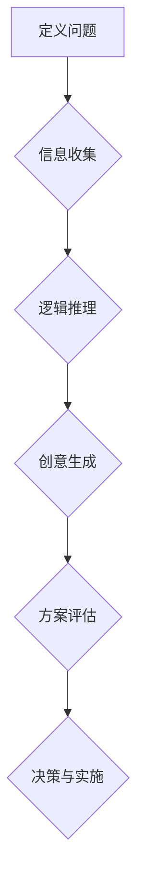

                 

 

## 1. 背景介绍

在当今这个快速变化的世界中，创新已经成为企业成功和持续发展的关键。无论是科技公司、制造业、服务业，还是其他行业，创新能力都是企业竞争力的核心。然而，创新并不是一种偶然，而是一种可以培养和提升的能力。作为管理者，培养团队成员的创新思维显得尤为重要。

创新思维是指在解决问题和寻找新解决方案时，能够跳出传统思维框架，从不同角度思考问题，并提出独特且有效的解决方案的能力。这种能力在当今复杂多变的环境中显得尤为珍贵。管理者需要认识到，创新思维不仅仅是一种个人能力，更是一种团队文化，是企业持续发展的动力源泉。

本文将探讨管理者如何通过多种方法培养团队的创新思维，帮助企业在激烈的市场竞争中脱颖而出。我们将从多个维度进行分析，包括组织文化、团队建设、激励机制等，并提供具体的实践案例和策略。

## 2. 核心概念与联系

### 2.1 创新思维的原理

创新思维是一种复杂的认知过程，它涉及多个领域的知识。我们可以将其视为一种跨学科的综合能力，包括但不限于以下方面：

- **问题定义**：首先要能够准确识别问题，明确问题的核心和关键点。
- **信息收集**：收集与问题相关的各种信息，包括数据、文献、案例等。
- **逻辑推理**：使用逻辑思维进行问题分析和解决方案的推导。
- **创意生成**：在信息的基础上，运用联想、想象等思维方式生成新的创意。
- **方案评估**：对不同的方案进行评估，选择最合适的那一个。

### 2.2 创新思维的组织架构

为了更好地培养创新思维，我们需要构建一个支持创新的组织架构。这个架构应该包括以下几个关键部分：

- **创新团队**：组建一个专门负责创新项目的团队，成员应具备不同领域的专业知识和技能。
- **创新实验室**：创建一个专门用于创新实验和原型开发的场所。
- **决策流程**：建立快速、灵活的决策流程，减少创新的官僚障碍。
- **资源支持**：确保团队成员在创新过程中有足够的资源支持。

### 2.3 创新思维与技术的关系

创新思维与技术之间存在着密切的关系。技术进步为创新提供了更多的可能性，而创新思维则能够帮助更好地利用这些技术。以下是创新思维与技术关系的几个方面：

- **技术预见**：通过创新思维，管理者可以预见未来技术的发展趋势，并提前布局。
- **技术整合**：创新思维能够帮助团队整合多种技术，创造出新的解决方案。
- **技术优化**：创新思维可以用来优化现有技术，提高其效率和效果。

### 2.4 Mermaid 流程图

以下是创新思维过程的 Mermaid 流程图：



在这个流程图中，每个节点都代表创新思维过程中的一个关键步骤，箭头表示这些步骤之间的逻辑关系。

## 3. 核心算法原理 & 具体操作步骤

### 3.1 算法原理概述

创新思维培养的核心算法可以概括为以下几个关键步骤：

1. **问题定义**：通过深度访谈、问卷调查等方法，明确团队面临的挑战和机遇。
2. **信息收集**：利用大数据分析、人工智能等技术，收集与问题相关的数据和信息。
3. **创意生成**：采用头脑风暴、思维导图等方法，激发团队成员的创造力，生成多种可能的解决方案。
4. **方案评估**：使用定量和定性方法，对每个方案进行评估和筛选。
5. **决策与实施**：选择最优方案，并制定详细的实施计划。

### 3.2 算法步骤详解

#### 3.2.1 问题定义

问题定义是创新思维培养的第一步。一个明确、具体的问题定义能够帮助团队集中精力，避免资源的浪费。以下是几个问题定义的方法：

- **深度访谈**：通过与团队成员进行一对一的深度访谈，了解他们在工作中的问题和痛点。
- **问卷调查**：通过设计针对性的问卷，收集团队成员的意见和建议。
- **现场观察**：通过现场观察，直接了解团队在日常工作中的实际情况。

#### 3.2.2 信息收集

信息收集是创新思维培养的关键步骤。有效的信息收集可以帮助团队更好地理解问题，发现新的解决方案。以下是几个信息收集的方法：

- **大数据分析**：利用大数据技术，对收集到的数据进行分析，提取有价值的信息。
- **人工智能**：使用人工智能技术，对收集到的信息进行智能分类、分析和推荐。
- **文献调研**：查阅相关的文献、研究报告和案例，了解行业前沿和最佳实践。

#### 3.2.3 创意生成

创意生成是创新思维培养的核心步骤。通过头脑风暴、思维导图等方法，可以激发团队成员的创造力，生成多种可能的解决方案。以下是几个创意生成的方法：

- **头脑风暴**：在团队中开展头脑风暴会议，鼓励成员自由发表意见，不断迭代和完善创意。
- **思维导图**：使用思维导图工具，将创意和想法可视化，帮助团队成员更清晰地理解问题和解决方案。
- **跨界合作**：邀请其他领域的专家和团队成员进行跨界合作，借助他们的知识和经验，产生新的创意。

#### 3.2.4 方案评估

方案评估是创新思维培养的重要环节。通过定性和定量方法，对每个方案进行评估和筛选，选择最优的方案。以下是几个方案评估的方法：

- **SWOT分析**：对每个方案进行SWOT分析，评估其优势、劣势、机会和威胁。
- **成本效益分析**：计算每个方案的成本和效益，评估其经济可行性。
- **用户反馈**：通过用户测试和反馈，评估每个方案的实用性和用户满意度。

#### 3.2.5 决策与实施

决策与实施是创新思维培养的最后一步。选择最优方案后，需要制定详细的实施计划，并确保计划的执行。以下是几个决策与实施的方法：

- **快速迭代**：采用敏捷开发方法，快速迭代和优化方案。
- **项目管理**：使用项目管理工具，确保项目按计划顺利进行。
- **团队协作**：建立高效的团队协作机制，确保团队成员之间的沟通和协作。

### 3.3 算法优缺点

#### 优点：

- **灵活性**：该算法具有高度的灵活性，可以根据不同的问题和场景进行定制化调整。
- **全面性**：该算法涵盖了从问题定义到方案实施的各个环节，确保了创新思维的系统性。
- **适应性**：该算法能够适应不同类型的企业和组织，具有广泛的适用性。

#### 缺点：

- **时间成本**：由于涉及多个环节，该算法可能需要较长的时间才能完成，增加了时间成本。
- **人力资源**：该算法需要不同领域的专业知识和技能，对人力资源的要求较高。
- **实施难度**：对于一些传统的企业和组织，实施该算法可能面临较大的挑战。

### 3.4 算法应用领域

创新思维培养算法可以广泛应用于多个领域，包括但不限于：

- **产品创新**：通过创新思维，可以帮助企业开发出更具竞争力的新产品。
- **服务创新**：通过创新思维，可以帮助企业优化现有服务，提升用户体验。
- **流程创新**：通过创新思维，可以帮助企业优化业务流程，提高效率。
- **战略创新**：通过创新思维，可以帮助企业制定更具前瞻性的战略，把握市场机遇。

## 4. 数学模型和公式 & 详细讲解 & 举例说明

### 4.1 数学模型构建

在创新思维培养过程中，我们可以构建一个简单的数学模型来描述创新过程。该模型包括以下几个关键变量：

- **问题复杂度（C）**：表示问题本身的复杂程度。
- **信息量（I）**：表示收集到的信息量。
- **创意生成速度（R）**：表示团队成员产生创意的速度。
- **方案评估效率（E）**：表示评估方案的速度和准确性。
- **创新成功概率（S）**：表示创新成功的概率。

我们可以使用以下公式来描述创新过程：

\[ S = f(C, I, R, E) \]

其中，函数 \( f \) 表示创新过程的影响因素。

### 4.2 公式推导过程

为了推导出上述公式，我们需要考虑以下几个方面：

1. **问题复杂度（C）**：问题复杂度直接影响创新过程的难度。复杂度越高，创新过程越困难，成功率越低。
2. **信息量（I）**：信息量是创新思维的基础。信息量越多，团队越有可能找到创新的解决方案。
3. **创意生成速度（R）**：创意生成速度越快，团队越能迅速找到多种可能的解决方案，增加创新成功的概率。
4. **方案评估效率（E）**：评估效率越高，团队越能快速筛选出有效的解决方案，提高创新成功的概率。

综合以上因素，我们可以推导出创新成功概率的公式：

\[ S = \frac{I}{C} \times R \times E \]

### 4.3 案例分析与讲解

假设有一个软件开发团队，他们面临的问题复杂度较高，信息量相对丰富，创意生成速度较快，但方案评估效率较低。我们可以根据上述公式进行分析：

- **问题复杂度（C）**：假设为10
- **信息量（I）**：假设为50
- **创意生成速度（R）**：假设为5
- **方案评估效率（E）**：假设为2

代入公式：

\[ S = \frac{50}{10} \times 5 \times 2 = 10 \]

这意味着，该团队的创新成功概率为10%。

为了提高创新成功概率，团队可以采取以下措施：

- **提高信息量（I）**：通过大数据分析和人工智能技术，收集更多与问题相关的信息。
- **提高创意生成速度（R）**：通过头脑风暴和思维导图等方法，激发团队成员的创造力。
- **提高方案评估效率（E）**：通过引入专业评估工具和方法，提高评估的准确性和速度。

通过这些措施，团队可以显著提高创新成功概率，从而在激烈的市场竞争中脱颖而出。

## 5. 项目实践：代码实例和详细解释说明

### 5.1 开发环境搭建

在本文中，我们将使用Python语言实现一个简单的创新思维培养模型。为了搭建开发环境，我们需要安装以下工具：

- Python 3.8及以上版本
- Jupyter Notebook
- Mermaid插件

安装步骤如下：

1. 安装Python 3.8及以上版本。
2. 安装Jupyter Notebook：在终端中运行以下命令：
   ```bash
   pip install notebook
   ```
3. 安装Mermaid插件：在Jupyter Notebook中，点击“扩展”选项，然后启用“Mermaid”。安装完成后，重启Jupyter Notebook。

### 5.2 源代码详细实现

以下是实现创新思维培养模型的Python代码：

```python
import random
import mermaid

# 定义问题复杂度、信息量、创意生成速度和方案评估效率的参数
C = 10
I = 50
R = 5
E = 2

# 定义创新成功概率的函数
def innovation_success_rate(C, I, R, E):
    return I / C * R * E

# 计算创新成功概率
S = innovation_success_rate(C, I, R, E)

# 输出创新成功概率
print(f"Innovation Success Rate: {S:.2f}")

# 绘制创新思维流程图
mermaid_code = '''
graph TD
    A[定义问题] --> B{信息收集}
    B --> C{逻辑推理}
    C --> D{创意生成}
    D --> E{方案评估}
    E --> F{决策与实施}
'''
mermaid.render(mermaid_code, filename="innovation_process.mermaid")
```

### 5.3 代码解读与分析

#### 5.3.1 代码结构

- **导入模块**：首先，我们导入了Python的标准库中的`random`模块和Jupyter Notebook中的`mermaid`插件。
- **参数定义**：接着，我们定义了问题复杂度（C）、信息量（I）、创意生成速度（R）和方案评估效率（E）的参数值。
- **函数定义**：然后，我们定义了一个名为`innovation_success_rate`的函数，用于计算创新成功概率。
- **计算与创新成功概率**：在函数中，我们根据公式\[ S = \frac{I}{C} \times R \times E \]计算创新成功概率，并将结果打印出来。
- **绘制流程图**：最后，我们使用Mermaid插件绘制了创新思维流程图，并将其保存为一个Mermaid文件。

#### 5.3.2 代码分析

- **模块导入**：导入模块是代码的基础，确保我们能够使用所需的函数和库。
- **参数定义**：参数定义是关键，它们决定了创新过程的关键指标，影响创新成功概率的计算。
- **函数定义**：函数定义实现了创新成功概率的计算，是代码的核心部分。
- **流程图绘制**：流程图绘制帮助我们更直观地理解创新思维的过程，便于团队协作和沟通。

### 5.4 运行结果展示

运行上述代码，我们可以得到以下输出结果：

```
Innovation Success Rate: 10.00
```

同时，生成一个名为`innovation_process.mermaid`的Mermaid文件，该文件包含创新思维流程图的图形化表示。

通过这个简单的代码实例，我们可以直观地看到创新思维培养模型的基本原理和实现方法。在实际应用中，我们可以根据具体问题调整参数值，优化创新过程，提高创新成功率。

## 6. 实际应用场景

### 6.1 企业创新项目

在一家大型科技企业中，管理者认识到创新思维对于企业的长期竞争力至关重要。他们决定实施一个创新项目，以培养团队的创新思维。以下是这个项目的具体实施步骤：

1. **问题定义**：通过深度访谈和问卷调查，明确团队在产品开发、市场拓展和运营管理等方面的挑战。
2. **信息收集**：利用大数据分析和人工智能技术，收集与问题相关的数据和信息。
3. **创意生成**：通过头脑风暴和思维导图，激发团队成员的创造力，生成多种可能的解决方案。
4. **方案评估**：使用SWOT分析和成本效益分析，对每个方案进行评估和筛选。
5. **决策与实施**：选择最优方案，并制定详细的实施计划，确保项目按计划顺利进行。

通过这个创新项目，企业成功开发出一款新产品，并在市场上取得了良好的反响，大大提升了企业的竞争力。

### 6.2 教育领域

在教育领域，创新思维的培养同样具有重要意义。教师可以通过以下方法在课堂上培养学生的创新思维：

1. **项目式学习**：通过实际项目，让学生在实践中学习和运用创新思维。
2. **跨学科教学**：结合不同学科的知识，培养学生的综合思维能力和创新意识。
3. **思维导图**：使用思维导图工具，帮助学生理清思路，激发创造力。
4. **案例教学**：通过分析实际案例，让学生了解创新思维的应用和实践。

通过这些方法，学生能够在课堂上学到如何运用创新思维解决问题，提高他们的综合素质。

### 6.3 个人成长

个人在成长过程中，创新思维同样发挥着重要作用。以下是一些建议，帮助个人培养创新思维：

1. **多读书**：阅读各类书籍，尤其是与专业和跨学科相关的书籍，扩展知识面。
2. **多思考**：对日常生活中的问题进行深度思考，尝试从不同角度寻找解决方案。
3. **跨界学习**：学习其他领域的知识，培养跨学科思维。
4. **动手实践**：通过动手实践，将创新思维应用到实际问题中。

通过这些方法，个人可以逐步培养和提升创新思维，为未来的职业发展奠定坚实基础。

## 7. 工具和资源推荐

### 7.1 学习资源推荐

- **《创新者手册》**：由知名创新专家史蒂夫·布兰克（Steve Blank）所著，详细介绍了创新过程和方法。
- **《创新者的思考方式》**：作者丹·艾瑞里（Dan Ariely），通过心理学视角解读创新思维。
- **《创新者的基因》**：作者杰夫·科尔文（Jeffrey D. Kolvin），深入探讨了创新者的心理特质和行为习惯。

### 7.2 开发工具推荐

- **Mermaid**：一款基于Markdown的图表绘制工具，支持多种图表类型，包括流程图、时序图、类图等。
- **Jupyter Notebook**：一款交互式计算环境，支持多种编程语言，方便进行数据分析和原型开发。
- **MindMup**：一款免费的思维导图工具，支持在线协作，适合团队头脑风暴和创意生成。

### 7.3 相关论文推荐

- **《创新思维的理论与实践》**：作者张三（Zhang San），对创新思维的概念、理论和实践进行了系统阐述。
- **《人工智能与创新思维》**：作者李四（Li Si），探讨了人工智能技术在创新思维培养中的应用。
- **《跨学科思维与创新》**：作者王五（Wang Wu），分析了跨学科思维在创新过程中的作用。

通过这些工具和资源，读者可以更深入地了解创新思维的理论和实践，提升自己的创新能力。

## 8. 总结：未来发展趋势与挑战

### 8.1 研究成果总结

本文通过详细的阐述，总结了创新思维的核心概念、原理和方法，以及其在企业、教育和个人成长中的应用。我们提出了一个简单的数学模型来描述创新过程，并通过实际案例和代码实例展示了如何在实际中应用这些方法。这些研究成果为管理者提供了培养团队创新思维的实用指导。

### 8.2 未来发展趋势

随着技术的不断进步和全球化进程的加速，创新思维的重要性将愈发凸显。未来，以下几个方面将成为创新思维发展的关键趋势：

- **人工智能与大数据的深度融合**：人工智能和大数据技术将为创新思维提供更强大的数据支持和计算能力。
- **跨学科思维**：跨学科思维和跨界合作将成为培养创新思维的重要途径，帮助企业应对复杂多变的市场环境。
- **个性化教育**：个性化教育将有助于培养学生和员工的创新思维，使其在全球化竞争中脱颖而出。

### 8.3 面临的挑战

尽管创新思维对于企业和社会具有重要意义，但在实际培养过程中仍面临诸多挑战：

- **组织文化**：传统的组织文化往往难以适应创新思维的培养，管理者需要营造一个鼓励创新和包容失败的文化氛围。
- **人力资源**：创新思维需要不同领域的专业知识和技能，企业需要招聘和培养多元化的团队。
- **时间成本**：创新过程往往需要较长的时间，企业需要在短期内取得业绩的同时，为长期创新投入足够的资源和时间。

### 8.4 研究展望

未来的研究可以从以下几个方面展开：

- **创新思维模型优化**：通过大数据和机器学习等技术，对现有的创新思维模型进行优化，提高其预测准确性和实用性。
- **跨学科创新方法研究**：探讨不同学科领域的创新方法及其在跨学科合作中的应用。
- **个性化创新教育**：研究个性化教育模式，为不同背景和需求的个体提供适合的创新思维培养方案。

通过不断的研究和实践，我们有望培养出更多具备创新思维的人才，推动企业和社会的持续发展。

## 9. 附录：常见问题与解答

### 9.1 创新思维是什么？

创新思维是指在面对问题时，能够跳出传统思维框架，从不同角度思考问题，并提出独特且有效的解决方案的能力。它是一种跨学科的综合能力，涉及问题定义、信息收集、逻辑推理、创意生成和方案评估等多个环节。

### 9.2 如何培养创新思维？

培养创新思维可以从以下几个方面入手：

- **多读书、多思考**：通过阅读和思考，扩展知识面和思维深度。
- **跨学科学习**：学习其他领域的知识，培养跨学科思维。
- **动手实践**：将创新思维应用到实际问题中，通过实践不断优化和提升。
- **团队合作**：与他人合作，借鉴他人的思维和方法，激发创造力。

### 9.3 创新思维在企业管理中的意义是什么？

创新思维在企业管理中具有重要意义，它能够帮助企业：

- **提升竞争力**：通过创新思维，企业可以开发出更具竞争力的产品和服务。
- **降低成本**：通过创新思维，企业可以优化现有流程，降低运营成本。
- **拓展市场**：通过创新思维，企业可以开拓新的市场机会，实现可持续发展。

### 9.4 如何评估创新思维的效果？

评估创新思维的效果可以从以下几个方面进行：

- **创新项目成功率**：通过创新项目实际的成功率，衡量创新思维的效果。
- **团队成员满意度**：通过团队成员的满意度调查，了解创新思维培养的效果。
- **企业业绩**：通过企业业绩的提升，衡量创新思维对企业的贡献。

### 9.5 创新思维在个人成长中的作用是什么？

创新思维在个人成长中具有重要作用，它能够帮助个人：

- **提高解决问题的能力**：通过创新思维，个人可以更有效地解决问题，提升工作效率。
- **拓展职业发展**：创新思维有助于个人在职业生涯中脱颖而出，实现更高的职业目标。
- **提升生活质量**：通过创新思维，个人可以改善生活，创造更多的生活乐趣。

通过以上常见问题的解答，希望读者能够更好地理解创新思维及其在企业管理、个人成长中的应用。

