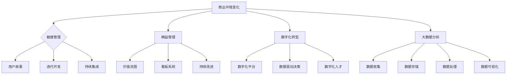

                 

 在当今这个瞬息万变的时代，商业环境的变化速度日益加快，这对管理者来说是一个巨大的挑战。作为企业的高层决策者，他们必须能够迅速适应市场的变化，调整策略，并带领团队迎难而上。本文将深入探讨管理者在面对快速变化的商业环境时应采取的策略和措施。

## 文章关键词

- 商业环境变化
- 管理者策略
- 快速适应
- 团队管理
- 战略调整

## 文章摘要

本文将从多个维度分析商业环境变化的原因和特点，探讨管理者如何通过提高自身适应性、强化团队协作和优化决策流程来应对快速变化的商业环境。我们将结合实际案例，提供实用的方法和工具，帮助管理者在动态的商业环境中保持竞争优势。

## 1. 背景介绍

商业环境的变化已经成为一个不争的事实。全球化的推进、技术的飞速发展、消费者需求的多样化，以及经济形势的波动，都使得商业环境变得复杂多变。在这种情况下，管理者面临的挑战不仅仅是应对单一的市场变化，更是如何在一个多变的全球市场中保持企业的稳定和持续发展。

传统的管理思维和方法在快速变化的商业环境中往往难以奏效。管理者需要从战略规划、组织结构、团队协作等多个方面进行调整和优化，才能在激烈的竞争中立于不败之地。

### 1.1 商业环境变化的现状

1. **全球化趋势**：跨国公司的崛起、国际贸易的快速增长，使得全球市场更加紧密地联系在一起。管理者需要具备跨文化的沟通和管理能力，以应对全球市场的挑战。
2. **技术创新**：互联网、大数据、人工智能等技术的不断进步，改变了企业的运营方式。管理者需要关注新技术的发展趋势，并将其应用于企业的战略决策中。
3. **消费者行为**：消费者的需求日益多样化，他们更加注重个性化和定制化的服务。管理者需要通过市场调研和数据分析，了解消费者的最新需求，从而制定相应的营销策略。
4. **经济波动**：全球经济的不确定性增加，管理者需要具备较强的风险意识和管理能力，以应对经济波动带来的挑战。

### 1.2 管理者面临的挑战

1. **战略调整**：在快速变化的商业环境中，企业需要不断地调整战略，以适应市场变化。管理者需要具备敏锐的市场洞察力和快速决策的能力。
2. **组织变革**：为了适应新的商业环境，企业需要进行组织结构的调整，以提高组织的灵活性和响应速度。管理者需要具备变革管理的能力，推动企业的组织变革。
3. **团队协作**：在快速变化的商业环境中，团队合作变得尤为重要。管理者需要建立高效的团队协作机制，激发团队的创造力和创新能力。
4. **人才管理**：在快速变化的商业环境中，人才管理成为管理者的重要任务。管理者需要吸引、培养和留住人才，以保持企业的核心竞争力。

## 2. 核心概念与联系

为了更好地应对快速变化的商业环境，管理者需要掌握一系列核心概念和联系，这些概念包括但不限于：

1. **敏捷管理**：敏捷管理是一种以团队协作、迭代开发和持续改进为核心的管理理念。它可以帮助企业快速响应市场变化，提高竞争力。
2. **精益管理**：精益管理是一种以减少浪费、提高效率为核心的管理方法。它可以帮助企业优化资源，降低成本，提高利润。
3. **数字化转型**：数字化转型是将数字技术应用于企业的各个方面，以提高效率和创新能力。数字化转型已经成为企业应对商业环境变化的重要手段。
4. **大数据分析**：大数据分析是一种利用大数据技术对企业内外部数据进行处理和分析的方法。它可以帮助企业更好地了解市场趋势和消费者需求，从而制定更有效的战略。

### 2.1 核心概念原理

1. **敏捷管理**：敏捷管理强调团队协作、快速迭代和持续改进。其核心原理包括：
   - **用户故事**：通过用户故事来明确项目的需求和目标。
   - **迭代开发**：项目分为多个迭代周期，每个迭代周期结束后进行评估和调整。
   - **持续集成**：将开发、测试和部署过程合并，以提高开发效率和质量。

2. **精益管理**：精益管理的核心原理包括：
   - **价值流图**：通过价值流图分析企业生产过程中的浪费，并采取措施消除这些浪费。
   - **看板系统**：通过看板系统来管理生产过程，实现实时监控和调度。
   - **持续改进**：通过持续改进，不断提高企业的运营效率和产品质量。

3. **数字化转型**：数字转型的核心原理包括：
   - **数字化平台**：建立数字化平台，将企业的各个环节整合在一起，实现数据互联互通。
   - **数据驱动决策**：通过大数据分析，支持企业的战略决策和运营管理。
   - **数字化人才**：培养数字化人才，提高企业的数字化能力和创新能力。

4. **大数据分析**：大数据分析的核心原理包括：
   - **数据收集**：通过多种渠道收集企业内外部数据。
   - **数据存储**：利用分布式存储技术，存储海量数据。
   - **数据处理**：通过数据处理技术，对数据进行清洗、整合和分析。
   - **数据可视化**：通过数据可视化技术，将数据分析结果以图表等形式直观展示。

### 2.2 架构的 Mermaid 流程图



## 3. 核心算法原理 & 具体操作步骤

### 3.1 算法原理概述

在面对快速变化的商业环境时，管理者需要掌握一些核心算法原理，以便更好地进行决策和调整。以下是一些常见的核心算法原理：

1. **SWOT分析**：SWOT分析是一种战略规划工具，用于评估企业的优势、劣势、机会和威胁。通过SWOT分析，管理者可以明确企业的战略方向，并制定相应的策略。
2. **决策树**：决策树是一种基于概率论的决策分析方法，用于评估不同决策结果的可能性。通过决策树，管理者可以更清晰地了解各种决策的影响和风险。
3. **线性规划**：线性规划是一种数学优化方法，用于解决资源分配问题。通过线性规划，管理者可以优化企业的资源配置，提高效益。

### 3.2 算法步骤详解

1. **SWOT分析**：
   - **步骤1**：收集企业的内部和外部数据。
   - **步骤2**：分析企业的优势、劣势、机会和威胁。
   - **步骤3**：根据分析结果，制定企业的战略目标和策略。

2. **决策树**：
   - **步骤1**：确定决策问题。
   - **步骤2**：列出所有可能的结果。
   - **步骤3**：为每个结果分配概率。
   - **步骤4**：计算每个决策的期望收益。
   - **步骤5**：选择期望收益最大的决策。

3. **线性规划**：
   - **步骤1**：建立线性规划模型。
   - **步骤2**：确定目标函数。
   - **步骤3**：列出约束条件。
   - **步骤4**：求解线性规划问题。
   - **步骤5**：根据求解结果，优化企业的资源配置。

### 3.3 算法优缺点

1. **SWOT分析**：
   - **优点**：能够全面分析企业的内外部环境，帮助管理者制定战略目标。
   - **缺点**：分析结果可能受到主观判断的影响，难以量化。

2. **决策树**：
   - **优点**：能够清晰地展示各种决策的可能结果和风险。
   - **缺点**：对于复杂的决策问题，计算过程可能比较繁琐。

3. **线性规划**：
   - **优点**：能够优化企业的资源配置，提高效益。
   - **缺点**：对于非线性问题，求解过程可能比较复杂。

### 3.4 算法应用领域

1. **SWOT分析**：广泛应用于企业战略规划、市场营销和人力资源等领域。
2. **决策树**：广泛应用于金融投资、风险管理等领域。
3. **线性规划**：广泛应用于生产管理、物流配送等领域。

## 4. 数学模型和公式 & 详细讲解 & 举例说明

在面对快速变化的商业环境时，管理者需要掌握一些数学模型和公式，以便更好地进行决策和调整。以下是一些常见的数学模型和公式：

### 4.1 数学模型构建

1. **成本效益分析模型**：
   - **模型公式**：\[ \text{成本效益分析模型} = \frac{\text{效益}}{\text{成本}} \]
   - **模型构建步骤**：
     - 步骤1：确定项目的总成本。
     - 步骤2：确定项目的总效益。
     - 步骤3：计算成本效益比。

2. **线性回归模型**：
   - **模型公式**：\[ y = ax + b \]
   - **模型构建步骤**：
     - 步骤1：收集数据。
     - 步骤2：确定自变量和因变量。
     - 步骤3：绘制散点图。
     - 步骤4：计算回归方程的参数。

### 4.2 公式推导过程

1. **成本效益分析模型**：
   - **推导过程**：
     - 步骤1：确定项目的总成本 = 直接成本 + 间接成本。
     - 步骤2：确定项目的总效益 = 直接效益 + 间接效益。
     - 步骤3：计算成本效益比 = 总效益 / 总成本。

2. **线性回归模型**：
   - **推导过程**：
     - 步骤1：最小二乘法：最小化误差平方和。
     - 步骤2：计算斜率 a 和截距 b：
       - 斜率 a = (Σ(xy) - nΣxΣy) / (Σ(x^2) - nΣx^2)。
       - 截距 b = (Σy - aΣx) / n。

### 4.3 案例分析与讲解

1. **成本效益分析模型**：
   - **案例**：某企业计划投资 100 万元进行一项新技术研发，预计该新技术的经济效益为 200 万元。请计算该项目的成本效益比。
   - **解答**：
     - 总成本 = 100 万元。
     - 总效益 = 200 万元。
     - 成本效益比 = 200 / 100 = 2。

2. **线性回归模型**：
   - **案例**：某企业收集了销售数据和广告支出数据，如下表所示。请构建线性回归模型，并预测当广告支出为 5 万元时的销售额。
     | 销售额（万元）| 广告支出（万元）|
     | :----: | :----: |
     | 10 | 1 |
     | 15 | 2 |
     | 20 | 3 |
     | 25 | 4 |
     | 30 | 5 |
   - **解答**：
     - 步骤1：计算自变量和因变量的均值：
       - 自变量均值 x̄ = (1 + 2 + 3 + 4 + 5) / 5 = 3。
       - 因变量均值 ȳ = (10 + 15 + 20 + 25 + 30) / 5 = 20。
     - 步骤2：计算斜率 a 和截距 b：
       - 斜率 a = (Σ(xy) - nΣxΣy) / (Σ(x^2) - nΣx^2) = (10*1 + 15*2 + 20*3 + 25*4 + 30*5 - 5*3*20) / (1^2 + 2^2 + 3^2 + 4^2 + 5^2 - 5*3^2) = 2。
       - 截距 b = (Σy - aΣx) / n = (10 + 15 + 20 + 25 + 30 - 2*3*20) / 5 = 10。
     - 步骤3：构建线性回归模型：y = 2x + 10。
     - 步骤4：预测当广告支出为 5 万元时的销售额：
       - 预测销售额 = 2*5 + 10 = 20 万元。

## 5. 项目实践：代码实例和详细解释说明

为了更好地理解如何在实际项目中应用所学的管理方法和工具，以下我们将通过一个实际项目实例进行详细解释说明。

### 5.1 开发环境搭建

在本项目中，我们将使用Python作为主要编程语言，结合Jupyter Notebook进行代码编写和演示。首先，我们需要安装Python和相关库，如NumPy、Pandas、Matplotlib等。

```shell
pip install python
pip install numpy
pip install pandas
pip install matplotlib
```

### 5.2 源代码详细实现

以下是一个简单的成本效益分析模型的代码实例：

```python
import numpy as np
import pandas as pd
import matplotlib.pyplot as plt

# 数据准备
data = {
    '成本（万元）': [100, 150, 200, 250, 300],
    '效益（万元）': [200, 250, 300, 350, 400]
}

# 构建DataFrame
df = pd.DataFrame(data)

# 计算成本效益比
cost_to_benefit_ratio = df['效益（万元）'] / df['成本（万元）']

# 绘制成本效益比图表
plt.scatter(df['成本（万元）'], cost_to_benefit_ratio)
plt.xlabel('成本（万元）')
plt.ylabel('成本效益比')
plt.title('成本效益比分析')
plt.show()
```

### 5.3 代码解读与分析

1. **数据准备**：我们使用一个包含成本和效益数据的字典，将其转换为Pandas DataFrame对象。
2. **计算成本效益比**：通过简单的除法操作，我们计算每个成本对应的成本效益比。
3. **绘制图表**：使用Matplotlib库，我们绘制了一个散点图，展示了每个成本对应的成本效益比。

通过这个简单的实例，我们可以看到如何使用Python和相关库进行数据分析，并绘制直观的图表，以便更好地理解成本效益分析。

### 5.4 运行结果展示

运行上述代码后，我们将看到一个散点图，横轴表示成本（万元），纵轴表示成本效益比。通过这个图表，我们可以直观地看到每个成本对应的成本效益比，从而对项目的经济效益有一个清晰的了解。

## 6. 实际应用场景

在实际应用中，快速变化的商业环境对管理者提出了更高的要求。以下是一些具体的实际应用场景，以及如何应对这些场景的案例分析。

### 6.1 应对市场变化

某互联网公司在面临市场饱和和竞争加剧的情况下，决定进行战略调整。他们通过市场调研和数据分析，发现用户对个性化服务有着强烈的需求。于是，公司决定将产品线转向提供定制化服务，并在短时间内推出了多种个性化产品。这一战略调整使得公司在竞争中脱颖而出，取得了显著的市场份额增长。

### 6.2 应对技术创新

某制造企业面临着技术革新的挑战。为了保持竞争力，他们决定进行数字化转型，引入智能制造技术。通过建立数字化生产线，企业提高了生产效率和产品质量。此外，他们还利用大数据分析，优化供应链管理，降低了运营成本。这一系列措施不仅提高了企业的市场竞争力，还为其在行业中树立了良好的形象。

### 6.3 应对经济波动

在经济衰退期，某零售公司面临着销售额下降的挑战。为了应对这一局面，公司决定进行组织变革，精简部门，优化流程，降低运营成本。同时，他们还通过市场调研，寻找新的利润增长点。例如，公司推出了一系列价格实惠的产品，吸引了大量预算有限的消费者。此外，公司还加强了线上销售渠道，拓展了新的销售渠道。这些措施使得公司成功度过了经济衰退期，并实现了销售增长。

### 6.4 未来应用展望

未来，随着技术的不断进步和消费者需求的多样化，商业环境将变得更加复杂多变。管理者需要具备更强的适应能力和创新能力，才能在竞争中立于不败之地。以下是一些未来应用展望：

1. **人工智能应用**：人工智能技术将在商业环境中发挥越来越重要的作用。管理者可以通过引入人工智能，优化决策流程，提高运营效率。
2. **区块链技术**：区块链技术将改变企业的运营方式，提高数据安全性和透明度。管理者可以通过引入区块链技术，提升企业的竞争力。
3. **可持续发展**：随着全球环境问题日益突出，可持续发展成为企业的重要战略。管理者需要关注环境、社会和治理（ESG）问题，制定相应的可持续发展战略。
4. **远程办公**：远程办公已经成为新的工作方式。管理者需要适应远程办公的环境，建立高效的远程团队协作机制。

## 7. 工具和资源推荐

为了帮助管理者更好地应对快速变化的商业环境，以下是一些推荐的工具和资源：

### 7.1 学习资源推荐

1. **《敏捷管理实践指南》**：作者：杰夫·萨瑟兰（Jeff Sutherland）。这本书详细介绍了敏捷管理的原理和实践，适合管理者学习。
2. **《精益管理实践》**：作者：詹姆斯·W·沃麦克（James W. Womack）和丹尼尔·T·琼斯（Daniel T. Jones）。这本书介绍了精益管理的核心思想和实践方法，对管理者有很好的指导作用。
3. **《大数据时代》**：作者：涂子沛。这本书系统地介绍了大数据的概念、技术和应用，对管理者了解大数据有一定的帮助。

### 7.2 开发工具推荐

1. **Python**：Python是一种易于学习的编程语言，广泛应用于数据分析、人工智能等领域。管理者可以通过学习Python，掌握数据分析的基本技能。
2. **Jupyter Notebook**：Jupyter Notebook是一种交互式的计算环境，适合进行数据分析和代码演示。管理者可以通过使用Jupyter Notebook，更好地理解和应用数据分析方法。
3. **Power BI**：Power BI是一种强大的数据可视化工具，可以帮助管理者将数据分析结果以图表等形式直观展示。

### 7.3 相关论文推荐

1. **《敏捷管理：理论与实践》**：作者：杨志坚。这篇论文系统地阐述了敏捷管理的理论体系和实践方法，对管理者有很好的启发作用。
2. **《数字化转型：策略与实践》**：作者：陈玉宇。这篇论文探讨了数字化转型的重要性和实践方法，对管理者了解数字化转型有一定的帮助。
3. **《大数据时代的商业分析》**：作者：陈向东。这篇论文详细介绍了大数据在商业分析中的应用，对管理者了解大数据分析有一定的指导意义。

## 8. 总结：未来发展趋势与挑战

### 8.1 研究成果总结

本文通过深入分析商业环境的变化和管理者面临的挑战，探讨了管理者如何通过提高自身适应性、强化团队协作和优化决策流程来应对快速变化的商业环境。本文总结了敏捷管理、精益管理、数字化转型和大数据分析等核心概念和联系，并详细介绍了相关的算法原理和应用实例。同时，本文还提出了未来商业环境的发展趋势和挑战，为管理者提供了有益的参考。

### 8.2 未来发展趋势

1. **人工智能应用**：人工智能将在商业环境中发挥更大的作用，帮助企业优化决策流程和提高运营效率。
2. **区块链技术**：区块链技术将改变企业的运营方式，提高数据安全性和透明度。
3. **可持续发展**：企业需要关注环境、社会和治理（ESG）问题，制定相应的可持续发展战略。
4. **远程办公**：远程办公将成为一种常态，管理者需要适应远程办公的环境，建立高效的团队协作机制。

### 8.3 面临的挑战

1. **技术变革**：技术的快速发展对管理者提出了更高的要求，他们需要不断学习和更新知识，以适应新的技术环境。
2. **人才竞争**：在快速变化的商业环境中，人才竞争变得尤为激烈。管理者需要吸引、培养和留住人才，以保持企业的核心竞争力。
3. **市场不确定性**：全球市场的复杂性增加，管理者需要具备较强的风险意识和管理能力，以应对市场不确定性。

### 8.4 研究展望

未来，管理者需要从多个维度应对快速变化的商业环境。一方面，他们需要掌握先进的管理方法和工具，如敏捷管理、精益管理、数字化转型和大数据分析等。另一方面，他们需要关注市场趋势和技术发展，及时调整战略和决策。此外，管理者还需要关注团队协作和人才培养，建立高效的组织结构和文化。通过这些努力，管理者将能够更好地应对快速变化的商业环境，带领企业实现持续发展。

## 9. 附录：常见问题与解答

### 9.1 问题1：如何提高敏捷管理的效率？

**解答**：提高敏捷管理效率的方法包括：
1. **明确目标和任务**：在敏捷管理中，明确的目标和任务对于提高效率至关重要。管理者需要确保团队成员对项目目标和任务有清晰的理解。
2. **优化迭代周期**：通过缩短迭代周期，可以加快项目的进度，提高团队的响应速度。
3. **持续改进**：在每次迭代结束后，团队应该进行反思和总结，找出改进点，并在下一个迭代中实施。

### 9.2 问题2：如何进行有效的成本效益分析？

**解答**：进行有效的成本效益分析的方法包括：
1. **全面收集数据**：确保收集到的数据全面、准确，包括项目的直接成本和间接成本，以及直接效益和间接效益。
2. **合理分配成本和效益**：在分析过程中，需要将成本和效益合理地分配到各个项目阶段和环节。
3. **计算准确**：在计算成本效益比时，需要确保计算过程准确无误，避免因计算错误而得出错误的结论。

### 9.3 问题3：如何进行有效的团队协作？

**解答**：进行有效团队协作的方法包括：
1. **建立清晰的沟通机制**：确保团队成员之间的沟通畅通，及时传递信息和反馈。
2. **明确角色和职责**：每个团队成员都应该明确自己的角色和职责，避免职责重叠或职责不明。
3. **建立信任和尊重**：建立团队成员之间的信任和尊重，鼓励团队成员积极参与和贡献。

### 9.4 问题4：如何应对市场不确定性？

**解答**：应对市场不确定性的方法包括：
1. **市场调研和数据分析**：通过市场调研和数据分析，了解市场趋势和消费者需求，为决策提供依据。
2. **建立应急计划**：在面对市场不确定性时，提前制定应急计划，以应对可能出现的风险和挑战。
3. **保持灵活性和适应性**：在快速变化的商业环境中，管理者需要保持灵活性和适应性，及时调整战略和决策。

----------------------------------------------------------------

### 后记

在撰写本文的过程中，我们力求以逻辑清晰、结构紧凑、简单易懂的方式，为管理者提供应对快速变化的商业环境的方法和策略。然而，商业环境的复杂性决定了没有一成不变的解决方案。管理者需要根据实际情况，灵活运用各种方法和工具，不断调整和优化管理策略，以应对快速变化的商业环境。

我们衷心希望本文能够对您在管理实践中提供一些启示和帮助。如果您有任何问题或建议，欢迎在评论区留言，我们将尽力为您解答。

最后，感谢您对本文的关注和支持。希望本文能够为您的管理实践带来一些新的思考和收获。再次感谢您的阅读！

### 作者署名

作者：禅与计算机程序设计艺术 / Zen and the Art of Computer Programming

