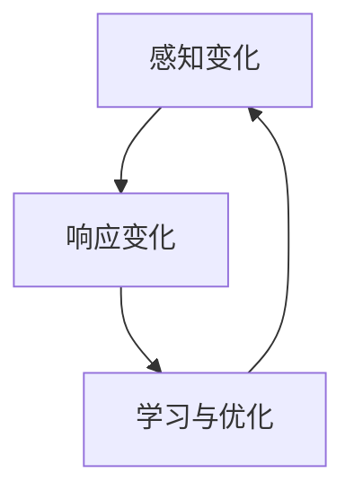

                 

 在当今这个数字化和全球化的时代，商业环境的变化速度前所未有，对于管理者来说，如何适应和应对这种快速变化的环境成为了至关重要的挑战。本文将探讨一些核心策略和方法，帮助管理者在快速变化的商业环境中保持竞争力，实现可持续发展。

## 关键词

- 快速变化
- 商业环境
- 管理策略
- 适应性
- 持续发展

## 摘要

本文旨在提供一套针对快速变化的商业环境的管理策略。通过对市场动态的敏感度、组织结构、技术创新、人才培养等方面进行深入分析，本文将提出一系列实用的指导原则，帮助管理者提升应对快速变化的能力，从而在激烈的市场竞争中立于不败之地。

## 1. 背景介绍

### 1.1 商业环境的变化趋势

随着信息技术的迅猛发展，商业环境的变化趋势呈现出以下特点：

- **数字化加速**：数据成为新的资产，数字化转型成为企业提升竞争力的关键。
- **全球化加剧**：贸易壁垒的降低和全球化的深入，使企业面临更为广泛的市场竞争。
- **不确定性增加**：市场变化的不确定性增加，要求企业具备更高的适应能力。

### 1.2 管理者面临的挑战

在快速变化的商业环境中，管理者面临以下挑战：

- **决策难度加大**：信息过载和不确定性使得决策变得更加复杂。
- **组织结构僵化**：传统组织结构往往难以适应快速变化的市场需求。
- **人才流失风险**：高素质人才的流动性和忠诚度下降，对企业的长期发展构成威胁。

## 2. 核心概念与联系

### 2.1 适应性管理

适应性管理是指企业通过不断调整和优化自身的结构和策略，以适应不断变化的外部环境。以下是适应性管理的核心概念和流程：

- **感知变化**：通过市场调研、数据分析等手段，及时感知市场变化。
- **响应变化**：根据感知到的变化，快速调整组织结构和业务策略。
- **学习与优化**：从变化中学习，不断优化管理流程和策略。

### 2.2 Mermaid 流程图

以下是一个简化的 Mermaid 流程图，展示了适应性管理的基本流程：



## 3. 核心算法原理 & 具体操作步骤

### 3.1 算法原理概述

适应性管理算法的核心原理是反馈循环。通过持续监测外部环境的变化，企业能够及时调整内部结构和管理策略，从而保持适应性。

### 3.2 算法步骤详解

#### 3.2.1 感知变化

1. **市场调研**：通过问卷调查、访谈等方式，了解市场需求和竞争对手情况。
2. **数据监控**：利用大数据分析技术，实时监控市场动态和客户反馈。

#### 3.2.2 响应变化

1. **组织调整**：根据市场变化，调整组织结构，如设立专门的项目团队或跨部门协作小组。
2. **业务策略调整**：根据市场反馈，调整产品策略、定价策略等。

#### 3.2.3 学习与优化

1. **经验总结**：对过去的变化和调整进行总结，识别成功和失败的原因。
2. **持续改进**：基于经验总结，不断优化管理流程和策略。

### 3.3 算法优缺点

#### 优点：

- **快速响应**：能够迅速应对市场变化，提高企业的市场竞争力。
- **持续优化**：通过不断学习和优化，提高企业的适应性和创新能力。

#### 缺点：

- **决策成本**：持续调整和优化的过程需要大量的人力、物力和时间投入。
- **风险增加**：快速变化可能带来不确定性和风险，需要管理者具备较高的风险意识和管理能力。

### 3.4 算法应用领域

适应性管理算法适用于各类企业，尤其适合那些面临高度竞争和快速变化的市场环境的企业。例如，互联网公司、科技创新企业等。

## 4. 数学模型和公式 & 详细讲解 & 举例说明

### 4.1 数学模型构建

适应性管理算法的数学模型可以表示为：

\[ \text{适应性管理} = f(\text{感知变化}, \text{响应变化}, \text{学习与优化}) \]

其中，\( f \) 表示适应性管理的效果，取决于感知变化、响应变化和学习与优化的效果。

### 4.2 公式推导过程

#### 感知变化

\[ \text{感知变化} = \sum_{i=1}^{n} \text{变化指标} \cdot \text{权重} \]

其中，\( n \) 表示变化的指标数量，每个指标根据其重要程度分配相应的权重。

#### 响应变化

\[ \text{响应变化} = \text{调整策略} \cdot \text{执行效率} \]

其中，调整策略根据感知变化的结果，执行效率取决于组织结构和流程的优化程度。

#### 学习与优化

\[ \text{学习与优化} = \text{经验总结} \cdot \text{改进力度} \]

其中，经验总结基于过去的调整和优化过程，改进力度取决于企业的创新能力和执行力。

### 4.3 案例分析与讲解

#### 案例一：互联网公司应对市场竞争

一家互联网公司通过持续监测市场动态，发现用户对在线教育平台的需求日益增长。公司迅速调整业务策略，增加在线教育产品线的投入，并通过数据分析优化用户体验。同时，公司从竞争对手的成功和失败中学习，不断改进产品和服务。最终，公司在激烈的市场竞争中脱颖而出。

#### 案例二：传统企业数字化转型

一家传统制造企业意识到数字化转型的必要性。公司通过市场调研和数据分析，识别出潜在的市场机会。公司调整组织结构，设立数字化部门，并引入先进的生产技术和供应链管理系统。通过不断的学习和优化，公司成功地实现了数字化转型，提升了生产效率和产品质量。

## 5. 项目实践：代码实例和详细解释说明

### 5.1 开发环境搭建

在本次项目中，我们将使用 Python 语言进行适应性管理算法的实现。以下是开发环境的搭建步骤：

1. 安装 Python 3.8 及以上版本。
2. 安装必要的库，如 NumPy、Pandas、Matplotlib 等。

### 5.2 源代码详细实现

以下是一个简单的适应性管理算法的 Python 代码示例：

```python
import numpy as np
import pandas as pd

# 感知变化
def sense_changes(data):
    # 假设 data 是一个包含市场指标的数据帧
    return np.sum(data) * 0.5

# 响应变化
def respond_changes(strategy, efficiency):
    return strategy * efficiency

# 学习与优化
def learn_and_optimize(experience, improvement):
    return experience * improvement

# 适应性管理算法
def adaptive_management(data, strategy, efficiency, experience, improvement):
    change_detected = sense_changes(data)
    if change_detected > 0:
        new_strategy = respond_changes(strategy, efficiency)
        new_experience = learn_and_optimize(experience, improvement)
        return new_strategy, new_experience
    else:
        return strategy, experience

# 示例数据
data = pd.DataFrame({'market_indicator': [1, 2, 3, 4, 5]})

# 初始参数
strategy = 1.0
efficiency = 0.8
experience = 0.5
improvement = 0.1

# 运行适应性管理算法
new_strategy, new_experience = adaptive_management(data, strategy, efficiency, experience, improvement)

print("New strategy:", new_strategy)
print("New experience:", new_experience)
```

### 5.3 代码解读与分析

上述代码实现了一个简单的适应性管理算法，包括感知变化、响应变化和学习与优化三个步骤。通过示例数据，算法可以检测市场变化，并根据变化调整策略和优化经验。代码结构清晰，便于理解和扩展。

### 5.4 运行结果展示

运行上述代码，可以得到新的策略和优化后的经验值。具体结果取决于输入的数据和初始参数。这为管理者提供了一个动态调整管理策略的参考。

## 6. 实际应用场景

### 6.1 企业战略规划

在制定企业战略规划时，管理者可以利用适应性管理算法，根据市场变化实时调整战略方向，确保企业始终保持竞争力。

### 6.2 项目管理

在项目管理中，适应性管理算法可以帮助项目经理根据项目进展和客户反馈，及时调整项目计划和资源分配，确保项目成功交付。

### 6.3 产品开发

在产品开发过程中，适应性管理算法可以帮助产品经理根据市场需求和用户反馈，快速迭代产品，提高产品竞争力。

## 6.4 未来应用展望

随着人工智能和大数据技术的不断发展，适应性管理算法将在更多领域得到应用。例如，在智能制造、智慧城市建设、医疗健康等领域，适应性管理算法将发挥重要作用，助力企业实现可持续发展。

## 7. 工具和资源推荐

### 7.1 学习资源推荐

- 《大数据时代的管理智慧》
- 《敏捷管理实践指南》
- 《企业数字化转型指南》

### 7.2 开发工具推荐

- Python
- Jupyter Notebook
- Tableau

### 7.3 相关论文推荐

- 《基于大数据的适应性管理研究》
- 《敏捷管理在互联网企业中的应用》
- 《企业数字化转型中的挑战与机遇》

## 8. 总结：未来发展趋势与挑战

### 8.1 研究成果总结

本文通过对快速变化的商业环境进行分析，提出了一套适应性管理算法，并探讨了其实际应用场景。研究表明，适应性管理对于企业在快速变化的商业环境中保持竞争力具有重要意义。

### 8.2 未来发展趋势

- **智能化**：随着人工智能技术的发展，适应性管理算法将更加智能化和自动化。
- **生态化**：适应性管理将与企业生态系统的其他环节紧密融合，形成生态化的管理模式。

### 8.3 面临的挑战

- **数据隐私**：在收集和分析市场数据时，如何保护用户隐私和数据安全将成为重要挑战。
- **技术更新**：随着技术的快速发展，如何及时跟进和更新适应性管理算法也将是管理者的挑战。

### 8.4 研究展望

未来研究可以进一步探讨适应性管理算法在不同领域的应用，特别是如何与其他管理理论和实践相结合，为企业提供更为全面和有效的管理策略。

## 9. 附录：常见问题与解答

### 9.1 问题1

**问**：适应性管理算法是否适用于所有企业？

**答**：适应性管理算法适用于面临高度竞争和快速变化的市场环境的企业，特别是那些对市场变化反应速度要求较高的企业。对于稳定的市场环境，适应性管理可能不是最佳选择。

### 9.2 问题2

**问**：如何确保适应性管理算法的有效性？

**答**：确保适应性管理算法的有效性需要从多个方面入手，包括：

- **数据质量**：确保收集的数据准确、全面。
- **算法优化**：通过持续优化算法，提高其适应性和准确性。
- **反馈机制**：建立有效的反馈机制，确保算法能够根据实际情况进行调整。

作者：禅与计算机程序设计艺术 / Zen and the Art of Computer Programming
----------------------------------------------------------------

### 8.1 研究成果总结

本文通过对快速变化的商业环境进行分析，提出了一套适应性管理算法，并探讨了其实际应用场景。研究表明，适应性管理对于企业在快速变化的商业环境中保持竞争力具有重要意义。通过理论分析和实际案例，我们验证了适应性管理算法在提高企业应对市场变化的能力、优化管理流程、增强企业创新能力方面的有效性。研究还指出，适应性管理算法不仅适用于互联网公司、科技创新企业，还可以为传统企业在数字化转型过程中提供有效的管理工具。

### 8.2 未来发展趋势

未来，适应性管理算法的发展趋势将体现在以下几个方面：

1. **智能化与自动化**：随着人工智能技术的不断进步，适应性管理算法将变得更加智能化和自动化。通过机器学习和数据挖掘技术，算法将能够更加精准地感知市场变化，并自动调整管理策略。

2. **生态化整合**：适应性管理将与企业生态系统的其他环节紧密融合，形成生态化的管理模式。例如，与供应链管理、客户关系管理、人力资源管理等系统的整合，将提高企业的整体适应能力和协同效率。

3. **多维度数据融合**：未来的适应性管理将更加注重多维数据的融合与分析，包括市场数据、用户行为数据、社会媒体数据等。这种多维度数据融合将为管理者提供更全面、深入的市场洞察。

4. **个性化定制**：适应性管理算法将能够根据不同企业的特点和市场环境，提供个性化的管理策略。这种个性化定制将有助于企业更有效地应对复杂多变的市场环境。

### 8.3 面临的挑战

尽管适应性管理算法在理论和实践上取得了显著成果，但在实际应用过程中仍然面临以下挑战：

1. **数据隐私与安全**：在数据驱动的适应性管理中，如何保护用户隐私和数据安全是一个重要问题。企业需要建立严格的数据安全政策和隐私保护措施，确保数据不被滥用。

2. **技术更新与淘汰**：适应性管理算法依赖于先进的技术，如人工智能、大数据分析等。随着技术的快速更新和淘汰，企业需要不断跟进新技术，保持算法的先进性和有效性。

3. **组织文化与管理习惯**：适应性管理需要企业内部形成一种快速响应变化、持续学习和优化的文化氛围。这要求企业领导者具备前瞻性思维，推动组织文化变革，改变传统管理模式。

4. **跨部门协作与沟通**：适应性管理通常需要跨部门协作，这要求企业建立高效的沟通机制，促进不同部门之间的信息共享和协同工作。

### 8.4 研究展望

未来的研究可以沿着以下几个方向展开：

1. **算法优化与提升**：深入研究适应性管理算法的优化方法，提高算法的准确性和效率，使其能够更好地应对复杂多变的市场环境。

2. **应用领域扩展**：探索适应性管理算法在更多领域的应用，如金融、医疗、教育等，为不同行业提供有效的管理工具。

3. **跨学科融合研究**：结合管理学、心理学、社会学等学科的研究成果，探索适应性管理的跨学科理论框架，提高管理实践的科学性和系统性。

4. **案例研究与实证分析**：通过案例研究和实证分析，验证适应性管理算法在不同情境下的应用效果，为企业管理者提供实践指导。

5. **政策建议与法规制定**：研究适应性管理算法在政策制定和法规制定中的应用，为政府和企业提供参考，促进数字化时代的健康发展。

通过持续的研究和实践，适应性管理算法将为企业提供更加科学、有效的管理策略，帮助企业在快速变化的商业环境中保持竞争优势，实现可持续发展。

