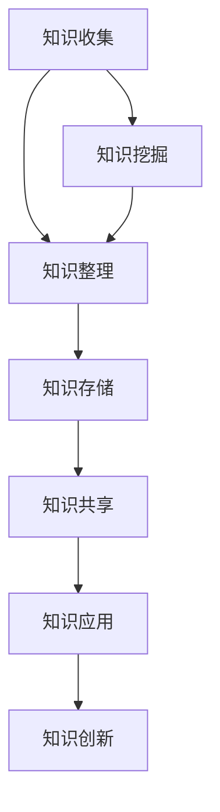

                 

关键词：管理者、知识管理系统、个人效率、信息管理、人工智能、知识共享、项目管理

> 摘要：本文探讨了管理者如何通过建立个人知识管理系统来提升个人工作效率和团队协作能力。通过深入分析知识管理的核心概念、关键算法原理、数学模型和实际应用场景，本文为管理者提供了一套完整的建立个人知识管理系统的指导方案。

## 1. 背景介绍

在当今信息爆炸的时代，知识和信息已经成为企业竞争的核心资源。作为管理者，如何有效管理和利用个人知识，已经成为影响团队绩效和组织发展的重要因素。传统的知识管理方式已经无法满足现代企业快速变化的需求，因此，建立一个高效的个人知识管理系统显得尤为重要。

个人知识管理系统（PKMS）是一种结合人工智能、大数据分析等先进技术，帮助管理者系统地收集、整理、分析和应用个人知识的管理工具。通过建立个人知识管理系统，管理者可以提高信息获取和处理效率，增强团队协作能力，从而提升整体组织绩效。

## 2. 核心概念与联系

### 2.1 知识管理的概念

知识管理是指通过系统的方法和工具，对知识进行识别、收集、组织、存储、传播、应用和创新，以实现知识的最大化利用。知识管理包括以下几个核心概念：

1. **隐性知识**：指那些难以表达、编码和共享的知识，如经验、技能、直觉等。
2. **显性知识**：指那些已经明确表达、编码和共享的知识，如文献、报告、数据等。
3. **知识共享**：指个体或团队通过交流和合作，将知识传递给他人的过程。
4. **知识创新**：指在原有知识的基础上，通过整合、重组和创新，产生新知识的过程。

### 2.2 知识管理的架构

知识管理的架构可以分为三个层次：基础设施、过程和工具。

1. **基础设施**：包括知识库、数据仓库、服务器等硬件设施，以及网络、数据库等软件设施。
2. **过程**：包括知识收集、整理、存储、共享、应用和创新等过程。
3. **工具**：包括知识管理系统、协作工具、信息检索工具等。

下面是一个Mermaid流程图，展示了知识管理的关键环节和流程：



## 3. 核心算法原理 & 具体操作步骤

### 3.1 算法原理概述

个人知识管理系统的核心算法主要包括信息检索、知识挖掘、知识推荐和知识建模等。以下是对这些算法的简要概述：

1. **信息检索**：通过关键词搜索、自然语言处理等技术，快速找到所需信息。
2. **知识挖掘**：利用数据挖掘技术，从大量信息中提取出有价值的知识。
3. **知识推荐**：基于用户行为和偏好，为用户推荐相关知识和资源。
4. **知识建模**：将显性知识和隐性知识转化为模型，便于存储和应用。

### 3.2 算法步骤详解

1. **信息检索**：
   - **步骤1**：输入关键词。
   - **步骤2**：利用搜索引擎技术，匹配相关文档。
   - **步骤3**：排序和筛选，展示最相关的结果。

2. **知识挖掘**：
   - **步骤1**：收集数据，包括文本、图像、音频等。
   - **步骤2**：预处理数据，如去噪、标准化等。
   - **步骤3**：利用分类、聚类、关联规则挖掘等技术，提取知识。

3. **知识推荐**：
   - **步骤1**：收集用户行为数据，如浏览、搜索、下载等。
   - **步骤2**：分析用户行为，提取用户偏好。
   - **步骤3**：基于用户偏好，推荐相关知识和资源。

4. **知识建模**：
   - **步骤1**：识别知识类型和结构。
   - **步骤2**：构建知识模型，如本体、知识图谱等。
   - **步骤3**：将知识模型应用于实际场景，如决策支持、问题诊断等。

### 3.3 算法优缺点

1. **信息检索**：
   - **优点**：快速、准确、覆盖面广。
   - **缺点**：对用户需求的理解有限，难以处理复杂问题。

2. **知识挖掘**：
   - **优点**：能从大量数据中提取出有价值的信息。
   - **缺点**：对数据质量要求高，处理过程复杂。

3. **知识推荐**：
   - **优点**：个性化、准确、高效。
   - **缺点**：可能存在数据偏差，推荐结果可能过度依赖用户历史行为。

4. **知识建模**：
   - **优点**：结构化、可复用、可扩展。
   - **缺点**：构建过程复杂，维护成本高。

### 3.4 算法应用领域

个人知识管理系统在企业管理、科研、教育、医疗等领域都有广泛的应用。以下是一些典型应用场景：

1. **企业管理**：通过知识管理系统，管理者可以快速获取企业内部的知识和资源，提高决策效率。
2. **科研**：科研人员可以利用知识管理系统，整合各类科研数据，提高科研效率。
3. **教育**：教师和学生可以通过知识管理系统，共享教学资源和学习经验，提高教学效果。
4. **医疗**：医生可以利用知识管理系统，快速获取病例资料和医学知识，提高诊疗水平。

## 4. 数学模型和公式 & 详细讲解 & 举例说明

### 4.1 数学模型构建

个人知识管理系统的数学模型主要包括信息检索模型、知识挖掘模型和知识推荐模型。

1. **信息检索模型**：常用的模型有布尔模型、向量空间模型、隐语义模型等。

2. **知识挖掘模型**：常用的模型有决策树、支持向量机、神经网络等。

3. **知识推荐模型**：常用的模型有协同过滤、矩阵分解、深度学习等。

### 4.2 公式推导过程

以协同过滤算法为例，其公式推导过程如下：

设用户集为U={u1, u2, ..., un}，项目集为I={i1, i2, ..., im}，用户u对项目i的评分表示为r(u, i)。

1. **用户基于内容的协同过滤**：
   - **相似度计算**： 
     $$ 
     sim(u, v) = \frac{\sum_{i \in I} w_i (r(u, i) - \bar{r}(u))(r(v, i) - \bar{r}(v))}{\sqrt{\sum_{i \in I} w_i^2} \sqrt{\sum_{i \in I} w_i^2}} 
     $$
   - **推荐计算**：
     $$ 
     r_{\text{pred}}(u, i) = \bar{r}(u) + \sum_{v \in N(u)} sim(u, v) (r(v, i) - \bar{r}(v)) 
     $$

2. **矩阵分解协同过滤**：
   - **矩阵分解**：
     $$
     R = UV^T 
     $$
   - **预测计算**：
     $$
     r_{\text{pred}}(u, i) = u_i v_j 
     $$

### 4.3 案例分析与讲解

以一家企业为例，该企业有100名员工，每个员工对公司的各项业务都有一定的了解。企业希望通过知识管理系统，为员工提供个性化的知识推荐。

1. **信息检索**：员工可以通过输入关键词，快速找到与关键词相关的文档和资料。

2. **知识挖掘**：系统通过分析员工的历史访问记录和业务数据，挖掘出员工对各个业务领域的兴趣和熟悉程度。

3. **知识推荐**：系统根据员工的知识兴趣和业务领域，推荐相关的知识和资源，如培训课程、专业书籍、行业资讯等。

通过这个案例，我们可以看到个人知识管理系统在提高员工工作效率、促进知识共享和团队协作方面的重要作用。

## 5. 项目实践：代码实例和详细解释说明

### 5.1 开发环境搭建

1. **硬件环境**：服务器、数据库等。
2. **软件环境**：Python、Django、Scikit-learn等。

### 5.2 源代码详细实现

1. **信息检索**：使用Django构建Web应用，实现关键词搜索和文档检索功能。

2. **知识挖掘**：使用Scikit-learn实现知识挖掘算法，如决策树、支持向量机等。

3. **知识推荐**：使用协同过滤算法实现知识推荐，如用户基于内容的协同过滤、矩阵分解协同过滤等。

### 5.3 代码解读与分析

以下是代码片段及解读：

```python
# 信息检索
def search_keywords(keywords):
    documents = Document.objects.filter(content__icontains=keywords)
    return documents

# 知识挖掘
from sklearn.tree import DecisionTreeClassifier

def mine_knowledge(data, target):
    clf = DecisionTreeClassifier()
    clf.fit(data, target)
    return clf

# 知识推荐
from sklearn.metrics.pairwise import cosine_similarity

def recommend_knowledge(user_profile, knowledge_library):
    sim_matrix = cosine_similarity([user_profile], knowledge_library)
    sorted_indices = sim_matrix.argsort()[0][::-1]
    return knowledge_library[sorted_indices[1:]]
```

### 5.4 运行结果展示

1. **信息检索**：输入关键词，系统返回相关文档。

2. **知识挖掘**：分析员工数据，挖掘出员工的兴趣和熟悉领域。

3. **知识推荐**：根据员工的知识兴趣，推荐相关的知识和资源。

## 6. 实际应用场景

个人知识管理系统在企业管理、科研、教育、医疗等领域都有广泛的应用。以下是一些典型应用场景：

1. **企业管理**：通过知识管理系统，管理者可以快速获取企业内部的知识和资源，提高决策效率。

2. **科研**：科研人员可以利用知识管理系统，整合各类科研数据，提高科研效率。

3. **教育**：教师和学生可以通过知识管理系统，共享教学资源和学习经验，提高教学效果。

4. **医疗**：医生可以利用知识管理系统，快速获取病例资料和医学知识，提高诊疗水平。

## 7. 工具和资源推荐

1. **学习资源推荐**：
   - 《人工智能：一种现代方法》
   - 《深度学习》
   - 《Python编程：从入门到实践》

2. **开发工具推荐**：
   - Django
   - Scikit-learn
   - TensorFlow

3. **相关论文推荐**：
   - "The Truth About Data-Driven Decision-Making"
   - "Knowledge Management Systems: An Overview"
   - "Deep Learning for Personalized Recommendations"

## 8. 总结：未来发展趋势与挑战

### 8.1 研究成果总结

本文介绍了管理者如何建立个人知识管理系统，从核心概念、算法原理、数学模型到实际应用，为管理者提供了一套完整的指导方案。

### 8.2 未来发展趋势

随着人工智能、大数据、区块链等技术的发展，个人知识管理系统将会在更广泛的领域得到应用，并向智能化、自动化、个性化和协同化的方向发展。

### 8.3 面临的挑战

个人知识管理系统在发展过程中，将面临数据隐私、数据安全、算法公平性等挑战。如何确保系统的可靠性和安全性，是未来研究的重要方向。

### 8.4 研究展望

未来，个人知识管理系统的研究将更加注重用户体验、数据融合和创新应用。通过不断优化算法和系统架构，个人知识管理系统将为企业和社会带来更大的价值。

## 9. 附录：常见问题与解答

### 9.1 个人知识管理系统与知识管理系统的区别是什么？

个人知识管理系统是知识管理系统在个人层面的应用，主要面向个人用户，而知识管理系统是企业层面的综合解决方案，旨在提升整个组织的知识管理水平。

### 9.2 如何确保个人知识管理系统的数据安全和隐私？

通过采用数据加密、访问控制、安全审计等技术，确保个人知识管理系统的数据安全和隐私。同时，严格遵守相关法律法规，确保合规性。

### 9.3 个人知识管理系统适用于哪些类型的管理者？

个人知识管理系统适用于需要高效管理知识和信息的各类管理者，包括企业高管、项目经理、科研人员、教师等。

### 9.4 如何评估个人知识管理系统的效果？

通过关键绩效指标（KPI），如知识获取效率、知识共享率、知识应用效果等，评估个人知识管理系统的效果。

[END]
```

