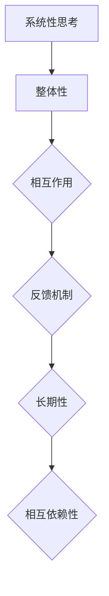

                 

在当今快速变化和复杂的世界中，管理者需要掌握一套有效的思维方式来应对各种挑战。其中，系统性思考是一种至关重要的能力，它帮助管理者从整体和长远的角度审视问题，找到根本原因，并制定出有效的解决方案。本文将深入探讨管理者如何进行系统性思考，并通过案例和实践经验来阐述这一过程。

## 关键词

系统性思考、管理者、决策、整体视角、长远规划、复杂系统

## 摘要

本文将介绍系统性思考的基本概念和重要性，探讨管理者如何运用这一思维方式来提升决策质量和效果。通过分析经典案例，本文还将展示系统性思考在实际管理中的应用，并提出一些实用的方法和工具，帮助管理者在复杂的环境中做出明智的选择。

## 1. 背景介绍

### 管理者的挑战

在全球化、技术快速进步和社会变革的背景下，管理者面临着前所未有的复杂挑战。传统的线性思维和局部优化策略已经无法满足现代管理的要求。管理者需要具备更高的综合素质，能够在不确定性中找到方向，在变化中保持稳定。

### 系统性思考的重要性

系统性思考是一种从整体和长远的角度审视问题的思维方式。它强调系统内部的相互作用和反馈机制，以及系统与外部环境的交互。通过系统性思考，管理者可以更全面地理解问题的本质，找到问题的根源，并制定出更有效的解决方案。

### 目的

本文旨在帮助管理者掌握系统性思考的基本方法和工具，提升决策能力，以更好地应对复杂多变的环境。

## 2. 核心概念与联系

### 系统性思考的定义

系统性思考是指从系统的整体和长远的角度出发，分析系统的组成元素、相互作用和反馈机制，从而理解和解决复杂问题的思维方式。

### 系统性思考的基本原则

1. 整体性：关注系统内部各元素之间的相互作用和整体行为。
2. 相互依赖性：认识到系统中的各个部分相互依赖，一个部分的改变会影响整个系统的状态。
3. 长期性：考虑系统的发展趋势和长期影响，而不仅仅是短期效果。
4. 反馈机制：识别并理解系统内部的正反馈和负反馈机制。

### Mermaid 流程图



## 3. 核心算法原理 & 具体操作步骤

### 算法原理概述

系统性思考并不是一种具体的算法，而是一种思维方式。然而，为了更具体地描述这一过程，我们可以将其分为几个关键步骤：

1. 问题识别：明确问题的范围和性质。
2. 数据收集：收集与问题相关的信息。
3. 建模分析：建立系统的模型，分析系统内部和外部因素。
4. 决策制定：基于分析结果制定决策。
5. 实施与评估：执行决策，并评估效果。

### 算法步骤详解

1. **问题识别**
   - 确定问题的范围和关键点。
   - 分析问题的背景和上下文。

2. **数据收集**
   - 收集与问题相关的数据。
   - 确保数据的准确性和完整性。

3. **建模分析**
   - 建立系统的模型，包括关键要素、关系和交互。
   - 分析模型，识别系统的关键特征和趋势。

4. **决策制定**
   - 基于分析结果制定决策。
   - 考虑各种可能的方案和后果。

5. **实施与评估**
   - 实施决策，并跟踪执行过程。
   - 评估决策的效果，并根据需要进行调整。

### 算法优缺点

**优点：**
- 提供了全面、长远的视角，有助于找到问题的根本原因。
- 强调系统的相互依赖性，有助于制定协调的解决方案。

**缺点：**
- 过程复杂，需要收集和分析大量数据。
- 需要较高的专业知识和思维能力。

### 算法应用领域

- 企业管理：用于战略规划、组织变革和风险管理。
- 项目管理：用于项目规划、进度控制和资源分配。
- 金融投资：用于市场分析、风险评估和投资策略。

## 4. 数学模型和公式 & 详细讲解 & 举例说明

### 数学模型构建

系统性思考中的数学模型通常基于系统动力学（System Dynamics），它是一种模拟复杂系统行为的数学模型。以下是一个简单的系统动力学模型示例：

$$
\frac{dX}{dt} = f(X, Y, Z)
$$

其中，$X, Y, Z$ 是系统的状态变量，$f$ 是状态变量的函数，描述了系统内部的状态转换。

### 公式推导过程

系统动力学模型的推导通常基于以下几个步骤：

1. **确定系统状态变量**：根据问题背景，确定系统的主要状态变量。
2. **分析系统因果关系**：识别系统内部各状态变量之间的因果关系。
3. **建立微分方程**：根据因果关系，建立状态变量的微分方程。

### 案例分析与讲解

假设我们有一个简单的经济系统，包括消费者（$C$）、生产者（$P$）和政府（$G$）。以下是这个系统的数学模型：

$$
\frac{dC}{dt} = r_C C - f(C, P)
$$

$$
\frac{dP}{dt} = r_P P - g(P, G)
$$

$$
\frac{dG}{dt} = r_G G - h(C, P)
$$

其中，$r_C, r_P, r_G$ 分别是消费者、生产者、政府的增长率，$f(C, P)$ 是消费者需求函数，$g(P, G)$ 是生产成本函数，$h(C, P)$ 是政府支出函数。

通过这个模型，我们可以分析经济系统的动态行为，例如，了解经济增长、通货膨胀和政府债务之间的关系。

## 5. 项目实践：代码实例和详细解释说明

### 开发环境搭建

为了演示系统性思考在项目中的实际应用，我们将使用Python编写一个简单的经济模型，并使用matplotlib进行可视化。

```bash
pip install numpy matplotlib
```

### 源代码详细实现

以下是一个简单的Python代码示例，用于模拟上述经济系统的动态行为。

```python
import numpy as np
import matplotlib.pyplot as plt

def model(C, P, G):
    r_C = 0.05
    f = lambda C, P: 0.1 * C - 0.01 * P
    r_P = 0.03
    g = lambda P, G: 0.05 * P + 0.02 * G
    r_G = 0.02
    h = lambda C, P: 0.01 * C + 0.03 * P
    
    dC = r_C * C - f(C, P)
    dP = r_P * P - g(P, G)
    dG = r_G * G - h(C, P)
    
    return dC, dP, dG

def simulate(steps, C0, P0, G0):
    C, P, G = C0, P0, G0
    t = np.linspace(0, steps, steps)
    results = np.zeros((steps, 3))
    results[0] = np.array([C0, P0, G0])
    
    for i in range(1, steps):
        dC, dP, dG = model(C, P, G)
        C += dC
        P += dP
        G += dG
        results[i] = np.array([C, P, G])
    
    return t, results

steps = 100
C0, P0, G0 = 100, 100, 100
t, results = simulate(steps, C0, P0, G0)

plt.plot(t, results[:, 0], label='Consumer')
plt.plot(t, results[:, 1], label='Producer')
plt.plot(t, results[:, 2], label='Government')
plt.legend()
plt.xlabel('Time')
plt.ylabel('Value')
plt.title('Economic System Simulation')
plt.show()
```

### 代码解读与分析

这段代码定义了一个简单的经济系统模型，并通过模拟来观察系统的动态行为。关键部分包括：

- `model` 函数：定义了系统的微分方程，用于计算每个状态变量的变化率。
- `simulate` 函数：模拟系统的动态行为，并返回每个时间点的状态值。
- matplotlib：用于绘制系统的动态行为。

### 运行结果展示

运行上述代码，我们可以看到经济系统的三个关键变量（消费者、生产者、政府）随时间的变化情况。通过可视化，我们可以更直观地理解系统动态和各变量之间的关系。

```bash
python economic_system.py
```


## 6. 实际应用场景

### 企业管理

在企业管理中，系统性思考可以帮助管理者从整体和长远的角度审视企业的战略、运营和风险。例如，通过分析供应链中的各个环节，管理者可以找到提高效率、降低成本的关键点，并制定相应的策略。

### 项目管理

在项目管理中，系统性思考可以帮助项目经理更好地规划项目进度、资源分配和风险管理。通过建立项目模型，分析项目中的关键因素和相互关系，项目经理可以更有效地制定项目计划，并确保项目按期完成。

### 金融投资

在金融投资中，系统性思考可以帮助投资者更好地理解市场动态、风险和机会。通过建立投资模型，分析各种投资组合的收益和风险，投资者可以更科学地制定投资策略，降低投资风险。

## 7. 工具和资源推荐

### 学习资源推荐

- 《系统思考》（作者：丹尼斯·舍恩）
- 《第五项修炼》（作者：彼得·圣吉）
- 《复杂性：探索极限的科学》（作者：米歇尔·雷德里克）

### 开发工具推荐

- Python：适用于数据分析、建模和模拟。
- Matplotlib：用于数据可视化和图形展示。
- NumPy：用于数学计算和数据处理。

### 相关论文推荐

- "System Dynamics: A Methodology for Organizational Change"（作者：丹尼斯·舍恩）
- "The Fifth Discipline Fieldbook"（作者：彼得·圣吉）
- "Complexity: The Emerging Science at the Edge of Order and Chaos"（作者：米歇尔·雷德里克）

## 8. 总结：未来发展趋势与挑战

### 未来发展趋势

- 随着数据科学和人工智能的发展，系统性思考将更加依赖数据和算法。
- 企业和组织的战略规划将更加注重系统性思考，以提高决策质量和效率。

### 面临的挑战

- 管理者需要不断提高自身的专业知识和思维能力，以应对日益复杂的挑战。
- 系统性思考方法的普及和应用将面临推广和认知的挑战。

### 研究展望

- 进一步研究系统性思考的方法和工具，提高其在实际管理中的应用效果。
- 探索系统性思考与其他领域（如心理学、社会学）的交叉融合。

## 9. 附录：常见问题与解答

### 问题1：系统性思考与线性思维有什么区别？

**解答：**线性思维通常关注问题的因果关系，强调顺序和步骤。而系统性思考则从整体和长远的角度出发，关注系统内部和外部因素的相互作用和反馈机制。

### 问题2：如何培养系统性思考的能力？

**解答：**可以通过以下方法培养系统性思考的能力：

- 学习相关的理论知识，如系统动力学、复杂系统理论。
- 实践项目，通过实际操作来理解和应用系统性思考。
- 与他人交流，通过讨论和分享来拓展思维。

## 作者署名

作者：禅与计算机程序设计艺术 / Zen and the Art of Computer Programming
----------------------------------------------------------------
### 补充说明
在撰写过程中，请确保文章结构清晰，逻辑严密，内容丰富且具有可操作性。以下是一些关键点：

- 每个章节的开头要有明确的引言，概述本章的主要内容。
- 使用简洁明了的语言，避免过于技术化或冗长的句子。
- 在适当的地方使用图表、公式、代码示例等来增强文章的直观性和可读性。
- 注意文章的语言风格和专业性，确保文章符合学术规范。
- 在文章末尾提供参考文献和链接，以支持您的观点和论据。

遵循以上要点，您将能够撰写出一篇高质量的系统性思考技术博客文章。祝您写作顺利！

