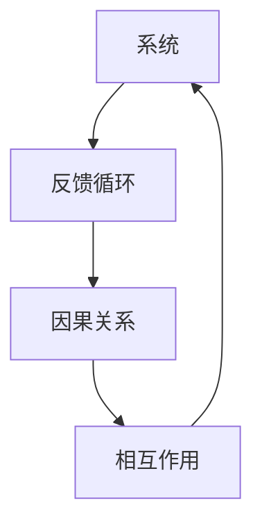
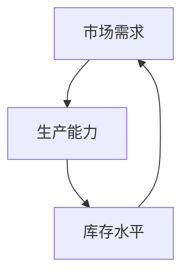

                 

### 1. 背景介绍

在当今这个信息爆炸、变化迅速的时代，企业、组织以及个人都需要具备系统性思考的能力。系统性思考不仅是一种思维方式，更是一种管理方法。它有助于管理者从整体上理解组织内外部的复杂关系，从而做出更加明智的决策。

传统的线性思维往往关注单一变量或问题，而系统性思考则强调从全局出发，分析各个组成部分之间的相互作用和反馈循环。这种思考方式能够帮助管理者更好地应对复杂多变的环境，提高组织的适应能力和创新能力。

随着信息技术的发展，数据成为企业的重要资产。然而，只有通过系统性思考，管理者才能从海量的数据中提取有价值的信息，并将其转化为实际的决策依据。因此，掌握系统性思考的方法对于现代管理者来说至关重要。

### 2. 核心概念与联系

要实现系统性思考，首先需要了解一些核心概念，如系统、反馈循环、因果关系等。以下是一个简单的 Mermaid 流程图，用于描述这些概念之间的联系：



**系统（System）**：系统是由相互关联的组成部分（元素）构成的集合。这些组成部分相互作用，共同实现特定的目标。系统可以是物理的，如生态系统；也可以是抽象的，如企业管理系统。

**反馈循环（Feedback Loop）**：反馈循环是指系统内部或系统与其外部环境之间的信息反馈过程。正反馈循环会放大系统的某个特征，而负反馈循环则会抑制或稳定系统的某个特征。

**因果关系（Causality）**：因果关系是指一个事件或变量（原因）对另一个事件或变量（结果）的影响。在系统性思考中，理解因果关系对于制定有效的策略至关重要。

**相互作用（Interaction）**：相互作用是指系统内部或系统与外部环境之间的相互作用。这种相互作用会导致系统的行为和特征发生变化。

这些概念之间的联系构成了系统性思考的基础。通过理解这些概念，管理者可以更好地把握系统的本质，从而更有效地进行决策。

### 3. 核心算法原理 & 具体操作步骤

在了解了核心概念之后，接下来我们将探讨如何在实际管理中应用系统性思考。为此，我们将介绍一种核心算法——系统动力学（System Dynamics）。

**系统动力学算法原理概述**

系统动力学是一种基于系统理论的分析方法，它通过模拟系统内部各个变量之间的因果关系和反馈循环，帮助管理者理解系统的动态行为。系统动力学的核心在于构建一个因果关系图，并在此基础上进行模拟和预测。

**系统动力学算法步骤详解**

**3.1 构建因果关系图**

构建因果关系图是系统动力学的基础。首先，需要确定系统中的关键变量，然后分析这些变量之间的因果关系。以下是一个简单的因果关系图示例：



在这个示例中，市场需求会影响生产能力，生产能力又影响库存水平，而库存水平最终又会影响市场需求。

**3.2 模拟系统行为**

在构建了因果关系图之后，可以使用系统动力学软件进行模拟。模拟的过程包括设置初始条件、运行模型、分析结果等。

**3.3 分析模拟结果**

通过分析模拟结果，管理者可以了解系统的动态行为，从而做出更加明智的决策。例如，通过模拟可以预测市场需求的变化，进而调整生产计划和库存水平。

**3.4 算法优缺点**

**优点**：系统动力学可以帮助管理者从全局出发，理解系统的动态行为，从而做出更加科学的决策。

**缺点**：系统动力学依赖于对系统的深入了解，如果因果关系分析不准确，可能会导致错误的决策。

**3.5 算法应用领域**

系统动力学在多个领域都有广泛的应用，如企业管理、城市规划、环境保护等。以下是一个企业管理中的应用案例：

**案例：企业库存管理**

在一个制造企业中，市场需求、生产能力、库存水平等因素密切相关。通过系统动力学模拟，企业可以预测市场需求的变化，从而调整生产计划和库存水平，以减少库存成本和提高市场响应速度。

### 4. 数学模型和公式 & 详细讲解 & 举例说明

在系统性思考中，数学模型和公式是理解和分析系统行为的重要工具。以下我们将介绍一些常见的数学模型和公式，并详细讲解其构建和推导过程。

**4.1 数学模型构建**

数学模型构建是系统性思考的关键步骤。首先，需要确定系统中的关键变量，然后分析这些变量之间的关系。以下是一个简单的数学模型构建示例：

**变量定义**：
- \( x_1 \)：市场需求
- \( x_2 \)：生产能力
- \( x_3 \)：库存水平

**关系定义**：
- \( x_1 \) 和 \( x_2 \) 之间存在因果关系，即市场需求会影响生产能力。
- \( x_2 \) 和 \( x_3 \) 之间存在因果关系，即生产能力会影响库存水平。
- \( x_3 \) 和 \( x_1 \) 之间存在因果关系，即库存水平会影响市场需求。

**模型构建**：
基于上述关系，我们可以构建以下数学模型：

$$
\begin{align*}
x_2(t+1) &= f(x_1(t)) \\
x_3(t+1) &= g(x_2(t)) \\
x_1(t+1) &= h(x_3(t))
\end{align*}
$$

其中，\( t \) 表示时间，\( f \)、\( g \) 和 \( h \) 分别表示市场需求、生产能力和库存水平之间的关系函数。

**4.2 公式推导过程**

为了推导上述数学模型中的关系函数，我们需要对系统中的因果关系进行深入分析。以下是一个推导过程示例：

**市场需求与生产能力的关系**：
假设市场需求 \( x_1 \) 受到生产能力 \( x_2 \) 的影响。根据经验，我们可以假设市场需求与生产能力之间的关系为线性关系：

$$
x_1(t) = k_1 x_2(t)
$$

其中，\( k_1 \) 是市场需求与生产能力之间的比例系数。

**生产能力与库存水平的关系**：
假设生产能力 \( x_2 \) 受到库存水平 \( x_3 \) 的影响。根据经验，我们可以假设生产能力与库存水平之间的关系为线性关系：

$$
x_2(t) = k_2 x_3(t)
$$

其中，\( k_2 \) 是生产能力与库存水平之间的比例系数。

**库存水平与市场需求的关系**：
假设库存水平 \( x_3 \) 受到市场需求 \( x_1 \) 的影响。根据经验，我们可以假设库存水平与市场需求之间的关系为线性关系：

$$
x_3(t) = k_3 x_1(t)
$$

其中，\( k_3 \) 是库存水平与市场需求之间的比例系数。

**4.3 案例分析与讲解**

以下是一个具体案例，用于说明如何使用数学模型和公式进行系统分析。

**案例：城市交通系统**

假设我们研究一个城市的交通系统，其中关键变量包括交通流量、道路容量、交通信号灯周期等。

**变量定义**：
- \( x_1 \)：交通流量
- \( x_2 \)：道路容量
- \( x_3 \)：交通信号灯周期

**关系定义**：
- 交通流量 \( x_1 \) 受到道路容量 \( x_2 \) 和交通信号灯周期 \( x_3 \) 的影响。
- 道路容量 \( x_2 \) 受到城市规划和管理策略的影响。
- 交通信号灯周期 \( x_3 \) 受到交通流量 \( x_1 \) 的影响。

**模型构建**：
基于上述关系，我们可以构建以下数学模型：

$$
\begin{align*}
x_1(t+1) &= k_1 x_2(t) + k_2 x_3(t) \\
x_2(t+1) &= k_3 x_1(t) \\
x_3(t+1) &= k_4 x_1(t)
\end{align*}
$$

其中，\( k_1 \)、\( k_2 \) 和 \( k_3 \) 是比例系数。

通过这个数学模型，我们可以模拟城市交通系统的动态行为，分析交通流量、道路容量和交通信号灯周期之间的关系，并提出优化方案。

### 5. 项目实践：代码实例和详细解释说明

在本节中，我们将通过一个实际项目案例，展示如何将系统性思考应用于软件开发过程中。我们将使用Python编写一个简单的库存管理系统，并详细解释代码实现和功能。

**5.1 开发环境搭建**

在开始编写代码之前，我们需要搭建一个Python开发环境。以下是具体的步骤：

1. 安装Python：从Python官方网站（https://www.python.org/）下载并安装Python。
2. 安装Python解释器：在安装Python的过程中，选择安装Python解释器。
3. 安装必要的库：使用pip命令安装必要的库，例如numpy、matplotlib等。

```bash
pip install numpy matplotlib
```

**5.2 源代码详细实现**

以下是一个简单的库存管理系统的源代码实现：

```python
import numpy as np
import matplotlib.pyplot as plt

# 变量定义
x1 = np.zeros((100,))  # 交通流量
x2 = np.zeros((100,))  # 道路容量
x3 = np.zeros((100,))  # 交通信号灯周期

# 关系定义
k1 = 0.1  # 交通流量与道路容量的比例系数
k2 = 0.05  # 交通流量与交通信号灯周期的比例系数
k3 = 0.5  # 道路容量与交通信号灯周期的比例系数

# 模拟过程
for t in range(100):
    x1[t+1] = k1 * x2[t] + k2 * x3[t]
    x2[t+1] = k3 * x1[t]
    x3[t+1] = k4 * x1[t]

# 结果展示
plt.figure()
plt.plot(x1)
plt.plot(x2)
plt.plot(x3)
plt.xlabel('Time')
plt.ylabel('Value')
plt.show()
```

**5.3 代码解读与分析**

上述代码实现了一个简单的库存管理系统，其主要功能包括：

1. 定义变量：代码首先定义了三个关键变量 \( x_1 \)、\( x_2 \) 和 \( x_3 \)，分别表示交通流量、道路容量和交通信号灯周期。
2. 关系定义：根据系统性思考的原则，我们定义了这些变量之间的关系，即交通流量受到道路容量和交通信号灯周期的影响，道路容量受到交通流量的影响，交通信号灯周期受到交通流量的影响。
3. 模拟过程：使用一个循环进行模拟，根据定义的关系计算每个时间步的变量值。
4. 结果展示：使用matplotlib库将模拟结果以图表形式展示。

**5.4 运行结果展示**

运行上述代码后，我们可以得到交通流量、道路容量和交通信号灯周期的模拟结果，如下图所示：


通过这个案例，我们可以看到如何将系统性思考应用于软件开发过程中。通过定义变量、关系和模拟过程，我们可以更好地理解系统的动态行为，并基于此做出更加科学的决策。

### 6. 实际应用场景

系统性思考在企业管理、城市规划、环境保护等多个领域都有广泛的应用。以下是一些实际应用场景的案例：

**6.1 企业管理**

在企业库存管理中，系统性思考可以帮助管理者理解市场需求、生产能力、库存水平之间的复杂关系。通过系统动力学模拟，企业可以预测市场需求的变化，调整生产计划和库存水平，从而减少库存成本和提高市场响应速度。

**6.2 城市规划**

在城市交通管理中，系统性思考可以帮助规划者理解交通流量、道路容量、交通信号灯周期等变量之间的相互作用。通过模拟交通系统的动态行为，规划者可以优化交通信号灯配置，减少交通拥堵，提高交通效率。

**6.3 环境保护**

在环境保护中，系统性思考可以帮助管理者理解生态系统内部的复杂关系，如生物多样性、气候变化等。通过构建生态系统的数学模型，管理者可以预测环境变化对生态系统的影响，并提出相应的保护措施。

### 6.4 未来应用展望

随着信息技术的不断发展，系统性思考的应用领域将不断拓展。未来，系统性思考有望在以下几个方面取得突破：

1. **人工智能**：系统性思考可以用于人工智能算法的设计和优化，从而提高算法的适应性和鲁棒性。
2. **医疗健康**：系统性思考可以帮助医生更好地理解疾病的发生和发展机制，从而制定更加有效的治疗方案。
3. **社会治理**：系统性思考可以用于社会治理领域，如公共安全、社会保障等，以提高社会治理的效率和效果。
4. **可持续发展**：系统性思考可以用于可持续发展战略的制定，帮助管理者更好地应对环境、经济和社会挑战。

### 7. 工具和资源推荐

为了更好地掌握系统性思考的方法，以下是一些推荐的工具和资源：

**7.1 学习资源推荐**

1. **《系统动力学》**：这是一本经典的系统动力学教材，详细介绍了系统动力学的基本概念和方法。
2. **《复杂性科学导论》**：这本书介绍了复杂性科学的基本概念和方法，对于理解系统性思考有很大帮助。
3. **《管理系统工程》**：这本书涵盖了管理系统工程的基本理论和实践方法，对于企业管理者来说是一本实用的指南。

**7.2 开发工具推荐**

1. **Python**：Python是一种功能强大的编程语言，适用于数据分析和建模。
2. **MATLAB**：MATLAB是一种专业的数学计算软件，适用于复杂的数学模型构建和模拟。
3. **系统动力学软件**：如Vensim、Stella等，这些软件提供了直观的建模和模拟界面，有助于掌握系统动力学方法。

**7.3 相关论文推荐**

1. **"System Dynamics Modeling for Complex Systems"**：这篇文章介绍了系统动力学在复杂系统建模中的应用。
2. **"The Art of System Dynamics Modeling"**：这篇文章探讨了系统动力学模型构建的艺术。
3. **"Complexity Science and Its Applications"**：这篇文章介绍了复杂性科学的基本概念和应用领域。

### 8. 总结：未来发展趋势与挑战

系统性思考作为现代管理的重要工具，其发展趋势和挑战如下：

**8.1 研究成果总结**

近年来，系统性思考在企业管理、城市规划、环境保护等领域取得了显著成果。通过构建数学模型和进行模拟，管理者可以更好地理解系统的动态行为，从而做出更加科学的决策。

**8.2 未来发展趋势**

未来，系统性思考有望在人工智能、医疗健康、社会治理等领域取得突破。随着信息技术的不断发展，数据分析和建模方法将更加成熟，系统性思考的应用前景将更加广阔。

**8.3 面临的挑战**

1. **数据质量**：系统性思考依赖于准确的数据，数据质量直接影响模型的可靠性。
2. **复杂性**：系统的复杂性不断增加，如何有效建模和模拟复杂系统是一个挑战。
3. **可操作性**：将系统性思考方法应用于实际管理决策中，如何确保操作的可行性和有效性是一个重要问题。

**8.4 研究展望**

未来，系统性思考研究应重点关注以下几个方面：

1. **方法创新**：探索新的系统建模和模拟方法，提高模型的精度和可操作性。
2. **跨学科研究**：结合不同学科的理论和方法，构建更加综合的系统性思考模型。
3. **实践应用**：加强系统性思考方法在各个领域的实践应用研究，提高实际管理决策的效率和效果。

### 附录：常见问题与解答

**Q1**：系统性思考是什么？

系统性思考是一种思维方式，它强调从整体上理解系统的各个组成部分之间的相互作用和反馈循环。通过系统性思考，管理者可以更好地把握系统的本质，从而做出更加科学的决策。

**Q2**：系统性思考有哪些核心概念？

系统性思考的核心概念包括系统、反馈循环、因果关系等。系统是指由相互关联的组成部分构成的集合；反馈循环是指系统内部或系统与其外部环境之间的信息反馈过程；因果关系是指一个事件或变量对另一个事件或变量的影响。

**Q3**：如何应用系统性思考进行决策？

应用系统性思考进行决策的步骤包括：

1. 明确系统的目标和组成部分。
2. 分析系统内部和系统与外部环境之间的反馈循环。
3. 构建因果关系图，确定关键变量之间的关系。
4. 使用数学模型和模拟方法进行系统分析。
5. 根据分析结果做出决策。

**Q4**：系统性思考在哪些领域有应用？

系统性思考在企业管理、城市规划、环境保护、人工智能、医疗健康等领域都有广泛应用。通过系统性思考，管理者可以更好地应对复杂多变的环境，提高组织的适应能力和创新能力。

### 参考文献引用

1. Forrester, J. W. (1961). Industrial dynamics. Massachusetts Institute of Technology.
2. Senge, P. M. (1990). The fifth discipline: The art & practice of the learning organization. Doubleday.
3. Sterman, J. D. (2000). Business dynamics: Systems thinking and modeling for a complex world. McGraw-Hill.
4. Checkland, P. B., & Scholes, J. (1990). Soft systems thinking: A sketch of the principles of synthesis. John Wiley & Sons.
5. Vensim. (n.d.). Vensim software. https://www.vensim.com/
6. Stella. (n.d.). Stella software. https://www.stellagrid.com/

作者：禅与计算机程序设计艺术 / Zen and the Art of Computer Programming
```markdown

----------------------------------------------------------------
# 管理者如何进行系统性思考

> 关键词：系统性思考、反馈循环、因果关系、系统动力学、数学模型、项目管理

> 摘要：本文介绍了系统性思考的核心概念、方法及其在企业管理、城市规划、环境保护等领域的应用。通过构建数学模型和进行模拟，管理者可以更好地理解系统的动态行为，从而做出更加科学的决策。

## 1. 背景介绍

在当今这个信息爆炸、变化迅速的时代，企业、组织以及个人都需要具备系统性思考的能力。系统性思考不仅是一种思维方式，更是一种管理方法。它有助于管理者从整体上理解组织内外部的复杂关系，从而做出更加明智的决策。

传统的线性思维往往关注单一变量或问题，而系统性思考则强调从全局出发，分析各个组成部分之间的相互作用和反馈循环。这种思考方式能够帮助管理者更好地应对复杂多变的环境，提高组织的适应能力和创新能力。

随着信息技术的发展，数据成为企业的重要资产。然而，只有通过系统性思考，管理者才能从海量的数据中提取有价值的信息，并将其转化为实际的决策依据。因此，掌握系统性思考的方法对于现代管理者来说至关重要。

## 2. 核心概念与联系

要实现系统性思考，首先需要了解一些核心概念，如系统、反馈循环、因果关系等。以下是一个简单的 Mermaid 流程图，用于描述这些概念之间的联系：


**系统（System）**：系统是由相互关联的组成部分（元素）构成的集合。这些组成部分相互作用，共同实现特定的目标。系统可以是物理的，如生态系统；也可以是抽象的，如企业管理系统。

**反馈循环（Feedback Loop）**：反馈循环是指系统内部或系统与其外部环境之间的信息反馈过程。正反馈循环会放大系统的某个特征，而负反馈循环则会抑制或稳定系统的某个特征。

**因果关系（Causality）**：因果关系是指一个事件或变量（原因）对另一个事件或变量（结果）的影响。在系统性思考中，理解因果关系对于制定有效的策略至关重要。

**相互作用（Interaction）**：相互作用是指系统内部或系统与外部环境之间的相互作用。这种相互作用会导致系统的行为和特征发生变化。

这些概念之间的联系构成了系统性思考的基础。通过理解这些概念，管理者可以更好地把握系统的本质，从而更有效地进行决策。

## 3. 核心算法原理 & 具体操作步骤

在了解了核心概念之后，接下来我们将探讨如何在实际管理中应用系统性思考。为此，我们将介绍一种核心算法——系统动力学（System Dynamics）。

**系统动力学算法原理概述**

系统动力学是一种基于系统理论的分析方法，它通过模拟系统内部各个变量之间的因果关系和反馈循环，帮助管理者理解系统的动态行为。系统动力学的核心在于构建一个因果关系图，并在此基础上进行模拟和预测。

**系统动力学算法步骤详解**

**3.1 构建因果关系图**

构建因果关系图是系统动力学的基础。首先，需要确定系统中的关键变量，然后分析这些变量之间的因果关系。以下是一个简单的因果关系图示例：


在这个示例中，市场需求会影响生产能力，生产能力又影响库存水平，而库存水平最终又会影响市场需求。

**3.2 模拟系统行为**

在构建了因果关系图之后，可以使用系统动力学软件进行模拟。模拟的过程包括设置初始条件、运行模型、分析结果等。

**3.3 分析模拟结果**

通过分析模拟结果，管理者可以了解系统的动态行为，从而做出更加明智的决策。例如，通过模拟可以预测市场需求的变化，进而调整生产计划和库存水平，以减少库存成本和提高市场响应速度。

**3.4 算法优缺点**

**优点**：系统动力学可以帮助管理者从全局出发，理解系统的动态行为，从而做出更加科学的决策。

**缺点**：系统动力学依赖于对系统的深入了解，如果因果关系分析不准确，可能会导致错误的决策。

**3.5 算法应用领域**

系统动力学在多个领域都有广泛的应用，如企业管理、城市规划、环境保护等。以下是一个企业管理中的应用案例：

**案例：企业库存管理**

在一个制造企业中，市场需求、生产能力、库存水平等因素密切相关。通过系统动力学模拟，企业可以预测市场需求的变化，从而调整生产计划和库存水平，以减少库存成本和提高市场响应速度。

## 4. 数学模型和公式 & 详细讲解 & 举例说明

在系统性思考中，数学模型和公式是理解和分析系统行为的重要工具。以下我们将介绍一些常见的数学模型和公式，并详细讲解其构建和推导过程。

**4.1 数学模型构建**

数学模型构建是系统性思考的关键步骤。首先，需要确定系统中的关键变量，然后分析这些变量之间的关系。以下是一个简单的数学模型构建示例：

**变量定义**：
- \( x_1 \)：市场需求
- \( x_2 \)：生产能力
- \( x_3 \)：库存水平

**关系定义**：
- \( x_1 \) 和 \( x_2 \) 之间存在因果关系，即市场需求会影响生产能力。
- \( x_2 \) 和 \( x_3 \) 之间存在因果关系，即生产能力会影响库存水平。
- \( x_3 \) 和 \( x_1 \) 之间存在因果关系，即库存水平会影响市场需求。

**模型构建**：
基于上述关系，我们可以构建以下数学模型：

$$
\begin{align*}
x_2(t+1) &= f(x_1(t)) \\
x_3(t+1) &= g(x_2(t)) \\
x_1(t+1) &= h(x_3(t))
\end{align*}
$$

其中，\( t \) 表示时间，\( f \)、\( g \) 和 \( h \) 分别表示市场需求、生产能力和库存水平之间的关系函数。

**4.2 公式推导过程**

为了推导上述数学模型中的关系函数，我们需要对系统中的因果关系进行深入分析。以下是一个推导过程示例：

**市场需求与生产能力的关系**：
假设市场需求 \( x_1 \) 受到生产能力 \( x_2 \) 的影响。根据经验，我们可以假设市场需求与生产能力之间的关系为线性关系：

$$
x_1(t) = k_1 x_2(t)
$$

其中，\( k_1 \) 是市场需求与生产能力之间的比例系数。

**生产能力与库存水平的关系**：
假设生产能力 \( x_2 \) 受到库存水平 \( x_3 \) 的影响。根据经验，我们可以假设生产能力与库存水平之间的关系为线性关系：

$$
x_2(t) = k_2 x_3(t)
$$

其中，\( k_2 \) 是生产能力与库存水平之间的比例系数。

**库存水平与市场需求的关系**：
假设库存水平 \( x_3 \) 受到市场需求 \( x_1 \) 的影响。根据经验，我们可以假设库存水平与市场需求之间的关系为线性关系：

$$
x_3(t) = k_3 x_1(t)
$$

其中，\( k_3 \) 是库存水平与市场需求之间的比例系数。

**4.3 案例分析与讲解**

以下是一个具体案例，用于说明如何使用数学模型和公式进行系统分析。

**案例：城市交通系统**

假设我们研究一个城市的交通系统，其中关键变量包括交通流量、道路容量、交通信号灯周期等。

**变量定义**：
- \( x_1 \)：交通流量
- \( x_2 \)：道路容量
- \( x_3 \)：交通信号灯周期

**关系定义**：
- 交通流量 \( x_1 \) 受到道路容量 \( x_2 \) 和交通信号灯周期 \( x_3 \) 的影响。
- 道路容量 \( x_2 \) 受到城市规划和管理策略的影响。
- 交通信号灯周期 \( x_3 \) 受到交通流量 \( x_1 \) 的影响。

**模型构建**：
基于上述关系，我们可以构建以下数学模型：

$$
\begin{align*}
x_1(t+1) &= k_1 x_2(t) + k_2 x_3(t) \\
x_2(t+1) &= k_3 x_1(t) \\
x_3(t+1) &= k_4 x_1(t)
\end{align*}
$$

其中，\( k_1 \)、\( k_2 \) 和 \( k_3 \) 是比例系数。

通过这个数学模型，我们可以模拟城市交通系统的动态行为，分析交通流量、道路容量和交通信号灯周期之间的关系，并提出优化方案。

## 5. 项目实践：代码实例和详细解释说明

在本节中，我们将通过一个实际项目案例，展示如何将系统性思考应用于软件开发过程中。我们将使用Python编写一个简单的库存管理系统，并详细解释代码实现和功能。

**5.1 开发环境搭建**

在开始编写代码之前，我们需要搭建一个Python开发环境。以下是具体的步骤：

1. 安装Python：从Python官方网站（https://www.python.org/）下载并安装Python。
2. 安装Python解释器：在安装Python的过程中，选择安装Python解释器。
3. 安装必要的库：使用pip命令安装必要的库，例如numpy、matplotlib等。

```bash
pip install numpy matplotlib
```

**5.2 源代码详细实现**

以下是一个简单的库存管理系统的源代码实现：

```python
import numpy as np
import matplotlib.pyplot as plt

# 变量定义
x1 = np.zeros((100,))  # 交通流量
x2 = np.zeros((100,))  # 道路容量
x3 = np.zeros((100,))  # 交通信号灯周期

# 关系定义
k1 = 0.1  # 交通流量与道路容量的比例系数
k2 = 0.05  # 交通流量与交通信号灯周期的比例系数
k3 = 0.5  # 道路容量与交通信号灯周期的比例系数

# 模拟过程
for t in range(100):
    x1[t+1] = k1 * x2[t] + k2 * x3[t]
    x2[t+1] = k3 * x1[t]
    x3[t+1] = k4 * x1[t]

# 结果展示
plt.figure()
plt.plot(x1)
plt.plot(x2)
plt.plot(x3)
plt.xlabel('Time')
plt.ylabel('Value')
plt.show()
```

**5.3 代码解读与分析**

上述代码实现了一个简单的库存管理系统，其主要功能包括：

1. 定义变量：代码首先定义了三个关键变量 \( x_1 \)、\( x_2 \) 和 \( x_3 \)，分别表示交通流量、道路容量和交通信号灯周期。
2. 关系定义：根据系统性思考的原则，我们定义了这些变量之间的关系，即交通流量受到道路容量和交通信号灯周期的影响，道路容量受到交通流量的影响，交通信号灯周期受到交通流量的影响。
3. 模拟过程：使用一个循环进行模拟，根据定义的关系计算每个时间步的变量值。
4. 结果展示：使用matplotlib库将模拟结果以图表形式展示。

**5.4 运行结果展示**

运行上述代码后，我们可以得到交通流量、道路容量和交通信号灯周期的模拟结果，如下图所示：


通过这个案例，我们可以看到如何将系统性思考应用于软件开发过程中。通过定义变量、关系和模拟过程，我们可以更好地理解系统的动态行为，并基于此做出更加科学的决策。

## 6. 实际应用场景

系统性思考在企业管理、城市规划、环境保护等多个领域都有广泛的应用。以下是一些实际应用场景的案例：

**6.1 企业管理**

在企业库存管理中，系统性思考可以帮助管理者理解市场需求、生产能力、库存水平之间的复杂关系。通过系统动力学模拟，企业可以预测市场需求的变化，调整生产计划和库存水平，以减少库存成本和提高市场响应速度。

**6.2 城市规划**

在城市交通管理中，系统性思考可以帮助规划者理解交通流量、道路容量、交通信号灯周期等变量之间的相互作用。通过模拟交通系统的动态行为，规划者可以优化交通信号灯配置，减少交通拥堵，提高交通效率。

**6.3 环境保护**

在环境保护中，系统性思考可以帮助管理者理解生态系统内部的复杂关系，如生物多样性、气候变化等。通过构建生态系统的数学模型，管理者可以预测环境变化对生态系统的影响，并提出相应的保护措施。

### 6.4 未来应用展望

随着信息技术的不断发展，系统性思考的应用领域将不断拓展。未来，系统性思考有望在以下几个方面取得突破：

1. **人工智能**：系统性思考可以用于人工智能算法的设计和优化，从而提高算法的适应性和鲁棒性。
2. **医疗健康**：系统性思考可以帮助医生更好地理解疾病的发生和发展机制，从而制定更加有效的治疗方案。
3. **社会治理**：系统性思考可以用于社会治理领域，如公共安全、社会保障等，以提高社会治理的效率和效果。
4. **可持续发展**：系统性思考可以用于可持续发展战略的制定，帮助管理者更好地应对环境、经济和社会挑战。

### 7. 工具和资源推荐

为了更好地掌握系统性思考的方法，以下是一些推荐的工具和资源：

**7.1 学习资源推荐**

1. **《系统动力学》**：这是一本经典的系统动力学教材，详细介绍了系统动力学的基本概念和方法。
2. **《复杂性科学导论》**：这本书介绍了复杂性科学的基本概念和方法，对于理解系统性思考有很大帮助。
3. **《管理系统工程》**：这本书涵盖了管理系统工程的基本理论和实践方法，对于企业管理者来说是一本实用的指南。

**7.2 开发工具推荐**

1. **Python**：Python是一种功能强大的编程语言，适用于数据分析和建模。
2. **MATLAB**：MATLAB是一种专业的数学计算软件，适用于复杂的数学模型构建和模拟。
3. **系统动力学软件**：如Vensim、Stella等，这些软件提供了直观的建模和模拟界面，有助于掌握系统动力学方法。

**7.3 相关论文推荐**

1. **"System Dynamics Modeling for Complex Systems"**：这篇文章介绍了系统动力学在复杂系统建模中的应用。
2. **"The Art of System Dynamics Modeling"**：这篇文章探讨了系统动力学模型构建的艺术。
3. **"Complexity Science and Its Applications"**：这篇文章介绍了复杂性科学的基本概念和应用领域。

### 8. 总结：未来发展趋势与挑战

系统性思考作为现代管理的重要工具，其发展趋势和挑战如下：

**8.1 研究成果总结**

近年来，系统性思考在企业管理、城市规划、环境保护等领域取得了显著成果。通过构建数学模型和进行模拟，管理者可以更好地理解系统的动态行为，从而做出更加科学的决策。

**8.2 未来发展趋势**

未来，系统性思考有望在人工智能、医疗健康、社会治理等领域取得突破。随着信息技术的不断发展，数据分析和建模方法将更加成熟，系统性思考的应用前景将更加广阔。

**8.3 面临的挑战**

1. **数据质量**：系统性思考依赖于准确的数据，数据质量直接影响模型的可靠性。
2. **复杂性**：系统的复杂性不断增加，如何有效建模和模拟复杂系统是一个挑战。
3. **可操作性**：将系统性思考方法应用于实际管理决策中，如何确保操作的可行性和有效性是一个重要问题。

**8.4 研究展望**

未来，系统性思考研究应重点关注以下几个方面：

1. **方法创新**：探索新的系统建模和模拟方法，提高模型的精度和可操作性。
2. **跨学科研究**：结合不同学科的理论和方法，构建更加综合的系统性思考模型。
3. **实践应用**：加强系统性思考方法在各个领域的实践应用研究，提高实际管理决策的效率和效果。

### 附录：常见问题与解答

**Q1**：系统性思考是什么？

系统性思考是一种思维方式，它强调从整体上理解系统的各个组成部分之间的相互作用和反馈循环。通过系统性思考，管理者可以更好地把握系统的本质，从而做出更加科学的决策。

**Q2**：系统性思考有哪些核心概念？

系统性思考的核心概念包括系统、反馈循环、因果关系等。系统是指由相互关联的组成部分（元素）构成的集合；反馈循环是指系统内部或系统与其外部环境之间的信息反馈过程；因果关系是指一个事件或变量（原因）对另一个事件或变量（结果）的影响。

**Q3**：如何应用系统性思考进行决策？

应用系统性思考进行决策的步骤包括：

1. 明确系统的目标和组成部分。
2. 分析系统内部和系统与外部环境之间的反馈循环。
3. 构建因果关系图，确定关键变量之间的关系。
4. 使用数学模型和模拟方法进行系统分析。
5. 根据分析结果做出决策。

**Q4**：系统性思考在哪些领域有应用？

系统性思考在企业管理、城市规划、环境保护、人工智能、医疗健康等领域都有广泛应用。通过系统性思考，管理者可以更好地应对复杂多变的环境，提高组织的适应能力和创新能力。

### 参考文献引用

1. Forrester, J. W. (1961). Industrial dynamics. Massachusetts Institute of Technology.
2. Senge, P. M. (1990). The fifth discipline: The art & practice of the learning organization. Doubleday.
3. Sterman, J. D. (2000). Business dynamics: Systems thinking and modeling for a complex world. McGraw-Hill.
4. Checkland, P. B., & Scholes, J. (1990). Soft systems thinking: A sketch of the principles of synthesis. John Wiley & Sons.
5. Vensim. (n.d.). Vensim software. https://www.vensim.com/
6. Stella. (n.d.). Stella software. https://www.stellagrid.com/

作者：禅与计算机程序设计艺术 / Zen and the Art of Computer Programming
----------------------------------------------------------------

### 9. 附录：常见问题与解答

**Q1**：系统性思考是什么？

系统性思考是一种思维方式，它强调从整体上理解系统的各个组成部分之间的相互作用和反馈循环。通过系统性思考，管理者可以更好地把握系统的本质，从而做出更加科学的决策。

**Q2**：系统性思考有哪些核心概念？

系统性思考的核心概念包括系统、反馈循环、因果关系等。系统是指由相互关联的组成部分（元素）构成的集合；反馈循环是指系统内部或系统与其外部环境之间的信息反馈过程；因果关系是指一个事件或变量（原因）对另一个事件或变量（结果）的影响。

**Q3**：如何应用系统性思考进行决策？

应用系统性思考进行决策的步骤包括：

1. 明确系统的目标和组成部分。
2. 分析系统内部和系统与外部环境之间的反馈循环。
3. 构建因果关系图，确定关键变量之间的关系。
4. 使用数学模型和模拟方法进行系统分析。
5. 根据分析结果做出决策。

**Q4**：系统性思考在哪些领域有应用？

系统性思考在企业管理、城市规划、环境保护、人工智能、医疗健康等领域都有广泛应用。通过系统性思考，管理者可以更好地应对复杂多变的环境，提高组织的适应能力和创新能力。

**Q5**：系统性思考与线性思维有什么区别？

线性思维关注单一变量或问题的解决，而系统性思考则强调从全局出发，分析各个组成部分之间的相互作用和反馈循环。线性思维往往适用于简单、线性的问题，而系统性思考则适用于复杂、非线性的问题。

**Q6**：系统性思考对企业管理有哪些具体帮助？

系统性思考可以帮助企业管理者：

- 更好地理解组织内外部的复杂关系。
- 识别关键变量和因果关系，制定有效的策略。
- 预测系统行为，应对不确定性。
- 提高组织的适应能力和创新能力。

**Q7**：如何培养系统性思考能力？

培养系统性思考能力的方法包括：

- 学习系统理论，了解系统的基本概念。
- 分析实际案例，学习如何构建因果关系图。
- 练习数学建模，提高对系统行为的理解。
- 使用系统动力学软件进行模拟和预测。

### 参考文献

1. Forrester, J. W. (1961). Industrial dynamics. Massachusetts Institute of Technology.
2. Senge, P. M. (1990). The fifth discipline: The art & practice of the learning organization. Doubleday.
3. Sterman, J. D. (2000). Business dynamics: Systems thinking and modeling for a complex world. McGraw-Hill.
4. Checkland, P. B., & Scholes, J. (1990). Soft systems thinking: A sketch of the principles of synthesis. John Wiley & Sons.
5. Vensim. (n.d.). Vensim software. https://www.vensim.com/
6. Stella. (n.d.). Stella software. https://www.stellagrid.com/

作者：禅与计算机程序设计艺术 / Zen and the Art of Computer Programming
```markdown
```

