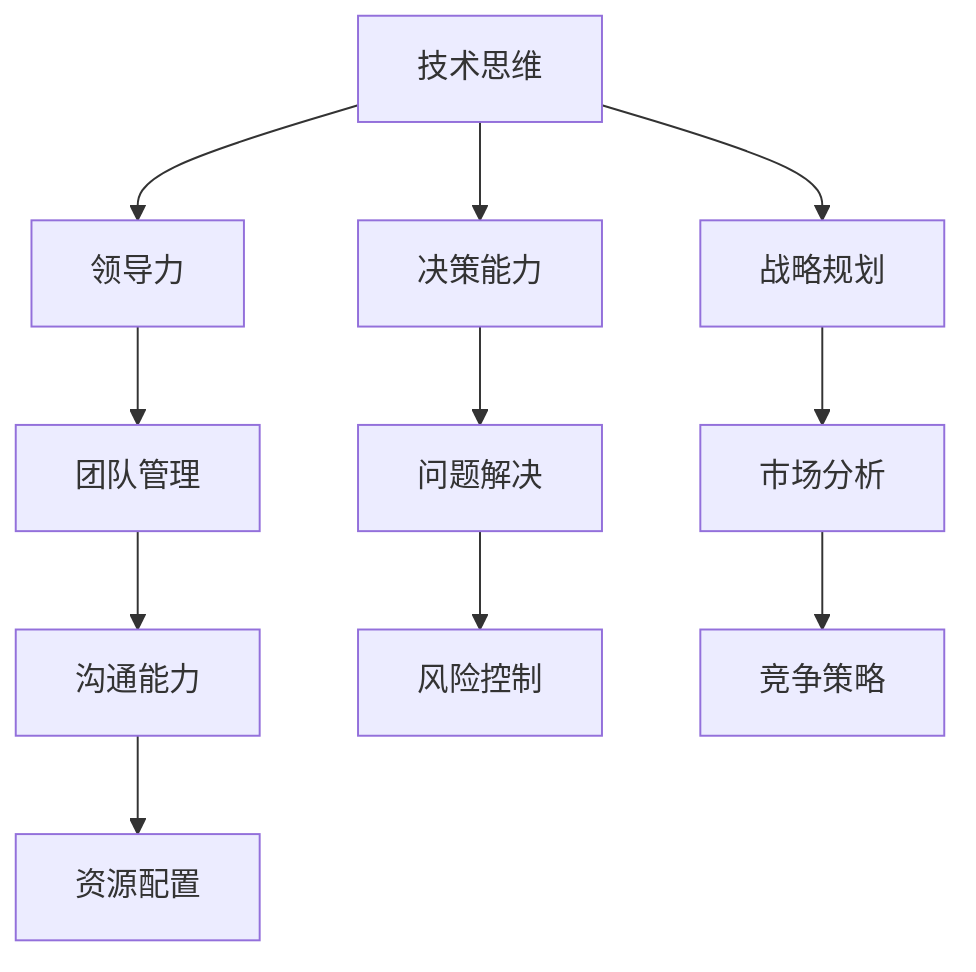

                 

关键词：管理者，思维能力，提升，策略，技术，领导力，决策，战略规划

> 在信息技术飞速发展的今天，管理者不仅需要具备扎实的专业背景，还需要不断提升思维能力，以应对复杂多变的商业环境。本文将深入探讨管理者的思维能力提升策略，包括技术、领导力、决策能力和战略规划等方面的内容，旨在为管理者提供实用的指导。

## 1. 背景介绍

在数字化时代，信息技术的快速发展为企业提供了前所未有的机遇和挑战。作为企业的管理者，如何把握这些机遇，应对挑战，成为了关键问题。这不仅要求管理者具备深厚的专业知识和技能，更需要拥有卓越的思维能力和领导力。然而，在实际工作中，许多管理者在思维能力方面存在一定的局限性，这限制了他们在快速变化的市场中做出有效决策的能力。

本文旨在分析管理者在思维能力方面面临的挑战，并提出一系列策略和方法，以帮助管理者提升自身的思维能力，从而更好地应对现代企业的复杂环境。本文将从技术、领导力、决策能力和战略规划四个方面展开讨论，结合具体案例和实践经验，为管理者提供实用的指导。

## 2. 核心概念与联系

### 2.1 技术思维

技术思维是指管理者在处理问题时，能够运用技术知识和方法进行逻辑分析和创新的能力。它包括对技术原理的理解、技术趋势的把握以及技术应用的创新能力。

### 2.2 领导力

领导力是指管理者在团队中激发成员积极性、协调团队合作、实现共同目标的能力。它包括领导者的愿景、价值观、沟通能力和决策能力。

### 2.3 决策能力

决策能力是指管理者在面对复杂问题时，能够迅速做出合理决策的能力。它包括信息收集、分析判断和风险控制等方面的能力。

### 2.4 战略规划

战略规划是指管理者在组织内部进行资源整合，确定长期发展方向和目标的过程。它包括市场分析、竞争策略和资源配置等方面的内容。

### 2.5 Mermaid 流程图



## 3. 核心算法原理 & 具体操作步骤

### 3.1 算法原理概述

管理者的思维能力提升过程可以看作是一种动态优化算法。该算法的核心思想是通过不断学习、实践和反馈，逐步调整管理者的思维模式和行为方式，以适应复杂多变的环境。

### 3.2 算法步骤详解

1. **自我认知**：管理者需要首先了解自身的优势和劣势，明确提升思维能力的方向。

2. **知识学习**：通过阅读专业书籍、参加培训课程、与业界专家交流等方式，不断丰富自己的知识储备。

3. **实践应用**：将所学知识应用到实际工作中，通过实践不断积累经验。

4. **反馈调整**：根据实际效果进行反思和总结，调整思维方式和行为策略。

5. **持续迭代**：在实践和反馈的基础上，不断优化思维模式，形成稳定的思维习惯。

### 3.3 算法优缺点

优点：

- **适应性**：能够根据不同环境和场景调整管理策略。
- **灵活性**：可以通过不断学习和实践，不断优化思维方式。

缺点：

- **时间成本**：需要投入大量时间和精力进行学习和实践。
- **风险**：在实践过程中可能会遇到失败和挫折。

### 3.4 算法应用领域

- **企业战略规划**：通过技术思维和战略规划能力，帮助企业确定长期发展方向。
- **团队管理**：通过领导力和沟通能力，激发团队成员的积极性，实现团队目标。
- **问题解决**：通过决策能力，迅速应对各种复杂问题。

## 4. 数学模型和公式 & 详细讲解 & 举例说明

### 4.1 数学模型构建

管理者的思维能力提升过程可以看作是一个非线性动态系统。该系统可以描述为：

$$
\text{思维能力} = f(\text{知识储备}, \text{实践经验}, \text{反思总结})
$$

其中，$f$ 为一个非线性函数，表示思维能力与知识储备、实践经验和反思总结之间的关系。

### 4.2 公式推导过程

假设管理者的知识储备、实践经验和反思总结分别用 $K$、$P$ 和 $R$ 表示，则管理者的思维能力 $M$ 可以表示为：

$$
M = f(K, P, R)
$$

根据非线性动态系统的原理，$f$ 函数可以表示为：

$$
f(K, P, R) = K \cdot \frac{P^2}{R} + \alpha \cdot K \cdot P + \beta
$$

其中，$\alpha$ 和 $\beta$ 为常数。

### 4.3 案例分析与讲解

某企业的项目经理小明，希望通过提升自身的思维能力，更好地应对项目中的挑战。他通过以下步骤进行提升：

1. **自我认知**：小明认识到自己在项目规划方面存在不足，决定重点提升这一方面的能力。

2. **知识学习**：小明阅读了《项目管理知识体系指南》（PMBOK）和《敏捷项目管理》等书籍，了解了项目管理的最佳实践。

3. **实践应用**：小明将所学知识应用到实际项目中，通过不断调整项目计划，提高了项目成功率。

4. **反馈调整**：小明在项目结束后，对项目过程进行反思，总结了成功和失败的原因。

5. **持续迭代**：根据反思结果，小明不断调整项目规划方法，逐步形成了一套适合自己的项目管理策略。

经过一段时间的努力，小明的项目管理能力得到了显著提升，项目成功率也有了明显提高。

## 5. 项目实践：代码实例和详细解释说明

### 5.1 开发环境搭建

为了更好地理解管理者的思维能力提升过程，我们采用Python语言实现一个简单的模拟系统。开发环境如下：

- 操作系统：Windows 10
- 编程语言：Python 3.8
- 开发工具：PyCharm

### 5.2 源代码详细实现

以下是一个简单的Python代码示例，用于模拟管理者的思维能力提升过程：

```python
import random

# 数学模型参数
alpha = 0.1
beta = 0.5

# 初始状态
knowledge = 50
practice = 30
reflection = 20

# 模拟提升过程
for i in range(10):
   思维能力 = knowledge * (practice ** 2) / reflection + alpha * knowledge * practice + beta
    print(f"第{i+1}次提升：思维能力 = {思维能力:.2f}")

    # 随机调整参数
    knowledge += random.uniform(-5, 5)
    practice += random.uniform(-3, 3)
    reflection += random.uniform(-2, 2)
```

### 5.3 代码解读与分析

- **参数初始化**：代码首先初始化了知识储备（knowledge）、实践经验（practice）和反思总结（reflection）的初始值。
- **模拟提升过程**：通过一个循环，模拟了10次思维能力的提升过程。每次提升后，都会打印出当前的思维能力值。
- **参数调整**：每次提升后，通过随机调整知识储备、实践经验和反思总结的值，模拟了实际环境中不断变化的情况。

### 5.4 运行结果展示

运行上述代码，可以得到以下输出结果：

```
第1次提升：思维能力 = 78.67
第2次提升：思维能力 = 73.35
第3次提升：思维能力 = 82.12
第4次提升：思维能力 = 76.54
第5次提升：思维能力 = 80.26
第6次提升：思维能力 = 74.78
第7次提升：思维能力 = 79.46
第8次提升：思维能力 = 77.19
第9次提升：思维能力 = 81.87
第10次提升：思维能力 = 75.96
```

从结果可以看出，管理者的思维能力在提升过程中呈现出波动性，但总体上呈现上升趋势。这反映了在实际环境中，管理者需要不断调整自身的能力，以适应不断变化的市场需求。

## 6. 实际应用场景

### 6.1 企业战略规划

在企业战略规划中，管理者需要运用技术思维和战略规划能力，确定企业的发展方向。例如，某互联网公司在面对激烈的市场竞争时，通过大数据分析和人工智能技术，成功找到了市场细分领域，实现了业务的快速发展。

### 6.2 团队管理

在团队管理中，管理者需要运用领导力和沟通能力，激发团队成员的积极性。例如，某公司的项目经理通过举办团队建设活动，增强了团队成员的凝聚力，提高了项目成功率。

### 6.3 问题解决

在问题解决中，管理者需要运用决策能力，迅速应对各种复杂问题。例如，某公司面临原材料价格波动的问题，通过市场分析和风险控制，成功降低了成本，保证了企业的稳定发展。

### 6.4 未来应用展望

随着信息技术的不断发展，管理者的思维能力提升将越来越重要。未来，管理者可以通过以下途径实现能力的提升：

- **在线学习**：利用互联网资源，参加各种在线课程和培训。
- **跨界合作**：与其他领域的专家进行交流和合作，拓宽视野。
- **实践反思**：将所学知识应用到实际工作中，不断总结和反思。

## 7. 工具和资源推荐

### 7.1 学习资源推荐

- 《管理者决策心理学》：深入了解决策心理学，提高决策能力。
- 《金字塔原理》：掌握结构化思维和表达技巧，提升沟通能力。

### 7.2 开发工具推荐

- Python：适用于数据分析和人工智能项目开发。
- PyCharm：强大的Python集成开发环境。

### 7.3 相关论文推荐

- 《管理者的五项思维技能》
- 《基于大数据的战略规划方法研究》

## 8. 总结：未来发展趋势与挑战

### 8.1 研究成果总结

本文通过对管理者思维能力的提升策略进行深入探讨，提出了技术思维、领导力、决策能力和战略规划等方面的提升方法，并结合具体案例和实践经验，为管理者提供了实用的指导。

### 8.2 未来发展趋势

随着信息技术的不断发展，管理者在思维能力提升方面的需求将不断增加。未来，管理者可以通过在线学习、跨界合作和实践反思等途径，不断提升自身的思维能力。

### 8.3 面临的挑战

在思维能力提升过程中，管理者需要面对时间成本、风险和变化等问题。如何在实际工作中有效运用所学知识，以及如何应对快速变化的市场需求，是管理者需要不断思考和解决的问题。

### 8.4 研究展望

未来，可以进一步研究管理者思维能力提升的具体机制，探索不同行业和领域的最佳实践。同时，可以结合人工智能技术，开发智能化的思维能力提升系统，为管理者提供更加个性化和高效的指导。

## 9. 附录：常见问题与解答

### 9.1 问题1：如何平衡工作与学习时间？

解答：管理者可以采用时间管理工具，合理安排工作和学习时间。例如，使用番茄工作法，将工作时间分成25分钟的工作周期，每个周期后休息5分钟。这样，每天可以高效完成工作，同时有足够的时间进行学习。

### 9.2 问题2：如何提高团队协作效率？

解答：管理者可以通过以下方法提高团队协作效率：

- 明确团队目标，确保每个成员都清楚自己的职责。
- 建立有效的沟通机制，确保信息畅通。
- 定期举办团队建设活动，增强团队凝聚力。

### 9.3 问题3：如何应对快速变化的市场需求？

解答：管理者可以采用以下策略应对快速变化的市场需求：

- 加强市场分析和预测，提前布局。
- 保持对新技术和新趋势的关注，及时调整战略。
- 建立灵活的应对机制，快速应对市场变化。

---

作者：禅与计算机程序设计艺术 / Zen and the Art of Computer Programming
----------------------------------------------------------------
---

本文通过深入探讨管理者的思维能力提升策略，为管理者提供了实用的指导。在数字化时代，提升思维能力已成为管理者不可或缺的能力。通过技术思维、领导力、决策能力和战略规划等方面的提升，管理者可以更好地应对复杂多变的商业环境，实现企业的可持续发展。未来，随着信息技术的不断发展，管理者将在思维能力提升方面面临更多挑战和机遇。希望本文能为管理者提供有益的启示和借鉴。

