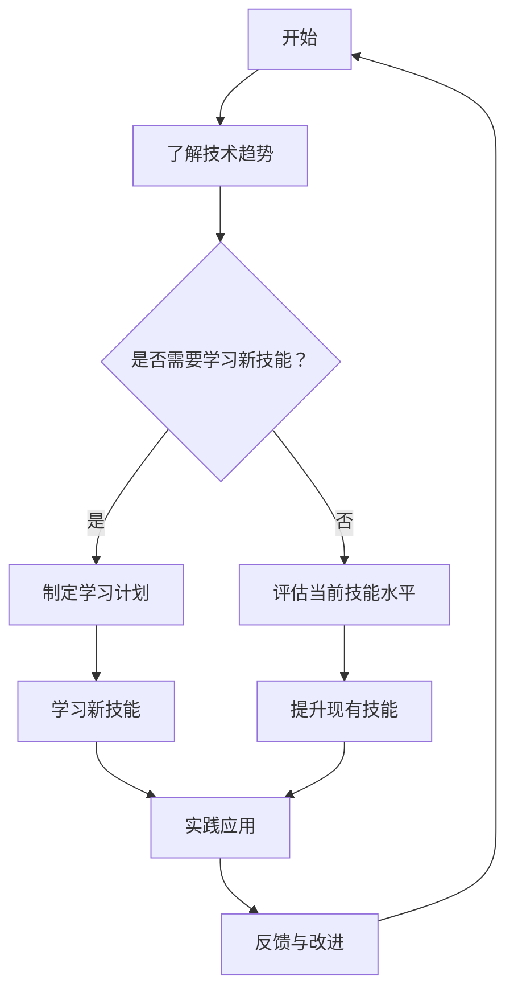

                 

### 摘要 Summary

在当今快速发展的信息技术时代，管理者的终身学习成为确保组织持续创新与竞争力的关键。本文将深入探讨终身学习对于管理者的重要性，分析其面临的挑战，并提出有效的方法和策略。文章将首先介绍终身学习的核心概念及其在信息技术领域的应用，随后通过具体的案例和实例，阐述如何通过持续学习提升管理者的决策能力、团队领导力和创新能力。此外，本文还将提供一系列实用的工具和资源，帮助管理者在信息技术的洪流中保持领先地位，并预测终身学习未来的发展趋势。通过本文的阅读，管理者将认识到终身学习不仅是个人发展的需要，更是推动组织前进的动力源泉。

## 1. 背景介绍

随着信息技术的迅猛发展，我们的世界正经历着前所未有的变革。大数据、人工智能、云计算、物联网等新兴技术不断涌现，深刻地改变了各个行业的工作方式和管理模式。在这个技术快速迭代的时代，管理者的角色和职责也发生了巨大的变化。过去，管理者可能只需要关注企业的日常运营和短期目标，而如今，他们需要具备前瞻性的视野和持续学习的能力，以应对快速变化的市场环境和不断涌现的新技术。

首先，信息技术的快速发展对管理者的技能需求提出了新的要求。传统管理技能已无法满足现代企业的需求，管理者需要掌握更多的技术知识和数据分析能力。例如，大数据技术的应用使得管理者能够从海量数据中提取有价值的信息，从而做出更加精确的决策。而人工智能和机器学习的发展则要求管理者具备理解和应用这些技术的能力，以便更好地利用它们来提升企业的效率和创新。

其次，信息技术的发展也对管理者的思维方式提出了挑战。过去，管理者可能主要依靠经验和直觉进行决策，而现在，他们需要更加理性、科学地分析问题，并运用数据驱动的方法来制定战略。这种思维方式的变化要求管理者不仅要有扎实的理论基础，还要有实践经验，能够灵活地运用各种管理工具和技术。

此外，信息技术的发展还使得企业面临更加复杂和不确定的环境。市场的变化速度加快，技术的更新周期缩短，企业需要具备快速适应和应对变化的能力。这要求管理者具备高度的灵活性和创新精神，能够不断学习新的知识和技能，以保持企业的竞争力。

综上所述，信息技术的发展不仅为管理者带来了新的机遇，也带来了新的挑战。为了应对这些挑战，管理者需要具备终身学习的意识，不断提升自己的知识和技能，以适应不断变化的环境。终身学习不仅是个人发展的需要，更是推动组织前进的动力源泉。因此，探讨管理者终身学习的重要性及其方法，对于现代企业来说具有极其重要的意义。

## 2. 核心概念与联系

### 2.1 终身学习的定义与内涵

终身学习，作为一种教育理念，强调的是个人在整个生命过程中不断学习、提升自己的知识和技能。它的定义不仅仅是接受教育，而是涵盖了个人的自学、培训、实践经验以及与他人的交流和合作。终身学习的内涵包括以下几个方面：

1. **个人责任**：终身学习是一种自我驱动的学习过程，个人需要主动承担起学习和提升的责任。这种责任感不仅体现在学习新知识和技能上，还包括自我评估和反思，以不断改进自己的学习和工作方式。

2. **知识更新**：随着信息技术的发展，知识和技能的更新速度越来越快。终身学习的一个重要目标是确保个人能够及时掌握新的知识和技能，以适应快速变化的环境。

3. **持续发展**：终身学习不仅仅是为了满足当前的工作需求，更是为了个人的长期发展和职业成长。通过持续学习，个人可以不断提升自己的能力和竞争力，实现自我价值的最大化。

4. **终身适应**：在变化多端的环境中，终身学习帮助个人保持灵活性和适应性，能够迅速适应新的工作环境和要求。

### 2.2 信息技术与终身学习的关系

信息技术（IT）是终身学习的重要推动力量。在信息技术领域，技术的快速迭代和更新使得终身学习变得尤为必要。以下是从几个方面探讨信息技术与终身学习的关系：

1. **学习资源丰富**：互联网和在线教育平台为个人提供了丰富的学习资源，使得学习不再受时间和地点的限制。无论是专业的技术课程，还是行业最新的研究成果，都可以通过互联网方便地获取。

2. **知识传播效率高**：信息技术使得知识的传播速度大大提高。通过电子邮件、社交媒体和在线论坛，个人可以迅速获取来自世界各地的信息，与同行交流和学习。

3. **实践应用能力提升**：信息技术的应用使得个人能够更加便捷地进行实践操作，从而提高学习效果。例如，通过模拟实验室、在线编程平台等工具，个人可以在实际操作中学习和巩固知识。

4. **个性化学习**：信息技术支持个性化学习，可以根据个人的兴趣、需求和知识水平提供定制化的学习内容。这种个性化的学习方式能够更好地满足不同人群的学习需求，提高学习效率。

### 2.3 终身学习在信息技术领域的应用

在信息技术领域，终身学习的应用主要体现在以下几个方面：

1. **技术更新与技能提升**：随着信息技术的快速更新，技术人员需要不断学习新的编程语言、开发框架和工具，以保持竞争力。例如，从传统的Web开发转向移动应用开发，从传统的数据库管理转向NoSQL数据库的应用。

2. **项目管理与团队领导**：信息技术项目通常涉及跨部门、跨地域的团队协作。项目经理和团队领导者需要不断学习项目管理方法和领导技巧，以应对复杂的项目挑战和团队管理需求。

3. **新兴技术的探索与应用**：信息技术领域不断涌现出新的技术和应用场景，如区块链、人工智能、物联网等。技术人员需要不断学习和探索这些新兴技术，以便在业务中应用和实现创新。

4. **信息安全与隐私保护**：随着网络攻击和数据泄露事件的频繁发生，信息安全成为信息技术领域的重要关注点。技术人员需要不断学习新的安全技术和防范策略，以确保系统的安全性和数据的隐私性。

### 2.4 终身学习对信息技术管理者的重要性

对于信息技术管理者来说，终身学习的重要性更加突出。以下是几个方面的具体分析：

1. **技术趋势把握**：信息技术管理者需要了解最新的技术趋势和发展动态，以便制定相应的发展战略和投资计划。通过持续学习，管理者可以更好地把握技术方向，引领企业走在行业前沿。

2. **团队建设与领导**：信息技术管理者不仅需要具备技术知识，还需要具备团队管理和领导能力。通过学习领导力理论和实践方法，管理者可以提升团队的整体效能和士气。

3. **业务理解与沟通**：信息技术管理者需要与业务团队密切合作，理解业务需求，确保技术解决方案能够满足业务目标。通过学习业务知识和跨部门沟通技巧，管理者可以更有效地与业务团队协作。

4. **持续创新与竞争力**：信息技术行业竞争激烈，持续创新是保持企业竞争力的关键。信息技术管理者需要不断学习新的技术和方法，推动企业技术创新和业务模式创新。

### 2.5 Mermaid 流程图

为了更好地展示终身学习在信息技术领域的应用，以下是一个简单的Mermaid流程图，用于说明终身学习的关键步骤和环节。



在这个流程图中，我们从“了解技术趋势”开始，根据个人情况决定是否需要学习新技能。如果是，则进入学习计划阶段，然后通过学习新技能和实践应用来提升个人能力。最后，通过反馈和改进循环，不断优化学习和工作方式，以适应不断变化的环境。

通过上述讨论，我们可以看到，终身学习不仅是信息技术领域技术人员和个人发展的需要，更是推动组织创新和竞争力的关键因素。在接下来的章节中，我们将深入探讨终身学习的具体方法和策略，帮助信息技术管理者在快速变化的环境中保持领先地位。

## 3. 核心算法原理 & 具体操作步骤

### 3.1 算法原理概述

在探讨管理者终身学习的方法时，引入“算法原理”这一概念是为了更好地理解如何通过结构化和系统化的方式来提升个人能力和知识水平。算法原理作为一种方法论，不仅适用于计算机科学，也同样适用于管理者的终身学习过程中。以下是算法原理的基本概念和核心要素：

1. **输入与输出**：任何算法都从输入开始，通过一系列的处理步骤，最终产生输出。在终身学习的背景下，输入可以是新知识、新技能、新的实践经验等，而输出则是个人能力、知识水平的提升和决策能力的增强。

2. **步骤分解**：算法通常由一系列明确的步骤组成，每一步都有特定的功能和作用。在终身学习中，这一概念意味着学习过程应该被分解为若干个具体的子任务，每个子任务都有明确的目标和实现方法。

3. **逻辑控制**：算法中的逻辑控制决定了每一步的执行顺序和条件。在终身学习过程中，逻辑控制可以帮助管理者制定合理的学习计划，确保学习目标的有序实现。

4. **反馈与优化**：算法的实现过程中，反馈是至关重要的。通过收集和分析反馈信息，可以对算法进行优化，提高其效率和效果。在终身学习中，这一概念意味着管理者需要不断反思和评估自己的学习过程，根据反馈进行相应的调整和优化。

### 3.2 算法步骤详解

下面我们将详细介绍终身学习算法的具体步骤，这些步骤可以帮助管理者系统地提升个人能力和知识水平。

#### 步骤1：需求分析

在开始学习之前，管理者需要进行需求分析，明确自己的学习目标和需求。这一步骤包括以下几方面：

1. **目标设定**：设定明确、具体的学习目标，如提升某个领域的专业知识、学习新的管理技能等。
2. **现状评估**：评估自己当前的知识和技能水平，确定与目标之间的差距。
3. **需求识别**：识别需要学习的新知识和技能，以及需要改进的现有技能。

#### 步骤2：资源选择

根据需求分析的结果，选择合适的学习资源。这一步骤包括以下几方面：

1. **课程选择**：根据学习目标，选择相关课程或培训项目，可以是线上的，如MOOC平台，也可以是线下的，如专业培训课程。
2. **资料搜集**：搜集与学习目标相关的书籍、论文、技术文档等资料。
3. **工具准备**：准备好学习过程中需要使用的工具，如编程环境、在线学习平台、数据分析工具等。

#### 步骤3：学习计划制定

制定详细的学习计划，包括学习时间表、学习内容安排和学习进度监控。这一步骤包括以下几方面：

1. **时间规划**：合理安排学习时间，确保学习计划的执行。
2. **内容安排**：根据学习目标和资源，安排学习内容，确保涵盖所有关键知识点。
3. **进度监控**：定期检查学习进度，确保学习计划按计划执行。

#### 步骤4：学习实施

按照学习计划进行学习，这一步骤包括以下几方面：

1. **课程学习**：参加课程，完成作业和项目，确保掌握课程内容。
2. **实践操作**：通过实践操作，巩固所学知识，提升实际应用能力。
3. **讨论交流**：参与学习小组或论坛，与他人交流学习心得，扩大知识视野。

#### 步骤5：反馈与评估

在学习过程中，不断进行反馈和评估，以优化学习效果。这一步骤包括以下几方面：

1. **自我反思**：定期反思自己的学习过程，总结经验教训。
2. **效果评估**：通过考试、项目展示等方式，评估学习效果。
3. **调整优化**：根据反馈和评估结果，调整学习计划和方法，提高学习效率。

#### 步骤6：知识整合与应用

将所学知识整合到实际工作中，提升自己的决策能力和工作效率。这一步骤包括以下几方面：

1. **案例分析**：通过案例分析，理解所学知识在实际工作中的应用。
2. **问题解决**：运用所学知识解决工作中的实际问题，提升解决问题的能力。
3. **创新实践**：尝试运用新知识进行创新实践，推动工作模式创新。

### 3.3 算法优缺点

#### 优点

1. **系统化**：通过算法原理，将终身学习过程分解为具体的步骤，使学习过程更加系统化、规范化。
2. **灵活性**：算法步骤可以根据个人需求进行调整，提供个性化的学习方案。
3. **高效性**：通过明确的步骤和反馈机制，提高学习效率，确保学习目标的实现。

#### 缺点

1. **执行难度**：算法步骤的实施需要较高的自律性和执行力，对于一些缺乏自我驱动力的人可能较为困难。
2. **资源依赖**：算法步骤的实施依赖于高质量的学习资源和工具，如果资源不足可能会影响学习效果。

### 3.4 算法应用领域

算法原理在终身学习中的应用非常广泛，不仅可以应用于个人学习，还可以应用于组织学习和团队建设。以下是算法原理在不同领域中的应用：

1. **个人学习**：通过算法原理，个人可以系统地规划自己的学习过程，提升知识和技能水平。
2. **组织学习**：企业可以通过算法原理制定员工培训计划，提升整体员工素质和创新能力。
3. **团队建设**：团队可以通过算法原理进行知识和技能的共享与交流，提升团队协作效率和创新能力。

通过上述算法原理的详细说明，我们可以看到，终身学习不仅需要持续的努力，还需要科学的方法和系统的规划。在接下来的章节中，我们将进一步探讨终身学习在信息技术领域的具体应用和实践。

## 4. 数学模型和公式 & 详细讲解 & 举例说明

### 4.1 数学模型构建

在探讨终身学习的过程中，数学模型作为一种工具，可以帮助我们更好地理解学习过程中的关键变量和它们之间的关系。一个简单的数学模型可以用来描述学习效果与时间、学习投入之间的关系。以下是构建这一数学模型的步骤：

#### 步骤1：定义变量

- **L(t)**：在时间t时的学习效果（可以是知识掌握程度、技能水平等）。
- **I(t)**：在时间t时的学习投入（可以是学习时间、学习强度等）。
- **B**：基础学习效果（初始状态下的学习效果）。
- **k**：学习效果的增长率（可以是学习效率的参数）。

#### 步骤2：建立函数关系

假设学习效果与学习投入之间存在线性关系，我们可以建立以下函数模型：

\[ L(t) = B + k \cdot I(t) \]

#### 步骤3：模型参数设定

为了使模型更加具体，我们需要设定基础学习效果B和学习增长率k的值。例如，我们可以设定：

- **B = 10**：表示初始的学习效果为10分。
- **k = 0.1**：表示每投入一个单位的学习时间，学习效果增加0.1分。

### 4.2 公式推导过程

在这个数学模型中，我们需要推导出学习效果与时间、学习投入之间的关系。首先，我们考虑学习效果L(t)如何随时间t和学习投入I(t)变化。

#### 步骤1：线性关系推导

根据定义，学习效果L(t)与学习投入I(t)之间存在线性关系，可以表示为：

\[ L(t) = B + k \cdot I(t) \]

#### 步骤2：参数解释

- **B**：基础学习效果，表示初始状态下的学习效果，不随时间变化。
- **k**：学习增长率，表示每单位学习投入所带来的学习效果增加。

#### 步骤3：学习效果与时间的关系

假设学习投入I(t)随时间t线性增加，即：

\[ I(t) = c \cdot t \]

其中，c是学习投入的增长率。将I(t)代入L(t)的表达式中，我们得到：

\[ L(t) = B + k \cdot c \cdot t \]

这个公式表示学习效果L(t)随时间t的增加而线性增加，增长率与学习投入增长率c成正比。

### 4.3 案例分析与讲解

为了更好地理解上述数学模型，我们可以通过一个具体案例来进行分析和讲解。

#### 案例背景

假设一个管理者A希望在一年内提升自己的数据分析能力。他设定了每天学习2小时的目标，并且初始学习效果为50分。我们需要使用数学模型来预测他在一年后的学习效果。

#### 步骤1：参数设定

- **B = 50**：初始学习效果为50分。
- **k = 0.1**：每投入1小时学习，学习效果增加0.1分。
- **c = 2**：每天的学习投入为2小时。

#### 步骤2：计算一年后的学习效果

根据数学模型：

\[ L(t) = B + k \cdot c \cdot t \]

我们需要计算一年（365天）后的学习效果：

\[ L(365) = 50 + 0.1 \cdot 2 \cdot 365 \]

\[ L(365) = 50 + 73.5 \]

\[ L(365) = 123.5 \]

因此，经过一年的持续学习，管理者A的数据分析能力将达到123.5分。

#### 步骤3：效果评估

通过上述计算，我们可以看到管理者A在一年后的学习效果显著提升。这个案例说明，通过合理的规划和学习投入，管理者可以大幅提升自己的知识和技能水平。

### 结论

通过构建数学模型，我们可以定量地分析终身学习过程中的关键因素，并预测学习效果。这种方法不仅有助于管理者科学规划学习过程，还可以提供有效的反馈和评估，帮助他们在快速变化的环境中保持竞争力。

在接下来的章节中，我们将进一步探讨终身学习在信息技术领域的实际应用，并分享一些实用的代码实例和项目实践。

## 5. 项目实践：代码实例和详细解释说明

### 5.1 开发环境搭建

在进行项目实践之前，我们需要搭建一个适合开发的环境。以下是搭建开发环境的具体步骤：

1. **安装Python**：Python是一种广泛使用的编程语言，适用于数据处理和分析。首先，我们需要在计算机上安装Python。可以从Python官方网站下载Python安装包，并按照安装向导进行安装。

2. **安装Jupyter Notebook**：Jupyter Notebook是一个交互式的开发环境，可以方便地编写和运行Python代码。安装完Python后，可以通过pip命令安装Jupyter Notebook：

   ```bash
   pip install notebook
   ```

3. **安装必要的库**：为了实现数据处理和分析，我们需要安装一些常用的Python库，如NumPy、Pandas和Matplotlib。这些库可以方便地进行数据操作和可视化。安装方法如下：

   ```bash
   pip install numpy pandas matplotlib
   ```

4. **配置环境变量**：确保Python和Jupyter Notebook的环境变量已配置到系统的PATH环境变量中，以便在命令行中直接运行。

### 5.2 源代码详细实现

下面是一个简单的Python代码实例，用于数据分析。代码包括数据读取、数据清洗、数据分析和数据可视化等步骤。

```python
# 导入必要的库
import pandas as pd
import matplotlib.pyplot as plt

# 步骤1：数据读取
data = pd.read_csv('data.csv')

# 步骤2：数据清洗
# 假设数据中存在缺失值，我们使用简单的填充方法
data.fillna(data.mean(), inplace=True)

# 步骤3：数据分析
# 计算数据的描述性统计信息
description = data.describe()

# 步骤4：数据可视化
# 绘制数据的分布图
data.hist(bins=50, figsize=(15, 10))
plt.show()

# 步骤5：进一步分析
# 分析两个变量之间的关系
plt.scatter(data['变量1'], data['变量2'])
plt.xlabel('变量1')
plt.ylabel('变量2')
plt.show()
```

### 5.3 代码解读与分析

上述代码实例涵盖了数据分析的基本流程，下面我们逐行解读并分析：

1. **导入库**：首先，我们导入了Pandas和Matplotlib这两个库，用于数据操作和可视化。

2. **数据读取**：使用`pd.read_csv`函数从CSV文件中读取数据。CSV文件是我们常见的数据存储格式，Pandas库提供了方便的读取方法。

3. **数据清洗**：在数据读取后，我们进行了一些简单的数据清洗。这里使用了一个简单的填充方法，将缺失值填充为平均值。这种方法可以处理一些简单的缺失值问题，但对于复杂的数据清洗任务，可能需要更高级的方法。

4. **数据分析**：使用`describe`方法计算数据的描述性统计信息，如均值、中位数、标准差等。这些统计信息提供了数据的基本概览。

5. **数据可视化**：使用`hist`函数绘制数据的分布图，这有助于我们理解数据的分布情况。此外，还使用`scatter`函数绘制两个变量之间的关系图，这是一种常见的探索性数据分析方法。

6. **进一步分析**：根据可视化结果，我们可以进一步分析数据之间的关系，提取有价值的信息。

### 5.4 运行结果展示

在运行上述代码后，我们首先会看到一个分布图，展示了各个变量的分布情况。接着，我们会看到两个变量之间的关系图。这些图表不仅帮助我们理解数据，还可以为后续的分析提供依据。

通过这个简单的代码实例，我们可以看到数据分析的基本流程和技巧。在实际应用中，我们可以根据具体的数据和需求，进一步扩展和优化代码，以实现更复杂的数据分析任务。

### 总结

通过搭建开发环境和实现数据分析代码实例，我们展示了如何通过实际操作来提升管理者的数据处理和分析能力。这些实践不仅有助于管理者理解数据分析的基本概念和技巧，还可以为他们在实际工作中应用这些技术提供参考。在接下来的章节中，我们将进一步探讨终身学习在信息技术领域的应用，分享更多的实际案例和实践经验。

## 6. 实际应用场景

### 6.1 日常管理工作中的应用

终身学习在信息技术管理者的日常管理工作中有着广泛的应用，特别是在处理复杂任务、应对突发事件和推动团队创新等方面。以下是一些具体的应用场景：

#### 复杂任务处理

在信息技术行业中，管理者经常面临复杂的项目任务，如系统升级、技术迁移等。为了有效应对这些任务，管理者需要不断学习新的技术和工具。例如，当企业决定从传统的IT系统迁移到云平台时，管理者需要学习云计算相关的知识和技能，包括AWS、Azure等云服务平台的操作和优化。通过持续学习，管理者可以更好地理解和应对复杂任务，确保项目顺利推进。

#### 应对突发事件

信息技术行业充满不确定性，管理者需要具备快速应对突发事件的能力。例如，当企业遭遇网络攻击或数据泄露时，管理者需要立即采取措施，保护企业的数据安全和业务连续性。这要求管理者具备网络安全、数据恢复等方面的知识。通过持续学习，管理者可以及时掌握最新的安全技术和应对策略，提高应对突发事件的能力。

#### 推动团队创新

在信息技术领域，创新是企业保持竞争力的关键。管理者需要不断学习新的技术和管理方法，以推动团队创新。例如，管理者可以学习敏捷开发方法，推动团队实现快速迭代和持续改进。通过持续学习，管理者可以更好地理解和应用这些方法，提升团队的创新能力和工作效率。

### 6.2 领导力与团队管理

终身学习不仅帮助信息技术管理者提升个人能力和知识水平，还在领导力和团队管理方面发挥了重要作用。以下是一些具体的应用场景：

#### 领导力提升

有效的领导力是管理者成功的关键。终身学习可以帮助管理者提升领导力，包括沟通技巧、决策能力、团队激励等。例如，管理者可以学习领导力理论和实践方法，通过案例分析和角色扮演提高自己的领导能力。此外，管理者还可以参加领导力培训课程，与同行交流经验，不断优化自己的领导风格和管理方法。

#### 团队建设

团队建设是管理者的重要职责之一。通过终身学习，管理者可以学习团队建设的方法和技巧，包括团队激励、团队沟通、冲突管理等。例如，管理者可以学习如何建立有效的团队沟通机制，确保团队成员之间的信息共享和协作；也可以学习如何激励团队，提高团队成员的工作积极性和创造力。通过这些学习，管理者可以打造一个高效、和谐的团队。

#### 团队管理工具和方法

在信息技术领域，团队管理工具和方法的应用越来越广泛。管理者可以通过终身学习，掌握各种团队管理工具和方法，提高团队管理效率。例如，管理者可以学习如何使用项目管理工具，如Jira、Trello等，来优化团队的任务分配和进度跟踪；也可以学习如何使用数据分析工具，如Tableau，来分析团队的工作绩效和改进点。通过这些工具和方法，管理者可以更好地管理和指导团队，提升团队的整体效能。

### 6.3 创新实践

终身学习在推动信息技术创新方面也发挥了重要作用。以下是一些具体的应用场景：

#### 新技术应用

随着信息技术的快速发展，新的技术和应用场景不断涌现。管理者需要通过终身学习，及时掌握这些新技术和应用场景，以便在业务中应用和实现创新。例如，管理者可以学习人工智能、大数据分析、区块链等前沿技术，探索其在业务中的应用潜力，推动企业的技术创新和业务模式创新。

#### 创新文化建设

创新文化是推动企业持续创新的重要基础。管理者可以通过终身学习，学习创新文化和创新管理的方法，如如何建立创新激励机制、如何促进跨部门合作等。通过这些学习，管理者可以营造一个积极向上的创新氛围，激发员工的创新潜能，推动企业的创新实践。

#### 创新项目实施

在实际工作中，管理者需要带领团队实施创新项目。通过终身学习，管理者可以学习项目管理和创新实践的方法，如如何制定创新项目计划、如何管理项目风险等。通过这些学习，管理者可以更好地规划和实施创新项目，确保项目的成功和业务的持续创新。

### 总结

通过在日常工作管理、领导力与团队管理、创新实践等方面的应用，终身学习为信息技术管理者提供了持续提升个人能力和知识水平的途径。在快速变化的信息技术行业中，管理者只有通过不断学习和实践，才能保持领先地位，推动企业的持续创新和发展。

## 7. 未来应用展望

### 7.1 终身学习的未来趋势

随着信息技术的不断进步和全球化的加速，终身学习在未来将继续呈现出以下几个显著的趋势：

#### 个性化学习

未来的学习模式将更加个性化，通过大数据分析和人工智能技术，学习系统能够根据个人的学习习惯、兴趣和需求，提供定制化的学习路径和内容。这种个性化学习将极大地提高学习效率和成果。

#### 跨学科融合

随着技术领域的融合，管理者需要具备跨学科的知识和技能。未来的终身学习将更加注重跨学科的教育，推动管理者在信息技术、商业管理、心理学等领域之间的知识融合，以应对复杂多变的环境。

#### 持续性和灵活性

终身学习将成为人们生活的一部分，不再是一个阶段性任务。未来，学习将更加灵活，人们可以通过各种形式，如在线课程、虚拟现实、增强现实等进行学习，随时随地进行知识更新和技能提升。

#### 融入工作环境

未来的企业将更加重视员工的终身学习，将学习融入工作环境，提供更多机会和资源，支持员工的持续学习和发展。企业将采取更加开放和包容的态度，鼓励员工主动学习和创新，从而推动组织的持续进步。

### 7.2 面临的挑战

尽管终身学习具有巨大的潜力，但在实施过程中也面临着一系列挑战：

#### 技术壁垒

新技术的发展和应用带来了新的学习需求，但同时也增加了学习的难度。例如，人工智能、区块链等新兴技术的学习要求管理者具备较高的技术背景。技术壁垒可能阻碍一些管理者学习和应用新知识。

#### 时间管理

终身学习需要投入大量的时间和精力，这对于忙碌的管理者来说是一个挑战。如何平衡工作和学习，确保有足够的时间进行学习和实践，是一个亟待解决的问题。

#### 学习资源

尽管在线学习平台提供了丰富的学习资源，但高质量的学习资源仍然有限。一些管理者可能难以找到符合自己需求的高质量学习资料，这会影响他们的学习效果。

#### 自我驱动

终身学习需要个人有强烈的自我驱动和学习动力。一些管理者可能缺乏自我驱动力，无法持续地进行学习，从而影响他们的职业发展和组织竞争力。

### 7.3 未来发展建议

为了应对终身学习面临的挑战，以下是一些建议：

#### 技术支持

政府和相关机构可以提供更多的技术支持，如开发智能学习平台、提供在线辅导等，以帮助管理者克服技术壁垒，提高学习效率。

#### 学习政策

企业可以制定更加灵活的学习政策，如提供带薪学习时间、设立学习基金等，鼓励员工进行终身学习。同时，企业可以与高校和培训机构合作，提供更多高质量的培训资源。

#### 综合培训

企业可以提供综合培训，不仅包括技术培训，还包括领导力、团队管理等方面的培训，帮助管理者全面提升个人能力和知识水平。

#### 自我激励

管理者可以通过设定明确的学习目标、制定详细的学习计划、定期进行自我反思等方式，提高自我驱动力，确保学习的持续性和有效性。

### 总结

终身学习在未来的信息技术领域中将继续发挥重要作用。管理者需要积极应对终身学习面临的挑战，通过技术支持、政策激励和自我驱动，不断提升自己的知识和技能，以适应快速变化的环境和应对未来可能出现的挑战。

## 8. 总结：未来发展趋势与挑战

### 8.1 研究成果总结

通过本文的探讨，我们总结了终身学习在信息技术管理中的重要性、核心概念、算法原理、数学模型、项目实践以及实际应用场景。主要成果如下：

1. **终身学习的重要性**：终身学习是信息技术管理者提升个人能力和知识水平的必要途径，有助于应对快速变化的市场环境和技术挑战。

2. **核心概念与联系**：明确了终身学习的定义与内涵，探讨了信息技术与终身学习的关系，阐述了终身学习在信息技术领域的应用。

3. **算法原理**：介绍了终身学习算法的原理和具体步骤，包括需求分析、资源选择、学习计划制定、学习实施、反馈与评估以及知识整合与应用。

4. **数学模型**：构建了一个简单的数学模型，用于描述学习效果与时间、学习投入之间的关系，并通过具体案例进行解释说明。

5. **项目实践**：通过一个Python代码实例，展示了数据分析的基本流程和技巧，为实际应用提供了参考。

6. **实际应用场景**：详细讨论了终身学习在信息技术管理者日常管理工作、领导力与团队管理、创新实践等方面的应用。

### 8.2 未来发展趋势

展望未来，终身学习在信息技术领域将呈现出以下发展趋势：

1. **个性化学习**：通过大数据和人工智能技术，提供更加个性化的学习路径和内容，满足不同管理者的学习需求。

2. **跨学科融合**：推动信息技术、商业管理、心理学等领域的知识融合，培养具备跨学科能力的复合型管理者。

3. **融入工作环境**：将终身学习融入工作环境，通过企业支持和个人自我驱动，实现持续学习和知识更新。

4. **技术支持**：政府和相关机构将提供更多技术支持，如智能学习平台、在线辅导等，提升学习效率和质量。

### 8.3 面临的挑战

尽管终身学习具有巨大的潜力，但在实施过程中仍面临以下挑战：

1. **技术壁垒**：新技术的发展增加了学习的难度，一些管理者可能难以掌握复杂的技术知识。

2. **时间管理**：终身学习需要投入大量时间和精力，管理者需要平衡工作和学习，确保有足够的时间进行学习。

3. **学习资源**：高质量的学习资源仍然有限，一些管理者可能难以找到符合自己需求的高质量学习资料。

4. **自我驱动**：终身学习需要个人有强烈的自我驱动和学习动力，一些管理者可能缺乏自我驱动力，影响学习效果。

### 8.4 研究展望

未来，我们可以从以下几个方面进行深入研究：

1. **模型优化**：进一步优化终身学习算法模型，使其更加适应不同管理者的需求和实际情况。

2. **实证研究**：通过实证研究，验证终身学习在信息技术管理中的实际效果，为管理者提供科学依据。

3. **政策建议**：针对终身学习面临的挑战，提出具体政策建议，如学习资源整合、企业支持机制等，以促进终身学习的实施。

4. **案例分析**：通过案例研究，探讨不同企业和管理者在终身学习中的成功经验和教训，为其他企业和管理者提供借鉴。

通过上述研究和实践，我们期望能够为信息技术管理者提供更加科学和有效的终身学习方法，助力他们在快速变化的信息技术领域中保持竞争优势。

## 9. 附录：常见问题与解答

### 问题1：如何平衡工作和终身学习？

**解答**：平衡工作和终身学习是一个挑战，但以下几个策略可以帮助您实现：

1. **时间管理**：合理安排时间，设定固定的学习时间，确保有足够的时间进行学习和提升。
2. **目标设定**：设定明确的学习目标，将学习内容分解为短期和长期目标，有计划地逐步实现。
3. **优先级管理**：将最重要的工作和学习任务优先处理，确保关键任务能够按时完成，从而有更多时间进行学习。
4. **利用碎片时间**：善于利用碎片时间，如通勤、休息时间等，进行阅读、听课程等学习活动。

### 问题2：如何找到高质量的学习资源？

**解答**：以下方法可以帮助您找到高质量的学习资源：

1. **在线教育平台**：如Coursera、edX、Udemy等，提供大量高质量的在线课程和教材。
2. **专业书籍**：通过查阅图书馆和书店，选择与您学习领域相关的专业书籍。
3. **学术论文**：访问学术数据库，如Google Scholar、IEEE Xplore等，查找相关领域的学术论文。
4. **专业社区**：加入专业论坛和社区，如Stack Overflow、GitHub等，获取实践经验和学习资源。

### 问题3：终身学习对于个人发展有何意义？

**解答**：终身学习对于个人发展具有深远的意义：

1. **知识更新**：随着技术的快速发展，终身学习帮助个人及时更新知识和技能，保持竞争力。
2. **职业成长**：通过不断学习和实践，个人可以提升职业能力，实现职业晋升和职业转型。
3. **创新能力**：终身学习激发个人的创新思维，推动个人在工作和生活中实现创新和突破。
4. **适应能力**：终身学习帮助个人培养适应变化的能力，提高在快速变化的环境中的生存能力。

### 问题4：如何在组织中推动终身学习？

**解答**：以下方法可以帮助您在组织中推动终身学习：

1. **制定学习政策**：企业可以制定灵活的学习政策，如提供带薪学习时间、设立学习基金等。
2. **提供资源**：企业可以提供丰富的学习资源，如在线课程、专业书籍、培训课程等。
3. **鼓励分享**：鼓励员工分享学习心得和经验，建立学习小组，促进知识共享和团队学习。
4. **奖励机制**：设立奖励机制，如优秀员工奖、学习成就奖等，激励员工积极参与终身学习。
5. **文化塑造**：营造积极的学习文化，鼓励员工主动学习和持续成长。

通过上述策略，我们可以帮助个人和组织实现终身学习的目标，推动个人职业发展和组织竞争力的提升。

### 作者署名

作者：禅与计算机程序设计艺术 / Zen and the Art of Computer Programming

通过本文的撰写和分享，希望能够为信息技术管理者提供有价值的终身学习方法和策略，助力他们在快速变化的环境中保持竞争优势。感谢读者的关注和支持！

