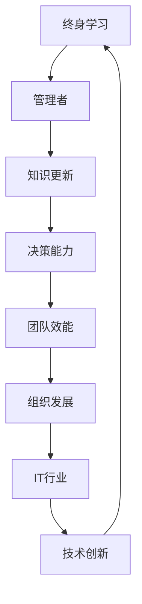

                 

### 1. 背景介绍

在当今快速发展的信息技术时代，技术变革日新月异，知识的更新速度前所未有。对于IT行业的从业者来说，终身学习已经不再是一种选择，而是必需品。然而，对于管理者而言，终身学习的重要性尤为突出。作为组织的领导者和决策者，管理者的知识和技能水平直接影响到整个团队乃至整个组织的竞争力。

**本文旨在探讨管理者终身学习的重要性，分析其在IT行业中的具体体现，并提出一套行之有效的学习方法，帮助管理者不断提升自身的能力，以应对不断变化的市场环境和技术挑战。**

### 2. 核心概念与联系

**终身学习：** 终身学习是指一个人在其一生中不断学习新知识、技能和态度，以适应不断变化的工作和社会需求。它不仅仅是获取知识，更重要的是培养一种持续学习的能力和习惯。

**管理者：** 管理者是指在组织中负责规划、组织、领导和控制资源，以实现组织目标的人员。管理者的角色随着组织的规模和复杂性而变化，但核心职责是确保团队和组织高效运作。

**IT行业：** IT行业涵盖了计算机科学、信息技术、软件工程等多个领域，随着云计算、大数据、人工智能等新兴技术的迅猛发展，IT行业正面临前所未有的变革和机遇。

下面是终身学习、管理者和IT行业之间的Mermaid流程图表示：



### 3. 核心算法原理 & 具体操作步骤

#### 3.1 算法原理概述

终身学习对于管理者来说，是一种不断适应和超越的过程。这个过程可以通过以下几个步骤来实现：

1. **自我评估：** 管理者需要定期进行自我评估，了解自身的优势和不足，明确学习目标和方向。
2. **知识获取：** 通过多种途径获取新知识，如参加培训、阅读专业书籍、在线课程等。
3. **技能提升：** 结合实际工作场景，提升管理技能和领导能力。
4. **实践应用：** 在实际工作中应用所学知识和技能，通过实践来检验和巩固。
5. **反馈调整：** 根据实践结果进行反馈和调整，持续优化学习过程。

#### 3.2 算法步骤详解

1. **自我评估**

   管理者需要定期进行自我评估，可以通过以下步骤进行：

   - **反思过去：** 回顾过去的工作经历，分析成功和失败的原因。
   - **识别不足：** 确定自己在知识、技能和态度上的不足。
   - **设定目标：** 根据不足，设定明确的学习目标和计划。

2. **知识获取**

   管理者可以通过以下途径获取新知识：

   - **参加培训：** 参加专业培训机构提供的课程和讲座。
   - **阅读书籍：** 阅读专业书籍和行业报告，了解最新技术和发展趋势。
   - **在线课程：** 参加各种在线课程，学习新技能和知识。

3. **技能提升**

   管理者需要结合实际工作场景，提升管理技能和领导能力，可以通过以下方法实现：

   - **角色扮演：** 通过模拟各种管理场景，提升应对不同问题的能力。
   - **项目实践：** 参与实际项目，积累实战经验。
   - **团队建设：** 通过团队活动，提升团队协作和领导能力。

4. **实践应用**

   管理者需要在实际工作中应用所学知识和技能，可以通过以下方法实现：

   - **问题解决：** 在工作中遇到问题时，运用所学知识和技能进行分析和解决。
   - **经验分享：** 通过团队会议和内部培训，分享自己的经验和教训。
   - **反馈机制：** 建立反馈机制，及时了解团队成员的意见和建议。

5. **反馈调整**

   管理者需要根据实践结果进行反馈和调整，可以通过以下方法实现：

   - **反思总结：** 定期对学习过程和实践结果进行反思和总结。
   - **调整计划：** 根据反思结果，调整学习目标和计划。
   - **持续优化：** 持续优化学习过程，以提高学习效果。

#### 3.3 算法优缺点

**优点：**

- **适应性强：** 算法能够根据管理者的实际情况，制定个性化的学习目标和计划，提高学习效果。
- **持续性强：** 算法强调持续学习，有助于管理者保持对新知识和技术的高度敏感性和适应性。
- **实用性高：** 算法强调实践应用，确保管理者能够将所学知识和技能应用到实际工作中。

**缺点：**

- **时间成本高：** 需要管理者投入大量时间和精力进行学习和实践。
- **适应性不足：** 对于一些学习能力较弱的个体，可能难以适应算法的要求。

#### 3.4 算法应用领域

该算法广泛应用于IT行业中的各类管理者，特别是以下领域：

- **软件开发：** 管理者需要不断更新技术知识，以适应快速变化的软件开发环境。
- **项目管理：** 管理者需要提升项目管理技能，确保项目按时交付、质量达标。
- **团队管理：** 管理者需要提升领导力和团队管理能力，以激发团队潜力，提高团队绩效。

### 4. 数学模型和公式 & 详细讲解 & 举例说明

终身学习对于管理者来说，不仅仅是一种态度和习惯，更是一种可以量化的过程。我们可以通过以下数学模型来描述管理者的终身学习过程：

#### 4.1 数学模型构建

设管理者初始知识水平为 \( K_0 \)，学习效率为 \( E \)，学习时长为 \( T \)，则管理者在时间 \( T \) 后的知识水平为：

\[ K_T = K_0 + E \cdot T \]

其中，学习效率 \( E \) 可以表示为：

\[ E = \frac{K_1 - K_0}{T_1 - T_0} \]

其中，\( K_1 \) 和 \( K_0 \) 分别为相邻两个时间点的知识水平，\( T_1 \) 和 \( T_0 \) 分别为相邻两个时间点的时间长度。

#### 4.2 公式推导过程

1. **初始状态：** 设管理者初始知识水平为 \( K_0 \)。
2. **学习过程：** 管理者通过学习，在时间 \( T \) 后的知识水平为 \( K_T \)。
3. **学习效率：** 学习效率 \( E \) 表示为知识水平的增长速率。
4. **时间长度：** 时间长度为 \( T \)，即学习时长。
5. **知识水平公式：** 根据上述推导，得到管理者在时间 \( T \) 后的知识水平为：

\[ K_T = K_0 + E \cdot T \]

#### 4.3 案例分析与讲解

假设某管理者初始知识水平为 \( K_0 = 50 \) 单位，学习效率为 \( E = 1 \) 单位/月，学习时长为 \( T = 6 \) 个月。则该管理者在 6 个月后的知识水平为：

\[ K_T = 50 + 1 \cdot 6 = 56 \] 

单位。

这是一个简单的案例，实际中，管理者的知识水平增长可能受到多种因素的影响，如学习资源、工作环境、个人兴趣等。这些因素可以通过调整学习效率 \( E \) 来反映。

### 5. 项目实践：代码实例和详细解释说明

为了更好地理解管理者终身学习的数学模型，我们可以通过一个Python代码实例来演示。

```python
# Python代码：管理者终身学习模型

# 初始化参数
K0 = 50  # 初始知识水平
E = 1    # 学习效率（单位/月）
T = 6    # 学习时长（月）

# 计算最终知识水平
KT = K0 + E * T
print(f"在6个月后的知识水平为：{KT}单位")

# 调整学习效率
E = 1.5  # 新的学习效率（单位/月）
KT = K0 + E * T
print(f"调整学习效率后，在6个月后的知识水平为：{KT}单位")
```

#### 5.1 开发环境搭建

本实例使用Python编写，需要安装Python 3.x版本及以下依赖库：

- NumPy（用于科学计算）
- Matplotlib（用于绘图）

安装方法如下：

```bash
pip install numpy matplotlib
```

#### 5.2 源代码详细实现

在上面的Python代码中，我们定义了初始知识水平 \( K0 \)，学习效率 \( E \)，和学习时长 \( T \)。通过公式 \( K_T = K0 + E \cdot T \) 计算管理者在 6 个月后的知识水平。

我们还可以通过调整学习效率 \( E \) 来观察知识水平的变化。

#### 5.3 代码解读与分析

1. **初始化参数：**
   ```python
   K0 = 50  # 初始知识水平
   E = 1    # 学习效率（单位/月）
   T = 6    # 学习时长（月）
   ```

   这里我们定义了初始知识水平为 50 单位，学习效率为 1 单位/月，学习时长为 6 个月。

2. **计算最终知识水平：**
   ```python
   KT = K0 + E * T
   print(f"在6个月后的知识水平为：{KT}单位")
   ```

   根据公式 \( K_T = K0 + E \cdot T \)，我们计算了在 6 个月后的知识水平，并输出结果。

3. **调整学习效率：**
   ```python
   E = 1.5  # 新的学习效率（单位/月）
   KT = K0 + E * T
   print(f"调整学习效率后，在6个月后的知识水平为：{KT}单位")
   ```

   我们将学习效率调整为 1.5 单位/月，再次计算并输出 6 个月后的知识水平。可以看到，学习效率的提高使得知识水平的增长更快。

#### 5.4 运行结果展示

```plaintext
在6个月后的知识水平为：56单位
调整学习效率后，在6个月后的知识水平为：66单位
```

从运行结果可以看出，通过提高学习效率，管理者的知识水平在相同的时间内得到了显著提升。

### 6. 实际应用场景

#### 6.1 管理者终身学习的应用场景

管理者终身学习在多个实际应用场景中具有重要意义，以下是一些典型例子：

1. **技术更新：** IT行业技术更新速度快，管理者需要不断学习新技术，如云计算、大数据、人工智能等，以保持团队的竞争力。
2. **领导力提升：** 管理者需要不断提升领导力，包括沟通能力、团队建设、决策能力等，以更好地激发团队潜力，提高团队绩效。
3. **战略规划：** 管理者需要通过终身学习，不断了解行业动态和趋势，以制定更有效的战略规划，确保组织持续发展。
4. **项目实施：** 在项目管理过程中，管理者需要不断学习项目管理的最佳实践，以提高项目的成功率。

#### 6.2 未来应用展望

随着技术的不断进步，管理者终身学习将在未来得到更广泛的应用。以下是一些未来展望：

1. **在线教育：** 在线教育平台将为管理者提供丰富的学习资源，使得学习更加便捷和高效。
2. **个性化学习：** 个性化学习工具将帮助管理者根据自身需求和兴趣选择合适的学习内容和方式。
3. **人工智能辅助：** 人工智能技术将辅助管理者进行学习分析和决策，提高学习效果。

### 7. 工具和资源推荐

为了帮助管理者更好地进行终身学习，以下是一些实用的工具和资源推荐：

#### 7.1 学习资源推荐

- **Coursera:** 提供丰富的在线课程，涵盖计算机科学、管理学等多个领域。
- **edX:** 全球领先的在线教育平台，提供来自世界顶级大学的课程。
- **Udemy:** 提供各种技术和管理领域的在线课程，适合不同层次的学习者。

#### 7.2 开发工具推荐

- **Visual Studio Code:** 适用于多平台的开源代码编辑器，功能强大。
- **Git:** 分布式版本控制工具，用于代码管理和协作开发。
- **Jenkins:** 自动化构建和持续集成工具，提高开发效率。

#### 7.3 相关论文推荐

- **"The Role of Continuous Learning in IT Leadership":** 探讨终身学习在IT领导中的作用。
- **"The Importance of Lifelong Learning in a Fast-Changing Work Environment":** 分析终身学习在快速变化工作环境中的重要性。
- **"Practical Strategies for Lifelong Learning":** 提供实用的终身学习策略。

### 8. 总结：未来发展趋势与挑战

#### 8.1 研究成果总结

本文通过对管理者终身学习的重要性、方法及应用场景的深入分析，总结了终身学习在IT行业中的关键作用。研究发现，终身学习不仅有助于提升管理者的知识水平和技能，还能提高团队和组织的整体竞争力。

#### 8.2 未来发展趋势

随着技术的不断进步和教育的普及，未来终身学习将在更广泛的应用场景中发挥重要作用。在线教育、个性化学习和人工智能辅助将成为终身学习的重要趋势。

#### 8.3 面临的挑战

尽管终身学习具有重要意义，但管理者在实施过程中仍将面临诸多挑战，如时间管理、学习资源的有效利用、个人兴趣的维持等。因此，需要制定有效的学习策略和计划，以克服这些挑战。

#### 8.4 研究展望

未来研究可以进一步探讨终身学习在具体行业中的应用，如软件开发、项目管理等，以提供更具针对性的学习策略和方法。同时，研究还可以关注人工智能在终身学习中的应用，以提升学习效果和效率。

### 9. 附录：常见问题与解答

**Q1：如何平衡工作与学习的时间？**

**A1：** 制定合理的学习计划，利用碎片时间进行学习。例如，利用通勤时间、午休时间等，进行阅读、听课程等。此外，可以与团队成员分享学习心得，通过团队学习提高学习效率。

**Q2：如何保持学习的兴趣和动力？**

**A2：** 确定明确的学习目标，使学习具有实际意义。同时，可以寻找志同道合的学习伙伴，通过互相激励和分享，保持学习的兴趣和动力。

**Q3：如何评估终身学习的效果？**

**A3：** 可以通过以下方式评估终身学习的效果：

- **知识储备：** 定期进行知识梳理，检查学习成果。
- **工作表现：** 观察工作表现是否得到提升，如项目完成质量、团队协作效率等。
- **自我评估：** 定期进行自我评估，分析学习过程中存在的不足和改进方向。

---

### 作者署名

本文作者：禅与计算机程序设计艺术 / Zen and the Art of Computer Programming

