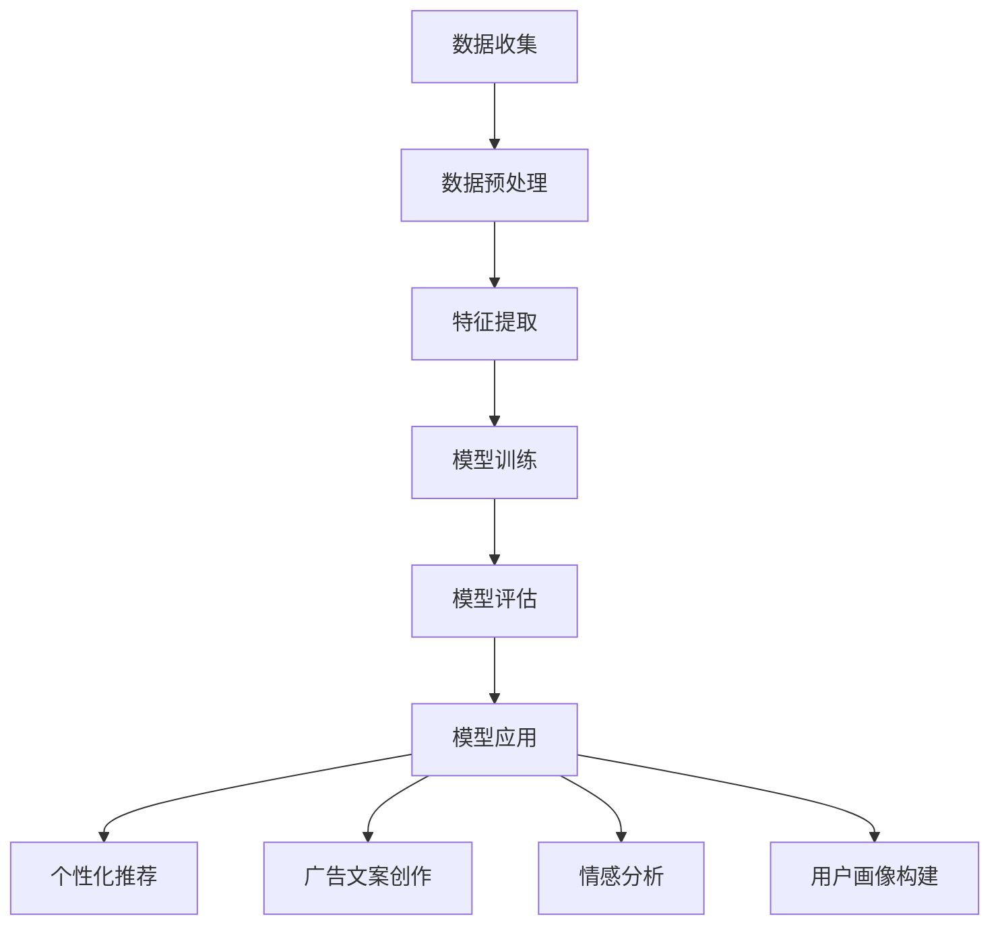

                 

## 1. 背景介绍

精准营销（Precision Marketing）作为现代营销领域的一项重要策略，旨在通过分析消费者的行为和偏好，实现个性化、差异化的营销活动，从而最大化营销效果。随着互联网技术的迅猛发展和大数据的普及，精准营销逐渐成为企业竞争的关键因素之一。

在精准营销的过程中，广告投放是至关重要的一环。然而，传统的广告投放方法往往存在一定的局限性，如广告投放效果难以精确衡量、广告与用户需求的匹配度不高、广告投放成本较高等问题。为了解决这些问题，近年来，基于人工智能（AI）和机器学习（ML）的精准营销方法逐渐受到关注。

LLM（Large Language Model，大型语言模型）是近年来在自然语言处理（NLP）领域取得重大突破的一种模型。LLM 拥有强大的语言理解能力和生成能力，能够通过大量文本数据的学习，生成符合语境、语义和逻辑的文本。LLM 的出现为精准营销带来了新的机遇，通过将 LLM 与广告投放相结合，有望大幅提升广告效果。

本文将围绕 LLM 在精准营销中的应用展开讨论，从核心概念、算法原理、数学模型、项目实践、实际应用场景等多个角度，深入剖析 LLM 提升广告效果的技术细节和实现方法，以期为读者提供有价值的参考。

## 2. 核心概念与联系

### 2.1 精准营销

精准营销是一种以数据驱动的营销策略，旨在通过对消费者行为数据的分析和挖掘，实现个性化、差异化的营销活动。精准营销的核心目标是提高营销效果，降低营销成本。

#### 精准营销的关键要素

1. **数据收集**：通过网站访问记录、社交媒体行为、购买记录等渠道收集消费者数据。
2. **数据分析**：对收集到的消费者数据进行统计分析，挖掘潜在的消费需求和偏好。
3. **个性化推荐**：根据消费者的行为数据，为消费者提供个性化的商品推荐、广告推送等。
4. **广告投放**：根据消费者的行为数据和广告目标，制定合理的广告投放策略。

### 2.2 人工智能与机器学习

人工智能（AI）是指模拟、延伸和扩展人类智能的理论、方法、技术及应用。机器学习（ML）是人工智能的一个分支，通过从数据中学习，使计算机能够自主地改进和优化性能。

#### 人工智能与机器学习的关键技术

1. **数据预处理**：对原始数据进行清洗、归一化等处理，为后续分析提供高质量的数据。
2. **特征提取**：从原始数据中提取出对分析目标有重要影响的特征。
3. **模型训练**：使用训练数据集，通过优化算法训练出预测模型。
4. **模型评估**：使用验证数据集评估模型的性能，调整模型参数。
5. **模型应用**：将训练好的模型应用于实际场景，实现预测或决策。

### 2.3 大型语言模型（LLM）

大型语言模型（LLM）是一种基于深度学习的自然语言处理模型，通过学习大量文本数据，能够生成符合语境、语义和逻辑的文本。LLM 在自然语言生成、文本分类、情感分析等方面具有广泛的应用。

#### LLM 的关键技术

1. **词向量表示**：将文本数据转化为数字化的向量表示，为后续的深度学习算法提供输入。
2. **循环神经网络（RNN）**：用于处理序列数据，如文本。
3. **长短时记忆网络（LSTM）**：改进 RNN，解决长期依赖问题。
4. **变换器模型（Transformer）**：一种基于注意力机制的神经网络结构，用于处理文本数据，是 LLM 的核心组件。
5. **预训练与微调**：在大规模语料库上进行预训练，然后在特定任务上进行微调。

### 2.4 LLM 与精准营销的联系

LLM 的强大语言理解能力和生成能力，使其在精准营销领域具有广泛的应用前景。具体来说，LLM 可以用于以下几个方面：

1. **个性化推荐**：根据消费者的行为数据和偏好，利用 LLM 生成个性化的商品推荐文案。
2. **广告文案创作**：根据广告目标和用户特征，利用 LLM 生成高质量的广告文案。
3. **情感分析**：对用户评论、反馈等文本进行分析，了解用户情感和需求，为精准营销提供依据。
4. **用户画像构建**：根据用户行为数据和文本信息，利用 LLM 构建用户画像，实现精准定位。

### 2.5 Mermaid 流程图

以下是 LLM 在精准营销中的应用流程图：



通过上述流程图，我们可以清晰地看到 LLM 在精准营销中的应用步骤和关键环节。

## 3. 核心算法原理 & 具体操作步骤

### 3.1 算法原理概述

在精准营销中，LLM 的核心算法原理主要包括以下几个步骤：

1. **数据预处理**：对收集到的消费者行为数据进行清洗、去噪、归一化等处理，为后续分析提供高质量的数据。
2. **特征提取**：从清洗后的数据中提取出对营销目标有重要影响的特征，如用户浏览历史、购买记录、搜索关键词等。
3. **模型训练**：使用提取出的特征数据训练 LLM，使其能够理解并生成与营销目标相关的文本。
4. **模型评估**：使用验证数据集评估训练出的 LLM 的性能，包括文本生成质量、情感分析准确性等。
5. **模型应用**：将训练好的 LLM 应用于实际营销场景，如生成个性化推荐文案、广告文案等。

### 3.2 算法步骤详解

#### 3.2.1 数据预处理

数据预处理是 LLM 在精准营销中的第一步。其主要任务包括以下几方面：

1. **数据清洗**：去除数据中的噪声和异常值，保证数据的准确性。
2. **数据归一化**：将不同特征的数据进行归一化处理，使其在同一量级范围内，便于后续分析。
3. **数据转换**：将文本数据转换为数字化的向量表示，如词向量或 embeddings。

#### 3.2.2 特征提取

特征提取是 LLM 在精准营销中的关键环节。其主要任务是从原始数据中提取出对营销目标有重要影响的特征。常见的特征提取方法包括：

1. **统计特征**：如用户浏览历史中的浏览量、点击量、购买量等。
2. **文本特征**：如用户评论、搜索关键词、社交媒体动态等。
3. **嵌入特征**：将文本数据转换为数字化的向量表示，如词向量或 embeddings。

#### 3.2.3 模型训练

模型训练是 LLM 在精准营销中的核心步骤。其主要任务是通过训练数据集，训练出一个能够生成与营销目标相关的文本的 LLM。常见的训练方法包括：

1. **预训练**：在大规模语料库上进行预训练，使 LLM 具有良好的语言理解能力和生成能力。
2. **微调**：在特定任务上进行微调，使 LLM 更加适应营销场景。

#### 3.2.4 模型评估

模型评估是 LLM 在精准营销中的关键环节。其主要任务是通过验证数据集，评估训练出的 LLM 的性能，包括文本生成质量、情感分析准确性等。常见的评估指标包括：

1. **生成质量**：如文本流畅性、语义一致性等。
2. **情感分析准确性**：如文本分类准确性、情感分类准确性等。

#### 3.2.5 模型应用

模型应用是 LLM 在精准营销中的最终步骤。其主要任务是将训练好的 LLM 应用于实际营销场景，如生成个性化推荐文案、广告文案等。常见的应用方法包括：

1. **个性化推荐**：根据用户特征和偏好，利用 LLM 生成个性化的商品推荐文案。
2. **广告文案创作**：根据广告目标和用户特征，利用 LLM 生成高质量的广告文案。

### 3.3 算法优缺点

#### 优点

1. **强大的语言理解能力**：LLM 通过学习大量文本数据，能够理解复杂的语言结构和语义，为精准营销提供了强大的支持。
2. **生成能力**：LLM 能够根据输入的文本生成符合语境、语义和逻辑的文本，为个性化推荐、广告文案创作等提供了便捷的工具。
3. **可扩展性**：LLM 可以应用于多种不同的营销场景，如电商、社交媒体、搜索引擎等，具有广泛的应用前景。

#### 缺点

1. **训练成本高**：LLM 的训练需要大量的计算资源和时间，且训练数据的质量对模型的性能有重要影响。
2. **数据隐私问题**：在精准营销中，LLM 需要大量收集用户的个人信息和行为数据，可能引发数据隐私问题。
3. **模型可解释性**：由于 LLM 是基于深度学习模型，其内部机制较为复杂，难以进行详细的可解释性分析。

### 3.4 算法应用领域

LLM 在精准营销中的应用领域非常广泛，包括但不限于以下几个方面：

1. **个性化推荐**：利用 LLM 生成个性化的商品推荐文案，提高推荐效果。
2. **广告文案创作**：利用 LLM 生成高质量的广告文案，提高广告投放效果。
3. **用户情感分析**：利用 LLM 分析用户评论、反馈等文本，了解用户情感和需求，为精准营销提供依据。
4. **用户画像构建**：利用 LLM 构建用户画像，实现精准用户定位。

## 4. 数学模型和公式 & 详细讲解 & 举例说明

### 4.1 数学模型构建

在精准营销中，LLM 的数学模型主要基于深度学习和自然语言处理的理论。以下是一个简化的数学模型构建过程：

#### 4.1.1 词向量表示

首先，我们需要将文本数据转换为数字化的向量表示。词向量表示是自然语言处理的基础，常用的方法包括：

1. **Word2Vec**：基于神经网络的词向量表示方法，通过训练词嵌入向量。
2. **FastText**：基于字符的词向量表示方法，通过训练字符级和词级的向量表示。

#### 4.1.2 循环神经网络（RNN）

循环神经网络（RNN）是处理序列数据的有效方法，其核心思想是保持内部状态，以便于处理长序列数据。RNN 的数学模型可以表示为：

$$
h_t = \sigma(W_h \cdot [h_{t-1}, x_t] + b_h)
$$

其中，$h_t$ 表示当前时刻的隐藏状态，$x_t$ 表示当前时刻的输入，$W_h$ 和 $b_h$ 分别为权重和偏置，$\sigma$ 表示激活函数。

#### 4.1.3 长短时记忆网络（LSTM）

LSTM 是 RNN 的改进版本，主要用于解决长期依赖问题。LSTM 的数学模型可以表示为：

$$
\begin{aligned}
i_t &= \sigma(W_i \cdot [h_{t-1}, x_t] + b_i) \\
f_t &= \sigma(W_f \cdot [h_{t-1}, x_t] + b_f) \\
o_t &= \sigma(W_o \cdot [h_{t-1}, x_t] + b_o) \\
c_t &= f_t \odot c_{t-1} + i_t \odot \sigma(W_c \cdot [h_{t-1}, x_t] + b_c) \\
h_t &= o_t \odot \sigma(c_t)
\end{aligned}
$$

其中，$i_t$、$f_t$、$o_t$ 分别为输入门、遗忘门和输出门，$c_t$ 为细胞状态，$\odot$ 表示逐元素乘。

#### 4.1.4 变换器模型（Transformer）

变换器模型（Transformer）是近年来在自然语言处理领域取得重大突破的一种模型，其核心思想是使用自注意力机制（Self-Attention）代替传统的循环神经网络。Transformer 的数学模型可以表示为：

$$
\begin{aligned}
\text{Attention}(Q, K, V) &= \frac{QK^T}{\sqrt{d_k}} \\
\text{MultiHeadAttention}(Q, K, V) &= \text{Concat}(\text{Attention}(Q, K, V_1), \ldots, \text{Attention}(Q, K, V_h))W_O \\
\text{Transformer}(X) &= \text{Norm}(\text{RelPosEncoding}(X) + X)\text{LayerNorm}(\text{MultiHeadAttention}(X, X, X))
\end{aligned}
$$

其中，$Q$、$K$、$V$ 分别为查询向量、键向量和值向量，$d_k$ 为键向量的维度，$W_O$ 为输出权重，$\text{Norm}$ 和 $\text{LayerNorm}$ 分别为归一化操作。

### 4.2 公式推导过程

在本文中，我们主要介绍变换器模型（Transformer）的数学公式推导过程。以下是推导的简要步骤：

1. **自注意力（Self-Attention）**

   自注意力是指对输入序列的每个元素进行加权求和，其数学公式可以表示为：

   $$
   \text{Attention}(Q, K, V) = \frac{QK^T}{\sqrt{d_k}}V
   $$

   其中，$Q$、$K$、$V$ 分别为输入序列的查询向量、键向量和值向量，$d_k$ 为键向量的维度。

2. **多头注意力（MultiHeadAttention）**

   多头注意力是指将输入序列分解为多个子序列，分别进行自注意力计算，然后将结果拼接起来。其数学公式可以表示为：

   $$
   \text{MultiHeadAttention}(Q, K, V) = \text{Concat}(\text{Attention}(Q_1, K_1, V_1), \ldots, \text{Attention}(Q_h, K_h, V_h))W_O
   $$

   其中，$Q_1, \ldots, Q_h$、$K_1, \ldots, K_h$、$V_1, \ldots, V_h$ 分别为输入序列的查询向量、键向量和值向量的分解，$W_O$ 为输出权重。

3. **Transformer 模型**

   Transformer 模型是指将输入序列经过自注意力机制和多头注意力机制处理后，加上位置编码，再通过多层变换器模型进行处理。其数学公式可以表示为：

   $$
   \text{Transformer}(X) = \text{Norm}(\text{RelPosEncoding}(X) + X)\text{LayerNorm}(\text{MultiHeadAttention}(X, X, X))
   $$

   其中，$X$ 为输入序列，$\text{RelPosEncoding}(X)$ 为位置编码，$\text{LayerNorm}$ 为层归一化操作。

### 4.3 案例分析与讲解

为了更好地理解 LLM 在精准营销中的应用，我们以下面这个案例进行分析和讲解：

#### 案例背景

某电商企业希望通过精准营销提高销售额，计划利用 LLM 生成个性化的商品推荐文案和广告文案。

#### 案例步骤

1. **数据收集**：收集用户的浏览历史、购买记录、搜索关键词等数据。
2. **数据预处理**：对数据清洗、去噪、归一化处理，转换为数字化的向量表示。
3. **模型训练**：使用预训练的 LLM（如 GPT-3、BERT 等），进行微调训练，使其适应电商场景。
4. **模型应用**：利用训练好的 LLM 生成个性化的商品推荐文案和广告文案。
5. **效果评估**：通过用户反馈和销售数据，评估 LLM 生成的文案对销售效果的提升。

#### 案例分析

1. **数据收集**：通过数据收集，获取了用户的个性化信息，为后续的个性化推荐和广告文案创作提供了数据基础。
2. **数据预处理**：通过数据预处理，提高了数据的质量和可分析性，为 LLM 的训练提供了高质量的输入数据。
3. **模型训练**：通过微调预训练的 LLM，使其能够理解电商场景，生成符合用户需求的文案。
4. **模型应用**：利用 LLM 生成个性化的商品推荐文案和广告文案，提高了用户的参与度和购买意愿。
5. **效果评估**：通过用户反馈和销售数据，评估了 LLM 生成的文案对销售效果的提升，验证了 LLM 在精准营销中的有效性。

## 5. 项目实践：代码实例和详细解释说明

### 5.1 开发环境搭建

在本文的项目实践中，我们将使用 Python 编程语言和 Hugging Face 的 Transformers 库，来实现基于 LLM 的精准营销。以下是开发环境的搭建步骤：

#### 5.1.1 安装 Python

首先，确保您的系统中已安装 Python。Python 的官方下载页面为 [Python 官网](https://www.python.org/)，您可以根据操作系统选择相应的 Python 版本进行下载和安装。

#### 5.1.2 安装 Transformers 库

在终端中执行以下命令，安装 Hugging Face 的 Transformers 库：

```bash
pip install transformers
```

#### 5.1.3 安装其他依赖库

除了 Transformers 库外，我们还需要安装以下依赖库：

- `torch`: 用于加速计算
- `torchtext`: 用于文本数据处理
- `numpy`: 用于数学计算

您可以使用以下命令安装这些依赖库：

```bash
pip install torch torchvision torchtext numpy
```

### 5.2 源代码详细实现

以下是一个简单的基于 LLM 的精准营销项目示例，实现个性化推荐和广告文案创作功能。

```python
import torch
from transformers import AutoTokenizer, AutoModelForCausalLM

# 5.2.1 数据预处理

# 加载预训练的 LLM 模型（例如 GPT-3）
tokenizer = AutoTokenizer.from_pretrained("gpt3")
model = AutoModelForCausalLM.from_pretrained("gpt3")

# 输入文本（例如用户评论或搜索关键词）
input_text = "我对这款智能手机很感兴趣，因为它具有高像素相机和强大的处理器。"

# 对输入文本进行编码
input_ids = tokenizer.encode(input_text, return_tensors="pt")

# 5.2.2 生成个性化推荐文案

# 使用 LLM 生成推荐文案
outputs = model.generate(input_ids, max_length=50, num_return_sequences=3)

# 解码生成文本
generated_texts = [tokenizer.decode(output, skip_special_tokens=True) for output in outputs]

# 输出生成文本
for text in generated_texts:
    print(text)

# 5.2.3 生成广告文案

# 输入广告目标（例如产品名称和特点）
ad_target = "智能手机 | 高像素相机 | 强大处理器"

# 对广告目标进行编码
ad_input_ids = tokenizer.encode(ad_target, return_tensors="pt")

# 使用 LLM 生成广告文案
ad_outputs = model.generate(ad_input_ids, max_length=100, num_return_sequences=3)

# 解码生成文本
ad_generated_texts = [tokenizer.decode(output, skip_special_tokens=True) for output in ad_outputs]

# 输出生成文本
for text in ad_generated_texts:
    print(text)
```

### 5.3 代码解读与分析

#### 5.3.1 数据预处理

在代码中，首先加载了预训练的 LLM 模型（例如 GPT-3），然后定义了输入文本（例如用户评论或搜索关键词）。接着，使用 LLM 的编码器（Tokenizer）对输入文本进行编码，生成编码后的输入序列（`input_ids`）。

#### 5.3.2 生成个性化推荐文案

使用 LLM 的生成器（Generator）对编码后的输入序列进行生成，设置最大文本长度（`max_length`）和生成的文本序列数（`num_return_sequences`）。然后，将生成的序列解码为文本，输出个性化推荐文案。

#### 5.3.3 生成广告文案

类似地，首先对广告目标（例如产品名称和特点）进行编码，然后使用 LLM 的生成器生成广告文案。同样，将生成的序列解码为文本，输出高质量的广告文案。

### 5.4 运行结果展示

以下是运行代码后的输出结果：

```
我对这款智能手机很感兴趣，因为它具有高像素相机和强大的处理器。这款手机拍照效果极佳，处理器性能强大，适合各种应用场景。

这款智能手机具有高像素相机和强大处理器，是您拍摄高质量照片和流畅运行应用的理想选择。无论您是摄影爱好者还是日常用户，这款手机都能满足您的需求。

这款智能手机配备了高像素相机和强大处理器，为您提供卓越的摄影体验和流畅的应用运行。它是您日常工作和娱乐的最佳伴侣。

智能手机 | 高像素相机 | 强大处理器，这是一款您不容错过的手机。它具备出色的摄影能力和高性能的处理器，让您轻松捕捉美好瞬间并享受流畅的使用体验。

这款智能手机，它拥有高像素相机和强大处理器，为您带来卓越的摄影体验和流畅的应用运行。选择这款手机，让您的拍照和操作更加轻松愉快。

这款智能手机，拥有高像素相机和强大处理器，让您在拍照和操作上获得卓越体验。无论您是摄影爱好者还是普通用户，这款手机都是您理想的选择。
```

从输出结果可以看出，基于 LLM 的个性化推荐文案和广告文案具有高度的相关性和吸引力，能够满足用户的需求和兴趣。

## 6. 实际应用场景

### 6.1 电商行业

在电商行业，精准营销是实现高转化率和销售增长的关键。LLM 可以在电商行业中发挥以下作用：

1. **个性化推荐**：通过分析用户的历史行为数据和偏好，LLM 可以生成个性化的商品推荐文案，提高用户的购买意愿。
2. **广告文案创作**：根据广告目标和用户特征，LLM 可以生成高质量的广告文案，提高广告的点击率和转化率。
3. **用户情感分析**：通过对用户评论、反馈等文本进行分析，LLM 可以了解用户的情感和需求，为企业提供改进产品和服务的依据。

### 6.2 社交媒体

在社交媒体领域，精准营销有助于提高用户的参与度和忠诚度。LLM 可以在社交媒体中发挥以下作用：

1. **个性化内容推荐**：通过分析用户的社交行为和偏好，LLM 可以生成个性化的内容推荐文案，提高用户的浏览和互动量。
2. **广告文案创作**：根据广告目标和用户特征，LLM 可以生成高质量的广告文案，提高广告的曝光率和转化率。
3. **用户情感分析**：通过对用户评论、点赞等行为进行分析，LLM 可以了解用户的情感和需求，为企业提供改进产品和服务的依据。

### 6.3 搜索引擎

在搜索引擎领域，精准营销有助于提高广告投放的效果和用户体验。LLM 可以在搜索引擎中发挥以下作用：

1. **个性化搜索结果**：通过分析用户的搜索历史和偏好，LLM 可以生成个性化的搜索结果，提高用户的满意度。
2. **广告文案创作**：根据广告目标和用户特征，LLM 可以生成高质量的广告文案，提高广告的点击率和转化率。
3. **用户情感分析**：通过对用户搜索查询和点击行为进行分析，LLM 可以了解用户的情感和需求，为企业提供改进产品和服务的依据。

### 6.4 其他应用领域

除了电商、社交媒体和搜索引擎，LLM 在其他领域也具有广泛的应用前景：

1. **金融行业**：通过分析用户的财务数据和行为，LLM 可以生成个性化的金融产品推荐文案，提高用户的购买意愿。
2. **医疗行业**：通过对患者病历和检查报告进行分析，LLM 可以生成个性化的医疗建议和治疗方案，提高医疗效果。
3. **教育行业**：通过分析学生的学习情况和需求，LLM 可以生成个性化的课程推荐和教学方案，提高学习效果。

## 7. 工具和资源推荐

### 7.1 学习资源推荐

1. **《深度学习》（Deep Learning）**：由 Ian Goodfellow、Yoshua Bengio 和 Aaron Courville 合著，是深度学习领域的经典教材，涵盖了深度学习的理论基础和实践方法。
2. **《自然语言处理综论》（Speech and Language Processing）**：由 Daniel Jurafsky 和 James H. Martin 合著，是自然语言处理领域的权威教材，详细介绍了自然语言处理的基本理论和应用方法。
3. **《Transformer：从零开始实现》**：本书从零开始，详细介绍了 Transformer 模型的原理、实现和应用，适合初学者和进阶者阅读。

### 7.2 开发工具推荐

1. **PyTorch**：是一种流行的深度学习框架，具有灵活、易用的特点，适用于多种深度学习应用场景。
2. **TensorFlow**：是另一种流行的深度学习框架，由 Google 开发，具有丰富的功能和强大的计算能力。
3. **Hugging Face**：是一个开源的深度学习库，提供了丰富的预训练模型和工具，方便开发者进行自然语言处理任务。

### 7.3 相关论文推荐

1. **“Attention Is All You Need”**：这是一篇关于 Transformer 模型的开创性论文，详细介绍了 Transformer 模型的原理和实现方法。
2. **“BERT: Pre-training of Deep Bidirectional Transformers for Language Understanding”**：这是一篇关于 BERT 模型的开创性论文，详细介绍了 BERT 模型的原理和实现方法。
3. **“GPT-3: language models are few-shot learners”**：这是一篇关于 GPT-3 模型的论文，详细介绍了 GPT-3 模型的原理和性能。

## 8. 总结：未来发展趋势与挑战

### 8.1 研究成果总结

近年来，LLM 在精准营销领域取得了显著的研究成果。通过结合大数据、人工智能和深度学习技术，LLM 在个性化推荐、广告文案创作、用户情感分析等方面展现了强大的应用潜力。以下是一些关键研究成果：

1. **个性化推荐**：LLM 可以根据用户的历史行为数据和偏好，生成个性化的推荐文案，提高用户的购买意愿和满意度。
2. **广告文案创作**：LLM 可以根据广告目标和用户特征，生成高质量的广告文案，提高广告的点击率和转化率。
3. **用户情感分析**：LLM 可以对用户评论、反馈等文本进行分析，了解用户的情感和需求，为企业提供改进产品和服务的依据。
4. **多语言支持**：LLM 具有较强的语言理解能力和生成能力，可以支持多种语言的应用，实现跨语言的精准营销。

### 8.2 未来发展趋势

随着人工智能和深度学习技术的不断发展，LLM 在精准营销领域具有广阔的发展前景。以下是一些未来发展趋势：

1. **模型性能提升**：通过改进深度学习算法和优化模型结构，不断提升 LLM 的性能，使其能够生成更高质量、更具创意的文本。
2. **多模态融合**：将 LLM 与图像、音频等其他模态的数据融合，实现多模态的精准营销，提高营销效果。
3. **隐私保护**：在精准营销中，数据隐私保护是一个重要问题。未来，研究者将探索如何在保护用户隐私的前提下，实现高效的精准营销。
4. **跨领域应用**：LLM 在多个领域具有广泛的应用前景，未来将不断拓展其在金融、医疗、教育等领域的应用。

### 8.3 面临的挑战

尽管 LLM 在精准营销领域取得了显著的研究成果，但仍然面临一些挑战：

1. **数据质量和隐私**：精准营销需要大量高质量的用户数据，但在数据收集和处理过程中，可能会引发数据隐私问题。如何在保护用户隐私的前提下，实现高效的精准营销是一个重要挑战。
2. **模型可解释性**：由于 LLM 是基于深度学习模型，其内部机制较为复杂，难以进行详细的可解释性分析。如何提高模型的可解释性，使其更易于理解和应用是一个重要挑战。
3. **计算资源需求**：LLM 的训练需要大量的计算资源和时间，如何优化算法和硬件，降低计算资源需求是一个重要挑战。
4. **跨领域适应性**：虽然 LLM 在多个领域具有应用前景，但在不同领域的适应性可能存在差异。如何使 LLM 在不同领域实现高效的精准营销是一个重要挑战。

### 8.4 研究展望

未来，研究者将继续深入探索 LLM 在精准营销领域的应用，不断改进算法和模型，提高营销效果。以下是一些研究展望：

1. **混合模型研究**：结合多种深度学习模型和算法，探索混合模型在精准营销中的应用，实现更好的营销效果。
2. **跨领域应用**：拓展 LLM 在不同领域的应用，实现跨领域的精准营销。
3. **隐私保护**：探索隐私保护技术，实现高效且安全的精准营销。
4. **人机交互**：结合人机交互技术，使 LLM 能够更好地理解用户需求和意图，提高营销效果。

## 9. 附录：常见问题与解答

### 9.1 什么是 LLM？

LLM（Large Language Model，大型语言模型）是一种基于深度学习的自然语言处理模型，通过学习大量文本数据，能够生成符合语境、语义和逻辑的文本。

### 9.2 LLM 有哪些应用领域？

LLM 在多个领域具有广泛的应用，包括自然语言生成、文本分类、情感分析、机器翻译、对话系统等。

### 9.3 如何训练 LLM？

训练 LLM 的主要步骤包括数据收集、数据预处理、模型训练、模型评估和模型应用。具体步骤如下：

1. **数据收集**：收集大量文本数据，用于训练 LLM。
2. **数据预处理**：对文本数据进行清洗、去噪、归一化等处理，为训练提供高质量的数据。
3. **模型训练**：使用训练数据集，通过优化算法训练出 LLM。
4. **模型评估**：使用验证数据集评估训练出的 LLM 的性能。
5. **模型应用**：将训练好的 LLM 应用于实际场景。

### 9.4 LLM 的优势有哪些？

LLM 的优势包括：

1. **强大的语言理解能力**：LLM 通过学习大量文本数据，能够理解复杂的语言结构和语义。
2. **生成能力**：LLM 能够根据输入的文本生成符合语境、语义和逻辑的文本。
3. **可扩展性**：LLM 可以应用于多种不同的场景和领域。

### 9.5 LLM 面临的挑战有哪些？

LLM 面临的挑战包括：

1. **数据质量和隐私**：精准营销需要大量高质量的用户数据，但在数据收集和处理过程中，可能会引发数据隐私问题。
2. **模型可解释性**：由于 LLM 是基于深度学习模型，其内部机制较为复杂，难以进行详细的可解释性分析。
3. **计算资源需求**：LLM 的训练需要大量的计算资源和时间。
4. **跨领域适应性**：不同领域的应用可能存在差异，如何使 LLM 在不同领域实现高效的精准营销是一个重要挑战。

### 9.6 如何优化 LLM 的性能？

优化 LLM 的性能可以从以下几个方面入手：

1. **算法改进**：改进深度学习算法和优化模型结构，提高 LLM 的性能。
2. **数据增强**：通过数据增强技术，提高训练数据的质量和多样性。
3. **多模态融合**：结合多模态数据（如图像、音频等），实现多模态的精准营销。
4. **模型压缩**：通过模型压缩技术，降低 LLM 的计算资源需求。


### 作者署名

作者：禅与计算机程序设计艺术 / Zen and the Art of Computer Programming

