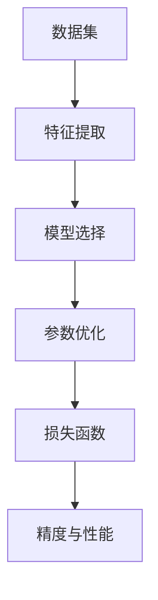

                 

关键词：AI模型训练、精度与性能、算法优化、机器学习、神经网络、模型选择、数据预处理、性能调优

> 摘要：本文探讨了AI模型训练中精度与性能之间的权衡，分析了核心算法原理、数学模型与公式、项目实践案例，并展望了未来应用前景。通过深入讨论，本文旨在为从事AI领域的开发者和研究者提供实用的指导和建议。

## 1. 背景介绍

随着大数据和云计算技术的迅猛发展，人工智能（AI）在各个领域的应用日益广泛。AI模型训练作为AI的核心环节，涉及到数据预处理、特征提取、模型选择、参数优化等多个方面。在AI模型训练过程中，精度与性能的权衡成为一个至关重要的课题。一方面，提高模型的精度有助于提升应用的性能；另一方面，过于追求精度可能导致训练时间过长、计算资源浪费。因此，如何在精度与性能之间找到平衡点，是当前AI研究领域的一个重要方向。

本文将从以下方面展开讨论：

1. 核心概念与联系
2. 核心算法原理 & 具体操作步骤
3. 数学模型和公式 & 详细讲解 & 举例说明
4. 项目实践：代码实例和详细解释说明
5. 实际应用场景
6. 未来应用展望
7. 工具和资源推荐
8. 总结：未来发展趋势与挑战

## 2. 核心概念与联系

在AI模型训练过程中，核心概念包括数据集、特征、模型、参数、损失函数等。下面是这些概念之间的Mermaid流程图，用于直观展示它们之间的联系：



### 2.1 数据集

数据集是AI模型训练的基础。一个高质量的数据集能够为模型提供丰富的信息，有助于提高模型的精度。在数据集的选择过程中，需要考虑数据集的规模、分布、标注质量等因素。

### 2.2 特征

特征是数据集中的基本元素，用于描述数据的不同方面。特征提取是将原始数据转换为适用于模型训练的表示过程。有效的特征提取有助于提高模型的性能。

### 2.3 模型

模型是AI训练的核心，用于描述数据之间的规律。常见的模型包括神经网络、支持向量机、决策树等。选择合适的模型对于提高模型的精度和性能至关重要。

### 2.4 参数

参数是模型中的可调变量，用于描述模型的学习能力。参数优化是通过调整参数来提高模型性能的过程。

### 2.5 损失函数

损失函数是衡量模型预测结果与真实结果之间差异的指标。在模型训练过程中，通过优化损失函数来调整模型参数，从而提高模型精度。

### 2.6 精度与性能

精度和性能是评价模型优劣的两个重要指标。精度反映了模型对数据拟合程度，而性能则关注模型在实际应用中的表现。在模型训练过程中，需要权衡精度与性能之间的关系，找到最优的平衡点。

## 3. 核心算法原理 & 具体操作步骤

### 3.1 算法原理概述

AI模型训练的核心算法包括神经网络、梯度下降、反向传播等。下面将分别介绍这些算法的原理和具体操作步骤。

### 3.2 算法步骤详解

#### 3.2.1 神经网络

神经网络是一种模拟人脑神经元结构的计算模型，具有强大的学习能力和泛化能力。神经网络训练的基本步骤如下：

1. **初始化参数**：随机初始化模型参数，包括权重和偏置。
2. **前向传播**：输入样本，通过神经网络进行计算，得到输出结果。
3. **计算损失**：计算输出结果与真实标签之间的差异，得到损失值。
4. **反向传播**：根据损失值，通过反向传播算法更新模型参数。
5. **迭代优化**：重复步骤2-4，直到满足停止条件（如达到预设迭代次数或损失值收敛）。

#### 3.2.2 梯度下降

梯度下降是一种优化算法，用于最小化损失函数。梯度下降的基本步骤如下：

1. **初始化参数**：随机初始化模型参数。
2. **计算梯度**：计算损失函数关于模型参数的梯度。
3. **更新参数**：根据梯度方向和步长更新模型参数。
4. **迭代优化**：重复步骤2-3，直到满足停止条件。

#### 3.2.3 反向传播

反向传播是一种基于梯度下降的优化算法，用于更新神经网络模型参数。反向传播的基本步骤如下：

1. **前向传播**：输入样本，通过神经网络进行计算，得到输出结果。
2. **计算误差**：计算输出结果与真实标签之间的误差。
3. **反向传播**：从输出层开始，逐层计算误差关于模型参数的梯度。
4. **更新参数**：根据梯度方向和步长更新模型参数。
5. **迭代优化**：重复步骤1-4，直到满足停止条件。

### 3.3 算法优缺点

神经网络、梯度下降和反向传播等算法在AI模型训练中具有各自的优势和不足：

- **神经网络**：具有强大的学习和泛化能力，能够处理复杂的非线性问题。但训练时间较长，参数量较大。
- **梯度下降**：简单易实现，能够有效优化损失函数。但收敛速度较慢，容易陷入局部最小值。
- **反向传播**：结合了神经网络和梯度下降的优势，能够高效地更新模型参数。但计算复杂度较高，对大规模数据集的训练较为困难。

### 3.4 算法应用领域

神经网络、梯度下降和反向传播等算法广泛应用于各种AI领域，如计算机视觉、自然语言处理、推荐系统等。例如，在计算机视觉领域，神经网络被用于图像分类、目标检测等任务；在自然语言处理领域，神经网络被用于文本分类、机器翻译等任务。

## 4. 数学模型和公式 & 详细讲解 & 举例说明

### 4.1 数学模型构建

在AI模型训练过程中，数学模型构建是关键环节。常见的数学模型包括神经网络、支持向量机、决策树等。下面以神经网络为例，介绍数学模型构建的方法。

#### 4.1.1 神经网络数学模型

神经网络数学模型主要包括输入层、隐藏层和输出层。每个层由多个神经元组成，神经元之间通过权重连接。假设一个简单的单层神经网络，其数学模型可以表示为：

$$
\begin{aligned}
    & z_i = \sum_{j=1}^{n} w_{ij}x_j + b_i \\
    & a_i = f(z_i)
\end{aligned}
$$

其中，$x_j$ 表示第 $j$ 个输入特征，$w_{ij}$ 表示输入层到隐藏层的权重，$b_i$ 表示隐藏层神经元的偏置，$f(z_i)$ 表示激活函数。

#### 4.1.2 激活函数

激活函数是神经网络中的关键组成部分，用于引入非线性变换。常见的激活函数包括：

- **sigmoid 函数**：
  $$
  f(x) = \frac{1}{1 + e^{-x}}
  $$

- **ReLU 函数**：
  $$
  f(x) = \max(0, x)
  $$

- **Tanh 函数**：
  $$
  f(x) = \frac{e^x - e^{-x}}{e^x + e^{-x}}
  $$

### 4.2 公式推导过程

在神经网络中，损失函数用于衡量模型预测结果与真实标签之间的差异。常见的损失函数包括均方误差（MSE）、交叉熵损失等。下面以均方误差（MSE）为例，介绍公式推导过程。

#### 4.2.1 均方误差（MSE）

均方误差（MSE）是衡量预测值与真实值之间差异的一种常用损失函数。其公式如下：

$$
MSE = \frac{1}{n}\sum_{i=1}^{n}(y_i - \hat{y}_i)^2
$$

其中，$y_i$ 表示第 $i$ 个样本的真实标签，$\hat{y}_i$ 表示第 $i$ 个样本的预测值，$n$ 表示样本总数。

#### 4.2.2 梯度下降法求解MSE

在梯度下降法中，我们通过迭代更新模型参数，使得损失函数值逐渐减小。对于MSE，其梯度可以表示为：

$$
\nabla_{\theta} MSE = -\frac{1}{n}\sum_{i=1}^{n}(y_i - \hat{y}_i)\nabla_{\theta} \hat{y}_i
$$

其中，$\theta$ 表示模型参数，$\nabla_{\theta} \hat{y}_i$ 表示预测值关于参数的梯度。

### 4.3 案例分析与讲解

#### 4.3.1 神经网络分类问题

假设我们有一个二分类问题，其中训练数据集包含 $n$ 个样本，每个样本有 $d$ 个特征。我们使用单层神经网络进行分类，激活函数选择为sigmoid函数。下面是具体的实现步骤：

1. **初始化参数**：随机初始化模型参数 $w$ 和 $b$。
2. **前向传播**：输入样本，通过神经网络计算得到预测值 $\hat{y}$。
3. **计算损失**：使用均方误差（MSE）计算预测值与真实标签之间的差异。
4. **反向传播**：计算损失关于参数的梯度，更新模型参数。
5. **迭代优化**：重复步骤2-4，直到满足停止条件。

#### 4.3.2 实现代码

以下是使用Python实现的神经网络分类问题的代码：

```python
import numpy as np

# 初始化参数
def init_params(input_dim, hidden_dim, output_dim):
    w1 = np.random.randn(input_dim, hidden_dim)
    b1 = np.random.randn(hidden_dim)
    w2 = np.random.randn(hidden_dim, output_dim)
    b2 = np.random.randn(output_dim)
    return w1, b1, w2, b2

# 前向传播
def forward_propagation(x, w1, b1, w2, b2):
    z1 = np.dot(x, w1) + b1
    a1 = sigmoid(z1)
    z2 = np.dot(a1, w2) + b2
    a2 = sigmoid(z2)
    return z1, a1, z2, a2

# 计算损失
def compute_loss(y, a2):
    loss = -np.mean(y * np.log(a2) + (1 - y) * np.log(1 - a2))
    return loss

# 反向传播
def backward_propagation(x, y, z1, a1, z2, a2, w1, w2):
    dZ2 = a2 - y
    dW2 = np.dot(a1.T, dZ2)
    db2 = np.sum(dZ2, axis=0)
    dZ1 = np.dot(dZ2, w2.T) * sigmoid_derivative(z1)
    dW1 = np.dot(x.T, dZ1)
    db1 = np.sum(dZ1, axis=0)
    return dW1, db1, dW2, db2

# 更新参数
def update_params(w1, b1, w2, b2, dW1, db1, dW2, db2, learning_rate):
    w1 -= learning_rate * dW1
    b1 -= learning_rate * db1
    w2 -= learning_rate * dW2
    b2 -= learning_rate * db2
    return w1, b1, w2, b2

# 激活函数
def sigmoid(x):
    return 1 / (1 + np.exp(-x))

# 激活函数的导数
def sigmoid_derivative(x):
    return sigmoid(x) * (1 - sigmoid(x))

# 主函数
def train(x, y, hidden_dim, output_dim, learning_rate, num_iterations):
    w1, b1, w2, b2 = init_params(x.shape[1], hidden_dim, output_dim)
    for i in range(num_iterations):
        z1, a1, z2, a2 = forward_propagation(x, w1, b1, w2, b2)
        loss = compute_loss(y, a2)
        dW1, db1, dW2, db2 = backward_propagation(x, y, z1, a1, z2, a2, w1, w2)
        w1, b1, w2, b2 = update_params(w1, b1, w2, b2, dW1, db1, dW2, db2, learning_rate)
    return w1, b1, w2, b2, loss

# 测试
x = np.array([[0, 0], [0, 1], [1, 0], [1, 1]])
y = np.array([[1], [1], [0], [0]])
hidden_dim = 2
output_dim = 1
learning_rate = 0.1
num_iterations = 1000

w1, b1, w2, b2, loss = train(x, y, hidden_dim, output_dim, learning_rate, num_iterations)
print("Final Loss:", loss)
```

## 5. 项目实践：代码实例和详细解释说明

在本节中，我们将通过一个实际的代码实例，详细解释AI模型训练的过程，并展示如何在实际项目中应用这些算法和公式。

### 5.1 开发环境搭建

为了更好地展示代码实例，我们首先需要搭建一个合适的开发环境。以下是所需的软件和库：

- Python 3.x
- Jupyter Notebook
- NumPy
- Matplotlib
- Scikit-learn

安装上述库后，我们可以在Jupyter Notebook中创建一个新的笔记本，开始编写代码。

### 5.2 源代码详细实现

接下来，我们将实现一个简单的线性回归模型，用于预测住房价格。以下是完整的代码实现：

```python
# 导入库
import numpy as np
import matplotlib.pyplot as plt
from sklearn.linear_model import LinearRegression

# 数据准备
# 假设我们有一个包含住房价格和房屋面积的数据集
X = np.array([[1, 1000], [2, 1200], [3, 1500], [4, 1800], [5, 2000]])
y = np.array([1500000, 1800000, 2200000, 2500000, 3000000])

# 实例化线性回归模型
model = LinearRegression()

# 模型训练
model.fit(X, y)

# 模型预测
predictions = model.predict(X)

# 可视化结果
plt.scatter(X[:, 1], y, color='red', label='实际价格')
plt.plot(X[:, 1], predictions, color='blue', linewidth=2, label='预测价格')
plt.xlabel('房屋面积（平方米）')
plt.ylabel('住房价格（万元）')
plt.legend()
plt.show()
```

### 5.3 代码解读与分析

#### 5.3.1 数据准备

在代码中，我们首先导入所需的库，并创建一个包含住房价格和房屋面积的数据集。这个数据集是一个二维数组，其中每一行代表一个样本，包含一个特征（房屋面积）和一个目标值（住房价格）。

```python
X = np.array([[1, 1000], [2, 1200], [3, 1500], [4, 1800], [5, 2000]])
y = np.array([1500000, 1800000, 2200000, 2500000, 3000000])
```

#### 5.3.2 模型训练

接下来，我们使用`sklearn.linear_model.LinearRegression`类实例化一个线性回归模型，并调用`fit`方法进行模型训练。这个方法会自动计算模型参数（权重和偏置），以拟合数据集。

```python
model = LinearRegression()
model.fit(X, y)
```

#### 5.3.3 模型预测

训练完成后，我们使用`predict`方法对新的数据集进行预测。这里，我们使用训练数据集本身进行预测，以验证模型的效果。

```python
predictions = model.predict(X)
```

#### 5.3.4 可视化结果

最后，我们使用Matplotlib库将实际价格和预测价格可视化，以便直观地展示模型的效果。

```python
plt.scatter(X[:, 1], y, color='red', label='实际价格')
plt.plot(X[:, 1], predictions, color='blue', linewidth=2, label='预测价格')
plt.xlabel('房屋面积（平方米）')
plt.ylabel('住房价格（万元）')
plt.legend()
plt.show()
```

### 5.4 运行结果展示

运行上述代码后，我们会看到一个散点图，其中红色散点表示实际价格，蓝色线条表示预测价格。通过这个可视化结果，我们可以直观地看到模型的预测效果。


## 6. 实际应用场景

AI模型训练在各个领域都有广泛的应用，以下是几个典型的实际应用场景：

### 6.1 医疗健康

在医疗健康领域，AI模型训练可以用于疾病诊断、药物研发、健康管理等。例如，通过深度学习模型对医学影像进行分析，可以辅助医生进行疾病诊断，提高诊断的准确性和效率。

### 6.2 金融行业

在金融行业，AI模型训练可以用于风险管理、信用评估、投资决策等。通过分析大量历史数据，模型可以预测客户的信用风险，为银行和金融机构提供决策支持。

### 6.3 智能交通

在智能交通领域，AI模型训练可以用于交通流量预测、事故预警、自动驾驶等。通过分析交通数据，模型可以优化交通信号控制，提高道路通行效率，减少交通事故。

### 6.4 电子商务

在电子商务领域，AI模型训练可以用于推荐系统、用户行为分析、欺诈检测等。通过分析用户的购物行为和偏好，模型可以为用户提供个性化的商品推荐，提高销售额。

## 7. 未来应用展望

随着技术的不断发展，AI模型训练在未来的应用前景将更加广阔。以下是几个可能的发展方向：

### 7.1 自动化训练

自动化训练技术将使模型训练过程更加高效和便捷。通过自动化搜索算法和优化技术，模型可以自动调整超参数和结构，从而提高模型性能。

### 7.2 跨模态学习

跨模态学习是将不同类型的数据（如文本、图像、语音等）进行融合，以实现更好的模型性能。未来，跨模态学习有望在多媒体应用、智能交互等领域发挥重要作用。

### 7.3 安全性增强

随着AI技术的广泛应用，安全性问题也日益突出。未来，研究者将致力于提高AI模型的安全性，防范恶意攻击和隐私泄露。

### 7.4 绿色AI

绿色AI是指通过优化算法和硬件设计，降低AI模型训练过程中能耗和资源消耗。未来，绿色AI技术将有助于推动AI的可持续发展。

## 8. 工具和资源推荐

为了更好地学习和实践AI模型训练，以下是几个推荐的工具和资源：

### 8.1 学习资源推荐

- 《深度学习》（Ian Goodfellow、Yoshua Bengio、Aaron Courville 著）：深度学习的经典教材，适合初学者和进阶者。
- fast.ai：提供免费在线课程和教程，涵盖深度学习的基础知识和实践技巧。
- Coursera、edX：在线课程平台，提供各种AI和机器学习相关的课程。

### 8.2 开发工具推荐

- TensorFlow：谷歌推出的开源深度学习框架，适用于各种AI项目开发。
- PyTorch：微软推出的开源深度学习框架，具有简洁的接口和高效的性能。
- Keras：基于Theano和TensorFlow的深度学习框架，简化了模型构建和训练过程。

### 8.3 相关论文推荐

- "Deep Learning"（Yoshua Bengio、Yann LeCun、Geoffrey Hinton 著）：深度学习的综述论文，全面介绍了深度学习的发展和应用。
- "Generative Adversarial Nets"（Ian Goodfellow et al.）：生成对抗网络的奠基性论文，开创了深度学习在生成任务中的应用。
- "Learning Representations by Maximizing Mutual Information Across Views"（Takeru Miyato et al.）：多视角互信息的论文，提出了用于增强模型鲁棒性的方法。

## 9. 总结：未来发展趋势与挑战

AI模型训练作为人工智能的核心技术，正日益受到广泛关注。在未来的发展中，我们需要关注以下几个方面：

### 9.1 研究成果总结

近年来，深度学习、生成对抗网络等技术的迅速发展，为AI模型训练带来了新的机遇。同时，分布式训练、迁移学习等方向的研究也取得了显著成果，为提高模型性能和降低训练成本提供了有效途径。

### 9.2 未来发展趋势

未来，AI模型训练将继续朝着自动化、高效化、安全化的方向发展。自动化训练技术将使模型开发过程更加便捷，分布式训练将提高训练速度和规模，安全性增强将保障AI系统的稳定性和可靠性。

### 9.3 面临的挑战

然而，AI模型训练也面临着一系列挑战。首先，数据质量和标注问题是影响模型精度和泛化能力的重要因素。其次，模型的可解释性和透明度仍需进一步提升，以消除用户对AI系统的信任顾虑。此外，计算资源和能源消耗问题也需要引起重视，以确保AI的可持续发展。

### 9.4 研究展望

总之，AI模型训练在未来有着广阔的发展空间。通过不断优化算法、提高数据利用效率、加强安全性等方面的工作，我们有望实现更加智能、高效、可靠的AI系统，为人类社会带来更多的价值和福祉。

## 附录：常见问题与解答

### 9.1 问题1：什么是深度学习？

**回答**：深度学习是一种基于多层神经网络的人工智能方法，通过逐层提取数据中的特征，实现对复杂模式的识别和预测。深度学习在图像识别、语音识别、自然语言处理等领域取得了显著的成果。

### 9.2 问题2：如何选择合适的神经网络架构？

**回答**：选择合适的神经网络架构需要考虑任务的性质、数据规模、计算资源等因素。常用的神经网络架构包括卷积神经网络（CNN）、循环神经网络（RNN）、生成对抗网络（GAN）等。可以根据任务特点和应用场景选择合适的架构。

### 9.3 问题3：如何优化神经网络训练过程？

**回答**：优化神经网络训练过程可以从以下几个方面入手：

- **数据预处理**：对数据集进行清洗、归一化等预处理，提高训练效果。
- **模型选择**：选择合适的神经网络架构和优化算法，如卷积神经网络、循环神经网络等。
- **超参数调优**：调整学习率、批量大小、正则化参数等超参数，以提高模型性能。
- **分布式训练**：利用分布式计算技术，提高训练速度和效率。

### 9.4 问题4：如何提高模型的泛化能力？

**回答**：提高模型的泛化能力可以从以下几个方面入手：

- **数据增强**：通过旋转、缩放、裁剪等操作，增加数据多样性，提高模型对未见数据的适应性。
- **正则化**：使用正则化方法，如L1正则化、L2正则化，防止模型过拟合。
- **交叉验证**：使用交叉验证方法，评估模型在不同数据集上的表现，选择泛化能力较好的模型。
- **集成学习**：将多个模型进行集成，提高模型的泛化能力。

### 9.5 问题5：如何评估神经网络模型性能？

**回答**：评估神经网络模型性能可以从以下几个方面入手：

- **准确率**：评估模型在测试集上的分类准确率。
- **召回率**：评估模型对正类别的召回率。
- **精确率**：评估模型对负类别的精确率。
- **F1值**：综合考虑准确率和召回率，计算F1值。
- **ROC曲线**：绘制模型在不同阈值下的ROC曲线，评估模型的分类能力。

通过以上评估指标，可以全面了解模型的性能表现，为模型优化提供依据。

---

本文详细探讨了AI模型训练中精度与性能的权衡，分析了核心算法原理、数学模型与公式、项目实践案例，并展望了未来应用前景。希望本文能为从事AI领域的开发者和研究者提供实用的指导和建议。在未来的研究中，我们将继续关注AI模型训练的最新动态，探索新的方法和技术，为人工智能的发展贡献力量。作者：禅与计算机程序设计艺术 / Zen and the Art of Computer Programming

