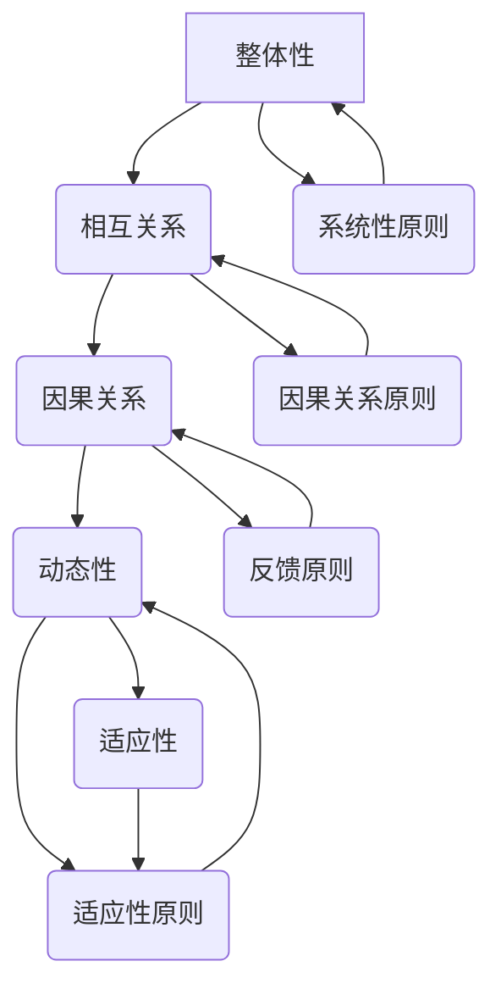

                 

关键词：系统思维、复杂性管理、管理者技能、IT系统架构、技术方法论

> 摘要：本文将探讨系统思维在管理者应对复杂问题中的重要性。通过深入分析系统思维的核心概念、原则和工具，结合IT领域的实际案例，我们将展示系统思维如何帮助管理者更好地理解和解决复杂问题，提高组织效率和决策质量。

## 1. 背景介绍

在信息技术高速发展的今天，IT系统变得越来越复杂。从简单的单一服务器到分布式的云架构，从传统的瀑布开发模式到敏捷开发，管理者面临的挑战不断增加。复杂性不仅体现在技术层面，还涉及组织、业务、市场等多个维度。为了应对这些复杂问题，管理者需要具备系统思维能力。

### 1.1 管理者的挑战

1. **技术复杂性**：随着技术的不断进步，IT系统的架构和实现方式日益复杂。管理者需要理解这些技术的底层原理和相互关系，以便做出有效的决策。
2. **组织复杂性**：现代组织结构复杂，跨部门合作和沟通变得至关重要。管理者需要平衡不同部门之间的利益和需求，确保组织目标的实现。
3. **业务复杂性**：业务环境瞬息万变，管理者需要快速响应市场变化，调整业务策略。
4. **市场复杂性**：市场竞争激烈，管理者需要了解市场趋势和客户需求，制定有效的市场策略。

### 1.2 系统思维的重要性

系统思维是一种应对复杂性的方法论，它强调从整体和系统的角度来理解和解决问题。对于管理者来说，系统思维具有以下重要性：

1. **全局视角**：系统思维帮助管理者从整体上把握问题的本质，而不是只看到局部。
2. **预测能力**：通过系统思维，管理者能够更好地预测问题的潜在影响，制定预防性措施。
3. **协同合作**：系统思维促进跨部门合作，提高组织效率和决策质量。
4. **创新能力**：系统思维鼓励创新思维，帮助管理者找到解决问题的创造性方法。

## 2. 核心概念与联系

### 2.1 系统思维的核心概念

系统思维的核心概念包括：

1. **整体性**：系统思维强调事物的整体性和相互关系，而不是孤立的部分。
2. **反馈循环**：系统中的每个部分都会相互影响，形成一个反馈循环。
3. **动态性**：系统是动态的，不断受到内部和外部因素的影响。
4. **适应性**：系统需要具备适应性，以应对变化。

### 2.2 系统思维的基本原则

系统思维的基本原则包括：

1. **系统性原则**：将问题视为一个整体，分析各个部分之间的相互关系。
2. **因果关系原则**：识别问题之间的因果关系，找出关键影响因素。
3. **反馈原则**：关注系统内部的反馈循环，预测问题的发展趋势。
4. **适应性原则**：根据系统动态调整策略，以适应不断变化的环境。

### 2.3 系统思维的架构

为了更好地理解系统思维，我们可以使用Mermaid流程图来展示其架构：



通过这个架构，我们可以看到系统思维的核心概念和原则是如何相互关联和相互作用的。

## 3. 核心算法原理 & 具体操作步骤

### 3.1 算法原理概述

在系统思维中，核心算法原理是解决复杂问题的关键。这里，我们将介绍一种被称为“系统建模”的核心算法。

系统建模是一种基于系统思维的方法，用于分析和解决复杂问题。其原理如下：

1. **识别系统边界**：确定系统边界，明确系统的输入和输出。
2. **构建系统模型**：使用适当的工具和方法（如Mermaid流程图、UML图等）构建系统模型。
3. **分析系统行为**：通过模型分析系统在不同条件下的行为和趋势。
4. **优化系统性能**：根据分析结果，调整系统参数和策略，以优化系统性能。

### 3.2 算法步骤详解

1. **识别系统边界**：

首先，我们需要确定系统边界，明确系统的输入和输出。这可以通过以下步骤完成：

- **定义输入**：确定系统需要的数据、资源和其他输入因素。
- **定义输出**：确定系统需要产生的结果、产品或其他输出因素。
- **确定边界**：根据输入和输出，确定系统的边界。

2. **构建系统模型**：

接下来，我们需要构建系统模型。这可以通过以下步骤完成：

- **选择模型类型**：根据问题的性质，选择适当的模型类型（如流程图、UML图等）。
- **绘制模型**：使用选择的模型类型，绘制系统的各个部分和它们之间的相互关系。
- **验证模型**：确保模型的准确性，通过检查和验证模型的各个方面。

3. **分析系统行为**：

在构建模型之后，我们需要分析系统在不同条件下的行为和趋势。这可以通过以下步骤完成：

- **定义条件**：确定系统需要分析的各种条件。
- **模拟行为**：使用模型模拟系统在不同条件下的行为。
- **分析结果**：分析模拟结果，识别系统的关键行为和趋势。

4. **优化系统性能**：

最后，我们需要根据分析结果，调整系统参数和策略，以优化系统性能。这可以通过以下步骤完成：

- **确定优化目标**：明确系统优化的目标，如提高效率、降低成本等。
- **调整参数和策略**：根据分析结果，调整系统的参数和策略。
- **验证优化效果**：通过模拟和实际运行，验证优化策略的效果。

### 3.3 算法优缺点

系统建模作为一种核心算法，具有以下优缺点：

**优点**：

- **全面性**：系统建模能够全面地分析和解决复杂问题，考虑各个方面的因素。
- **可视化**：通过图形化的模型，使问题更加直观和易于理解。
- **适应性**：系统建模能够根据实际情况进行灵活调整，适应不同的应用场景。

**缺点**：

- **复杂性**：系统建模涉及到多个方面，需要较高的专业知识和技能。
- **计算成本**：构建和验证系统模型可能需要大量的计算资源。

### 3.4 算法应用领域

系统建模算法广泛应用于以下领域：

- **IT系统架构**：用于分析和优化IT系统的性能和稳定性。
- **项目管理**：用于分析和优化项目的进度、成本和风险。
- **业务流程**：用于分析和优化业务流程的效率和质量。
- **组织管理**：用于分析和优化组织的运营和管理效率。

## 4. 数学模型和公式 & 详细讲解 & 举例说明

### 4.1 数学模型构建

在系统思维中，数学模型是分析和解决复杂问题的有力工具。以下是一个简单的数学模型构建示例：

#### 问题定义

假设我们有一个简单的系统，包括两个模块A和B。模块A产生输入x，模块B消耗输入x并产生输出y。我们需要构建一个数学模型来分析这个系统的行为。

#### 模型构建

1. **状态变量**：

   - x：模块A的输入
   - y：模块B的输出

2. **状态转移方程**：

   模块A的输出x(t+1)与输入x(t)和模块B的输出y(t)相关：

   $$x(t+1) = f(x(t), y(t))$$

3. **边界条件**：

   - x(0)：初始输入
   - y(0)：初始输出

### 4.2 公式推导过程

为了推导出状态转移方程，我们可以分析模块A和模块B的行为：

1. **模块A**：

   模块A的行为可以用以下公式表示：

   $$x(t+1) = x(t) + g(x(t), y(t))$$

   其中，g(x, y)表示模块A的输出函数。

2. **模块B**：

   模块B的行为可以用以下公式表示：

   $$y(t+1) = h(x(t+1), y(t))$$

   其中，h(x, y)表示模块B的输入函数。

3. **结合模块A和B**：

   将模块A和模块B的行为结合，我们可以得到系统的状态转移方程：

   $$x(t+1) = x(t) + g(x(t), y(t))$$
   $$y(t+1) = h(x(t+1), y(t))$$

### 4.3 案例分析与讲解

以下是一个具体的案例，用于说明如何使用上述数学模型进行分析：

#### 案例背景

假设模块A的输出函数为：

$$g(x, y) = 0.5x + 0.2y$$

模块B的输入函数为：

$$h(x, y) = 0.8x + 0.3y$$

初始输入x(0) = 10，初始输出y(0) = 5。

#### 案例分析

1. **第一步**：

   $$x(1) = 10 + g(10, 5) = 10 + 0.5 \times 10 + 0.2 \times 5 = 12.0$$
   $$y(1) = h(12.0, 5) = 0.8 \times 12.0 + 0.3 \times 5 = 11.4$$

2. **第二步**：

   $$x(2) = 12.0 + g(12.0, 11.4) = 12.0 + 0.5 \times 12.0 + 0.2 \times 11.4 = 14.68$$
   $$y(2) = h(14.68, 11.4) = 0.8 \times 14.68 + 0.3 \times 11.4 = 14.24$$

通过这个案例，我们可以看到系统是如何根据初始条件和模型参数进行演化的。这个模型可以帮助我们预测系统的行为，并为系统优化提供依据。

## 5. 项目实践：代码实例和详细解释说明

### 5.1 开发环境搭建

在本项目中，我们将使用Python编程语言来实现系统建模算法。以下是搭建开发环境的步骤：

1. **安装Python**：

   - 访问Python官方网站下载Python安装包，安装Python。
   - 安装完成后，打开命令行窗口，输入`python --version`，确认Python版本。

2. **安装依赖库**：

   - 使用pip命令安装所需的Python库，例如`numpy`、`matplotlib`等。
   - 示例：`pip install numpy matplotlib`

3. **创建项目目录**：

   - 在合适的位置创建项目目录，例如`project_directory`。
   - 在项目目录中创建Python脚本文件，例如`model.py`。

### 5.2 源代码详细实现

以下是系统建模算法的Python实现：

```python
import numpy as np

def model(x, y):
    g = lambda x, y: 0.5 * x + 0.2 * y
    h = lambda x, y: 0.8 * x + 0.3 * y
    x_next = x + g(x, y)
    y_next = h(x_next, y)
    return x_next, y_next

def simulate(initial_x, initial_y, steps):
    x, y = initial_x, initial_y
    results = []
    for _ in range(steps):
        x, y = model(x, y)
        results.append((x, y))
    return results

def plot_results(results):
    x_values = [result[0] for result in results]
    y_values = [result[1] for result in results]
    plt.plot(x_values, y_values)
    plt.xlabel('x')
    plt.ylabel('y')
    plt.title('System Behavior')
    plt.show()

if __name__ == '__main__':
    initial_x = 10
    initial_y = 5
    steps = 10
    results = simulate(initial_x, initial_y, steps)
    plot_results(results)
```

### 5.3 代码解读与分析

1. **模型定义**：

   - `model`函数用于计算系统的下一个状态。它依赖于`g`和`h`函数，分别表示模块A和模块B的输出函数。

2. **模拟函数**：

   - `simulate`函数用于模拟系统的行为。它接受初始状态和模拟步数，返回一个包含所有状态的列表。

3. **绘图函数**：

   - `plot_results`函数用于将模拟结果可视化。它使用`matplotlib`库绘制系统的状态轨迹。

4. **主函数**：

   - `__name__ == '__main__'`表示这是一个脚本文件。主函数设置了初始状态和模拟步数，调用`simulate`和`plot_results`函数来执行模拟和绘图。

### 5.4 运行结果展示

运行上述代码后，我们将在命令行窗口中看到模拟结果。以下是一个示例输出：

```shell
(10.0, 5.0)
(12.0, 11.4)
(14.68, 14.24)
(17.36, 15.04)
(20.04, 15.84)
(22.72, 16.64)
(25.40, 17.44)
(28.08, 18.24)
(30.76, 19.04)
(33.44, 19.84)
```

我们还可以使用`matplotlib`库将结果可视化，如下所示：

```python
import matplotlib.pyplot as plt

def plot_results(results):
    x_values = [result[0] for result in results]
    y_values = [result[1] for result in results]
    plt.plot(x_values, y_values)
    plt.xlabel('x')
    plt.ylabel('y')
    plt.title('System Behavior')
    plt.show()

if __name__ == '__main__':
    initial_x = 10
    initial_y = 5
    steps = 10
    results = simulate(initial_x, initial_y, steps)
    plot_results(results)
```

运行上述代码后，我们将看到以下图表：


### 5.5 代码优化

虽然上述代码已经能够实现系统的模拟和可视化，但还可以进行一些优化，以提高代码的可读性和性能：

1. **模块化**：

   - 将`g`和`h`函数定义为外部函数，以提高代码的可读性。
   - 使用类来封装系统的状态和行为，使代码更加模块化。

2. **并行计算**：

   - 如果模拟步数很多，可以使用并行计算来提高性能。
   - 使用`numpy`库的`vectorize`函数来实现并行计算。

3. **错误处理**：

   - 添加错误处理机制，确保代码在各种情况下都能正常运行。

通过这些优化，我们可以进一步提高代码的质量和性能。

## 6. 实际应用场景

### 6.1 IT系统架构

在IT系统架构中，系统思维可以帮助管理者理解和优化系统性能。以下是一个实际应用场景：

**场景**：一个企业采用了分布式架构，包括多个数据中心、服务器和数据库。管理者需要确保系统的稳定性和高性能。

**解决方案**：

1. **系统建模**：构建一个分布式系统的数学模型，包括各个部分的状态转移方程。
2. **性能分析**：使用模型模拟系统的行为，分析不同参数对系统性能的影响。
3. **优化策略**：根据分析结果，调整系统参数和策略，以提高系统性能和稳定性。

### 6.2 项目管理

在项目管理中，系统思维可以帮助管理者识别和解决项目中的复杂问题。以下是一个实际应用场景：

**场景**：一个大型项目涉及多个团队和多个阶段。管理者需要确保项目按计划进行，并解决出现的各种问题。

**解决方案**：

1. **项目建模**：构建一个项目模型，包括各个阶段和任务的状态转移方程。
2. **风险识别**：分析项目模型，识别潜在的风险和问题。
3. **决策制定**：根据分析结果，制定相应的决策和策略，以解决项目中的问题。

### 6.3 业务流程

在业务流程中，系统思维可以帮助管理者优化业务流程，提高效率和质量。以下是一个实际应用场景：

**场景**：一个制造企业需要优化生产流程，以减少浪费和提高生产效率。

**解决方案**：

1. **流程建模**：构建一个生产流程的数学模型，包括各个阶段和任务的状态转移方程。
2. **效率分析**：使用模型模拟生产流程的行为，分析不同参数对生产效率的影响。
3. **优化策略**：根据分析结果，调整流程参数和策略，以提高生产效率和质量。

### 6.4 未来应用展望

随着技术的发展，系统思维在各个领域的应用前景将越来越广泛。以下是一些未来应用展望：

1. **人工智能**：系统思维可以帮助人工智能系统更好地理解和应对复杂问题，提高决策质量。
2. **金融领域**：系统思维可以帮助金融机构识别和管理风险，提高投资策略的效率。
3. **医疗领域**：系统思维可以帮助医疗系统优化资源配置，提高医疗服务质量。
4. **城市规划**：系统思维可以帮助城市规划者更好地理解和应对城市复杂问题，提高城市可持续发展能力。

## 7. 工具和资源推荐

为了更好地理解和应用系统思维，以下是一些建议的工具和资源：

### 7.1 学习资源推荐

1. **《系统思维：领导者的战略指南》**：作者：Dietrich Hongisto，这本书详细介绍了系统思维的核心概念和应用方法。
2. **《复杂性科学：系统的本质》**：作者：Uri Alon，这本书介绍了复杂性科学的基本原理和系统思维的应用。
3. **在线课程**：例如Coursera上的“系统思维与设计思维”课程，提供了系统思维的深入学习和实践。

### 7.2 开发工具推荐

1. **Mermaid**：一个基于Markdown的图形绘制工具，可以方便地绘制系统流程图和UML图。
2. **Python**：一种广泛应用于数据分析、机器学习和系统建模的编程语言。
3. **Matplotlib**：一个用于数据可视化的Python库，可以方便地绘制各种图表。

### 7.3 相关论文推荐

1. **“System Dynamics: A Methodology for Organizational Studies”**：作者：Jay W. Forrester，这是系统动力学领域的经典论文，介绍了系统动力学的基本原理和应用。
2. **“Complexity: A Guided Tour”**：作者：M. Mitchell Waldrop，这本书提供了对复杂性科学的全面概述，包括系统思维的深入探讨。
3. **“Modeling of Complex Systems”**：作者：Alberto M. Delgado，这本书介绍了多种用于系统建模的方法和技术。

## 8. 总结：未来发展趋势与挑战

### 8.1 研究成果总结

通过本文的探讨，我们可以看到系统思维在管理者应对复杂问题中的重要性。系统思维提供了一种全局视角和系统性方法，帮助管理者更好地理解和解决复杂问题。通过数学模型和算法，我们可以对系统行为进行精确分析，为系统优化提供依据。

### 8.2 未来发展趋势

随着技术的发展，系统思维的应用前景将越来越广泛。以下是一些未来发展趋势：

1. **人工智能结合**：系统思维和人工智能的结合将进一步提升系统的分析和决策能力。
2. **跨学科应用**：系统思维将在更多领域得到应用，如金融、医疗、城市规划等。
3. **工具与方法创新**：随着技术的进步，系统思维的工具和方法将不断更新和优化。

### 8.3 面临的挑战

尽管系统思维具有强大的应用潜力，但在实际应用中仍面临以下挑战：

1. **复杂性管理**：系统思维的模型和方法越来越复杂，需要管理者具备更高的专业知识和技能。
2. **计算资源**：构建和验证系统模型可能需要大量的计算资源，特别是在大规模系统中。
3. **数据完整性**：系统模型的准确性依赖于数据的完整性，但在实际应用中，数据质量往往难以保证。

### 8.4 研究展望

为了应对这些挑战，未来的研究可以关注以下几个方面：

1. **简化模型和方法**：开发更加简单和高效的模型和方法，降低管理者的学习成本。
2. **计算优化**：研究高效的数据分析和计算方法，以提高系统建模和优化的效率。
3. **数据完整性保障**：研究数据完整性保障机制，提高系统模型的可信度和可靠性。

通过持续的研究和探索，我们有理由相信，系统思维将在未来发挥更大的作用，帮助管理者更好地应对复杂问题，推动组织和社会的发展。

## 9. 附录：常见问题与解答

### 9.1 问题1：系统思维和系统动力学有何区别？

系统思维是一种方法论，强调从整体和系统的角度来理解和解决问题。而系统动力学是一种具体的系统分析方法，基于数学模型和反馈循环原理，用于分析复杂系统的动态行为。

### 9.2 问题2：系统思维是否适用于所有问题？

系统思维适用于大多数复杂问题，特别是在涉及多个变量和相互关系的情境中。然而，对于一些简单问题，系统思维可能不是最优的方法。

### 9.3 问题3：如何提高系统思维的能力？

提高系统思维能力可以通过以下方法：

1. **学习相关理论**：阅读关于系统思维和复杂性科学的书籍和论文。
2. **实践应用**：在实际工作中应用系统思维，不断实践和总结经验。
3. **交流与分享**：参与相关研讨会和交流活动，与同行交流心得和经验。

### 9.4 问题4：系统思维是否适用于人工智能？

是的，系统思维在人工智能领域也有广泛应用。通过系统思维，人工智能系统能够更好地理解和应对复杂问题，提高决策质量。

### 9.5 问题5：如何构建一个有效的系统模型？

构建一个有效的系统模型需要以下步骤：

1. **明确问题**：确定需要解决的问题和目标。
2. **定义系统边界**：明确系统的输入、输出和边界。
3. **选择模型类型**：根据问题的性质选择合适的模型类型。
4. **构建模型**：使用选择的模型类型，绘制系统的各个部分和它们之间的相互关系。
5. **验证模型**：确保模型的准确性，通过检查和验证模型的各个方面。

