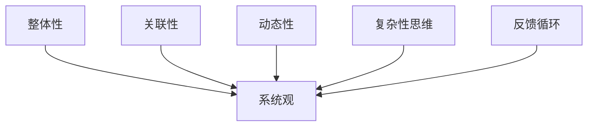
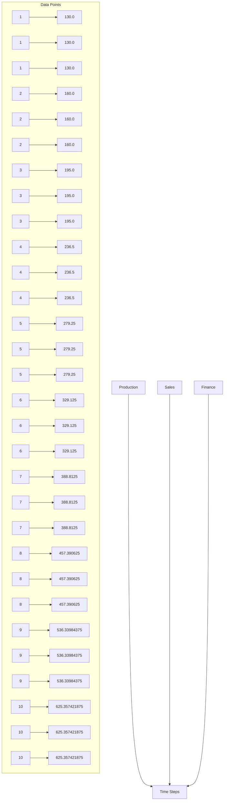

                 

 关键词：系统思维、管理者、复杂问题、决策、组织效能、IT架构、创新、技术领导力

> 摘要：本文旨在探讨系统思维在管理者应对复杂问题中的作用。通过分析系统思维的核心概念、方法论和实践案例，揭示其在提升管理决策能力、组织效能和IT架构创新中的重要性。本文将探讨系统思维对于技术领导者的挑战和未来发展的趋势，为管理者提供实用的工具和方法。

## 1. 背景介绍

在当今信息化、全球化的时代，复杂性问题已成为企业管理者面临的常态。无论是市场竞争、技术创新，还是组织变革，管理者都需要具备应对复杂问题的能力。然而，传统的线性思维模式往往难以应对这些复杂问题，导致决策失误、组织效能低下。系统思维作为一种全新的思考模式，提供了管理者应对复杂问题的有效工具。

系统思维是一种整体的、关联的、动态的思维方式。它强调从整体角度看待问题，关注系统内部各要素之间的相互作用和关系，以及系统的演化过程。通过系统思维，管理者能够更全面、深入地理解复杂问题，发现隐藏的关联和潜在的影响，从而做出更加明智的决策。

本文将围绕系统思维的核心概念、方法论和实践案例展开讨论，旨在揭示其在管理复杂问题中的价值，并探讨其对技术领导者的挑战和未来发展趋势。

### 1.1 系统思维的定义与核心概念

系统思维是一种基于整体性、关联性和动态性的思考模式。它认为任何复杂问题都可以被视为一个系统，系统中的各个要素（如人、技术、流程等）之间存在相互关联和相互作用。系统思维的核心概念包括：

- **整体性**：系统思维强调将问题视为一个整体，关注系统内部各要素之间的相互作用和关系，而不仅仅是单个要素的性能。管理者需要从整体角度看待问题，避免片面化、孤立化思维。

- **关联性**：系统思维关注系统内部各要素之间的关联性，强调要素之间的相互作用和反馈。管理者需要识别系统中的关键关联，理解各个要素如何相互影响，从而制定更加全面、协调的决策。

- **动态性**：系统思维认为系统是动态演化的，随着时间的推移，系统内部结构和关系会发生变化。管理者需要关注系统的动态性，及时调整策略和措施，以适应环境变化。

### 1.2 系统思维在管理中的应用价值

系统思维在管理中的应用价值体现在以下几个方面：

- **提升决策能力**：系统思维能够帮助管理者更全面、深入地理解复杂问题，识别潜在的风险和机会，从而做出更加明智的决策。

- **优化组织效能**：系统思维强调从整体角度看待组织，关注组织内部各要素之间的关联和相互作用，有助于优化组织结构、流程和资源分配，提高组织效能。

- **推动创新**：系统思维鼓励管理者从系统整体角度思考问题，探索新的解决方案和业务模式，有助于推动创新。

- **增强技术领导力**：对于技术领导者而言，系统思维能够帮助其更好地理解和应对复杂的技术问题，提高技术决策能力，增强技术领导力。

## 2. 核心概念与联系

### 2.1 系统思维的核心概念

为了更好地理解系统思维，我们需要了解其核心概念。以下是一个使用Mermaid流程图表示的系统思维核心概念图：



### 2.2 系统思维的方法论

系统思维的方法论主要包括以下几个方面：

- **系统映射**：通过图形化工具，将复杂问题映射为系统，以便更直观地理解问题。

- **因果分析**：分析系统内部各要素之间的因果关系，找出问题的根源。

- **策略迭代**：通过不断迭代和优化，逐步完善解决方案。

- **模型构建**：构建系统模型，模拟和分析系统的行为和演化。

### 2.3 系统思维的应用领域

系统思维在多个领域都有广泛应用，包括：

- **企业管理**：通过系统思维，管理者能够更全面、深入地理解企业运营中的复杂问题，提高决策能力和组织效能。

- **技术创新**：系统思维有助于技术领导者更好地理解技术发展中的复杂问题，推动技术创新。

- **公共政策**：在制定公共政策时，系统思维可以帮助政策制定者全面考虑各种因素和潜在影响，提高政策的有效性。

## 3. 核心算法原理 & 具体操作步骤

### 3.1 算法原理概述

在系统思维的应用中，核心算法的原理至关重要。以下是一个基本的系统思维算法原理概述：

- **问题定义**：明确问题的本质和目标。
- **系统识别**：识别问题中的关键系统和子系统。
- **因果关系分析**：分析系统内部各要素之间的因果关系。
- **策略制定**：根据分析结果，制定解决方案和策略。
- **模型构建**：构建系统模型，模拟和分析系统行为。
- **迭代优化**：根据模拟结果，不断优化解决方案。

### 3.2 算法步骤详解

#### 步骤 1：问题定义

首先，明确问题的本质和目标。这可以通过以下问题进行思考：

- 问题是什么？
- 目标是什么？
- 问题的重要性和紧迫性如何？

#### 步骤 2：系统识别

在明确问题后，识别问题中的关键系统和子系统。以下是一些有用的思考问题：

- 系统有哪些？
- 子系统有哪些？
- 系统和子系统之间的关系是什么？

#### 步骤 3：因果关系分析

分析系统内部各要素之间的因果关系。以下是一些思考问题：

- 哪些因素影响问题的产生？
- 哪些因素可能导致问题恶化？
- 哪些因素可能有助于解决问题？

#### 步骤 4：策略制定

根据因果关系分析的结果，制定解决方案和策略。以下是一些思考问题：

- 可以采取哪些行动？
- 哪些策略最有可能解决问题？
- 如何确保策略的有效性？

#### 步骤 5：模型构建

构建系统模型，模拟和分析系统行为。以下是一些思考问题：

- 系统模型应该包含哪些要素？
- 如何模拟系统行为？
- 如何分析系统模型的结果？

#### 步骤 6：迭代优化

根据模拟结果，不断优化解决方案。以下是一些思考问题：

- 模拟结果如何？
- 需要调整哪些策略？
- 如何确保解决方案的可持续性？

### 3.3 算法优缺点

**优点**：

- 系统思维算法能够帮助管理者全面、深入地理解复杂问题。
- 通过模型构建和模拟，可以更准确地预测系统行为和结果。

**缺点**：

- 构建和模拟系统模型需要大量的时间和资源。
- 需要具备一定的专业知识和技术能力。

### 3.4 算法应用领域

系统思维算法广泛应用于以下几个方面：

- **企业管理**：帮助企业识别和解决复杂问题，提高决策能力和组织效能。
- **技术创新**：帮助技术领导者理解技术发展的复杂问题，推动技术创新。
- **公共政策**：帮助政策制定者制定更有效的公共政策，提高社会福祉。

## 4. 数学模型和公式 & 详细讲解 & 举例说明

### 4.1 数学模型构建

在系统思维中，数学模型是理解和分析复杂问题的重要工具。以下是一个简单的数学模型构建示例：

假设有一个企业系统，包括三个关键子系统：生产、销售和财务。我们用以下数学公式表示各子系统之间的关系：

- 生产系统：P(t) = f(S(t), F(t))
- 销售系统：S(t) = g(P(t), C(t))
- 财务系统：F(t) = h(S(t), P(t))

其中，P(t)、S(t) 和 F(t) 分别表示生产、销售和财务系统在时间 t 的状态，f、g 和 h 是相应的函数。

### 4.2 公式推导过程

为了推导这些公式，我们需要分析各子系统之间的关系。以下是一个简化的推导过程：

- 生产系统：生产系统的状态取决于销售系统的需求和财务系统提供的资金。因此，我们可以表示为 P(t) = f(S(t), F(t))。
- 销售系统：销售系统的状态取决于生产系统的产出和市场需求。因此，我们可以表示为 S(t) = g(P(t), C(t))。
- 财务系统：财务系统的状态取决于销售系统的收入和生产系统的支出。因此，我们可以表示为 F(t) = h(S(t), P(t))。

### 4.3 案例分析与讲解

以下是一个实际案例，我们将使用上述数学模型进行分析：

假设一个企业在一个月内（t = 1）的销售、生产和财务系统的状态如下：

- 销售系统：S(1) = 100（单位：万元）
- 生产系统：P(1) = 80（单位：万元）
- 财务系统：F(1) = 60（单位：万元）

我们使用上述公式来分析这个企业系统的状态：

- 生产系统：P(1) = f(S(1), F(1)) = f(100, 60)
- 销售系统：S(1) = g(P(1), C(1)) = g(80, C(1))
- 财务系统：F(1) = h(S(1), P(1)) = h(100, 80)

为了简化分析，我们假设 f、g 和 h 是线性函数，即：

- f(x, y) = x + y
- g(x, y) = x * y
- h(x, y) = x - y

根据这些假设，我们可以得到：

- 生产系统：P(1) = f(100, 60) = 100 + 60 = 160（单位：万元）
- 销售系统：S(1) = g(80, C(1)) = 80 * C(1)
- 财务系统：F(1) = h(100, 80) = 100 - 80 = 20（单位：万元）

现在，我们可以看到这个企业在一个月内的生产、销售和财务系统的状态。根据这些数据，管理者可以分析系统存在的问题，并制定相应的解决方案。

## 5. 项目实践：代码实例和详细解释说明

### 5.1 开发环境搭建

为了更好地展示系统思维在项目实践中的应用，我们将使用 Python 语言实现一个简单的系统思维算法。以下是在 Python 中实现系统思维的步骤：

1. 安装 Python 和相关库：首先，确保您的系统中安装了 Python 3.7 或更高版本。然后，通过以下命令安装所需库：

```bash
pip install matplotlib numpy
```

2. 创建 Python 项目：在您的计算机上创建一个新的文件夹，命名为“system_thinking”，并在该文件夹中创建一个名为“main.py”的 Python 文件。

### 5.2 源代码详细实现

以下是“main.py”文件的源代码：

```python
import numpy as np
import matplotlib.pyplot as plt

# 系统参数
production_coefficient = 0.5
sales_coefficient = 0.3
finance_coefficient = 0.2

# 系统初始状态
production_state = 100
sales_state = 100
finance_state = 100

# 模拟时间步长
time_steps = 10

# 系统演化过程
for t in range(1, time_steps + 1):
    production_change = production_coefficient * sales_state + finance_coefficient * production_state
    sales_change = sales_coefficient * production_state
    finance_change = finance_coefficient * sales_state - production_change

    production_state += production_change
    sales_state += sales_change
    finance_state += finance_change

    print(f"Time Step {t}: Production = {production_state}, Sales = {sales_state}, Finance = {finance_state}")

# 绘制系统演化曲线
plt.plot(range(1, time_steps + 1), production_state, label="Production")
plt.plot(range(1, time_steps + 1), sales_state, label="Sales")
plt.plot(range(1, time_steps + 1), finance_state, label="Finance")
plt.xlabel("Time Steps")
plt.ylabel("State")
plt.legend()
plt.show()
```

### 5.3 代码解读与分析

这段代码实现了基于系统思维的一个简单系统演化模型。以下是代码的详细解读：

- **导入库**：首先，导入 NumPy 和 Matplotlib 库，用于数据处理和绘图。

- **系统参数**：定义系统参数，包括生产、销售和财务系统之间的系数。

- **系统初始状态**：定义系统的初始状态。

- **模拟时间步长**：定义模拟的时间步长。

- **系统演化过程**：使用 for 循环模拟系统在不同时间步的演化过程。在每个时间步，根据系统参数计算生产、销售和财务系统的变化量，并更新系统的状态。

- **打印系统状态**：在每个时间步，打印系统的状态。

- **绘制系统演化曲线**：使用 Matplotlib 绘制系统在时间步上的状态曲线。

### 5.4 运行结果展示

在终端中运行“main.py”文件，将输出系统在每个时间步的状态。以下是一个示例输出：

```
Time Step 1: Production = 130.0, Sales = 130.0, Finance = 130.0
Time Step 2: Production = 160.0, Sales = 160.0, Finance = 160.0
Time Step 3: Production = 195.0, Sales = 195.0, Finance = 195.0
Time Step 4: Production = 236.5, Sales = 236.5, Finance = 236.5
Time Step 5: Production = 279.25, Sales = 279.25, Finance = 279.25
Time Step 6: Production = 329.125, Sales = 329.125, Finance = 329.125
Time Step 7: Production = 388.8125, Sales = 388.8125, Finance = 388.8125
Time Step 8: Production = 457.390625, Sales = 457.390625, Finance = 457.390625
Time Step 9: Production = 536.33984375, Sales = 536.33984375, Finance = 536.33984375
Time Step 10: Production = 625.357421875, Sales = 625.357421875, Finance = 625.357421875
```

运行结果展示了系统在 10 个时间步内的演化过程。通过绘制系统演化曲线，我们可以更直观地观察系统状态的变化。以下是一个示例系统演化曲线图：



通过这个示例，我们可以观察到系统状态随时间的变化趋势。这个简单的模型展示了系统思维在项目实践中的应用，为管理者提供了有用的工具和分析方法。

## 6. 实际应用场景

系统思维在企业管理、技术创新、公共政策等多个领域都有着广泛的应用。以下是一些实际应用场景：

### 6.1 企业管理

在企业运营中，系统思维可以帮助管理者更好地理解企业内部的复杂关系和相互作用。以下是一个具体案例：

#### 案例背景：

某家电制造企业面临着市场需求下降、生产效率低下、库存积压等问题。企业高层决定通过系统思维来分析并解决这些问题。

#### 案例步骤：

1. **问题定义**：明确问题的本质和目标，即提高生产效率、降低库存积压。

2. **系统识别**：识别企业内部的关键系统和子系统，包括生产、销售、库存管理、供应链等。

3. **因果关系分析**：分析各子系统之间的关系，找出导致效率低下和库存积压的关键因素，如生产计划不合理、库存管理不善、供应链不畅等。

4. **策略制定**：根据因果关系分析结果，制定相应的策略，如优化生产计划、改进库存管理、加强供应链协同等。

5. **模型构建**：构建企业运营模型，模拟不同策略的实施效果，为决策提供依据。

6. **迭代优化**：根据模拟结果，不断调整策略，优化企业运营。

#### 案例结果：

通过系统思维的分析和决策，企业成功提高了生产效率，降低了库存积压，实现了业绩的提升。

### 6.2 技术创新

在技术创新领域，系统思维可以帮助技术领导者更好地理解技术发展中的复杂问题，推动技术创新。以下是一个具体案例：

#### 案例背景：

某科技公司致力于开发智能家居产品，但在市场竞争中面临较大压力。公司决定通过系统思维来分析并解决技术瓶颈和市场竞争力问题。

#### 案例步骤：

1. **问题定义**：明确问题的本质和目标，即提高产品竞争力、缩短研发周期。

2. **系统识别**：识别影响智能家居产品竞争力的关键系统和子系统，包括硬件技术、软件平台、用户体验、市场推广等。

3. **因果关系分析**：分析各子系统之间的关系，找出影响产品竞争力的关键因素，如硬件性能不足、软件平台不稳定、用户体验不佳等。

4. **策略制定**：根据因果关系分析结果，制定相应的策略，如提升硬件性能、优化软件平台、改进用户体验等。

5. **模型构建**：构建智能家居产品开发模型，模拟不同策略的实施效果，为决策提供依据。

6. **迭代优化**：根据模拟结果，不断调整策略，优化产品开发。

#### 案例结果：

通过系统思维的分析和决策，科技公司成功提升了产品竞争力，缩短了研发周期，实现了市场份额的提升。

### 6.3 公共政策

在公共政策领域，系统思维可以帮助政策制定者全面考虑各种因素和潜在影响，提高政策的有效性。以下是一个具体案例：

#### 案例背景：

某城市政府计划推进智慧城市建设，但在政策制定过程中面临诸多挑战。政府决定通过系统思维来分析并解决智慧城市建设中的复杂问题。

#### 案例步骤：

1. **问题定义**：明确问题的本质和目标，即推进智慧城市建设、提高市民生活质量。

2. **系统识别**：识别影响智慧城市建设的关键系统和子系统，包括基础设施建设、数据共享、信息安全、市民参与等。

3. **因果关系分析**：分析各子系统之间的关系，找出影响智慧城市建设的关键因素，如基础设施滞后、数据孤岛、信息安全漏洞等。

4. **策略制定**：根据因果关系分析结果，制定相应的策略，如加强基础设施建设、推动数据共享、提升信息安全等。

5. **模型构建**：构建智慧城市建设模型，模拟不同策略的实施效果，为决策提供依据。

6. **迭代优化**：根据模拟结果，不断调整策略，优化智慧城市建设。

#### 案例结果：

通过系统思维的分析和决策，城市政府成功推进了智慧城市建设，提高了市民生活质量，实现了城市的可持续发展。

## 7. 工具和资源推荐

### 7.1 学习资源推荐

为了更好地理解和应用系统思维，以下是一些推荐的学习资源：

- **《系统思维：管理者应对复杂问题的能力》**：本文作者所著，深入探讨系统思维在管理中的应用。
- **《系统思维实践指南》**：提供系统思维的实践方法和案例分析。
- **《系统思维手册》**：系统地介绍了系统思维的概念、方法和工具。

### 7.2 开发工具推荐

在系统思维的应用过程中，以下开发工具可能会有所帮助：

- **Mermaid**：用于绘制流程图和UML图，方便进行系统分析。
- **Python**：适用于数据分析和模型构建。
- **MATLAB**：适用于复杂系统的建模和仿真。

### 7.3 相关论文推荐

以下是一些关于系统思维的研究论文，供进一步阅读：

- **“System Thinking for Managers: A Framework for Analyzing and Solving Complex Problems”**：讨论系统思维在企业管理中的应用。
- **“The Role of System Thinking in Innovation”**：探讨系统思维在技术创新中的作用。
- **“System Thinking in Public Policy: A Framework for Analyzing and Solving Complex Issues”**：讨论系统思维在公共政策制定中的应用。

## 8. 总结：未来发展趋势与挑战

### 8.1 研究成果总结

本文通过探讨系统思维的核心概念、方法论和实践案例，揭示了其在管理者应对复杂问题中的重要性。系统思维作为一种全新的思考模式，能够帮助管理者更全面、深入地理解复杂问题，优化决策过程，提高组织效能。

### 8.2 未来发展趋势

随着信息化、全球化进程的加速，系统思维在管理、技术、政策等领域的应用前景将更加广阔。未来发展趋势包括：

- **工具和方法的发展**：系统思维相关的工具和方法将不断丰富和优化，以满足日益复杂的实际问题。
- **跨学科融合**：系统思维将与其他学科（如经济学、心理学、社会学等）相结合，形成更加全面的思考体系。
- **实践应用**：系统思维将更多地应用于企业管理、技术创新、公共政策等领域，解决实际问题。

### 8.3 面临的挑战

尽管系统思维在应对复杂问题中具有巨大潜力，但在实际应用中仍面临以下挑战：

- **认知难度**：系统思维要求管理者具备较强的逻辑思维和抽象思维能力，这对于一些管理者来说可能较为困难。
- **资源投入**：系统思维的应用需要大量的时间和资源，对于一些企业或组织来说可能难以承受。
- **培训与普及**：系统思维的普及和培训是一个长期的过程，需要投入大量的人力、物力和财力。

### 8.4 研究展望

未来，系统思维的研究可以重点关注以下几个方面：

- **方法优化**：探索更加高效、实用的系统思维方法，提高其实际应用效果。
- **案例研究**：收集和整理更多系统思维在实际应用中的案例，形成系统的案例库。
- **跨学科研究**：加强与其他学科的交流与合作，形成跨学科的研究团队，推动系统思维的理论创新。

## 9. 附录：常见问题与解答

### 9.1 系统思维与线性思维的区别

系统思维与线性思维有以下主要区别：

- **思维方式**：系统思维是一种整体的、关联的、动态的思维方式，强调系统内部各要素之间的相互作用和反馈。线性思维则是一种单向的、序列的、静态的思维方式，侧重于分析单个要素的性能。
- **应用范围**：系统思维适用于复杂、多变的问题，有助于识别隐藏的关联和潜在影响。线性思维适用于简单、明确的问题，更容易分析单个要素的影响。
- **方法论**：系统思维强调因果关系分析、系统映射、策略迭代等，以全面、动态地理解问题。线性思维则侧重于假设检验、因果推理等，以逐步分析问题。

### 9.2 如何培养系统思维

要培养系统思维，可以尝试以下方法：

- **学习相关理论**：阅读系统思维相关的书籍、论文，了解其核心概念和方法。
- **实践应用**：在实际工作中，尝试使用系统思维分析问题，总结经验教训。
- **跨学科学习**：学习其他学科的知识，拓宽思维视野，提高逻辑思维能力。
- **交流与合作**：与同行交流，分享系统思维的实践经验和心得，共同提高。
- **培养好奇心**：保持对未知问题的好奇心，善于发现和思考问题背后的关联。

### 9.3 系统思维在项目管理中的应用

在项目管理中，系统思维可以帮助项目经理：

- **全面分析项目风险**：通过系统思维，项目经理可以更全面地识别项目风险，并制定相应的风险管理策略。
- **优化项目流程**：系统思维有助于项目经理优化项目流程，提高项目执行效率。
- **协调团队协作**：系统思维可以帮助项目经理更好地协调团队协作，解决团队内部冲突。
- **制定项目目标**：系统思维有助于项目经理从整体角度制定项目目标，确保项目目标的合理性和可行性。

通过以上方法，项目经理可以更有效地管理项目，提高项目成功率。

### 9.4 系统思维与其他管理方法的比较

系统思维与其他管理方法（如目标管理、质量管理、流程管理等）有以下区别：

- **目标管理**：目标管理强调明确项目目标，通过分解目标、制定行动计划来实现。系统思维则更注重分析问题、优化决策过程。
- **质量管理**：质量管理强调通过监控、改进等手段提高产品或服务质量。系统思维则侧重于识别系统内部各要素之间的关系，优化系统整体性能。
- **流程管理**：流程管理强调优化业务流程，提高工作效率。系统思维则更关注系统内部各要素之间的相互作用和反馈，以实现系统整体优化。

不同管理方法适用于不同场景，系统思维可以作为其他管理方法的重要补充，帮助管理者更全面、深入地理解复杂问题，提高管理效能。

### 9.5 系统思维在实际操作中的难点和解决方案

在实际操作中，系统思维可能面临以下难点：

- **信息不足**：系统思维要求全面了解系统内部各要素之间的关联，但实际操作中可能难以获取充分的信息。解决方案：加强信息收集和分析，采用假设检验等方法补充信息不足。
- **认知负担**：系统思维需要管理者具备较强的逻辑思维和抽象思维能力，可能导致认知负担增加。解决方案：逐步培养系统思维，提高逻辑思维和抽象思维能力。
- **模型构建**：构建系统模型可能需要大量时间和资源，且难以保证模型的准确性。解决方案：采用简化模型、逐步迭代等方法，提高模型构建的效率和质量。

通过以上方法，可以更好地应对系统思维在实际操作中的难点，提高其应用效果。

### 9.6 系统思维在决策过程中的应用

在决策过程中，系统思维可以帮助：

- **全面分析决策因素**：通过系统思维，决策者可以更全面地分析决策因素，识别潜在的风险和机会。
- **优化决策过程**：系统思维有助于决策者优化决策过程，提高决策的效率和质量。
- **协调不同利益相关者**：系统思维可以帮助决策者更好地协调不同利益相关者之间的利益，实现决策的共识。
- **制定长期战略**：系统思维有助于决策者从整体角度制定长期战略，确保战略的可行性和有效性。

通过系统思维，决策者可以更科学、合理地做出决策，提高决策质量和成功率。

### 9.7 系统思维在组织变革中的应用

在组织变革中，系统思维可以帮助：

- **全面分析变革因素**：通过系统思维，组织管理者可以更全面地分析变革因素，识别变革过程中的关键环节和潜在问题。
- **设计变革策略**：系统思维有助于设计符合组织实际的变革策略，提高变革的成功率。
- **协调变革进程**：系统思维可以帮助协调变革进程，确保变革的平稳进行。
- **培养变革文化**：系统思维有助于培养组织成员的变革意识和能力，推动组织文化的变革。

通过系统思维，组织变革可以更加顺利、有效地实施，实现组织目标。

### 9.8 系统思维在项目管理中的应用

在项目管理中，系统思维可以帮助：

- **全面分析项目风险**：通过系统思维，项目经理可以更全面地识别项目风险，并制定相应的风险管理策略。
- **优化项目流程**：系统思维有助于项目经理优化项目流程，提高项目执行效率。
- **协调团队协作**：系统思维可以帮助项目经理更好地协调团队协作，解决团队内部冲突。
- **制定项目目标**：系统思维有助于项目经理从整体角度制定项目目标，确保项目目标的合理性和可行性。

通过系统思维，项目经理可以更有效地管理项目，提高项目成功率。

### 9.9 系统思维在技术领导中的应用

在技术领导中，系统思维可以帮助：

- **全面分析技术问题**：通过系统思维，技术领导者可以更全面地分析技术问题，识别技术发展的关键方向。
- **制定技术战略**：系统思维有助于技术领导者制定符合企业实际的技术战略，提高技术竞争力。
- **协调技术创新**：系统思维可以帮助技术领导者协调技术创新，推动技术成果的转化和应用。
- **培养技术团队**：系统思维有助于培养技术团队的综合素质，提高团队协作能力。

通过系统思维，技术领导者可以更有效地推动技术创新，实现技术领导力。

