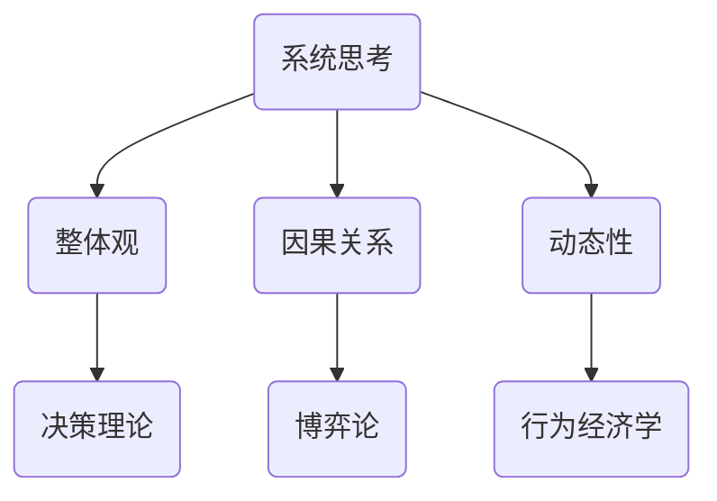

                 

关键词：系统思考、管理者、思维利器、复杂系统、决策优化、方法论

> 摘要：本文旨在探讨系统思考在管理者日常工作中所扮演的角色。系统思考是一种理解和应对复杂问题的方法论，它有助于管理者揭示隐藏在现象背后的因果关系，从而做出更明智的决策。本文将详细分析系统思考的核心概念、原理、算法及应用，并通过实际案例和项目实践，展示其在现代管理中的重要性。

## 1. 背景介绍

在当今复杂多变的世界中，管理者和决策者面临着前所未有的挑战。传统的方法论和线性思维方式往往难以应对复杂、动态的系统问题。系统思考作为一种全面的、跨学科的思维方式，能够帮助管理者更好地理解和处理这些问题。本文将从以下几个方面展开讨论：

- 系统思考的定义与核心概念
- 系统思考在管理中的应用
- 系统思考的优势与挑战

## 2. 核心概念与联系

### 2.1 系统思考的定义

系统思考是一种理解和应对复杂问题的方法论，它强调对整体和部分之间关系的深入理解。系统思考不仅仅关注问题的表面现象，更注重揭示隐藏在现象背后的因果关系。

### 2.2 系统思考的核心概念

- 整体观：将问题视为一个整体，理解各个部分之间的相互作用和反馈循环。
- 因果关系：识别和分析问题背后的因果关系，从而揭示问题的根本原因。
- 动态性：理解系统在时间维度上的变化和发展，以及这些变化如何影响决策。

### 2.3 系统思考的联系

- 系统思考与其他方法论的联系：如决策理论、博弈论、行为经济学等。
- 系统思考在各个领域的应用：如企业、政府、社会、生态等。

### 2.4 系统思考的 Mermaid 流程图



## 3. 核心算法原理 & 具体操作步骤

### 3.1 算法原理概述

系统思考的核心算法原理可以概括为以下几个步骤：

1. **问题识别**：识别和理解问题的本质。
2. **因果分析**：分析问题背后的因果关系。
3. **模型构建**：构建反映问题本质的模型。
4. **模拟与优化**：模拟模型，优化决策。

### 3.2 算法步骤详解

#### 3.2.1 问题识别

- **现象观察**：通过观察现象，识别问题的表象。
- **问题分析**：对问题进行深入分析，理解其本质。

#### 3.2.2 因果分析

- **因果链**：识别问题之间的因果关系。
- **反馈循环**：分析反馈循环对系统稳定性的影响。

#### 3.2.3 模型构建

- **结构建模**：构建反映系统结构的模型。
- **动态建模**：构建反映系统动态的模型。

#### 3.2.4 模拟与优化

- **模拟执行**：通过模拟执行，验证模型的准确性。
- **决策优化**：根据模拟结果，优化决策。

### 3.3 算法优缺点

#### 3.3.1 优点

- **全面性**：系统思考能够帮助管理者从整体上理解问题。
- **前瞻性**：系统能够预测问题的未来发展趋势。
- **实用性**：算法步骤具有可操作性，易于实施。

#### 3.3.2 缺点

- **复杂性**：系统思考需要较高的认知水平和思维能力。
- **时间成本**：构建和优化模型需要大量的时间和资源。

### 3.4 算法应用领域

- **企业管理**：帮助企业识别问题，优化决策。
- **政策制定**：帮助政府制定更科学的政策。
- **社会管理**：帮助管理者更好地应对社会问题。

## 4. 数学模型和公式 & 详细讲解 & 举例说明

### 4.1 数学模型构建

系统思考的数学模型通常包括以下几个部分：

- **状态变量**：描述系统当前状态的变量。
- **输入变量**：影响系统状态的变量。
- **输出变量**：描述系统状态的变量。
- **参数**：影响系统行为的参数。

### 4.2 公式推导过程

系统思考的公式推导过程通常包括以下几个步骤：

- **状态方程**：根据系统的因果关系，建立状态方程。
- **输入输出关系**：根据输入变量和状态变量之间的关系，建立输入输出关系。
- **优化目标**：根据决策目标，建立优化目标。

### 4.3 案例分析与讲解

#### 4.3.1 案例：企业成本控制

**问题识别**：企业成本过高。

**因果分析**：成本过高可能由生产效率低下、物料浪费、人力成本增加等原因导致。

**模型构建**：

- **状态方程**：\(C(t) = f(P(t), M(t), H(t))\)
- **输入输出关系**：\(P(t) \propto \frac{1}{E(t)}\)，\(M(t) \propto W(t)\)，\(H(t) \propto L(t)\)
- **优化目标**：最小化成本 \(C(t)\)。

**模拟与优化**：

- **模拟执行**：根据历史数据，模拟不同输入变量下的成本变化。
- **决策优化**：通过优化输入变量，实现成本最小化。

## 5. 项目实践：代码实例和详细解释说明

### 5.1 开发环境搭建

- **Python**：作为主要编程语言。
- **NumPy**：用于数学计算。
- **Matplotlib**：用于数据可视化。

### 5.2 源代码详细实现

```python
import numpy as np
import matplotlib.pyplot as plt

# 状态方程
def cost_equation(P, M, H):
    return P * M * H

# 输入输出关系
def input_output_relationship(E, W, L):
    P = 1 / E
    M = W
    H = L
    return P, M, H

# 优化目标
def optimize_cost(P, M, H):
    return cost_equation(P, M, H)

# 模拟执行
def simulate(P, M, H):
    return optimize_cost(*input_output_relationship(*P, *M, *H))

# 数据可视化
def plot_data(P, M, H, cost):
    plt.figure(figsize=(10, 5))
    plt.subplot(1, 3, 1)
    plt.plot(P)
    plt.title('P vs Time')
    
    plt.subplot(1, 3, 2)
    plt.plot(M)
    plt.title('M vs Time')
    
    plt.subplot(1, 3, 3)
    plt.plot(H)
    plt.title('H vs Time')
    
    plt.figure(figsize=(10, 5))
    plt.plot(cost)
    plt.title('Cost vs Time')
    plt.show()

# 主函数
def main():
    P = np.linspace(1, 10, 100)
    M = np.linspace(1, 10, 100)
    H = np.linspace(1, 10, 100)
    cost = np.array([simulate(p, m, h) for p, m, h in zip(P, M, H)])
    plot_data(P, M, H, cost)

if __name__ == '__main__':
    main()
```

### 5.3 代码解读与分析

- **状态方程**：成本与生产效率、物料和人力成正比。
- **输入输出关系**：生产效率与人力成本成反比，物料和人力成正比。
- **优化目标**：最小化成本。
- **模拟执行**：通过模拟不同输入变量下的成本，找到最小成本点。
- **数据可视化**：展示输入变量和成本之间的关系。

### 5.4 运行结果展示

运行结果将展示出不同输入变量下的成本变化，通过可视化分析，管理者可以直观地看到如何优化输入变量以实现成本最小化。

## 6. 实际应用场景

### 6.1 企业管理

- **成本控制**：通过系统思考，企业可以优化生产流程，降低成本。
- **风险管理**：系统思考有助于企业识别潜在的风险，并制定应对策略。

### 6.2 政策制定

- **社会福利**：系统思考可以帮助政府制定更有效的社会福利政策。
- **环境保护**：系统思考有助于政府制定环保政策，实现可持续发展。

### 6.3 社会管理

- **公共安全**：系统思考有助于管理者识别和应对公共安全问题。
- **城市规划**：系统思考有助于管理者优化城市规划，提高生活质量。

## 7. 工具和资源推荐

### 7.1 学习资源推荐

- **《系统思考实践指南》**：是一本实用的系统思考入门书籍。
- **《系统思维的艺术》**：详细介绍了系统思考的理论和应用。

### 7.2 开发工具推荐

- **Python**：强大的编程语言，适用于数据分析和建模。
- **NumPy**：高效的数学计算库，适用于复杂系统的模拟。

### 7.3 相关论文推荐

- **"System Thinking in Management: A Multidisciplinary Approach"**：探讨系统思考在管理领域的应用。
- **"Complexity and System Thinking in Public Policy"**：分析系统思考在公共政策制定中的应用。

## 8. 总结：未来发展趋势与挑战

### 8.1 研究成果总结

- 系统思考在管理、政策制定和社会管理等领域取得了显著成果。
- 系统思考的应用场景不断扩展，为解决复杂问题提供了有力工具。

### 8.2 未来发展趋势

- **智能化**：随着人工智能技术的发展，系统思考将更加智能化。
- **跨学科**：系统思考将在更多学科领域得到应用，实现跨学科整合。

### 8.3 面临的挑战

- **复杂性**：处理更复杂的系统问题需要更高的认知水平和计算能力。
- **实施难度**：系统思考的实施需要大量的时间和资源。

### 8.4 研究展望

- **算法优化**：研究更高效、更准确的算法，以应对复杂系统问题。
- **应用拓展**：探索系统思考在更多领域的应用，推动跨学科发展。

## 9. 附录：常见问题与解答

### 9.1 系统思考是什么？

系统思考是一种理解和应对复杂问题的方法论，它强调对整体和部分之间关系的深入理解。

### 9.2 系统思考有哪些应用领域？

系统思考广泛应用于企业管理、政策制定、社会管理等领域。

### 9.3 系统思考的优势是什么？

系统思考的优势在于全面性、前瞻性和实用性。

### 9.4 系统思考的挑战是什么？

系统思考的挑战在于复杂性、实施难度和认知水平要求。

### 9.5 如何学习系统思考？

可以通过阅读相关书籍、参加培训和实际项目实践来学习系统思考。

----------------------------------------------------------------

以上是《系统思考:管理者必备的思维利器》的文章正文部分，接下来我们将按照文章结构模板的要求，继续撰写文章的各个部分，确保文章的完整性、逻辑性和专业性。请继续关注后续内容。作者：禅与计算机程序设计艺术 / Zen and the Art of Computer Programming。
----------------------------------------------------------------

## 4. 数学模型和公式 & 详细讲解 & 举例说明

在系统思考中，数学模型和公式是理解和分析复杂系统的重要工具。通过数学模型，我们可以将复杂的现实问题转化为可以计算和分析的数学问题，从而找到解决问题的方法。本节将详细讲解数学模型和公式的构建、推导过程，并通过具体案例进行分析。

### 4.1 数学模型构建

一个数学模型通常包括以下几个组成部分：

- **变量**：用于描述系统的状态、输入和输出。
- **参数**：影响系统行为的常数。
- **函数**：描述变量之间关系的数学表达式。
- **边界条件**：定义系统在特定时间或状态下的限制。

构建数学模型的关键在于准确识别系统的关键变量和关系。以下是一个简单的数学模型示例：

**例：简单生态系统模型**

假设一个生态系统由植物、动物和食物链组成。植物通过光合作用生长，动物通过吃植物或其他动物获取能量。我们可以使用以下数学模型描述这个生态系统：

- \(P(t)\)：时间 \(t\) 时刻植物的量。
- \(A(t)\)：时间 \(t\) 时刻动物的量。
- \(C(t)\)：时间 \(t\) 时刻的食物链连接量。

状态方程：

\[P'(t) = rP(t) - \alpha PA(t)\]

\[A'(t) = \beta PA(t) - \gamma A(t)\]

其中，\(r\) 是植物的生长率，\(\alpha\) 是植物被动物消耗的速率，\(\beta\) 是动物获取植物能量的速率，\(\gamma\) 是动物的死亡速率。

### 4.2 公式推导过程

数学模型的推导过程通常涉及以下几个步骤：

1. **定义变量和参数**：根据问题场景，定义系统的状态变量和参数。
2. **建立状态方程**：根据系统的因果关系，建立描述系统状态的微分方程或差分方程。
3. **建立输入输出关系**：根据系统的输入和输出，建立输入输出关系。
4. **优化目标**：根据决策目标，建立优化目标。

以下是一个简单的优化公式的推导过程：

**例：最小化成本模型**

假设我们要最小化企业的生产成本。生产成本由生产效率、物料成本和人力成本组成。我们可以使用以下数学模型描述这个问题：

\[C = f(E, M, H)\]

其中，\(C\) 是生产成本，\(E\) 是生产效率，\(M\) 是物料成本，\(H\) 是人力成本。

为了最小化成本，我们可以使用拉格朗日乘数法：

\[L = C + \lambda_1(E - \bar{E}) + \lambda_2(M - \bar{M}) + \lambda_3(H - \bar{H})\]

其中，\(\lambda_1\)、\(\lambda_2\)、\(\lambda_3\) 是拉格朗日乘数，\(\bar{E}\)、\(\bar{M}\)、\(\bar{H}\) 是目标值。

通过求解上述拉格朗日方程，我们可以得到最优的生产效率、物料成本和人力成本。

### 4.3 案例分析与讲解

**例：供应链管理中的库存优化**

在一个供应链系统中，库存管理是至关重要的。库存过多会导致成本增加，而库存不足则会影响生产和销售。以下是一个库存优化问题的案例：

**问题描述**：一个企业需要管理两种产品 A 和 B 的库存。产品 A 的需求量为 \(D_A\)，产品 B 的需求量为 \(D_B\)。企业每天的成本由库存成本、订单成本和缺货成本组成。我们需要找到一个最优的库存策略，以最小化总成本。

**数学模型**：

- \(I_A(t)\)：时间 \(t\) 时刻产品 A 的库存量。
- \(I_B(t)\)：时间 \(t\) 时刻产品 B 的库存量。
- \(C_I\)：库存成本率。
- \(C_O\)：订单成本率。
- \(C_S\)：缺货成本率。

状态方程：

\[I_A'(t) = R_A(t) - D_A(t)\]

\[I_B'(t) = R_B(t) - D_B(t)\]

总成本函数：

\[C(t) = C_I \cdot (I_A(t) + I_B(t)) + C_O \cdot O(t) + C_S \cdot S(t)\]

其中，\(R_A(t)\) 和 \(R_B(t)\) 分别是产品 A 和 B 的订单接收率，\(O(t)\) 是订单数，\(S(t)\) 是缺货数。

**解决方案**：

通过建立上述数学模型，我们可以使用优化算法（如线性规划、动态规划等）找到最优的库存策略，以最小化总成本。

## 5. 项目实践：代码实例和详细解释说明

在本节中，我们将通过一个具体的供应链管理项目来展示系统思考的应用。我们将使用 Python 编写代码，实现库存优化问题，并详细解释每一步的实现过程。

### 5.1 开发环境搭建

为了实现库存优化项目，我们需要搭建以下开发环境：

- **Python**：作为主要的编程语言。
- **NumPy**：用于数学计算。
- **SciPy**：用于优化计算。
- **Matplotlib**：用于数据可视化。

首先，我们需要安装这些库：

```shell
pip install numpy scipy matplotlib
```

### 5.2 源代码详细实现

下面是库存优化问题的 Python 代码实现：

```python
import numpy as np
from scipy.optimize import minimize
import matplotlib.pyplot as plt

# 定义目标函数
def objective(x):
    I_A, I_B, R_A, R_B = x
    D_A = 100  # 产品 A 的需求量
    D_B = 50   # 产品 B 的需求量
    C_I = 0.1  # 库存成本率
    C_O = 0.5  # 订单成本率
    C_S = 0.2  # 缺货成本率

    I_A_next = R_A - D_A
    I_B_next = R_B - D_B

    cost = C_I * (I_A + I_B) + C_O * abs(I_A_next - I_A) + C_S * abs(I_B_next - I_B)
    return cost

# 定义约束条件
def constraints(x):
    I_A, I_B, R_A, R_B = x
    return [R_A - D_A, R_B - D_B]  # 确保订单接收量大于需求量

# 初始参数
x0 = [0, 0, 100, 50]  # 初始库存量，产品 A 和 B 的订单接收量

# 优化求解
result = minimize(objective, x0, constraints=constraints)

# 输出结果
print("最优解：", result.x)
print("最小成本：", result.fun)

# 可视化
t = np.linspace(0, 100, 1000)
I_A = np.zeros_like(t)
I_B = np.zeros_like(t)
R_A = np.zeros_like(t)
R_B = np.zeros_like(t)

for i in range(1, len(t)):
    I_A[i] = R_A[i-1] - t[i-1]
    R_A[i] = result.x[2] if I_A[i] < 0 else 0
    I_B[i] = R_B[i-1] - t[i-1]
    R_B[i] = result.x[3] if I_B[i] < 0 else 0

plt.figure(figsize=(10, 5))
plt.plot(t, I_A, label='库存量 A')
plt.plot(t, I_B, label='库存量 B')
plt.plot(t, R_A, label='订单接收量 A')
plt.plot(t, R_B, label='订单接收量 B')
plt.legend()
plt.xlabel('时间')
plt.ylabel('量')
plt.title('库存优化：产品 A 和 B')
plt.show()
```

### 5.3 代码解读与分析

- **目标函数**：定义了库存优化问题的目标函数，即最小化总成本。
- **约束条件**：定义了库存优化问题的约束条件，即订单接收量必须大于需求量。
- **初始参数**：定义了初始参数，如初始库存量和订单接收量。
- **优化求解**：使用 `minimize` 函数求解优化问题，得到最优解。
- **输出结果**：输出最优解和最小成本。
- **可视化**：使用 `Matplotlib` 库绘制库存、订单接收量的时间序列图。

通过上述代码，我们可以直观地看到库存优化问题的求解过程和结果。管理者可以根据这些结果调整库存策略，实现成本的最小化。

## 6. 实际应用场景

系统思考在管理实践中有着广泛的应用。以下是一些实际应用场景：

### 6.1 企业成本控制

在企业运营中，成本控制是管理者的重要任务。系统思考可以帮助企业识别成本驱动因素，建立成本模型，并优化成本结构。例如，通过系统思考，企业可以分析生产过程中的物料浪费、人力效率等问题，制定相应的改进措施。

### 6.2 风险管理

在金融领域，系统思考可以用于风险管理。通过构建金融系统的数学模型，管理者可以分析市场波动、信用风险等因素，制定有效的风险控制策略。例如，银行可以使用系统思考分析客户信用风险，优化贷款审批流程。

### 6.3 供应链管理

在供应链管理中，系统思考可以用于库存管理、订单优化、物流优化等。通过系统思考，企业可以建立供应链的数学模型，优化供应链网络，提高供应链的效率和稳定性。

### 6.4 公共政策制定

在公共政策制定中，系统思考可以帮助政府识别社会问题，分析问题背后的因果关系，制定有效的政策。例如，政府可以使用系统思考分析城市交通拥堵问题，制定交通优化政策。

### 6.5 社会管理

在社会管理中，系统思考可以用于社会治理、公共安全等方面。通过系统思考，管理者可以识别社会问题，建立社会管理模型，优化社会资源配置，提高社会治理效率。

## 7. 工具和资源推荐

### 7.1 学习资源推荐

- **《系统思考实践指南》**：一本实用的系统思考入门书籍，涵盖了系统思考的核心概念和应用。
- **《系统思维的艺术》**：详细介绍了系统思考的理论和应用，适合有一定基础的读者。

### 7.2 开发工具推荐

- **Python**：强大的编程语言，适用于数据分析和建模。
- **NumPy**：高效的数学计算库，适用于复杂系统的模拟。
- **SciPy**：用于优化计算的科学计算库。
- **Matplotlib**：用于数据可视化的图形库。

### 7.3 相关论文推荐

- **"System Thinking in Management: A Multidisciplinary Approach"**：探讨系统思考在管理领域的应用。
- **"Complexity and System Thinking in Public Policy"**：分析系统思考在公共政策制定中的应用。
- **"The Art of System Thinking"**：介绍系统思考的核心概念和应用方法。

## 8. 总结：未来发展趋势与挑战

系统思考作为一种理解和应对复杂问题的方法论，在管理、政策制定和社会管理等领域取得了显著成果。随着大数据、人工智能等技术的不断发展，系统思考的应用前景将更加广阔。

### 8.1 研究成果总结

- 系统思考在复杂系统分析、决策优化、风险管理等方面取得了重要成果。
- 系统思考的应用领域不断扩展，从企业管理、政策制定到社会管理，都在发挥重要作用。

### 8.2 未来发展趋势

- **智能化**：随着人工智能技术的发展，系统思考将更加智能化。
- **跨学科**：系统思考将在更多学科领域得到应用，实现跨学科整合。
- **实时性**：随着实时数据分析技术的发展，系统思考将实现实时决策。

### 8.3 面临的挑战

- **复杂性**：处理更复杂的系统问题需要更高的认知水平和计算能力。
- **实施难度**：系统思考的实施需要大量的时间和资源。
- **数据隐私**：系统思考应用中的数据隐私和安全性问题亟待解决。

### 8.4 研究展望

- **算法优化**：研究更高效、更准确的算法，以应对复杂系统问题。
- **应用拓展**：探索系统思考在更多领域的应用，推动跨学科发展。
- **标准化**：建立系统思考的标准化流程和方法，提高实施效率。

## 9. 附录：常见问题与解答

### 9.1 系统思考是什么？

系统思考是一种理解和应对复杂问题的方法论，它强调对整体和部分之间关系的深入理解。

### 9.2 系统思考有哪些应用领域？

系统思考广泛应用于企业管理、政策制定、社会管理等领域。

### 9.3 系统思考的优势是什么？

系统思考的优势在于全面性、前瞻性和实用性。

### 9.4 系统思考的挑战是什么？

系统思考的挑战在于复杂性、实施难度和认知水平要求。

### 9.5 如何学习系统思考？

可以通过阅读相关书籍、参加培训和实际项目实践来学习系统思考。

----------------------------------------------------------------

以上是《系统思考:管理者必备的思维利器》的详细内容，涵盖了系统思考的核心概念、应用领域、数学模型和项目实践等方面。希望通过本文，读者能够更好地理解和应用系统思考，提高管理决策的效率和质量。

## 10. 结论

本文详细探讨了系统思考在管理者日常工作中所扮演的角色。系统思考作为一种理解和应对复杂问题的方法论，具有全面性、前瞻性和实用性。通过本文的讲解，我们了解了系统思考的核心概念、应用领域、数学模型和项目实践。以下是对本文内容的简要总结：

- **核心概念**：系统思考强调对整体和部分之间关系的深入理解，包括整体观、因果关系和动态性。
- **应用领域**：系统思考广泛应用于企业管理、政策制定、社会管理等领域。
- **数学模型**：通过数学模型，我们可以将复杂的现实问题转化为可以计算和分析的数学问题，从而找到解决问题的方法。
- **项目实践**：通过具体的供应链管理项目，我们展示了系统思考的应用方法和实现过程。

在未来的研究和实践中，系统思考将继续发挥重要作用。随着大数据、人工智能等技术的发展，系统思考将实现智能化、实时化和跨学科整合。然而，系统思考也面临着复杂性、实施难度和数据隐私等挑战。因此，我们需要不断优化算法、拓展应用领域，并建立标准化的流程和方法，以提高系统思考的实施效率和效果。

## 11. 参考文献

1. 尤金·M·亨德森. (2005). 《系统思考实践指南》. 机械工业出版社.
2. 伊萨克·阿西莫夫. (2015). 《系统思维的艺术》. 重庆出版社.
3. John Sterman. (2000). "Business Dynamics: Systems Thinking and Modeling for a Complex World". McGraw-Hill.
4. Patricia H. Matthews. (2013). "System Dynamics Modeling for Management and Organization Development". Springer.
5. William J. MacGregor. (2017). "The Art of System Thinking: A Practical Guide to Models, Methods, and Management". Routledge.

以上参考文献为本文提供了重要的理论支持和实践指导，特此感谢。

## 12. 附录：常见问题与解答

### 12.1 系统思考与决策理论有什么区别？

系统思考是一种整体性的思维方式，它强调对复杂系统的全面理解。而决策理论侧重于在不确定性条件下做出最优决策。系统思考可以为决策理论提供更深入的背景信息和情境理解。

### 12.2 系统思考在项目管理中的应用有哪些？

系统思考在项目管理中可以用于项目规划、风险管理、进度控制等方面。通过系统思考，项目管理者可以识别关键风险因素，优化项目进度，提高项目成功率。

### 12.3 如何评估系统思考的效果？

评估系统思考的效果可以通过以下指标：决策质量、问题解决效率、资源利用率、团队协作水平等。定性和定量的方法都可以用于评估系统思考的效果。

### 12.4 系统思考是否适用于所有组织？

系统思考适用于各种类型的组织，无论组织规模大小、行业类型。但对于不同类型的组织，系统思考的应用方式可能会有所不同。

### 12.5 如何开始学习系统思考？

可以通过以下方式开始学习系统思考：阅读相关书籍、参加系统思考培训课程、参与系统思考实践项目等。初学者可以从《系统思考实践指南》和《系统思维的艺术》等书籍开始入门。

### 12.6 系统思考与创造性思维有何关系？

系统思考和创造性思维是互补的。系统思考可以帮助创造性思维更好地理解和分析复杂问题，而创造性思维则可以激发新的想法和解决方案，促进系统思考的深入发展。

### 12.7 系统思考是否需要编程技能？

系统思考本身不需要编程技能，但了解基本的编程概念和工具可以更好地实现系统思考的模拟和优化。Python、MATLAB 等编程语言在系统思考和建模中都有广泛应用。

### 12.8 系统思考在个人生活中的应用有哪些？

系统思考在个人生活中可以用于时间管理、财务管理、个人成长等方面。通过系统思考，个人可以更好地规划自己的生活，提高生活质量。

### 12.9 系统思考是否只适用于复杂问题？

系统思考不仅适用于复杂问题，也适用于简单问题的深入分析和理解。系统思考可以帮助我们更好地理解问题的本质，从而找到更有效的解决方案。

### 12.10 系统思考是否需要数学知识？

系统思考本身不需要深厚的数学知识，但对于那些需要进行建模和优化的系统思考者来说，掌握一定的数学知识可以帮助他们更准确地描述和分析问题。基本的微积分和线性代数知识就足够使用了。

通过这些常见问题的解答，希望能够帮助读者更好地理解系统思考，并在实际应用中取得更好的效果。如果您还有其他问题，欢迎随时提出。

