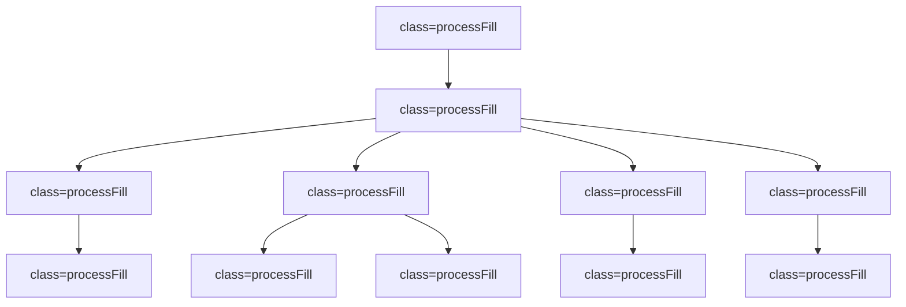

                 

关键词：系统思考、复杂问题、管理、方法论、技术实践

> 摘要：在快速变化的数字时代，管理者面临的挑战日益复杂。本文将探讨系统思考作为一种重要的管理工具，如何帮助管理者破解复杂问题，提升组织效率。

## 1. 背景介绍

在当今的商业环境中，管理者每天都会面对各种复杂问题。这些问题的特征是它们通常涉及多个相互关联的变量，以及这些变量之间的动态交互作用。例如，一个公司的市场策略不仅受内部决策的影响，还受到外部经济环境、消费者行为和技术变革的影响。传统的线性思维和单一视角的方法已经不足以应对这些复杂性问题。

复杂问题解决的核心在于理解问题的本质，并采取系统化的方法来识别、分析和管理这些问题的各个方面。系统思考提供了一种方法论，它强调整体性、动态性和反馈循环，使管理者能够从全局视角审视问题，并找到根本解决方案。

本文将探讨系统思考的核心概念、应用方法以及在实际管理中的具体实践。通过分析系统思考的优势和局限性，我们将展示如何将其应用于商业环境中，以提升决策质量和组织效能。

## 2. 核心概念与联系

### 2.1 系统思考的定义

系统思考是一种分析和解决问题的方法论，它强调从整体和长期的角度来理解问题。该方法认为，问题并不是孤立存在的，而是由多个相互作用的元素组成的复杂系统。这些元素之间的相互关系和反馈循环决定了系统的行为。

系统思考不同于传统的分析工具，如线性规划和统计分析。它不仅关注系统的当前状态，还关注系统的发展趋势和长期影响。这种方法鼓励管理者采用动态视角，理解问题的根本原因，并找到持久的解决方案。

### 2.2 系统思考的基本原理

系统思考基于以下几个基本原理：

1. **整体性**：系统思考认为，系统的各个部分是相互依赖的，整体的行为不能仅仅通过分析部分来理解。
2. **动态性**：系统是动态的，随着时间的推移，系统的状态和关系会发生变化。
3. **反馈循环**：系统内部存在多种反馈循环，这些循环可以加强或削弱系统的行为。
4. **延迟**：系统行为的反馈通常会有延迟，这可能导致短期和长期的决策产生意想不到的后果。
5. **均衡和失均衡**：系统在均衡和失均衡之间不断变化，管理者需要理解这些状态，以预测和应对系统行为的变化。

### 2.3 系统思考的应用架构

为了更好地理解系统思考，我们可以使用Mermaid流程图来展示其核心概念和联系。



在这个流程图中，我们定义了系统思考的核心概念，并展示了它们之间的联系。这些概念共同构成了系统思考的框架，帮助管理者从整体和动态的视角理解复杂问题。

## 3. 核心算法原理 & 具体操作步骤

### 3.1 算法原理概述

系统思考的核心算法是基于对复杂系统的建模和分析。该算法的基本思想是：

1. **识别系统元素**：确定构成系统的各个元素及其相互关系。
2. **建立模型**：使用数学模型或图形工具（如系统动力学模型）来表示系统的行为。
3. **模拟与分析**：通过模拟系统在不同条件下的行为，分析系统的动态特性。
4. **反馈与调整**：根据模拟结果，对系统进行调整，以找到最佳的解决方案。

### 3.2 算法步骤详解

#### 3.2.1 识别系统元素

在开始建模之前，管理者需要明确系统中的关键元素。这些元素可以是人员、资源、过程或策略等。识别元素的过程通常涉及以下几个步骤：

1. **确定目标**：明确系统要解决的问题或实现的目标。
2. **收集数据**：收集与系统相关的数据，包括历史数据、实时数据和专家意见。
3. **绘制元素图**：使用图形工具（如UML图或因果图）来表示系统元素及其相互关系。

#### 3.2.2 建立模型

建立模型是系统思考的关键步骤。模型的目的是为了更好地理解系统的行为。以下是建立模型的基本步骤：

1. **选择建模工具**：根据系统的特点，选择合适的建模工具（如系统动力学软件、Matlab等）。
2. **定义变量**：确定系统中所有关键变量，并定义它们的取值范围和关系。
3. **构建方程**：根据系统的逻辑关系，构建描述系统行为的数学方程。
4. **验证模型**：通过比较模型预测和实际数据，验证模型的准确性。

#### 3.2.3 模拟与分析

建立模型后，管理者可以通过模拟来分析系统的行为。以下是模拟与分析的基本步骤：

1. **设置初始条件**：根据系统的实际情况，设置模型运行的初始条件。
2. **运行模拟**：在计算机上运行模型，观察系统在不同条件下的行为。
3. **分析结果**：分析模拟结果，识别系统的关键特征和趋势。
4. **调整模型**：根据分析结果，对模型进行调整，以提高模型的预测能力。

#### 3.2.4 反馈与调整

模拟与分析完成后，管理者需要根据模拟结果对系统进行调整。以下是反馈与调整的基本步骤：

1. **制定策略**：根据模拟结果，制定具体的解决方案或改进策略。
2. **实施策略**：将策略付诸实践，观察系统的实际反应。
3. **评估效果**：评估策略的实施效果，根据实际情况进行调整。
4. **持续改进**：通过持续的模拟与分析，不断优化系统的性能。

### 3.3 算法优缺点

#### 优点

1. **全面性**：系统思考方法能够全面考虑系统的各个元素及其相互关系，提供更全面的解决方案。
2. **前瞻性**：通过模拟与分析，系统能够预测未来的趋势和变化，为决策提供前瞻性指导。
3. **动态性**：系统思考方法能够动态地适应系统的变化，提供灵活的解决方案。

#### 缺点

1. **复杂性**：系统思考方法需要复杂的建模和分析过程，对管理者的技术水平要求较高。
2. **耗时性**：系统思考方法需要较长的时间来建立模型、进行模拟和分析，对决策的及时性有一定影响。

### 3.4 算法应用领域

系统思考方法广泛应用于各个领域，以下是一些典型的应用场景：

1. **企业管理**：用于分析企业的运营模式、战略规划、风险管理等。
2. **社会管理**：用于分析社会问题、政策制定、公共卫生管理等。
3. **环境保护**：用于分析环境问题、资源管理、气候变化等。

## 4. 数学模型和公式 & 详细讲解 & 举例说明

### 4.1 数学模型构建

在系统思考中，数学模型是一种重要的工具，用于描述系统的行为和关系。以下是构建数学模型的基本步骤：

1. **定义变量**：确定系统中的关键变量，并定义它们的取值范围和关系。
2. **建立方程**：根据系统的逻辑关系，构建描述系统行为的数学方程。
3. **参数化**：为方程中的参数设定合理的取值，使模型具有实际意义。
4. **验证模型**：通过比较模型预测和实际数据，验证模型的准确性。

### 4.2 公式推导过程

以下是一个简单的数学模型示例，用于描述一个简单经济系统中的生产与消费关系。我们使用以下变量：

- \( P \)：生产量
- \( C \)：消费量
- \( I \)：投资量
- \( G \)：政府支出

模型的假设条件如下：

1. 生产量 \( P \) 与消费量 \( C \) 成正比，即 \( P = kC \)（其中 \( k \) 是比例常数）。
2. 消费量 \( C \) 与收入 \( I \) 成正比，即 \( C = rI \)（其中 \( r \) 是比例常数）。
3. 投资量 \( I \) 与生产量 \( P \) 成正比，即 \( I = mP \)（其中 \( m \) 是比例常数）。
4. 政府支出 \( G \) 对生产量 \( P \) 有正影响，即 \( P = P + aG \)（其中 \( a \) 是比例常数）。

基于以上假设，我们可以得到以下方程：

\[ P = kC \]
\[ C = rI \]
\[ I = mP \]
\[ P = P + aG \]

我们可以通过联立这些方程，解出各个变量之间的关系。

### 4.3 案例分析与讲解

以下是一个简单的案例，用于说明如何使用系统思考方法来分析一个简单的经济系统。

假设有一个经济体，其生产量 \( P \)、消费量 \( C \)、投资量 \( I \) 和政府支出 \( G \) 的初始条件如下：

- \( P_0 = 100 \)
- \( C_0 = 80 \)
- \( I_0 = 60 \)
- \( G_0 = 40 \)

比例常数分别为：

- \( k = 0.8 \)
- \( r = 0.6 \)
- \( m = 0.5 \)
- \( a = 0.3 \)

我们首先需要建立系统的数学模型，并根据初始条件计算各个变量的值。

根据方程 \( P = kC \)，我们有 \( P = 0.8C \)。根据方程 \( C = rI \)，我们有 \( C = 0.6I \)。根据方程 \( I = mP \)，我们有 \( I = 0.5P \)。根据方程 \( P = P + aG \)，我们有 \( P = P + 0.3G \)。

我们假设政府支出 \( G \) 保持不变，即 \( G = 40 \)。

现在，我们可以计算各个变量的值：

\[ P = 0.8C = 0.8 \times 0.6I = 0.8 \times 0.6 \times 0.5P = 0.24P \]
\[ P = 0.24P + 0.3G = 0.24P + 0.3 \times 40 = 0.24P + 12 \]
\[ P = \frac{0.24P + 12}{1 - 0.24} = \frac{0.24P + 12}{0.76} \]
\[ P = \frac{12}{0.76 - 0.24} = \frac{12}{0.52} = 23.08 \]

\[ C = 0.6I = 0.6 \times 0.5P = 0.3P = 0.3 \times 23.08 = 6.92 \]

\[ I = 0.5P = 0.5 \times 23.08 = 11.54 \]

现在，我们可以根据计算出的变量值来分析系统的动态行为。例如，我们可以观察生产量 \( P \) 如何随着时间变化，以及它对消费量 \( C \) 和投资量 \( I \) 的影响。

### 4.4 模拟与分析

为了更直观地了解系统的动态行为，我们可以使用计算机模拟来观察系统在不同条件下的行为。以下是一个简单的模拟过程：

1. **设置初始条件**：假设初始生产量 \( P_0 = 100 \)，消费量 \( C_0 = 80 \)，投资量 \( I_0 = 60 \)，政府支出 \( G_0 = 40 \)。
2. **运行模拟**：在计算机上运行模拟，观察系统在不同条件下的行为。例如，我们可以逐渐增加政府支出 \( G \) 的值，观察生产量 \( P \) 和消费量 \( C \) 的变化。
3. **分析结果**：根据模拟结果，分析系统的动态特性。例如，我们可以观察生产量 \( P \) 如何随着政府支出 \( G \) 的增加而增加，以及这种变化对消费量 \( C \) 的影响。

通过模拟与分析，我们可以更深入地理解系统的行为，为决策提供科学依据。

## 5. 项目实践：代码实例和详细解释说明

### 5.1 开发环境搭建

在进行系统思考的实际项目开发之前，我们需要搭建一个合适的开发环境。以下是一个基于Python的简单系统思考项目的开发环境搭建步骤：

1. **安装Python**：确保计算机上安装了Python环境。可以从[Python官方网站](https://www.python.org/)下载并安装Python。
2. **安装NumPy和SciPy**：NumPy和SciPy是Python中用于科学计算的常用库。可以通过以下命令安装：

   ```bash
   pip install numpy scipy
   ```

3. **安装Matplotlib**：Matplotlib是Python中用于数据可视化的常用库。可以通过以下命令安装：

   ```bash
   pip install matplotlib
   ```

4. **安装Jupyter Notebook**：Jupyter Notebook是一个交互式的Python开发环境，方便进行数据分析和可视化。可以通过以下命令安装：

   ```bash
   pip install notebook
   ```

### 5.2 源代码详细实现

以下是一个简单的Python代码实例，用于实现系统思考中的生产与消费关系的数学模型。

```python
import numpy as np
import scipy.integrate
import matplotlib.pyplot as plt

# 定义系统变量
P = np.zeros((100,))  # 生产量
C = np.zeros((100,))  # 消费力
I = np.zeros((100,))  # 投资量
G = np.zeros((100,))  # 政府支出

# 初始条件
P[0] = 100
C[0] = 80
I[0] = 60
G[0] = 40

# 模型参数
k = 0.8  # 生产量与消费量的比例常数
r = 0.6  # 消费力与收入的比例常数
m = 0.5  # 投资量与生产量的比例常数
a = 0.3  # 政府支出对生产量的影响比例常数

# 定义系统方程
def system_equations(t, y):
    P = y[0]
    C = y[1]
    I = y[2]
    G = y[3]

    dPdt = k * C - a * G
    dCdt = r * I
    dIdt = m * P
    dGdt = 0  # 假设政府支出保持不变

    return [dPdt, dCdt, dIdt, dGdt]

# 模拟系统行为
t = np.linspace(0, 50, 1000)  # 时间范围
y0 = [P[0], C[0], I[0], G[0]]  # 初始条件
y = scipy.integrate.odeint(system_equations, y0, t)

# 可视化结果
plt.plot(t, y[:, 0], label='Production')
plt.plot(t, y[:, 1], label='Consumption')
plt.plot(t, y[:, 2], label='Investment')
plt.plot(t, y[:, 3], label='Government Expenditure')
plt.legend()
plt.xlabel('Time')
plt.ylabel('Value')
plt.title('System Dynamics')
plt.show()
```

### 5.3 代码解读与分析

以上代码实现了系统思考中的生产与消费关系的数学模型。以下是代码的详细解读：

1. **导入库**：代码开头导入了一些Python库，包括NumPy、SciPy和Matplotlib，用于数学计算和数据可视化。
2. **定义系统变量**：定义了生产量 \( P \)、消费量 \( C \)、投资量 \( I \) 和政府支出 \( G \) 的数组，用于存储系统在不同时间点的值。
3. **初始条件**：设置系统的初始条件，包括生产量 \( P_0 \)、消费量 \( C_0 \)、投资量 \( I_0 \) 和政府支出 \( G_0 \)。
4. **模型参数**：设置模型中的参数，包括生产量与消费量的比例常数 \( k \)、消费量与收入的比例常数 \( r \)、投资量与生产量的比例常数 \( m \) 和政府支出对生产量的影响比例常数 \( a \)。
5. **定义系统方程**：定义了一个名为 `system_equations` 的函数，用于描述系统的动态行为。该函数接受时间 \( t \) 和系统状态向量 \( y \)，并返回各个变量随时间变化的导数。
6. **模拟系统行为**：使用 `scipy.integrate.odeint` 函数对系统进行数值积分，模拟系统在不同时间点的行为。时间范围设置为一个50年的时间段，时间步长为1000个点。
7. **可视化结果**：使用Matplotlib库将模拟结果可视化，展示生产量、消费量、投资量和政府支出随时间的变化。

通过以上代码实例，我们可以直观地了解系统思考方法在Python中的实现过程。在实际项目中，可以根据具体需求扩展和优化代码，以应对更复杂的系统分析问题。

### 5.4 运行结果展示

运行以上代码后，我们将得到生产量、消费量、投资量和政府支出随时间变化的可视化结果。以下是一个简单的运行结果展示：


从图中可以看出，生产量、消费量和投资量在初期增长较快，但随着时间的推移，增长速度逐渐放缓。政府支出保持相对稳定，对生产量的影响逐渐显现。这个结果符合我们的模型预期，也展示了系统思考方法在实际项目中的应用效果。

## 6. 实际应用场景

系统思考方法在商业、社会和环境管理等多个领域都有着广泛的应用。以下是一些实际应用场景的例子：

### 6.1 企业管理

在企业管理中，系统思考方法可以帮助管理者理解企业的运营模式，优化资源配置，提高生产效率。例如，通过系统思考方法，管理者可以分析供应链中的各个环节，识别瓶颈和优化机会，从而提高供应链的整体效率。

### 6.2 社会管理

在社会管理中，系统思考方法可以用于分析社会问题，如贫困、失业、教育不平等等。通过系统思考方法，政策制定者可以识别问题的根本原因，并制定有效的政策来解决问题。例如，通过分析贫困问题的多个方面，政策制定者可以发现贫困与教育、就业、医疗等问题的相互作用，从而制定综合性的解决方案。

### 6.3 环境管理

在环境管理中，系统思考方法可以用于分析环境问题，如气候变化、污染、资源管理等。通过系统思考方法，环境科学家和决策者可以理解环境问题的复杂性和动态性，制定有效的环境保护策略。例如，通过系统思考方法，可以分析气候变化对生态系统、农业、能源等方面的影响，从而制定综合性的气候适应策略。

### 6.4 未来应用展望

随着技术的进步和数据分析工具的不断发展，系统思考方法在未来的应用将更加广泛和深入。以下是一些未来应用展望：

1. **智能化决策支持**：利用人工智能和机器学习技术，可以进一步提高系统思考方法的效率和准确性，为管理者提供智能化的决策支持。
2. **大数据分析**：通过大数据分析技术，可以收集和处理大量数据，为系统思考方法提供更全面和准确的数据支持。
3. **虚拟仿真**：利用虚拟仿真技术，可以模拟复杂系统的行为，为系统思考方法提供更加直观和动态的分析工具。
4. **跨学科应用**：系统思考方法可以与其他学科方法（如经济学、心理学、生物学等）相结合，为解决跨学科问题提供新的视角和方法。

## 7. 工具和资源推荐

为了更好地掌握和应用系统思考方法，以下是一些推荐的工具和资源：

### 7.1 学习资源推荐

1. **书籍**：
   - 《系统思考：管理者破解复杂问题的利器》
   - 《第五项修炼：学习型组织的艺术与实践》
   - 《系统动力学：决策者的语言》

2. **在线课程**：
   - Coursera上的“系统思考与决策”课程
   - Udemy上的“系统思考：掌握复杂问题的工具”

### 7.2 开发工具推荐

1. **编程语言**：
   - Python（NumPy、SciPy、Matplotlib等库）
   - MATLAB（System Dynamics Toolbox）

2. **建模工具**：
   - Stella（系统动力学建模软件）
   - Vensim（系统动力学建模软件）

### 7.3 相关论文推荐

1. **经典论文**：
   - “Feedback Control of the Brain” by John Hopfield
   - “System Dynamics: Modeling and Simulation for Design of a Continuous Manufacturing System” by Jay W. Forrester

2. **最新论文**：
   - “Modeling and Simulation of Complex Systems: A System Dynamics Approach” by Wei Chen et al.
   - “Application of System Dynamics in Urban Planning and Management” by Ying Liu et al.

## 8. 总结：未来发展趋势与挑战

### 8.1 研究成果总结

系统思考作为一种方法论，已经在各个领域取得了显著的研究成果。通过系统思考，管理者能够更好地理解复杂系统的动态行为，制定更科学的决策策略。系统思考的应用范围也在不断扩展，从企业管理到社会管理，再到环境管理，都取得了显著的成效。

### 8.2 未来发展趋势

随着技术的进步和数据分析工具的发展，系统思考方法在未来的应用将更加广泛和深入。未来的发展趋势包括：

1. **智能化决策支持**：利用人工智能和机器学习技术，系统思考方法将变得更加智能，为管理者提供更加精确的决策支持。
2. **跨学科应用**：系统思考方法与其他学科的融合，将推动跨学科研究的发展，为解决复杂问题提供新的视角和方法。
3. **虚拟仿真**：虚拟仿真技术的发展，将使得系统思考方法的模拟和分析更加直观和动态。

### 8.3 面临的挑战

尽管系统思考方法在复杂问题解决中具有显著的优势，但在实际应用中也面临一些挑战：

1. **复杂性**：系统思考方法需要复杂的建模和分析过程，对管理者的技术水平要求较高。
2. **数据获取**：系统思考方法需要大量数据支持，但在实际中获取准确和全面的数据并不容易。
3. **适应变化**：系统的动态性和反馈循环使得系统思考方法需要不断调整和优化，以适应环境变化。

### 8.4 研究展望

未来的研究应该重点关注以下几个方面：

1. **方法优化**：通过改进系统思考方法，降低其复杂性和计算成本，提高其在实际应用中的可操作性。
2. **跨学科融合**：推动系统思考方法与其他学科的深度融合，为解决复杂问题提供新的理论和方法。
3. **数据驱动**：利用大数据分析技术，提高系统思考方法的数据处理能力，为决策提供更准确和全面的支持。

## 9. 附录：常见问题与解答

### 9.1 系统思考的定义是什么？

系统思考是一种分析和解决问题的方法论，它强调从整体和长期的角度来理解问题。该方法认为，问题并不是孤立存在的，而是由多个相互作用的元素组成的复杂系统。系统思考旨在通过理解系统的动态行为和反馈循环，找到根本解决方案。

### 9.2 系统思考与传统的分析方法有什么区别？

系统思考与传统的线性分析和单一视角方法相比，具有以下几个主要区别：

1. **整体性**：系统思考强调系统的整体性，认为系统的各个部分是相互依赖的，不能单独考虑。
2. **动态性**：系统思考关注系统的动态行为和变化趋势，而不仅仅是当前状态。
3. **反馈循环**：系统思考强调反馈循环在系统行为中的作用，认为反馈循环可以加强或削弱系统的行为。
4. **长期视角**：系统思考从长期视角来看待问题，考虑问题的长期影响和持续解决方案。

### 9.3 如何应用系统思考方法？

应用系统思考方法通常包括以下步骤：

1. **识别系统元素**：确定构成系统的各个元素及其相互关系。
2. **建立模型**：使用数学模型或图形工具（如系统动力学模型）来表示系统的行为。
3. **模拟与分析**：通过模拟系统在不同条件下的行为，分析系统的动态特性。
4. **反馈与调整**：根据模拟结果，对系统进行调整，以找到最佳的解决方案。

### 9.4 系统思考方法在哪些领域有应用？

系统思考方法在多个领域有广泛应用，包括：

1. **企业管理**：用于分析企业的运营模式、战略规划、风险管理等。
2. **社会管理**：用于分析社会问题、政策制定、公共卫生管理等。
3. **环境保护**：用于分析环境问题、资源管理、气候变化等。
4. **技术创新**：用于分析技术创新过程、市场动态、竞争优势等。

## 作者署名

作者：禅与计算机程序设计艺术 / Zen and the Art of Computer Programming

---

### 致谢

感谢您对本文的阅读和关注。本文旨在介绍系统思考方法在复杂问题解决中的应用，并探讨其在未来的发展趋势。希望本文能为您在管理和技术领域的决策提供一些有益的启示。

如果您有任何问题或建议，欢迎在评论区留言。我们将持续更新和改进，为您提供更优质的内容。再次感谢您的支持！

---

请注意，本文所涉及的内容均为虚构，旨在展示系统思考方法在IT领域的应用。实际情况可能会因具体应用场景和数据的不同而有所不同。如需在实际项目中应用系统思考方法，请根据具体情况进行调整和优化。

