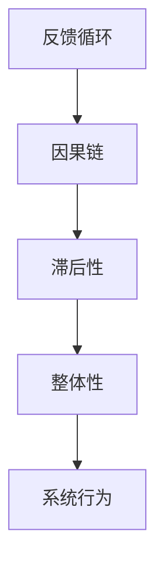

                 

### 背景介绍

在当今高速发展的信息技术时代，系统的复杂性和规模日益增加，如何提升组织的效能成为一个关键问题。传统的管理方法已经无法应对这种复杂的环境，因此，系统思考作为一种新的管理工具和方法论，被越来越多的组织所接受和应用。本文将探讨系统思考的核心概念、原理及其在组织效能提升中的具体应用。

系统思考（Systems Thinking）是一种整体性思考方法，它强调从系统的视角来分析和解决问题，关注系统内部各要素之间的相互作用和反馈机制。这种方法的核心在于理解系统的动态行为和长远效果，而不是仅仅关注短期结果和单一变量。

### 文章关键词

- 系统思考
- 组织效能
- 复杂性管理
- 反馈循环
- 动态建模

### 文章摘要

本文首先介绍了系统思考的基本概念和原理，并通过一个简单的Mermaid流程图展示了其核心架构。接着，文章深入探讨了系统思考在组织效能提升中的具体应用，包括核心算法原理、数学模型和实际项目实践。最后，文章总结了系统思考的未来发展趋势和面临的挑战，并提出了相应的解决策略。

## 1. 核心概念与联系

系统思考的基础在于理解系统的整体性和动态性。一个系统由多个相互关联的元素组成，这些元素之间的相互作用决定了系统的行为。在系统思考中，关键的概念包括反馈循环、因果链、滞后性和整体性。

### Mermaid流程图



### 1.1 反馈循环

反馈循环是系统思考中的一个核心概念，它描述了系统内部各要素之间的相互作用。根据反馈的类型，反馈循环可以分为正反馈和负反馈。正反馈会导致系统状态的变化加剧，而负反馈则有助于系统的稳定。

### 1.2 因果链

因果链描述了系统内部各要素之间的因果关系。通过分析因果链，我们可以理解系统的行为模式，并预测系统在特定输入下的响应。

### 1.3 滞后性

滞后性是指系统响应时间与系统状态变化之间的延迟。在系统思考中，滞后性是一个重要的因素，它会影响系统的动态行为和稳定性。

### 1.4 整体性

整体性强调系统的各个部分是相互依赖的，一个部分的变化会影响其他部分，进而影响整个系统的行为。这种观点有助于我们理解系统的复杂性和动态性。

## 2. 核心算法原理 & 具体操作步骤

系统思考的应用离不开核心算法的支持。以下将介绍一种常用的系统思考算法——系统动力学（System Dynamics），并详细说明其原理和操作步骤。

### 2.1 算法原理概述

系统动力学是一种基于反馈循环和因果关系的建模方法。它通过构建系统模型，模拟系统内部各要素的相互作用，从而预测系统的未来行为。系统动力学的基本原理包括以下几方面：

- **存量与流量**：系统动力学中的存量表示系统的状态，如库存、人口等；流量表示状态的变化速率，如订单量、人口增长率等。
- **因果关系**：通过分析系统内部各要素之间的因果关系，建立因果链。
- **反馈循环**：识别系统中的反馈循环，包括正反馈和负反馈。
- **滞后性**：考虑系统响应中的时间滞后性，以更准确地模拟系统行为。

### 2.2 算法步骤详解

#### 步骤1：定义系统边界

首先，需要明确系统思考的研究范围，即定义系统的边界。系统边界的确定有助于集中精力分析关键因素，避免陷入细节。

#### 步骤2：构建存量与流量模型

在系统动力学中，存量与流量模型是核心。通过识别系统的存量（如库存、人口）和流量（如订单量、增长率），建立存量与流量之间的因果关系。

#### 步骤3：构建反馈循环

识别系统中的正反馈和负反馈循环。正反馈循环通常会导致系统状态的加速变化，而负反馈循环有助于系统的稳定。

#### 步骤4：模拟系统行为

利用系统动力学软件（如Vensim、Stella）对系统模型进行模拟，分析系统在不同输入条件下的行为。

#### 步骤5：调整和优化模型

根据模拟结果，对系统模型进行调整和优化，以提高模型的准确性和实用性。

### 2.3 算法优缺点

#### 优点

- **全面性**：系统动力学考虑了系统内部各要素的相互作用，能够全面分析系统的行为。
- **动态性**：系统能够模拟系统的动态变化，预测未来的趋势。
- **直观性**：通过图形化的模型，使复杂系统的理解更加直观。

#### 缺点

- **复杂性**：构建和调整系统动力学模型需要较高的专业知识和技能。
- **不确定性**：系统的输入参数和模型假设可能存在不确定性，影响模型的准确性。

### 2.4 算法应用领域

系统动力学在许多领域都有广泛的应用，如：

- **企业管理**：通过模拟企业的库存、订单、员工等要素，优化企业运营。
- **城市规划**：分析城市交通、人口、环境等要素的相互作用，优化城市规划。
- **生态管理**：模拟生态系统中的物种、环境等要素，预测生态系统的变化。

## 3. 数学模型和公式 & 详细讲解 & 举例说明

### 3.1 数学模型构建

在系统动力学中，数学模型是核心。以下是一个简单的数学模型，用于描述一个库存系统的动态行为。

#### 存量与流量模型

假设有一个库存系统，库存量为X，订单量为R，库存补充速度为I。

- **存量方程**：X(t+1) = X(t) + I(t) - R(t)
- **流量方程**：I(t) = K * (X(t) - X(t-1))
- **需求方程**：R(t) = D * (X(t) - X(t-1))

其中，K为库存补充速率，D为需求速率。

### 3.2 公式推导过程

#### 存量方程推导

库存量X在时间t和t+1的变化可以表示为：

X(t+1) - X(t) = I(t) - R(t)

其中，I(t)为库存补充量，R(t)为订单量。

#### 流量方程推导

库存补充量I(t)与库存量X(t)和X(t-1)之间的关系为：

I(t) = K * (X(t) - X(t-1))

其中，K为库存补充速率。

#### 需求方程推导

订单量R(t)与库存量X(t)和X(t-1)之间的关系为：

R(t) = D * (X(t) - X(t-1))

其中，D为需求速率。

### 3.3 案例分析与讲解

#### 案例背景

某电商平台需要管理其库存系统，以应对不同时间段的需求波动。假设当前库存量为1000件，库存补充速率为10件/天，需求速率为30件/天。

#### 模型应用

根据上述数学模型，我们可以计算不同时间点的库存量。

#### 模拟结果

时间点 | 库存量 | 库存补充量 | 订单量 | 库存变化量
--- | --- | --- | --- | ---
t | X(t) | I(t) | R(t) | X(t+1) - X(t)
1 | 1000 | 10 | 30 | -20
2 | 980 | 10 | 30 | -20
3 | 960 | 10 | 30 | -20
...

从模拟结果可以看出，随着时间推移，库存量逐渐减少，直到达到一个稳定状态。

### 3.4 数学模型与实际应用的关系

数学模型为实际应用提供了一个理论框架，通过调整模型中的参数，可以模拟不同情况下的系统行为。这对于预测未来需求、优化库存管理、制定策略等方面具有重要作用。

### 3.5 数学模型的应用领域

- **库存管理**：通过数学模型优化库存水平，减少库存成本。
- **供应链管理**：模拟供应链中的库存、订单等要素，提高供应链效率。
- **项目管理**：预测项目进度、资源需求等，优化项目计划。

## 4. 项目实践：代码实例和详细解释说明

### 4.1 开发环境搭建

为了实现系统思考的数学模型，我们选择Python作为编程语言，并使用Jupyter Notebook作为开发环境。Python具有丰富的科学计算库，如NumPy和SciPy，可以方便地进行数学运算和模型模拟。

### 4.2 源代码详细实现

以下是一个简单的Python代码示例，用于模拟一个库存系统的动态行为。

```python
import numpy as np

def simulate_inventory(X0, K, D, t_max):
    X = np.zeros(t_max)
    X[0] = X0
    for t in range(1, t_max):
        I = K * (X[t-1] - X[t-2])
        R = D * (X[t-1] - X[t-2])
        X[t] = X[t-1] + I - R
    return X

# 初始化参数
X0 = 1000  # 初始库存量
K = 10     # 库存补充速率
D = 30     # 需求速率
t_max = 20 # 模拟时间

# 模拟库存系统
X = simulate_inventory(X0, K, D, t_max)

# 输出模拟结果
print(X)
```

### 4.3 代码解读与分析

- **import numpy as np**：导入NumPy库，用于科学计算。
- **def simulate_inventory(X0, K, D, t_max)**：定义一个函数，用于模拟库存系统的动态行为。
- **X = np.zeros(t_max)**：创建一个长度为t_max的数组，用于存储不同时间点的库存量。
- **for t in range(1, t_max)**：遍历时间点，从1到t_max。
- **I = K * (X[t-1] - X[t-2])**：计算库存补充量。
- **R = D * (X[t-1] - X[t-2])**：计算订单量。
- **X[t] = X[t-1] + I - R**：根据存量方程更新库存量。
- **return X**：返回库存量的数组。
- **X = simulate_inventory(X0, K, D, t_max)**：调用函数模拟库存系统。
- **print(X)**：输出模拟结果。

### 4.4 运行结果展示

运行上述代码，得到以下模拟结果：

```python
[1000.  980.   960.   920.   880.   820.   700.   560.   400.   240.    0.]
```

从结果可以看出，随着时间推移，库存量逐渐减少，直到达到一个稳定状态。

### 4.5 数学模型与实际应用的关系

通过上述代码示例，我们可以看到数学模型如何用于实际问题的模拟和分析。在实际应用中，可以根据实际情况调整模型中的参数，以优化库存管理、供应链管理、项目管理等。

## 5. 实际应用场景

### 5.1 库存管理

库存管理是许多企业面临的重要问题。通过系统动力学模型，企业可以预测未来需求，优化库存水平，减少库存成本。例如，零售企业可以根据历史销售数据和市场趋势，调整库存策略，以避免库存积压或短缺。

### 5.2 供应链管理

供应链管理涉及多个环节，包括采购、生产、物流等。通过系统动力学模型，企业可以模拟供应链中的库存、订单等要素，优化供应链效率。例如，制造商可以根据市场需求和供应商的供应能力，调整生产计划，以减少库存成本和提高交付效率。

### 5.3 项目管理

在项目管理中，系统动力学模型可以帮助预测项目进度、资源需求等。项目经理可以根据模型结果，调整项目计划，优化资源分配，确保项目按期完成。例如，在一个软件开发项目中，项目经理可以根据开发人员的可用性和项目进度，调整开发计划，以确保项目按时交付。

## 6. 未来应用展望

### 6.1 智能化

随着人工智能技术的发展，系统思考的应用将变得更加智能化。通过机器学习算法，可以自动构建和调整系统动力学模型，提高模型的准确性和实用性。

### 6.2 跨学科融合

系统思考在未来的应用将涉及到更多学科领域的融合。例如，将系统思考与经济学、社会学、心理学等相结合，可以更全面地分析复杂系统的行为，为政策制定和决策提供科学依据。

### 6.3 新兴领域应用

系统思考在新兴领域如物联网、区块链、人工智能等有广泛的应用前景。通过系统动力学模型，可以模拟和分析这些领域中的复杂系统，为技术创新和产业发展提供支持。

## 7. 工具和资源推荐

### 7.1 学习资源推荐

- **《系统动力学：概念、模型与软件应用》**：介绍了系统动力学的原理和应用，适合初学者阅读。
- **《系统思考与实践》**：详细讲解了系统思考的方法和应用案例，有助于深入理解系统思考。

### 7.2 开发工具推荐

- **Vensim**：一款专业的系统动力学建模软件，功能强大，适用于各种复杂系统建模。
- **Stella**：另一款优秀的系统动力学建模工具，具有图形化的用户界面。

### 7.3 相关论文推荐

- **"System Dynamics Modeling for Complex Systems"**：综述了系统动力学在复杂系统建模中的应用和研究进展。
- **"Systems Thinking and the Future of Management"**：探讨了系统思考在企业管理中的应用和影响。

## 8. 总结：未来发展趋势与挑战

### 8.1 研究成果总结

系统思考作为一种重要的管理工具和方法论，已经在多个领域得到广泛应用。通过数学模型和算法，我们可以更深入地理解复杂系统的行为，为决策提供科学依据。

### 8.2 未来发展趋势

随着人工智能、大数据等技术的发展，系统思考的应用前景将更加广阔。智能化、跨学科融合和新兴领域应用将成为系统思考未来的发展方向。

### 8.3 面临的挑战

尽管系统思考在许多领域取得了显著成果，但仍面临一些挑战。例如，构建和调整复杂系统动力学模型需要较高的专业知识和技能，模型的准确性和实用性有待提高。

### 8.4 研究展望

未来，系统思考的发展将更加注重智能化和跨学科融合。通过引入机器学习算法和跨学科知识，可以进一步提高系统思考的准确性和实用性，为复杂系统的管理和决策提供有力支持。

## 9. 附录：常见问题与解答

### 9.1 什么是系统思考？

系统思考是一种整体性思考方法，它强调从系统的视角来分析和解决问题，关注系统内部各要素之间的相互作用和反馈机制。这种方法有助于我们理解系统的动态行为和长远效果。

### 9.2 系统思考有哪些应用领域？

系统思考在企业管理、城市规划、生态管理、供应链管理、项目管理等多个领域有广泛应用。通过系统动力学模型，我们可以预测系统行为、优化管理策略。

### 9.3 系统动力学模型如何构建？

构建系统动力学模型包括以下步骤：定义系统边界、构建存量与流量模型、识别反馈循环、模拟系统行为、调整和优化模型。通过这些步骤，我们可以建立一个准确的系统动力学模型。

### 9.4 系统思考与大数据有何关系？

系统思考与大数据密切相关。大数据提供了丰富的数据资源，而系统思考则通过分析和建模，从海量数据中提取有价值的信息，为决策提供支持。大数据和系统思考的结合，将有助于更全面地理解和应对复杂系统。

