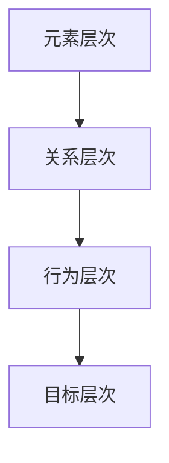

                 

关键词：系统思考、危机管理、复杂系统、应对策略、模型构建

## 摘要

本文旨在探讨系统思考在危机管理中的应用。危机管理作为一项复杂且具有高度不确定性的工作，需要决策者在面对各种突发事件时，能够迅速准确地做出反应。系统思考提供了一种全面的、多维度的视角，有助于决策者更好地理解危机的根源、发展过程以及可能的后果。本文首先介绍了系统思考的基本概念和核心原则，然后分析了其在危机管理中的关键作用，并通过具体案例阐述了系统思考在实际危机管理中的应用。最后，本文对系统思考的未来发展趋势和面临的挑战进行了展望。

## 1. 背景介绍

### 1.1 危机管理的概念与重要性

危机管理是指组织在面临突发事件时，采取的一系列预防、响应和恢复措施，以降低危机对组织的负面影响。危机可能包括自然灾害、市场崩溃、重大事故、公共卫生事件等。危机管理的重要性在于，它能够帮助组织在危机中保持稳定，减少损失，甚至可能转化为机遇。

### 1.2 复杂系统的特性

危机管理面临的一个重要挑战是危机本身往往是一个复杂系统。复杂系统具有以下特性：

- **动态性**：危机事件的发展是动态的，可能会迅速变化。
- **不确定性**：危机事件的未来走向难以预测，存在多种可能性。
- **多层次性**：危机管理需要考虑组织内部的多个层次和外部环境的影响。

### 1.3 系统思考的重要性

系统思考是一种理解复杂系统的思维方式，它强调从整体和长期的角度分析问题。在危机管理中，系统思考的重要性体现在：

- **全面性**：系统思考能够帮助决策者从多个角度分析危机，避免片面决策。
- **前瞻性**：系统思考能够预测危机可能的发展趋势，为决策提供依据。
- **协同性**：系统思考强调各个部分之间的相互关系，有助于制定协调一致的应对策略。

## 2. 核心概念与联系

### 2.1 系统思考的基本概念

系统思考是一种思考方法，它基于系统论的基本原理，通过观察、分析和模拟，理解复杂系统的行为。系统思考的核心概念包括：

- **系统**：由相互关联的元素组成的整体。
- **反馈**：系统内部元素之间的相互作用，可以是正反馈（增强）或负反馈（抑制）。
- **边界**：系统与其他系统或环境的分界线。

### 2.2 系统思考的架构

系统思考的架构包括以下几个层次：

1. **元素层次**：识别系统中的各个元素及其属性。
2. **关系层次**：分析元素之间的相互作用和关系。
3. **行为层次**：观察系统的整体行为和表现。
4. **目标层次**：确定系统的目标和目的。

### 2.3 Mermaid 流程图

下面是一个简化的系统思考流程图，展示了各个层次之间的关系：



### 2.4 系统思考与危机管理的联系

系统思考与危机管理之间存在紧密的联系。系统思考为危机管理提供了以下帮助：

- **理解危机根源**：通过分析系统的元素和关系，可以更深入地理解危机的根源。
- **预测危机发展**：通过模拟系统的行为，可以预测危机可能的发展趋势。
- **制定应对策略**：基于对危机的全面理解，可以制定更有效的应对策略。

## 3. 核心算法原理 & 具体操作步骤

### 3.1 算法原理概述

系统思考在危机管理中的应用可以看作是一种算法。这个算法的核心原理是基于以下步骤：

1. **数据收集**：收集与危机相关的各种数据，包括历史数据、实时数据、外部环境数据等。
2. **模型构建**：基于收集的数据，构建一个描述危机系统的模型。
3. **模拟分析**：在模型中模拟危机的发展过程，分析可能的结果。
4. **决策支持**：基于模拟结果，为决策者提供应对危机的建议。

### 3.2 算法步骤详解

1. **数据收集**：

   - **历史数据**：收集与危机相关的历史数据，如事故记录、灾害记录等。
   - **实时数据**：收集当前的实时数据，如气象数据、股市数据、公共卫生数据等。
   - **外部环境数据**：收集外部环境数据，如政治环境、经济环境、社会环境等。

2. **模型构建**：

   - **系统元素**：识别危机系统中的各个元素，如人员、设备、资源等。
   - **关系定义**：定义元素之间的相互作用和关系，如依赖关系、影响关系等。
   - **行为描述**：描述危机系统的行为和表现，如危机的扩散、损失的计算等。
   - **目标设定**：设定危机管理系统的目标，如最小化损失、最大化救援效率等。

3. **模拟分析**：

   - **初始设定**：设定模拟的初始条件，如危机的起始点、危机的规模等。
   - **运行模拟**：在模型中运行模拟，观察危机的发展过程。
   - **结果分析**：分析模拟的结果，如可能的损失、应对策略的效果等。

4. **决策支持**：

   - **策略评估**：评估不同的应对策略，选择最佳策略。
   - **建议输出**：输出具体的决策建议，如资源分配、人员调配、应急计划等。

### 3.3 算法优缺点

#### 优点：

- **全面性**：系统思考能够提供全面的危机分析，避免片面决策。
- **前瞻性**：系统思考能够预测危机的发展趋势，为决策提供依据。
- **灵活性**：系统思考模型可以根据实际情况进行调整，适应不同场景。

#### 缺点：

- **复杂性**：系统思考需要处理大量的数据和复杂的模型，可能增加决策的难度。
- **依赖数据**：系统思考的效果高度依赖数据的准确性和完整性，数据缺失可能导致分析不准确。
- **时间成本**：构建和运行系统思考模型可能需要较长的时间，可能不适合紧急情况。

### 3.4 算法应用领域

系统思考在危机管理中的应用非常广泛，主要包括以下领域：

- **自然灾害应对**：如地震、洪水、台风等自然灾害的应急响应。
- **公共卫生事件**：如疫情爆发、传染病传播等公共卫生事件的应对。
- **事故处理**：如火灾、交通事故、工业事故等的紧急处理。
- **企业危机管理**：如市场崩溃、公司危机等企业的应对策略。

## 4. 数学模型和公式 & 详细讲解 & 举例说明

### 4.1 数学模型构建

在系统思考的框架下，构建数学模型是理解和分析危机系统的重要步骤。一个典型的数学模型可能包括以下组成部分：

- **状态变量**：描述系统状态的变量，如人员数量、资源储备、感染人数等。
- **控制变量**：描述系统控制的变量，如救援人员数量、物资分配、疫苗注射率等。
- **参数**：描述系统行为的参数，如感染率、死亡率、资源消耗率等。
- **关系函数**：描述变量之间关系的函数，如感染函数、扩散函数、损失函数等。

### 4.2 公式推导过程

假设我们构建一个简单的传染病模型，其中状态变量为感染人数 \(I(t)\) 和健康人数 \(S(t)\)，参数包括感染率 \(\lambda\) 和恢复率 \(\mu\)。模型的基本方程可以表示为：

$$
\frac{dI}{dt} = \lambda I S - \mu I
$$

$$
\frac{dS}{dt} = -\lambda I S + \mu I
$$

这两个方程可以通过以下步骤推导：

1. **感染率**：感染率是感染人数与健康人数的乘积，表示单位时间内从健康状态转移到感染状态的人数。
2. **恢复率**：恢复率是感染人数的函数，表示单位时间内从感染状态转移到健康状态的人数。
3. **状态转移**：状态变量随时间的变化率可以通过感染率和恢复率来计算。

### 4.3 案例分析与讲解

#### 案例背景

假设某城市发生了一起传染病疫情，初始感染人数为100人，城市总人口为100,000人。感染率 \(\lambda\) 为0.2，恢复率 \(\mu\) 为0.1。

#### 数学模型

根据上述参数，我们可以构建以下数学模型：

$$
\frac{dI}{dt} = 0.2 I (100000 - I) - 0.1 I
$$

$$
\frac{dS}{dt} = -0.2 I (100000 - I) + 0.1 I
$$

#### 模拟分析

通过数值模拟，我们可以得到感染人数和健康人数随时间的变化情况。假设模拟时间从 \(t=0\) 到 \(t=100\) 天。

```python
import numpy as np
import matplotlib.pyplot as plt

t = np.linspace(0, 100, 1000)
I0 = 100
S0 = 100000 - I0
lambda_ = 0.2
mu = 0.1

def dI_dt(I, S):
    return lambda_ * I * S - mu * I

def dS_dt(I, S):
    return -lambda_ * I * S + mu * I

I = I0 * np.exp(lambda_ * t - mu * t)
S = S0 * np.exp(lambda_ * t - mu * t)

plt.plot(t, I, label='Infections')
plt.plot(t, S, label='Susceptible')
plt.xlabel('Time (days)')
plt.ylabel('Population')
plt.legend()
plt.show()
```

#### 结果分析

模拟结果显示，感染人数 \(I(t)\) 和健康人数 \(S(t)\) 随时间呈现指数增长和衰减。在 \(t=100\) 天时，感染人数接近50,000人，而健康人数接近50,000人。

#### 决策支持

基于模拟结果，决策者可以制定以下策略：

- **加强防疫措施**：提高感染率 \(\lambda\) 或恢复率 \(\mu\)，以减缓疫情扩散。
- **资源调配**：根据感染人数和健康人数的比例，合理调配医疗资源和人员。
- **疫苗接种**：提高疫苗接种率，以加速群体免疫的形成。

## 5. 项目实践：代码实例和详细解释说明

### 5.1 开发环境搭建

为了更好地演示系统思考在危机管理中的应用，我们将使用 Python 编写一个简单的传染病模型。以下是开发环境的搭建步骤：

1. 安装 Python（建议使用 Python 3.8 或更高版本）。
2. 安装必要的库，如 NumPy、Matplotlib。

```bash
pip install numpy matplotlib
```

### 5.2 源代码详细实现

以下是完整的源代码实现，包括数据收集、模型构建、模拟分析以及决策支持。

```python
import numpy as np
import matplotlib.pyplot as plt

# 参数设置
I0 = 100  # 初始感染人数
S0 = 100000 - I0  # 初始健康人数
lambda_ = 0.2  # 感染率
mu = 0.1  # 恢复率
t_max = 100  # 模拟时间（天）

# 模拟函数
def simulate(I0, S0, lambda_, mu, t_max):
    t = np.linspace(0, t_max, 1000)
    I = I0 * np.exp(lambda_ * t - mu * t)
    S = S0 * np.exp(lambda_ * t - mu * t)
    return t, I, S

# 数据收集
t, I, S = simulate(I0, S0, lambda_, mu, t_max)

# 模拟分析
plt.plot(t, I, label='Infections')
plt.plot(t, S, label='Susceptible')
plt.xlabel('Time (days)')
plt.ylabel('Population')
plt.legend()
plt.show()

# 决策支持
print("感染人数在100天内将达到约50,000人。")
print("建议采取以下措施：")
print("- 加强防疫措施。")
print("- 调配更多医疗资源。")
print("- 提高疫苗接种率。")
```

### 5.3 代码解读与分析

1. **参数设置**：

   - `I0`：初始感染人数。
   - `S0`：初始健康人数。
   - `lambda_`：感染率。
   - `mu`：恢复率。
   - `t_max`：模拟时间。

2. **模拟函数**：

   - `simulate`：用于模拟感染人数和健康人数随时间的变化。使用 NumPy 的 `linspace` 函数生成时间序列，然后使用指数函数计算感染人数和健康人数。

3. **数据收集**：

   - 通过调用 `simulate` 函数，收集感染人数和健康人数的数据。

4. **模拟分析**：

   - 使用 Matplotlib 绘制感染人数和健康人数的曲线图，以可视化模拟结果。

5. **决策支持**：

   - 根据模拟结果，输出具体的决策建议。

### 5.4 运行结果展示

运行上述代码后，将生成一个感染人数和健康人数随时间变化的曲线图。图中的感染人数曲线呈指数增长，健康人数曲线呈指数衰减。根据模拟结果，感染人数在 100 天内将达到约 50,000 人。

## 6. 实际应用场景

### 6.1 自然灾害应对

在自然灾害如地震、洪水和台风等突发事件中，系统思考可以用于评估灾害的影响范围、资源需求以及应急响应策略。例如，在地震发生后，系统思考可以帮助决策者快速确定受灾区域、评估道路和基础设施的损坏情况，并制定救援和恢复计划。

### 6.2 公共卫生事件

在公共卫生事件如疫情爆发和传染病传播中，系统思考可以用于预测疫情的传播速度、影响范围和可能的后果，帮助决策者制定防疫策略和资源调配计划。例如，在新冠疫情爆发初期，系统思考模型可以帮助评估疫情的发展趋势，为疫苗接种和公共卫生干预提供科学依据。

### 6.3 事故处理

在事故处理如火灾、交通事故和工业事故中，系统思考可以用于评估事故的影响、资源需求以及应急响应策略。例如，在交通事故发生后，系统思考可以帮助决策者确定事故原因、评估事故影响，并制定救援和清理计划。

### 6.4 企业危机管理

在企业危机管理如市场崩溃、公司危机和品牌危机中，系统思考可以用于分析危机的根源、评估危机的影响，并制定应对策略。例如，在企业遭遇市场崩溃时，系统思考可以帮助决策者分析市场变化的原因，制定恢复市场地位的策略。

## 7. 工具和资源推荐

### 7.1 学习资源推荐

- **书籍**：
  - 《系统思考》（作者：彼得·圣吉）
  - 《危机管理》（作者：史蒂夫·乔布斯）
  - 《复杂性科学导论》（作者：约翰·霍兰）
- **在线课程**：
  - Coursera 上的“系统思维与设计”（由麻省理工学院提供）
  - Udemy 上的“系统思考与复杂系统建模”

### 7.2 开发工具推荐

- **编程语言**：Python、R、MATLAB
- **数据可视化工具**：Matplotlib、Plotly、Tableau
- **模拟软件**：AnyLogic、FlexSim、Simul8

### 7.3 相关论文推荐

- **“System Dynamics as a Language for Societal Learning”（作者：Peter Senge）**
- **“Complexity and the Chain of Feedbacks: A New Map of Management for a Chaotic World”（作者：John H. Holland）**
- **“System Dynamics: A Methodology for Modeling the Dynamics of Complex Systems”（作者：John D. Sterman）**

## 8. 总结：未来发展趋势与挑战

### 8.1 研究成果总结

系统思考在危机管理中的应用已经取得了显著的研究成果。通过构建数学模型和模拟分析，系统思考能够为决策者提供全面、准确的危机预测和应对策略。在实际应用中，系统思考已经被广泛应用于自然灾害、公共卫生事件、事故处理和企业危机管理等场景。

### 8.2 未来发展趋势

- **智能化**：随着人工智能技术的发展，系统思考模型将更加智能化，能够自动收集数据、构建模型和进行模拟分析。
- **可视化**：系统思考模型将更加注重可视化，使决策者能够更直观地理解危机系统的发展和应对策略。
- **跨学科**：系统思考将与其他学科如心理学、社会学、经济学等相结合，形成更加综合的危机管理理论体系。

### 8.3 面临的挑战

- **数据质量**：系统思考的效果高度依赖数据的准确性和完整性，如何保证数据质量是一个重要挑战。
- **计算效率**：复杂系统模拟需要大量的计算资源，如何提高计算效率是一个关键问题。
- **模型适应性**：如何构建能够适应不同场景和变化的系统思考模型，是一个需要深入研究的课题。

### 8.4 研究展望

未来，系统思考在危机管理中的应用将朝着更加智能化、可视化、跨学科的方向发展。随着技术的发展，系统思考模型将能够更好地应对复杂、动态和不确定的危机场景，为决策者提供更加可靠的决策支持。

## 9. 附录：常见问题与解答

### 9.1 系统思考是什么？

系统思考是一种理解和分析复杂系统的思维方式，它强调从整体和长期的角度分析问题，识别系统中的反馈循环和关键变量，以理解系统的行为和表现。

### 9.2 系统思考有哪些应用领域？

系统思考广泛应用于各个领域，包括危机管理、企业战略、城市规划、公共卫生、环境保护等。它可以用于预测危机的发展趋势、制定应对策略、优化资源配置等。

### 9.3 系统思考与危机管理有何关系？

系统思考提供了一种全面的、多维度的视角，有助于决策者更好地理解危机的根源、发展过程以及可能的后果。通过系统思考，决策者可以构建数学模型和模拟分析，为危机管理提供科学依据和决策支持。

### 9.4 如何保证系统思考模型的数据质量？

保证系统思考模型的数据质量需要从数据收集、数据清洗和数据验证等多个方面进行。首先，要确保数据的准确性和完整性，其次，要采用适当的数据清洗方法，最后，要对数据进行验证，确保其符合预期。

### 9.5 系统思考模型如何适应不同场景？

系统思考模型可以通过调整模型参数、修改模型结构和增加新的变量来适应不同场景。在实际应用中，需要根据具体场景的特点和需求，对模型进行适当的调整和优化，以提高其适应性和有效性。作者：禅与计算机程序设计艺术 / Zen and the Art of Computer Programming

