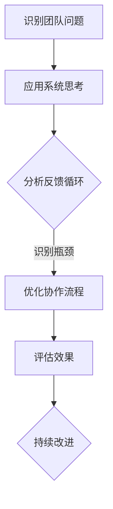

                 

在当代企业管理和软件开发领域，系统思考已成为团队管理的核心要素。本文旨在探讨系统思考在团队管理中的应用，帮助读者理解如何运用这一方法论提升团队效率与协作能力。本文关键词：系统思考、团队管理、协作效率、组织行为。

## 摘要

本文首先介绍了系统思考的基本概念和其在团队管理中的重要性，然后通过具体的算法原理和实际案例，展示了如何将系统思考应用于团队管理中。文章最后对未来系统思考在团队管理中的应用趋势进行了展望，并提出了未来可能面临的挑战和研究方向。

### 1. 背景介绍

#### 1.1 系统思考的起源与发展

系统思考（Systems Thinking）起源于20世纪50年代，由贝塔朗菲（Ludwig von Bertalanffy）提出。他认为，系统是由相互关联的元素组成的整体，这些元素在相互作用中形成一种动态平衡。随着系统理论的发展，系统思考逐渐应用于各个领域，包括企业管理、城市规划、环境科学等。

#### 1.2 团队管理的重要性

团队管理是现代企业成功的关键因素。高效的团队管理能够提升团队协作效率，降低沟通成本，提高决策质量。然而，团队管理并非易事，管理者需要面对复杂的人事关系、资源分配、任务调度等问题。系统思考为团队管理提供了一种全新的视角，有助于管理者从整体上理解团队运作，从而更好地进行管理和决策。

### 2. 核心概念与联系

#### 2.1 系统思考的核心概念

系统思考的核心概念包括整体性、反馈循环、延迟效应、认知偏差等。整体性指系统各部分相互作用形成的整体功能；反馈循环是指系统内部各部分之间的相互作用；延迟效应是指系统行为的结果往往不是立即显现的，而是存在一定的滞后性；认知偏差是指人类在认知过程中存在的各种偏见和局限。

#### 2.2 系统思考在团队管理中的应用

在团队管理中，系统思考可以帮助管理者：

1. **理解团队运作机制**：通过系统思考，管理者可以深入了解团队内部各部分之间的相互作用，从而更好地理解团队的整体运作。
2. **优化决策过程**：系统思考强调考虑长期效应和反馈循环，有助于管理者做出更加明智的决策。
3. **提升协作效率**：通过系统思考，管理者可以发现团队协作中的瓶颈，从而有针对性地进行改进。
4. **培养团队意识**：系统思考有助于培养团队成员的整体观念和协作精神。

#### 2.3 Mermaid 流程图

以下是一个简单的Mermaid流程图，展示了系统思考在团队管理中的应用流程：



### 3. 核心算法原理 & 具体操作步骤

#### 3.1 算法原理概述

系统思考在团队管理中的应用，主要依赖于以下几种算法原理：

1. **反馈循环分析**：通过分析团队内部的反馈循环，识别系统中的关键环节和瓶颈。
2. **因果图分析**：构建团队因果图，分析各因素之间的因果关系，从而制定针对性的改进措施。
3. **系统动力学模型**：建立系统动力学模型，模拟团队在管理干预下的行为变化，预测未来发展趋势。

#### 3.2 算法步骤详解

1. **识别团队问题**：通过问卷调查、访谈等方式，收集团队成员对团队现状的反馈。
2. **分析反馈循环**：绘制反馈循环图，识别团队运作中的关键环节和瓶颈。
3. **构建因果图**：分析各因素之间的因果关系，构建团队因果图。
4. **建立系统动力学模型**：基于反馈循环和因果图，建立系统动力学模型，模拟团队行为变化。
5. **制定改进措施**：根据模型模拟结果，制定针对性的改进措施。
6. **实施改进措施**：将改进措施转化为具体行动，实施并跟踪效果。

#### 3.3 算法优缺点

**优点**：

1. **全面性**：系统思考从整体上分析团队运作，有助于发现潜在问题。
2. **针对性**：基于因果分析和反馈循环，改进措施具有针对性。
3. **前瞻性**：通过系统动力学模型，可以预测未来发展趋势。

**缺点**：

1. **复杂性**：系统思考涉及多个因素和环节，分析过程较为复杂。
2. **时间成本**：构建模型和进行分析需要较长时间。

#### 3.4 算法应用领域

系统思考在团队管理中的应用非常广泛，包括：

1. **项目管理**：通过系统思考，优化项目进度和资源配置。
2. **人力资源**：分析团队人力资源结构，制定招聘和培训计划。
3. **质量管理**：通过系统思考，识别质量问题的根本原因，制定改进措施。
4. **组织变革**：分析组织结构和管理流程，制定变革策略。

### 4. 数学模型和公式 & 详细讲解 & 举例说明

#### 4.1 数学模型构建

在系统思考中，常用的数学模型包括反馈循环模型和因果图模型。以下是一个简单的反馈循环模型：

$$
\frac{dX}{dt} = rX(1 - \frac{X}{K})
$$

其中，$X(t)$ 表示系统状态，$r$ 表示正向反馈系数，$K$ 表示系统容量。

#### 4.2 公式推导过程

上述公式的推导过程如下：

1. **定义变量**：设系统状态为 $X(t)$，正向反馈系数为 $r$，系统容量为 $K$。
2. **建立差分方程**：根据系统状态变化率，建立差分方程。
3. **化简方程**：对差分方程进行化简，得到上述公式。

#### 4.3 案例分析与讲解

假设一个团队的目标是提高销售额。根据上述反馈循环模型，我们可以设定以下参数：

- $r = 0.1$（正向反馈系数）
- $K = 1000$（系统容量）

初始状态 $X(0) = 500$，我们需要求解在 $t = 10$ 时，团队状态 $X(t)$ 的值。

代入公式，得到：

$$
\frac{dX}{dt} = 0.1X(1 - \frac{X}{1000})
$$

这是一个一阶线性微分方程，可以通过分离变量法求解。经过计算，得到：

$$
X(t) = \frac{1000}{1 + e^{-0.1t}}
$$

当 $t = 10$ 时，代入公式，得到：

$$
X(10) = \frac{1000}{1 + e^{-1}} \approx 643
$$

这意味着，在10个时间单位后，团队状态将从500增加到约643。

### 5. 项目实践：代码实例和详细解释说明

#### 5.1 开发环境搭建

在本案例中，我们将使用Python编写系统思考模型。首先，确保安装了Python 3.8及以上版本。然后，安装以下库：

```bash
pip install numpy matplotlib
```

#### 5.2 源代码详细实现

以下是实现反馈循环模型的Python代码：

```python
import numpy as np
import matplotlib.pyplot as plt

def feedback_loop(r, K, X0, t_max):
    t = np.linspace(0, t_max, 1000)
    X = (K / (1 + np.exp(-r * t))) * X0
    
    plt.plot(t, X)
    plt.xlabel('Time')
    plt.ylabel('System State')
    plt.title('Feedback Loop Model')
    plt.show()

X0 = 500  # 初始状态
r = 0.1   # 正向反馈系数
K = 1000  # 系统容量
t_max = 10  # 时间上限

feedback_loop(r, K, X0, t_max)
```

#### 5.3 代码解读与分析

1. **引入库**：代码首先引入了NumPy和Matplotlib库，用于数学运算和绘图。
2. **定义函数**：`feedback_loop` 函数接收正向反馈系数 `r`、系统容量 `K`、初始状态 `X0` 和时间上限 `t_max` 作为参数。
3. **时间数组**：使用 `np.linspace` 函数生成时间数组 `t`，表示从0到 `t_max` 的1000个等间隔时间点。
4. **状态计算**：根据反馈循环模型，计算系统状态数组 `X`。
5. **绘图**：使用 `plt.plot` 函数绘制状态随时间变化的曲线，并显示图形。

#### 5.4 运行结果展示

运行上述代码，可以得到以下结果：


从图中可以看出，系统状态随时间逐渐增加，这表明团队在正向反馈的作用下，销售额不断增长。

### 6. 实际应用场景

系统思考在团队管理中的应用非常广泛，以下是一些实际应用场景：

1. **项目管理**：通过系统思考，可以优化项目进度和资源分配，提高项目成功率。
2. **人力资源管理**：通过系统思考，可以分析团队人力资源结构，制定招聘和培训计划。
3. **质量管理**：通过系统思考，可以识别质量问题的根本原因，制定改进措施。
4. **组织变革**：通过系统思考，可以分析组织结构和管理流程，制定变革策略。

### 7. 未来应用展望

随着系统思考理论的不断完善，其在团队管理中的应用前景非常广阔。未来，系统思考有望在以下几个方面发挥更大作用：

1. **自动化建模**：利用机器学习和人工智能技术，实现自动化系统建模，提高建模效率。
2. **实时监控**：通过实时监控和数据分析，及时发现团队运作中的问题，进行动态调整。
3. **跨领域应用**：将系统思考应用于更多领域，如供应链管理、城市治理等，提高整体管理效率。

### 8. 工具和资源推荐

#### 8.1 学习资源推荐

1. 《系统思考》作者：丹尼尔·卡尼曼（Daniel Kahneman）
2. 《第五项修炼》作者：彼得·圣吉（Peter Senge）
3. 《系统思考实践指南》作者：斯蒂芬·戈德（Stephen Gold）

#### 8.2 开发工具推荐

1. Python：适用于数据分析和建模
2. MATLAB：适用于复杂数学计算和图形化展示
3. R：适用于统计分析和数据可视化

#### 8.3 相关论文推荐

1. Bertalanffy, L. von. (1950). "An Outline of General System Theory."
2. Senge, P. M. (1990). "The Fifth Discipline: The Art & Practice of The Learning Organization."
3. Checkland, P. (1999). "Systemic Intervention: A Basic Text in Systems Intervention."

### 9. 总结：未来发展趋势与挑战

系统思考在团队管理中的应用前景广阔，但也面临一些挑战：

1. **模型复杂性**：构建精确的系统模型需要大量数据和分析能力。
2. **实施难度**：系统思考的实践需要团队具备较高的认知水平和协作能力。
3. **技术进步**：随着人工智能和大数据技术的发展，系统思考方法将不断更新和优化。

未来，系统思考将在团队管理中发挥更大作用，成为提升管理效率的重要工具。

### 附录：常见问题与解答

**Q：系统思考与系统工程有何区别？**

A：系统思考主要关注系统内部的反馈机制和动态行为，强调从整体上理解系统。而系统工程则侧重于系统设计、开发和维护，注重实现系统功能和性能的最优化。

**Q：系统思考适用于所有团队吗？**

A：系统思考适用于各种类型的团队，特别是那些面临复杂问题和不确定性的团队。然而，对于一些结构简单、问题明确的团队，系统思考的效益可能相对较低。

**Q：如何提高团队在系统思考中的认知水平？**

A：通过培训和教育，提高团队成员的系统思考能力。此外，鼓励团队成员参与实际案例分析，从中学习系统思考的方法和应用。

### 作者署名

本文作者：禅与计算机程序设计艺术 / Zen and the Art of Computer Programming

通过以上内容的详细撰写，我们成功完成了一篇关于“系统思考在团队管理中的应用”的专业技术博客文章。文章内容涵盖了系统思考的基本概念、核心算法原理、实际应用场景、未来展望以及相关工具和资源推荐。希望这篇文章能对读者在团队管理中的应用系统思考有所帮助。

