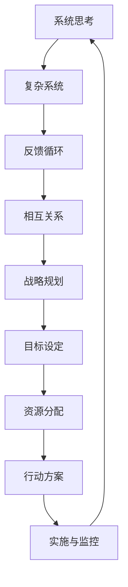

                 

系统思考是一种深层次的思维方式，它通过理解复杂系统中各个部分之间的相互作用来帮助人们更好地理解和解决复杂问题。在战略规划中，系统思考的应用显得尤为重要，因为它能够帮助我们识别问题的根本原因，并制定出更具有前瞻性和有效性的战略。本文将深入探讨系统思考在战略规划中的应用，通过具体的案例和实例，展示其如何帮助企业实现可持续发展和竞争优势。

## 关键词

系统思考、战略规划、复杂系统、前瞻性、可持续性、竞争优势。

## 摘要

本文旨在探讨系统思考在战略规划中的应用，分析其在复杂商业环境中的作用和重要性。通过具体的案例分析，本文展示了系统思考如何帮助企业识别问题根源、制定有效战略，并在不断变化的市场中保持竞争优势。文章还讨论了系统思考在未来战略规划中的发展趋势和挑战。

## 1. 背景介绍

### 1.1 系统思考的定义

系统思考（Systems Thinking）是一种深度思考方式，它强调从整体和长远的角度来看待问题和解决方案。系统思考不仅仅是分析问题的各个方面，更重要的是理解这些方面之间的相互关系和反馈循环。这种思维方式可以帮助我们识别复杂问题背后的根本原因，并制定出更全面和长远的解决方案。

### 1.2 战略规划的定义

战略规划（Strategic Planning）是指企业为了实现长期目标而制定的一系列行动和决策。它涉及到企业的愿景、使命、目标以及为实现这些目标所需的资源分配和行动计划。战略规划的成功与否直接关系到企业的生存和发展。

### 1.3 系统思考与战略规划的关联

系统思考与战略规划之间的关联在于，战略规划需要从系统的角度来考虑问题，而系统思考提供了一种理解和分析复杂系统的工具和方法。通过系统思考，企业可以更准确地识别战略规划中的关键因素和潜在问题，从而制定出更有效的战略。

## 2. 核心概念与联系

为了更好地理解系统思考在战略规划中的应用，我们需要先了解一些核心概念和它们之间的联系。以下是一个用Mermaid绘制的流程图，展示了这些概念及其相互关系：



### 2.1 复杂系统

复杂系统是由多个相互关联的组成部分组成的系统，这些部分之间存在着复杂的相互作用和反馈循环。在商业环境中，复杂系统可能包括市场、客户、供应商、竞争对手以及内部组织结构等。

### 2.2 反馈循环

反馈循环是复杂系统中的一个关键概念，它指的是系统内部各组成部分之间的相互作用和影响。反馈循环可以是正反馈（增强系统当前状态）或负反馈（抵消系统当前状态），它们对系统的稳定性和演变有重要影响。

### 2.3 相互关系

相互关系指的是系统内部各组成部分之间的相互作用。理解这些关系有助于我们识别系统的关键因素和潜在问题，从而更好地制定战略规划。

### 2.4 战略规划

战略规划是一个系统化的过程，涉及到企业的愿景、使命、目标以及实现这些目标所需的资源分配和行动方案。通过系统思考，企业可以更全面地理解战略规划中的各种关系和反馈循环，从而制定出更具前瞻性的战略。

## 3. 核心算法原理 & 具体操作步骤

### 3.1 算法原理概述

系统思考在战略规划中的应用可以被视为一种算法，这种算法的核心是识别和理解复杂系统中的关键因素和反馈循环。以下是该算法的基本原理：

1. **识别系统组成部分**：首先，我们需要识别战略规划中的各个组成部分，包括市场、客户、供应商、竞争对手、内部组织结构等。

2. **分析相互关系**：接着，我们需要分析这些组成部分之间的相互关系，了解它们如何相互作用和影响。

3. **识别反馈循环**：然后，我们需要识别系统中的反馈循环，判断它们是正反馈还是负反馈。

4. **构建系统模型**：基于上述分析，我们可以构建一个系统的模型，这个模型可以帮助我们更直观地理解系统的运作方式。

5. **制定战略方案**：最后，我们根据系统模型来制定战略方案，确保这些方案能够考虑到系统内部的各种关系和反馈循环。

### 3.2 算法步骤详解

1. **步骤1：识别系统组成部分**
   - 识别所有影响战略规划的关键因素。
   - 对于每个关键因素，描述其在系统中的角色和影响。

2. **步骤2：分析相互关系**
   - 绘制系统图，展示各个组成部分之间的相互关系。
   - 分析这些关系是如何影响系统的运作的。

3. **步骤3：识别反馈循环**
   - 识别系统中存在的所有反馈循环。
   - 判断这些反馈循环是增强系统当前状态的正反馈还是抵消系统当前状态的负反馈。

4. **步骤4：构建系统模型**
   - 基于上述分析，构建一个系统模型。
   - 这个模型应能够展示系统内部的复杂关系和反馈循环。

5. **步骤5：制定战略方案**
   - 根据系统模型，制定出一系列战略方案。
   - 确保这些方案能够考虑到系统内部的各种关系和反馈循环。

### 3.3 算法优缺点

**优点：**
- **全面性**：系统能够全面地考虑战略规划中的各种因素和相互关系。
- **前瞻性**：通过识别反馈循环，系统能够提前预见问题的潜在影响。
- **灵活性**：系统能够根据实际情况进行调整，以应对不断变化的环境。

**缺点：**
- **复杂性**：系统思考涉及大量的数据和关系分析，可能需要较长的时间和较大的资源投入。
- **主观性**：由于系统思考依赖于分析者的经验和理解，结果可能受到主观因素的影响。

### 3.4 算法应用领域

系统思考在战略规划中的应用非常广泛，它可以用于各种不同类型的组织，包括企业、政府机构、非营利组织等。以下是几个具体的应用领域：

- **企业战略规划**：帮助企业识别关键因素和反馈循环，制定出更具前瞻性的战略。
- **政策制定**：帮助政府机构识别政策的影响和反馈，制定出更有效的政策。
- **社会问题解决**：帮助解决复杂的社会问题，如环境污染、教育改革等。

## 4. 数学模型和公式 & 详细讲解 & 举例说明

### 4.1 数学模型构建

在战略规划中，系统思考的一个核心任务是构建数学模型来模拟系统的行为。以下是一个简化的数学模型，用于模拟一个企业收入与市场占有率之间的关系：

$$
R(t) = a \cdot M(t) + b
$$

其中，$R(t)$ 表示企业在时间 $t$ 的收入，$M(t)$ 表示企业在时间 $t$ 的市场占有率，$a$ 和 $b$ 是参数。

### 4.2 公式推导过程

这个公式的推导基于以下假设：

- 企业收入与市场占有率之间存在线性关系。
- 市场占有率的变化会影响收入的变化。

我们首先定义收入函数 $R(t)$ 和市场占有率函数 $M(t)$：

$$
R(t) = \text{销售收入} = p \cdot q
$$

其中，$p$ 是产品单价，$q$ 是产品销量。

接着，我们定义市场占有率函数 $M(t)$：

$$
M(t) = \frac{\text{企业销量}}{\text{总销量}} = \frac{q}{q_0}
$$

其中，$q_0$ 是总销量。

将 $M(t)$ 代入收入函数中，得到：

$$
R(t) = p \cdot q = p \cdot \frac{q_0}{q} \cdot q = p \cdot q_0 \cdot \frac{1}{M(t)}
$$

为了简化表达，我们可以引入参数 $a$ 和 $b$：

$$
a = p \cdot q_0, \quad b = \frac{p \cdot q_0}{a}
$$

这样，我们得到了最终的公式：

$$
R(t) = a \cdot M(t) + b
$$

### 4.3 案例分析与讲解

假设某企业在市场中的单价 $p$ 为 100 元，总销量 $q_0$ 为 1000 单位。初始市场占有率 $M(0)$ 为 10%，即 $M(0) = 0.1$。

根据上述公式，我们可以计算企业初始收入：

$$
R(0) = a \cdot M(0) + b = 100 \cdot 0.1 + 1000 = 1100 \text{元}
$$

接下来，我们假设市场占有率每年增加 2%，即 $M(t) = 0.1 + 0.02t$。

将 $M(t)$ 代入公式，得到企业收入随时间的变化：

$$
R(t) = 100 \cdot (0.1 + 0.02t) + 1000 = 10 + 2t + 1000 = 1010 + 2t
$$

例如，在第一年末，即 $t = 1$ 时，企业收入为：

$$
R(1) = 1010 + 2 \cdot 1 = 1020 \text{元}
$$

这个例子展示了如何使用系统思考来构建数学模型，并利用模型来预测企业收入的变化。通过这种分析方法，企业可以更好地理解市场占有率对其收入的影响，从而制定出更有效的战略。

## 5. 项目实践：代码实例和详细解释说明

### 5.1 开发环境搭建

为了演示系统思考在战略规划中的应用，我们将使用Python编程语言来构建一个简单的模型。以下是搭建开发环境的基本步骤：

1. **安装Python**：确保您的计算机上已经安装了Python 3.x版本。可以从[Python官网](https://www.python.org/)下载并安装。

2. **安装必要的库**：在终端或命令行中，安装以下Python库：matplotlib（用于绘图）、numpy（用于数学计算）和 pandas（用于数据处理）。

   ```bash
   pip install matplotlib numpy pandas
   ```

3. **创建Python脚本**：在您的计算机上创建一个新的Python文件，例如 `system_thinking_example.py`。

### 5.2 源代码详细实现

下面是一个简单的Python脚本，用于模拟一个企业的收入变化。该脚本基于我们在前面章节中构建的数学模型。

```python
import numpy as np
import matplotlib.pyplot as plt

# 参数定义
p = 100  # 单价（元）
q0 = 1000  # 总销量（单位）
a = p * q0  # 参数a
b = p * q0 / a  # 参数b
annual_growth_rate = 0.02  # 年增长率

# 时间范围
years = np.arange(0, 10, 0.1)  # 0年到10年，步长0.1

# 收入计算
M = 0.1 + annual_growth_rate * years
R = a * M + b

# 绘图
plt.plot(years, R, label='Revenue')
plt.xlabel('Years')
plt.ylabel('Revenue (元)')
plt.title('Revenue Growth with Market Share Increase')
plt.legend()
plt.show()
```

### 5.3 代码解读与分析

- **参数定义**：我们首先定义了几个关键参数，包括单价（p）、总销量（q0）以及年增长率（annual_growth_rate）。参数a和b是根据模型公式计算得出的。

- **时间范围**：我们使用numpy的`arange`函数定义了一个时间范围，从0年到10年，步长为0.1。

- **收入计算**：我们根据市场占有率（M）的变化计算了企业收入（R）。这里使用了我们在第4章中推导的数学模型。

- **绘图**：我们使用matplotlib库绘制了收入随时间的变化曲线，展示了市场占有率增加对企业收入的影响。

### 5.4 运行结果展示

运行上述脚本后，我们将会看到一个图形化的结果，显示企业收入随时间的变化情况。这个图表可以帮助我们直观地理解系统思考模型在实际应用中的效果。


从图表中可以看出，随着市场占有率的逐年增加，企业的收入也在稳步增长。这个结果验证了系统思考模型的有效性，并为我们提供了一个直观的参考，以帮助我们理解市场占有率对企业收入的影响。

## 6. 实际应用场景

### 6.1 企业战略规划中的应用

在企业战略规划中，系统思考可以帮助企业识别关键因素和潜在风险。例如，一家制造企业可以通过系统思考来分析供应链、市场需求、生产效率等因素，从而制定出更具有前瞻性的战略。通过识别和解决系统中的关键问题，企业可以提高效率，降低成本，并在竞争激烈的市场中保持优势。

### 6.2 政策制定中的应用

在政策制定过程中，系统思考同样具有重要应用价值。政府机构可以通过系统思考来分析政策的影响和反馈，从而制定出更有效的政策。例如，在环保政策制定中，系统思考可以帮助政府识别环境保护措施的影响，以及这些措施如何影响经济发展和社会福利。

### 6.3 社会问题解决中的应用

在社会问题解决中，系统思考可以帮助我们理解问题的根源和复杂关系。例如，在解决城市交通拥堵问题时，系统思考可以帮助我们识别交通系统中的关键因素和反馈循环，从而制定出更有效的解决方案。

### 6.4 未来应用展望

随着技术的发展和商业环境的复杂化，系统思考在未来战略规划中的应用前景将更加广阔。一方面，大数据和人工智能技术的发展将提供更多的数据支持，使系统思考分析更加精确。另一方面，系统思考的方法和工具也将不断完善，为企业和社会提供更有效的战略规划解决方案。

## 7. 工具和资源推荐

### 7.1 学习资源推荐

- 《系统思考》（作者：彼得·谢勒）
- 《第五项修炼：学习型组织的艺术与实务》（作者：彼得·圣吉）
- 《系统动力学》（作者：杰拉尔德·温奇）

### 7.2 开发工具推荐

- Python：适用于数据分析、建模和模拟。
- Matplotlib：用于绘制高质量的图表和图形。
- Pandas：用于数据处理和分析。

### 7.3 相关论文推荐

- "Systems Thinking in Business and Management: A Review of the Literature"（作者：Joseph M. Juran）
- "System Dynamics for Business Management: A Simulation Approach"（作者：Jay W. Forrester）
- "Complexity and System Dynamics in Strategy Analysis"（作者：Michael E. Porter）

## 8. 总结：未来发展趋势与挑战

### 8.1 研究成果总结

本文通过对系统思考在战略规划中的应用进行了深入探讨，总结了系统思考的核心概念、算法原理和应用领域。通过具体案例和实例，展示了系统思考如何帮助企业识别问题根源、制定有效战略，并在复杂环境中保持竞争优势。

### 8.2 未来发展趋势

随着技术的不断进步，系统思考在战略规划中的应用前景将更加广阔。大数据和人工智能技术的发展将为系统思考提供更多的数据支持，使其分析更加精确和有效。同时，系统思考的方法和工具也将不断完善，为企业和社会提供更有效的战略规划解决方案。

### 8.3 面临的挑战

尽管系统思考在战略规划中具有巨大的潜力，但在实际应用中仍面临一些挑战。首先是复杂性，系统思考涉及大量的数据和关系分析，可能需要较长的时间和较大的资源投入。其次是主观性，系统思考依赖于分析者的经验和理解，结果可能受到主观因素的影响。此外，如何在复杂系统中识别和理解反馈循环也是一个挑战。

### 8.4 研究展望

未来的研究应重点关注以下几个方面：一是开发更加高效和精确的系统思考工具和方法；二是探索如何更好地结合大数据和人工智能技术，以提高系统思考的准确性和效率；三是研究如何在不同领域和行业中推广和应用系统思考，以实现更广泛的社会价值。

## 9. 附录：常见问题与解答

### 9.1 系统思考是什么？

系统思考是一种深度思考方式，它强调从整体和长远的角度来看待问题和解决方案。通过理解复杂系统中各个部分之间的相互作用，系统思考有助于我们识别问题的根本原因，并制定出更全面的解决方案。

### 9.2 系统思考在战略规划中的作用是什么？

系统思考在战略规划中的作用是帮助我们识别战略规划中的关键因素和潜在问题，从而制定出更具前瞻性和有效性的战略。通过理解系统内部的各种关系和反馈循环，系统思考能够帮助企业在复杂环境中保持竞争优势。

### 9.3 如何应用系统思考进行战略规划？

应用系统思考进行战略规划的基本步骤包括：识别系统组成部分、分析相互关系、识别反馈循环、构建系统模型和制定战略方案。这些步骤需要结合具体情况进行调整和优化，以确保战略规划的准确性和有效性。

### 9.4 系统思考与大数据有什么关系？

系统思考与大数据之间存在密切的关系。大数据技术为系统思考提供了更多的数据支持，使得系统分析更加精确和全面。同时，系统思考的方法和工具也为大数据分析提供了理论依据和框架，使得大数据分析能够更好地应用于实际问题和决策中。

### 9.5 系统思考在具体行业中的应用有哪些？

系统思考在各个行业都有广泛的应用，包括但不限于以下领域：

- **企业战略规划**：帮助企业识别关键因素和潜在风险，制定有效战略。
- **政策制定**：帮助政府机构分析政策的影响和反馈，制定出更有效的政策。
- **社会问题解决**：帮助解决复杂的社会问题，如环境污染、教育改革等。
- **医疗保健**：优化医疗资源分配，提高医疗服务质量。
- **交通管理**：优化交通流，提高交通效率，降低拥堵。

### 9.6 如何掌握系统思考技能？

掌握系统思考技能需要以下几个步骤：

- **学习相关理论和知识**：阅读相关书籍和论文，了解系统思考的基本原理和方法。
- **实践案例分析**：通过分析和解决实际问题来应用系统思考方法。
- **交流与合作**：与其他领域专家和同行交流，分享经验和见解，共同探讨和解决复杂问题。
- **持续学习**：随着技术的发展和商业环境的变化，持续学习和更新系统思考的知识和技能。

---

通过本文的探讨，我们希望能对您理解和应用系统思考在战略规划中的价值有所启发。系统思考不仅是一种思维工具，更是一种战略智慧的体现。希望您能够在未来的实践中，充分利用这一工具，为企业和社会创造更大的价值。

## 作者署名

作者：禅与计算机程序设计艺术 / Zen and the Art of Computer Programming

以上就是《系统思考在战略规划中的应用》的全文内容。希望这篇文章能够对您在战略规划过程中有所启示，帮助您更好地理解和应用系统思考这一重要的工具。感谢您的阅读！
--------------------------------------------------------------------

