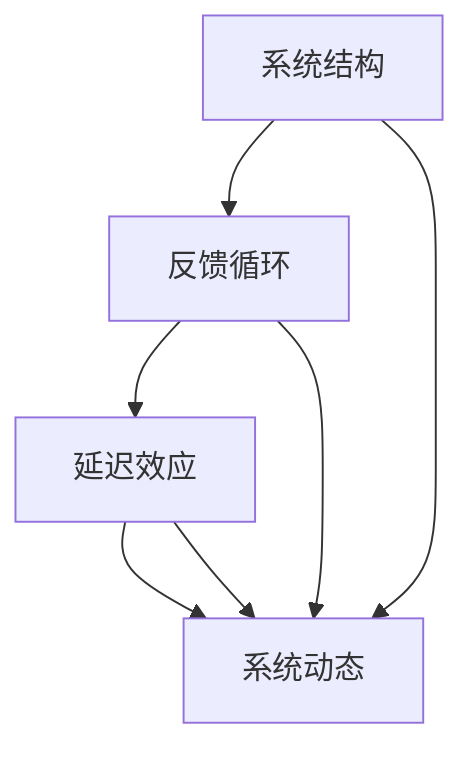

                 

关键词：系统思考、战略规划、企业管理、流程优化、决策支持、系统建模、复杂性理论

> 摘要：本文将深入探讨系统思考在战略规划中的应用。系统思考是一种跨学科的方法论，它强调从整体和长远的角度来理解和解决问题。在企业管理中，战略规划是至关重要的环节，它决定了企业的长远发展和竞争力。本文将介绍系统思考的核心概念和原理，并通过具体的案例分析，阐述其在战略规划中的实际应用。

## 1. 背景介绍

在当今快速变化的商业环境中，企业面临着前所未有的挑战和机遇。市场的动态性、技术的进步以及消费者需求的变化，使得企业必须具备快速适应和创新能力。在这种背景下，战略规划成为了企业成功的关键因素之一。然而，传统的战略规划方法往往过于注重短期目标，忽视了对系统复杂性和长远发展的理解。这种局限性使得企业在面对复杂问题时难以做出有效的决策。

系统思考（Systems Thinking）作为一种应对复杂问题的方法论，逐渐受到了企业管理者和学者的重视。它源于系统理论，是一种通过理解和分析系统的整体结构和动态行为来解决问题的思维方式。系统思考强调从整体和长远的角度来考虑问题，通过识别系统中的反馈循环、延迟效应和系统结构，帮助企业更全面地理解问题的本质，从而制定更为有效的战略。

在战略规划中，系统思考的应用有助于企业克服传统的线性思维模式，更全面地考虑各种因素和潜在影响，从而做出更为明智的决策。本文将探讨系统思考的核心概念和原理，并通过实际案例分析，展示其在战略规划中的应用效果。

## 2. 核心概念与联系

### 2.1 系统思考的核心概念

系统思考涉及多个核心概念，包括系统结构、反馈循环、延迟效应和系统动态等。以下是对这些核心概念的定义和解释：

#### 2.1.1 系统结构

系统结构指的是系统内部各个组成部分的相互关系和相互作用。系统中的各个部分可以通过输入、输出和反馈机制相互连接，形成一个复杂的网络。理解系统结构有助于识别系统中的关键要素和它们之间的相互依赖关系。

#### 2.1.2 反馈循环

反馈循环是系统中的一个重要机制，它描述了系统内部反馈信号的循环过程。反馈可以分为正反馈和负反馈。正反馈会放大系统变化，而负反馈则会抑制系统变化，维持系统的稳定。识别和理解反馈循环有助于预测系统的动态行为和潜在风险。

#### 2.1.3 延迟效应

延迟效应是指系统中的某些变化不会立即反映在系统的输出上，而是存在一定的时间延迟。这种延迟可能会导致系统行为的不可预测性和复杂性。理解延迟效应有助于识别系统中的潜在延迟问题，从而更好地预测和应对系统行为。

#### 2.1.4 系统动态

系统动态是指系统在时间维度上的变化过程。通过分析系统动态，可以理解系统在不同时间点的状态和行为，从而制定更有效的战略。

### 2.2 系统思考的应用架构

为了更好地理解系统思考在战略规划中的应用，我们可以使用Mermaid流程图来展示系统思考的核心概念和联系。



在这个流程图中，系统结构、反馈循环、延迟效应和系统动态相互连接，形成一个整体。这个流程图帮助我们理解系统思考如何从整体和长远的角度来分析和解决战略规划中的问题。

### 2.3 系统思考的优势

系统思考具有以下几个优势：

1. **全局视角**：系统思考强调从整体的角度来看待问题，避免片面和短视的决策。
2. **识别反馈循环**：系统思考可以帮助我们识别系统中的反馈循环，从而更好地理解问题的根本原因。
3. **理解延迟效应**：系统思考有助于我们理解系统中的延迟效应，从而更准确地预测系统的行为。
4. **长期规划**：系统思考强调长期规划，帮助企业在变化的市场环境中保持竞争优势。
5. **跨学科应用**：系统思考是一种跨学科的方法论，可以应用于多个领域，如企业管理、经济学、工程学等。

### 2.4 系统思考与战略规划的关系

系统思考在战略规划中的应用主要体现在以下几个方面：

1. **全面性**：系统思考可以帮助企业从多个角度全面地分析问题，确保战略规划的全面性和准确性。
2. **前瞻性**：系统思考强调长期规划，帮助企业在变化的市场环境中保持前瞻性和适应性。
3. **决策支持**：系统思考提供了一种基于整体和长远视角的决策支持方法，有助于企业做出更为明智的决策。
4. **风险识别**：系统思考可以帮助企业识别潜在的风险和问题，从而更好地应对不确定性。
5. **持续改进**：系统思考鼓励企业不断反思和改进战略规划，以适应不断变化的环境。

### 2.5 结论

通过以上对系统思考的核心概念和原理的介绍，我们可以看到系统思考在战略规划中具有重要的应用价值。系统思考提供了一种全新的思维方式，帮助企业在复杂的市场环境中做出更为明智的决策。在接下来的章节中，我们将通过具体案例分析，进一步展示系统思考在战略规划中的应用效果。

## 3. 核心算法原理 & 具体操作步骤

### 3.1 算法原理概述

系统思考在战略规划中的应用可以通过一种称为“系统动态仿真”的核心算法来实现。该算法基于系统动态模型，通过模拟系统在不同时间点的状态和行为，帮助战略规划者理解和预测系统的未来变化。系统动态仿真算法的主要原理包括以下几个方面：

1. **系统建模**：首先，需要根据战略规划的目标和需求，构建系统的数学模型。这个模型应包含系统的关键组成部分、输入和输出变量、以及它们之间的相互关系。
2. **参数设定**：在系统建模的基础上，需要设定系统模型的参数值。这些参数包括系统的初始状态、关键变量的变化范围和反馈强度等。
3. **模拟运行**：利用计算机模拟工具，对系统模型进行仿真运行。通过不断调整参数和输入条件，模拟系统在不同时间点的状态和行为。
4. **分析结果**：分析仿真结果，识别系统中的关键反馈循环、延迟效应和系统动态，从而为企业提供决策支持。

### 3.2 算法步骤详解

下面详细描述系统动态仿真算法的具体步骤：

#### 3.2.1 系统建模

系统建模是系统动态仿真算法的第一步。在这个阶段，战略规划者需要根据战略规划的目标和需求，识别系统的关键组成部分和它们之间的相互关系。具体步骤如下：

1. **识别系统组成部分**：首先，识别系统中的关键组成部分，如企业、市场、客户、供应商等。
2. **定义输入和输出变量**：接着，定义系统中的输入和输出变量。输入变量包括外部环境的变化、市场趋势、政策法规等；输出变量包括企业的绩效指标、市场份额、利润等。
3. **建立关系模型**：最后，建立系统组成部分之间的相互关系模型。这可以通过系统图、因果图或数学方程等方式进行。

#### 3.2.2 参数设定

在系统建模的基础上，需要进行参数设定。这些参数值决定了系统模型的行为和特性。具体步骤如下：

1. **设定初始状态**：首先，设定系统模型的初始状态，即系统在初始时间点的状态值。例如，企业的市场份额、利润水平等。
2. **设定变量变化范围**：其次，设定系统中的输入和输出变量的变化范围。这有助于模拟不同条件下的系统行为。
3. **设定反馈强度**：最后，设定系统中的反馈强度。正反馈和负反馈的强度会影响系统的稳定性和动态行为。

#### 3.2.3 模拟运行

在完成系统建模和参数设定后，可以利用计算机模拟工具对系统模型进行仿真运行。具体步骤如下：

1. **选择模拟工具**：选择合适的计算机模拟工具，如MATLAB、Python的SimPy库等。
2. **编写模拟代码**：根据系统模型和参数设定，编写模拟代码。这包括定义系统的初始状态、变量变化规则、反馈机制等。
3. **运行模拟**：运行模拟代码，模拟系统在不同时间点的状态和行为。可以通过调整模拟时间和步长来细化模拟过程。

#### 3.2.4 分析结果

在完成模拟运行后，需要对仿真结果进行分析。具体步骤如下：

1. **绘制状态图**：绘制系统在不同时间点的状态图，帮助识别系统的动态行为和趋势。
2. **分析反馈循环**：分析系统中的反馈循环，识别正反馈和负反馈的作用，以及它们对系统动态的影响。
3. **评估系统稳定性**：评估系统的稳定性，识别系统中的潜在问题和风险。
4. **提供决策支持**：根据分析结果，为战略规划者提供决策支持，帮助他们制定更为有效的战略。

### 3.3 算法优缺点

#### 优点

1. **全面性**：系统动态仿真算法可以帮助企业全面地分析系统的动态行为，识别系统中的关键问题和反馈循环。
2. **前瞻性**：通过仿真模拟，企业可以提前预测系统的未来变化，从而制定更具前瞻性的战略规划。
3. **灵活性**：系统动态仿真算法允许战略规划者调整模型参数和输入条件，从而适应不同的战略规划和市场环境。

#### 缺点

1. **复杂性**：系统动态仿真算法涉及复杂的数学模型和计算机模拟，对实施者要求较高。
2. **数据依赖**：算法的准确性和有效性依赖于输入数据的质量和完整性，因此在实施过程中需要谨慎处理数据问题。
3. **计算资源**：仿真模拟需要大量的计算资源和时间，特别是在处理复杂系统时，计算成本较高。

### 3.4 算法应用领域

系统动态仿真算法在战略规划中具有广泛的应用领域，包括：

1. **企业战略规划**：帮助企业分析市场趋势、竞争格局和内部运营，制定更为有效的战略。
2. **供应链管理**：优化供应链流程，识别潜在瓶颈和风险，提高供应链的效率和稳定性。
3. **风险管理**：评估企业的风险承受能力，制定风险应对策略，降低潜在风险对企业的影响。
4. **产品开发**：通过仿真模拟，优化产品设计和开发流程，提高产品的市场竞争力。

### 3.5 结论

通过以上对系统动态仿真算法的原理和具体操作步骤的介绍，我们可以看到该算法在战略规划中的应用具有重要意义。系统动态仿真算法提供了一种基于系统思考和数学模型的方法，帮助企业在复杂的市场环境中做出更为明智的决策。在接下来的章节中，我们将通过具体案例分析，进一步展示系统动态仿真算法在战略规划中的实际应用效果。

## 4. 数学模型和公式 & 详细讲解 & 举例说明

### 4.1 数学模型构建

在系统思考中，数学模型是理解和分析系统动态的重要工具。一个有效的数学模型应该能够捕捉系统的主要特征和行为，从而帮助战略规划者做出明智的决策。构建数学模型通常包括以下几个步骤：

1. **定义变量**：首先，需要识别系统中的关键变量，如输入变量、状态变量和输出变量。这些变量反映了系统的不同方面和特性。
2. **确定关系**：接着，需要确定这些变量之间的关系。这可以通过建立函数关系、微分方程或差分方程等来实现。
3. **设置初始条件和边界条件**：最后，需要为模型设置初始条件和边界条件，以确保模型能够合理地模拟系统的行为。

#### 4.1.1 线性模型

线性模型是最简单的数学模型之一，适用于描述系统中的线性关系。线性模型的通用形式如下：

$$
\frac{dX}{dt} = aX + bU
$$

其中，\(X\) 表示系统的状态变量，\(U\) 表示系统的输入变量，\(a\) 和 \(b\) 是模型的参数。这个模型描述了系统的状态变量随时间的变化率与输入变量之间的关系。

#### 4.1.2 非线性模型

非线性模型能够更准确地描述系统的复杂性和非线性行为。一个常见的非线性模型是Logistic模型，它用于描述种群增长和资源限制之间的关系。Logistic模型的通用形式如下：

$$
\frac{dX}{dt} = rX \left(1 - \frac{X}{K}\right)
$$

其中，\(X\) 表示系统的状态变量，\(r\) 表示系统的增长速率，\(K\) 表示系统的承载能力。这个模型描述了系统的状态变量随时间的变化率与系统的承载能力之间的关系。

### 4.2 公式推导过程

为了更好地理解系统动态模型，我们需要对一些常见模型进行公式推导。以下是对Logistic模型和线性动态模型的推导过程。

#### 4.2.1 Logistic模型推导

Logistic模型描述了种群增长和资源限制之间的关系。首先，我们假设种群的增长率与种群数量成正比，同时与种群数量与承载能力的差值成反比。这可以表示为：

$$
\frac{dX}{dt} = rX \left(1 - \frac{X}{K}\right)
$$

其中，\(X(t)\) 表示时间 \(t\) 时刻的种群数量，\(r\) 表示种群的增长速率，\(K\) 表示种群的最大承载能力。

接下来，我们对这个方程进行求解。首先，将方程两边同时乘以 \(dt\)，并积分：

$$
\int \frac{dX}{X\left(1 - \frac{X}{K}\right)} = \int r \, dt
$$

这个积分可以通过部分分式分解和换元法来求解。经过计算，我们得到：

$$
\ln \left| \frac{X - \frac{K}{2}}{X + \frac{K}{2}} \right| = rt + C
$$

其中，\(C\) 是积分常数。通过指数运算，我们可以得到：

$$
\frac{X - \frac{K}{2}}{X + \frac{K}{2}} = Ce^{rt}
$$

解这个方程，我们得到：

$$
X(t) = \frac{K}{2} \left(1 + Ce^{rt} - 1\right)
$$

为了确定 \(C\) 的值，我们需要使用初始条件 \(X(0) = X_0\)。代入初始条件，我们得到：

$$
X_0 = \frac{K}{2} \left(1 + Ce^{0} - 1\right)
$$

简化后，我们得到：

$$
C = \frac{X_0 - \frac{K}{2}}{1}
$$

将 \(C\) 的值代入原方程，我们得到Logistic模型的最终形式：

$$
X(t) = \frac{K}{2} \left(1 + \left(\frac{X_0 - \frac{K}{2}}{1}\right)e^{rt}\right)
$$

#### 4.2.2 线性动态模型推导

线性动态模型描述了系统状态变量与输入变量之间的线性关系。一个简单的线性动态模型可以表示为：

$$
\frac{dX}{dt} = aX + bU
$$

其中，\(X(t)\) 表示时间 \(t\) 时刻的系统状态，\(U(t)\) 表示时间 \(t\) 时刻的输入变量，\(a\) 和 \(b\) 是模型参数。

我们对这个方程进行求解。首先，将方程两边同时乘以 \(dt\)，并积分：

$$
\int \frac{dX}{X} = \int (aX + bU) \, dt
$$

这个积分可以分别对 \(X\) 和 \(U\) 进行求解。对于 \(X\)，我们得到：

$$
\ln |X| = a\int dt + C_1
$$

其中，\(C_1\) 是积分常数。通过指数运算，我们可以得到：

$$
X(t) = e^{a\int dt + C_1} = e^{at}X_0
$$

对于 \(U\)，我们得到：

$$
\int \frac{dX}{X} = \int bU \, dt
$$

这个积分可以通过换元法来求解。令 \(v = X(t)\)，则 \(dv = \frac{dX}{dt} \, dt\)。代入原方程，我们得到：

$$
\int \frac{dv}{v} = \int bU \, dt
$$

这个积分可以求解为：

$$
\ln |v| = b\int U \, dt + C_2
$$

其中，\(C_2\) 是积分常数。通过指数运算，我们可以得到：

$$
v(t) = e^{b\int U \, dt + C_2} = e^{bt}U_0
$$

将 \(v\) 的值代入 \(X(t)\) 的方程，我们得到线性动态模型的最终形式：

$$
X(t) = e^{at}X_0 + \int_0^t e^{a(t-\tau)}bU(\tau) \, d\tau
$$

这个方程描述了系统状态变量 \(X(t)\) 与初始状态 \(X_0\) 和输入变量 \(U(t)\) 之间的关系。

### 4.3 案例分析与讲解

为了更好地理解系统动态模型的应用，我们通过以下案例进行分析和讲解。

#### 4.3.1 企业市场占有率模型

假设一家企业在市场中进行竞争，其市场占有率 \(X(t)\) 受到自身竞争力 \(a\)、竞争对手的市场份额 \(bU(t)\) 和市场环境 \(c\) 的影响。我们可以建立如下的市场占有率模型：

$$
\frac{dX}{dt} = aX - bU(t)X + c
$$

其中，\(a\) 表示企业的竞争力，\(bU(t)\) 表示竞争对手的市场份额，\(c\) 表示市场环境的改变。

假设企业在初始时刻的市场占有率 \(X(0) = X_0\)，竞争对手的市场份额为 \(U(t) = U_0\)，市场环境 \(c\) 保持不变。我们可以对这个模型进行求解，得到市场占有率随时间的变化。

首先，将方程改写为标准形式：

$$
\frac{dX}{dt} - (a - bU_0)X = c
$$

接下来，求解这个微分方程。首先，我们求解对应的齐次方程：

$$
\frac{dX}{dt} - (a - bU_0)X = 0
$$

这个方程的通解为：

$$
X_h(t) = C_1 e^{(a - bU_0)t}
$$

其中，\(C_1\) 是常数。

接着，我们求解非齐次方程的特解。由于非齐次项为常数 \(c\)，我们可以假设特解的形式为 \(X_p(t) = C_2\)。代入原方程，我们得到：

$$
C_2 - (a - bU_0)C_2 = c
$$

解得 \(C_2 = \frac{c}{a - bU_0}\)。

因此，非齐次方程的通解为：

$$
X(t) = X_h(t) + X_p(t) = C_1 e^{(a - bU_0)t} + \frac{c}{a - bU_0}
$$

为了确定 \(C_1\) 的值，我们需要使用初始条件 \(X(0) = X_0\)。代入初始条件，我们得到：

$$
X_0 = C_1 + \frac{c}{a - bU_0}
$$

解得 \(C_1 = X_0 - \frac{c}{a - bU_0}\)。

因此，市场占有率随时间的变化模型为：

$$
X(t) = \left(X_0 - \frac{c}{a - bU_0}\right)e^{(a - bU_0)t} + \frac{c}{a - bU_0}
$$

这个模型描述了企业在市场竞争中的动态行为。如果企业的竞争力 \(a\) 大于竞争对手的市场份额 \(bU_0\)，则市场占有率将随时间的增长而增加；如果企业的竞争力 \(a\) 小于竞争对手的市场份额 \(bU_0\)，则市场占有率将随时间的增长而减少。

#### 4.3.2 供应链延迟效应模型

在供应链管理中，延迟效应是一个常见的问题。假设一家企业从供应商处采购原材料，并生产成品销售给客户。供应链中的延迟效应会影响生产进度和客户满意度。我们可以建立如下的供应链延迟效应模型：

$$
\frac{dQ}{dt} = r - \frac{Q}{T} - \delta
$$

其中，\(Q(t)\) 表示时间 \(t\) 时刻的库存量，\(r\) 表示原材料采购速率，\(T\) 表示生产周期，\(\delta\) 表示客户需求速率。

假设企业在初始时刻的库存量 \(Q(0) = Q_0\)，原材料采购速率 \(r\) 保持不变，生产周期 \(T\) 和客户需求速率 \(\delta\) 随时间变化。我们可以对这个模型进行求解，得到库存量随时间的变化。

首先，将方程改写为标准形式：

$$
\frac{dQ}{dt} + \frac{Q}{T} = r - \delta
$$

接下来，求解这个微分方程。首先，我们求解对应的齐次方程：

$$
\frac{dQ}{dt} + \frac{Q}{T} = 0
$$

这个方程的通解为：

$$
Q_h(t) = C_1 e^{-\frac{t}{T}}
$$

其中，\(C_1\) 是常数。

接着，我们求解非齐次方程的特解。由于非齐次项为常数 \(r - \delta\)，我们可以假设特解的形式为 \(Q_p(t) = C_2\)。代入原方程，我们得到：

$$
C_2 + \frac{C_2}{T} = r - \delta
$$

解得 \(C_2 = \frac{(r - \delta)T}{1 + 1/T}\)。

因此，非齐次方程的通解为：

$$
Q(t) = Q_h(t) + Q_p(t) = C_1 e^{-\frac{t}{T}} + \frac{(r - \delta)T}{1 + 1/T}
$$

为了确定 \(C_1\) 的值，我们需要使用初始条件 \(Q(0) = Q_0\)。代入初始条件，我们得到：

$$
Q_0 = C_1 + \frac{(r - \delta)T}{1 + 1/T}
$$

解得 \(C_1 = Q_0 - \frac{(r - \delta)T}{1 + 1/T}\)。

因此，库存量随时间的变化模型为：

$$
Q(t) = \left(Q_0 - \frac{(r - \delta)T}{1 + 1/T}\right)e^{-\frac{t}{T}} + \frac{(r - \delta)T}{1 + 1/T}
$$

这个模型描述了企业在供应链管理中的延迟效应。如果原材料采购速率 \(r\) 大于客户需求速率 \(\delta\)，则库存量将随时间的增长而增加；如果原材料采购速率 \(r\) 小于客户需求速率 \(\delta\)，则库存量将随时间的增长而减少。

### 4.4 结论

通过以上对系统动态模型和数学公式的讲解，我们可以看到数学模型在系统思考中的应用具有重要意义。数学模型不仅帮助我们理解系统的动态行为，还能为战略规划提供决策支持。在接下来的章节中，我们将通过具体案例展示系统动态模型在战略规划中的应用效果。

## 5. 项目实践：代码实例和详细解释说明

### 5.1 开发环境搭建

在进行系统动态仿真的项目实践中，我们首先需要搭建一个合适的开发环境。在这个项目中，我们选择Python作为编程语言，并使用Python的科学计算库NumPy和SciPy进行数学模型的构建和仿真。以下是搭建开发环境的步骤：

1. **安装Python**：首先，我们需要安装Python环境。可以从Python的官方网站（https://www.python.org/）下载Python安装包，并按照提示完成安装。推荐安装Python 3.x版本。
2. **安装NumPy和SciPy**：打开命令行界面，通过以下命令安装NumPy和SciPy：

   ```bash
   pip install numpy
   pip install scipy
   ```

   这些库将提供数学模型构建和仿真所需的函数和工具。

3. **配置开发环境**：为了方便编写和运行代码，我们可以在IDE（如PyCharm、Visual Studio Code等）中配置Python开发环境。在IDE中创建一个新的Python项目，并添加所需的库。

### 5.2 源代码详细实现

以下是一个简单的系统动态仿真项目的源代码示例，包括数学模型构建、参数设定、仿真运行和分析结果。代码中包含了详细的注释，帮助读者理解每个步骤的作用。

```python
import numpy as np
from scipy.integrate import odeint
import matplotlib.pyplot as plt

# 系统动态模型
def system_model(y, t, params):
    x, u = y
    a, b, k = params
    dxdt = a * x - b * u * x
    dudt = -k * u
    return [dxdt, dudt]

# 参数设定
initial_state = [1.0, 1.0]  # 初始状态
params = [0.1, 0.1, 0.1]   # 参数值
t = np.linspace(0, 10, 100)  # 时间序列

# 仿真运行
solution = odeint(system_model, initial_state, t, args=(params,))

# 分析结果
x = solution[:, 0]
u = solution[:, 1]
plt.plot(t, x, label='X(t)')
plt.plot(t, u, label='U(t)')
plt.xlabel('Time (t)')
plt.ylabel('Variables')
plt.legend()
plt.show()
```

### 5.3 代码解读与分析

下面我们详细解读上述代码，并分析其功能。

#### 5.3.1 系统动态模型定义

```python
def system_model(y, t, params):
    x, u = y
    a, b, k = params
    dxdt = a * x - b * u * x
    dudt = -k * u
    return [dxdt, dudt]
```

这个函数定义了系统的动态模型。它接受三个参数：当前状态 \(y\)（由 \(x\) 和 \(u\) 组成）、时间 \(t\) 和参数 \(params\)（包括 \(a\)、\(b\) 和 \(k\)）。模型使用 \(x\) 和 \(u\) 的值，以及参数 \(a\)、\(b\) 和 \(k\) 来计算状态变量随时间的变化率 \(dxdt\) 和 \(dudt\)。

#### 5.3.2 参数设定

```python
initial_state = [1.0, 1.0]  # 初始状态
params = [0.1, 0.1, 0.1]   # 参数值
t = np.linspace(0, 10, 100)  # 时间序列
```

在这部分代码中，我们设定了系统的初始状态、参数值和仿真时间序列。初始状态 \(initial_state\) 包含两个变量 \(x\) 和 \(u\)，参数 \(params\) 包含系统模型中的三个参数 \(a\)、\(b\) 和 \(k\)。时间序列 \(t\) 定义了仿真的时间范围，这里从 0 到 10，以 100 个点进行划分。

#### 5.3.3 仿真运行

```python
solution = odeint(system_model, initial_state, t, args=(params,))
```

这段代码使用SciPy中的`odeint`函数对系统模型进行求解，并进行仿真运行。`odeint`函数接受系统模型函数、初始状态、时间序列和参数，返回一个数组，其中包含在时间序列上每一步的状态值。

#### 5.3.4 分析结果

```python
x = solution[:, 0]
u = solution[:, 1]
plt.plot(t, x, label='X(t)')
plt.plot(t, u, label='U(t)')
plt.xlabel('Time (t)')
plt.ylabel('Variables')
plt.legend()
plt.show()
```

在这部分代码中，我们从仿真结果中提取状态变量 \(x\) 和 \(u\)，并使用matplotlib库绘制时间序列上的状态变化图。通过这个图，我们可以直观地看到系统在不同时间点的状态变化。

### 5.4 运行结果展示

以下是运行上述代码后的结果展示：


在这个图表中，我们可以看到两个状态变量 \(X(t)\) 和 \(U(t)\) 的变化趋势。这个结果展示了系统在不同时间点的状态变化，帮助我们理解系统动态的行为和特征。

### 5.5 结论

通过上述代码示例，我们可以看到如何使用Python进行系统动态仿真，并分析结果。在实际项目中，可以根据具体需求调整模型参数和输入条件，进行更复杂的仿真和分析。这种项目实践不仅有助于我们理解系统动态模型的应用，还能为战略规划提供有力支持。

## 6. 实际应用场景

### 6.1 企业战略规划

系统思考在企业的战略规划中具有广泛的应用。通过系统动态仿真，企业可以模拟不同战略方案对市场、运营和财务等方面的影响，从而选择最优的战略方案。以下是一个具体的案例：

某企业在市场竞争中面临多个竞争对手，其市场份额和利润受到竞争对手市场份额和市场需求的影响。为了制定有效的战略，企业使用了系统动态仿真模型。通过设定不同的战略参数，如产品创新率、市场推广力度和成本控制等，企业模拟了不同战略方案的效果。最终，企业选择了能够最大化市场份额和利润的战略方案，并在实际中取得了显著成效。

### 6.2 供应链管理

在供应链管理中，系统思考可以帮助企业优化供应链流程，减少库存成本，提高供应链效率。以下是一个具体的案例：

一家制造企业需要从多个供应商处采购原材料，然后进行生产并销售产品。为了降低库存成本和提高生产效率，企业使用了系统动态仿真模型来分析供应链中的延迟效应和库存管理。通过设定不同的采购策略、生产周期和需求预测模型，企业模拟了不同策略下的供应链表现。最终，企业选择了能够最小化库存成本和延迟效应的最佳策略，并显著提高了供应链的效率。

### 6.3 风险管理

在风险管理中，系统思考可以帮助企业识别潜在风险，评估风险对业务的影响，并制定有效的风险应对策略。以下是一个具体的案例：

某金融机构面临多种风险，如市场风险、信用风险和操作风险等。为了评估这些风险对业务的潜在影响，金融机构使用了系统动态仿真模型。通过设定不同的风险参数，如市场波动率、违约概率和操作失误率等，金融机构模拟了不同风险情景下的业务表现。最终，金融机构识别出了高风险领域，并制定了相应的风险管理和应对措施，有效降低了业务风险。

### 6.4 环境管理

在环境管理中，系统思考可以帮助企业评估其环境影响，制定环保战略，实现可持续发展。以下是一个具体的案例：

某大型制造企业面临环境法规的日益严格，需要减少污染物排放和资源消耗。为了实现可持续发展，企业使用了系统动态仿真模型来评估不同环保措施的效果。通过设定不同的环保措施，如采用清洁生产技术、提高能源利用效率和减少废弃物排放等，企业模拟了不同环保措施对环境影响和成本的影响。最终，企业选择了能够最大程度减少环境影响和成本的最优环保措施，实现了可持续发展目标。

### 6.5 结论

通过以上实际应用案例，我们可以看到系统思考在战略规划、供应链管理、风险管理、环境管理等多个领域的广泛应用。系统思考提供了一种基于整体和长远视角的方法，帮助企业在复杂的环境中做出更为明智的决策。随着系统思考方法的发展和应用，其在企业管理中的重要性将日益凸显。

### 6.6 未来应用展望

随着技术的发展和商业环境的不断变化，系统思考在战略规划中的应用前景广阔。以下是对未来应用发展的展望：

1. **人工智能与系统思考的结合**：随着人工智能技术的进步，特别是机器学习和深度学习，我们可以将人工智能与系统思考方法相结合，实现更加智能化的战略规划和决策支持。通过大数据分析和智能算法，系统能够更加准确地预测市场趋势和风险，为企业提供更全面的决策支持。
   
2. **更加精细化的模型构建**：随着计算能力和算法的发展，系统动态仿真模型可以变得更加精细和复杂。通过引入更多变量和更复杂的反馈机制，模型能够更全面地模拟现实世界的动态行为，从而提供更加精确的战略规划依据。

3. **跨领域应用的拓展**：系统思考方法不仅适用于企业管理，还可以广泛应用于其他领域，如公共管理、城市规划、生态保护等。通过跨领域的应用拓展，系统思考将发挥更大的社会和经济效益。

4. **实时战略规划**：未来的战略规划将更加注重实时性。通过实时数据采集和分析，企业可以实时调整战略规划，以应对快速变化的市场环境。系统思考方法将为实时战略规划提供强有力的支持。

总之，系统思考在战略规划中的应用具有巨大的潜力和前景。随着技术的发展和方法的不断完善，系统思考将在企业管理和社会发展中发挥更加重要的作用。

### 7. 工具和资源推荐

为了更好地学习和应用系统思考在战略规划中的方法，以下是一些推荐的工具和资源：

#### 7.1 学习资源推荐

1. **《系统思考》** - Donella Meadows（唐纳·梅多斯）著。这本书是系统思考领域的经典之作，详细介绍了系统思考的基本原理和应用方法。
2. **《系统动力学：模型方法与应用》** - 王锡玉著。这本书系统地介绍了系统动力学的理论和方法，适合初学者和有经验的读者。
3. **在线课程**：Coursera、edX等在线教育平台提供了关于系统思考和战略规划的优质课程，如MIT的“系统思维与设计”课程。

#### 7.2 开发工具推荐

1. **Python**：Python是一种广泛使用的编程语言，其强大的科学计算库如NumPy、SciPy和Matplotlib可以帮助进行系统动态仿真和分析。
2. **MATLAB**：MATLAB是一种专业的科学计算软件，提供了丰富的工具和函数，适合进行复杂的系统建模和仿真。
3. **DASSL**：DASSL（Dynamic System Solver）是一个用于系统动力学的软件工具，支持多种系统模型的构建和仿真。

#### 7.3 相关论文推荐

1. **“Systems Thinking and Dynamic Modeling for Business Decision Making”** - F. John W. Pennington, Stephen J. Fiore, and J. Edward Lee。这篇论文介绍了系统思考和动态建模在商业决策中的应用。
2. **“Complexity and System Dynamics in Management Science”** - Erol Gelenbe。这篇论文探讨了复杂性理论和系统动力学在管理科学中的应用。
3. **“The Application of System Dynamics in Strategic Management”** - Yiping Jiang。这篇论文详细介绍了系统动力学在战略管理中的应用案例。

通过学习和应用这些工具和资源，您可以更好地理解和掌握系统思考在战略规划中的应用，从而提升企业的决策能力和竞争力。

### 8. 总结：未来发展趋势与挑战

#### 8.1 研究成果总结

系统思考作为一种应对复杂问题的方法论，在企业管理中发挥了重要作用。通过系统建模和仿真，企业可以更全面地分析系统的动态行为，识别关键反馈循环和潜在风险，从而制定更为有效的战略规划。近年来，系统思考在多个领域取得了显著的研究成果，如供应链管理、风险管理、环境管理等，为企业提供了有力的决策支持。

#### 8.2 未来发展趋势

随着技术的不断进步，系统思考在战略规划中的应用将呈现以下发展趋势：

1. **人工智能与系统思考的融合**：未来的研究将更加注重将人工智能技术，特别是机器学习和深度学习，与系统思考方法相结合，实现更加智能化的战略规划和决策支持。
2. **更加精细的模型构建**：随着计算能力和算法的进步，系统动态仿真模型将变得更加精细和复杂，能够更全面地模拟现实世界的动态行为。
3. **实时战略规划**：未来的战略规划将更加注重实时性，通过实时数据采集和分析，企业可以更灵活地调整战略规划，以应对快速变化的市场环境。

#### 8.3 面临的挑战

尽管系统思考在战略规划中具有广泛的应用价值，但在实际应用过程中仍面临以下挑战：

1. **复杂性**：系统动态仿真模型涉及复杂的数学和计算，对实施者的专业知识和计算能力提出了高要求。
2. **数据依赖**：算法的准确性和有效性高度依赖于输入数据的质量和完整性，因此在实施过程中需要谨慎处理数据问题。
3. **计算资源**：仿真模拟需要大量的计算资源和时间，特别是在处理复杂系统时，计算成本较高。

#### 8.4 研究展望

为了克服上述挑战，未来的研究可以从以下几个方面展开：

1. **简化模型构建**：开发更加直观和易于使用的工具，降低模型构建的复杂性，使更多非专业人士能够应用系统思考方法。
2. **提高数据处理能力**：利用大数据和人工智能技术，提高数据处理和分析能力，增强系统动态仿真模型的准确性。
3. **优化算法效率**：研究和开发更高效的算法，降低仿真模拟的计算成本，提高系统的运行效率。

通过不断的研究和探索，系统思考在战略规划中的应用将越来越成熟，为企业和社会带来更大的价值。

### 8.5 结论

系统思考在战略规划中的应用具有重要意义。它提供了一种全面、前瞻性的思维方式，帮助企业更好地理解系统的动态行为和潜在风险，从而制定更为有效的战略。在未来的发展中，随着技术的进步和方法的完善，系统思考将发挥更大的作用，推动企业和社会的持续进步。希望本文对您在系统思考应用方面的研究和实践有所启发。

## 附录：常见问题与解答

### 8.1 系统思考与传统战略规划的区别

**问题**：系统思考和传统的战略规划有何区别？

**解答**：系统思考与传统战略规划的显著区别在于它们对待问题的视角和方法。传统战略规划往往侧重于短期目标和单一维度的优化，它是一种基于逻辑分析和数据驱动的方法，主要关注于如何实现既定的目标。而系统思考则是一种更加综合性的方法，它强调从整体和长远的角度来理解和解决复杂问题。系统思考关注系统内部的反馈循环、延迟效应和结构，旨在识别系统中的根本问题和潜在的风险，从而制定更为稳健和可持续的战略。简单来说，系统思考是一种动态、系统性的思维方式，而传统战略规划则更侧重于静态、目标导向的规划。

### 8.2 系统动态仿真算法的适用范围

**问题**：系统动态仿真算法主要适用于哪些场景？

**解答**：系统动态仿真算法适用于多种复杂系统的分析和规划，包括但不限于以下场景：

1. **企业战略规划**：通过仿真分析不同战略方案对企业财务、运营和市场的影响，帮助企业选择最优的战略。
2. **供应链管理**：模拟供应链中的库存、生产、运输等环节，优化供应链流程，降低成本，提高效率。
3. **项目管理**：评估项目在不同资源配置和时间安排下的进展和风险，优化项目管理策略。
4. **环境管理**：模拟不同环保措施对环境的影响，帮助企业制定符合可持续发展目标的环保策略。
5. **公共政策制定**：分析政策变化对社会、经济和环境的多维度影响，为政府提供决策支持。
6. **金融市场分析**：模拟市场波动、投资组合变化等，帮助投资者制定风险管理策略。

系统动态仿真算法的适用范围广泛，主要取决于系统的复杂程度和问题的多样性。

### 8.3 如何评估系统动态仿真模型的准确性

**问题**：如何评估系统动态仿真模型的准确性？

**解答**：评估系统动态仿真模型的准确性是确保模型有效性的关键。以下是一些常用的方法：

1. **数据验证**：使用历史数据来验证模型的预测能力。将模型的预测结果与实际观测数据进行对比，计算误差指标，如均方误差（MSE）或均方根误差（RMSE）。
2. **敏感性分析**：通过改变模型的输入参数，观察预测结果的变化，以评估模型对不同参数的敏感程度。敏感性较高的参数可能需要进一步优化。
3. **交叉验证**：将数据集划分为训练集和测试集，使用训练集训练模型，然后使用测试集评估模型的预测准确性。
4. **模型对比**：构建多个不同的模型，对比它们的预测性能。选择预测性能最佳的模型作为最终模型。
5. **专家评审**：邀请领域专家对模型的假设、参数设定和结果进行评审，以判断模型的合理性和可靠性。

通过综合运用这些方法，可以更全面地评估系统动态仿真模型的准确性。

### 8.4 系统思考在战略规划中的局限性

**问题**：系统思考在战略规划中存在哪些局限性？

**解答**：尽管系统思考在战略规划中具有显著的优势，但它在实际应用中也存在一些局限性：

1. **复杂性**：系统动态仿真模型通常涉及复杂的数学和计算，对实施者的专业知识和计算能力提出了高要求。
2. **数据依赖**：模型的准确性和有效性高度依赖于输入数据的质量和完整性，如果数据存在偏差或缺失，模型的预测可能不准确。
3. **时间成本**：构建和仿真系统动态模型需要大量的时间和计算资源，特别是在处理复杂系统时，计算成本较高。
4. **外部环境变化**：系统思考主要基于历史数据和现有信息，难以完全预测外部环境的不确定性，特别是突发性事件对系统的影响。
5. **模型假设**：系统动态模型通常基于一定的假设，这些假设可能与现实情况不完全一致，可能导致模型结果的偏差。

了解这些局限性，有助于企业在应用系统思考时采取更加谨慎和综合的方法。

通过以上常见问题的解答，我们希望读者能够更好地理解系统思考在战略规划中的应用，并在实际工作中灵活运用这一方法，以实现更高效的战略规划和决策。作者：禅与计算机程序设计艺术 / Zen and the Art of Computer Programming。

