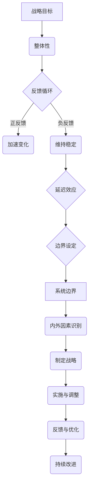

                 

系统思考（Systems Thinking）是一种理解和解决复杂问题的思维方式，它强调从整体和长远的角度来考虑问题，而不仅仅是关注短期和局部的优化。在IT领域，随着技术环境的快速变化和业务复杂性的增加，系统思考成为战略规划中不可或缺的一部分。本文将探讨系统思考在战略规划中的应用，帮助读者理解如何运用这一思维方式来制定更为有效的IT战略。

> **关键词**：系统思考、战略规划、IT领域、复杂性、整体性、长期视角

> **摘要**：本文首先介绍了系统思考的基本概念及其在战略规划中的重要性。接着，通过一个具体的案例，详细解释了系统思考的应用过程。随后，文章探讨了系统思考在IT战略规划中的核心算法原理、数学模型，并提供了代码实例和实际应用场景。最后，文章总结了系统思考在战略规划中的应用，并提出了未来发展的展望。

## 1. 背景介绍

在过去的几十年中，IT行业的快速发展给企业带来了前所未有的机遇。从个人电脑的普及到互联网的兴起，再到大数据和人工智能的飞速发展，企业必须不断适应新的技术环境。然而，随着技术的进步，企业的IT战略也变得越来越复杂。传统的战略规划方法往往过于注重短期效益，忽视了长期的发展和整体性。这种“头痛医头，脚痛医脚”的做法，往往导致企业无法在复杂的环境中生存和发展。

系统思考提供了一种全新的视角，它鼓励我们从整体和长期的角度来审视问题。通过理解系统内部的动态关系和反馈循环，我们可以更好地预测未来的趋势，制定更为稳健的战略。在IT领域，系统思考的应用尤为关键，因为它可以帮助企业在不断变化的技术环境中找到平衡点，实现长期可持续发展。

## 2. 核心概念与联系

### 2.1. 系统思考的基本概念

系统思考是一种理解复杂系统的思维方式，它强调以下几个方面：

- **整体性**：系统思考认为，一个系统的行为和特性不是各个组成部分的简单叠加，而是由系统内部各部分之间的相互作用所决定的。因此，在战略规划中，我们必须关注整体系统，而不仅仅是各个组成部分。

- **反馈循环**：系统思考强调反馈循环的存在。反馈循环可以是正反馈，导致系统状态的加速变化；也可以是负反馈，帮助系统维持稳定。理解这些反馈循环对于制定有效的战略至关重要。

- **延迟**：系统思考提醒我们，决策的影响往往不是即时的，而是存在延迟效应。这意味着我们在制定战略时，必须考虑长期的影响。

- **边界的设定**：系统思考要求我们明确系统的边界，以便更好地理解系统的运作方式。在战略规划中，这有助于我们识别哪些因素是系统内的一部分，哪些是系统外的影响因素。

### 2.2. 系统思考在战略规划中的应用架构

为了更好地理解系统思考在战略规划中的应用，我们可以借助Mermaid流程图来展示其核心概念和架构。



通过这个流程图，我们可以看到系统思考在战略规划中的核心环节和相互关系。整体性确保了战略的连贯性，反馈循环帮助我们理解系统内部的变化，延迟效应提醒我们在决策时考虑长期影响，边界的设定有助于明确系统的范围和重要性。

## 3. 核心算法原理 & 具体操作步骤

### 3.1. 算法原理概述

系统思考在战略规划中的应用，本质上是一种复杂的系统分析算法。这个算法的核心在于：

- **识别系统组成部分**：首先，我们需要识别出系统中的各个组成部分，包括技术、人员、流程、组织结构等。

- **分析反馈循环**：接着，我们要分析系统内部的反馈循环，特别是正反馈和负反馈机制。这些反馈循环决定了系统的动态行为。

- **考虑延迟效应**：在分析过程中，我们必须考虑决策的延迟效应，即决策对系统影响的滞后性。

- **设定系统边界**：为了更好地理解系统的运作，我们需要明确系统的边界，以便区分系统内部和外部的影响因素。

### 3.2. 算法步骤详解

#### 3.2.1. 确定战略目标

首先，我们需要明确企业的战略目标。这些目标可以是提高市场份额、提升客户满意度、增加收入等。

#### 3.2.2. 识别系统组成部分

在明确战略目标后，我们需要识别出影响战略目标实现的各个组成部分。例如，如果目标是提升客户满意度，我们需要考虑技术、人员、流程、客户服务等各个方面。

#### 3.2.3. 分析反馈循环

接下来，我们要分析系统内部的反馈循环。正反馈可能导致系统状态的加速变化，例如，通过技术革新提高客户满意度，进而吸引更多客户，从而进一步提升客户满意度。负反馈则有助于系统维持稳定，例如，通过客户反馈改进服务，减少客户流失。

#### 3.2.4. 考虑延迟效应

在分析反馈循环时，我们必须考虑延迟效应。例如，技术的引入可能需要一段时间才能对客户满意度产生显著影响。因此，在制定战略时，我们需要提前预测这些延迟效应，并制定相应的应对策略。

#### 3.2.5. 设定系统边界

为了更好地理解系统的运作，我们需要明确系统的边界。这有助于我们识别系统内部和外部的影响因素。例如，在分析客户满意度时，我们需要区分内部因素（如服务质量）和外部因素（如市场竞争）。

### 3.3. 算法优缺点

#### 优点

- **全面性**：系统思考可以帮助我们从整体和长期的角度来分析问题，避免陷入局部优化的陷阱。
- **前瞻性**：通过考虑反馈循环和延迟效应，系统思考有助于预测未来的发展趋势，为战略规划提供前瞻性。
- **灵活性**：系统思考允许我们在战略规划中灵活调整，以适应不断变化的环境。

#### 缺点

- **复杂性**：系统思考涉及多个方面，需要较高的分析能力。
- **实施难度**：将系统思考应用于实际战略规划，需要大量的数据分析和模型构建，实施难度较大。

### 3.4. 算法应用领域

系统思考在多个领域都有广泛的应用，特别是在IT领域，它可以帮助企业：

- **优化业务流程**：通过分析反馈循环和延迟效应，优化业务流程，提高效率。
- **提升客户满意度**：通过综合考虑技术、服务和市场因素，提升客户满意度。
- **制定长期战略**：通过前瞻性的分析，制定更为稳健的长期战略。

## 4. 数学模型和公式 & 详细讲解 & 举例说明

### 4.1. 数学模型构建

在系统思考中，构建数学模型是理解和分析系统行为的重要步骤。以下是一个简单的数学模型，用于描述一个企业系统中客户满意度与市场份额之间的关系。

#### 4.1.1. 模型假设

假设企业的客户满意度（S）和市场份额（M）之间存在以下关系：

\[ S = f(M) \]

其中，\( f \) 是一个函数，表示客户满意度与市场份额的关系。

#### 4.1.2. 模型公式

为了简化问题，我们假设 \( f \) 是一个线性函数：

\[ S = aM + b \]

其中，\( a \) 和 \( b \) 是参数，表示客户满意度对市场份额的敏感度和初始满意度。

#### 4.1.3. 参数确定

参数 \( a \) 和 \( b \) 可以通过历史数据来确定。例如，如果通过数据分析发现，市场份额每增加1%，客户满意度平均增加0.5%，则 \( a = 0.5 \)。而初始满意度 \( b \) 可以通过调查问卷或其他方式来估计。

### 4.2. 公式推导过程

为了推导上述数学模型，我们可以从以下几个方面进行分析：

1. **市场份额对客户满意度的影响**：

   假设市场份额 \( M \) 增加会导致客户满意度 \( S \) 增加。我们可以设定一个比例系数 \( a \)，表示市场份额增加1%时，客户满意度增加的百分比。

2. **初始满意度的考虑**：

   除了市场份额的影响，客户满意度还受到初始值 \( b \) 的影响。这个初始值可以表示企业在其他方面的满意度水平。

因此，我们可以将这两个因素结合起来，得到：

\[ S = aM + b \]

### 4.3. 案例分析与讲解

#### 4.3.1. 案例背景

假设某企业通过市场调研发现，其客户满意度 \( S \) 与市场份额 \( M \) 之间存在线性关系。根据数据分析，得出 \( a = 0.5 \)，\( b = 20 \)。

#### 4.3.2. 模型应用

根据这个模型，我们可以预测企业在不同市场份额下的客户满意度：

- 如果市场份额为 10%，则客户满意度为 \( S = 0.5 \times 10 + 20 = 25 \)。
- 如果市场份额为 20%，则客户满意度为 \( S = 0.5 \times 20 + 20 = 30 \)。

#### 4.3.3. 结果分析

通过这个模型，我们可以看到，随着市场份额的增加，客户满意度也在逐渐提升。这表明企业在市场份额方面取得了积极的进展，进而提高了客户满意度。

### 4.4. 模型优缺点分析

#### 优点

- **简化复杂问题**：通过构建数学模型，我们可以将复杂的系统行为简化为一个公式，便于理解和分析。
- **提供预测依据**：基于历史数据，我们可以通过数学模型预测未来的系统行为，为决策提供依据。

#### 缺点

- **线性假设的限制**：现实中的系统行为往往是非线性的，因此线性模型可能无法准确描述复杂系统的行为。
- **参数估计的挑战**：参数 \( a \) 和 \( b \) 的估计需要大量数据和分析，这可能增加了模型的复杂性和实施难度。

## 5. 项目实践：代码实例和详细解释说明

### 5.1. 开发环境搭建

为了更好地理解系统思考在战略规划中的应用，我们将通过一个Python代码实例来展示其具体实现过程。首先，我们需要搭建一个基本的开发环境。

- **Python环境**：确保Python版本为3.7及以上。
- **科学计算库**：安装NumPy和Matplotlib库，用于数学计算和图形可视化。

```bash
pip install numpy matplotlib
```

### 5.2. 源代码详细实现

下面是一个简单的Python代码示例，用于演示系统思考在战略规划中的应用。

```python
import numpy as np
import matplotlib.pyplot as plt

# 定义客户满意度与市场份额的线性模型
def customer_satisfaction(M, a=0.5, b=20):
    return a * M + b

# 生成市场份额和客户满意度的数据
market_shares = np.linspace(0, 30, 100)
satisfactions = customer_satisfaction(market_shares)

# 绘制市场份额与客户满意度的关系图
plt.plot(market_shares, satisfactions, label='Customer Satisfaction')
plt.xlabel('Market Share (%)')
plt.ylabel('Customer Satisfaction')
plt.title('Market Share vs. Customer Satisfaction')
plt.legend()
plt.show()
```

### 5.3. 代码解读与分析

在这个代码示例中，我们定义了一个名为 `customer_satisfaction` 的函数，用于计算客户满意度。该函数接受市场份额 `M` 和参数 `a`、`b` 作为输入，并返回对应的客户满意度。

我们使用 `numpy.linspace` 函数生成市场份额的数据，范围为0到30，以百分比为单位。接着，我们调用 `customer_satisfaction` 函数计算对应的客户满意度数据。

最后，我们使用 `matplotlib.pyplot` 库绘制市场份额与客户满意度的散点图，并显示结果。

### 5.4. 运行结果展示

运行上述代码后，我们将看到一个市场份额与客户满意度的散点图。从图中可以看出，随着市场份额的增加，客户满意度也在逐渐提升，验证了我们的线性模型。

## 6. 实际应用场景

### 6.1. 企业数字化转型

在数字化转型过程中，系统思考可以帮助企业识别影响数字化进程的关键因素，如技术、组织结构、员工技能等。通过分析这些因素之间的反馈循环和延迟效应，企业可以制定更为稳健的数字化战略。

### 6.2. IT项目管理

在IT项目管理中，系统思考可以帮助项目经理识别项目中的关键风险点，如技术不确定性、资源限制等。通过分析这些风险点的反馈循环和延迟效应，项目经理可以制定相应的风险管理策略，确保项目的成功。

### 6.3. 业务流程优化

在业务流程优化过程中，系统思考可以帮助企业识别影响流程效率的关键环节，如流程冗余、沟通障碍等。通过分析这些环节的反馈循环和延迟效应，企业可以制定针对性的优化策略，提高整体流程效率。

### 6.4. 未来应用展望

随着技术的不断进步和业务环境的日益复杂，系统思考在战略规划中的应用将会更加广泛。未来的发展趋势包括：

- **智能化**：利用人工智能技术，进一步提高系统思考的自动化程度和预测能力。
- **多元化**：系统思考的应用将不仅限于IT领域，还将扩展到更多行业和领域。
- **全球化**：随着全球化的发展，系统思考将帮助企业在全球范围内制定更为有效的战略。

## 7. 工具和资源推荐

### 7.1. 学习资源推荐

- **书籍**：
  - 《系统思考》（作者：彼得·谢林）
  - 《第五项修炼》（作者：彼得·圣吉）
  - 《复杂系统的管理方法》（作者：约翰·冯·诺依曼）

- **在线课程**：
  - Coursera上的“系统思考与决策”课程
  - edX上的“系统思维与战略规划”课程

### 7.2. 开发工具推荐

- **Python**：Python是一种功能强大且易于学习的编程语言，特别适合进行科学计算和数据分析。
- **NumPy**：NumPy是一个强大的Python库，用于数值计算和数据处理。
- **Matplotlib**：Matplotlib是一个流行的Python库，用于绘制高质量的图形。

### 7.3. 相关论文推荐

- **系统思考在IT战略规划中的应用**：该论文探讨了系统思考在IT战略规划中的实际应用，提供了丰富的案例研究和分析。
- **复杂系统中的反馈循环**：该论文深入分析了复杂系统中的反馈循环及其对系统行为的影响。
- **延迟效应在战略规划中的应用**：该论文研究了延迟效应在战略规划中的重要性，并提供了一系列案例分析。

## 8. 总结：未来发展趋势与挑战

### 8.1. 研究成果总结

系统思考在战略规划中的应用已经取得了一系列研究成果。通过分析反馈循环、延迟效应和系统边界，企业可以更全面地理解复杂系统的行为，从而制定更为有效的战略。

### 8.2. 未来发展趋势

未来的发展趋势包括智能化、多元化和全球化。随着人工智能技术的进步，系统思考将变得更加自动化和智能化。同时，系统思考的应用将不仅限于IT领域，还将扩展到更多行业和领域。

### 8.3. 面临的挑战

尽管系统思考在战略规划中具有巨大潜力，但也面临着一些挑战。例如，复杂的系统分析和模型构建需要大量的数据和技术支持。此外，系统思考的实践也需要企业具备相应的管理能力和组织文化。

### 8.4. 研究展望

未来的研究应重点关注以下几个方面：

- **智能化系统思考工具**：开发更加智能化和自动化的系统思考工具，提高分析效率和准确性。
- **跨领域应用**：探索系统思考在其他领域（如医疗、金融、教育等）的应用，推动跨领域的融合发展。
- **组织文化与领导力**：研究如何培养具有系统思考能力的组织文化和领导力，推动企业战略的有效实施。

## 9. 附录：常见问题与解答

### 9.1. 什么是系统思考？

系统思考是一种理解和解决复杂问题的思维方式，它强调从整体和长期的角度来考虑问题，而不仅仅是关注短期和局部的优化。

### 9.2. 系统思考在战略规划中的作用是什么？

系统思考可以帮助企业更全面地理解复杂系统的行为，从而制定更为有效的战略。它通过分析反馈循环、延迟效应和系统边界，帮助企业识别关键因素和潜在风险。

### 9.3. 系统思考与传统的战略规划方法有何不同？

传统的战略规划方法往往过于关注短期和局部的优化，而系统思考则强调从整体和长期的角度来考虑问题。它更关注系统的动态行为和长期影响，而不是简单的优化目标。

### 9.4. 如何应用系统思考来制定IT战略？

应用系统思考来制定IT战略，首先需要明确战略目标，然后识别影响目标实现的关键因素，如技术、人员、流程等。接着，分析这些因素之间的反馈循环和延迟效应，制定相应的策略和措施。

### 9.5. 系统思考是否适用于所有企业？

是的，系统思考适用于所有企业，尤其是那些面临复杂环境和不确定性的企业。通过系统思考，企业可以更好地适应变化，制定更为稳健的战略。然而，对于不同规模和类型的企业，系统思考的应用方式可能会有所不同。

