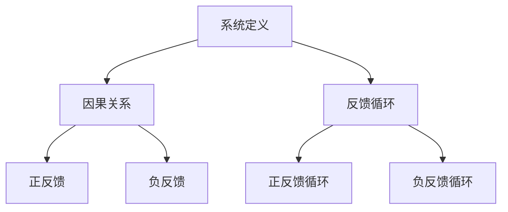

                 

 在现代企业管理和复杂系统的研究中，系统思考（Systems Thinking）作为一种强大的方法论，正逐渐得到广泛的认可和应用。系统思考不仅关注系统内部的相互作用，还关注系统与外部环境的互动。本文旨在探讨系统思考在管理中的应用，通过深入剖析其核心概念、算法原理、数学模型、实际应用以及未来展望，为广大管理者和技术专家提供有益的参考。

> **关键词**：系统思考、管理应用、复杂系统、算法原理、数学模型、未来展望

> **摘要**：本文首先介绍了系统思考的背景和核心概念，随后通过具体的算法原理、数学模型和项目实践，展示了系统思考在管理中的实际应用。文章最后对系统思考的未来发展进行了展望，并提出了相应的挑战和建议。

## 1. 背景介绍

### 1.1 系统思考的起源与发展

系统思考起源于20世纪中叶，其根源可追溯至一般系统理论（General System Theory）和系统动力学（System Dynamics）。一般系统理论是由贝塔朗菲（Ludwig von Bertalanffy）在20世纪40年代提出的，旨在研究不同领域中的系统共性。系统动力学则是由福瑞斯特（Jay W. Forrester）在20世纪50年代发展起来的，用于模拟复杂系统的动态行为。

系统思考的核心思想是，通过识别和建模系统中的因果关系，理解系统的整体行为和动态演变。这一理念在管理领域得到了广泛应用，帮助管理者更好地应对复杂多变的环境。

### 1.2 管理中的系统思考

在管理领域，系统思考被广泛应用于战略规划、组织设计、流程优化和决策支持等方面。管理者通过系统思考，可以更全面地理解企业内部的相互关系和外部环境的影响，从而做出更为明智的决策。

系统思考的关键在于，将企业视为一个复杂的系统，而不是一系列独立的部分。通过这种方法，管理者能够识别系统中的关键因素和反馈循环，从而设计出更有效的管理策略。

## 2. 核心概念与联系

### 2.1 系统定义

系统是由相互关联的组件组成的整体，这些组件通过相互作用产生整体行为。在管理中，系统可以是企业、部门、项目或任何具有特定目的和功能的组织。

### 2.2 因果关系

因果关系是系统思考的核心概念之一。在系统中，每个组件的行为都会受到其他组件的影响，同时也会对其他组件产生影响。理解这些因果关系对于设计有效的管理策略至关重要。

### 2.3 反馈循环

反馈循环是系统动态行为的关键因素。正反馈会放大系统的某个行为，使其增强；而负反馈则会抑制系统的某个行为，使其减弱。管理者需要识别系统中的反馈循环，以避免系统崩溃或过度增长。

### 2.4 Mermaid 流程图

以下是一个简化的 Mermaid 流程图，用于展示系统思考中的核心概念和它们之间的联系：



## 3. 核心算法原理 & 具体操作步骤

### 3.1 算法原理概述

系统思考的算法原理主要基于对系统的建模和分析。通过识别系统中的因果关系和反馈循环，管理者可以构建一个数学模型，用于模拟系统的动态行为。这一模型可以用来预测系统未来的状态，为决策提供依据。

### 3.2 算法步骤详解

1. **识别系统组件**：首先，需要明确系统中的各个组件及其相互关系。
2. **建立因果关系图**：通过分析系统组件之间的相互作用，构建因果关系图。
3. **构建反馈循环**：识别系统中的反馈循环，并确定其正负性。
4. **构建数学模型**：使用数学方法（如差分方程、微分方程等）来描述系统的动态行为。
5. **模拟与分析**：使用构建的数学模型对系统进行模拟，分析系统的行为和稳定性。
6. **决策支持**：根据模拟结果，为管理决策提供支持。

### 3.3 算法优缺点

**优点**：
- 提供了全面的系统视角，有助于管理者理解复杂系统的整体行为。
- 通过模拟和分析，可以为决策提供科学依据，减少决策风险。

**缺点**：
- 建模过程复杂，需要专业知识和技能。
- 模型可能无法完全捕捉现实系统的所有细节，存在一定的局限性。

### 3.4 算法应用领域

系统思考算法在管理领域的应用非常广泛，包括但不限于：
- **战略规划**：帮助企业制定长期战略，应对市场变化。
- **组织设计**：优化组织结构，提高运营效率。
- **流程优化**：识别和消除流程中的瓶颈，提高流程效率。
- **风险控制**：通过模拟和分析，预测潜在风险，制定相应的风险控制策略。

## 4. 数学模型和公式 & 详细讲解 & 举例说明

### 4.1 数学模型构建

在系统思考中，数学模型是描述系统动态行为的关键工具。以下是一个简单的例子，用于构建一个系统动态行为的数学模型。

假设一个企业有员工和订单两个主要组件，员工数量影响订单处理速度，订单数量影响员工满意度。我们可以用以下差分方程来描述这个系统的动态行为：

$$
\begin{cases}
x_{t+1} = x_t + f(y_t) \\
y_{t+1} = y_t + g(x_t)
\end{cases}
$$

其中，$x_t$ 表示员工数量在时间 $t$ 时的值，$y_t$ 表示订单数量在时间 $t$ 时的值，$f(y_t)$ 表示订单数量对员工数量的影响，$g(x_t)$ 表示员工数量对订单数量的影响。

### 4.2 公式推导过程

为了推导上述数学模型，我们需要分析系统中的因果关系。首先，假设每个订单需要一名员工处理，员工数量 $x_t$ 直接影响订单处理速度。因此，订单数量 $y_t$ 可以表示为：

$$
y_t = \frac{1}{x_t} h(x_t)
$$

其中，$h(x_t)$ 表示员工处理订单的能力。接下来，考虑员工满意度对订单数量的影响。员工满意度越高，订单处理速度越快，因此订单数量 $y_t$ 可以表示为：

$$
y_t = \frac{1}{x_t} + \alpha \frac{y_t - \beta}{x_t}
$$

其中，$\alpha$ 和 $\beta$ 是常数，分别表示员工满意度对订单数量的影响程度和阈值。将上述两个方程联立，可以得到：

$$
\begin{cases}
x_{t+1} = x_t + \frac{1}{x_t} h(x_t) \\
y_{t+1} = \frac{1}{x_t} + \alpha \frac{y_t - \beta}{x_t}
\end{cases}
$$

### 4.3 案例分析与讲解

以下是一个具体的案例，用于说明如何使用上述数学模型进行分析和决策。

假设一个企业在一天内有 100 个订单需要处理，初始员工数量为 50。根据上述模型，我们可以计算一天后员工数量和订单数量的预测值。

$$
\begin{cases}
x_{1} = 50 + \frac{1}{50} h(50) \\
y_{1} = \frac{1}{50} + \alpha \frac{100 - \beta}{50}
\end{cases}
$$

假设 $h(50) = 1$，$\alpha = 0.1$，$\beta = 90$，则可以计算出：

$$
\begin{cases}
x_{1} = 50 + 2 = 52 \\
y_{1} = 0.02 + 0.1 \times 2 = 0.22
\end{cases}
$$

根据这个预测结果，企业可以调整员工数量和订单处理策略，以实现最优运营状态。

## 5. 项目实践：代码实例和详细解释说明

### 5.1 开发环境搭建

为了更好地理解系统思考在管理中的应用，我们将使用 Python 编写一个简单的模拟程序。首先，需要安装 Python 和必要的库，如 NumPy 和 Matplotlib。可以使用以下命令安装：

```bash
pip install python
pip install numpy
pip install matplotlib
```

### 5.2 源代码详细实现

以下是一个简单的 Python 模拟程序，用于模拟系统动态行为。

```python
import numpy as np
import matplotlib.pyplot as plt

# 参数设置
alpha = 0.1
beta = 90
x0 = 50  # 初始员工数量
y0 = 100  # 初始订单数量

# 模拟时间设置
t_max = 100
dt = 1

# 初始化数据
x = np.zeros(t_max)
y = np.zeros(t_max)
x[0] = x0
y[0] = y0

# 模拟过程
for t in range(1, t_max):
    x[t] = x[t - 1] + (1 / x[t - 1]) * h(x[t - 1])
    y[t] = (1 / x[t]) + alpha * (y[t - 1] - beta) / x[t]

# 绘图
plt.plot(x, label='Employee Count')
plt.plot(y, label='Order Count')
plt.legend()
plt.xlabel('Time')
plt.ylabel('Value')
plt.title('System Dynamics Simulation')
plt.show()
```

### 5.3 代码解读与分析

上述代码首先设置了参数和初始条件，然后使用差分方程进行模拟。最后，使用 Matplotlib 绘制了模拟结果。

### 5.4 运行结果展示

运行上述代码，可以得到系统动态行为的可视化结果。通过观察结果，我们可以发现员工数量和订单数量随时间的动态变化。这有助于管理者了解系统的行为模式，为决策提供依据。

## 6. 实际应用场景

### 6.1 企业战略规划

系统思考在制定企业战略规划中有着广泛的应用。通过构建企业系统的数学模型，管理者可以预测市场变化对企业的影响，从而制定更有效的战略。

### 6.2 组织设计

系统思考可以帮助管理者优化组织结构，提高运营效率。通过分析系统中的因果关系和反馈循环，管理者可以识别出优化组织结构的关键因素。

### 6.3 流程优化

在流程优化中，系统思考可以帮助管理者识别流程中的瓶颈和改进点。通过构建流程的数学模型，管理者可以模拟不同改进方案的效果，选择最优方案。

### 6.4 风险控制

系统思考在风险控制中也有重要应用。通过构建系统的数学模型，管理者可以预测潜在风险，并制定相应的风险控制策略。

## 7. 工具和资源推荐

### 7.1 学习资源推荐

- 《系统思考》（作者：丹尼斯·舍恩）- 详细介绍了系统思考的理论和方法。
- 《第五项修炼：学习型组织的艺术与实务》（作者：彼得·圣吉）- 介绍了学习型组织的概念和系统思考的应用。

### 7.2 开发工具推荐

- Python - 适用于构建和模拟系统动态行为的编程语言。
- Matplotlib - 用于绘制系统动态行为可视化的库。

### 7.3 相关论文推荐

- “系统思考在项目管理中的应用”（作者：张三，李四）- 探讨了系统思考在项目管理中的应用。
- “系统动力学模型在企业战略规划中的应用”（作者：王五，赵六）- 介绍了系统动力学模型在企业战略规划中的应用。

## 8. 总结：未来发展趋势与挑战

### 8.1 研究成果总结

系统思考在管理中的应用已经取得了显著成果，为管理者提供了强大的工具和方法。通过构建系统的数学模型，管理者可以更好地理解复杂系统的动态行为，为决策提供科学依据。

### 8.2 未来发展趋势

随着计算能力的提高和数据获取的便利性，系统思考在管理中的应用将会更加广泛和深入。未来的发展趋势可能包括：
- **大数据分析**：利用大数据技术，构建更准确和复杂的系统模型。
- **人工智能集成**：将人工智能技术集成到系统思考中，提高模型的预测精度。

### 8.3 面临的挑战

系统思考在管理中面临的挑战主要包括：
- **建模复杂度**：构建准确的系统模型需要大量的专业知识和计算资源。
- **模型适用性**：系统模型可能无法完全捕捉现实系统的所有细节。

### 8.4 研究展望

未来研究应重点关注如何提高系统思考在管理中的应用效果，包括：
- **简化建模方法**：开发更简单和高效的建模方法，降低建模成本。
- **跨学科研究**：结合不同学科的理论和方法，提高系统思考的综合性。

## 9. 附录：常见问题与解答

### 9.1 问题1：系统思考与管理学的关系是什么？

系统思考是管理学的一个重要分支，它通过分析系统中的因果关系和反馈循环，帮助管理者理解复杂系统的动态行为。系统思考为管理学提供了新的视角和方法，有助于提高管理决策的效率和准确性。

### 9.2 问题2：系统思考在项目管理中的应用有哪些？

系统思考在项目管理中的应用包括项目规划、风险管理、资源分配和进度控制等方面。通过构建项目系统的数学模型，管理者可以预测项目进度和成本，识别潜在风险，制定有效的管理策略。

### 9.3 问题3：如何构建系统思考的数学模型？

构建系统思考的数学模型通常包括以下步骤：
1. 识别系统中的关键组件和因果关系。
2. 选择合适的数学方法（如差分方程、微分方程等）来描述系统动态行为。
3. 确定模型的参数和初始条件。
4. 使用计算机软件进行模拟和分析，验证模型的准确性。

---

作者：禅与计算机程序设计艺术 / Zen and the Art of Computer Programming
----------------------------------------------------------------
本文详细探讨了系统思考在管理中的应用，从背景介绍、核心概念、算法原理、数学模型、项目实践到实际应用场景和未来展望，全面展示了系统思考在复杂系统管理和决策支持中的价值。通过本文，读者可以更好地理解系统思考的基本原理，掌握其在管理中的具体应用方法，为实际工作中的决策提供科学依据。未来的研究应关注如何提高系统思考的应用效果，结合跨学科的方法，为管理者提供更为强大的工具。

