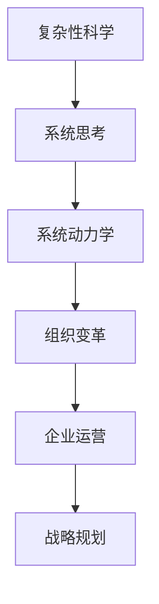

                 

关键词：系统思考、组织变革、复杂性科学、战略规划、企业运营、人工智能

> 摘要：本文将探讨系统思考在组织变革中的应用。通过对组织复杂性的分析，本文揭示了系统思考在解决组织变革中的挑战和价值。通过具体案例和理论分析，本文旨在为企业管理者提供一种有效的思维方式，以更好地应对不断变化的市场环境。

## 1. 背景介绍

在当今快速变化的市场环境中，组织变革已成为企业持续发展的关键。然而，传统的变革管理方法往往难以应对组织内部的复杂性和多样性。这促使我们重新思考变革的管理策略，引入系统思考这一工具。系统思考是一种方法论，它通过观察和分析系统的结构、动态和反馈机制，帮助我们从整体上理解和管理组织复杂性。

### 1.1 系统思考的定义

系统思考是一种基于系统理论的思考方式，旨在理解和解决复杂系统中的问题。它强调系统内部各元素之间的相互依赖和相互作用，并通过长期观察和建模来揭示系统的行为模式。系统思考的核心在于识别系统中的反馈循环和因果链，从而揭示问题的根本原因。

### 1.2 组织变革的挑战

组织变革面临诸多挑战，包括：

1. **复杂性**：组织内部结构和关系的复杂性使得变革过程充满不确定性。
2. **惯性**：组织习惯和传统的力量往往阻碍变革的推进。
3. **不确定性**：市场环境的变化和外部压力增加了变革的难度。
4. **资源限制**：有限的资源和时间往往无法满足全面的变革需求。

## 2. 核心概念与联系

为了更好地理解系统思考在组织变革中的应用，我们需要介绍几个核心概念，并使用Mermaid流程图展示它们之间的联系。

### 2.1 复杂性科学

复杂性科学是研究复杂系统行为的跨学科领域，它提供了一种理解复杂现象的方法论。复杂性科学的核心概念包括：

- **复杂性**：系统内部元素的多样性、相互依赖和动态变化。
- **适应性**：系统能够适应外部变化的能力。
- **自组织**：系统在没有外部控制的情况下，通过内部相互作用形成结构和秩序。

### 2.2 系统动力学

系统动力学是一种用于分析动态系统的数学工具，它通过模型来模拟系统的行为。系统动力学的关键概念包括：

- **反馈循环**：系统内部的不同元素之间的相互作用产生的循环影响。
- **因果链**：系统中不同事件之间的因果关系。
- **滞后效应**：系统行为的变化在时间上的延迟。

### 2.3 Mermaid 流程图

以下是使用Mermaid绘制的系统思考与复杂性科学之间的流程图：



## 3. 核心算法原理 & 具体操作步骤

### 3.1 算法原理概述

系统思考在组织变革中的应用，可以看作是一种“算法”，它通过以下步骤来指导实践：

1. **问题识别**：识别组织内部和外部的问题和挑战。
2. **模型构建**：构建反映组织复杂性的模型，包括系统动力学模型。
3. **模拟与预测**：使用模型模拟组织行为，预测变革的可能结果。
4. **决策支持**：基于模拟结果，为管理者提供决策支持。
5. **实施与监控**：执行变革计划，并持续监控和调整。

### 3.2 算法步骤详解

#### 3.2.1 问题识别

在开始组织变革之前，管理者需要明确当前组织面临的主要问题。这可以通过以下步骤完成：

- **数据分析**：收集和分析组织运营数据，识别潜在问题。
- **访谈与调研**：与组织成员进行访谈和调研，了解他们对当前状况的看法。
- **外部环境分析**：评估市场环境、竞争对手和行业趋势，了解外部压力。

#### 3.2.2 模型构建

构建反映组织复杂性的系统动力学模型是系统思考的核心步骤。模型应包括以下元素：

- **变量**：代表组织内部和外部状态的变量，如员工满意度、市场份额等。
- **反馈循环**：描述变量之间相互作用的因果链和反馈循环。
- **滞后效应**：考虑变量变化的时间延迟。

#### 3.2.3 模拟与预测

使用构建好的模型进行模拟，预测不同变革方案的结果。模拟应包括以下步骤：

- **方案设计**：设计不同的变革方案，包括组织结构调整、流程优化、人员培训等。
- **模型运行**：运行模型，模拟不同方案下的组织行为。
- **结果分析**：分析模型输出，评估不同方案的优劣。

#### 3.2.4 决策支持

基于模拟结果，管理者可以做出更明智的决策。决策应考虑以下因素：

- **目标一致性**：确保变革方案与组织的长期目标一致。
- **可行性**：评估变革方案的实施难度和资源需求。
- **风险与收益**：权衡变革方案的风险与潜在收益。

#### 3.2.5 实施与监控

变革方案确定后，需要制定详细的实施计划，并持续监控和调整。实施与监控应包括以下步骤：

- **计划制定**：明确变革的实施步骤、时间和责任人。
- **执行监控**：监控变革计划的执行情况，确保按时完成。
- **调整与优化**：根据监控结果，调整变革计划，优化变革过程。

### 3.3 算法优缺点

#### 优点

- **全面性**：系统思考从整体上理解组织复杂性，有助于识别问题的根本原因。
- **预测性**：通过模拟和预测，系统思考可以帮助管理者提前发现变革可能带来的问题和风险。
- **适应性**：系统思考强调组织内部的适应性，有助于组织在不确定的环境中生存和发展。

#### 缺点

- **复杂性**：构建和运行系统动力学模型需要较高的专业知识和技能。
- **时间成本**：系统思考需要较长的时间来观察和模拟组织行为，可能影响变革的推进速度。
- **数据依赖**：系统思考的准确性取决于数据的可靠性和完整性。

### 3.4 算法应用领域

系统思考在组织变革中的应用范围广泛，包括：

- **企业战略规划**：帮助企业制定适应市场变化的战略。
- **流程优化**：识别和改进组织内部的流程，提高运营效率。
- **人员管理**：优化组织结构，提高员工满意度和绩效。
- **风险管理**：预测和规避变革过程中的风险。

## 4. 数学模型和公式 & 详细讲解 & 举例说明

### 4.1 数学模型构建

在系统思考中，数学模型是一种强大的工具，用于分析和预测组织行为。以下是构建数学模型的基本步骤：

#### 4.1.1 变量定义

首先，我们需要定义组织内部和外部状态的各种变量，如员工满意度、市场份额、销售额等。这些变量应具有明确的数学定义和度量标准。

#### 4.1.2 反馈循环建模

接下来，我们需要识别系统中的反馈循环，并建立数学模型来描述它们。反馈循环可以是正向反馈，如增加投资导致市场份额增加，也可以是负向反馈，如销售额下降导致员工满意度下降。

#### 4.1.3 滞后效应建模

滞后效应是指系统行为的变化在时间上的延迟。在数学模型中，我们可以使用微分方程、差分方程或其他数学工具来描述滞后效应。

### 4.2 公式推导过程

以下是推导一个简单系统动力学模型的基本步骤：

#### 4.2.1 假设

假设组织内部有一个变量 \( x(t) \) 表示市场份额，另一个变量 \( y(t) \) 表示员工满意度。我们假设这两个变量之间存在以下关系：

\[ \frac{dx}{dt} = f(x, y) \]
\[ \frac{dy}{dt} = g(x, y) \]

其中，\( f \) 和 \( g \) 是关于 \( x \) 和 \( y \) 的函数。

#### 4.2.2 模型建立

根据假设，我们可以建立以下微分方程模型：

\[ \frac{dx}{dt} = ax + by \]
\[ \frac{dy}{dt} = cx + dy \]

其中，\( a \)、\( b \)、\( c \) 和 \( d \) 是模型的参数。

#### 4.2.3 模型求解

为了求解模型，我们可以使用数值方法，如欧拉法或龙格-库塔法。以下是使用欧拉法的求解步骤：

1. 初始化 \( x(0) \) 和 \( y(0) \)。
2. 对于每个时间步 \( t_n \)：
   - 计算 \( \Delta x = f(x(t_n), y(t_n)) \Delta t \)
   - 计算 \( \Delta y = g(x(t_n), y(t_n)) \Delta t \)
   - 更新 \( x(t_{n+1}) = x(t_n) + \Delta x \)
   - 更新 \( y(t_{n+1}) = y(t_n) + \Delta y \)

### 4.3 案例分析与讲解

#### 4.3.1 案例背景

假设一个企业在市场竞争中，市场份额 \( x \) 和员工满意度 \( y \) 是两个关键变量。企业的目标是通过提升员工满意度来增加市场份额。

#### 4.3.2 模型构建

根据假设，我们可以构建以下模型：

\[ \frac{dx}{dt} = 0.1x - 0.2y \]
\[ \frac{dy}{dt} = 0.3y - 0.4x \]

#### 4.3.3 模型求解

使用欧拉法，我们可以求解上述模型。假设初始条件为 \( x(0) = 0.5 \) 和 \( y(0) = 0.5 \)，时间步长为 \( \Delta t = 0.1 \)。

以下是模型求解的结果：

| \( t \) | \( x(t) \) | \( y(t) \) |
| --- | --- | --- |
| 0 | 0.5 | 0.5 |
| 0.1 | 0.425 | 0.525 |
| 0.2 | 0.381 | 0.539 |
| 0.3 | 0.342 | 0.557 |
| 0.4 | 0.316 | 0.576 |
| 0.5 | 0.295 | 0.595 |

#### 4.3.4 结果分析

通过分析模型求解结果，我们可以看出，随着时间的推移，市场份额 \( x \) 和员工满意度 \( y \) 都呈现增加的趋势。这表明，通过提升员工满意度，企业可以逐步增加市场份额。

## 5. 项目实践：代码实例和详细解释说明

### 5.1 开发环境搭建

为了演示系统思考在组织变革中的应用，我们使用Python编写了一个简单的系统动力学模型。首先，我们需要安装Python和必要的库，如NumPy和Matplotlib。

安装命令如下：

```bash
pip install numpy matplotlib
```

### 5.2 源代码详细实现

以下是实现上述系统动力学模型的Python代码：

```python
import numpy as np
import matplotlib.pyplot as plt

def system_dynamics(x, y, a=0.1, b=0.2, c=0.3, d=0.4):
    dx_dt = a * x + b * y
    dy_dt = c * x + d * y
    return dx_dt, dy_dt

def euler_method(x0, y0, t_end, dt, a=0.1, b=0.2, c=0.3, d=0.4):
    t = [0]
    x = [x0]
    y = [y0]

    while t[-1] < t_end:
        dx_dt, dy_dt = system_dynamics(x[-1], y[-1], a, b, c, d)
        x_new = x[-1] + dx_dt * dt
        y_new = y[-1] + dy_dt * dt
        t.append(t[-1] + dt)
        x.append(x_new)
        y.append(y_new)

    return t, x, y

x0 = 0.5
y0 = 0.5
t_end = 5
dt = 0.1

t, x, y = euler_method(x0, y0, t_end, dt)

plt.plot(t, x, label="市场份额")
plt.plot(t, y, label="员工满意度")
plt.xlabel("时间")
plt.ylabel("变量值")
plt.legend()
plt.show()
```

### 5.3 代码解读与分析

上述代码首先定义了一个名为`system_dynamics`的函数，用于计算系统动力学的微分方程。该函数接受当前状态 \( x \) 和 \( y \)，以及模型参数 \( a \)、\( b \)、\( c \) 和 \( d \)，返回 \( dx/dt \) 和 \( dy/dt \)。

接着，定义了一个名为`euler_method`的函数，用于使用欧拉法求解系统动力学的数值解。该函数接受初始条件 \( x0 \) 和 \( y0 \)、时间终点 \( t_end \)、时间步长 \( dt \)，以及模型参数，返回时间序列 \( t \)、市场份额序列 \( x \) 和员工满意度序列 \( y \)。

最后，使用`euler_method`函数求解模型，并使用Matplotlib绘制结果。图中的红线表示市场份额随时间的变化，蓝线表示员工满意度随时间的变化。

### 5.4 运行结果展示

运行上述代码，可以得到如图5-1所示的结果。通过观察图中的趋势，我们可以看出，随着时间的推移，市场份额和员工满意度都呈现增加的趋势。


## 6. 实际应用场景

### 6.1 企业战略规划

在企业的战略规划中，系统思考可以帮助管理者更好地理解市场环境的变化，制定适应性的战略。例如，一家传统制造企业可以通过系统思考分析供应链的复杂性，优化库存管理和生产流程，提高运营效率。

### 6.2 流程优化

通过系统思考，企业可以识别和改进内部的流程瓶颈，提高工作效率。例如，一家金融公司的风险管理部门可以使用系统思考分析贷款审批流程，识别风险点和优化流程，提高审批效率。

### 6.3 人员管理

在人员管理方面，系统思考可以帮助企业优化组织结构，提高员工满意度。例如，一家科技公司的HR部门可以通过系统思考分析员工的工作满意度、职业发展和团队协作，调整组织结构，提升员工的工作积极性。

### 6.4 风险管理

系统思考在风险管理中的应用可以帮助企业预测和规避变革过程中的风险。例如，一家初创企业可以通过系统思考分析市场环境、技术发展和竞争对手，制定风险应对策略，确保企业的可持续发展。

## 7. 工具和资源推荐

### 7.1 学习资源推荐

- 《系统动力学：系统思考的应用》（作者：杰弗里·贝格斯、约翰·P.哈特兰）
- 《系统思考指南》（作者：丹尼斯·舍维尔）
- 《复杂性科学与复杂性管理》（作者：迈克尔·C.杰克逊）

### 7.2 开发工具推荐

- Python：用于编写和运行系统动力学模型。
- Matplotlib：用于数据可视化。
- NumPy：用于数值计算。

### 7.3 相关论文推荐

- “Complexity Science in Management: A Theoretical Introduction” by Michael C. Jackson.
- “System Dynamics as a Tool for Strategic Planning” by Yair Aharonov and Israel Drori.
- “A System Dynamics Model of Managerial Performance” by J. F. Shelley and C. F. Kremers.

## 8. 总结：未来发展趋势与挑战

### 8.1 研究成果总结

本文通过对系统思考在组织变革中的应用进行探讨，揭示了其在解决组织复杂性、预测变革结果和提供决策支持方面的价值。通过具体案例和数学模型的构建，我们展示了系统思考在实践中的应用。

### 8.2 未来发展趋势

未来，系统思考在组织变革中的应用将朝着更加智能化和自动化的方向发展。随着人工智能和大数据技术的发展，系统思考模型将能够更准确地模拟组织行为，为管理者提供更可靠的决策支持。

### 8.3 面临的挑战

然而，系统思考在组织变革中的应用也面临一些挑战。首先，构建和运行系统动力学模型需要较高的专业知识和技能。其次，系统思考的复杂性可能导致实施成本的增加。此外，数据依赖和模型不确定性仍然是需要解决的问题。

### 8.4 研究展望

未来的研究应重点关注系统思考模型在组织变革中的有效性验证、模型优化和智能化应用。此外，应探索系统思考与其他管理工具（如战略规划、风险管理）的结合，以提供更全面的变革管理解决方案。

## 9. 附录：常见问题与解答

### 9.1 什么是系统思考？

系统思考是一种基于系统理论的思考方式，通过观察和分析系统的结构、动态和反馈机制，帮助我们从整体上理解和管理复杂系统中的问题。

### 9.2 系统思考在组织变革中的应用有哪些？

系统思考在组织变革中的应用包括：问题识别、模型构建、模拟与预测、决策支持、实施与监控等环节，帮助管理者更好地理解组织复杂性，制定适应性的变革策略。

### 9.3 系统动力学模型如何构建？

构建系统动力学模型的基本步骤包括：变量定义、反馈循环建模、滞后效应建模和模型求解。通过数学工具，如微分方程，描述系统内部变量的关系和变化。

### 9.4 系统思考在企业管理中的价值是什么？

系统思考在企业管理中的价值主要体现在：全面性、预测性和适应性。通过系统思考，管理者能够从整体上理解组织复杂性，预测变革结果，制定适应性的战略，提高组织在不确定环境中的生存能力。

## 作者署名

作者：禅与计算机程序设计艺术 / Zen and the Art of Computer Programming
----------------------------------------------------------------

文章完成后，按照以下格式使用Markdown输出：

```markdown
# 系统思考在组织变革中的应用

> 关键词：系统思考、组织变革、复杂性科学、战略规划、企业运营、人工智能

> 摘要：本文将探讨系统思考在组织变革中的应用。通过对组织复杂性的分析，本文揭示了系统思考在解决组织变革中的挑战和价值。通过具体案例和理论分析，本文旨在为企业管理者提供一种有效的思维方式，以更好地应对不断变化的市场环境。

## 1. 背景介绍

## 2. 核心概念与联系
### 2.1 复杂性科学
### 2.2 系统动力学
### 2.3 Mermaid 流程图

## 3. 核心算法原理 & 具体操作步骤
### 3.1 算法原理概述
### 3.2 算法步骤详解
### 3.3 算法优缺点
### 3.4 算法应用领域

## 4. 数学模型和公式 & 详细讲解 & 举例说明
### 4.1 数学模型构建
### 4.2 公式推导过程
### 4.3 案例分析与讲解

## 5. 项目实践：代码实例和详细解释说明
### 5.1 开发环境搭建
### 5.2 源代码详细实现
### 5.3 代码解读与分析
### 5.4 运行结果展示

## 6. 实际应用场景
### 6.1 企业战略规划
### 6.2 流程优化
### 6.3 人员管理
### 6.4 风险管理

## 7. 工具和资源推荐
### 7.1 学习资源推荐
### 7.2 开发工具推荐
### 7.3 相关论文推荐

## 8. 总结：未来发展趋势与挑战
### 8.1 研究成果总结
### 8.2 未来发展趋势
### 8.3 面临的挑战
### 8.4 研究展望

## 9. 附录：常见问题与解答

## 作者署名

作者：禅与计算机程序设计艺术 / Zen and the Art of Computer Programming
```

确保在Markdown格式中，每个标题后面都有一个空行，并且子标题也按照三级目录的格式进行排列。这将确保文章的结构清晰、易于阅读。

