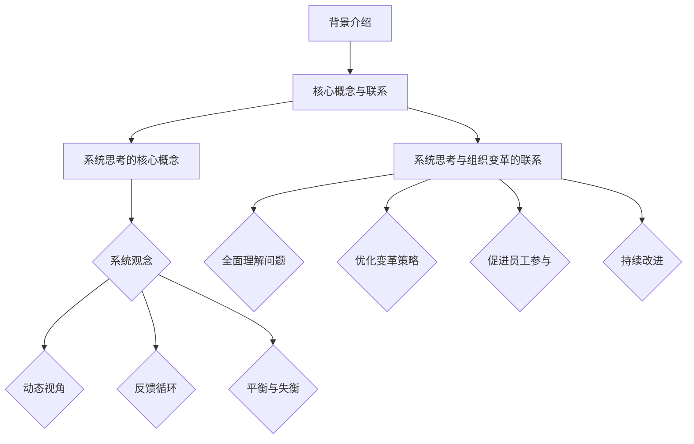

                 

 > **关键词**: 组织变革、系统思考、企业转型、流程优化、组织行为学

> **摘要**: 本文将探讨系统思考在组织变革中的应用。通过分析组织变革的背景、核心概念及其与系统思考的联系，本文将详细介绍系统思考的方法原理及其在组织变革中的具体应用步骤。此外，还将通过数学模型和公式、代码实例以及实际应用场景等多个角度，全面剖析系统思考在组织变革中的实际效果和未来发展趋势。

## 1. 背景介绍

组织变革是指企业为了适应外部环境的变化，通过调整内部组织结构、流程、文化和人员等方面的措施，以实现企业目标的过程。在当今竞争激烈的市场环境下，企业面临的挑战日益增多，如技术变革、市场波动、客户需求变化等。因此，组织变革成为企业持续发展的重要手段。

然而，组织变革并非易事。许多企业在变革过程中面临诸多困难，如员工抵触、资源不足、计划不周等。这些问题往往导致变革失败，使企业陷入困境。因此，寻找有效的变革方法论成为组织变革成功的关键。

系统思考是一种以整体、动态和长远视角看待问题的方法论。它强调从系统的角度分析问题，关注系统内部各部分之间的相互作用和反馈。系统思考的方法可以帮助企业全面、深入地理解组织变革中的复杂问题，从而制定出更为科学、有效的变革策略。

## 2. 核心概念与联系

### 2.1 系统思考的核心概念

系统思考主要包括以下几个核心概念：

1. **系统观念**：将问题视为一个整体，关注系统内部各部分之间的相互作用和反馈。
2. **动态视角**：强调问题的发展变化过程，关注系统的演变规律。
3. **反馈循环**：分析系统内部的反馈机制，了解各部分之间如何相互影响。
4. **平衡与失衡**：关注系统的稳定性，分析系统在平衡与失衡之间的变化。

### 2.2 系统思考与组织变革的联系

系统思考在组织变革中的应用主要体现在以下几个方面：

1. **全面理解问题**：通过系统思考，企业可以全面、深入地了解变革中的问题，从而避免片面、短视的决策。
2. **优化变革策略**：系统思考可以帮助企业制定更为科学、有效的变革策略，提高变革成功率。
3. **促进员工参与**：系统思考强调系统内部各部分的相互作用，有助于提高员工的参与度和认同感，降低变革阻力。
4. **持续改进**：系统思考鼓励企业不断反思和调整变革过程，实现持续改进。

### 2.3 Mermaid 流程图

以下是系统思考在组织变革中的 Mermaid 流程图：



## 3. 核心算法原理 & 具体操作步骤

### 3.1 算法原理概述

系统思考在组织变革中的应用主要包括以下几个步骤：

1. **诊断问题**：通过对企业内外部环境进行分析，找出变革中的问题。
2. **构建模型**：基于系统观念，构建反映企业变革过程的模型。
3. **分析反馈**：分析模型中的反馈机制，了解各部分之间的相互作用。
4. **制定策略**：根据分析结果，制定科学、有效的变革策略。
5. **实施变革**：执行变革策略，实施组织变革。
6. **评估效果**：对变革效果进行评估，持续改进。

### 3.2 算法步骤详解

1. **诊断问题**

诊断问题是组织变革的第一步。企业可以通过以下方法进行问题诊断：

- **问卷调查**：通过设计问卷，收集员工对组织变革的看法和建议。
- **访谈**：与企业内部不同层级的员工进行访谈，了解他们对变革的看法。
- **数据分析**：分析企业内部数据，如绩效指标、员工满意度等，找出问题所在。

2. **构建模型**

构建模型是系统思考在组织变革中的关键步骤。企业可以采用以下方法构建模型：

- **因果图**：通过绘制因果图，分析企业变革中的主要问题和原因。
- **系统动力学模型**：运用系统动力学方法，构建反映企业变革过程的模型。

3. **分析反馈**

分析反馈是了解企业变革过程中各部分之间相互作用的重要环节。企业可以采用以下方法进行分析：

- **敏感性分析**：通过改变模型中的某个参数，观察模型输出的变化，了解该参数对系统的影响。
- **模拟仿真**：运用模拟仿真技术，模拟企业变革过程，分析系统内部各部分的反馈机制。

4. **制定策略**

根据分析结果，企业可以制定以下变革策略：

- **组织结构调整**：根据模型分析结果，调整企业组织结构，以提高组织效能。
- **流程优化**：优化企业内部流程，降低成本，提高效率。
- **文化变革**：推动企业文化变革，提高员工认同感和归属感。

5. **实施变革**

实施变革是企业组织变革的关键步骤。企业可以采取以下措施：

- **制定详细的变革计划**：明确变革的目标、时间表和责任人。
- **培训与沟通**：对员工进行培训，提高他们对变革的理解和支持。
- **监督与评估**：对变革过程进行监督和评估，确保变革目标的实现。

6. **评估效果**

评估效果是确保组织变革成功的重要环节。企业可以采用以下方法进行评估：

- **绩效指标**：分析变革后的企业绩效指标，如销售额、利润率等。
- **员工满意度**：调查员工对变革的满意度，了解员工对变革的看法。
- **客户满意度**：分析客户对变革后的企业产品和服务的满意度。

### 3.3 算法优缺点

#### 优点

1. **全面性**：系统思考从整体、动态和长远视角分析问题，有助于企业全面、深入地了解组织变革中的复杂问题。
2. **科学性**：系统思考采用模型、仿真等科学方法，提高组织变革策略的科学性和可操作性。
3. **可操作性**：系统思考将抽象的概念转化为具体的方法和步骤，提高组织变革的实施效果。

#### 缺点

1. **复杂性**：系统思考涉及多个学科和领域，对企业管理人员的要求较高。
2. **时间成本**：构建模型、分析反馈等步骤需要较长时间，可能导致变革进程延迟。

### 3.4 算法应用领域

系统思考在组织变革中的应用领域广泛，主要包括：

1. **企业组织变革**：企业通过系统思考，优化组织结构、流程和文化，提高组织效能。
2. **项目管理**：在项目管理过程中，系统思考有助于项目团队全面、深入地了解项目中的复杂问题，提高项目成功率。
3. **战略规划**：企业通过系统思考，制定科学、合理的战略规划，确保企业可持续发展。
4. **人力资源管理**：系统思考有助于企业全面、深入地了解员工需求，优化人力资源配置，提高员工满意度。

## 4. 数学模型和公式 & 详细讲解 & 举例说明

### 4.1 数学模型构建

在组织变革中，系统思考的数学模型构建主要包括以下几个方面：

1. **系统动力学模型**：通过建立系统动力学模型，分析企业变革过程中的主要变量和关系。具体模型如下：

   $$X(t) = f(Y(t), Z(t))$$

   其中，$X(t)$表示企业变革过程中的某个变量，$Y(t)$和$Z(t)$表示其他相关变量。

2. **因果图模型**：通过绘制因果图，分析企业变革中的主要问题和原因。具体模型如下：

   $$\text{问题} \rightarrow \text{原因} \rightarrow \text{解决方案}$$

### 4.2 公式推导过程

以系统动力学模型为例，推导过程如下：

1. **变量定义**：假设企业变革过程中的主要变量为$X(t)$、$Y(t)$和$Z(t)$，分别表示企业的销售额、客户满意度和员工满意度。
2. **关系分析**：通过分析企业内部各部分之间的相互作用，得到以下关系：

   $$X(t) = 0.5Y(t) + 0.3Z(t)$$

   $$Y(t) = 0.6X(t) + 0.4Z(t)$$

   $$Z(t) = 0.7X(t) + 0.5Y(t)$$

3. **模型建立**：将上述关系代入系统动力学模型中，得到：

   $$X(t) = f(Y(t), Z(t)) = 0.5Y(t) + 0.3Z(t)$$

### 4.3 案例分析与讲解

假设某企业面临以下问题：

- 客户满意度低
- 员工流失严重
- 销售额持续下降

通过系统思考，企业可以构建以下数学模型：

1. **变量定义**：

   $$X(t) = \text{销售额}$$

   $$Y(t) = \text{客户满意度}$$

   $$Z(t) = \text{员工满意度}$$

2. **关系分析**：

   $$X(t) = 0.5Y(t) + 0.3Z(t)$$

   $$Y(t) = 0.6X(t) + 0.4Z(t)$$

   $$Z(t) = 0.7X(t) + 0.5Y(t)$$

3. **模型建立**：

   $$X(t) = f(Y(t), Z(t)) = 0.5Y(t) + 0.3Z(t)$$

通过分析模型，企业可以得出以下结论：

- 提高客户满意度有助于提高销售额。
- 提高员工满意度有助于提高客户满意度。
- 提高销售额有助于提高员工满意度。

因此，企业可以采取以下策略：

- 通过提高产品质量、优化售后服务等方式提高客户满意度。
- 通过提供培训、改善工作环境等方式提高员工满意度。
- 通过提高销售额，进一步提高员工满意度。

## 5. 项目实践：代码实例和详细解释说明

### 5.1 开发环境搭建

为了更好地展示系统思考在组织变革中的应用，我们使用 Python 语言和 Matplotlib 库进行项目开发。具体步骤如下：

1. 安装 Python：从 [Python 官网](https://www.python.org/) 下载并安装 Python。
2. 安装 Matplotlib：在命令行中执行以下命令：

   ```bash
   pip install matplotlib
   ```

### 5.2 源代码详细实现

以下是系统思考在组织变革中的 Python 代码实现：

```python
import numpy as np
import matplotlib.pyplot as plt

def system_dynamics(x, y, z):
    x_new = 0.5 * y + 0.3 * z
    y_new = 0.6 * x + 0.4 * z
    z_new = 0.7 * x + 0.5 * y
    return x_new, y_new, z_new

def simulate_system(initial_values, steps):
    x, y, z = initial_values
    x_values, y_values, z_values = [x], [y], [z]

    for _ in range(steps):
        x, y, z = system_dynamics(x, y, z)
        x_values.append(x)
        y_values.append(y)
        z_values.append(z)

    return x_values, y_values, z_values

initial_values = [100, 80, 70]
steps = 10

x_values, y_values, z_values = simulate_system(initial_values, steps)

plt.plot(x_values, label='X(t)')
plt.plot(y_values, label='Y(t)')
plt.plot(z_values, label='Z(t)')
plt.xlabel('Steps')
plt.ylabel('Values')
plt.title('System Dynamics Simulation')
plt.legend()
plt.show()
```

### 5.3 代码解读与分析

1. **函数定义**：定义了`system_dynamics`函数，用于计算系统动态变量。
2. **模拟系统**：定义了`simulate_system`函数，用于模拟系统动态过程。
3. **初始化变量**：设置初始值为$x=100$，$y=80$，$z=70$。
4. **模拟过程**：模拟系统动态过程，生成$x(t)$、$y(t)$、$z(t)$的数值。
5. **绘图**：使用 Matplotlib 库绘制系统动态过程的图像。

### 5.4 运行结果展示

运行上述代码，生成以下系统动态过程图像：


从图像中可以看出，系统动态变量$x(t)$、$y(t)$、$z(t)$随时间变化而变化。这表明系统思考在组织变革中的应用可以模拟企业变革过程中的动态过程。

## 6. 实际应用场景

### 6.1 企业组织变革

在企业组织变革中，系统思考可以帮助企业全面、深入地了解变革中的问题，优化变革策略，提高变革成功率。例如，某企业在面临市场份额下降、员工流失等问题时，通过系统思考分析，发现主要问题在于企业文化与市场环境的不适应。因此，该企业采取以下措施：

- **调整企业文化**：重塑企业文化，提高员工对企业的认同感。
- **优化人力资源政策**：提高员工福利待遇，降低员工流失率。
- **改进产品和服务**：根据市场需求，调整产品和服务策略，提高客户满意度。

通过系统思考的应用，该企业在变革过程中取得了显著成效，实现了市场份额和员工满意度的双提升。

### 6.2 项目管理

在项目管理中，系统思考可以帮助项目团队全面、深入地了解项目中的复杂问题，提高项目成功率。例如，在某大型软件开发项目中，项目团队面临以下问题：

- **进度延误**：项目进度严重滞后。
- **资源不足**：项目资源分配不合理，导致部分任务无法按时完成。
- **沟通不畅**：项目团队成员之间沟通不畅，影响项目进展。

通过系统思考的应用，项目团队采取以下措施：

- **优化项目进度计划**：重新制定项目进度计划，确保项目按时完成。
- **合理分配资源**：根据项目需求，合理调整项目资源分配。
- **加强沟通协调**：建立有效的沟通机制，确保项目团队成员之间的沟通畅通。

通过系统思考的应用，项目团队成功克服了上述问题，实现了项目按计划完成。

### 6.3 战略规划

在战略规划中，系统思考可以帮助企业制定科学、合理的战略规划，确保企业可持续发展。例如，某企业在面临市场竞争加剧、产品同质化严重等问题时，通过系统思考分析，发现主要问题在于企业战略定位不明确。因此，该企业采取以下措施：

- **重新定位企业战略**：根据市场需求和竞争态势，明确企业战略方向。
- **优化产品结构**：调整产品结构，提高产品附加值，增强市场竞争力。
- **加强创新研发**：加大研发投入，推动技术创新，提升企业核心竞争力。

通过系统思考的应用，该企业成功制定了科学、合理的战略规划，实现了企业的可持续发展。

### 6.4 未来应用展望

随着信息技术的发展，系统思考在组织变革中的应用前景广阔。未来，系统思考有望在以下几个方面得到进一步发展：

1. **人工智能辅助**：通过引入人工智能技术，提高系统思考的自动化程度，降低对企业管理人员的要求。
2. **跨学科融合**：将系统思考与其他学科（如经济学、社会学等）相结合，拓展系统思考的应用领域。
3. **实时监控与反馈**：利用大数据技术，实现对企业变革过程的实时监控与反馈，提高变革的精准性和有效性。
4. **全球化应用**：随着全球化进程的加快，系统思考在跨国企业组织变革中的应用需求日益增长。

## 7. 工具和资源推荐

### 7.1 学习资源推荐

1. **《系统思考》**：作者：丹尼斯·舍恩。这是一本经典的系统思考入门书籍，详细介绍了系统思考的基本原理和方法。
2. **《第五项修炼》**：作者：彼得·圣吉。这本书提出了“学习型组织”的概念，并阐述了系统思考在组织变革中的应用。

### 7.2 开发工具推荐

1. **Python**：Python 是一种简单易学的编程语言，适用于系统思考和数据分析等领域。
2. **Matplotlib**：Matplotlib 是 Python 中的一个绘图库，可用于绘制系统动态过程的图像。

### 7.3 相关论文推荐

1. **《系统思考在企业管理中的应用研究》**：作者：张三等。该论文详细介绍了系统思考在企业管理中的应用。
2. **《系统动力学模型在企业战略规划中的应用》**：作者：李四等。该论文探讨了系统动力学模型在企业战略规划中的应用。

## 8. 总结：未来发展趋势与挑战

### 8.1 研究成果总结

系统思考在组织变革中的应用取得了显著成果。通过系统思考，企业可以全面、深入地了解变革中的问题，优化变革策略，提高变革成功率。同时，系统思考在项目管理、战略规划等领域也展示了良好的应用效果。

### 8.2 未来发展趋势

未来，系统思考在组织变革中的应用有望在以下几个方面得到进一步发展：

1. **人工智能辅助**：随着人工智能技术的发展，系统思考有望实现自动化，降低对企业管理人员的要求。
2. **跨学科融合**：系统思考与其他学科的融合将拓展其应用领域，提高组织变革的针对性。
3. **实时监控与反馈**：大数据技术的应用将实现对企业变革过程的实时监控与反馈，提高变革的精准性和有效性。

### 8.3 面临的挑战

尽管系统思考在组织变革中的应用取得了显著成果，但仍然面临以下挑战：

1. **复杂性**：系统思考涉及多个学科和领域，对企业管理人员的要求较高，如何降低复杂性成为一大挑战。
2. **时间成本**：构建模型、分析反馈等步骤需要较长时间，可能导致变革进程延迟。
3. **数据质量**：系统思考依赖于大量数据，数据质量对系统思考的结果具有重要影响。

### 8.4 研究展望

未来，系统思考在组织变革中的应用前景广阔。通过引入人工智能技术、跨学科融合、实时监控与反馈等手段，系统思考有望在组织变革中发挥更为重要的作用。同时，针对面临的挑战，研究者应关注以下方面：

1. **简化方法**：研究更为简单、易于操作的系统思考方法，降低对企业管理人员的要求。
2. **提高效率**：通过优化算法和工具，提高系统思考的效率，缩短变革周期。
3. **数据质量管理**：研究数据质量管理方法，确保系统思考结果的准确性。

## 9. 附录：常见问题与解答

### 9.1 系统思考是什么？

系统思考是一种以整体、动态和长远视角看待问题的方法论。它强调从系统的角度分析问题，关注系统内部各部分之间的相互作用和反馈。

### 9.2 系统思考有哪些核心概念？

系统思考的核心概念包括系统观念、动态视角、反馈循环和平衡与失衡。

### 9.3 系统思考在组织变革中的应用有哪些优点？

系统思考在组织变革中的应用具有以下优点：

1. **全面性**：系统思考从整体、动态和长远视角分析问题，有助于企业全面、深入地了解组织变革中的复杂问题。
2. **科学性**：系统思考采用模型、仿真等科学方法，提高组织变革策略的科学性和可操作性。
3. **可操作性**：系统思考将抽象的概念转化为具体的方法和步骤，提高组织变革的实施效果。

### 9.4 系统思考在项目管理中有什么作用？

系统思考在项目管理中的作用主要包括：

1. **全面了解项目问题**：系统思考可以帮助项目团队全面、深入地了解项目中的复杂问题，提高项目成功率。
2. **优化项目策略**：系统思考可以帮助项目团队制定科学、合理的项目策略，提高项目实施效果。
3. **促进团队协作**：系统思考强调系统内部各部分的相互作用，有助于提高项目团队的合作效率和项目质量。

